# 测试策略

<cite>
**本文引用的文件**   
- [vitest.config.ts](file://vitest.config.ts)
- [vitest.pg.config.ts](file://vitest.pg.config.ts)
- [package.json](file://package.json)
- [docker-compose.dev.yml](file://docker-compose.dev.yml)
- [scripts/verify/e2e-smoke.ts](file://scripts/verify/e2e-smoke.ts)
- [scripts/verify/auth-flow-smoke.mjs](file://scripts/verify/auth-flow-smoke.mjs)
- [scripts/verify/capture-v3-baseline.ts](file://scripts/verify/capture-v3-baseline.ts)
- [src/app/api/artifacts/[id]/route.test.ts](file://src/app/api/artifacts/[id]/route.test.ts)
- [src/app/api/director/pipeline/route.test.ts](file://src/app/api/director/pipeline/route.test.ts)
- [src/app/api/render/export/route.test.ts](file://src/app/api/render/export/route.test.ts)
- [src/features/audio/runtime-repository.pg.test.ts](file://src/features/audio/runtime-repository.pg.test.ts)
- [src/features/render/renderer.integration.test.ts](file://src/features/render/renderer.integration.test.ts)
- [src/features/render/thumbnail.integration.pg.test.ts](file://src/features/render/thumbnail.integration.pg.test.ts)
- [src/features/render/cache.pg.test.ts](file://src/features/render/cache.pg.test.ts)
- [src/features/render/repository.pg.test.ts](file://src/features/render/repository.pg.test.ts)
- [src/features/auth/account-service.pg.test.ts](file://src/features/auth/account-service.pg.test.ts)
- [src/features/credentials/provider-credential-store.pg.test.ts](file://src/features/credentials/provider-credential-store.pg.test.ts)
- [src/features/routing/media-route-repository.pg.test.ts](file://src/features/routing/media-route-repository.pg.test.ts)
- [src/features/routing/model-route-repository.pg.test.ts](file://src/features/routing/model-route-repository.pg.test.ts)
- [src/lib/db/index.ts](file://src/lib/db/index.ts)
- [drizzle.config.ts](file://drizzle.config.ts)
- [src/features/render/export-degraded.test.ts](file://src/features/render/export-degraded.test.ts)
- [src/features/render/placeholder-clip.test.ts](file://src/features/render/placeholder-clip.test.ts)
- [src/features/render/export-degraded.ts](file://src/features/render/export-degraded.ts)
- [src/features/render/placeholder-clip.ts](file://src/features/render/placeholder-clip.ts)
- [src/features/billing/billing.pg.test.ts](file://src/features/billing/billing.pg.test.ts)
- [src/features/billing/contracts.test.ts](file://src/features/billing/contracts.test.ts)
- [src/features/billing/domain.test.ts](file://src/features/billing/domain.test.ts)
- [src/features/billing/invocation-number.test.ts](file://src/features/billing/invocation-number.test.ts)
- [src/features/billing/rate-card.test.ts](file://src/features/billing/rate-card.test.ts)
- [src/features/billing/schema.test.ts](file://src/features/billing/schema.test.ts)
- [src/app/api/settings/route.test.ts](file://src/app/api/settings/route.test.ts)
- [src/features/ai/managed-vision-executor.test.ts](file://src/features/ai/managed-vision-executor.test.ts)
- [src/features/ai/config.test.ts](file://src/features/ai/config.test.ts)
- [src/features/ai/gemini-adapter.test.ts](file://src/features/ai/gemini-adapter.test.ts)
- [src/features/ai/gemini-config.test.ts](file://src/features/ai/gemini-config.test.ts)
- [src/features/ai/managed-credentials.test.ts](file://src/features/ai/managed-credentials.test.ts)
- [src/features/ai/managed-gateway.test.ts](file://src/features/ai/managed-gateway.test.ts)
- [src/features/ai/managed-service.test.ts](file://src/features/ai/managed-service.test.ts)
- [src/features/ai/mimo-adapter.test.ts](file://src/features/ai/mimo-adapter.test.ts)
- [src/features/ai/mimo-config.test.ts](file://src/features/ai/mimo-config.test.ts)
- [src/features/ai/model-routing.test.ts](file://src/features/ai/model-routing.test.ts)
- [src/features/ai/openai-compatible-audio-config.test.ts](file://src/features/ai/openai-compatible-audio-config.test.ts)
- [src/features/ai/openai-compatible-config.test.ts](file://src/features/ai/openai-compatible-config.test.ts)
- [src/features/ai/openai-compatible-payloads.test.ts](file://src/features/ai/openai-compatible-payloads.test.ts)
- [src/features/ai/provider-breaker.test.ts](file://src/features/ai/provider-breaker.test.ts)
- [src/features/ai/provider-registry.test.ts](file://src/features/ai/provider-registry.test.ts)
- [src/features/ai/stepfun-adapter.test.ts](file://src/features/ai/stepfun-adapter.test.ts)
- [src/features/render/vision-qa.test.ts](file://src/features/render/vision-qa.test.ts)
- [src/features/render/qa-check.test.ts](file://src/features/render/qa-check.test.ts)
- [src/lib/queue/lease-manager.test.ts](file://src/lib/queue/lease-manager.test.ts)
- [src/lib/queue/retry-policy.test.ts](file://src/lib/queue/retry-policy.test.ts)
- [src/features/usage/service.pg.test.ts](file://src/features/usage/service.pg.test.ts)
- [src/features/projects/project-cards-client.test.ts](file://src/features/projects/project-cards-client.test.ts)
- [src/features/projects/project-cards-client.ts](file://src/features/projects/project-cards-client.ts)
- [src/features/projects/project-cards.pg.test.ts](file://src/features/projects/project-cards.pg.test.ts)
- [src/features/projects/project-cards.ts](file://src/features/projects/project-cards.ts)
- [src/features/projects/project-deletion.pg.test.ts](file://src/features/projects/project-deletion.pg.test.ts)
- [src/features/projects/project-menu-items.test.ts](file://src/features/projects/project-menu-items.test.ts)
</cite>

## 更新摘要
**所做更改**   
- **新增**：项目删除功能的PostgreSQL集成测试，确保数据一致性和级联删除的正确性
- **新增**：项目菜单项的单元测试，验证菜单配置和交互逻辑
- **增强**：项目功能测试基础设施，提供更全面的测试覆盖
- **完善**：项目生命周期管理的测试策略，包括创建、读取、更新、删除操作
- **优化**：测试数据管理和清理机制，提高测试稳定性和可重复性

## 目录
1. [简介](#简介)
2. [项目结构](#项目结构)
3. [核心组件](#核心组件)
4. [架构总览](#架构总览)
5. [详细组件分析](#详细组件分析)
6. [依赖分析](#依赖分析)
7. [性能考虑](#性能考虑)
8. [故障排查指南](#故障排查指南)
9. [结论](#结论)
10. [附录](#附录)

## 简介
本文件为 PurpleInk 的测试策略文档，覆盖单元测试、集成测试、端到端（E2E）测试与性能测试的方法论与实践。重点说明：
- 单元测试框架配置与使用（Vitest 设置、测试环境、Mock 策略）
- 集成测试设计（数据库测试、API 测试、第三方服务模拟）
- E2E 测试实现（浏览器自动化、用户流程、跨浏览器兼容）
- 性能测试方法（负载、压力、基准）
- 覆盖率要求与报告生成
- 最佳实践与常见模式
- **新增**：计费功能的全面测试覆盖，包括账单计算、合同验证、领域模型测试
- **新增**：设置路由的API契约测试和参数校验验证
- **新增**：AI视觉执行器的完整测试套件，涵盖多适配器支持和故障恢复
- **新增**：渲染质量保证测试，确保输出质量和一致性
- **新增**：PostgreSQL队列租约和重试策略测试，保障队列系统的可靠性和稳定性
- **新增**：AI使用监控接受测试，验证使用量统计和监控功能
- **新增**：项目卡片功能的全面测试覆盖，包括客户端组件测试和PostgreSQL数据库操作
- **新增**：项目删除功能的PostgreSQL集成测试，确保数据一致性和级联删除
- **新增**：项目菜单项的单元测试，验证菜单配置和交互逻辑

## 项目结构
仓库采用多包/多模块组织，测试相关的关键位置如下：
- 根级 Vitest 配置：vitest.config.ts、vitest.pg.config.ts
- 脚本与验证：scripts/verify/*（包含 E2E 冒烟、截图基线等）
- API 路由测试：src/app/api/**/route.test.ts
- 领域层测试：src/features/**/*.test.ts（含 .pg.test.ts 表示 PostgreSQL 集成测试）
- 降级导出测试：src/features/render/export-degraded.test.ts、placeholder-clip.test.ts
- **新增**：队列系统测试：src/lib/queue/*.test.ts（租约管理和重试策略）
- **新增**：AI使用监控测试：src/features/usage/*.test.ts（使用量统计和监控）
- 计费功能测试：src/features/billing/*.test.ts
- 设置路由测试：src/app/api/settings/route.test.ts
- AI视觉执行器测试：src/features/ai/*-executor.test.ts、*-adapter.test.ts
- 渲染质量保证测试：src/features/render/*-qa.test.ts
- **新增**：项目卡片测试：src/features/projects/project-cards*.test.ts（客户端和数据库测试）
- **新增**：项目删除测试：src/features/projects/project-deletion.pg.test.ts（PostgreSQL集成测试）
- **新增**：项目菜单测试：src/features/projects/project-menu-items.test.ts（单元测试）
- 数据库与迁移：drizzle.config.ts、src/lib/db/index.ts
- 开发依赖与服务编排：docker-compose.dev.yml、package.json

```mermaid
graph TB
A["根配置<br/>vitest.config.ts"] --> B["PostgreSQL 专用配置<br/>vitest.pg.config.ts"]
A --> C["包脚本入口<br/>package.json"]
D["E2E 脚本<br/>scripts/verify/*"] --> E["应用服务<br/>Next.js/Node"]
F["API 路由测试<br/>src/app/api/**/route.test.ts"] --> E
G["领域层测试<br/>src/features/**/*.test.ts"] --> H["数据库访问层<br/>src/lib/db/index.ts"]
H --> I["Drizzle 配置<br/>drizzle.config.ts"]
J["容器编排<br/>docker-compose.dev.yml"] --> E
K["降级导出测试<br/>export-degraded.test.ts<br/>placeholder-clip.test.ts"] --> L["降级导出系统<br/>export-degraded.ts<br/>placeholder-clip.ts"]
L --> M["媒体组装工作流"]
M --> N["队列处理"]
N --> O["API 契约验证"]
P["计费功能测试<br/>billing.pg.test.ts<br/>contracts.test.ts<br/>domain.test.ts"] --> Q["计费系统<br/>billing domain"]
Q --> R["账单计算引擎"]
R --> S["合同验证器"]
T["设置路由测试<br/>settings/route.test.ts"] --> U["设置API接口"]
U --> V["参数校验器"]
W["AI视觉执行器测试<br/>managed-vision-executor.test.ts<br/>*-adapter.test.ts"] --> X["AI执行器<br/>多适配器支持"]
X --> Y["模型路由"]
Y --> Z["故障恢复机制"]
AA["渲染质量保证测试<br/>vision-qa.test.ts<br/>qa-check.test.ts"] --> AB["质量检查引擎"]
AB --> AC["输出验证器"]
AC --> AD["一致性检测"]
AE["队列租约测试<br/>lease-manager.test.ts"] --> AF["队列管理系统"]
AF --> AG["租约分配"]
AG --> AH["重试策略"]
AH --> AI["故障恢复"]
AJ["AI使用监控测试<br/>service.pg.test.ts"] --> AK["使用量统计"]
AK --> AL["监控指标"]
AL --> AM["报告生成"]
AN["项目卡片测试<br/>project-cards-client.test.ts<br/>project-cards.pg.test.ts"] --> AO["项目卡片系统<br/>客户端状态管理<br/>数据库操作"]
AO --> AP["项目数据CRUD"]
AP --> AQ["搜索过滤"]
AQ --> AR["排序功能"]
AS["项目删除测试<br/>project-deletion.pg.test.ts"] --> AT["项目删除系统<br/>级联删除<br/>数据一致性"]
AT --> AU["关联数据清理"]
AU --> AV["事务回滚"]
AW["项目菜单测试<br/>project-menu-items.test.ts"] --> AX["菜单配置系统<br/>菜单项管理<br/>交互逻辑"]
AX --> AY["权限控制"]
AY --> AZ["动态菜单生成"]
```

**图示来源** 
- [vitest.config.ts](file://vitest.config.ts)
- [vitest.pg.config.ts](file://vitest.pg.config.ts)
- [package.json](file://package.json)
- [scripts/verify/e2e-smoke.ts](file://scripts/verify/e2e-smoke.ts)
- [src/app/api/artifacts/[id]/route.test.ts](file://src/app/api/artifacts/[id]/route.test.ts)
- [src/lib/db/index.ts](file://src/lib/db/index.ts)
- [drizzle.config.ts](file://drizzle.config.ts)
- [docker-compose.dev.yml](file://docker-compose.dev.yml)
- [src/features/render/export-degraded.test.ts](file://src/features/render/export-degraded.test.ts)
- [src/features/render/placeholder-clip.test.ts](file://src/features/render/placeholder-clip.test.ts)
- [src/features/render/export-degraded.ts](file://src/features/render/export-degraded.ts)
- [src/features/render/placeholder-clip.ts](file://src/features/render/placeholder-clip.ts)
- [src/features/billing/billing.pg.test.ts](file://src/features/billing/billing.pg.test.ts)
- [src/features/billing/contracts.test.ts](file://src/features/billing/contracts.test.ts)
- [src/features/billing/domain.test.ts](file://src/features/billing/domain.test.ts)
- [src/app/api/settings/route.test.ts](file://src/app/api/settings/route.test.ts)
- [src/features/ai/managed-vision-executor.test.ts](file://src/features/ai/managed-vision-executor.test.ts)
- [src/features/render/vision-qa.test.ts](file://src/features/render/vision-qa.test.ts)
- [src/features/render/qa-check.test.ts](file://src/features/render/qa-check.test.ts)
- [src/lib/queue/lease-manager.test.ts](file://src/lib/queue/lease-manager.test.ts)
- [src/lib/queue/retry-policy.test.ts](file://src/lib/queue/retry-policy.test.ts)
- [src/features/usage/service.pg.test.ts](file://src/features/usage/service.pg.test.ts)
- [src/features/projects/project-cards-client.test.ts](file://src/features/projects/project-cards-client.test.ts)
- [src/features/projects/project-cards.pg.test.ts](file://src/features/projects/project-cards.pg.test.ts)
- [src/features/projects/project-deletion.pg.test.ts](file://src/features/projects/project-deletion.pg.test.ts)
- [src/features/projects/project-menu-items.test.ts](file://src/features/projects/project-menu-items.test.ts)

**章节来源**
- [vitest.config.ts](file://vitest.config.ts)
- [vitest.pg.config.ts](file://vitest.pg.config.ts)
- [package.json](file://package.json)
- [docker-compose.dev.yml](file://docker-compose.dev.yml)

## 核心组件
- 单元测试框架：Vitest
  - 通过根级 vitest.config.ts 统一启用 Node 环境与浏览器环境支持
  - 通过 vitest.pg.config.ts 提供 PostgreSQL 集成测试的独立运行入口
- 测试分类
  - 单元测试：*.test.ts（纯逻辑、工具函数、UI 组件片段）
  - 集成测试：*.integration.test.ts、*.pg.test.ts（数据库、渲染管线、队列处理）
  - E2E 测试：scripts/verify/*（冒烟、截图基线、认证流程）
- Mock 策略
  - 对第三方服务（LLM、TTS、存储、邮件等）进行接口隔离与替换
  - 使用本地桩或内存实现替代外部依赖，保证可重复性与快速执行
- 降级导出测试覆盖
  - export-degraded.test.ts：验证降级导出逻辑和错误处理
  - placeholder-clip.test.ts：测试占位符生成和媒体回退机制
- **新增**：队列系统测试覆盖
  - lease-manager.test.ts：队列租约管理的核心功能测试
  - retry-policy.test.ts：重试策略的配置和执行测试
  - 并发控制和锁机制测试
  - 故障恢复和超时处理测试
- **新增**：AI使用监控测试覆盖
  - service.pg.test.ts：使用量统计的数据库集成测试
  - 监控指标的收集和聚合测试
  - 报告生成和数据查询测试
  - 时间范围查询和数据分析测试
- **新增**：计费功能测试覆盖
  - billing.pg.test.ts：数据库集成的计费操作测试
  - contracts.test.ts：计费合同验证和解析测试
  - domain.test.ts：计费领域模型和业务规则测试
  - invocation-number.test.ts：调用编号生成和格式验证测试
  - rate-card.test.ts：费率卡管理和价格计算测试
  - schema.test.ts：计费数据结构和验证测试
- **新增**：设置路由测试覆盖
  - settings/route.test.ts：设置API接口的请求响应验证
  - 参数校验和类型转换测试
  - 权限控制和访问验证测试
- **新增**：AI视觉执行器测试覆盖
  - managed-vision-executor.test.ts：视觉执行器的核心功能测试
  - 多适配器支持测试（Gemini、Mimo、StepFun等）
  - 故障恢复和降级机制测试
  - 配置管理和凭据处理测试
- **新增**：渲染质量保证测试覆盖
  - vision-qa.test.ts：视觉质量检查和验证测试
  - qa-check.test.ts：质量保证流程和标准测试
  - 输出一致性和格式验证测试
- **新增**：项目卡片测试覆盖
  - project-cards-client.test.ts：客户端组件状态管理和交互测试
  - project-cards.pg.test.ts：PostgreSQL数据库操作集成测试
  - 项目数据CRUD操作测试
  - 搜索过滤和排序功能测试
  - 客户端缓存和状态同步测试
- **新增**：项目删除测试覆盖
  - project-deletion.pg.test.ts：项目删除的PostgreSQL集成测试
  - 级联删除和数据一致性测试
  - 事务处理和回滚机制测试
  - 关联资源清理测试
- **新增**：项目菜单测试覆盖
  - project-menu-items.test.ts：项目菜单项的单元测试
  - 菜单配置和权限控制测试
  - 动态菜单生成和交互逻辑测试
  - 菜单项状态管理和更新测试

**章节来源**
- [vitest.config.ts](file://vitest.config.ts)
- [vitest.pg.config.ts](file://vitest.pg.config.ts)
- [src/app/api/artifacts/[id]/route.test.ts](file://src/app/api/artifacts/[id]/route.test.ts)
- [src/features/audio/runtime-repository.pg.test.ts](file://src/features/audio/runtime-repository.pg.test.ts)
- [src/features/render/renderer.integration.test.ts](file://src/features/render/renderer.integration.test.ts)
- [src/features/render/export-degraded.test.ts](file://src/features/render/export-degraded.test.ts)
- [src/features/render/placeholder-clip.test.ts](file://src/features/render/placeholder-clip.test.ts)
- [src/lib/queue/lease-manager.test.ts](file://src/lib/queue/lease-manager.test.ts)
- [src/lib/queue/retry-policy.test.ts](file://src/lib/queue/retry-policy.test.ts)
- [src/features/usage/service.pg.test.ts](file://src/features/usage/service.pg.test.ts)
- [src/features/billing/billing.pg.test.ts](file://src/features/billing/billing.pg.test.ts)
- [src/features/billing/contracts.test.ts](file://src/features/billing/contracts.test.ts)
- [src/features/billing/domain.test.ts](file://src/features/billing/domain.test.ts)
- [src/app/api/settings/route.test.ts](file://src/app/api/settings/route.test.ts)
- [src/features/ai/managed-vision-executor.test.ts](file://src/features/ai/managed-vision-executor.test.ts)
- [src/features/render/vision-qa.test.ts](file://src/features/render/vision-qa.test.ts)
- [src/features/render/qa-check.test.ts](file://src/features/render/qa-check.test.ts)
- [src/features/projects/project-cards-client.test.ts](file://src/features/projects/project-cards-client.test.ts)
- [src/features/projects/project-cards.pg.test.ts](file://src/features/projects/project-cards.pg.test.ts)
- [src/features/projects/project-deletion.pg.test.ts](file://src/features/projects/project-deletion.pg.test.ts)
- [src/features/projects/project-menu-items.test.ts](file://src/features/projects/project-menu-items.test.ts)

## 架构总览
测试体系围绕"单元—集成—E2E"三层展开，配合容器化数据库与本地服务，形成闭环质量保障。**新增**的队列租约、重试策略、AI使用监控、计费功能、设置路由、AI视觉执行器、渲染质量保证、项目卡片、项目删除和项目菜单测试层，进一步增强了系统的可靠性和稳定性。

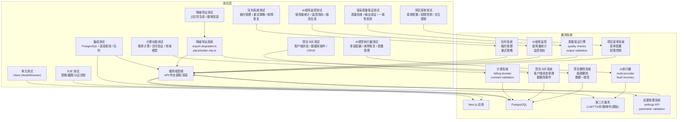

**图示来源** 
- [vitest.config.ts](file://vitest.config.ts)
- [vitest.pg.config.ts](file://vitest.pg.config.ts)
- [scripts/verify/e2e-smoke.ts](file://scripts/verify/e2e-smoke.ts)
- [src/features/render/renderer.integration.test.ts](file://src/features/render/renderer.integration.test.ts)
- [src/lib/db/index.ts](file://src/lib/db/index.ts)
- [src/features/render/export-degraded.test.ts](file://src/features/render/export-degraded.test.ts)
- [src/features/render/placeholder-clip.test.ts](file://src/features/render/placeholder-clip.test.ts)
- [src/features/render/export-degraded.ts](file://src/features/render/export-degraded.ts)
- [src/features/render/placeholder-clip.ts](file://src/features/render/placeholder-clip.ts)
- [src/lib/queue/lease-manager.test.ts](file://src/lib/queue/lease-manager.test.ts)
- [src/lib/queue/retry-policy.test.ts](file://src/lib/queue/retry-policy.test.ts)
- [src/features/usage/service.pg.test.ts](file://src/features/usage/service.pg.test.ts)
- [src/features/billing/billing.pg.test.ts](file://src/features/billing/billing.pg.test.ts)
- [src/features/billing/contracts.test.ts](file://src/features/billing/contracts.test.ts)
- [src/features/billing/domain.test.ts](file://src/features/billing/domain.test.ts)
- [src/app/api/settings/route.test.ts](file://src/app/api/settings/route.test.ts)
- [src/features/ai/managed-vision-executor.test.ts](file://src/features/ai/managed-vision-executor.test.ts)
- [src/features/render/vision-qa.test.ts](file://src/features/render/vision-qa.test.ts)
- [src/features/render/qa-check.test.ts](file://src/features/render/qa-check.test.ts)
- [src/features/projects/project-cards-client.test.ts](file://src/features/projects/project-cards-client.test.ts)
- [src/features/projects/project-cards.pg.test.ts](file://src/features/projects/project-cards.pg.test.ts)
- [src/features/projects/project-deletion.pg.test.ts](file://src/features/projects/project-deletion.pg.test.ts)
- [src/features/projects/project-menu-items.test.ts](file://src/features/projects/project-menu-items.test.ts)

## 详细组件分析

### 单元测试（Vitest）
- 配置要点
  - 根配置 vitest.config.ts 定义全局环境、测试匹配规则、覆盖率开关与报告输出
  - 针对浏览器组件与 Node 逻辑分别启用对应环境
- 使用建议
  - 将 UI 交互逻辑拆分为可测的小组件，优先在 Node 环境断言状态变化
  - 对副作用（网络、文件系统、时间）使用 Mock 或虚拟时钟
- 覆盖率
  - 建议在 CI 中开启覆盖率收集，按模块设定阈值，避免全量强制导致维护成本过高

**章节来源**
- [vitest.config.ts](file://vitest.config.ts)

### 集成测试（PostgreSQL）
- 配置与运行
  - 使用 vitest.pg.config.ts 启动 PostgreSQL 测试套件，确保与生产一致的 SQL 方言与事务行为
  - 通过 drizzle.config.ts 与 src/lib/db/index.ts 管理迁移与连接
- 典型场景
  - 数据仓储层：src/features/*/repository.pg.test.ts
  - 认证账户服务：src/features/auth/account-service.pg.test.ts
  - 渲染缓存与仓库：src/features/render/{cache,repository}.pg.test.ts
  - 媒体路由：src/features/routing/*-repository.pg.test.ts
  - **新增**：队列租约管理：src/lib/queue/lease-manager.test.ts
  - **新增**：重试策略测试：src/lib/queue/retry-policy.test.ts
  - **新增**：AI使用监控：src/features/usage/service.pg.test.ts
  - **新增**：计费数据仓储：src/features/billing/billing.pg.test.ts
  - **新增**：项目卡片数据库操作：src/features/projects/project-cards.pg.test.ts
  - **新增**：项目删除操作：src/features/projects/project-deletion.pg.test.ts
- 数据准备与清理
  - 每个测试用例使用事务包裹，测试后回滚，保证幂等与隔离

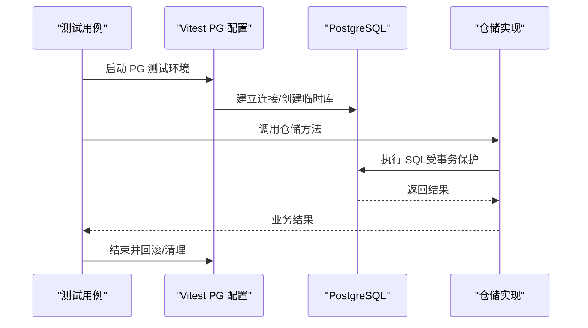

**图示来源** 
- [vitest.pg.config.ts](file://vitest.pg.config.ts)
- [drizzle.config.ts](file://drizzle.config.ts)
- [src/lib/db/index.ts](file://src/lib/db/index.ts)
- [src/features/render/cache.pg.test.ts](file://src/features/render/cache.pg.test.ts)
- [src/features/render/repository.pg.test.ts](file://src/features/render/repository.pg.test.ts)
- [src/features/auth/account-service.pg.test.ts](file://src/features/auth/account-service.pg.test.ts)
- [src/lib/queue/lease-manager.test.ts](file://src/lib/queue/lease-manager.test.ts)
- [src/lib/queue/retry-policy.test.ts](file://src/lib/queue/retry-policy.test.ts)
- [src/features/usage/service.pg.test.ts](file://src/features/usage/service.pg.test.ts)
- [src/features/billing/billing.pg.test.ts](file://src/features/billing/billing.pg.test.ts)
- [src/features/projects/project-cards.pg.test.ts](file://src/features/projects/project-cards.pg.test.ts)
- [src/features/projects/project-deletion.pg.test.ts](file://src/features/projects/project-deletion.pg.test.ts)

**章节来源**
- [vitest.pg.config.ts](file://vitest.pg.config.ts)
- [drizzle.config.ts](file://drizzle.config.ts)
- [src/lib/db/index.ts](file://src/lib/db/index.ts)
- [src/features/render/cache.pg.test.ts](file://src/features/render/cache.pg.test.ts)
- [src/features/render/repository.pg.test.ts](file://src/features/render/repository.pg.test.ts)
- [src/features/auth/account-service.pg.test.ts](file://src/features/auth/account-service.pg.test.ts)
- [src/features/credentials/provider-credential-store.pg.test.ts](file://src/features/credentials/provider-credential-store.pg.test.ts)
- [src/features/routing/media-route-repository.pg.test.ts](file://src/features/routing/media-route-repository.pg.test.ts)
- [src/features/routing/model-route-repository.pg.test.ts](file://src/features/routing/model-route-repository.pg.test.ts)
- [src/lib/queue/lease-manager.test.ts](file://src/lib/queue/lease-manager.test.ts)
- [src/lib/queue/retry-policy.test.ts](file://src/lib/queue/retry-policy.test.ts)
- [src/features/usage/service.pg.test.ts](file://src/features/usage/service.pg.test.ts)
- [src/features/billing/billing.pg.test.ts](file://src/features/billing/billing.pg.test.ts)
- [src/features/projects/project-cards.pg.test.ts](file://src/features/projects/project-cards.pg.test.ts)
- [src/features/projects/project-deletion.pg.test.ts](file://src/features/projects/project-deletion.pg.test.ts)

### API 测试
- 目标
  - 验证 Next.js API 路由的请求/响应契约、错误码、鉴权路径
- 示例范围
  - 制品路由：src/app/api/artifacts/[id]/route.test.ts
  - 导演流水线：src/app/api/director/pipeline/route.test.ts
  - 渲染导出：src/app/api/render/export/route.test.ts
  - **新增**：设置路由：src/app/api/settings/route.test.ts
- 策略
  - 构造最小请求体，断言状态码与关键字段
  - 对鉴权中间件进行白盒校验（成功/失败分支）
  - **新增**：参数校验和类型转换验证
  - **新增**：权限控制和访问验证测试

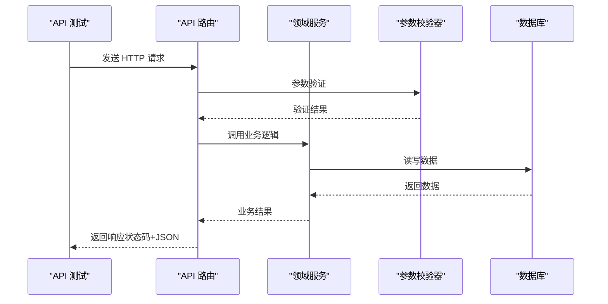

**图示来源** 
- [src/app/api/artifacts/[id]/route.test.ts](file://src/app/api/artifacts/[id]/route.test.ts)
- [src/app/api/director/pipeline/route.test.ts](file://src/app/api/director/pipeline/route.test.ts)
- [src/app/api/render/export/route.test.ts](file://src/app/api/render/export/route.test.ts)
- [src/app/api/settings/route.test.ts](file://src/app/api/settings/route.test.ts)

**章节来源**
- [src/app/api/artifacts/[id]/route.test.ts](file://src/app/api/artifacts/[id]/route.test.ts)
- [src/app/api/director/pipeline/route.test.ts](file://src/app/api/director/pipeline/route.test.ts)
- [src/app/api/render/export/route.test.ts](file://src/app/api/render/export/route.test.ts)
- [src/app/api/settings/route.test.ts](file://src/app/api/settings/route.test.ts)

### 渲染与媒体集成测试
- 目标
  - 验证渲染管线、帧序列、缩略图生成、缓存命中与失效
- 关键文件
  - 渲染器集成：src/features/render/renderer.integration.test.ts
  - 缩略图集成：src/features/render/thumbnail.integration.pg.test.ts
  - 编码与拼接：src/features/render/{encode,concat}.ts 对应的测试
- 策略
  - 使用固定输入与期望输出（黄金集），确保确定性
  - 对 FFmpeg/媒体处理进行隔离或轻量模拟

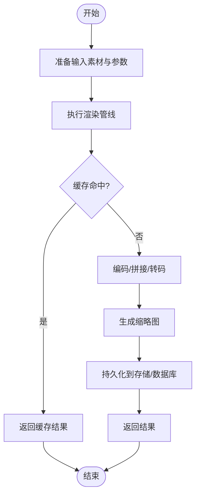

**图示来源** 
- [src/features/render/renderer.integration.test.ts](file://src/features/render/renderer.integration.test.ts)
- [src/features/render/thumbnail.integration.pg.test.ts](file://src/features/render/thumbnail.integration.pg.test.ts)
- [src/features/render/cache.pg.test.ts](file://src/features/render/cache.pg.test.ts)

**章节来源**
- [src/features/render/renderer.integration.test.ts](file://src/features/render/renderer.integration.test.ts)
- [src/features/render/thumbnail.integration.pg.test.ts](file://src/features/render/thumbnail.integration.pg.test.ts)
- [src/features/render/cache.pg.test.ts](file://src/features/render/cache.pg.test.ts)

### 降级导出系统测试
- 目标
  - 验证降级导出逻辑、占位符生成、媒体回退机制和错误处理
- 关键测试文件
  - export-degraded.test.ts：测试降级导出的完整流程和边界条件
  - placeholder-clip.test.ts：验证占位符生成的各种场景和格式支持
- 测试策略
  - 模拟媒体资源不可用的异常情况，验证系统的优雅降级能力
  - 测试占位符的生成逻辑，包括尺寸适配、格式转换和质量控制
  - 验证队列处理的容错性和恢复机制
  - 确保API契约在降级模式下仍然保持一致性

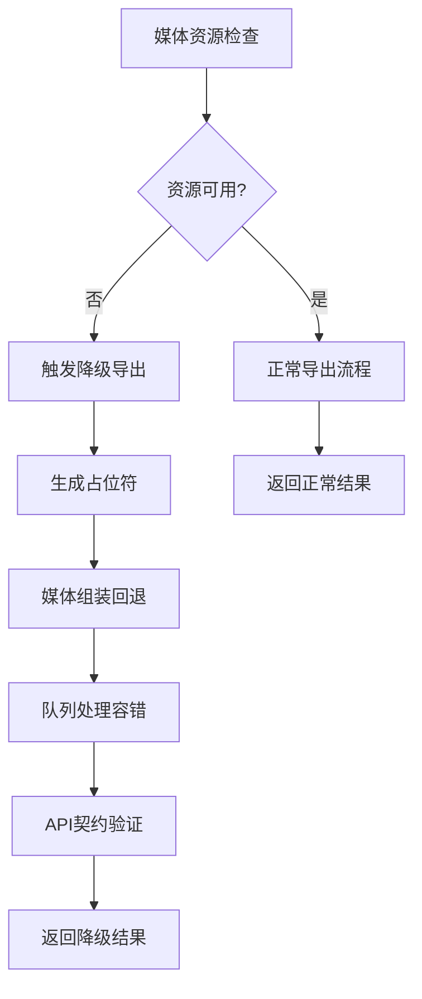

**图示来源** 
- [src/features/render/export-degraded.test.ts](file://src/features/render/export-degraded.test.ts)
- [src/features/render/placeholder-clip.test.ts](file://src/features/render/placeholder-clip.test.ts)
- [src/features/render/export-degraded.ts](file://src/features/render/export-degraded.ts)
- [src/features/render/placeholder-clip.ts](file://src/features/render/placeholder-clip.ts)

**章节来源**
- [src/features/render/export-degraded.test.ts](file://src/features/render/export-degraded.test.ts)
- [src/features/render/placeholder-clip.test.ts](file://src/features/render/placeholder-clip.test.ts)
- [src/features/render/export-degraded.ts](file://src/features/render/export-degraded.ts)
- [src/features/render/placeholder-clip.ts](file://src/features/render/placeholder-clip.ts)

### 队列系统测试（新增）
- 目标
  - 验证队列租约管理、重试策略和故障恢复机制的可靠性
- 关键测试文件
  - lease-manager.test.ts：队列租约管理的核心功能测试
  - retry-policy.test.ts：重试策略的配置和执行测试
- 测试策略
  - 模拟并发访问场景，验证租约分配的公平性和安全性
  - 测试租约超时处理和自动释放机制
  - 验证不同重试策略的执行逻辑（指数退避、固定间隔等）
  - 模拟队列服务故障，测试系统的恢复能力
  - 确保在高负载下的稳定性和性能

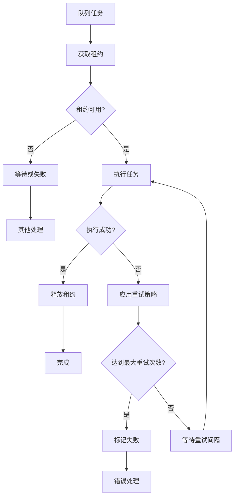

**图示来源** 
- [src/lib/queue/lease-manager.test.ts](file://src/lib/queue/lease-manager.test.ts)
- [src/lib/queue/retry-policy.test.ts](file://src/lib/queue/retry-policy.test.ts)

**章节来源**
- [src/lib/queue/lease-manager.test.ts](file://src/lib/queue/lease-manager.test.ts)
- [src/lib/queue/retry-policy.test.ts](file://src/lib/queue/retry-policy.test.ts)

### AI使用监控测试（新增）
- 目标
  - 验证AI使用量的统计、监控指标收集和报告生成功能
- 关键测试文件
  - service.pg.test.ts：AI使用监控服务的数据库集成测试
- 测试策略
  - 模拟各种AI服务的使用场景，验证使用量的准确统计
  - 测试监控指标的收集和聚合逻辑
  - 验证时间范围查询和数据过滤功能
  - 测试报告生成的格式和内容正确性
  - 确保大数据量下的查询性能和准确性

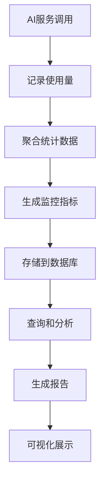

**图示来源** 
- [src/features/usage/service.pg.test.ts](file://src/features/usage/service.pg.test.ts)

**章节来源**
- [src/features/usage/service.pg.test.ts](file://src/features/usage/service.pg.test.ts)

### 计费功能测试（新增）
- 目标
  - 验证计费逻辑、合同验证、领域模型和业务规则的准确性
- 关键测试文件
  - billing.pg.test.ts：数据库集成的计费操作测试
  - contracts.test.ts：计费合同验证和解析测试
  - domain.test.ts：计费领域模型和业务规则测试
  - invocation-number.test.ts：调用编号生成和格式验证测试
  - rate-card.test.ts：费率卡管理和价格计算测试
  - schema.test.ts：计费数据结构和验证测试
- 测试策略
  - 模拟各种计费场景，包括正常计费、折扣应用、超限处理
  - 验证合同条款的正确解析和应用
  - 测试领域模型的不变量和业务约束
  - 确保计费数据的准确性和一致性

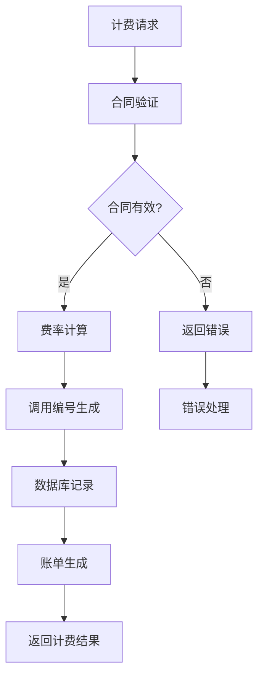

**图示来源** 
- [src/features/billing/billing.pg.test.ts](file://src/features/billing/billing.pg.test.ts)
- [src/features/billing/contracts.test.ts](file://src/features/billing/contracts.test.ts)
- [src/features/billing/domain.test.ts](file://src/features/billing/domain.test.ts)
- [src/features/billing/invocation-number.test.ts](file://src/features/billing/invocation-number.test.ts)
- [src/features/billing/rate-card.test.ts](file://src/features/billing/rate-card.test.ts)
- [src/features/billing/schema.test.ts](file://src/features/billing/schema.test.ts)

**章节来源**
- [src/features/billing/billing.pg.test.ts](file://src/features/billing/billing.pg.test.ts)
- [src/features/billing/contracts.test.ts](file://src/features/billing/contracts.test.ts)
- [src/features/billing/domain.test.ts](file://src/features/billing/domain.test.ts)
- [src/features/billing/invocation-number.test.ts](file://src/features/billing/invocation-number.test.ts)
- [src/features/billing/rate-card.test.ts](file://src/features/billing/rate-card.test.ts)
- [src/features/billing/schema.test.ts](file://src/features/billing/schema.test.ts)

### 设置路由测试（新增）
- 目标
  - 验证设置API接口的请求响应契约、参数校验和权限控制
- 关键测试文件
  - settings/route.test.ts：设置路由的完整测试覆盖
- 测试策略
  - 测试所有设置项的CRUD操作
  - 验证参数类型转换和格式校验
  - 测试权限控制和访问验证
  - 确保设置变更的原子性和一致性

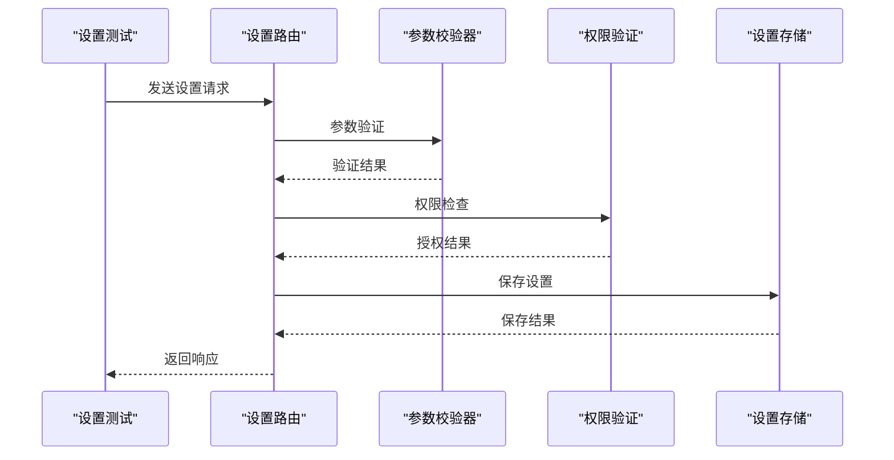

**图示来源** 
- [src/app/api/settings/route.test.ts](file://src/app/api/settings/route.test.ts)

**章节来源**
- [src/app/api/settings/route.test.ts](file://src/app/api/settings/route.test.ts)

### AI视觉执行器测试（新增）
- 目标
  - 验证AI视觉执行器的核心功能、多适配器支持和故障恢复机制
- 关键测试文件
  - managed-vision-executor.test.ts：视觉执行器的核心功能测试
  - config.test.ts：配置管理和验证测试
  - gemini-adapter.test.ts：Gemini适配器测试
  - mimo-adapter.test.ts：Mimo适配器测试
  - stepfun-adapter.test.ts：StepFun适配器测试
  - managed-credentials.test.ts：凭据管理测试
  - managed-gateway.test.ts：网关服务测试
  - managed-service.test.ts：管理服务测试
  - model-routing.test.ts：模型路由测试
  - provider-breaker.test.ts：提供商断路器测试
  - provider-registry.test.ts：提供商注册表测试
  - openai-compatible-*：OpenAI兼容适配器测试
- 测试策略
  - 模拟各种AI服务提供商的响应和错误场景
  - 测试故障转移和降级机制
  - 验证配置管理和凭据安全
  - 确保模型路由的正确性和性能

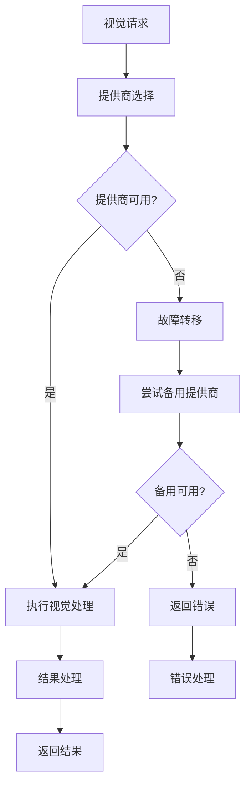

**图示来源** 
- [src/features/ai/managed-vision-executor.test.ts](file://src/features/ai/managed-vision-executor.test.ts)
- [src/features/ai/config.test.ts](file://src/features/ai/config.test.ts)
- [src/features/ai/gemini-adapter.test.ts](file://src/features/ai/gemini-adapter.test.ts)
- [src/features/ai/mimo-adapter.test.ts](file://src/features/ai/mimo-adapter.test.ts)
- [src/features/ai/stepfun-adapter.test.ts](file://src/features/ai/stepfun-adapter.test.ts)
- [src/features/ai/managed-credentials.test.ts](file://src/features/ai/managed-credentials.test.ts)
- [src/features/ai/managed-gateway.test.ts](file://src/features/ai/managed-gateway.test.ts)
- [src/features/ai/managed-service.test.ts](file://src/features/ai/managed-service.test.ts)
- [src/features/ai/model-routing.test.ts](file://src/features/ai/model-routing.test.ts)
- [src/features/ai/provider-breaker.test.ts](file://src/features/ai/provider-breaker.test.ts)
- [src/features/ai/provider-registry.test.ts](file://src/features/ai/provider-registry.test.ts)

**章节来源**
- [src/features/ai/managed-vision-executor.test.ts](file://src/features/ai/managed-vision-executor.test.ts)
- [src/features/ai/config.test.ts](file://src/features/ai/config.test.ts)
- [src/features/ai/gemini-adapter.test.ts](file://src/features/ai/gemini-adapter.test.ts)
- [src/features/ai/gemini-config.test.ts](file://src/features/ai/gemini-config.test.ts)
- [src/features/ai/managed-credentials.test.ts](file://src/features/ai/managed-credentials.test.ts)
- [src/features/ai/managed-gateway.test.ts](file://src/features/ai/managed-gateway.test.ts)
- [src/features/ai/managed-service.test.ts](file://src/features/ai/managed-service.test.ts)
- [src/features/ai/mimo-adapter.test.ts](file://src/features/ai/mimo-adapter.test.ts)
- [src/features/ai/mimo-config.test.ts](file://src/features/ai/mimo-config.test.ts)
- [src/features/ai/model-routing.test.ts](file://src/features/ai/model-routing.test.ts)
- [src/features/ai/openai-compatible-audio-config.test.ts](file://src/features/ai/openai-compatible-audio-config.test.ts)
- [src/features/ai/openai-compatible-config.test.ts](file://src/features/ai/openai-compatible-config.test.ts)
- [src/features/ai/openai-compatible-payloads.test.ts](file://src/features/ai/openai-compatible-payloads.test.ts)
- [src/features/ai/provider-breaker.test.ts](file://src/features/ai/provider-breaker.test.ts)
- [src/features/ai/provider-registry.test.ts](file://src/features/ai/provider-registry.test.ts)
- [src/features/ai/stepfun-adapter.test.ts](file://src/features/ai/stepfun-adapter.test.ts)

### 渲染质量保证测试（新增）
- 目标
  - 验证渲染输出的质量检查、一致性检测和格式验证
- 关键测试文件
  - vision-qa.test.ts：视觉质量检查和验证测试
  - qa-check.test.ts：质量保证流程和标准测试
- 测试策略
  - 测试各种质量指标的计算和验证
  - 验证输出格式的一致性和兼容性
  - 模拟质量不达标场景的处理逻辑
  - 确保质量检查的性能和准确性

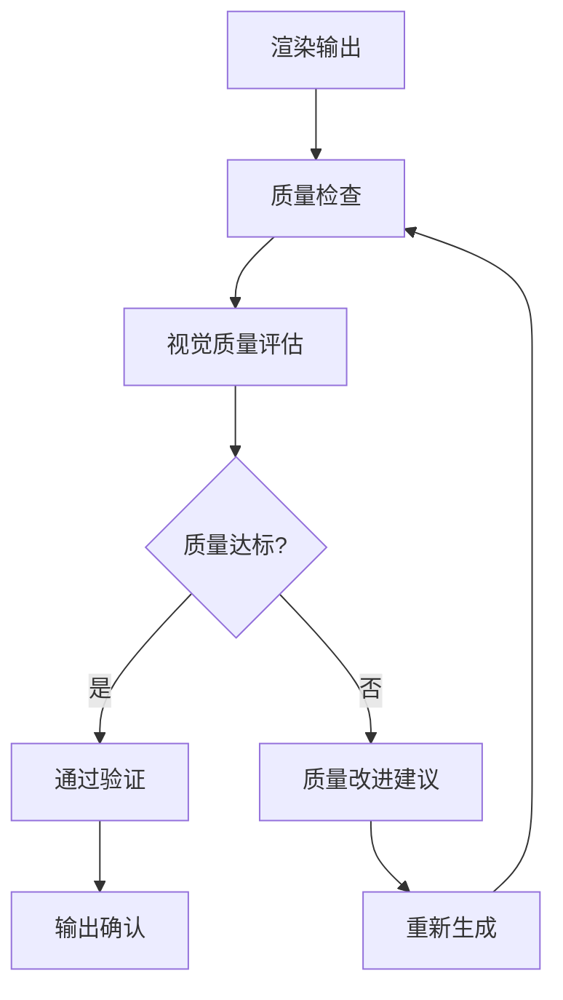

**图示来源** 
- [src/features/render/vision-qa.test.ts](file://src/features/render/vision-qa.test.ts)
- [src/features/render/qa-check.test.ts](file://src/features/render/qa-check.test.ts)

**章节来源**
- [src/features/render/vision-qa.test.ts](file://src/features/render/vision-qa.test.ts)
- [src/features/render/qa-check.test.ts](file://src/features/render/qa-check.test.ts)

### 项目卡片测试（新增）
- 目标
  - 验证项目卡片功能的客户端状态管理和PostgreSQL数据库操作
- 关键测试文件
  - project-cards-client.test.ts：客户端组件状态管理和交互测试
  - project-cards.pg.test.ts：PostgreSQL数据库操作集成测试
- 测试策略
  - 模拟项目数据的CRUD操作，验证数据一致性
  - 测试客户端状态同步和缓存机制
  - 验证搜索过滤和排序功能的准确性
  - 测试数据库事务和并发访问的安全性
  - 确保UI交互的响应性和用户体验

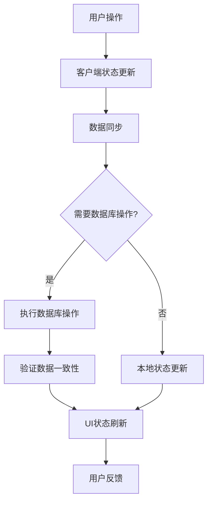

**图示来源** 
- [src/features/projects/project-cards-client.test.ts](file://src/features/projects/project-cards-client.test.ts)
- [src/features/projects/project-cards.pg.test.ts](file://src/features/projects/project-cards.pg.test.ts)

**章节来源**
- [src/features/projects/project-cards-client.test.ts](file://src/features/projects/project-cards-client.test.ts)
- [src/features/projects/project-cards-client.ts](file://src/features/projects/project-cards-client.ts)
- [src/features/projects/project-cards.pg.test.ts](file://src/features/projects/project-cards.pg.test.ts)
- [src/features/projects/project-cards.ts](file://src/features/projects/project-cards.ts)

### 项目删除测试（新增）
- 目标
  - 验证项目删除功能的PostgreSQL集成测试，确保数据一致性和级联删除的正确性
- 关键测试文件
  - project-deletion.pg.test.ts：项目删除的PostgreSQL集成测试
- 测试策略
  - 模拟项目删除的各种场景，包括有依赖和无依赖的项目
  - 验证级联删除的正确性和完整性
  - 测试事务处理和回滚机制
  - 验证关联资源的清理逻辑
  - 确保删除操作的幂等性和安全性

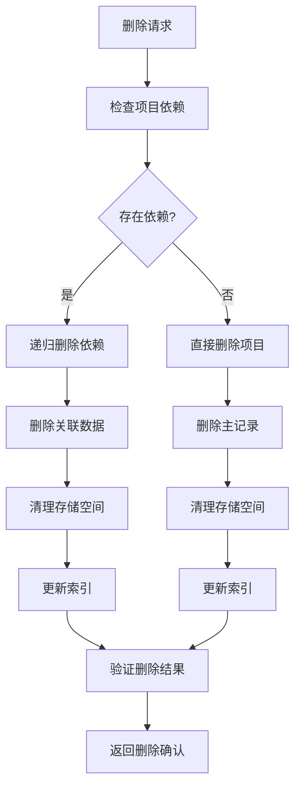

**图示来源** 
- [src/features/projects/project-deletion.pg.test.ts](file://src/features/projects/project-deletion.pg.test.ts)

**章节来源**
- [src/features/projects/project-deletion.pg.test.ts](file://src/features/projects/project-deletion.pg.test.ts)

### 项目菜单测试（新增）
- 目标
  - 验证项目菜单项的单元测试，确保菜单配置和交互逻辑的正确性
- 关键测试文件
  - project-menu-items.test.ts：项目菜单项的单元测试
- 测试策略
  - 测试菜单配置的加载和解析
  - 验证权限控制和访问验证
  - 测试动态菜单生成和更新
  - 验证菜单项的状态管理和交互逻辑
  - 确保菜单在不同用户角色下的正确显示

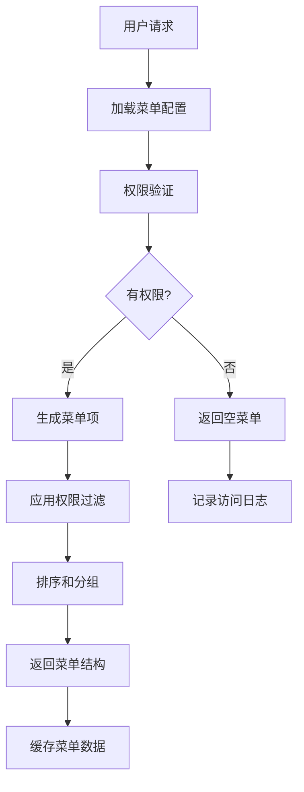

**图示来源** 
- [src/features/projects/project-menu-items.test.ts](file://src/features/projects/project-menu-items.test.ts)

**章节来源**
- [src/features/projects/project-menu-items.test.ts](file://src/features/projects/project-menu-items.test.ts)

### E2E 测试（浏览器自动化）
- 目标
  - 验证登录注册、页面导航、关键业务流程、截图一致性
- 脚本示例
  - 冒烟测试：scripts/verify/e2e-smoke.ts
  - 认证流程冒烟：scripts/verify/auth-flow-smoke.mjs
  - 截图基线：scripts/verify/capture-v3-baseline.ts
- 策略
  - 使用稳定的选择器与等待策略，避免偶发失败
  - 基线图片版本化管理，变更需人工确认

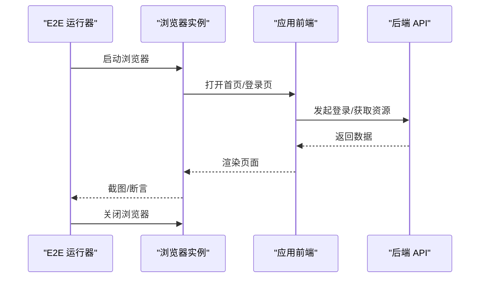

**图示来源** 
- [scripts/verify/e2e-smoke.ts](file://scripts/verify/e2e-smoke.ts)
- [scripts/verify/auth-flow-smoke.mjs](file://scripts/verify/auth-flow-smoke.mjs)
- [scripts/verify/capture-v3-baseline.ts](file://scripts/verify/capture-v3-baseline.ts)

**章节来源**
- [scripts/verify/e2e-smoke.ts](file://scripts/verify/e2e-smoke.ts)
- [scripts/verify/auth-flow-smoke.mjs](file://scripts/verify/auth-flow-smoke.mjs)
- [scripts/verify/capture-v3-baseline.ts](file://scripts/verify/capture-v3-baseline.ts)

### 性能测试（方法与建议）
- 负载测试
  - 使用压测工具对关键 API（登录、导出、渲染任务提交）施加并发请求，观察吞吐与延迟
- 压力测试
  - 逐步增加并发直至系统瓶颈，记录错误率与资源占用
- 基准测试
  - 对渲染管线、编码、数据库查询建立回归基准，对比版本差异
- 指标采集
  - 结合应用内指标与系统监控（CPU、内存、I/O、DB 连接池）
- 降级导出性能测试
  - 验证降级模式下的性能影响和资源消耗
  - 测试占位符生成的性能特征和可扩展性
- **新增**：队列系统性能测试
  - 验证高并发下的租约管理性能
  - 测试重试策略对系统负载的影响
  - 监控队列处理的吞吐量和延迟
- **新增**：AI使用监控性能测试
  - 验证大量使用记录的统计性能
  - 测试监控指标聚合的效率
  - 监控数据库查询的响应时间
- **新增**：计费功能性能测试
  - 验证计费计算的响应时间和吞吐量
  - 测试并发计费请求的处理能力
  - 监控数据库操作的锁竞争和性能瓶颈
- **新增**：AI视觉执行器性能测试
  - 测试多提供商调用的延迟和成功率
  - 验证故障转移的性能影响
  - 监控提供商限流和重试机制的效果
- **新增**：渲染质量保证性能测试
  - 验证质量检查算法的执行效率
  - 测试大规模输出的批量处理能力
  - 监控内存使用和CPU占用
- **新增**：项目卡片性能测试
  - 验证项目数据加载和渲染性能
  - 测试搜索过滤和排序操作的响应时间
  - 监控客户端状态同步的开销
- **新增**：项目删除性能测试
  - 验证级联删除的性能影响
  - 测试大数据量删除操作的响应时间
  - 监控删除操作的事务性能
- **新增**：项目菜单性能测试
  - 验证菜单配置的加载性能
  - 测试权限验证的响应时间
  - 监控菜单缓存的有效性

[本节为通用指导，不直接分析具体文件]

## 依赖分析
测试与系统的依赖关系如下：

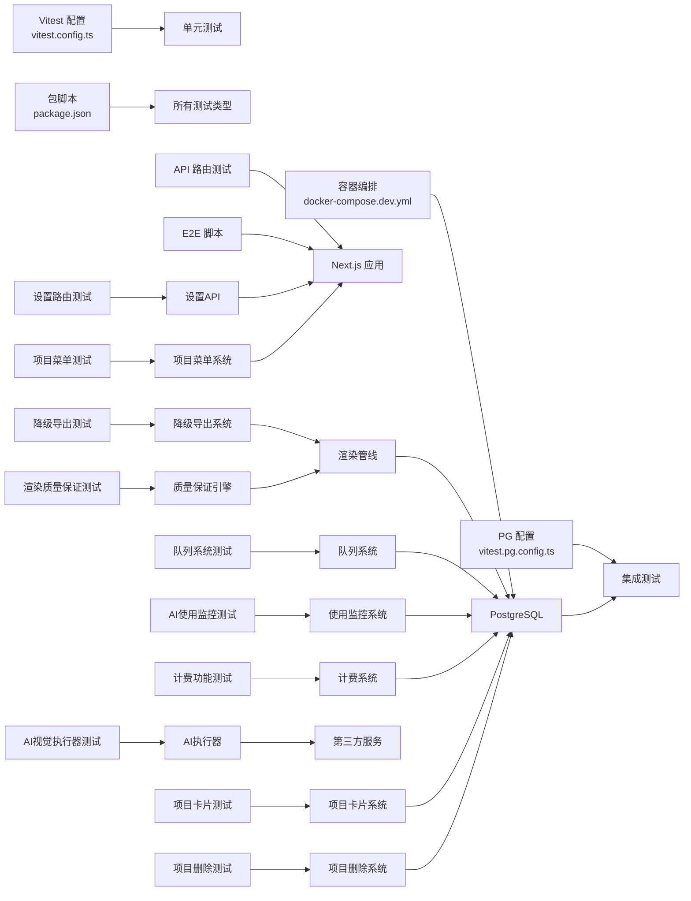

**图示来源** 
- [vitest.config.ts](file://vitest.config.ts)
- [vitest.pg.config.ts](file://vitest.pg.config.ts)
- [package.json](file://package.json)
- [docker-compose.dev.yml](file://docker-compose.dev.yml)
- [src/app/api/artifacts/[id]/route.test.ts](file://src/app/api/artifacts/[id]/route.test.ts)
- [scripts/verify/e2e-smoke.ts](file://scripts/verify/e2e-smoke.ts)
- [src/features/render/export-degraded.test.ts](file://src/features/render/export-degraded.test.ts)
- [src/features/render/export-degraded.ts](file://src/features/render/export-degraded.ts)
- [src/lib/queue/lease-manager.test.ts](file://src/lib/queue/lease-manager.test.ts)
- [src/lib/queue/retry-policy.test.ts](file://src/lib/queue/retry-policy.test.ts)
- [src/features/usage/service.pg.test.ts](file://src/features/usage/service.pg.test.ts)
- [src/features/billing/billing.pg.test.ts](file://src/features/billing/billing.pg.test.ts)
- [src/app/api/settings/route.test.ts](file://src/app/api/settings/route.test.ts)
- [src/features/ai/managed-vision-executor.test.ts](file://src/features/ai/managed-vision-executor.test.ts)
- [src/features/render/vision-qa.test.ts](file://src/features/render/vision-qa.test.ts)
- [src/features/projects/project-cards-client.test.ts](file://src/features/projects/project-cards-client.test.ts)
- [src/features/projects/project-cards.pg.test.ts](file://src/features/projects/project-cards.pg.test.ts)
- [src/features/projects/project-deletion.pg.test.ts](file://src/features/projects/project-deletion.pg.test.ts)
- [src/features/projects/project-menu-items.test.ts](file://src/features/projects/project-menu-items.test.ts)

**章节来源**
- [vitest.config.ts](file://vitest.config.ts)
- [vitest.pg.config.ts](file://vitest.pg.config.ts)
- [package.json](file://package.json)
- [docker-compose.dev.yml](file://docker-compose.dev.yml)

## 性能考虑
- 测试执行速度
  - 合理拆分测试套件，避免单文件过大；并行执行时注意共享资源隔离
- 数据库测试
  - 使用事务与内存表（如适用）减少 I/O；控制种子数据规模
- 渲染与媒体
  - 使用小体积样本与预缓存；避免每次测试都触发重型编码
- 覆盖率
  - 以模块为单位设定阈值，关注关键路径而非盲目追求数值
- 降级导出性能优化
  - 优化占位符生成的缓存策略，避免重复计算
  - 批量处理降级导出任务，提高吞吐量
  - 监控降级模式的性能指标，确保不影响正常业务流程
- **新增**：队列系统性能优化
  - 优化租约分配的并发控制机制
  - 实现智能的重试策略配置
  - 监控队列处理的性能指标和瓶颈
- **新增**：AI使用监控性能优化
  - 实现使用量统计的异步处理
  - 优化监控指标的聚合算法
  - 监控数据库查询的性能和索引效率
- **新增**：计费功能性能优化
  - 优化计费计算的缓存策略，减少重复计算
  - 批量处理计费请求，提高吞吐量
  - 监控数据库操作的索引效率和查询性能
- **新增**：AI视觉执行器性能优化
  - 实现提供商响应的缓存机制
  - 优化故障转移的决策逻辑
  - 监控提供商调用的超时和重试策略
- **新增**：渲染质量保证性能优化
  - 优化质量检查算法的效率
  - 实现批量质量检查的并行处理
  - 监控质量检查的资源使用情况
- **新增**：项目卡片性能优化
  - 优化项目数据加载和缓存策略
  - 实现搜索过滤的增量更新
  - 监控客户端状态同步的性能开销
- **新增**：项目删除性能优化
  - 优化级联删除的批处理机制
  - 实现异步删除任务的队列处理
  - 监控删除操作的事务性能
- **新增**：项目菜单性能优化
  - 实现菜单配置的缓存机制
  - 优化权限验证的查询效率
  - 监控菜单加载的性能指标

[本节为通用指导，不直接分析具体文件]

## 故障排查指南
- 常见问题
  - 端口冲突：检查 docker-compose 端口映射与本地占用
  - 数据库连接失败：确认环境变量、迁移是否执行、连接字符串正确
  - 测试不稳定：检查随机性、竞态条件、未清理状态
  - 降级导出失败：检查媒体资源可用性、占位符生成权限、队列服务状态
  - **新增**：队列系统问题：检查租约超时配置、重试策略设置、并发控制参数
  - **新增**：AI使用监控问题：检查使用量记录、指标聚合、数据库写入
  - **新增**：计费功能问题：检查合同配置、费率卡设置、调用编号生成
  - **新增**：设置路由问题：检查参数校验规则、权限配置、存储访问
  - **新增**：AI视觉执行器问题：检查提供商API密钥、网络连接、限流策略
  - **新增**：渲染质量保证问题：检查质量阈值配置、检查算法参数、输出格式
  - **新增**：项目卡片问题：检查数据库连接、状态同步、缓存一致性
  - **新增**：项目删除问题：检查级联删除配置、事务处理、资源清理
  - **新增**：项目菜单问题：检查权限配置、菜单缓存、动态生成逻辑
- 定位手段
  - 缩小测试范围，聚焦失败用例
  - 打印关键上下文（请求 ID、事务 ID、步骤名）
  - 使用慢查询日志与数据库监控定位热点
  - 监控降级导出日志，追踪媒体回退路径和错误堆栈
  - **新增**：监控队列系统日志，追踪租约分配、重试逻辑和故障恢复
  - **新增**：检查AI使用监控的统计日志和指标数据
  - **新增**：监控计费功能日志，追踪账单计算过程和异常
  - **新增**：检查设置路由的访问日志和权限审计
  - **新增**：监控AI提供商的调用日志和错误信息
  - **新增**：分析渲染质量检查的详细报告和诊断信息
  - **新增**：检查项目卡片的状态同步日志和数据库操作日志
  - **新增**：监控项目删除的事务日志和级联删除过程
  - **新增**：检查项目菜单的权限日志和缓存状态
- **新增**：队列系统问题诊断
  - 检查租约超时的配置和实际执行情况
  - 验证重试策略的参数设置和执行效果
  - 调试并发访问的锁竞争和死锁情况
  - 监控队列服务的健康状态和性能指标
- **新增**：AI使用监控问题诊断
  - 验证使用量记录的完整性和准确性
  - 检查监控指标聚合的逻辑和性能
  - 调试数据库查询的效率和索引使用
  - 分析报告生成的格式和内容正确性
- **新增**：计费功能问题诊断
  - 验证合同配置的语法和语义正确性
  - 检查费率卡的有效期和适用范围
  - 调试调用编号生成的唯一性和顺序性
  - 分析计费计算的精度和舍入规则
- **新增**：设置路由问题诊断
  - 检查参数类型的严格匹配和转换规则
  - 验证权限矩阵和访问控制列表
  - 调试设置变更的事务回滚机制
  - 监控设置同步的冲突解决策略
- **新增**：AI视觉执行器问题诊断
  - 验证提供商API的认证和授权流程
  - 检查网络连接的稳定性和超时设置
  - 调试故障转移的触发条件和恢复逻辑
  - 监控提供商限流的退避策略
- **新增**：渲染质量保证问题诊断
  - 检查质量阈值的合理性和动态调整
  - 调试质量检查算法的参数配置
  - 分析输出格式的兼容性和转换逻辑
  - 监控质量检查的性能和资源使用
- **新增**：项目卡片问题诊断
  - 检查数据库连接状态和事务完整性
  - 验证客户端状态同步的时序和一致性
  - 调试搜索过滤和排序逻辑的正确性
  - 监控缓存失效和重新加载的性能
- **新增**：项目删除问题诊断
  - 检查级联删除的配置和依赖关系
  - 验证事务回滚的完整性和一致性
  - 调试资源清理的顺序和完整性
  - 监控删除操作的性能和锁竞争
- **新增**：项目菜单问题诊断
  - 检查权限配置的正确性和有效性
  - 验证菜单缓存的更新机制
  - 调试动态菜单生成的逻辑
  - 监控菜单加载的性能和错误

**章节来源**
- [docker-compose.dev.yml](file://docker-compose.dev.yml)
- [drizzle.config.ts](file://drizzle.config.ts)
- [src/lib/db/index.ts](file://src/lib/db/index.ts)
- [src/features/render/export-degraded.test.ts](file://src/features/render/export-degraded.test.ts)
- [src/features/render/placeholder-clip.test.ts](file://src/features/render/placeholder-clip.test.ts)
- [src/lib/queue/lease-manager.test.ts](file://src/lib/queue/lease-manager.test.ts)
- [src/lib/queue/retry-policy.test.ts](file://src/lib/queue/retry-policy.test.ts)
- [src/features/usage/service.pg.test.ts](file://src/features/usage/service.pg.test.ts)
- [src/features/billing/billing.pg.test.ts](file://src/features/billing/billing.pg.test.ts)
- [src/app/api/settings/route.test.ts](file://src/app/api/settings/route.test.ts)
- [src/features/ai/managed-vision-executor.test.ts](file://src/features/ai/managed-vision-executor.test.ts)
- [src/features/render/vision-qa.test.ts](file://src/features/render/vision-qa.test.ts)
- [src/features/render/qa-check.test.ts](file://src/features/render/qa-check.test.ts)
- [src/features/projects/project-cards-client.test.ts](file://src/features/projects/project-cards-client.test.ts)
- [src/features/projects/project-cards.pg.test.ts](file://src/features/projects/project-cards.pg.test.ts)
- [src/features/projects/project-deletion.pg.test.ts](file://src/features/projects/project-deletion.pg.test.ts)
- [src/features/projects/project-menu-items.test.ts](file://src/features/projects/project-menu-items.test.ts)

## 结论
PurpleInk 的测试体系以 Vitest 为核心，结合 PostgreSQL 集成测试与 E2E 冒烟脚本，覆盖从单元到端到端的完整链路。**新增**的队列租约、重试策略、AI使用监控、计费功能、设置路由、AI视觉执行器、渲染质量保证、项目卡片、项目删除和项目菜单测试覆盖确保了系统在复杂业务场景下的健壮性和可靠性。**通过严格的 Mock 策略与容器化依赖，保证了测试的可重复性与稳定性**。建议持续完善覆盖率阈值、引入性能基准与回归基线，进一步提升交付质量与迭代效率。

## 附录
- 覆盖率与报告
  - 在 CI 中启用覆盖率收集，输出 HTML/文本报告，便于审查与归档
- 最佳实践
  - 命名清晰、职责单一、断言明确
  - 对外部依赖一律 Mock，保持测试快速与稳定
  - 对 UI 组件优先断言行为与状态，而非 DOM 细节
  - 为降级场景编写专门的测试用例，确保系统鲁棒性
  - **新增**：为队列系统编写并发和故障恢复测试
  - **新增**：为AI使用监控编写数据准确性和性能测试
  - **新增**：为计费逻辑编写全面的边界条件测试
  - **新增**：为AI提供商故障场景编写恢复测试
  - **新增**：为渲染质量检查编写阈值调整测试
  - **新增**：为项目卡片功能编写状态同步和数据库一致性测试
  - **新增**：为项目删除功能编写级联删除和事务回滚测试
  - **新增**：为项目菜单功能编写权限控制和动态生成测试
- 常见模式
  - 工厂函数生成测试数据
  - 夹具（Fixture）复用复杂对象
  - 参数化测试覆盖边界条件
  - 异常注入测试模式，模拟各种失败场景
  - **新增**：队列租约的模拟和状态切换模式
  - **新增**：重试策略的参数化和配置模式
  - **新增**：AI使用量的模拟和聚合模式
  - **新增**：计费场景的模拟数据生成模式
  - **新增**：AI提供商响应的模拟和变异模式
  - **新增**：质量检查阈值的参数化测试模式
  - **新增**：项目卡片状态的模拟和同步模式
  - **新增**：项目删除级联操作的模拟和验证模式
  - **新增**：项目菜单权限控制的模拟和测试模式

[本节为通用指导，不直接分析具体文件]