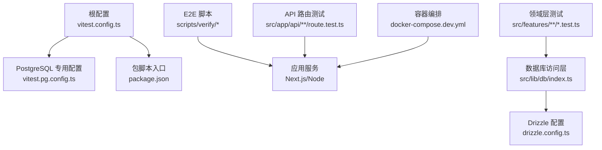
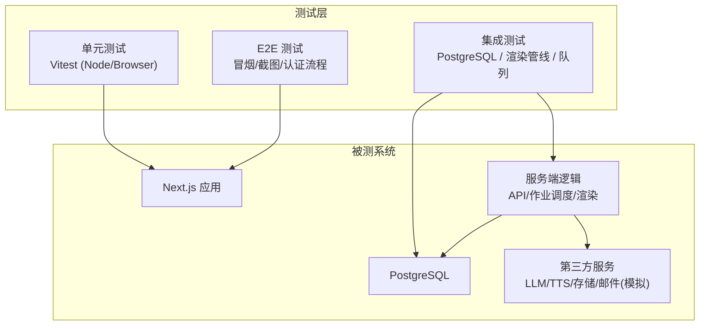
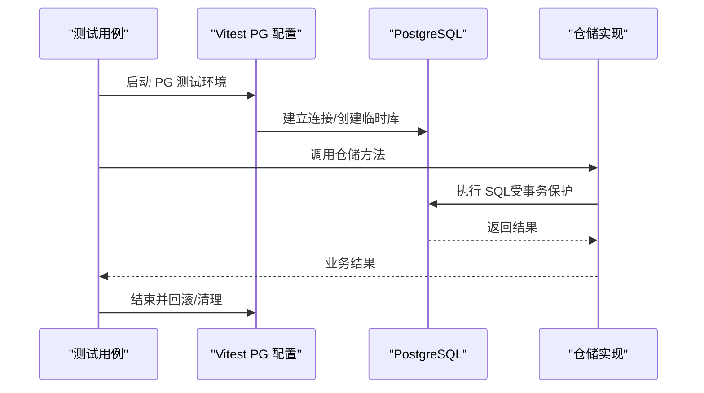
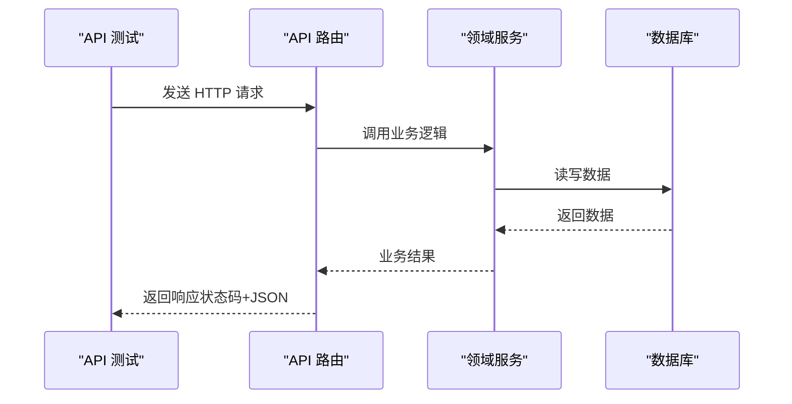
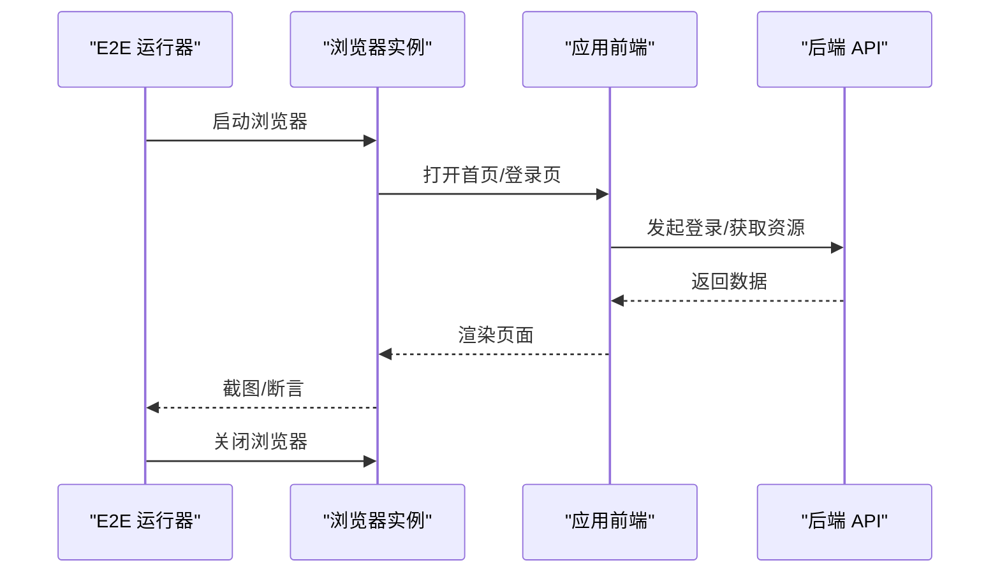
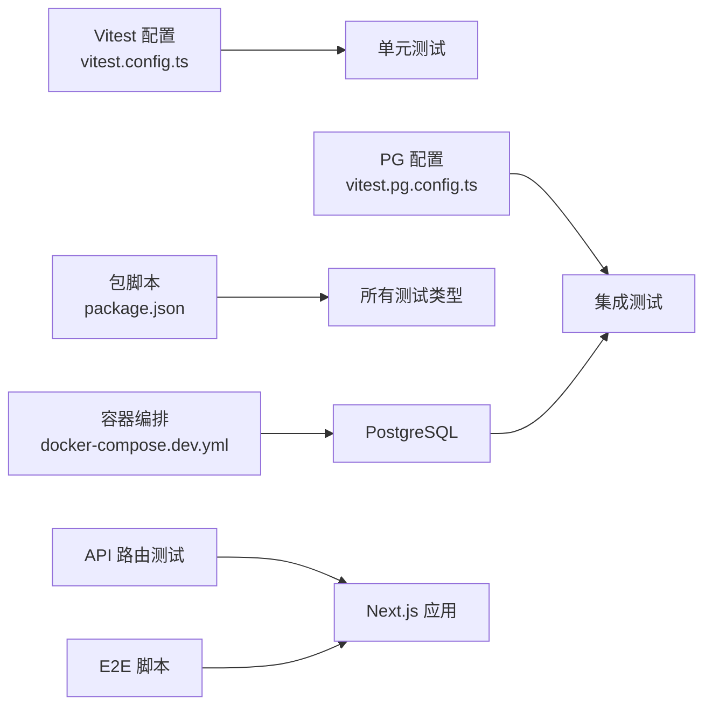

# 测试策略

<cite>
**本文引用的文件**   
- [vitest.config.ts](file://vitest.config.ts)
- [vitest.pg.config.ts](file://vitest.pg.config.ts)
- [package.json](file://package.json)
- [docker-compose.dev.yml](file://docker-compose.dev.yml)
- [scripts/verify/e2e-smoke.ts](file://scripts/verify/e2e-smoke.ts)
- [scripts/verify/auth-flow-smoke.mjs](file://scripts/verify/auth-flow-smoke.mjs)
- [scripts/verify/capture-v3-baseline.ts](file://scripts/verify/capture-v3-baseline.ts)
- [src/app/api/artifacts/[id]/route.test.ts](file://src/app/api/artifacts/[id]/route.test.ts)
- [src/app/api/director/pipeline/route.test.ts](file://src/app/api/director/pipeline/route.test.ts)
- [src/app/api/render/export/route.test.ts](file://src/app/api/render/export/route.test.ts)
- [src/features/audio/runtime-repository.pg.test.ts](file://src/features/audio/runtime-repository.pg.test.ts)
- [src/features/render/renderer.integration.test.ts](file://src/features/render/renderer.integration.test.ts)
- [src/features/render/thumbnail.integration.pg.test.ts](file://src/features/render/thumbnail.integration.pg.test.ts)
- [src/features/render/cache.pg.test.ts](file://src/features/render/cache.pg.test.ts)
- [src/features/render/repository.pg.test.ts](file://src/features/render/repository.pg.test.ts)
- [src/features/auth/account-service.pg.test.ts](file://src/features/auth/account-service.pg.test.ts)
- [src/features/credentials/provider-credential-store.pg.test.ts](file://src/features/credentials/provider-credential-store.pg.test.ts)
- [src/features/routing/media-route-repository.pg.test.ts](file://src/features/routing/media-route-repository.pg.test.ts)
- [src/features/routing/model-route-repository.pg.test.ts](file://src/features/routing/model-route-repository.pg.test.ts)
- [src/lib/db/index.ts](file://src/lib/db/index.ts)
- [drizzle.config.ts](file://drizzle.config.ts)
</cite>

## 目录
1. [简介](#简介)
2. [项目结构](#项目结构)
3. [核心组件](#核心组件)
4. [架构总览](#架构总览)
5. [详细组件分析](#详细组件分析)
6. [依赖分析](#依赖分析)
7. [性能考虑](#性能考虑)
8. [故障排查指南](#故障排查指南)
9. [结论](#结论)
10. [附录](#附录)

## 简介
本文件为 PurpleInk 的测试策略文档，覆盖单元测试、集成测试、端到端（E2E）测试与性能测试的方法论与实践。重点说明：
- 单元测试框架配置与使用（Vitest 设置、测试环境、Mock 策略）
- 集成测试设计（数据库测试、API 测试、第三方服务模拟）
- E2E 测试实现（浏览器自动化、用户流程、跨浏览器兼容）
- 性能测试方法（负载、压力、基准）
- 覆盖率要求与报告生成
- 最佳实践与常见模式

## 项目结构
仓库采用多包/多模块组织，测试相关的关键位置如下：
- 根级 Vitest 配置：vitest.config.ts、vitest.pg.config.ts
- 脚本与验证：scripts/verify/*（包含 E2E 冒烟、截图基线等）
- API 路由测试：src/app/api/**/route.test.ts
- 领域层测试：src/features/**/*.test.ts（含 .pg.test.ts 表示 PostgreSQL 集成测试）
- 数据库与迁移：drizzle.config.ts、src/lib/db/index.ts
- 开发依赖与服务编排：docker-compose.dev.yml、package.json

**图示来源** 
- [vitest.config.ts](file://vitest.config.ts)
- [vitest.pg.config.ts](file://vitest.pg.config.ts)
- [package.json](file://package.json)
- [scripts/verify/e2e-smoke.ts](file://scripts/verify/e2e-smoke.ts)
- [src/app/api/artifacts/[id]/route.test.ts](file://src/app/api/artifacts/[id]/route.test.ts)
- [src/lib/db/index.ts](file://src/lib/db/index.ts)
- [drizzle.config.ts](file://drizzle.config.ts)
- [docker-compose.dev.yml](file://docker-compose.dev.yml)

**章节来源**
- [vitest.config.ts](file://vitest.config.ts)
- [vitest.pg.config.ts](file://vitest.pg.config.ts)
- [package.json](file://package.json)
- [docker-compose.dev.yml](file://docker-compose.dev.yml)

## 核心组件
- 单元测试框架：Vitest
  - 通过根级 vitest.config.ts 统一启用 Node 环境与浏览器环境支持
  - 通过 vitest.pg.config.ts 提供 PostgreSQL 集成测试的独立运行入口
- 测试分类
  - 单元测试：*.test.ts（纯逻辑、工具函数、UI 组件片段）
  - 集成测试：*.integration.test.ts、*.pg.test.ts（数据库、渲染管线、队列处理）
  - E2E 测试：scripts/verify/*（冒烟、截图基线、认证流程）
- Mock 策略
  - 对第三方服务（LLM、TTS、存储、邮件等）进行接口隔离与替换
  - 使用本地桩或内存实现替代外部依赖，保证可重复性与快速执行

**章节来源**
- [vitest.config.ts](file://vitest.config.ts)
- [vitest.pg.config.ts](file://vitest.pg.config.ts)
- [src/app/api/artifacts/[id]/route.test.ts](file://src/app/api/artifacts/[id]/route.test.ts)
- [src/features/audio/runtime-repository.pg.test.ts](file://src/features/audio/runtime-repository.pg.test.ts)
- [src/features/render/renderer.integration.test.ts](file://src/features/render/renderer.integration.test.ts)

## 架构总览
测试体系围绕“单元—集成—E2E”三层展开，配合容器化数据库与本地服务，形成闭环质量保障。

**图示来源** 
- [vitest.config.ts](file://vitest.config.ts)
- [vitest.pg.config.ts](file://vitest.pg.config.ts)
- [scripts/verify/e2e-smoke.ts](file://scripts/verify/e2e-smoke.ts)
- [src/features/render/renderer.integration.test.ts](file://src/features/render/renderer.integration.test.ts)
- [src/lib/db/index.ts](file://src/lib/db/index.ts)

## 详细组件分析

### 单元测试（Vitest）
- 配置要点
  - 根配置 vitest.config.ts 定义全局环境、测试匹配规则、覆盖率开关与报告输出
  - 针对浏览器组件与 Node 逻辑分别启用对应环境
- 使用建议
  - 将 UI 交互逻辑拆分为可测的小组件，优先在 Node 环境断言状态变化
  - 对副作用（网络、文件系统、时间）使用 Mock 或虚拟时钟
- 覆盖率
  - 建议在 CI 中开启覆盖率收集，按模块设定阈值，避免全量强制导致维护成本过高

**章节来源**
- [vitest.config.ts](file://vitest.config.ts)

### 集成测试（PostgreSQL）
- 配置与运行
  - 使用 vitest.pg.config.ts 启动 PostgreSQL 测试套件，确保与生产一致的 SQL 方言与事务行为
  - 通过 drizzle.config.ts 与 src/lib/db/index.ts 管理迁移与连接
- 典型场景
  - 数据仓储层：src/features/*/repository.pg.test.ts
  - 认证账户服务：src/features/auth/account-service.pg.test.ts
  - 渲染缓存与仓库：src/features/render/{cache,repository}.pg.test.ts
  - 媒体路由：src/features/routing/*-repository.pg.test.ts
- 数据准备与清理
  - 每个测试用例使用事务包裹，测试后回滚，保证幂等与隔离

**图示来源** 
- [vitest.pg.config.ts](file://vitest.pg.config.ts)
- [drizzle.config.ts](file://drizzle.config.ts)
- [src/lib/db/index.ts](file://src/lib/db/index.ts)
- [src/features/render/cache.pg.test.ts](file://src/features/render/cache.pg.test.ts)
- [src/features/render/repository.pg.test.ts](file://src/features/render/repository.pg.test.ts)
- [src/features/auth/account-service.pg.test.ts](file://src/features/auth/account-service.pg.test.ts)

**章节来源**
- [vitest.pg.config.ts](file://vitest.pg.config.ts)
- [drizzle.config.ts](file://drizzle.config.ts)
- [src/lib/db/index.ts](file://src/lib/db/index.ts)
- [src/features/render/cache.pg.test.ts](file://src/features/render/cache.pg.test.ts)
- [src/features/render/repository.pg.test.ts](file://src/features/render/repository.pg.test.ts)
- [src/features/auth/account-service.pg.test.ts](file://src/features/auth/account-service.pg.test.ts)
- [src/features/credentials/provider-credential-store.pg.test.ts](file://src/features/credentials/provider-credential-store.pg.test.ts)
- [src/features/routing/media-route-repository.pg.test.ts](file://src/features/routing/media-route-repository.pg.test.ts)
- [src/features/routing/model-route-repository.pg.test.ts](file://src/features/routing/model-route-repository.pg.test.ts)

### API 测试
- 目标
  - 验证 Next.js API 路由的请求/响应契约、错误码、鉴权路径
- 示例范围
  - 制品路由：src/app/api/artifacts/[id]/route.test.ts
  - 导演流水线：src/app/api/director/pipeline/route.test.ts
  - 渲染导出：src/app/api/render/export/route.test.ts
- 策略
  - 构造最小请求体，断言状态码与关键字段
  - 对鉴权中间件进行白盒校验（成功/失败分支）

**图示来源** 
- [src/app/api/artifacts/[id]/route.test.ts](file://src/app/api/artifacts/[id]/route.test.ts)
- [src/app/api/director/pipeline/route.test.ts](file://src/app/api/director/pipeline/route.test.ts)
- [src/app/api/render/export/route.test.ts](file://src/app/api/render/export/route.test.ts)

**章节来源**
- [src/app/api/artifacts/[id]/route.test.ts](file://src/app/api/artifacts/[id]/route.test.ts)
- [src/app/api/director/pipeline/route.test.ts](file://src/app/api/director/pipeline/route.test.ts)
- [src/app/api/render/export/route.test.ts](file://src/app/api/render/export/route.test.ts)

### 渲染与媒体集成测试
- 目标
  - 验证渲染管线、帧序列、缩略图生成、缓存命中与失效
- 关键文件
  - 渲染器集成：src/features/render/renderer.integration.test.ts
  - 缩略图集成：src/features/render/thumbnail.integration.pg.test.ts
  - 编码与拼接：src/features/render/{encode,concat}.ts 对应的测试
- 策略
  - 使用固定输入与期望输出（黄金集），确保确定性
  - 对 FFmpeg/媒体处理进行隔离或轻量模拟

**图示来源** 
- [src/features/render/renderer.integration.test.ts](file://src/features/render/renderer.integration.test.ts)
- [src/features/render/thumbnail.integration.pg.test.ts](file://src/features/render/thumbnail.integration.pg.test.ts)
- [src/features/render/cache.pg.test.ts](file://src/features/render/cache.pg.test.ts)

**章节来源**
- [src/features/render/renderer.integration.test.ts](file://src/features/render/renderer.integration.test.ts)
- [src/features/render/thumbnail.integration.pg.test.ts](file://src/features/render/thumbnail.integration.pg.test.ts)
- [src/features/render/cache.pg.test.ts](file://src/features/render/cache.pg.test.ts)

### E2E 测试（浏览器自动化）
- 目标
  - 验证登录注册、页面导航、关键业务流程、截图一致性
- 脚本示例
  - 冒烟测试：scripts/verify/e2e-smoke.ts
  - 认证流程冒烟：scripts/verify/auth-flow-smoke.mjs
  - 截图基线：scripts/verify/capture-v3-baseline.ts
- 策略
  - 使用稳定的选择器与等待策略，避免偶发失败
  - 基线图片版本化管理，变更需人工确认

**图示来源** 
- [scripts/verify/e2e-smoke.ts](file://scripts/verify/e2e-smoke.ts)
- [scripts/verify/auth-flow-smoke.mjs](file://scripts/verify/auth-flow-smoke.mjs)
- [scripts/verify/capture-v3-baseline.ts](file://scripts/verify/capture-v3-baseline.ts)

**章节来源**
- [scripts/verify/e2e-smoke.ts](file://scripts/verify/e2e-smoke.ts)
- [scripts/verify/auth-flow-smoke.mjs](file://scripts/verify/auth-flow-smoke.mjs)
- [scripts/verify/capture-v3-baseline.ts](file://scripts/verify/capture-v3-baseline.ts)

### 性能测试（方法与建议）
- 负载测试
  - 使用压测工具对关键 API（登录、导出、渲染任务提交）施加并发请求，观察吞吐与延迟
- 压力测试
  - 逐步增加并发直至系统瓶颈，记录错误率与资源占用
- 基准测试
  - 对渲染管线、编码、数据库查询建立回归基准，对比版本差异
- 指标采集
  - 结合应用内指标与系统监控（CPU、内存、I/O、DB 连接池）

[本节为通用指导，不直接分析具体文件]

## 依赖分析
测试与系统的依赖关系如下：

**图示来源** 
- [vitest.config.ts](file://vitest.config.ts)
- [vitest.pg.config.ts](file://vitest.pg.config.ts)
- [package.json](file://package.json)
- [docker-compose.dev.yml](file://docker-compose.dev.yml)
- [src/app/api/artifacts/[id]/route.test.ts](file://src/app/api/artifacts/[id]/route.test.ts)
- [scripts/verify/e2e-smoke.ts](file://scripts/verify/e2e-smoke.ts)

**章节来源**
- [vitest.config.ts](file://vitest.config.ts)
- [vitest.pg.config.ts](file://vitest.pg.config.ts)
- [package.json](file://package.json)
- [docker-compose.dev.yml](file://docker-compose.dev.yml)

## 性能考虑
- 测试执行速度
  - 合理拆分测试套件，避免单文件过大；并行执行时注意共享资源隔离
- 数据库测试
  - 使用事务与内存表（如适用）减少 I/O；控制种子数据规模
- 渲染与媒体
  - 使用小体积样本与预缓存；避免每次测试都触发重型编码
- 覆盖率
  - 以模块为单位设定阈值，关注关键路径而非盲目追求数值

[本节为通用指导，不直接分析具体文件]

## 故障排查指南
- 常见问题
  - 端口冲突：检查 docker-compose 端口映射与本地占用
  - 数据库连接失败：确认环境变量、迁移是否执行、连接字符串正确
  - 测试不稳定：检查随机性、竞态条件、未清理状态
- 定位手段
  - 缩小测试范围，聚焦失败用例
  - 打印关键上下文（请求 ID、事务 ID、步骤名）
  - 使用慢查询日志与数据库监控定位热点

**章节来源**
- [docker-compose.dev.yml](file://docker-compose.dev.yml)
- [drizzle.config.ts](file://drizzle.config.ts)
- [src/lib/db/index.ts](file://src/lib/db/index.ts)

## 结论
PurpleInk 的测试体系以 Vitest 为核心，结合 PostgreSQL 集成测试与 E2E 冒烟脚本，覆盖从单元到端到端的完整链路。通过严格的 Mock 策略与容器化依赖，保证了测试的可重复性与稳定性。建议持续完善覆盖率阈值、引入性能基准与回归基线，进一步提升交付质量与迭代效率。

## 附录
- 覆盖率与报告
  - 在 CI 中启用覆盖率收集，输出 HTML/文本报告，便于审查与归档
- 最佳实践
  - 命名清晰、职责单一、断言明确
  - 对外部依赖一律 Mock，保持测试快速与稳定
  - 对 UI 组件优先断言行为与状态，而非 DOM 细节
- 常见模式
  - 工厂函数生成测试数据
  - 夹具（Fixture）复用复杂对象
  - 参数化测试覆盖边界条件

[本节为通用指导，不直接分析具体文件]