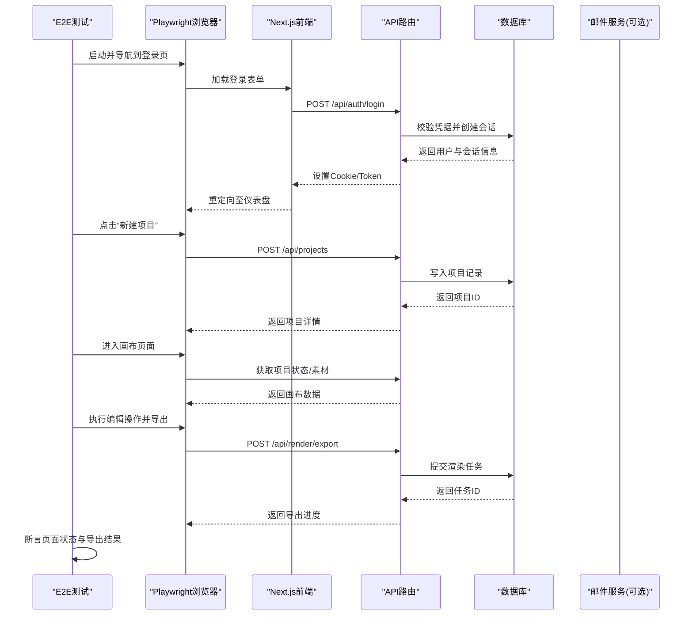
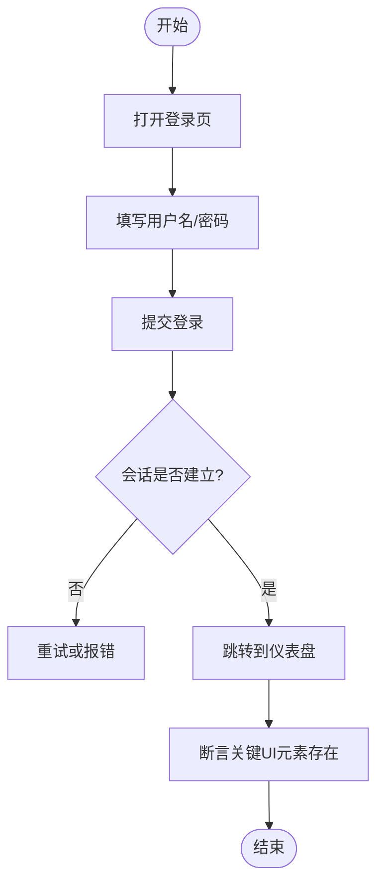
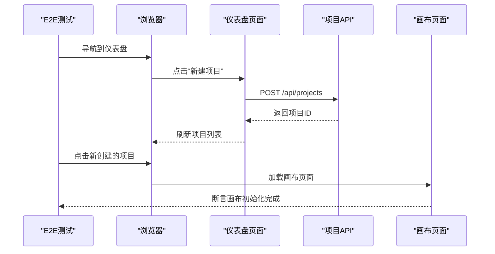
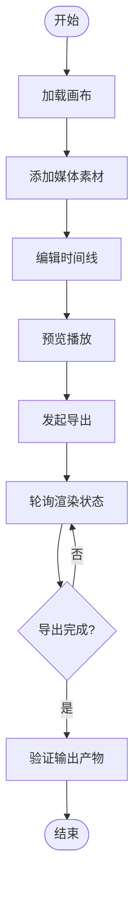
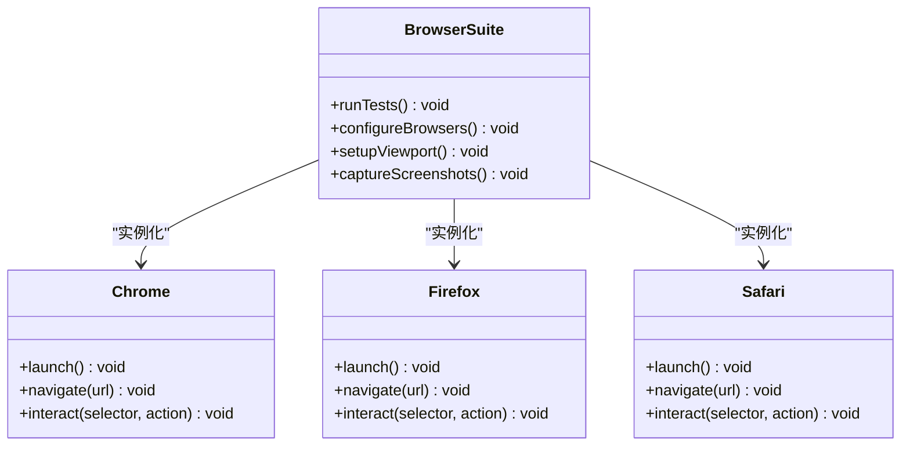
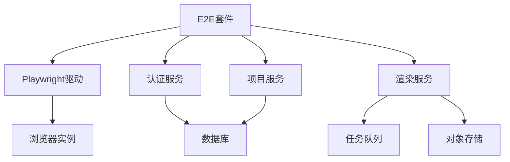

# 端到端测试

<cite>
**本文引用的文件**   
- [package.json](file://package.json)
- [vitest.config.ts](file://vitest.config.ts)
- [vitest.pg.config.ts](file://vitest.pg.config.ts)
- [scripts/verify/e2e-smoke.ts](file://scripts/verify/e2e-smoke.ts)
- [scripts/verify/auth-flow-smoke.mjs](file://scripts/verify/auth-flow-smoke.mjs)
- [scripts/verify/auth-pages-shot.mjs](file://scripts/verify/auth-pages-shot.mjs)
- [scripts/verify/demo-account-dialog-shot.mjs](file://scripts/verify/demo-account-dialog-shot.mjs)
- [scripts/verify/capture-v3-baseline.ts](file://scripts/verify/capture-v3-baseline.ts)
- [scripts/verify/products-scroll.ts](file://scripts/verify/products-scroll.ts)
- [scripts/verify/stepfun-probe.ts](file://scripts/verify/stepfun-probe.ts)
- [server/src/capture/playwright-driver.ts](file://server/src/capture/playwright-driver.ts)
- [server/src/capture/browser-driver.ts](file://server/src/capture/browser-driver.ts)
- [server/src/capture/run-capture.ts](file://server/src/capture/run-capture.ts)
- [server/src/capture/mock-driver.ts](file://server/src/capture/mock-driver.ts)
- [server/src/capture/credentials.ts](file://server/src/capture/credentials.ts)
- [server/src/capture/imap-email.ts](file://server/src/capture/imap-email.ts)
- [src/app/(auth)/login/page.tsx](file://src/app/(auth)/login/page.tsx)
- [src/app/(auth)/signup/page.tsx](file://src/app/(auth)/signup/page.tsx)
- [src/app/(auth)/password/reset/page.tsx](file://src/app/(auth)/password/reset/page.tsx)
- [src/app/api/auth/login/route.ts](file://src/app/api/auth/login/route.ts)
- [src/app/api/auth/signup/route.ts](file://src/app/api/auth/signup/route.ts)
- [src/app/api/auth/session/route.ts](file://src/app/api/auth/session/route.ts)
- [src/app/api/projects/route.ts](file://src/app/api/projects/route.ts)
- [src/app/api/render/route.ts](file://src/app/api/render/route.ts)
- [src/app/products/(app)/canvas/[projectId]/page.tsx](file://src/app/products/(app)/canvas/[projectId]/page.tsx)
- [src/app/products/(app)/dashboard/page.tsx](file://src/app/products/(app)/dashboard/page.tsx)
- [src/features/auth/index.ts](file://src/features/auth/index.ts)
- [src/features/auth/account-service.ts](file://src/features/auth/account-service.ts)
- [src/features/auth/session.ts](file://src/features/auth/session.ts)
- [src/features/auth/http.ts](file://src/features/auth/http.ts)
- [src/features/director/pipeline.ts](file://src/features/director/pipeline.ts)
- [src/features/render/renderer.ts](file://src/features/render/renderer.ts)
- [docker-compose.dev.yml](file://docker-compose.dev.yml)
- [docker-compose.prod.yml](file://docker-compose.prod.yml)
</cite>

## 目录
1. [简介](#简介)
2. [项目结构](#项目结构)
3. [核心组件](#核心组件)
4. [架构总览](#架构总览)
5. [详细组件分析](#详细组件分析)
6. [依赖分析](#依赖分析)
7. [性能考虑](#性能考虑)
8. [故障排查指南](#故障排查指南)
9. [结论](#结论)
10. [附录](#附录)

## 简介
本文件面向PurpleInk的端到端（E2E）测试，目标是系统化说明测试框架选型与配置、关键用户流程自动化、跨浏览器兼容性策略、测试环境搭建、数据管理与结果分析，以及性能基准与回归测试实践。结合仓库现有脚本与能力，文档将给出可落地的方案与最佳实践，帮助团队在持续集成中稳定保障注册登录、项目创建、视频编辑等核心路径的质量。

## 项目结构
仓库已具备若干验证脚本与Playwright驱动能力，适合扩展为统一的E2E套件：
- 验证脚本位于 scripts/verify，包含认证冒烟、截图对比、滚动交互、服务探测等用例。
- server/src/capture 提供基于Playwright的浏览器驱动与采集编排，可作为E2E执行引擎的基础。
- src/app 下包含认证页面与API路由，是E2E需要覆盖的关键入口。
- docker-compose.* 提供开发/生产环境编排，便于本地与CI环境一致化。

```mermaid
graph TB
subgraph "测试与验证"
E2E["E2E套件<br/>scripts/verify/*"]
VConfig["Vitest配置<br/>vitest.config.ts / vitest.pg.config.ts"]
end
subgraph "应用前端与API"
AuthPages["认证页面<br/>src/app/(auth)/*"]
APIRoutes["API路由<br/>src/app/api/*"]
CanvasPage["画布页面<br/>src/app/products/(app)/canvas/[projectId]"]
end
subgraph "浏览器驱动与采集"
PWDriver["Playwright驱动<br/>server/src/capture/playwright-driver.ts"]
RunCapture["采集编排<br/>server/src/capture/run-capture.ts"]
MockDriver["Mock驱动<br/>server/src/capture/mock-driver.ts"]
end
subgraph "基础设施"
DockerDev["Docker Compose 开发<br/>docker-compose.dev.yml"]
DockerProd["Docker Compose 生产<br/>docker-compose.prod.yml"]
end
E2E --> PWDriver
E2E --> AuthPages
E2E --> APIRoutes
E2E --> CanvasPage
PWDriver --> RunCapture
RunCapture --> DockerDev
RunCapture --> DockerProd
```

**图示来源** 
- [scripts/verify/e2e-smoke.ts](file://scripts/verify/e2e-smoke.ts)
- [server/src/capture/playwright-driver.ts](file://server/src/capture/playwright-driver.ts)
- [server/src/capture/run-capture.ts](file://server/src/capture/run-capture.ts)
- [src/app/(auth)/login/page.tsx](file://src/app/(auth)/login/page.tsx)
- [src/app/api/auth/login/route.ts](file://src/app/api/auth/login/route.ts)
- [docker-compose.dev.yml](file://docker-compose.dev.yml)

**章节来源**
- [package.json](file://package.json)
- [vitest.config.ts](file://vitest.config.ts)
- [vitest.pg.config.ts](file://vitest.pg.config.ts)
- [scripts/verify/e2e-smoke.ts](file://scripts/verify/e2e-smoke.ts)
- [server/src/capture/playwright-driver.ts](file://server/src/capture/playwright-driver.ts)
- [server/src/capture/run-capture.ts](file://server/src/capture/run-capture.ts)
- [docker-compose.dev.yml](file://docker-compose.dev.yml)
- [docker-compose.prod.yml](file://docker-compose.prod.yml)

## 核心组件
- 测试运行器与配置
  - Vitest用于单元测试与部分集成测试；E2E建议引入Playwright作为主框架，复用仓库已有的Playwright驱动能力。
  - 配置文件包括vitest.config.ts与vitest.pg.config.ts，可用于统一测试环境与数据库连接。
- Playwright驱动与采集
  - playwright-driver.ts封装浏览器启动、导航、截图、元素操作等能力。
  - run-capture.ts编排采集任务，支持多步骤流程与错误处理。
  - mock-driver.ts与imap-email.ts提供模拟与邮件读取能力，便于无外部依赖的E2E场景。
- 认证与页面
  - 认证页面位于src/app/(auth)，包括登录、注册、重置密码。
  - 对应API路由位于src/app/api/auth，提供会话、登录、注册等接口。
- 项目与渲染
  - 项目API位于src/app/api/projects，渲染API位于src/app/api/render。
  - 画布页面位于src/app/products/(app)/canvas/[projectId]，是视频编辑的核心界面。

**章节来源**
- [vitest.config.ts](file://vitest.config.ts)
- [vitest.pg.config.ts](file://vitest.pg.config.ts)
- [server/src/capture/playwright-driver.ts](file://server/src/capture/playwright-driver.ts)
- [server/src/capture/run-capture.ts](file://server/src/capture/run-capture.ts)
- [server/src/capture/mock-driver.ts](file://server/src/capture/mock-driver.ts)
- [server/src/capture/imap-email.ts](file://server/src/capture/imap-email.ts)
- [src/app/(auth)/login/page.tsx](file://src/app/(auth)/login/page.tsx)
- [src/app/(auth)/signup/page.tsx](file://src/app/(auth)/signup/page.tsx)
- [src/app/(auth)/password/reset/page.tsx](file://src/app/(auth)/password/reset/page.tsx)
- [src/app/api/auth/login/route.ts](file://src/app/api/auth/login/route.ts)
- [src/app/api/auth/signup/route.ts](file://src/app/api/auth/signup/route.ts)
- [src/app/api/auth/session/route.ts](file://src/app/api/auth/session/route.ts)
- [src/app/api/projects/route.ts](file://src/app/api/projects/route.ts)
- [src/app/api/render/route.ts](file://src/app/api/render/route.ts)
- [src/app/products/(app)/canvas/[projectId]/page.tsx](file://src/app/products/(app)/canvas/[projectId]/page.tsx)

## 架构总览
下图展示E2E套件与应用的交互关系，涵盖浏览器驱动、认证流程、项目与渲染API、以及容器化环境。

**图示来源** 
- [scripts/verify/e2e-smoke.ts](file://scripts/verify/e2e-smoke.ts)
- [server/src/capture/playwright-driver.ts](file://server/src/capture/playwright-driver.ts)
- [src/app/api/auth/login/route.ts](file://src/app/api/auth/login/route.ts)
- [src/app/api/projects/route.ts](file://src/app/api/projects/route.ts)
- [src/app/api/render/route.ts](file://src/app/api/render/route.ts)
- [src/app/products/(app)/canvas/[projectId]/page.tsx](file://src/app/products/(app)/canvas/[projectId]/page.tsx)

## 详细组件分析

### 认证冒烟测试（登录/注册/重置密码）
- 目标
  - 验证用户注册、邮箱验证码、登录、会话保持、密码重置等关键路径。
- 实现要点
  - 使用Playwright驱动打开认证页面，填写表单并提交。
  - 通过mock或真实邮件服务读取验证码（参考imap-email.ts）。
  - 断言登录后跳转至仪表盘，且会话有效。
- 相关脚本
  - auth-flow-smoke.mjs：认证流程冒烟。
  - auth-pages-shot.mjs：认证页面截图对比。
  - demo-account-dialog-shot.mjs：演示账户对话框截图。

**图示来源** 
- [scripts/verify/auth-flow-smoke.mjs](file://scripts/verify/auth-flow-smoke.mjs)
- [scripts/verify/auth-pages-shot.mjs](file://scripts/verify/auth-pages-shot.mjs)
- [scripts/verify/demo-account-dialog-shot.mjs](file://scripts/verify/demo-account-dialog-shot.mjs)
- [src/app/(auth)/login/page.tsx](file://src/app/(auth)/login/page.tsx)
- [src/app/(auth)/signup/page.tsx](file://src/app/(auth)/signup/page.tsx)
- [src/app/(auth)/password/reset/page.tsx](file://src/app/(auth)/password/reset/page.tsx)
- [src/app/api/auth/login/route.ts](file://src/app/api/auth/login/route.ts)
- [src/app/api/auth/signup/route.ts](file://src/app/api/auth/signup/route.ts)
- [src/app/api/auth/session/route.ts](file://src/app/api/auth/session/route.ts)

**章节来源**
- [scripts/verify/auth-flow-smoke.mjs](file://scripts/verify/auth-flow-smoke.mjs)
- [scripts/verify/auth-pages-shot.mjs](file://scripts/verify/auth-pages-shot.mjs)
- [scripts/verify/demo-account-dialog-shot.mjs](file://scripts/verify/demo-account-dialog-shot.mjs)
- [src/app/(auth)/login/page.tsx](file://src/app/(auth)/login/page.tsx)
- [src/app/(auth)/signup/page.tsx](file://src/app/(auth)/signup/page.tsx)
- [src/app/(auth)/password/reset/page.tsx](file://src/app/(auth)/password/reset/page.tsx)
- [src/app/api/auth/login/route.ts](file://src/app/api/auth/login/route.ts)
- [src/app/api/auth/signup/route.ts](file://src/app/api/auth/signup/route.ts)
- [src/app/api/auth/session/route.ts](file://src/app/api/auth/session/route.ts)

### 项目创建与列表
- 目标
  - 验证从仪表盘创建新项目、返回列表显示、进入项目详情页。
- 实现要点
  - 登录后访问仪表盘，点击“新建项目”，填写名称与描述。
  - 调用项目API创建成功后，断言列表新增条目。
  - 进入项目详情页，确认画布页面加载成功。

**图示来源** 
- [src/app/products/(app)/dashboard/page.tsx](file://src/app/products/(app)/dashboard/page.tsx)
- [src/app/api/projects/route.ts](file://src/app/api/projects/route.ts)
- [src/app/products/(app)/canvas/[projectId]/page.tsx](file://src/app/products/(app)/canvas/[projectId]/page.tsx)

**章节来源**
- [src/app/products/(app)/dashboard/page.tsx](file://src/app/products/(app)/dashboard/page.tsx)
- [src/app/api/projects/route.ts](file://src/app/api/projects/route.ts)
- [src/app/products/(app)/canvas/[projectId]/page.tsx](file://src/app/products/(app)/canvas/[projectId]/page.tsx)

### 视频编辑与导出流程
- 目标
  - 验证画布中的素材添加、时间线编辑、预览播放、导出渲染等关键路径。
- 实现要点
  - 在画布页面选择节点进行编辑，更新项目状态。
  - 触发渲染导出，轮询任务状态直至完成。
  - 断言导出产物存在且质量符合预期（如缩略图、时长、分辨率）。

**图示来源** 
- [src/app/products/(app)/canvas/[projectId]/page.tsx](file://src/app/products/(app)/canvas/[projectId]/page.tsx)
- [src/app/api/render/route.ts](file://src/app/api/render/route.ts)
- [src/features/render/renderer.ts](file://src/features/render/renderer.ts)

**章节来源**
- [src/app/products/(app)/canvas/[projectId]/page.tsx](file://src/app/products/(app)/canvas/[projectId]/page.tsx)
- [src/app/api/render/route.ts](file://src/app/api/render/route.ts)
- [src/features/render/renderer.ts](file://src/features/render/renderer.ts)

### 跨浏览器兼容性测试
- 目标
  - 确保关键流程在Chrome、Firefox、Safari（或Webkit）上表现一致。
- 实现要点
  - 使用Playwright的多浏览器配置，并行执行同一套用例。
  - 针对移动端与桌面端分别设置视口与UA。
  - 对截图对比类用例，按浏览器生成基线并进行差异阈值控制。

[此图为概念性类图，不直接映射具体源码文件]

### 测试环境搭建与数据管理
- 环境搭建
  - 使用docker-compose.dev.yml启动后端、数据库、缓存等服务。
  - 配置环境变量（如TTS、第三方服务密钥），参考config/tts.env.example。
- 测试数据
  - 预置演示账号与项目数据，避免每次测试动态创建带来的不稳定。
  - 使用隔离的测试数据库或事务回滚，保证用例间独立性。
- 结果分析
  - 收集日志、截图、视频回放，定位失败原因。
  - 对截图对比类用例，维护基线集合并定期更新。

**章节来源**
- [docker-compose.dev.yml](file://docker-compose.dev.yml)
- [docker-compose.prod.yml](file://docker-compose.prod.yml)
- [config/tts.env.example](file://config/tts.env.example)

## 依赖分析
E2E套件依赖以下核心模块：
- Playwright驱动：提供浏览器操作能力。
- 认证服务：账号、会话、验证码。
- 项目与渲染服务：项目CRUD、渲染任务调度。
- 容器化环境：数据库、邮件服务、对象存储等。

**图示来源** 
- [server/src/capture/playwright-driver.ts](file://server/src/capture/playwright-driver.ts)
- [src/features/auth/index.ts](file://src/features/auth/index.ts)
- [src/app/api/projects/route.ts](file://src/app/api/projects/route.ts)
- [src/app/api/render/route.ts](file://src/app/api/render/route.ts)

**章节来源**
- [server/src/capture/playwright-driver.ts](file://server/src/capture/playwright-driver.ts)
- [src/features/auth/index.ts](file://src/features/auth/index.ts)
- [src/app/api/projects/route.ts](file://src/app/api/projects/route.ts)
- [src/app/api/render/route.ts](file://src/app/api/render/route.ts)

## 性能考虑
- 用例并行与资源隔离
  - 合理划分用例组，避免共享状态冲突。
  - 对长耗时操作（如渲染导出）采用异步轮询与超时控制。
- 截图与录制优化
  - 仅对关键断点截图，减少IO开销。
  - 录制视频仅在失败时启用，降低CI成本。
- 网络与服务模拟
  - 对第三方服务使用Mock或沙箱，减少外部依赖波动。
  - 使用本地缓存与CDN预热，提升页面加载速度。

## 故障排查指南
- 常见问题
  - 浏览器启动失败：检查Playwright二进制与系统依赖。
  - 认证失败：确认邮箱服务可用、验证码发送正常。
  - 项目创建失败：检查数据库连接与权限。
  - 渲染超时：查看任务队列与后端日志。
- 调试技巧
  - 启用浏览器调试模式，捕获控制台日志与网络请求。
  - 对关键步骤增加断点与截图，辅助定位问题。
  - 使用mock-driver.ts隔离外部依赖，快速复现问题。

**章节来源**
- [server/src/capture/mock-driver.ts](file://server/src/capture/mock-driver.ts)
- [server/src/capture/credentials.ts](file://server/src/capture/credentials.ts)
- [server/src/capture/imap-email.ts](file://server/src/capture/imap-email.ts)

## 结论
通过整合仓库现有的Playwright驱动与验证脚本，PurpleInk可以构建一套稳定、可扩展的E2E测试体系。建议以Playwright为核心框架，结合Vitest进行单元与集成测试，形成分层测试策略。重点覆盖认证、项目创建、视频编辑与导出等关键路径，并通过跨浏览器兼容性与性能基准测试，持续提升产品质量与交付效率。

## 附录
- 推荐命令
  - 启动开发环境：docker-compose -f docker-compose.dev.yml up
  - 运行冒烟测试：node scripts/verify/auth-flow-smoke.mjs
  - 执行E2E套件：pnpm test:e2e（需配置Playwright）
- 参考脚本
  - e2e-smoke.ts：E2E冒烟用例模板。
  - capture-v3-baseline.ts：基线截图生成。
  - products-scroll.ts：产品页滚动交互测试。
  - stepfun-probe.ts：第三方服务探测。

**章节来源**
- [scripts/verify/e2e-smoke.ts](file://scripts/verify/e2e-smoke.ts)
- [scripts/verify/capture-v3-baseline.ts](file://scripts/verify/capture-v3-baseline.ts)
- [scripts/verify/products-scroll.ts](file://scripts/verify/products-scroll.ts)
- [scripts/verify/stepfun-probe.ts](file://scripts/verify/stepfun-probe.ts)