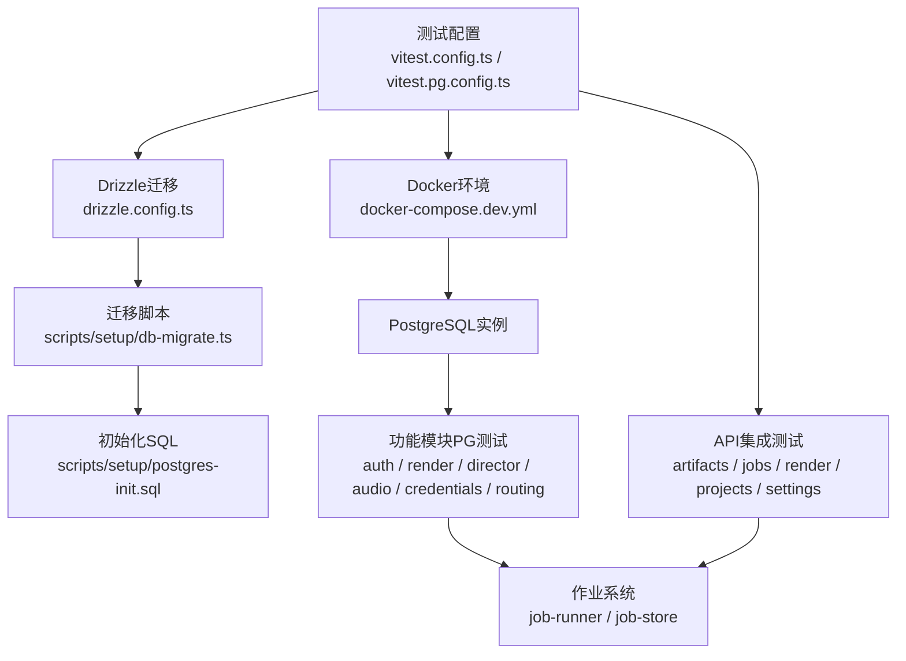
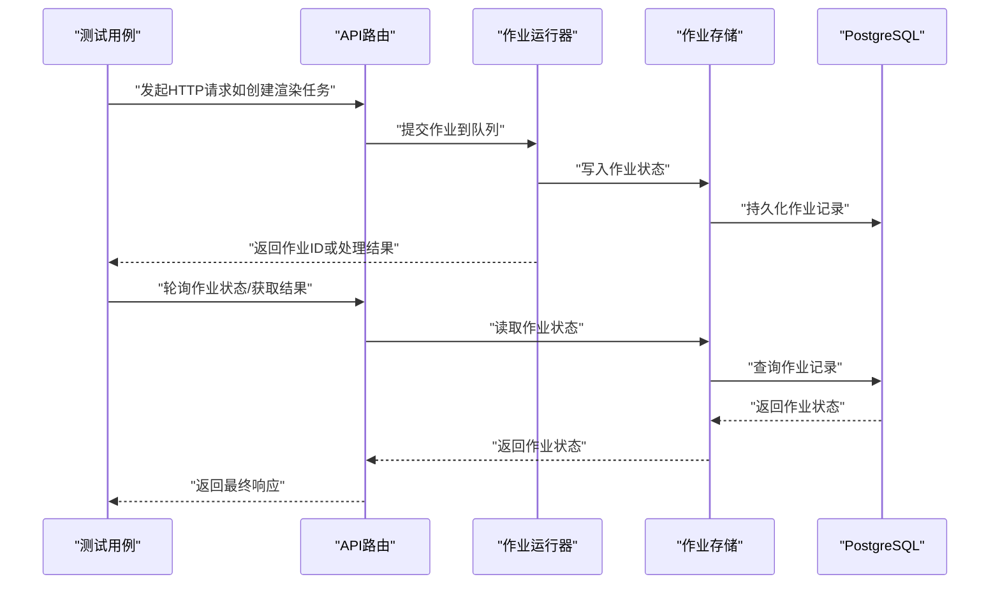
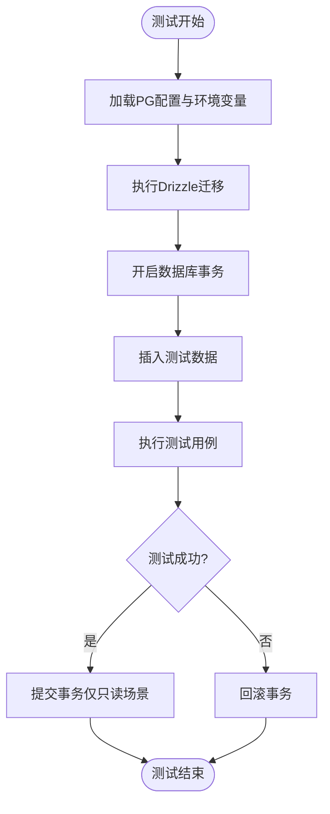
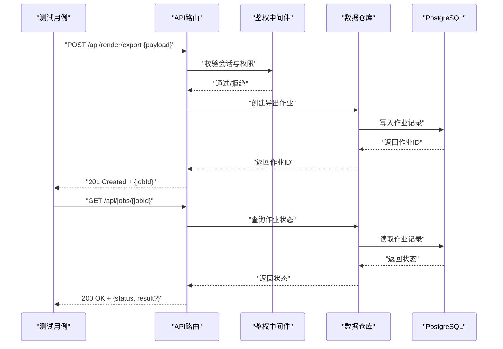
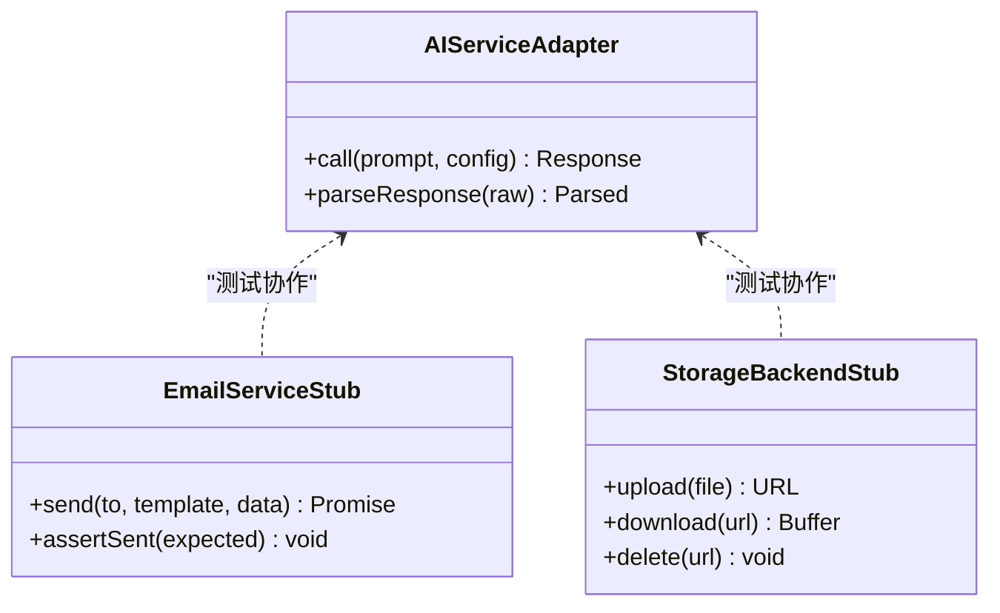
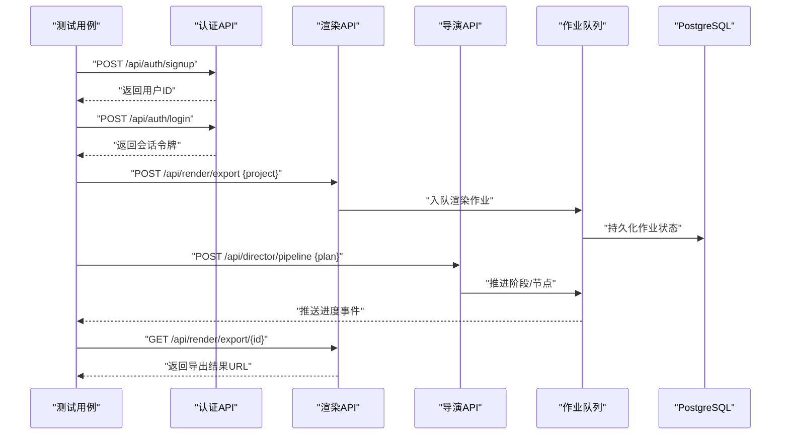
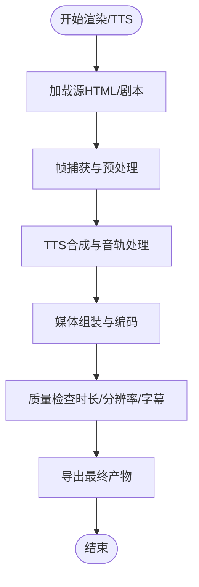
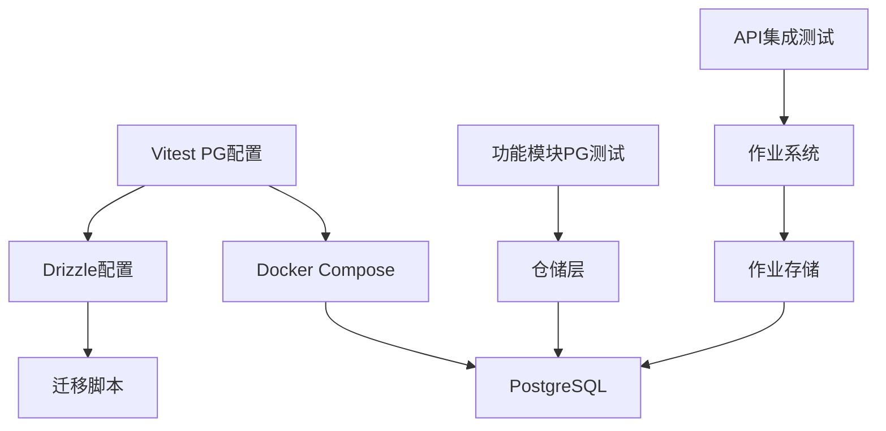

# 集成测试

<cite>
**本文引用的文件**   
- [vitest.config.ts](file://vitest.config.ts)
- [vitest.pg.config.ts](file://vitest.pg.config.ts)
- [docker-compose.dev.yml](file://docker-compose.dev.yml)
- [drizzle.config.ts](file://drizzle.config.ts)
- [scripts/setup/db-migrate.ts](file://scripts/setup/db-migrate.ts)
- [scripts/setup/postgres-init.sql](file://scripts/setup/postgres-init.sql)
- [server/src/server/job-runner.ts](file://server/src/server/job-runner.ts)
- [server/src/server/job-store.ts](file://server/src/server/job-store.ts)
- [src/features/auth/account-service.pg.test.ts](file://src/features/auth/account-service.pg.test.ts)
- [src/features/render/renderer.integration.test.ts](file://src/features/render/renderer.integration.test.ts)
- [src/features/render/repository.pg.test.ts](file://src/features/render/repository.pg.test.ts)
- [src/features/director/runtime-repository.pg.test.ts](file://src/features/director/runtime-repository.pg.test.ts)
- [src/features/audio/runtime-repository.pg.test.ts](file://src/features/audio/runtime-repository.pg.test.ts)
- [src/features/credentials/provider-credential-store.pg.test.ts](file://src/features/credentials/provider-credential-store.pg.test.ts)
- [src/features/routing/media-route-repository.pg.test.ts](file://src/features/routing/media-route-repository.pg.test.ts)
- [src/app/api/artifacts/[id]/route.test.ts](file://src/app/api/artifacts/[id]/route.test.ts)
- [src/app/api/director/pipeline/route.test.ts](file://src/app/api/director/pipeline/route.test.ts)
- [src/app/api/jobs/[id]/route.test.ts](file://src/app/api/jobs/[id]/route.test.ts)
- [src/app/api/render/export/route.test.ts](file://src/app/api/render/export/route.test.ts)
- [src/app/api/projects/route.test.ts](file://src/app/api/projects/route.test.ts)
- [src/app/api/settings/route.test.ts](file://src/app/api/settings/route.test.ts)
- [tests/tts-pipeline-integration.test.ts](file://tests/tts-pipeline-integration.test.ts)
- [tests/tts-runtime.test.ts](file://tests/tts-runtime.test.ts)
</cite>

## 目录
1. [简介](#简介)
2. [项目结构](#项目结构)
3. [核心组件](#核心组件)
4. [架构总览](#架构总览)
5. [详细组件分析](#详细组件分析)
6. [依赖关系分析](#依赖关系分析)
7. [性能考量](#性能考量)
8. [故障排查指南](#故障排查指南)
9. [结论](#结论)
10. [附录](#附录)

## 简介
本文件面向PurpleInk项目的集成测试，聚焦以下目标：
- PostgreSQL数据库集成测试环境配置、测试数据管理与事务回滚策略
- API集成测试设计：HTTP请求模拟、响应验证与错误场景覆盖
- 第三方服务集成测试：AI服务模拟、邮件服务测试、存储后端测试
- 典型测试示例：认证流程、渲染管道、工作流执行
- 测试数据准备与清理策略、性能优化技巧

## 项目结构
集成测试相关的关键位置与职责如下：
- 测试框架与运行配置
  - vitest主配置与PostgreSQL专用配置
  - docker-compose开发环境编排（含PostgreSQL）
  - Drizzle ORM迁移配置
- 数据库初始化与迁移脚本
  - 数据库初始化SQL
  - 迁移执行脚本
- 服务端作业调度与持久化
  - 作业运行器与作业存储（用于API与工作流集成测试）
- 功能模块的PG集成测试
  - 认证、渲染、导演（Director）、音频、凭据、路由等模块的PG测试
- API层集成测试
  - artifacts、director pipeline、jobs、render export、projects、settings等路由测试
- TTS与渲染管线端到端测试
  - tts-pipeline-integration.test.ts、tts-runtime.test.ts

**图示来源**
- [vitest.config.ts](file://vitest.config.ts)
- [vitest.pg.config.ts](file://vitest.pg.config.ts)
- [docker-compose.dev.yml](file://docker-compose.dev.yml)
- [drizzle.config.ts](file://drizzle.config.ts)
- [scripts/setup/db-migrate.ts](file://scripts/setup/db-migrate.ts)
- [scripts/setup/postgres-init.sql](file://scripts/setup/postgres-init.sql)
- [server/src/server/job-runner.ts](file://server/src/server/job-runner.ts)
- [server/src/server/job-store.ts](file://server/src/server/job-store.ts)

**章节来源**
- [vitest.config.ts](file://vitest.config.ts)
- [vitest.pg.config.ts](file://vitest.pg.config.ts)
- [docker-compose.dev.yml](file://docker-compose.dev.yml)
- [drizzle.config.ts](file://drizzle.config.ts)
- [scripts/setup/db-migrate.ts](file://scripts/setup/db-migrate.ts)
- [scripts/setup/postgres-init.sql](file://scripts/setup/postgres-init.sql)

## 核心组件
- 测试运行器与PostgreSQL环境
  - 通过Vitest配置区分普通测试与PG测试；PG测试使用独立配置文件加载环境变量与连接参数
  - Docker Compose提供PostgreSQL容器，确保本地与CI一致的环境
- 数据库迁移与初始化
  - Drizzle ORM负责表结构与种子数据的迁移与初始化
  - 迁移脚本在测试前执行，保证数据库状态可预期
- 作业系统与持久化
  - 作业运行器与作业存储为渲染、导出、TTS等异步任务提供执行与状态管理
  - 集成测试通过API触发作业并验证状态流转
- 功能模块PG测试
  - 认证、渲染、导演、音频、凭据、路由等模块均提供PG测试用例，覆盖CRUD、事务与并发场景
- API集成测试
  - 针对关键REST接口进行请求构造、响应断言与错误路径验证

**章节来源**
- [vitest.pg.config.ts](file://vitest.pg.config.ts)
- [docker-compose.dev.yml](file://docker-compose.dev.yml)
- [drizzle.config.ts](file://drizzle.config.ts)
- [scripts/setup/db-migrate.ts](file://scripts/setup/db-migrate.ts)
- [server/src/server/job-runner.ts](file://server/src/server/job-runner.ts)
- [server/src/server/job-store.ts](file://server/src/server/job-store.ts)
- [src/features/auth/account-service.pg.test.ts](file://src/features/auth/account-service.pg.test.ts)
- [src/features/render/repository.pg.test.ts](file://src/features/render/repository.pg.test.ts)
- [src/features/director/runtime-repository.pg.test.ts](file://src/features/director/runtime-repository.pg.test.ts)
- [src/features/audio/runtime-repository.pg.test.ts](file://src/features/audio/runtime-repository.pg.test.ts)
- [src/features/credentials/provider-credential-store.pg.test.ts](file://src/features/credentials/provider-credential-store.pg.test.ts)
- [src/features/routing/media-route-repository.pg.test.ts](file://src/features/routing/media-route-repository.pg.test.ts)

## 架构总览
下图展示了集成测试中API、作业系统与数据库之间的交互关系。

**图示来源**
- [server/src/server/job-runner.ts](file://server/src/server/job-runner.ts)
- [server/src/server/job-store.ts](file://server/src/server/job-store.ts)
- [src/app/api/render/export/route.test.ts](file://src/app/api/render/export/route.test.ts)
- [src/app/api/jobs/[id]/route.test.ts](file://src/app/api/jobs/[id]/route.test.ts)

## 详细组件分析

### PostgreSQL集成测试环境与事务回滚策略
- 环境配置
  - 使用独立的Vitest PG配置文件加载数据库连接信息
  - Docker Compose启动PostgreSQL容器，固定端口与凭据，便于本地与CI复用
- 迁移与初始化
  - 在测试套件开始前执行Drizzle迁移，确保表结构一致
  - 可选执行初始化SQL以注入基础数据（如租户、角色、默认设置）
- 事务回滚策略
  - 每个测试用例包裹在事务中，测试结束后自动回滚，保证数据隔离
  - 对需要跨用例共享的数据，采用“只读”或“预置数据”策略，避免污染
- 数据准备与清理
  - 使用工厂函数生成最小可用数据集
  - 测试后不依赖外部清理脚本，依靠事务回滚实现零残留

**图示来源**
- [vitest.pg.config.ts](file://vitest.pg.config.ts)
- [docker-compose.dev.yml](file://docker-compose.dev.yml)
- [drizzle.config.ts](file://drizzle.config.ts)
- [scripts/setup/db-migrate.ts](file://scripts/setup/db-migrate.ts)
- [scripts/setup/postgres-init.sql](file://scripts/setup/postgres-init.sql)

**章节来源**
- [vitest.pg.config.ts](file://vitest.pg.config.ts)
- [docker-compose.dev.yml](file://docker-compose.dev.yml)
- [drizzle.config.ts](file://drizzle.config.ts)
- [scripts/setup/db-migrate.ts](file://scripts/setup/db-migrate.ts)
- [scripts/setup/postgres-init.sql](file://scripts/setup/postgres-init.sql)

### API集成测试设计
- HTTP请求模拟
  - 使用测试框架提供的HTTP客户端构造请求，包含认证头、表单/JSON载荷、分页与过滤参数
  - 支持模拟不同网络条件（超时、重试）与边界输入
- 响应验证
  - 断言状态码、响应体结构、关键字段值与时间戳格式
  - 对分页结果进行页大小与总数校验
- 错误场景测试
  - 覆盖未授权、权限不足、参数校验失败、资源不存在、并发冲突等错误路径
  - 验证错误消息与错误码符合契约

**图示来源**
- [src/app/api/render/export/route.test.ts](file://src/app/api/render/export/route.test.ts)
- [src/app/api/jobs/[id]/route.test.ts](file://src/app/api/jobs/[id]/route.test.ts)

**章节来源**
- [src/app/api/artifacts/[id]/route.test.ts](file://src/app/api/artifacts/[id]/route.test.ts)
- [src/app/api/director/pipeline/route.test.ts](file://src/app/api/director/pipeline/route.test.ts)
- [src/app/api/jobs/[id]/route.test.ts](file://src/app/api/jobs/[id]/route.test.ts)
- [src/app/api/render/export/route.test.ts](file://src/app/api/render/export/route.test.ts)
- [src/app/api/projects/route.test.ts](file://src/app/api/projects/route.test.ts)
- [src/app/api/settings/route.test.ts](file://src/app/api/settings/route.test.ts)

### 第三方服务集成测试方法
- AI服务模拟
  - 通过适配器与配置层将AI调用替换为内存或文件存根，避免真实网络请求
  - 校验提示词构建、参数映射与响应解析逻辑
- 邮件服务测试
  - 拦截邮件发送调用，断言模板渲染、收件人与附件内容
  - 模拟发送失败与重试场景，验证错误处理与退避策略
- 存储后端测试
  - 使用内存文件系统或临时目录作为对象存储后端
  - 校验上传、下载、删除与元数据一致性

**图示来源**
- [src/features/ai/gemini-adapter.ts](file://src/features/ai/gemini-adapter.ts)
- [src/features/auth/mailer.ts](file://src/features/auth/mailer.ts)
- [src/lib/storage/index.ts](file://src/lib/storage/index.ts)

**章节来源**
- [src/features/ai/gemini-adapter.ts](file://src/features/ai/gemini-adapter.ts)
- [src/features/auth/mailer.ts](file://src/features/auth/mailer.ts)
- [src/lib/storage/index.ts](file://src/lib/storage/index.ts)

### 具体测试示例
- 认证流程测试
  - 注册、登录、会话建立、密码重置与验证码流程
  - 覆盖错误路径：重复注册、无效验证码、会话过期
- 渲染管道测试
  - 从导入素材到帧捕获、媒体合成、导出的完整链路
  - 验证中间产物与最终输出的一致性
- 工作流执行测试
  - Director阶段推进、节点状态机转换、错误恢复与重试
  - 作业队列消费与进度上报

**图示来源**
- [src/app/api/auth/signup/route.ts](file://src/app/api/auth/signup/route.ts)
- [src/app/api/auth/login/route.ts](file://src/app/api/auth/login/route.ts)
- [src/app/api/render/export/route.test.ts](file://src/app/api/render/export/route.test.ts)
- [src/app/api/director/pipeline/route.test.ts](file://src/app/api/director/pipeline/route.test.ts)
- [server/src/server/job-runner.ts](file://server/src/server/job-runner.ts)
- [server/src/server/job-store.ts](file://server/src/server/job-store.ts)

**章节来源**
- [src/app/api/auth/signup/route.ts](file://src/app/api/auth/signup/route.ts)
- [src/app/api/auth/login/route.ts](file://src/app/api/auth/login/route.ts)
- [src/app/api/render/export/route.test.ts](file://src/app/api/render/export/route.test.ts)
- [src/app/api/director/pipeline/route.test.ts](file://src/app/api/director/pipeline/route.test.ts)
- [server/src/server/job-runner.ts](file://server/src/server/job-runner.ts)
- [server/src/server/job-store.ts](file://server/src/server/job-store.ts)

### 渲染与TTS端到端测试
- 渲染集成测试
  - 覆盖HTML渲染、帧序列生成、媒体拼接与QA检查
  - 使用固定基准HTML与期望输出进行确定性验证
- TTS流水线测试
  - 文本转语音、音轨合成、字幕对齐与导出
  - 模拟不同提供商（OpenAI兼容、StepFun、Mimo）的行为

**图示来源**
- [src/features/render/renderer.integration.test.ts](file://src/features/render/renderer.integration.test.ts)
- [tests/tts-pipeline-integration.test.ts](file://tests/tts-pipeline-integration.test.ts)
- [tests/tts-runtime.test.ts](file://tests/tts-runtime.test.ts)

**章节来源**
- [src/features/render/renderer.integration.test.ts](file://src/features/render/renderer.integration.test.ts)
- [tests/tts-pipeline-integration.test.ts](file://tests/tts-pipeline-integration.test.ts)
- [tests/tts-runtime.test.ts](file://tests/tts-runtime.test.ts)

## 依赖关系分析
- 测试配置与运行环境
  - Vitest PG配置依赖Docker Compose提供的PostgreSQL实例
  - Drizzle迁移脚本依赖数据库连接信息与迁移目录
- 功能模块与数据库
  - 各模块的PG测试直接依赖对应仓储与ORM模型
  - 作业系统与存储层贯穿渲染、导出、TTS等工作流
- API与业务逻辑
  - API路由测试依赖业务仓储与作业系统，间接依赖数据库

**图示来源**
- [vitest.pg.config.ts](file://vitest.pg.config.ts)
- [docker-compose.dev.yml](file://docker-compose.dev.yml)
- [drizzle.config.ts](file://drizzle.config.ts)
- [scripts/setup/db-migrate.ts](file://scripts/setup/db-migrate.ts)
- [server/src/server/job-runner.ts](file://server/src/server/job-runner.ts)
- [server/src/server/job-store.ts](file://server/src/server/job-store.ts)

**章节来源**
- [vitest.pg.config.ts](file://vitest.pg.config.ts)
- [docker-compose.dev.yml](file://docker-compose.dev.yml)
- [drizzle.config.ts](file://drizzle.config.ts)
- [scripts/setup/db-migrate.ts](file://scripts/setup/db-migrate.ts)
- [server/src/server/job-runner.ts](file://server/src/server/job-runner.ts)
- [server/src/server/job-store.ts](file://server/src/server/job-store.ts)

## 性能考量
- 数据库连接池与并发
  - 合理设置连接池大小，避免测试并发导致连接耗尽
  - 使用短事务与批量操作减少锁竞争
- 测试数据规模控制
  - 仅插入必要的最小数据集，避免大对象与冗余关联
  - 使用只读快照或预置数据替代每次重建
- 外部服务模拟开销
  - 使用内存存根替代I/O密集型模拟，降低测试耗时
  - 对AI与邮件服务采用快速失败与短路路径
- 并行执行与隔离
  - 按模块划分测试套件，启用并行执行
  - 通过事务隔离确保用例间无副作用

[本节为通用指导，无需特定文件引用]

## 故障排查指南
- 常见环境问题
  - PostgreSQL无法连接：检查Docker容器状态、端口占用与凭据
  - 迁移失败：确认迁移脚本顺序与表结构变更兼容性
- 测试不稳定
  - 竞态条件：增加等待与重试机制，避免时序敏感断言
  - 数据污染：确保事务回滚生效，避免共享状态
- 外部服务异常
  - AI/邮件/存储模拟失败：检查存根实现与断言逻辑
  - 网络超时：调整超时阈值与重试策略

**章节来源**
- [docker-compose.dev.yml](file://docker-compose.dev.yml)
- [scripts/setup/db-migrate.ts](file://scripts/setup/db-migrate.ts)
- [scripts/setup/postgres-init.sql](file://scripts/setup/postgres-init.sql)

## 结论
PurpleInk的集成测试体系围绕PostgreSQL、API与作业系统构建，通过Vitest与Docker提供稳定一致的测试环境。借助事务回滚与最小数据集策略，确保测试隔离与高效执行。API与第三方服务的模拟覆盖了关键路径与错误场景，结合渲染与TTS端到端测试，保障产品交付质量。建议持续优化连接池、数据规模与模拟开销，进一步提升测试稳定性与速度。

[本节为总结性内容，无需特定文件引用]

## 附录
- 常用命令与脚本
  - 启动开发环境：参考docker-compose.dev.yml
  - 执行迁移：scripts/setup/db-migrate.ts
  - 初始化数据库：scripts/setup/postgres-init.sql
- 测试入口与配置
  - 普通测试：vitest.config.ts
  - PG测试：vitest.pg.config.ts

**章节来源**
- [docker-compose.dev.yml](file://docker-compose.dev.yml)
- [scripts/setup/db-migrate.ts](file://scripts/setup/db-migrate.ts)
- [scripts/setup/postgres-init.sql](file://scripts/setup/postgres-init.sql)
- [vitest.config.ts](file://vitest.config.ts)
- [vitest.pg.config.ts](file://vitest.pg.config.ts)