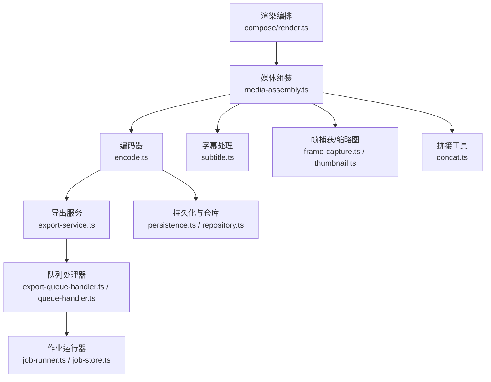
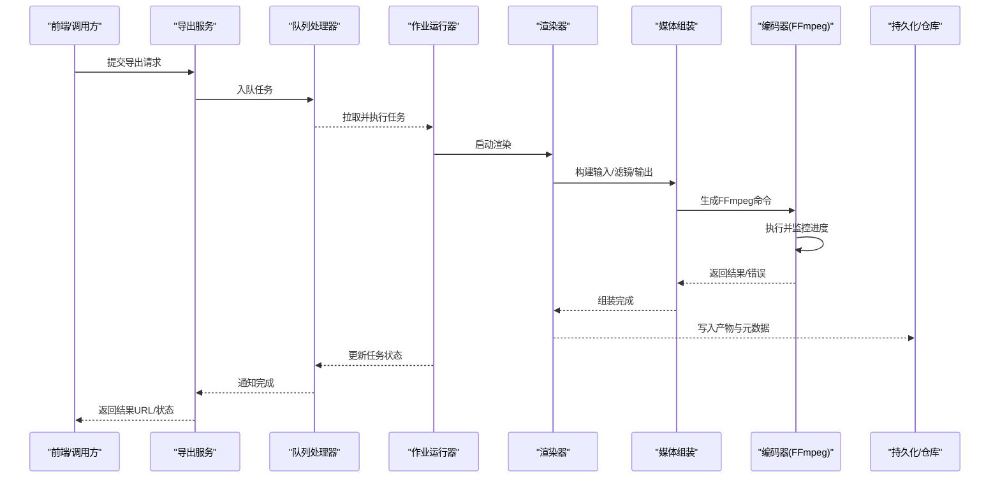
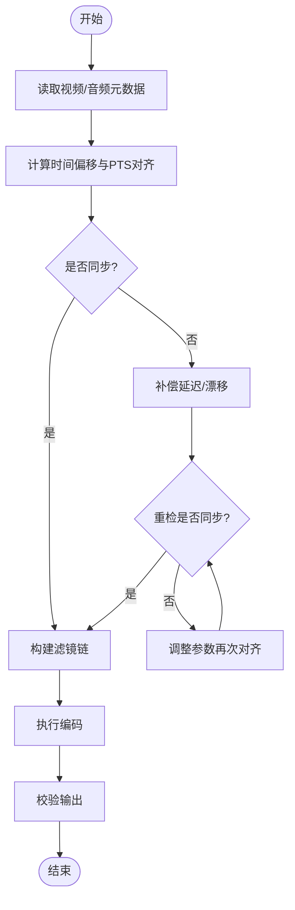

# FFmpeg集成

<cite>
**本文引用的文件**   
- [server/src/compose/render.ts](file://server/src/compose/render.ts)
- [src/features/render/renderer.ts](file://src/features/render/renderer.ts)
- [src/features/render/encode.ts](file://src/features/render/encode.ts)
- [src/features/render/media-assembly.ts](file://src/features/render/media-assembly.ts)
- [src/features/render/concat.ts](file://src/features/render/concat.ts)
- [src/features/render/frame-capture.ts](file://src/features/render/frame-capture.ts)
- [src/features/render/thumbnail.ts](file://src/features/render/thumbnail.ts)
- [src/features/render/export-service.ts](file://src/features/render/export-service.ts)
- [src/features/render/export-queue-handler.ts](file://src/features/render/export-queue-handler.ts)
- [src/features/render/queue-handler.ts](file://src/features/render/queue-handler.ts)
- [src/features/render/persistence.ts](file://src/features/render/persistence.ts)
- [src/features/render/repository.ts](file://src/features/render/repository.ts)
- [src/features/render/source-contract.ts](file://src/features/render/source-contract.ts)
- [src/features/render/types.ts](file://src/features/render/types.ts)
- [src/features/audio/subtitle.ts](file://src/features/audio/subtitle.ts)
- [src/features/audio/narration.ts](file://src/features/audio/narration.ts)
- [src/features/director/audio-timing.ts](file://src/features/director/audio-timing.ts)
- [src/features/canvas/export-settings.ts](file://src/features/canvas/export-settings.ts)
- [server/src/server/job-runner.ts](file://server/src/server/job-runner.ts)
- [server/src/server/job-store.ts](file://server/src/server/job-store.ts)
</cite>

## 目录
1. [简介](#简介)
2. [项目结构](#项目结构)
3. [核心组件](#核心组件)
4. [架构总览](#架构总览)
5. [详细组件分析](#详细组件分析)
6. [依赖关系分析](#依赖关系分析)
7. [性能考量](#性能考量)
8. [故障排除指南](#故障排除指南)
9. [结论](#结论)
10. [附录](#附录)

## 简介
本文件面向需要在项目中集成FFmpeg进行音视频处理与渲染的开发者，系统性说明命令构建与执行机制、编解码参数配置、格式转换、滤镜应用、音画同步（时间轴对齐、音轨混合、字幕嵌入）、编码质量控制（码率控制、分辨率调整、压缩优化），以及批处理能力（并行处理、任务拆分、结果合并）。文档同时提供参数调优建议与常见问题排查方法。

## 项目结构
本项目将FFmpeg能力封装在渲染子系统内，围绕“编排—组装—编码—导出”的职责边界组织代码：
- 编排层：负责根据项目/镜头规格生成渲染计划与参数
- 媒体组装层：负责多轨道素材拼接、转码、滤镜链构建
- 编码层：调用FFmpeg完成实际编码与输出
- 导出与队列：负责任务调度、并发控制、状态持久化与结果回写

图表来源
- [server/src/compose/render.ts](file://server/src/compose/render.ts)
- [src/features/render/media-assembly.ts](file://src/features/render/media-assembly.ts)
- [src/features/render/encode.ts](file://src/features/render/encode.ts)
- [src/features/render/export-service.ts](file://src/features/render/export-service.ts)
- [src/features/render/export-queue-handler.ts](file://src/features/render/export-queue-handler.ts)
- [src/features/render/queue-handler.ts](file://src/features/render/queue-handler.ts)
- [server/src/server/job-runner.ts](file://server/src/server/job-runner.ts)
- [server/src/server/job-store.ts](file://server/src/server/job-store.ts)
- [src/features/audio/subtitle.ts](file://src/features/audio/subtitle.ts)
- [src/features/render/frame-capture.ts](file://src/features/render/frame-capture.ts)
- [src/features/render/thumbnail.ts](file://src/features/render/thumbnail.ts)
- [src/features/render/concat.ts](file://src/features/render/concat.ts)
- [src/features/render/persistence.ts](file://src/features/render/persistence.ts)
- [src/features/render/repository.ts](file://src/features/render/repository.ts)

章节来源
- [server/src/compose/render.ts](file://server/src/compose/render.ts)
- [src/features/render/renderer.ts](file://src/features/render/renderer.ts)
- [src/features/render/media-assembly.ts](file://src/features/render/media-assembly.ts)
- [src/features/render/encode.ts](file://src/features/render/encode.ts)
- [src/features/render/export-service.ts](file://src/features/render/export-service.ts)
- [src/features/render/export-queue-handler.ts](file://src/features/render/export-queue-handler.ts)
- [src/features/render/queue-handler.ts](file://src/features/render/queue-handler.ts)
- [server/src/server/job-runner.ts](file://server/src/server/job-runner.ts)
- [server/src/server/job-store.ts](file://server/src/server/job-store.ts)

## 核心组件
- 渲染器：协调渲染流程，读取项目/镜头元数据，驱动媒体组装与编码
- 媒体组装：构建输入源、滤镜链、输出流，管理多轨道与时间轴
- 编码器：封装FFmpeg命令构建与执行，统一错误与进度回调
- 导出服务：对外暴露导出接口，管理任务生命周期
- 队列处理器：消费导出任务，控制并发，落盘中间态与结果
- 字幕与音频：字幕解析/嵌入、旁白与音效混音、时间轴对齐
- 帧捕获与缩略图：关键帧提取、封面生成
- 拼接工具：按时间线或索引顺序合并片段
- 持久化与仓库：记录任务、产物、校验信息

章节来源
- [src/features/render/renderer.ts](file://src/features/render/renderer.ts)
- [src/features/render/media-assembly.ts](file://src/features/render/media-assembly.ts)
- [src/features/render/encode.ts](file://src/features/render/encode.ts)
- [src/features/render/export-service.ts](file://src/features/render/export-service.ts)
- [src/features/render/export-queue-handler.ts](file://src/features/render/export-queue-handler.ts)
- [src/features/render/queue-handler.ts](file://src/features/render/queue-handler.ts)
- [src/features/audio/subtitle.ts](file://src/features/audio/subtitle.ts)
- [src/features/audio/narration.ts](file://src/features/audio/narration.ts)
- [src/features/render/frame-capture.ts](file://src/features/render/frame-capture.ts)
- [src/features/render/thumbnail.ts](file://src/features/render/thumbnail.ts)
- [src/features/render/concat.ts](file://src/features/render/concat.ts)
- [src/features/render/persistence.ts](file://src/features/render/persistence.ts)
- [src/features/render/repository.ts](file://src/features/render/repository.ts)

## 架构总览
下图展示从“渲染编排”到“FFmpeg编码”再到“导出与持久化”的端到端流程。

图表来源
- [src/features/render/export-service.ts](file://src/features/render/export-service.ts)
- [src/features/render/export-queue-handler.ts](file://src/features/render/export-queue-handler.ts)
- [src/features/render/queue-handler.ts](file://src/features/render/queue-handler.ts)
- [server/src/server/job-runner.ts](file://server/src/server/job-runner.ts)
- [server/src/server/job-store.ts](file://server/src/server/job-store.ts)
- [src/features/render/renderer.ts](file://src/features/render/renderer.ts)
- [src/features/render/media-assembly.ts](file://src/features/render/media-assembly.ts)
- [src/features/render/encode.ts](file://src/features/render/encode.ts)
- [src/features/render/persistence.ts](file://src/features/render/persistence.ts)
- [src/features/render/repository.ts](file://src/features/render/repository.ts)

## 详细组件分析

### 渲染器与编排
- 职责：解析渲染上下文（分辨率、帧率、时长、轨道布局），生成渲染计划，驱动媒体组装与编码
- 关键点：
  - 基于项目/镜头规格确定输出容器与编码参数基线
  - 将时间轴切分为可执行的子任务（如分段编码、并行缩略图）
  - 与持久化层协作，保证中断恢复与幂等性

章节来源
- [src/features/render/renderer.ts](file://src/features/render/renderer.ts)
- [server/src/compose/render.ts](file://server/src/compose/render.ts)

### 媒体组装（输入、滤镜、输出）
- 职责：组合视频/音频/字幕输入，构建滤镜链，生成最终输出描述
- 关键点：
  - 输入源契约：统一路径、格式、时间戳、轨道信息
  - 滤镜链：缩放、裁剪、旋转、色彩空间、去隔行、降噪、音量调节等
  - 输出：容器、编码格式、码率策略、分辨率、帧率、声道布局
  - 多轨道：视频轨、多音轨、字幕轨的映射与选择

章节来源
- [src/features/render/media-assembly.ts](file://src/features/render/media-assembly.ts)
- [src/features/render/source-contract.ts](file://src/features/render/source-contract.ts)
- [src/features/render/types.ts](file://src/features/render/types.ts)

### 编码器（FFmpeg命令构建与执行）
- 职责：将媒体组装结果转换为FFmpeg命令行，执行并收集进度/错误
- 关键点：
  - 命令构建：输入(-i)、滤镜(-vf/-af)、输出(-c:v/-c:a/-c:s)、码率控制(-b:v/-maxrate/-bufsize)、质量(-crf/-qscale)、分辨率(-s)、帧率(-r)、像素格式(-pix_fmt)等
  - 执行模型：进程外调用，标准输出解析进度，异常捕获与重试策略
  - 资源管理：临时文件清理、超时控制、内存与CPU限制

章节来源
- [src/features/render/encode.ts](file://src/features/render/encode.ts)

### 字幕处理与嵌入
- 职责：解析SRT/ASS等字幕，与视频时间轴对齐，嵌入为软/硬字幕
- 关键点：
  - 时间轴对齐：以视频PTS为基准，必要时做偏移校正
  - 样式与渲染：硬字幕通过滤镜渲染，软字幕作为独立轨道输出
  - 多语言：多字幕轨复用同一容器

章节来源
- [src/features/audio/subtitle.ts](file://src/features/audio/subtitle.ts)

### 音频处理与混音
- 职责：旁白、音效、背景乐的混音、响度归一化、采样率/声道转换
- 关键点：
  - 混音：按轨道权重叠加，避免削波
  - 同步：以视频时钟为主，音频延迟补偿
  - 质量：采样率匹配、位深一致、响度标准化

章节来源
- [src/features/audio/narration.ts](file://src/features/audio/narration.ts)
- [src/features/director/audio-timing.ts](file://src/features/director/audio-timing.ts)

### 帧捕获与缩略图
- 职责：按间隔或关键帧抽取图像，生成预览/封面
- 关键点：
  - 策略：固定间隔、关键帧优先、首帧兜底
  - 尺寸：按目标宽高比缩放，保持清晰度

章节来源
- [src/features/render/frame-capture.ts](file://src/features/render/frame-capture.ts)
- [src/features/render/thumbnail.ts](file://src/features/render/thumbnail.ts)

### 拼接工具
- 职责：将多个片段按时间线或索引顺序合并
- 关键点：
  - 无缝拼接：相同编码参数时采用流复制，否则重新编码
  - 时间对齐：确保衔接处无黑场/跳帧

章节来源
- [src/features/render/concat.ts](file://src/features/render/concat.ts)

### 导出服务与队列
- 职责：对外API接收导出请求，入队、调度、状态跟踪、结果回传
- 关键点：
  - 并发控制：限制同时运行的编码任务数
  - 失败重试：指数退避与最大重试次数
  - 状态机：待处理、进行中、成功、失败、取消

章节来源
- [src/features/render/export-service.ts](file://src/features/render/export-service.ts)
- [src/features/render/export-queue-handler.ts](file://src/features/render/export-queue-handler.ts)
- [src/features/render/queue-handler.ts](file://src/features/render/queue-handler.ts)
- [server/src/server/job-runner.ts](file://server/src/server/job-runner.ts)
- [server/src/server/job-store.ts](file://server/src/server/job-store.ts)

### 持久化与仓库
- 职责：存储任务元数据、中间产物、校验结果、日志摘要
- 关键点：
  - 幂等：任务ID唯一，重复提交不产生副作用
  - 断点续跑：记录已完成的阶段，支持恢复

章节来源
- [src/features/render/persistence.ts](file://src/features/render/persistence.ts)
- [src/features/render/repository.ts](file://src/features/render/repository.ts)

## 依赖关系分析
渲染子系统内部模块耦合清晰，职责单一；对外通过导出服务与队列接口暴露能力。编码器依赖FFmpeg二进制，媒体组装依赖输入源契约与类型定义。

图表来源
- [src/features/render/renderer.ts](file://src/features/render/renderer.ts)
- [src/features/render/media-assembly.ts](file://src/features/render/media-assembly.ts)
- [src/features/render/encode.ts](file://src/features/render/encode.ts)
- [src/features/render/export-service.ts](file://src/features/render/export-service.ts)
- [src/features/render/export-queue-handler.ts](file://src/features/render/export-queue-handler.ts)
- [src/features/render/queue-handler.ts](file://src/features/render/queue-handler.ts)
- [server/src/server/job-runner.ts](file://server/src/server/job-runner.ts)
- [server/src/server/job-store.ts](file://server/src/server/job-store.ts)
- [src/features/audio/subtitle.ts](file://src/features/audio/subtitle.ts)
- [src/features/audio/narration.ts](file://src/features/audio/narration.ts)
- [src/features/render/frame-capture.ts](file://src/features/render/frame-capture.ts)
- [src/features/render/thumbnail.ts](file://src/features/render/thumbnail.ts)
- [src/features/render/concat.ts](file://src/features/render/concat.ts)
- [src/features/render/persistence.ts](file://src/features/render/persistence.ts)
- [src/features/render/repository.ts](file://src/features/render/repository.ts)

## 性能考量
- 并行处理
  - 多任务并发：通过队列限制并发度，避免CPU/IO瓶颈
  - 多段并行：对非依赖片段并行编码，最后再拼接
- 任务拆分
  - 长视频分片：按固定时长切分，降低单次内存占用
  - 缩略图/预览：与主编码并行，减少等待
- 结果合并
  - 同编码参数使用流复制拼接，避免重编码
  - 不同参数时统一重编码后合并，保证一致性
- 编码优化
  - 预设与速度权衡：fast/medium/slow影响编码速度与质量
  - 码率控制：CBR/VBR/CQ(CRF)选择，结合目标文件大小
  - 硬件加速：启用GPU编码/解码（若可用）
- I/O与缓存
  - 临时文件路径放在高速磁盘
  - 合理设置缓冲大小，避免频繁刷新

[本节为通用指导，无需具体文件引用]

## 故障排除指南
- FFmpeg未安装或版本不兼容
  - 检查系统PATH中是否存在ffmpeg/ffprobe
  - 确认版本满足最低要求
- 命令构建失败
  - 核对输入路径、格式、时间戳
  - 检查滤镜语法与参数合法性
- 编码失败或输出损坏
  - 查看stderr日志定位错误
  - 尝试降级编码参数或切换编码器
- 音画不同步
  - 检查时间轴对齐逻辑与偏移量
  - 验证音频延迟补偿是否生效
- 内存不足或崩溃
  - 降低并发度或分片长度
  - 关闭不必要的滤镜或降分辨率
- 任务卡住或超时
  - 增加超时阈值或重启作业运行器
  - 检查磁盘I/O与锁竞争

章节来源
- [src/features/render/encode.ts](file://src/features/render/encode.ts)
- [src/features/render/export-queue-handler.ts](file://src/features/render/export-queue-handler.ts)
- [src/features/render/queue-handler.ts](file://src/features/render/queue-handler.ts)
- [server/src/server/job-runner.ts](file://server/src/server/job-runner.ts)

## 结论
通过将FFmpeg能力封装在渲染子系统中，项目实现了高内聚、低耦合的音视频处理流水线。借助清晰的职责划分与完善的队列与持久化机制，系统具备可扩展的批处理能力与稳定的执行保障。遵循本文的参数调优与故障排除建议，可在保证质量的前提下获得更佳的吞吐与稳定性。

[本节为总结性内容，无需具体文件引用]

## 附录

### FFmpeg参数调优指南
- 码率控制
  - CRF：恒定质量，适合主观质量优先
  - VBR：动态码率，兼顾体积与质量
  - CBR：稳定码率，适合直播或带宽受限场景
- 分辨率与帧率
  - 分辨率：按目标平台适配（如1080p/720p）
  - 帧率：24/25/30/60fps，运动画面建议更高帧率
- 压缩优化
  - 预设：slow/medium/fast平衡编码时间与质量
  - 像素格式：yuv420p兼容性最佳
  - 关键帧间隔：影响随机访问与拖拽性能
- 滤镜链
  - 视频：缩放、裁剪、旋转、色彩校正、降噪
  - 音频：音量、均衡、限幅、响度标准化
- 字幕嵌入
  - 软字幕：保留样式与多语言
  - 硬字幕：直接渲染，兼容性更好

[本节为通用指导，无需具体文件引用]

### 批处理最佳实践
- 任务拆分
  - 按片段或轨道拆分，最大化并行度
  - 依赖最小化，避免跨片段强耦合
- 并发控制
  - 根据CPU核数与磁盘IO设定并发上限
  - 监控队列积压，动态扩缩容
- 结果合并
  - 优先流复制拼接，其次统一重编码
  - 合并前校验各片段完整性

[本节为通用指导，无需具体文件引用]

### 时间轴对齐与音画同步流程图

[本图为概念性流程，不直接映射具体源码文件]