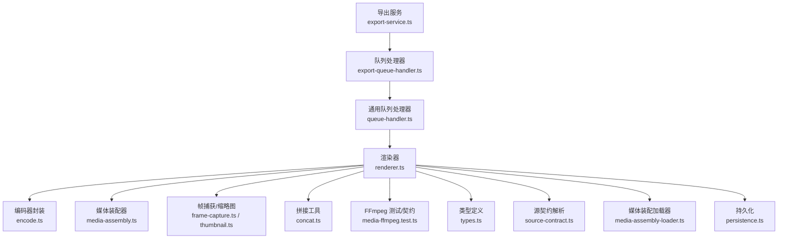
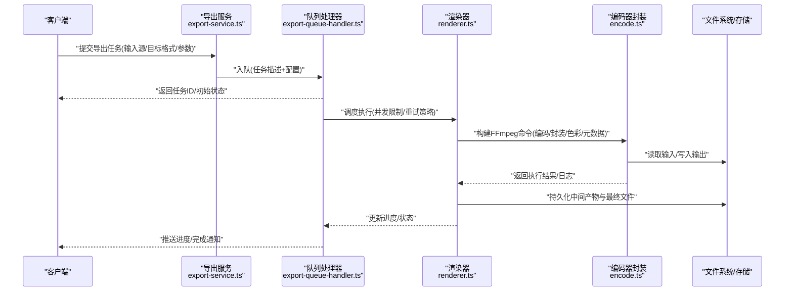
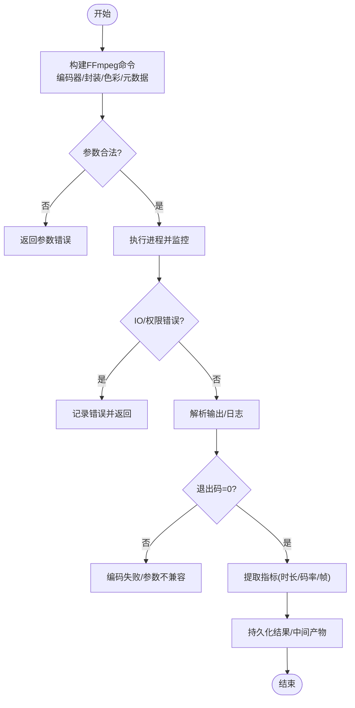
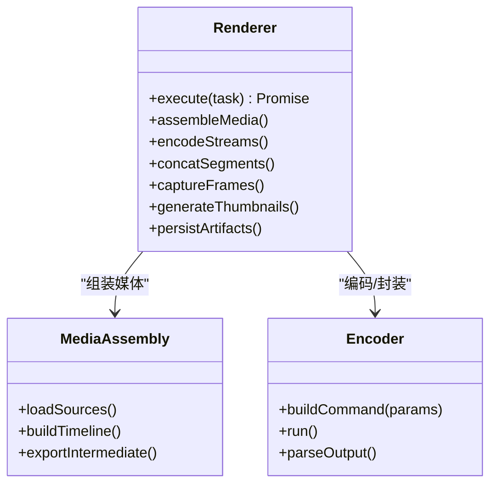
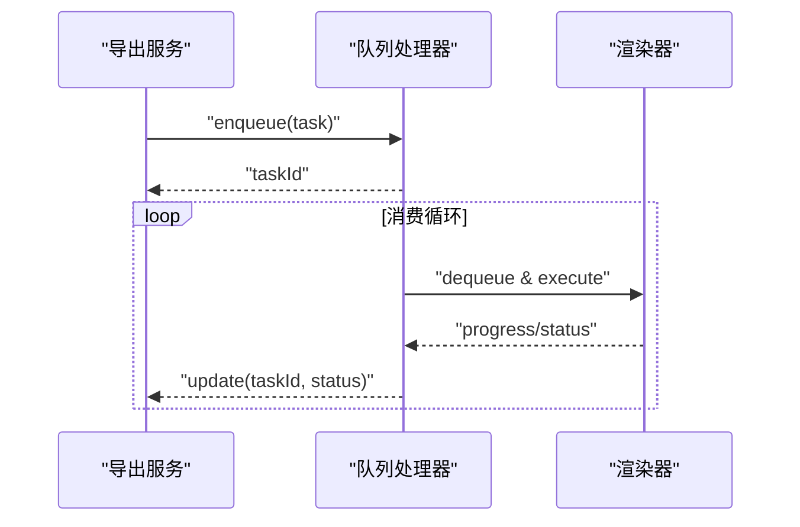
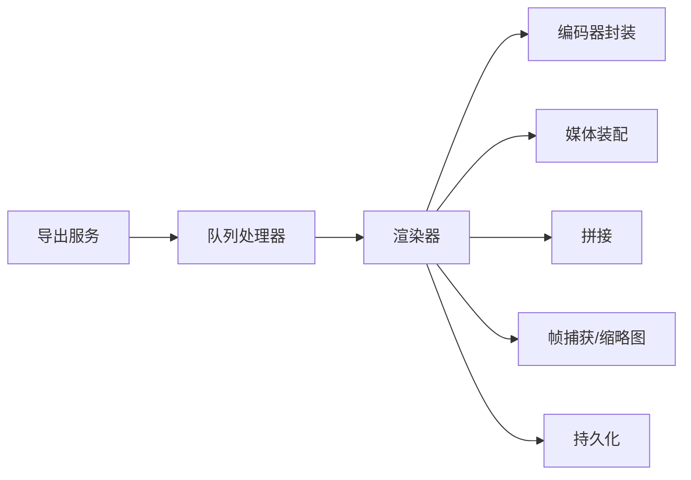

# 格式转换

<cite>
**本文引用的文件**   
- [encode.ts](file://src/features/render/encode.ts)
- [media-ffmpeg.test.ts](file://src/features/render/media-ffmpeg.test.ts)
- [export-service.ts](file://src/features/render/export-service.ts)
- [export-queue-handler.ts](file://src/features/render/export-queue-handler.ts)
- [queue-handler.ts](file://src/features/render/queue-handler.ts)
- [render.ts](file://src/features/render/renderer.ts)
- [concat.ts](file://src/features/render/concat.ts)
- [frame-capture.ts](file://src/features/render/frame-capture.ts)
- [thumbnail.ts](file://src/features/render/thumbnail.ts)
- [types.ts](file://src/features/render/types.ts)
- [source-contract.ts](file://src/features/render/source-contract.ts)
- [media-assembly-loader.ts](file://src/features/render/media-assembly-loader.ts)
- [media-assembly.ts](file://src/features/render/media-assembly.ts)
- [persistence.ts](file://src/features/render/persistence.ts)
</cite>

## 目录
1. [简介](#简介)
2. [项目结构](#项目结构)
3. [核心组件](#核心组件)
4. [架构总览](#架构总览)
5. [详细组件分析](#详细组件分析)
6. [依赖关系分析](#依赖关系分析)
7. [性能考虑](#性能考虑)
8. [故障排查指南](#故障排查指南)
9. [结论](#结论)
10. [附录](#附录)

## 简介
本文件面向使用 FFmpeg 进行媒体格式转换的开发者与运维人员，系统梳理本项目中视频与音频转码、封装、元数据处理、色彩空间处理以及批量转换任务编排的实现方式。文档覆盖支持的输入输出格式、数据流处理细节（容器封装、元数据保留、色彩空间转换）、批量转换策略（队列、进度、错误处理），并给出常见场景的最佳实践与性能优化建议。

## 项目结构
与 FFmpeg 相关的实现集中在渲染模块 features/render 下，关键文件包括编码器封装、导出服务、队列处理器、媒体装配器、帧捕获与缩略图生成等。整体采用分层设计：API/路由层调用导出服务，导出服务协调队列与执行器，执行器通过 FFmpeg 完成编码与封装，并通过持久化层落盘。

**图表来源** 
- [export-service.ts](file://src/features/render/export-service.ts)
- [export-queue-handler.ts](file://src/features/render/export-queue-handler.ts)
- [queue-handler.ts](file://src/features/render/queue-handler.ts)
- [renderer.ts](file://src/features/render/renderer.ts)
- [encode.ts](file://src/features/render/encode.ts)
- [media-assembly.ts](file://src/features/render/media-assembly.ts)
- [frame-capture.ts](file://src/features/render/frame-capture.ts)
- [thumbnail.ts](file://src/features/render/thumbnail.ts)
- [concat.ts](file://src/features/render/concat.ts)
- [media-ffmpeg.test.ts](file://src/features/render/media-ffmpeg.test.ts)
- [types.ts](file://src/features/render/types.ts)
- [source-contract.ts](file://src/features/render/source-contract.ts)
- [media-assembly-loader.ts](file://src/features/render/media-assembly-loader.ts)
- [persistence.ts](file://src/features/render/persistence.ts)

**章节来源**
- [export-service.ts](file://src/features/render/export-service.ts)
- [export-queue-handler.ts](file://src/features/render/export-queue-handler.ts)
- [queue-handler.ts](file://src/features/render/queue-handler.ts)
- [renderer.ts](file://src/features/render/renderer.ts)
- [encode.ts](file://src/features/render/encode.ts)
- [media-assembly.ts](file://src/features/render/media-assembly.ts)
- [frame-capture.ts](file://src/features/render/frame-capture.ts)
- [thumbnail.ts](file://src/features/render/thumbnail.ts)
- [concat.ts](file://src/features/render/concat.ts)
- [media-ffmpeg.test.ts](file://src/features/render/media-ffmpeg.test.ts)
- [types.ts](file://src/features/render/types.ts)
- [source-contract.ts](file://src/features/render/source-contract.ts)
- [media-assembly-loader.ts](file://src/features/render/media-assembly-loader.ts)
- [persistence.ts](file://src/features/render/persistence.ts)

## 核心组件
- 编码器封装（encode.ts）：对 FFmpeg 命令构建、参数映射、进程执行与结果校验进行统一封装，屏蔽底层差异。
- 渲染器（renderer.ts）：编排媒体装配、编码、拼接、截图/缩略图等步骤，驱动完整导出流程。
- 导出服务（export-service.ts）：对外暴露导出 API，负责入参校验、任务创建与状态管理。
- 队列处理器（export-queue-handler.ts / queue-handler.ts）：将导出任务入队、调度、重试、并发控制与进度上报。
- 媒体装配器（media-assembly.ts / media-assembly-loader.ts）：按时间线组装音视频轨道、片段与过渡，生成可被 FFmpeg 消费的中间产物或指令集。
- 帧捕获与缩略图（frame-capture.ts / thumbnail.ts）：基于 FFmpeg 抽取关键帧或生成缩略图，用于预览与质量检查。
- 拼接工具（concat.ts）：提供无损拼接或多段合并能力，减少重复解码/编码开销。
- 类型与契约（types.ts / source-contract.ts）：定义输入源、导出目标、编码参数与中间态数据结构，确保跨模块一致性。
- 持久化（persistence.ts）：记录任务状态、中间产物路径、日志与指标，支持恢复与审计。

**章节来源**
- [encode.ts](file://src/features/render/encode.ts)
- [renderer.ts](file://src/features/render/renderer.ts)
- [export-service.ts](file://src/features/render/export-service.ts)
- [export-queue-handler.ts](file://src/features/render/export-queue-handler.ts)
- [queue-handler.ts](file://src/features/render/queue-handler.ts)
- [media-assembly.ts](file://src/features/render/media-assembly.ts)
- [media-assembly-loader.ts](file://src/features/render/media-assembly-loader.ts)
- [frame-capture.ts](file://src/features/render/frame-capture.ts)
- [thumbnail.ts](file://src/features/render/thumbnail.ts)
- [concat.ts](file://src/features/render/concat.ts)
- [types.ts](file://src/features/render/types.ts)
- [source-contract.ts](file://src/features/render/source-contract.ts)
- [persistence.ts](file://src/features/render/persistence.ts)

## 架构总览
下图展示了从请求到导出的端到端流程，包含队列调度、渲染编排、FFmpeg 编码与持久化落盘。

**图表来源** 
- [export-service.ts](file://src/features/render/export-service.ts)
- [export-queue-handler.ts](file://src/features/render/export-queue-handler.ts)
- [queue-handler.ts](file://src/features/render/queue-handler.ts)
- [renderer.ts](file://src/features/render/renderer.ts)
- [encode.ts](file://src/features/render/encode.ts)
- [persistence.ts](file://src/features/render/persistence.ts)

## 详细组件分析

### 编码器封装（encode.ts）
- 职责：根据目标格式与参数构建 FFmpeg 命令行，设置编码器、比特率、采样率、像素格式、色彩空间、元数据拷贝/覆写等；执行进程并收集输出与错误流；解析退出码与关键指标（时长、码率、帧数）。
- 关键点：
  - 容器与编解码器选择：依据目标扩展名与配置映射到对应 muxer/codec。
  - 色彩空间：在需要时插入色彩空间转换滤镜链，保证输出符合目标设备/平台要求。
  - 元数据：支持选择性复制/清理/重写标签，避免敏感信息泄露。
  - 错误处理：区分 IO 错误、编码失败、参数非法等，抛出结构化错误以便上层重试或回滚。
  - 性能：启用硬件加速（如可用）、合理线程数、缓冲大小与预读参数。

**图表来源** 
- [encode.ts](file://src/features/render/encode.ts)
- [persistence.ts](file://src/features/render/persistence.ts)

**章节来源**
- [encode.ts](file://src/features/render/encode.ts)

### 渲染器（renderer.ts）
- 职责：串联媒体装配、编码、拼接、截图/缩略图、质量检查等阶段，维护任务上下文与中间状态。
- 关键点：
  - 阶段编排：按依赖顺序执行，支持并行子任务（如多轨道编码、缩略图生成）。
  - 资源管理：临时文件生命周期、磁盘空间检查、失败回滚。
  - 进度上报：分阶段推进，结合队列处理器向外部反馈。
  - 错误恢复：阶段性失败定位、重试边界与补偿操作。

**图表来源** 
- [renderer.ts](file://src/features/render/renderer.ts)
- [media-assembly.ts](file://src/features/render/media-assembly.ts)
- [encode.ts](file://src/features/render/encode.ts)

**章节来源**
- [renderer.ts](file://src/features/render/renderer.ts)

### 导出服务与队列（export-service.ts / export-queue-handler.ts / queue-handler.ts）
- 职责：接收导出请求，校验参数，创建任务并进入队列；消费者拉取任务，调用渲染器执行；统一进度与状态管理；支持重试、限流与优先级。
- 关键点：
  - 任务模型：唯一 ID、输入源、目标格式、编码参数、回调/事件通道。
  - 队列策略：并发度、超时、重试次数、死信队列。
  - 进度语义：百分比、当前阶段、剩余估算、错误消息。
  - 幂等性：相同任务多次提交不重复执行。

**图表来源** 
- [export-service.ts](file://src/features/render/export-service.ts)
- [export-queue-handler.ts](file://src/features/render/export-queue-handler.ts)
- [queue-handler.ts](file://src/features/render/queue-handler.ts)
- [renderer.ts](file://src/features/render/renderer.ts)

**章节来源**
- [export-service.ts](file://src/features/render/export-service.ts)
- [export-queue-handler.ts](file://src/features/render/export-queue-handler.ts)
- [queue-handler.ts](file://src/features/render/queue-handler.ts)

### 媒体装配与加载（media-assembly.ts / media-assembly-loader.ts）
- 职责：解析输入源（本地文件、URL、流），按时间线组织音视频轨道、字幕、封面、过渡效果，输出为 FFmpeg 可消费的清单或中间文件。
- 关键点：
  - 输入适配：不同协议与容器的统一抽象。
  - 轨道对齐：音画同步、PTS/DTS 校正、帧率/分辨率归一化。
  - 中间产物：分段文件、索引、滤镜脚本，便于断点续传与增量重建。

**章节来源**
- [media-assembly.ts](file://src/features/render/media-assembly.ts)
- [media-assembly-loader.ts](file://src/features/render/media-assembly-loader.ts)

### 帧捕获与缩略图（frame-capture.ts / thumbnail.ts）
- 职责：基于 FFmpeg 抽取关键帧或生成缩略图，用于预览、质量检查与封面展示。
- 关键点：
  - 抽帧策略：固定间隔、关键帧优先、内容感知（可选）。
  - 尺寸与格式：自适应目标尺寸，输出 PNG/JPEG/WebP 等。
  - 缓存：命中已有缩略图则跳过重绘。

**章节来源**
- [frame-capture.ts](file://src/features/render/frame-capture.ts)
- [thumbnail.ts](file://src/features/render/thumbnail.ts)

### 拼接工具（concat.ts）
- 职责：对已编码片段进行无损拼接，减少重复编码成本，提升批量导出效率。
- 关键点：
  - 条件检测：编码参数一致方可无损拼接。
  - 失败回退：参数不一致时降级为重新编码。

**章节来源**
- [concat.ts](file://src/features/render/concat.ts)

### 类型与源契约（types.ts / source-contract.ts）
- 职责：统一定义输入源、导出目标、编码参数、任务状态等数据结构，保障各模块间契约稳定。
- 关键点：
  - 输入源：本地路径、URL、流式输入。
  - 目标格式：容器、视频/音频编解码器、分辨率、帧率、码率、采样率。
  - 任务状态：待处理、进行中、成功、失败、重试中。

**章节来源**
- [types.ts](file://src/features/render/types.ts)
- [source-contract.ts](file://src/features/render/source-contract.ts)

### 持久化（persistence.ts）
- 职责：记录任务元数据、中间产物路径、日志与指标，支持查询、恢复与审计。
- 关键点：
  - 原子写入：避免部分写入导致状态不一致。
  - 清理策略：过期中间产物回收，释放磁盘空间。

**章节来源**
- [persistence.ts](file://src/features/render/persistence.ts)

## 依赖关系分析
- 低耦合高内聚：编码器封装独立于渲染器，渲染器仅依赖接口契约；队列处理器与渲染器解耦，便于替换实现。
- 外部依赖：FFmpeg 作为核心外部工具，通过 encode.ts 统一调用；文件系统/对象存储作为输入输出介质。
- 潜在循环依赖：通过类型与契约文件隔离，避免模块间直接引用导致的循环。

**图表来源** 
- [export-service.ts](file://src/features/render/export-service.ts)
- [export-queue-handler.ts](file://src/features/render/export-queue-handler.ts)
- [queue-handler.ts](file://src/features/render/queue-handler.ts)
- [renderer.ts](file://src/features/render/renderer.ts)
- [encode.ts](file://src/features/render/encode.ts)
- [media-assembly.ts](file://src/features/render/media-assembly.ts)
- [concat.ts](file://src/features/render/concat.ts)
- [frame-capture.ts](file://src/features/render/frame-capture.ts)
- [thumbnail.ts](file://src/features/render/thumbnail.ts)
- [persistence.ts](file://src/features/render/persistence.ts)

**章节来源**
- [export-service.ts](file://src/features/render/export-service.ts)
- [export-queue-handler.ts](file://src/features/render/export-queue-handler.ts)
- [queue-handler.ts](file://src/features/render/queue-handler.ts)
- [renderer.ts](file://src/features/render/renderer.ts)
- [encode.ts](file://src/features/render/encode.ts)
- [media-assembly.ts](file://src/features/render/media-assembly.ts)
- [concat.ts](file://src/features/render/concat.ts)
- [frame-capture.ts](file://src/features/render/frame-capture.ts)
- [thumbnail.ts](file://src/features/render/thumbnail.ts)
- [persistence.ts](file://src/features/render/persistence.ts)

## 性能考虑
- 编码参数调优：
  - 视频：选择合适的编码器（如 H.264/H.265）、预设（fast/medium/slow）、CRF/CQP、GOP 长度、B 帧数量。
  - 音频：AAC/MP3/LC-FLAC 等，根据用途选择码率与采样率。
- 色彩空间与像素格式：
  - 输入与输出色彩空间一致可减少转换开销；必要时使用高效滤镜链。
- 并发与批处理：
  - 队列并发度受 CPU/内存/IO 限制，需动态调整；大文件拆分任务以提升吞吐。
- 缓存与复用：
  - 缩略图/中间产物缓存命中可显著降低重复计算。
- 硬件加速：
  - 若环境支持 NVENC/QSV/VAAPI，优先启用以降低 CPU 占用。
- I/O 优化：
  - 使用高速磁盘/SSD，避免网络抖动；合理设置缓冲与预读。

[本节为通用指导，无需代码来源]

## 故障排查指南
- 常见问题定位：
  - 参数非法：检查目标格式与编码器兼容性、分辨率/帧率范围、码率上限。
  - 编码失败：查看 FFmpeg 错误日志，确认输入文件完整性与解码器支持。
  - 色彩异常：核对色彩空间与像素格式转换链，必要时强制转换。
  - 进度停滞：检查队列是否阻塞、资源是否耗尽（CPU/内存/磁盘）。
- 调试手段：
  - 启用详细日志与指标采集（时长、码率、帧数、错误码）。
  - 使用最小复现用例与单步执行定位问题。
  - 借助 ffprobe/ffplay 验证输入与中间产物。

**章节来源**
- [media-ffmpeg.test.ts](file://src/features/render/media-ffmpeg.test.ts)
- [encode.ts](file://src/features/render/encode.ts)
- [renderer.ts](file://src/features/render/renderer.ts)
- [queue-handler.ts](file://src/features/render/queue-handler.ts)

## 结论
本项目以模块化与契约化的方式实现了基于 FFmpeg 的媒体格式转换与导出流水线。通过编码器封装、渲染器编排、队列调度与持久化机制，提供了可扩展、可观测、可恢复的批量处理能力。遵循本文的最佳实践与性能建议，可在保证质量的前提下显著提升转换效率与稳定性。

[本节为总结，无需代码来源]

## 附录
- 支持的输入输出格式（示例）：
  - 视频容器：MP4、MOV、AVI、MKV、WebM 等（由 FFmpeg 支持决定）。
  - 视频编码：H.264、H.265、VP9、AV1 等（视编译选项与环境）。
  - 音频容器：MP3、AAC、WAV、FLAC、OPUS 等。
  - 音频编码：AAC、MP3、FLAC、Opus 等。
- 最佳实践清单：
  - 明确目标平台与播放器兼容性，优先选择广泛支持的编码与容器。
  - 合理使用 CRF/CQP 平衡质量与体积。
  - 对批量任务设置合理的并发度与重试策略。
  - 对敏感元数据进行清理或覆写。
  - 利用无损拼接减少重复编码。
  - 开启必要的缓存与中间产物管理。

[本节为补充说明，无需代码来源]