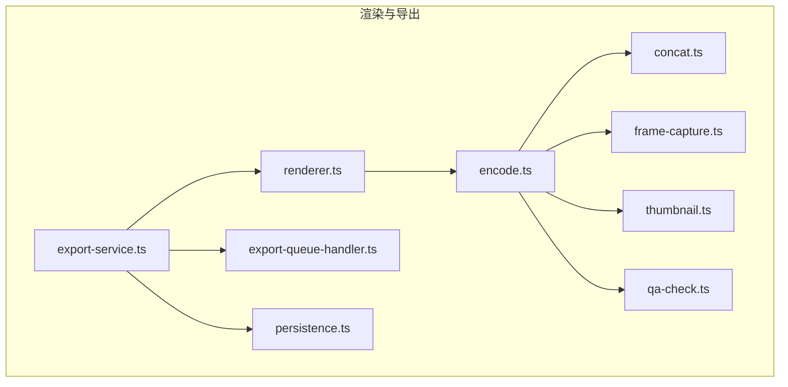
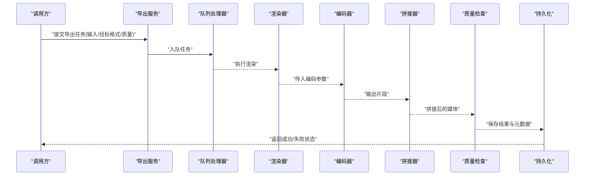
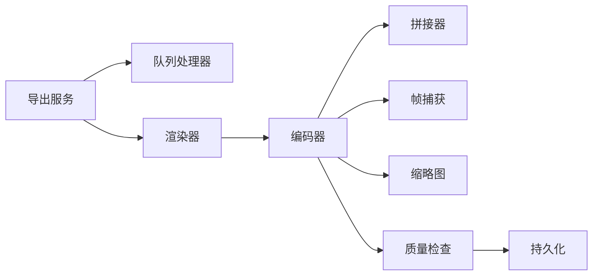
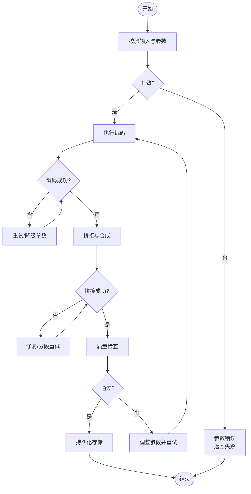

# 编解码处理

<cite>
**本文档引用的文件**   
- [src/features/render/encode.ts](file://src/features/render/encode.ts)
- [src/features/render/media-ffmpeg.test.ts](file://src/features/render/media-ffmpeg.test.ts)
- [src/features/render/renderer.ts](file://src/features/render/renderer.ts)
- [src/features/render/export-service.ts](file://src/features/render/export-service.ts)
- [src/features/render/export-queue-handler.ts](file://src/features/render/export-queue-handler.ts)
- [src/features/render/concat.ts](file://src/features/render/concat.ts)
- [src/features/render/frame-capture.ts](file://src/features/render/frame-capture.ts)
- [src/features/render/thumbnail.ts](file://src/features/render/thumbnail.ts)
- [src/features/render/qa-check.ts](file://src/features/render/qa-check.ts)
- [src/features/render/persistence.ts](file://src/features/render/persistence.ts)
- [src/features/render/types.ts](file://src/features/render/types.ts)
</cite>

## 目录
1. [简介](#简介)
2. [项目结构](#项目结构)
3. [核心组件](#核心组件)
4. [架构总览](#架构总览)
5. [详细组件分析](#详细组件分析)
6. [依赖关系分析](#依赖关系分析)
7. [性能考量](#性能考量)
8. [故障排查指南](#故障排查指南)
9. [结论](#结论)
10. [附录](#附录)

## 简介
本文件面向FFmpeg在视频与音频编解码处理中的使用，结合仓库中渲染与导出模块的实现，系统梳理编码流程、支持的格式、编码器选择策略、参数配置方法、质量控制要点（码率控制、质量预设、关键帧间隔等），并提供命令示例与调优建议。同时总结错误处理与异常恢复机制，帮助读者在生产环境中稳定高效地完成媒体转码任务。

## 项目结构
与FFmpeg相关的实现集中在渲染与导出子系统，主要涉及以下职责：
- 编码与封装：将渲染结果或中间片段编码为最终容器格式
- 拼接与合成：对多段媒体进行时间轴拼接与轨道合成
- 帧捕获与缩略图：从媒体流中提取关键帧或生成预览图
- 质量检查：对输出进行基础质量校验
- 持久化与队列：将任务入队、执行并落盘

图表来源
- [src/features/render/renderer.ts](file://src/features/render/renderer.ts)
- [src/features/render/encode.ts](file://src/features/render/encode.ts)
- [src/features/render/concat.ts](file://src/features/render/concat.ts)
- [src/features/render/frame-capture.ts](file://src/features/render/frame-capture.ts)
- [src/features/render/thumbnail.ts](file://src/features/render/thumbnail.ts)
- [src/features/render/qa-check.ts](file://src/features/render/qa-check.ts)
- [src/features/render/export-service.ts](file://src/features/render/export-service.ts)
- [src/features/render/export-queue-handler.ts](file://src/features/render/export-queue-handler.ts)
- [src/features/render/persistence.ts](file://src/features/render/persistence.ts)

章节来源
- [src/features/render/renderer.ts](file://src/features/render/renderer.ts)
- [src/features/render/encode.ts](file://src/features/render/encode.ts)
- [src/features/render/export-service.ts](file://src/features/render/export-service.ts)
- [src/features/render/export-queue-handler.ts](file://src/features/render/export-queue-handler.ts)

## 核心组件
- 编码器与参数装配：负责根据目标格式与质量要求组装FFmpeg参数，选择合适的视频/音频编码器，设置码率、预设、关键帧间隔等
- 拼接器：按时间线顺序合并多个媒体片段，确保轨道对齐与无缝衔接
- 帧捕获与缩略图：基于时间戳或关键帧位置提取图像帧
- 质量检查：对输出文件的时长、分辨率、码率、音画同步等进行验证
- 导出服务与队列：管理任务生命周期、并发与重试，保证失败可恢复
- 持久化：记录任务状态、输入输出路径、元数据与日志

章节来源
- [src/features/render/encode.ts](file://src/features/render/encode.ts)
- [src/features/render/concat.ts](file://src/features/render/concat.ts)
- [src/features/render/frame-capture.ts](file://src/features/render/frame-capture.ts)
- [src/features/render/thumbnail.ts](file://src/features/render/thumbnail.ts)
- [src/features/render/qa-check.ts](file://src/features/render/qa-check.ts)
- [src/features/render/export-service.ts](file://src/features/render/export-service.ts)
- [src/features/render/export-queue-handler.ts](file://src/features/render/export-queue-handler.ts)
- [src/features/render/persistence.ts](file://src/features/render/persistence.ts)

## 架构总览
整体流程由导出服务驱动，通过队列处理器调度渲染与编码任务；编码器根据目标格式选择合适参数，完成编码后进入拼接阶段（如需），随后进行质量检查与持久化存储。

图表来源
- [src/features/render/export-service.ts](file://src/features/render/export-service.ts)
- [src/features/render/export-queue-handler.ts](file://src/features/render/export-queue-handler.ts)
- [src/features/render/renderer.ts](file://src/features/render/renderer.ts)
- [src/features/render/encode.ts](file://src/features/render/encode.ts)
- [src/features/render/concat.ts](file://src/features/render/concat.ts)
- [src/features/render/qa-check.ts](file://src/features/render/qa-check.ts)
- [src/features/render/persistence.ts](file://src/features/render/persistence.ts)

## 详细组件分析

### 编码器与参数装配（encode.ts）
- 功能要点
  - 根据目标容器格式选择视频/音频编码器（如H.264/H.265/AAC/MP3等）
  - 组装码率控制参数（CBR/VBR/CRF）、质量预设、关键帧间隔、像素格式、声道布局等
  - 支持多路输入（视频+音频）的映射与同步
  - 提供调试与日志能力，便于定位问题
- 典型参数维度
  - 视频编码器：h264_nvenc/h264_videotoolbox/libx264/h265/hevc_nvenc等
  - 音频编码器：aac, mp3, libfdk_aac, opus等
  - 码率控制：固定码率、可变码率、恒定质量（CRF）
  - 关键帧：gop大小、b帧数量、参考帧数
  - 像素格式：yuv420p/yuv422p等
  - 采样率与声道：44100/48000Hz，立体声/环绕声
- 复杂度与优化
  - 参数组合空间大，需通过模板与规则减少无效组合
  - 硬件加速优先，回退到软件编码以保证兼容性
  - 并行编码与批处理提升吞吐

章节来源
- [src/features/render/encode.ts](file://src/features/render/encode.ts)
- [src/features/render/media-ffmpeg.test.ts](file://src/features/render/media-ffmpeg.test.ts)

### 拼接器（concat.ts）
- 功能要点
  - 按时间线顺序合并多个片段，处理轨道对齐、时间戳连续性
  - 支持音视频多轨合并与去重
  - 失败时保留中间产物以便重试
- 注意事项
  - 统一编码参数以避免拼接处跳变
  - 处理边界情况（静音帧、黑帧、时长对齐）

章节来源
- [src/features/render/concat.ts](file://src/features/render/concat.ts)

### 帧捕获与缩略图（frame-capture.ts, thumbnail.ts）
- 功能要点
  - 基于时间戳或关键帧位置提取帧
  - 生成缩略图用于预览与展示
  - 支持多种输出尺寸与格式
- 性能优化
  - 利用seek与只读模式降低I/O
  - 批量生成与缓存命中

章节来源
- [src/features/render/frame-capture.ts](file://src/features/render/frame-capture.ts)
- [src/features/render/thumbnail.ts](file://src/features/render/thumbnail.ts)

### 质量检查（qa-check.ts）
- 功能要点
  - 校验输出时长、分辨率、码率、音画同步
  - 检测黑屏/静音等异常
  - 失败时给出明确错误信息以辅助修复
- 指标与阈值
  - 时长误差容忍范围
  - 码率上下限
  - 音画偏移阈值

章节来源
- [src/features/render/qa-check.ts](file://src/features/render/qa-check.ts)

### 导出服务与队列（export-service.ts, export-queue-handler.ts）
- 功能要点
  - 任务入队、调度、重试与超时控制
  - 并发限制与资源隔离
  - 失败恢复与断点续传（基于中间产物）
- 监控与可观测性
  - 任务状态机与指标上报
  - 日志聚合与追踪ID

章节来源
- [src/features/render/export-service.ts](file://src/features/render/export-service.ts)
- [src/features/render/export-queue-handler.ts](file://src/features/render/export-queue-handler.ts)

### 渲染器（renderer.ts）
- 功能要点
  - 协调渲染管线，产出中间媒体或帧序列
  - 与编码器对接，传递参数与输入源
  - 处理渲染阶段的异常与回滚

章节来源
- [src/features/render/renderer.ts](file://src/features/render/renderer.ts)

### 类型与契约（types.ts）
- 功能要点
  - 定义任务结构、编码器选项、质量配置、输出规格
  - 约束输入输出格式与字段含义

章节来源
- [src/features/render/types.ts](file://src/features/render/types.ts)

### 持久化（persistence.ts）
- 功能要点
  - 记录任务元数据、输入输出路径、状态与日志
  - 支持查询与审计

章节来源
- [src/features/render/persistence.ts](file://src/features/render/persistence.ts)

## 依赖关系分析
- 组件耦合
  - 导出服务依赖队列处理器与渲染器
  - 渲染器依赖编码器、拼接器、帧捕获与缩略图
  - 质量检查与持久化贯穿全流程
- 外部依赖
  - FFmpeg命令行或库接口（通过测试与实现间接体现）
  - 文件系统与对象存储（用于输入输出与中间产物）
- 潜在循环依赖
  - 通过分层与接口解耦避免循环引用

图表来源
- [src/features/render/export-service.ts](file://src/features/render/export-service.ts)
- [src/features/render/export-queue-handler.ts](file://src/features/render/export-queue-handler.ts)
- [src/features/render/renderer.ts](file://src/features/render/renderer.ts)
- [src/features/render/encode.ts](file://src/features/render/encode.ts)
- [src/features/render/concat.ts](file://src/features/render/concat.ts)
- [src/features/render/frame-capture.ts](file://src/features/render/frame-capture.ts)
- [src/features/render/thumbnail.ts](file://src/features/render/thumbnail.ts)
- [src/features/render/qa-check.ts](file://src/features/render/qa-check.ts)
- [src/features/render/persistence.ts](file://src/features/render/persistence.ts)

章节来源
- [src/features/render/export-service.ts](file://src/features/render/export-service.ts)
- [src/features/render/export-queue-handler.ts](file://src/features/render/export-queue-handler.ts)
- [src/features/render/renderer.ts](file://src/features/render/renderer.ts)
- [src/features/render/encode.ts](file://src/features/render/encode.ts)

## 性能考量
- 编码器选择
  - 优先硬件加速（NVENC/Videotoolbox）以提升吞吐与能效
  - 回退策略：硬件不可用时自动切换软件编码器
- 码率控制
  - CRF适合主观质量优先场景；CBR适合带宽受限场景
  - VBR平衡质量与体积，需设定合理上限与下限
- 关键帧与GOP
  - 缩短GOP利于随机访问与剪辑，但增加体积
  - 长GOP适合流式传输与低码率
- 并行与批处理
  - 多任务并发受CPU/GPU与I/O限制，需动态调整
  - 中间产物复用减少重复计算
- I/O优化
  - 使用内存映射或零拷贝减少磁盘压力
  - 预取与缓冲策略降低延迟

[本节为通用指导，不直接分析具体文件]

## 故障排查指南
- 常见问题
  - 编码器不支持目标格式或参数非法
  - 输入媒体损坏或时间戳异常导致拼接失败
  - 硬件加速不可用或驱动版本过旧
  - 输出质量不达标（黑屏、静音、音画不同步）
- 诊断步骤
  - 查看编码器日志与错误码，定位参数问题
  - 使用ffprobe检查输入/输出媒体属性
  - 逐步缩小范围：单片段编码、关闭拼接、降级编码器
  - 启用更详细的日志与追踪ID
- 恢复策略
  - 失败重试与参数自适应（降低码率、切换编码器）
  - 断点续传：基于中间产物继续处理
  - 降级输出：先保可用性再追求质量

章节来源
- [src/features/render/encode.ts](file://src/features/render/encode.ts)
- [src/features/render/qa-check.ts](file://src/features/render/qa-check.ts)
- [src/features/render/export-queue-handler.ts](file://src/features/render/export-queue-handler.ts)

## 结论
本仓库的渲染与导出子系统围绕FFmpeg构建了完整的编解码流水线，涵盖编码器选择、参数装配、拼接、质量检查与持久化。通过分层设计与队列化管理，系统在稳定性与可扩展性上具备良好基础。生产环境应重点关注编码器适配、码率与关键帧策略、并发与I/O优化，以及完善的错误处理与恢复机制。

[本节为总结性内容，不直接分析具体文件]

## 附录

### 支持的格式与编码器选择建议
- 视频编码
  - H.264：兼容性好，适合Web与移动端
  - H.265：更高压缩比，适合高分辨率与带宽受限场景
  - 硬件加速：NVENC/Videotoolbox优先，软件编码回退
- 音频编码
  - AAC：通用性强，适合流媒体与移动平台
  - MP3：广泛兼容，体积较大
  - Opus：高音质低码率，适合实时通信
- 容器格式
  - MP4：主流通用
  - MKV：支持多轨与字幕
  - WebM：Web友好

[本节为概念性说明，不直接分析具体文件]

### 编码质量控制参数指南
- 码率控制
  - CRF：质量优先，推荐值20-28（视内容而定）
  - CBR：带宽稳定，设置目标码率与缓冲区大小
  - VBR：上限/下限与平均码率配合
- 质量预设
  - 速度/质量权衡：fast/medium/slow等
  - 预设影响编码速度与压缩效率
- 关键帧间隔
  - GOP=帧率×秒数，常见1-2秒
  - B帧与参考帧数量影响压缩与延迟

[本节为概念性说明，不直接分析具体文件]

### FFmpeg命令示例与调优
- 基本转码（H.264+AAC）
  - ffmpeg -i input.mp4 -c:v libx264 -crf 23 -preset medium -c:a aac -b:a 128k output.mp4
- 高质量H.265
  - ffmpeg -i input.mp4 -c:v libx265 -crf 20 -preset slow -c:a aac -b:a 192k output.mp4
- 硬件加速（NVIDIA）
  - ffmpeg -i input.mp4 -c:v h264_nvenc -b:v 4M -preset p4 -c:a aac -b:a 128k output.mp4
- 生成缩略图
  - ffmpeg -i input.mp4 -vf "select=eq(n\,10)" -frames:v 1 thumb.jpg
- 拼接片段
  - ffmpeg -f concat -safe 0 -i list.txt -c copy output.mp4

[本节为通用示例，不直接分析具体文件]

### 错误处理与异常恢复流程图

图表来源
- [src/features/render/export-queue-handler.ts](file://src/features/render/export-queue-handler.ts)
- [src/features/render/encode.ts](file://src/features/render/encode.ts)
- [src/features/render/concat.ts](file://src/features/render/concat.ts)
- [src/features/render/qa-check.ts](file://src/features/render/qa-check.ts)
- [src/features/render/persistence.ts](file://src/features/render/persistence.ts)