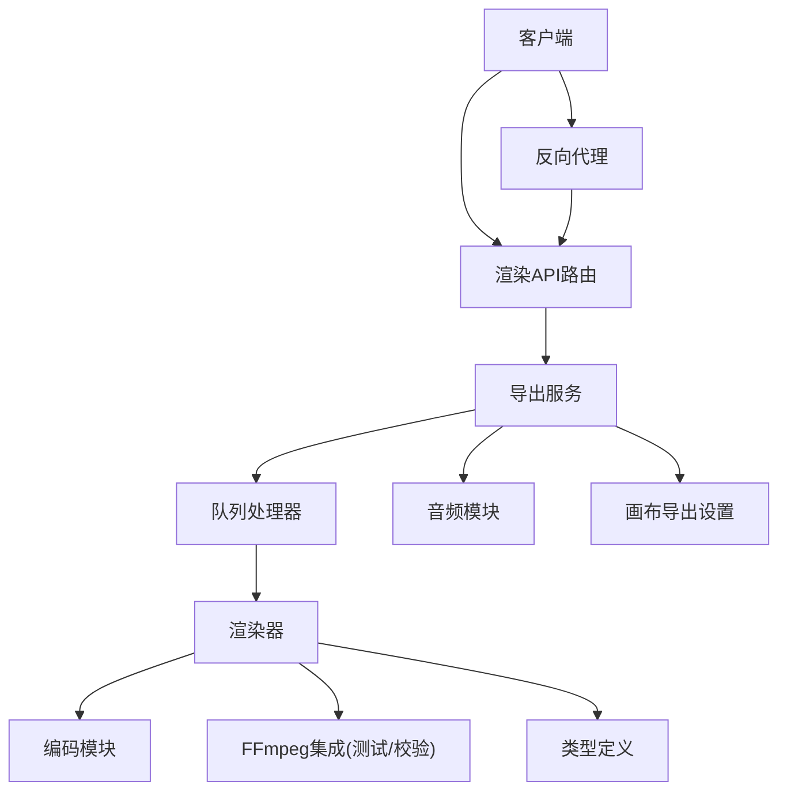
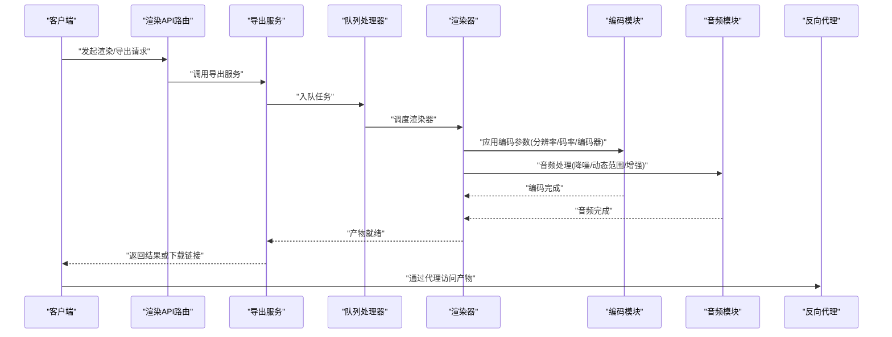
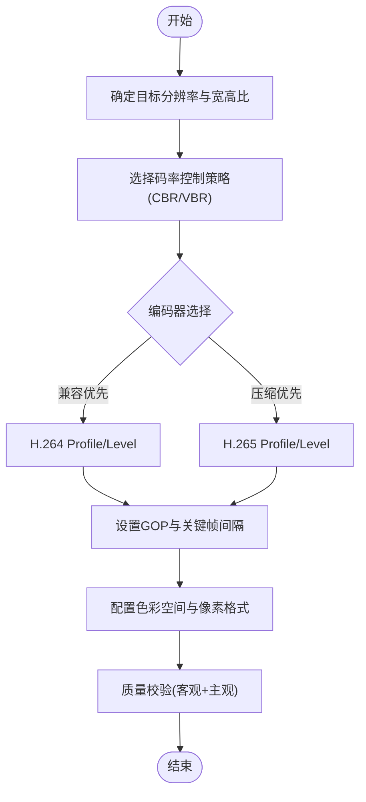
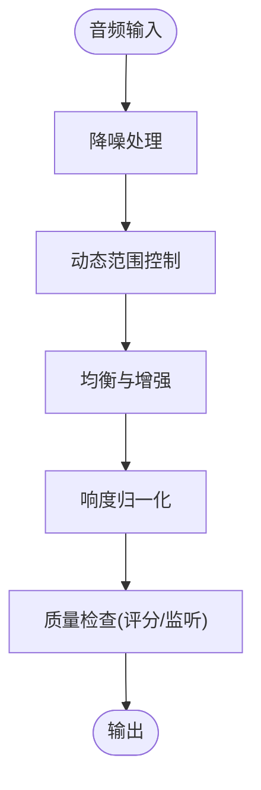
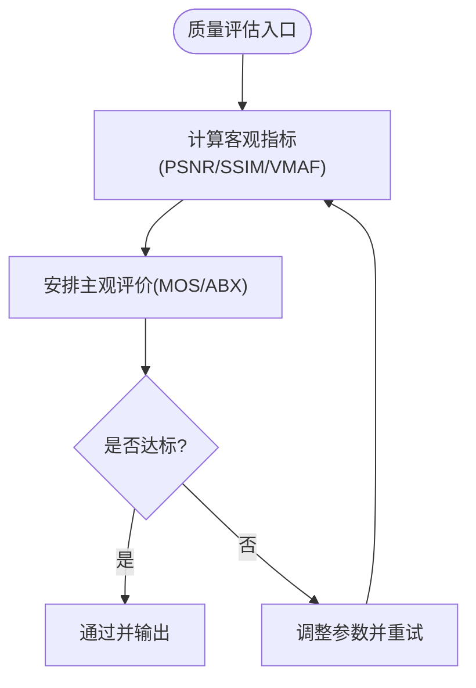
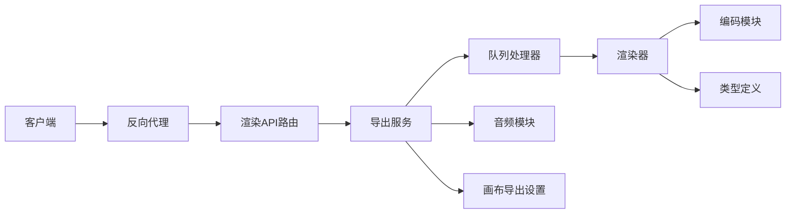

# 质量优化

<cite>
**本文引用的文件**   
- [server/src/index.ts](file://server/src/index.ts)
- [src/features/render/encode.ts](file://src/features/render/encode.ts)
- [src/features/render/media-ffmpeg.test.ts](file://src/features/render/media-ffmpeg.test.ts)
- [src/features/render/renderer.ts](file://src/features/render/renderer.ts)
- [src/features/render/export-service.ts](file://src/features/render/export-service.ts)
- [src/features/render/queue-handler.ts](file://src/features/render/queue-handler.ts)
- [src/features/render/types.ts](file://src/features/render/types.ts)
- [src/features/audio/narration.ts](file://src/features/audio/narration.ts)
- [src/features/audio/score.ts](file://src/features/audio/score.ts)
- [src/features/canvas/export-settings.ts](file://src/features/canvas/export-settings.ts)
- [src/app/api/render/route.ts](file://src/app/api/render/route.ts)
- [src/app/api/render/export/route.ts](file://src/app/api/render/export/route.ts)
- [deploy/reverse-proxy/Dockerfile](file://deploy/reverse-proxy/Dockerfile)
- [deploy/reverse-proxy/entrypoint.sh](file://deploy/reverse-proxy/entrypoint.sh)
</cite>

## 目录
1. [简介](#简介)
2. [项目结构](#项目结构)
3. [核心组件](#核心组件)
4. [架构总览](#架构总览)
5. [详细组件分析](#详细组件分析)
6. [依赖关系分析](#依赖关系分析)
7. [性能考量](#性能考量)
8. [故障排查指南](#故障排查指南)
9. [结论](#结论)
10. [附录](#附录)

## 简介
本文件面向FFmpeg驱动的视频与音频质量优化，覆盖分辨率调整、码率控制、压缩算法选择、音频降噪与动态范围管理、音质增强、质量评估指标（PSNR、SSIM等）与主观评价方法，并提供网络传输、本地播放、专业制作等场景的配置模板。同时给出质量与性能的平衡策略，帮助在有限资源下获得最佳感知质量。

## 项目结构
本项目在服务端通过渲染与导出管线组织媒体处理流程，关键路径包括：
- 渲染服务与队列处理器负责任务编排与执行
- FFmpeg相关测试与编码模块用于视频编码参数与流程验证
- 导出服务与API路由暴露对外接口
- 音频模块提供叙事生成与评分能力
- 画布导出设置定义输出规格
- 反向代理部署配置影响网络传输质量

**图示来源** 
- [src/app/api/render/route.ts](file://src/app/api/render/route.ts)
- [src/app/api/render/export/route.ts](file://src/app/api/render/export/route.ts)
- [src/features/render/export-service.ts](file://src/features/render/export-service.ts)
- [src/features/render/queue-handler.ts](file://src/features/render/queue-handler.ts)
- [src/features/render/renderer.ts](file://src/features/render/renderer.ts)
- [src/features/render/encode.ts](file://src/features/render/encode.ts)
- [src/features/render/media-ffmpeg.test.ts](file://src/features/render/media-ffmpeg.test.ts)
- [src/features/render/types.ts](file://src/features/render/types.ts)
- [src/features/audio/narration.ts](file://src/features/audio/narration.ts)
- [src/features/canvas/export-settings.ts](file://src/features/canvas/export-settings.ts)
- [deploy/reverse-proxy/Dockerfile](file://deploy/reverse-proxy/Dockerfile)
- [deploy/reverse-proxy/entrypoint.sh](file://deploy/reverse-proxy/entrypoint.sh)

**章节来源**
- [server/src/index.ts](file://server/src/index.ts)
- [src/app/api/render/route.ts](file://src/app/api/render/route.ts)
- [src/app/api/render/export/route.ts](file://src/app/api/render/export/route.ts)
- [src/features/render/export-service.ts](file://src/features/render/export-service.ts)
- [src/features/render/queue-handler.ts](file://src/features/render/queue-handler.ts)
- [src/features/render/renderer.ts](file://src/features/render/renderer.ts)
- [src/features/render/encode.ts](file://src/features/render/encode.ts)
- [src/features/render/media-ffmpeg.test.ts](file://src/features/render/media-ffmpeg.test.ts)
- [src/features/render/types.ts](file://src/features/render/types.ts)
- [src/features/audio/narration.ts](file://src/features/audio/narration.ts)
- [src/features/canvas/export-settings.ts](file://src/features/canvas/export-settings.ts)
- [deploy/reverse-proxy/Dockerfile](file://deploy/reverse-proxy/Dockerfile)
- [deploy/reverse-proxy/entrypoint.sh](file://deploy/reverse-proxy/entrypoint.sh)

## 核心组件
- 渲染器：协调输入源、转码、合成与输出，是质量优化的核心执行点
- 编码模块：封装FFmpeg编码参数，实现分辨率、码率、编码器选择等
- 导出服务：对外提供导出能力，串联渲染与音频处理
- 队列处理器：任务调度与并发控制，影响吞吐与延迟
- 类型定义：统一数据结构，确保配置一致性
- 音频模块：提供语音合成、音频评分与后处理能力
- 画布导出设置：定义输出分辨率、帧率、码率等规格
- 反向代理：影响网络传输的缓冲、限流与缓存策略

**章节来源**
- [src/features/render/renderer.ts](file://src/features/render/renderer.ts)
- [src/features/render/encode.ts](file://src/features/render/encode.ts)
- [src/features/render/export-service.ts](file://src/features/render/export-service.ts)
- [src/features/render/queue-handler.ts](file://src/features/render/queue-handler.ts)
- [src/features/render/types.ts](file://src/features/render/types.ts)
- [src/features/audio/narration.ts](file://src/features/audio/narration.ts)
- [src/features/canvas/export-settings.ts](file://src/features/canvas/export-settings.ts)

## 架构总览
下图展示从请求到导出的端到端流程，以及质量优化在各环节的作用点。

**图示来源** 
- [src/app/api/render/route.ts](file://src/app/api/render/route.ts)
- [src/app/api/render/export/route.ts](file://src/app/api/render/export/route.ts)
- [src/features/render/export-service.ts](file://src/features/render/export-service.ts)
- [src/features/render/queue-handler.ts](file://src/features/render/queue-handler.ts)
- [src/features/render/renderer.ts](file://src/features/render/renderer.ts)
- [src/features/render/encode.ts](file://src/features/render/encode.ts)
- [src/features/audio/narration.ts](file://src/features/audio/narration.ts)
- [deploy/reverse-proxy/Dockerfile](file://deploy/reverse-proxy/Dockerfile)
- [deploy/reverse-proxy/entrypoint.sh](file://deploy/reverse-proxy/entrypoint.sh)

## 详细组件分析

### 视频质量优化
- 分辨率调整
  - 依据目标设备与带宽自适应缩放，避免过度上采样导致伪影
  - 保持宽高比，必要时使用填充或裁剪策略
- 码率控制
  - 采用CBR/VBR混合策略，运动复杂场景提高瞬时码率
  - 设置最大码率与缓冲区大小，防止抖动与卡顿
- 压缩算法选择
  - H.264兼容性最佳，H.265提升压缩效率但解码成本更高
  - 根据终端能力与平台支持选择编码器预设与profile
- 关键帧与GOP
  - 合理设置关键帧间隔，平衡随机访问与压缩效率
- 色彩与像素格式
  - 使用BT.709/BT.2020与8/10bit深度匹配内容需求
  - 注意色度子采样对细节的影响

**图示来源** 
- [src/features/render/encode.ts](file://src/features/render/encode.ts)
- [src/features/render/media-ffmpeg.test.ts](file://src/features/render/media-ffmpeg.test.ts)
- [src/features/canvas/export-settings.ts](file://src/features/canvas/export-settings.ts)

**章节来源**
- [src/features/render/encode.ts](file://src/features/render/encode.ts)
- [src/features/render/media-ffmpeg.test.ts](file://src/features/render/media-ffmpeg.test.ts)
- [src/features/canvas/export-settings.ts](file://src/features/canvas/export-settings.ts)

### 音频质量优化
- 降噪处理
  - 基于频谱抑制与时域滤波降低背景噪声
  - 保留语音频段，避免过度抑制导致失真
- 动态范围调整
  - 使用压缩与限制器控制峰值，提升听感一致性
  - 针对不同平台响度标准进行归一化
- 音质增强
  - 均衡器微调高频清晰度与低频厚度
  - 多声道混音与声像定位优化

**图示来源** 
- [src/features/audio/narration.ts](file://src/features/audio/narration.ts)
- [src/features/audio/score.ts](file://src/features/audio/score.ts)

**章节来源**
- [src/features/audio/narration.ts](file://src/features/audio/narration.ts)
- [src/features/audio/score.ts](file://src/features/audio/score.ts)

### 质量评估指标
- 客观指标
  - PSNR：衡量像素级误差，适合快速评估但不完全反映感知质量
  - SSIM：模拟人眼感知，关注结构与亮度变化
  - VMAF：结合多种特征预测主观质量，适用于视频流媒体
- 主观评价
  - MOS（平均意见得分）：用户打分，贴近真实体验
  - ABX对比：双盲测试，评估差异显著性
- 自动化评估
  - 在渲染流水线中嵌入质量检查，失败则回退或告警

[本节为概念性说明，不直接分析具体文件]

### 应用场景配置模板
- 网络传输
  - 目标：低延迟、稳定码率、良好兼容性
  - 建议：H.264 High Profile、VBR中等、关键帧间隔适中、音频AAC-LC
- 本地播放
  - 目标：高画质、流畅回放
  - 建议：H.265 Main/High、VBR较高、关键帧间隔较长、音频FLAC或AAC高码率
- 专业制作
  - 目标：无损或近无损、后期可编辑
  - 建议：ProRes/H.265 10bit、CBR或高质量VBR、音频PCM/WAV

[本节为概念性说明，不直接分析具体文件]

### 质量与性能的平衡策略
- 编码器预设与线程数
  - 使用fast/medium/slow预设权衡编码速度与质量
  - 合理分配CPU/GPU资源，避免过载
- 分辨率与码率的折中
  - 根据带宽与设备能力动态调整，避免过高码率造成浪费
- 关键帧与GOP
  - 短GOP利于随机访问但增加体积；长GOP提升压缩但影响交互
- 缓存与预取
  - 利用CDN与服务器缓存减少重复编码与传输开销

[本节为概念性说明，不直接分析具体文件]

## 依赖关系分析
渲染与导出模块之间的依赖如下：

**图示来源** 
- [src/app/api/render/route.ts](file://src/app/api/render/route.ts)
- [src/app/api/render/export/route.ts](file://src/app/api/render/export/route.ts)
- [src/features/render/export-service.ts](file://src/features/render/export-service.ts)
- [src/features/render/queue-handler.ts](file://src/features/render/queue-handler.ts)
- [src/features/render/renderer.ts](file://src/features/render/renderer.ts)
- [src/features/render/encode.ts](file://src/features/render/encode.ts)
- [src/features/render/types.ts](file://src/features/render/types.ts)
- [src/features/audio/narration.ts](file://src/features/audio/narration.ts)
- [src/features/canvas/export-settings.ts](file://src/features/canvas/export-settings.ts)
- [deploy/reverse-proxy/Dockerfile](file://deploy/reverse-proxy/Dockerfile)
- [deploy/reverse-proxy/entrypoint.sh](file://deploy/reverse-proxy/entrypoint.sh)

**章节来源**
- [src/app/api/render/route.ts](file://src/app/api/render/route.ts)
- [src/app/api/render/export/route.ts](file://src/app/api/render/export/route.ts)
- [src/features/render/export-service.ts](file://src/features/render/export-service.ts)
- [src/features/render/queue-handler.ts](file://src/features/render/queue-handler.ts)
- [src/features/render/renderer.ts](file://src/features/render/renderer.ts)
- [src/features/render/encode.ts](file://src/features/render/encode.ts)
- [src/features/render/types.ts](file://src/features/render/types.ts)
- [src/features/audio/narration.ts](file://src/features/audio/narration.ts)
- [src/features/canvas/export-settings.ts](file://src/features/canvas/export-settings.ts)
- [deploy/reverse-proxy/Dockerfile](file://deploy/reverse-proxy/Dockerfile)
- [deploy/reverse-proxy/entrypoint.sh](file://deploy/reverse-proxy/entrypoint.sh)

## 性能考量
- 并发与队列
  - 控制队列长度与消费者数量，避免内存溢出与CPU争用
- 编码加速
  - 启用硬件加速（如NVENC/QuickSync），降低CPU负载
- I/O优化
  - 使用高速存储与并行读取，减少磁盘瓶颈
- 缓存策略
  - 对相同参数的渲染结果进行缓存，避免重复计算

[本节为概念性说明，不直接分析具体文件]

## 故障排查指南
- 常见问题
  - 编码失败：检查编码器可用性、参数合法性与资源限制
  - 音频不同步：确认时间戳与帧率一致，检查音视频轨道对齐
  - 质量不达标：调整码率与编码器预设，重新评估客观与主观指标
- 诊断步骤
  - 查看日志与错误信息，定位失败阶段
  - 使用ffprobe/ffplay验证输入输出属性
  - 逐步简化参数，隔离问题来源

**章节来源**
- [src/features/render/queue-handler.ts](file://src/features/render/queue-handler.ts)
- [src/features/render/export-service.ts](file://src/features/render/export-service.ts)
- [src/features/render/renderer.ts](file://src/features/render/renderer.ts)

## 结论
通过在渲染与导出管线中系统化地应用分辨率、码率、编码器与音频后处理策略，并结合客观与主观质量评估，可以在不同场景下实现质量与性能的平衡。建议持续监控关键指标，迭代优化参数，确保用户体验与资源利用的最优组合。

[本节为总结性说明，不直接分析具体文件]

## 附录
- 术语表
  - CBR/VBR：恒定/可变码率
  - GOP：图像组，包含关键帧与中间帧
  - PSNR/SSIM/VMAF：视频质量客观指标
  - MOS/ABX：主观评价方法
- 参考实践
  - 针对不同平台的编码参数最佳实践
  - 音频响度标准与动态范围管理指南

[本节为概念性说明，不直接分析具体文件]