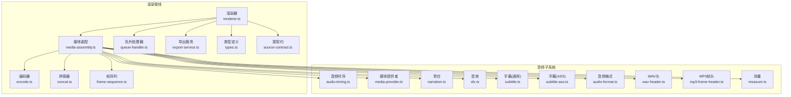
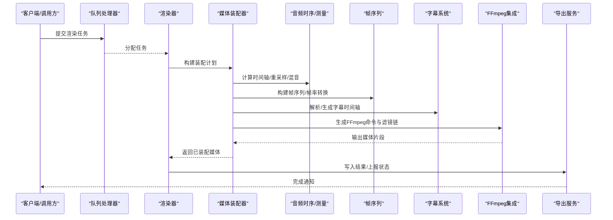
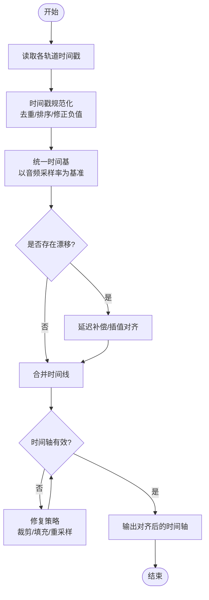
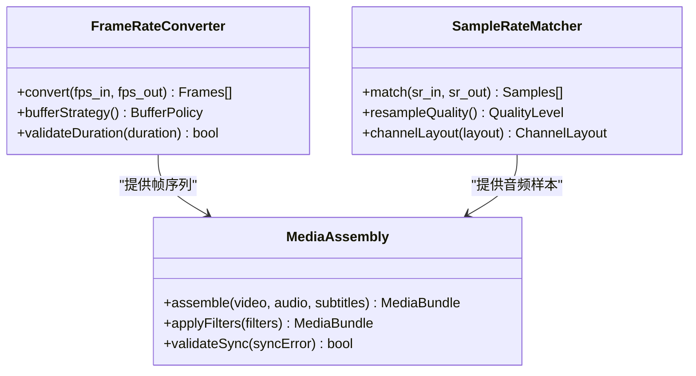
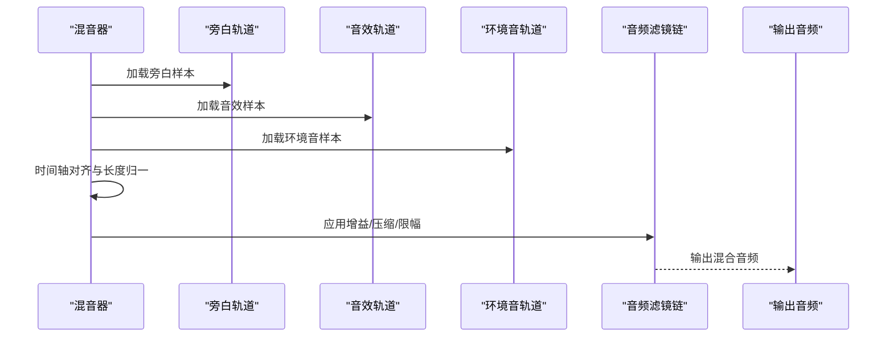
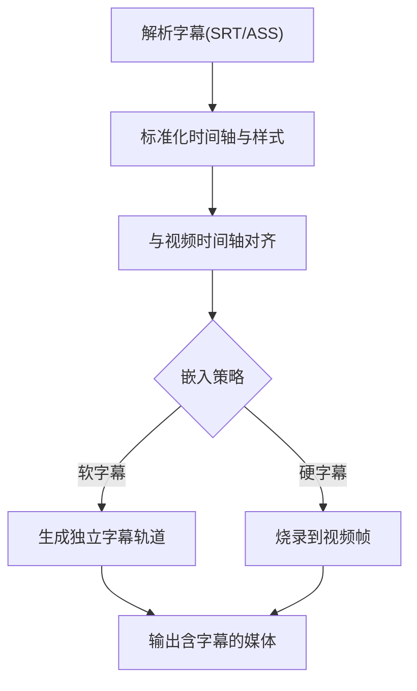
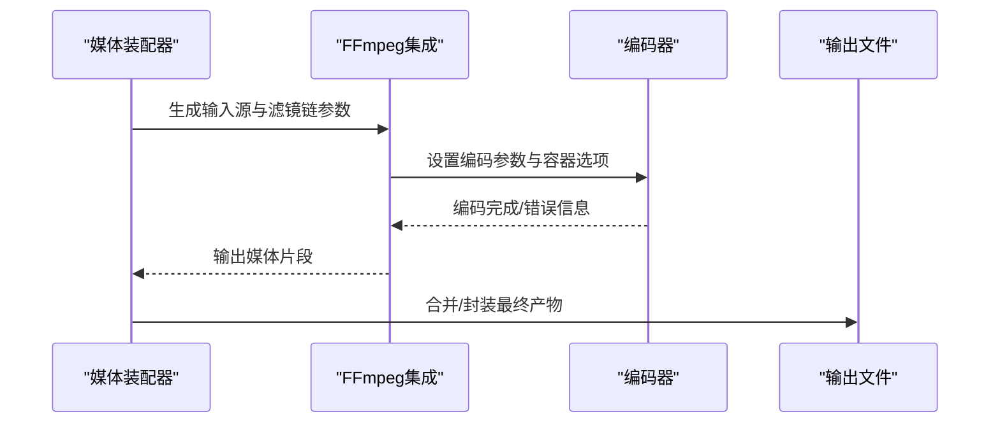
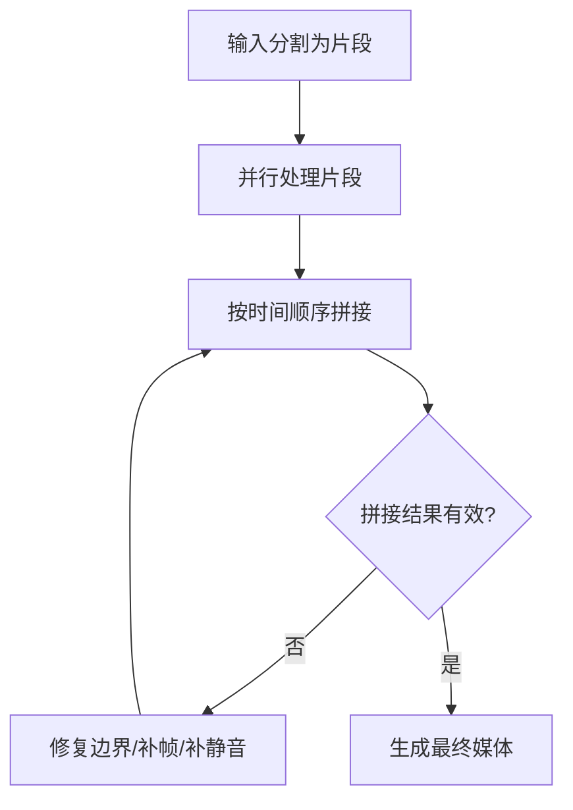
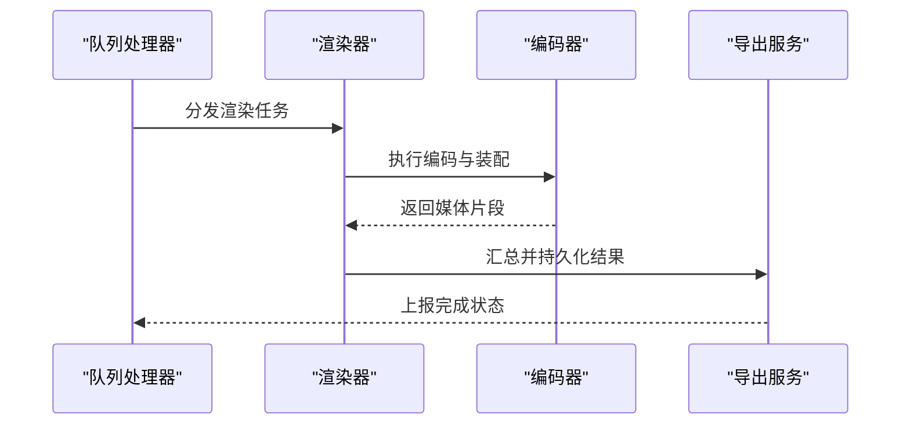
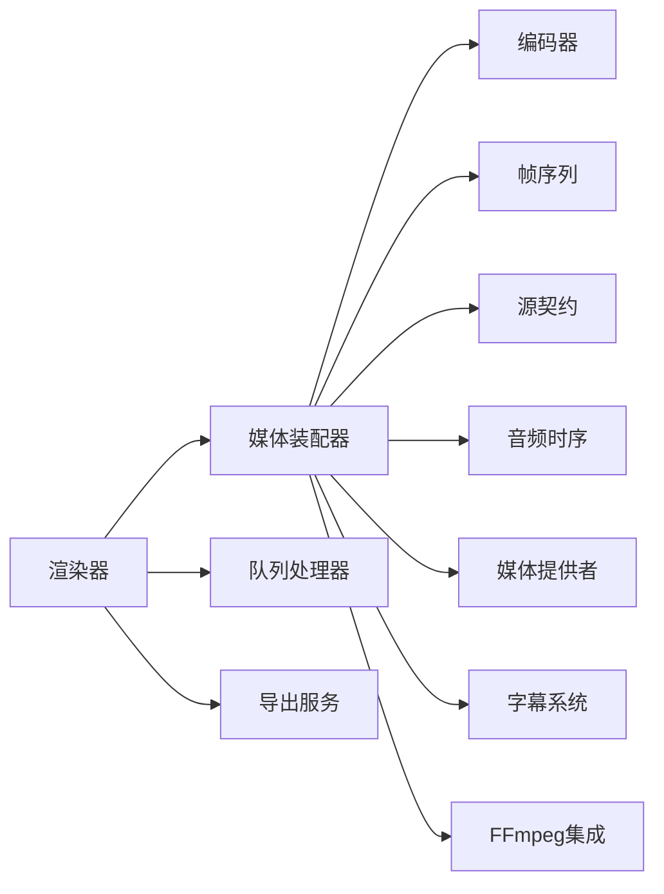

# 音视频同步

<cite>
**本文档引用的文件**   
- [audio-timing.ts](file://src/features/director/audio-timing.ts)
- [media-ffmpeg.test.ts](file://src/features/render/media-ffmpeg.test.ts)
- [subtitle-ass.ts](file://src/features/audio/subtitle-ass.ts)
- [subtitle.ts](file://src/features/audio/subtitle.ts)
- [narration.ts](file://src/features/audio/narration.ts)
- [sfx.ts](file://src/features/audio/sfx.ts)
- [media-provider.ts](file://src/features/audio/media-provider.ts)
- [encode.ts](file://src/features/render/encode.ts)
- [concat.ts](file://src/features/render/concat.ts)
- [frame-sequence.ts](file://src/features/render/frame-sequence.ts)
- [media-assembly.ts](file://src/features/render/media-assembly.ts)
- [renderer.ts](file://src/features/render/renderer.ts)
- [export-service.ts](file://src/features/render/export-service.ts)
- [queue-handler.ts](file://src/features/render/queue-handler.ts)
- [types.ts](file://src/features/render/types.ts)
- [source-contract.ts](file://src/features/render/source-contract.ts)
- [measure.ts](file://src/features/audio/measure.ts)
- [audio-format.ts](file://src/features/audio/audio-format.ts)
- [wav-header.ts](file://src/features/audio/wav-header.ts)
- [mp3-frame-header.ts](file://src/features/audio/mp3-frame-header.ts)
</cite>

## 目录
1. [简介](#简介)
2. [项目结构](#项目结构)
3. [核心组件](#核心组件)
4. [架构总览](#架构总览)
5. [详细组件分析](#详细组件分析)
6. [依赖关系分析](#依赖关系分析)
7. [性能考量](#性能考量)
8. [故障排查指南](#故障排查指南)
9. [结论](#结论)
10. [附录](#附录)

## 简介
本文件围绕FFmpeg驱动的音视频同步与合成能力，系统性阐述时间轴对齐、时间戳处理、帧率转换、采样率匹配、音轨混合、字幕嵌入、同步精度控制与延迟补偿机制，并提供常见问题诊断方法与解决方案。文档面向不同技术背景的读者，既提供高层概览，也给出代码级映射与可视化图示，帮助快速定位问题并优化实现。

## 项目结构
本项目在渲染与媒体处理方面采用分层组织：
- 渲染管线：负责编排媒体装配、编码、导出与队列调度
- 音频子系统：负责音频测量、格式处理、旁白与音效管理、字幕（ASS/SRT）集成
- FFmpeg集成：通过测试与工具模块验证FFmpeg命令参数与时序行为
- 类型与契约：统一输入输出结构与校验规则

图表来源
- [renderer.ts](file://src/features/render/renderer.ts)
- [media-assembly.ts](file://src/features/render/media-assembly.ts)
- [encode.ts](file://src/features/render/encode.ts)
- [concat.ts](file://src/features/render/concat.ts)
- [frame-sequence.ts](file://src/features/render/frame-sequence.ts)
- [queue-handler.ts](file://src/features/render/queue-handler.ts)
- [export-service.ts](file://src/features/render/export-service.ts)
- [types.ts](file://src/features/render/types.ts)
- [source-contract.ts](file://src/features/render/source-contract.ts)
- [audio-timing.ts](file://src/features/director/audio-timing.ts)
- [media-provider.ts](file://src/features/audio/media-provider.ts)
- [narration.ts](file://src/features/audio/narration.ts)
- [sfx.ts](file://src/features/audio/sfx.ts)
- [subtitle.ts](file://src/features/audio/subtitle.ts)
- [subtitle-ass.ts](file://src/features/audio/subtitle-ass.ts)
- [audio-format.ts](file://src/features/audio/audio-format.ts)
- [wav-header.ts](file://src/features/audio/wav-header.ts)
- [mp3-frame-header.ts](file://src/features/audio/mp3-frame-header.ts)
- [measure.ts](file://src/features/audio/measure.ts)

章节来源
- [renderer.ts](file://src/features/render/renderer.ts)
- [media-assembly.ts](file://src/features/render/media-assembly.ts)
- [encode.ts](file://src/features/render/encode.ts)
- [concat.ts](file://src/features/render/concat.ts)
- [frame-sequence.ts](file://src/features/render/frame-sequence.ts)
- [queue-handler.ts](file://src/features/render/queue-handler.ts)
- [export-service.ts](file://src/features/render/export-service.ts)
- [types.ts](file://src/features/render/types.ts)
- [source-contract.ts](file://src/features/render/source-contract.ts)
- [audio-timing.ts](file://src/features/director/audio-timing.ts)
- [media-provider.ts](file://src/features/audio/media-provider.ts)
- [narration.ts](file://src/features/audio/narration.ts)
- [sfx.ts](file://src/features/audio/sfx.ts)
- [subtitle.ts](file://src/features/audio/subtitle.ts)
- [subtitle-ass.ts](file://src/features/audio/subtitle-ass.ts)
- [audio-format.ts](file://src/features/audio/audio-format.ts)
- [wav-header.ts](file://src/features/audio/wav-header.ts)
- [mp3-frame-header.ts](file://src/features/audio/mp3-frame-header.ts)
- [measure.ts](file://src/features/audio/measure.ts)

## 核心组件
- 渲染器与装配器：协调视频帧、音频流、字幕轨道的装配与编码，确保时间轴一致性与输出完整性
- 音频时序与测量：基于时间戳与采样率进行对齐、重采样、音量调节与效果处理
- 字幕系统：解析与生成SRT/ASS，按时间轴插入到视频轨道
- FFmpeg集成：通过命令行参数与封装逻辑驱动编解码、滤镜链与多路复用
- 队列与导出：任务拆分、并发执行、进度上报与结果持久化

章节来源
- [renderer.ts](file://src/features/render/renderer.ts)
- [media-assembly.ts](file://src/features/render/media-assembly.ts)
- [audio-timing.ts](file://src/features/director/audio-timing.ts)
- [subtitle.ts](file://src/features/audio/subtitle.ts)
- [subtitle-ass.ts](file://src/features/audio/subtitle-ass.ts)
- [media-ffmpeg.test.ts](file://src/features/render/media-ffmpeg.test.ts)

## 架构总览
下图展示从输入到输出的关键流程：输入源经契约校验后进入装配阶段，音频侧进行时序对齐与混音，视频侧进行帧序列处理，字幕按时间轴嵌入，最终由编码器输出并经由队列与导出服务完成持久化。

图表来源
- [queue-handler.ts](file://src/features/render/queue-handler.ts)
- [renderer.ts](file://src/features/render/renderer.ts)
- [media-assembly.ts](file://src/features/render/media-assembly.ts)
- [audio-timing.ts](file://src/features/director/audio-timing.ts)
- [frame-sequence.ts](file://src/features/render/frame-sequence.ts)
- [subtitle.ts](file://src/features/audio/subtitle.ts)
- [subtitle-ass.ts](file://src/features/audio/subtitle-ass.ts)
- [media-ffmpeg.test.ts](file://src/features/render/media-ffmpeg.test.ts)
- [export-service.ts](file://src/features/render/export-service.ts)

## 详细组件分析

### 时间轴对齐与时间戳处理
- 时间基准统一：以音频采样率为基准时间单位，将视频帧时间戳转换为相同时间基，保证跨轨道对齐
- 时间戳规范化：对负时间戳、重复时间戳与漂移进行校正，必要时引入插值或裁剪策略
- 边界处理：首尾静音填充、淡入淡出、静音检测用于消除跳变与错位
- 精度控制：使用高精度浮点时间计算，并在量化时保留足够小数位以避免累积误差

图表来源
- [audio-timing.ts](file://src/features/director/audio-timing.ts)
- [measure.ts](file://src/features/audio/measure.ts)
- [media-assembly.ts](file://src/features/render/media-assembly.ts)

章节来源
- [audio-timing.ts](file://src/features/director/audio-timing.ts)
- [measure.ts](file://src/features/audio/measure.ts)
- [media-assembly.ts](file://src/features/render/media-assembly.ts)

### 帧率转换与采样率匹配
- 帧率转换：根据目标容器与播放设备需求，采用插帧或抽帧策略保持时长一致；必要时加入缓冲帧避免抖动
- 采样率匹配：将多路音频统一到目标采样率，确保混音与滤镜链一致性；对非整数倍比率使用高质量重采样算法
- 通道布局：统一为立体声或多声道布局，适配播放器与编码限制

图表来源
- [frame-sequence.ts](file://src/features/render/frame-sequence.ts)
- [audio-format.ts](file://src/features/audio/audio-format.ts)
- [media-assembly.ts](file://src/features/render/media-assembly.ts)

章节来源
- [frame-sequence.ts](file://src/features/render/frame-sequence.ts)
- [audio-format.ts](file://src/features/audio/audio-format.ts)
- [media-assembly.ts](file://src/features/render/media-assembly.ts)

### 音轨混合与音频效果处理
- 多音轨合并：支持旁白、音效与环境音的多轨叠加，按时间轴对齐后进行加权混合
- 音量调节：逐轨增益控制、动态范围压缩、峰值限制，避免削波
- 音频效果：均衡、降噪、混响等滤镜链，按顺序应用并确保相位一致性

图表来源
- [narration.ts](file://src/features/audio/narration.ts)
- [sfx.ts](file://src/features/audio/sfx.ts)
- [audio-format.ts](file://src/features/audio/audio-format.ts)
- [media-assembly.ts](file://src/features/render/media-assembly.ts)

章节来源
- [narration.ts](file://src/features/audio/narration.ts)
- [sfx.ts](file://src/features/audio/sfx.ts)
- [audio-format.ts](file://src/features/audio/audio-format.ts)
- [media-assembly.ts](file://src/features/render/media-assembly.ts)

### 字幕嵌入过程（SRT/ASS）
- 解析与标准化：将SRT/ASS文本解析为结构化事件，统一时间基与样式属性
- 时间轴对齐：字幕事件与视频帧时间戳对齐，必要时进行微调与去重
- 嵌入策略：软字幕（独立轨道）或硬字幕（烧录到画面），依据目标平台与播放器兼容性选择

图表来源
- [subtitle.ts](file://src/features/audio/subtitle.ts)
- [subtitle-ass.ts](file://src/features/audio/subtitle-ass.ts)
- [media-assembly.ts](file://src/features/render/media-assembly.ts)

章节来源
- [subtitle.ts](file://src/features/audio/subtitle.ts)
- [subtitle-ass.ts](file://src/features/audio/subtitle-ass.ts)
- [media-assembly.ts](file://src/features/render/media-assembly.ts)

### FFmpeg集成与命令生成
- 命令组装：根据输入源、滤镜链、编码参数与输出容器生成FFmpeg命令
- 滤镜链：视频缩放、色彩空间转换、字幕烧录；音频重采样、混音、效果处理
- 错误处理：捕获FFmpeg退出码与日志，定位失败原因并回退策略

图表来源
- [media-ffmpeg.test.ts](file://src/features/render/media-ffmpeg.test.ts)
- [encode.ts](file://src/features/render/encode.ts)
- [media-assembly.ts](file://src/features/render/media-assembly.ts)

章节来源
- [media-ffmpeg.test.ts](file://src/features/render/media-ffmpeg.test.ts)
- [encode.ts](file://src/features/render/encode.ts)
- [media-assembly.ts](file://src/features/render/media-assembly.ts)

### 拼接与分段处理
- 分段策略：长视频切分为可并行处理的片段，提升吞吐与容错
- 拼接逻辑：按时间顺序无缝拼接，确保边界处帧与音频样本连续无跳变
- 元数据维护：章节、封面、字幕轨道在拼接过程中保持一致性

图表来源
- [concat.ts](file://src/features/render/concat.ts)
- [media-assembly.ts](file://src/features/render/media-assembly.ts)

章节来源
- [concat.ts](file://src/features/render/concat.ts)
- [media-assembly.ts](file://src/features/render/media-assembly.ts)

### 队列调度与导出
- 任务拆分：将大任务拆分为子任务，提高并发度与资源利用率
- 进度上报：实时反馈处理进度与中间结果，便于前端展示与用户感知
- 结果持久化：将最终产物与元数据写入存储，供后续消费与回放

图表来源
- [queue-handler.ts](file://src/features/render/queue-handler.ts)
- [renderer.ts](file://src/features/render/renderer.ts)
- [export-service.ts](file://src/features/render/export-service.ts)

章节来源
- [queue-handler.ts](file://src/features/render/queue-handler.ts)
- [renderer.ts](file://src/features/render/renderer.ts)
- [export-service.ts](file://src/features/render/export-service.ts)

## 依赖关系分析
- 渲染器依赖装配器、编码器、帧序列与源契约，形成稳定的处理链路
- 音频子系统依赖媒体提供者、格式处理与测量工具，确保时间轴与音质一致性
- FFmpeg集成作为底层引擎，被装配器与编码器调用，屏蔽具体命令细节
- 队列与导出服务位于上层，负责任务编排与结果交付

图表来源
- [renderer.ts](file://src/features/render/renderer.ts)
- [media-assembly.ts](file://src/features/render/media-assembly.ts)
- [encode.ts](file://src/features/render/encode.ts)
- [frame-sequence.ts](file://src/features/render/frame-sequence.ts)
- [source-contract.ts](file://src/features/render/source-contract.ts)
- [audio-timing.ts](file://src/features/director/audio-timing.ts)
- [media-provider.ts](file://src/features/audio/media-provider.ts)
- [subtitle.ts](file://src/features/audio/subtitle.ts)
- [media-ffmpeg.test.ts](file://src/features/render/media-ffmpeg.test.ts)
- [queue-handler.ts](file://src/features/render/queue-handler.ts)
- [export-service.ts](file://src/features/render/export-service.ts)

章节来源
- [renderer.ts](file://src/features/render/renderer.ts)
- [media-assembly.ts](file://src/features/render/media-assembly.ts)
- [encode.ts](file://src/features/render/encode.ts)
- [frame-sequence.ts](file://src/features/render/frame-sequence.ts)
- [source-contract.ts](file://src/features/render/source-contract.ts)
- [audio-timing.ts](file://src/features/director/audio-timing.ts)
- [media-provider.ts](file://src/features/audio/media-provider.ts)
- [subtitle.ts](file://src/features/audio/subtitle.ts)
- [media-ffmpeg.test.ts](file://src/features/render/media-ffmpeg.test.ts)
- [queue-handler.ts](file://src/features/render/queue-handler.ts)
- [export-service.ts](file://src/features/render/export-service.ts)

## 性能考量
- 并行处理：将长视频切分为片段并行编码，缩短整体耗时
- 内存管理：流式处理大文件，避免一次性加载导致内存溢出
- 滤镜链优化：减少不必要的滤镜操作，合并同类滤镜以降低CPU占用
- 缓存策略：对重复使用的中间结果进行缓存，提升二次处理效率
- I/O优化：使用高效文件系统与网络传输协议，降低读写瓶颈

[本节为通用指导，不直接分析具体文件]

## 故障排查指南
- 时间轴错位：检查时间戳规范化与对齐逻辑，确认采样率与帧率转换是否正确
- 音画不同步：验证音频重采样与视频帧率转换的参数，检查滤镜链顺序与延迟
- 字幕错位：核对字幕时间基与视频时间基是否一致，检查嵌入策略与烧录位置
- 编码失败：查看FFmpeg错误日志与退出码，定位参数错误或资源不足
- 拼接断裂：检查片段边界帧与音频样本连续性，必要时进行补帧或补静音

章节来源
- [media-ffmpeg.test.ts](file://src/features/render/media-ffmpeg.test.ts)
- [audio-timing.ts](file://src/features/director/audio-timing.ts)
- [subtitle.ts](file://src/features/audio/subtitle.ts)
- [subtitle-ass.ts](file://src/features/audio/subtitle-ass.ts)
- [encode.ts](file://src/features/render/encode.ts)
- [concat.ts](file://src/features/render/concat.ts)

## 结论
通过统一的装配器与严格的时序控制，结合FFmpeg的强大处理能力，本项目实现了稳定可靠的音视频同步与合成。音频时序与测量、帧率转换与采样率匹配、字幕嵌入与滤镜链优化共同保障了输出质量。配合队列调度与导出服务，系统具备高吞吐与高可用特性。未来可进一步优化滤镜链与并行策略，提升处理效率与资源利用率。

[本节为总结性内容，不直接分析具体文件]

## 附录
- 术语表：时间基、时间戳、帧率、采样率、滤镜链、软字幕、硬字幕
- 参考实现：相关模块的文件路径与职责说明已在各章节中列出，便于深入阅读与扩展

[本节为补充信息，不直接分析具体文件]