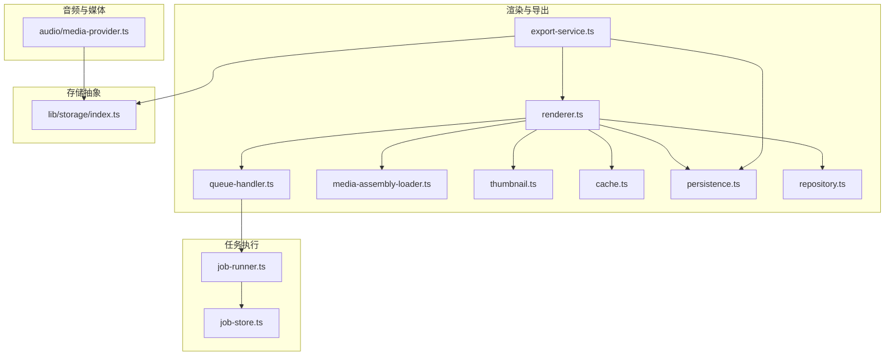
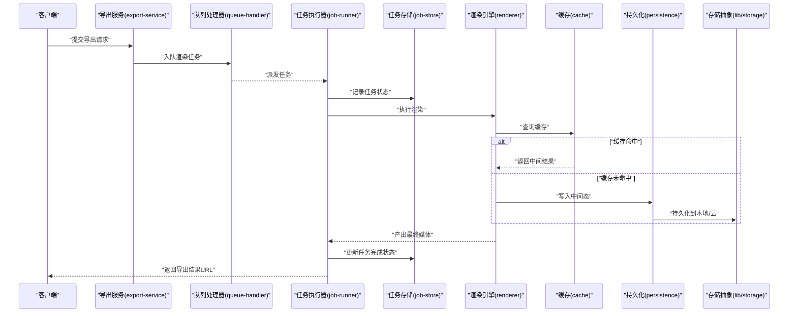
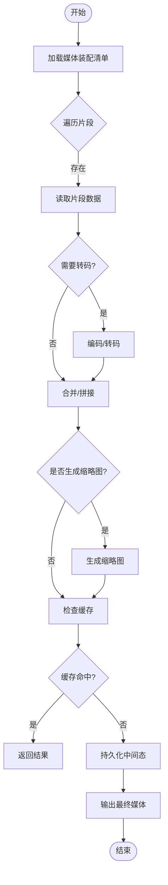
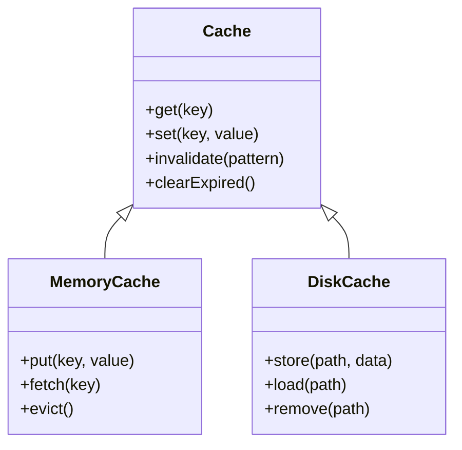
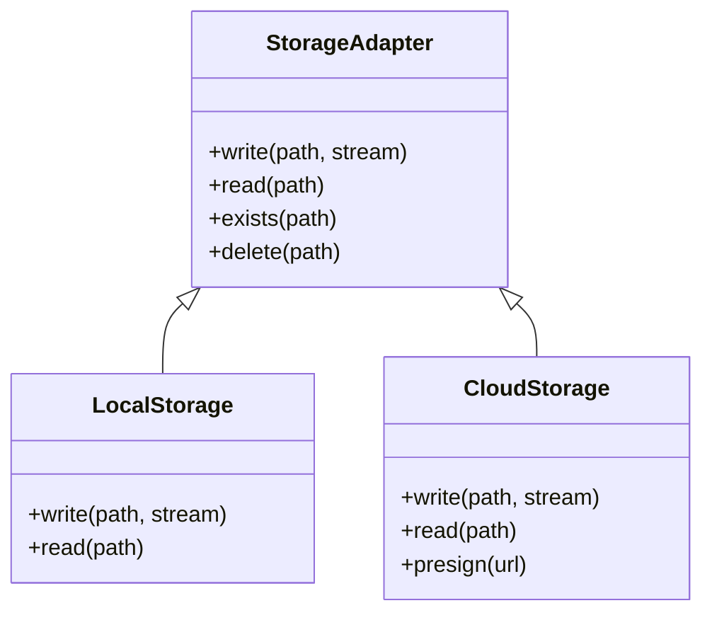
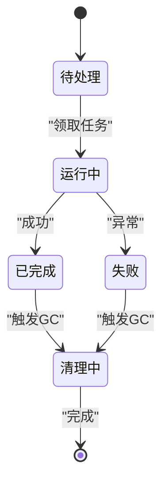
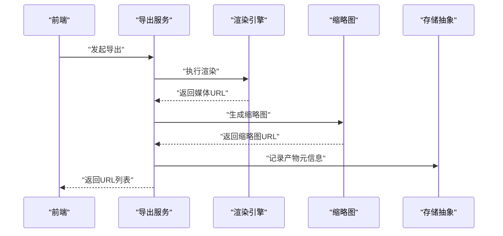
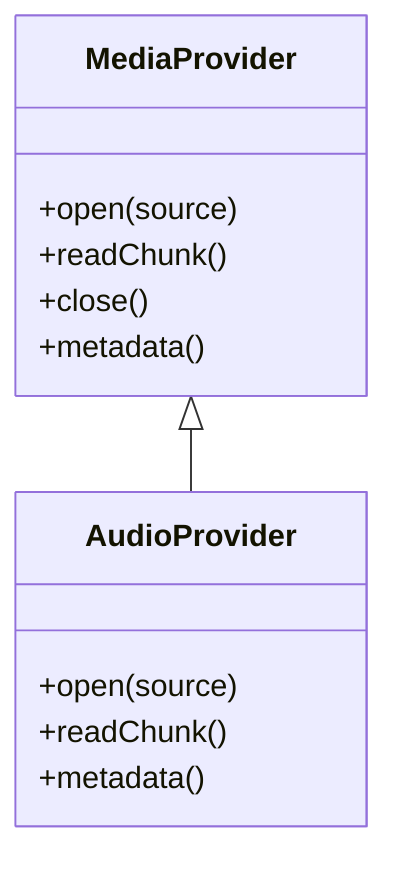
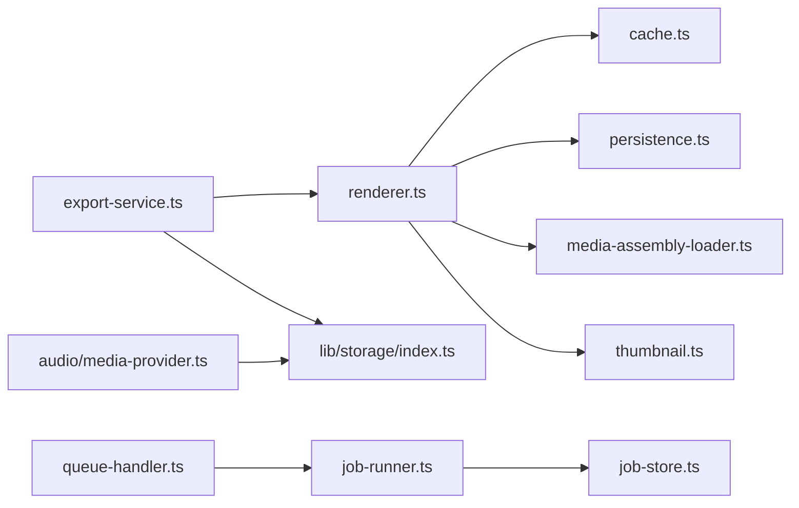

# 媒体管理

<cite>
**本文引用的文件**   
- [src/features/render/cache.ts](file://src/features/render/cache.ts)
- [src/features/render/media-assembly-loader.ts](file://src/features/render/media-assembly-loader.ts)
- [src/features/render/persistence.ts](file://src/features/render/persistence.ts)
- [src/features/render/repository.ts](file://src/features/render/repository.ts)
- [src/features/render/renderer.ts](file://src/features/render/renderer.ts)
- [src/features/render/queue-handler.ts](file://src/features/render/queue-handler.ts)
- [src/features/render/export-service.ts](file://src/features/render/export-service.ts)
- [src/features/render/thumbnail.ts](file://src/features/render/thumbnail.ts)
- [src/features/audio/media-provider.ts](file://src/features/audio/media-provider.ts)
- [src/lib/storage/index.ts](file://src/lib/storage/index.ts)
- [server/src/server/job-runner.ts](file://server/src/server/job-runner.ts)
- [server/src/server/job-store.ts](file://server/src/server/job-store.ts)
</cite>

## 目录
1. [简介](#简介)
2. [项目结构](#项目结构)
3. [核心组件](#核心组件)
4. [架构总览](#架构总览)
5. [详细组件分析](#详细组件分析)
6. [依赖关系分析](#依赖关系分析)
7. [性能考虑](#性能考虑)
8. [故障排查指南](#故障排查指南)
9. [结论](#结论)
10. [附录](#附录)

## 简介
本文件面向媒体管理的存储与生命周期，覆盖本地与云存储策略、缓存与去重、元数据管理与索引、压缩与加速、容量规划与性能优化。文档基于仓库中的渲染与音频模块、存储抽象以及任务执行器实现进行梳理，帮助读者理解从媒体摄入、处理、持久化到导出的全链路。

## 项目结构
媒体相关能力主要分布在以下位置：
- 渲染管线与导出：src/features/render/*
- 音频与媒体提供层：src/features/audio/*
- 存储抽象与配置：src/lib/storage/*
- 后台任务执行与持久化：server/src/server/*

图表来源
- [src/features/render/renderer.ts](file://src/features/render/renderer.ts)
- [src/features/render/queue-handler.ts](file://src/features/render/queue-handler.ts)
- [src/features/render/export-service.ts](file://src/features/render/export-service.ts)
- [src/features/render/media-assembly-loader.ts](file://src/features/render/media-assembly-loader.ts)
- [src/features/render/thumbnail.ts](file://src/features/render/thumbnail.ts)
- [src/features/render/cache.ts](file://src/features/render/cache.ts)
- [src/features/render/persistence.ts](file://src/features/render/persistence.ts)
- [src/features/render/repository.ts](file://src/features/render/repository.ts)
- [src/features/audio/media-provider.ts](file://src/features/audio/media-provider.ts)
- [src/lib/storage/index.ts](file://src/lib/storage/index.ts)
- [server/src/server/job-runner.ts](file://server/src/server/job-runner.ts)
- [server/src/server/job-store.ts](file://server/src/server/job-store.ts)

章节来源
- [src/features/render/renderer.ts](file://src/features/render/renderer.ts)
- [src/features/render/queue-handler.ts](file://src/features/render/queue-handler.ts)
- [src/features/render/export-service.ts](file://src/features/render/export-service.ts)
- [src/features/render/media-assembly-loader.ts](file://src/features/render/media-assembly-loader.ts)
- [src/features/render/thumbnail.ts](file://src/features/render/thumbnail.ts)
- [src/features/render/cache.ts](file://src/features/render/cache.ts)
- [src/features/render/persistence.ts](file://src/features/render/persistence.ts)
- [src/features/render/repository.ts](file://src/features/render/repository.ts)
- [src/features/audio/media-provider.ts](file://src/features/audio/media-provider.ts)
- [src/lib/storage/index.ts](file://src/lib/storage/index.ts)
- [server/src/server/job-runner.ts](file://server/src/server/job-runner.ts)
- [server/src/server/job-store.ts](file://server/src/server/job-store.ts)

## 核心组件
- 渲染引擎（renderer）：编排媒体组装、转码、缩略图生成与导出，协调缓存与持久化。
- 队列处理器（queue-handler）：将渲染任务入队并交由任务执行器消费。
- 导出服务（export-service）：对外暴露导出接口，驱动渲染与结果落盘。
- 媒体装配加载器（media-assembly-loader）：负责媒体片段读取、拼接与流式处理。
- 缩略图（thumbnail）：为视频/图片生成预览图，支持缓存与快速返回。
- 缓存（cache）：内存/磁盘两级缓存，命中优先，降低重复计算与IO。
- 持久化（persistence）：统一写入介质（本地或云），保证幂等与一致性。
- 仓库（repository）：渲染产物与中间态的查询与版本管理。
- 音频媒体提供者（audio/media-provider）：音频输入源抽象，适配不同后端。
- 存储抽象（lib/storage）：统一本地与云存储访问接口。
- 任务执行器（job-runner/job-store）：异步任务调度与状态持久化。

章节来源
- [src/features/render/renderer.ts](file://src/features/render/renderer.ts)
- [src/features/render/queue-handler.ts](file://src/features/render/queue-handler.ts)
- [src/features/render/export-service.ts](file://src/features/render/export-service.ts)
- [src/features/render/media-assembly-loader.ts](file://src/features/render/media-assembly-loader.ts)
- [src/features/render/thumbnail.ts](file://src/features/render/thumbnail.ts)
- [src/features/render/cache.ts](file://src/features/render/cache.ts)
- [src/features/render/persistence.ts](file://src/features/render/persistence.ts)
- [src/features/render/repository.ts](file://src/features/render/repository.ts)
- [src/features/audio/media-provider.ts](file://src/features/audio/media-provider.ts)
- [src/lib/storage/index.ts](file://src/lib/storage/index.ts)
- [server/src/server/job-runner.ts](file://server/src/server/job-runner.ts)
- [server/src/server/job-store.ts](file://server/src/server/job-store.ts)

## 架构总览
渲染与导出流程通过“请求→队列→任务执行→渲染→缓存/持久化→导出”的链路完成。存储抽象屏蔽了本地与云差异；缓存层减少重复计算；持久化确保结果可恢复与可回溯。

图表来源
- [src/features/render/export-service.ts](file://src/features/render/export-service.ts)
- [src/features/render/queue-handler.ts](file://src/features/render/queue-handler.ts)
- [server/src/server/job-runner.ts](file://server/src/server/job-runner.ts)
- [server/src/server/job-store.ts](file://server/src/server/job-store.ts)
- [src/features/render/renderer.ts](file://src/features/render/renderer.ts)
- [src/features/render/cache.ts](file://src/features/render/cache.ts)
- [src/features/render/persistence.ts](file://src/features/render/persistence.ts)
- [src/lib/storage/index.ts](file://src/lib/storage/index.ts)

## 详细组件分析

### 渲染引擎与媒体装配
- 职责：读取媒体片段、转码/合成、生成缩略图、输出最终媒体。
- 关键点：
  - 媒体装配加载器负责按时间线顺序拉取片段，支持流式读取以降低内存峰值。
  - 渲染引擎在关键阶段调用缓存与持久化，避免重复计算与丢失中间态。
  - 缩略图生成走独立路径，便于前端快速预览。

图表来源
- [src/features/render/media-assembly-loader.ts](file://src/features/render/media-assembly-loader.ts)
- [src/features/render/renderer.ts](file://src/features/render/renderer.ts)
- [src/features/render/thumbnail.ts](file://src/features/render/thumbnail.ts)
- [src/features/render/cache.ts](file://src/features/render/cache.ts)
- [src/features/render/persistence.ts](file://src/features/render/persistence.ts)

章节来源
- [src/features/render/media-assembly-loader.ts](file://src/features/render/media-assembly-loader.ts)
- [src/features/render/renderer.ts](file://src/features/render/renderer.ts)
- [src/features/render/thumbnail.ts](file://src/features/render/thumbnail.ts)

### 缓存与去重
- 策略：
  - 多级缓存：内存缓存用于热路径，磁盘缓存用于跨进程/重启复用。
  - 内容寻址：以内容哈希作为键，天然去重，避免重复存储相同片段。
  - 失效策略：LRU/TTL结合，控制内存占用与过期清理。
- 收益：显著降低重复转码与IO开销，提升并发渲染吞吐。

图表来源
- [src/features/render/cache.ts](file://src/features/render/cache.ts)

章节来源
- [src/features/render/cache.ts](file://src/features/render/cache.ts)

### 持久化与存储抽象
- 目标：统一本地与云存储访问，保证幂等写入、断点续传与错误重试。
- 要点：
  - 通过存储抽象接口隔离底层实现，便于切换本地/对象存储。
  - 写入前校验完整性（如大小、哈希），失败回滚与告警。
  - 中间态与最终产物分离目录，便于生命周期管理。

图表来源
- [src/lib/storage/index.ts](file://src/lib/storage/index.ts)
- [src/features/render/persistence.ts](file://src/features/render/persistence.ts)

章节来源
- [src/lib/storage/index.ts](file://src/lib/storage/index.ts)
- [src/features/render/persistence.ts](file://src/features/render/persistence.ts)

### 任务执行与生命周期
- 队列处理器将渲染任务入队，任务执行器消费并维护状态。
- 生命周期：
  - 创建任务：记录参数、依赖、期望输出。
  - 运行中：分阶段推进，写进度与中间产物。
  - 完成/失败：更新状态，清理临时文件，触发回调。
- 垃圾回收：定期扫描过期中间态与失败任务残留，释放空间。

图表来源
- [src/features/render/queue-handler.ts](file://src/features/render/queue-handler.ts)
- [server/src/server/job-runner.ts](file://server/src/server/job-runner.ts)
- [server/src/server/job-store.ts](file://server/src/server/job-store.ts)

章节来源
- [src/features/render/queue-handler.ts](file://src/features/render/queue-handler.ts)
- [server/src/server/job-runner.ts](file://server/src/server/job-runner.ts)
- [server/src/server/job-store.ts](file://server/src/server/job-store.ts)

### 导出服务与缩略图
- 导出服务：接收导出请求，校验参数，驱动渲染与结果上传。
- 缩略图：按需生成，缓存命中优先，支持尺寸与格式选择。

图表来源
- [src/features/render/export-service.ts](file://src/features/render/export-service.ts)
- [src/features/render/thumbnail.ts](file://src/features/render/thumbnail.ts)
- [src/lib/storage/index.ts](file://src/lib/storage/index.ts)

章节来源
- [src/features/render/export-service.ts](file://src/features/render/export-service.ts)
- [src/features/render/thumbnail.ts](file://src/features/render/thumbnail.ts)

### 音频媒体提供与元数据
- 音频媒体提供者：抽象音频输入源，支持多后端接入。
- 元数据提取：时长、采样率、声道数、编码格式等，用于索引与查询优化。
- 索引建立：对常用字段建立索引，支持按项目、类型、时间范围检索。

图表来源
- [src/features/audio/media-provider.ts](file://src/features/audio/media-provider.ts)

章节来源
- [src/features/audio/media-provider.ts](file://src/features/audio/media-provider.ts)

## 依赖关系分析
- 渲染引擎依赖缓存、持久化、媒体装配加载器与缩略图。
- 导出服务依赖渲染引擎与存储抽象。
- 任务执行器依赖任务存储与队列处理器。
- 音频媒体提供者依赖存储抽象。

图表来源
- [src/features/render/export-service.ts](file://src/features/render/export-service.ts)
- [src/features/render/renderer.ts](file://src/features/render/renderer.ts)
- [src/features/render/cache.ts](file://src/features/render/cache.ts)
- [src/features/render/persistence.ts](file://src/features/render/persistence.ts)
- [src/features/render/media-assembly-loader.ts](file://src/features/render/media-assembly-loader.ts)
- [src/features/render/thumbnail.ts](file://src/features/render/thumbnail.ts)
- [src/lib/storage/index.ts](file://src/lib/storage/index.ts)
- [src/features/render/queue-handler.ts](file://src/features/render/queue-handler.ts)
- [server/src/server/job-runner.ts](file://server/src/server/job-runner.ts)
- [server/src/server/job-store.ts](file://server/src/server/job-store.ts)
- [src/features/audio/media-provider.ts](file://src/features/audio/media-provider.ts)

章节来源
- [src/features/render/export-service.ts](file://src/features/render/export-service.ts)
- [src/features/render/renderer.ts](file://src/features/render/renderer.ts)
- [src/features/render/cache.ts](file://src/features/render/cache.ts)
- [src/features/render/persistence.ts](file://src/features/render/persistence.ts)
- [src/features/render/media-assembly-loader.ts](file://src/features/render/media-assembly-loader.ts)
- [src/features/render/thumbnail.ts](file://src/features/render/thumbnail.ts)
- [src/lib/storage/index.ts](file://src/lib/storage/index.ts)
- [src/features/render/queue-handler.ts](file://src/features/render/queue-handler.ts)
- [server/src/server/job-runner.ts](file://server/src/server/job-runner.ts)
- [server/src/server/job-store.ts](file://server/src/server/job-store.ts)
- [src/features/audio/media-provider.ts](file://src/features/audio/media-provider.ts)

## 性能考虑
- 缓存命中率：提高内存缓存命中率，减少磁盘与网络IO。
- 并行度：合理设置并发渲染与转码线程数，避免CPU/IO瓶颈。
- 流式处理：大文件采用流式读写，降低内存峰值。
- 压缩与去重：启用无损/有损压缩策略，结合内容寻址去重。
- 索引优化：对高频查询字段建立索引，使用覆盖索引减少回表。
- 预热策略：热点媒体预加载至缓存，缩短首帧/首包延迟。

[本节为通用建议，不直接分析具体文件]

## 故障排查指南
- 常见问题定位：
  - 任务卡住：检查任务存储状态与队列堆积情况。
  - 写入失败：确认存储权限、配额与网络连通性。
  - 缓存污染：清理过期键与损坏条目，重建索引。
  - 缩略图缺失：核对生成路径与权限，重新触发生成。
- 诊断手段：
  - 查看任务日志与错误堆栈。
  - 监控缓存命中率与磁盘使用率。
  - 校验产物哈希与大小一致性。

章节来源
- [server/src/server/job-runner.ts](file://server/src/server/job-runner.ts)
- [server/src/server/job-store.ts](file://server/src/server/job-store.ts)
- [src/features/render/cache.ts](file://src/features/render/cache.ts)
- [src/features/render/persistence.ts](file://src/features/render/persistence.ts)

## 结论
本方案通过统一的存储抽象、多级缓存与任务化渲染，实现了高效可靠的媒体管理能力。借助内容寻址去重、流式处理与索引优化，可在大规模媒体场景下保持高吞吐与低延迟。建议在生产环境持续监控缓存命中率、任务成功率与存储利用率，动态调整并发与缓存策略。

[本节为总结性内容，不直接分析具体文件]

## 附录
- 存储容量规划：
  - 估算原始媒体体积、转码倍率与缩略图数量。
  - 预留冗余空间应对突发流量与备份。
  - 冷热分层：热数据内存/SSD，冷数据归档至低成本存储。
- 版本控制与垃圾回收：
  - 中间态与最终产物分离，保留必要历史版本。
  - 定期清理失败任务残留与过期缓存。
- 访问加速：
  - CDN缓存热点资源，缩短用户侧延迟。
  - 预签名链接与鉴权策略保障安全访问。

[本节为补充说明，不直接分析具体文件]