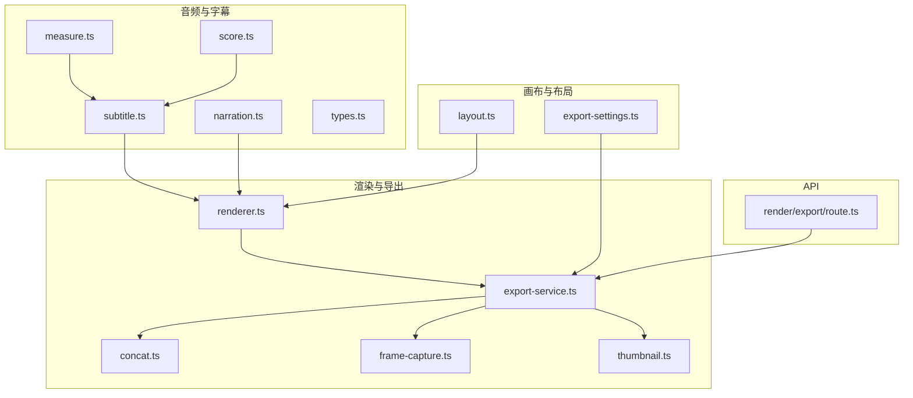
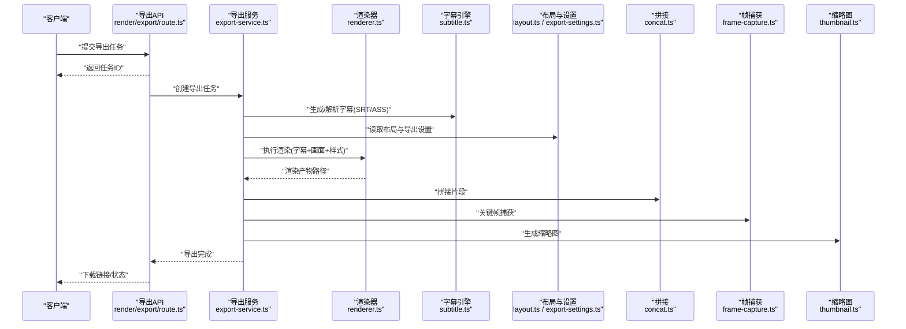
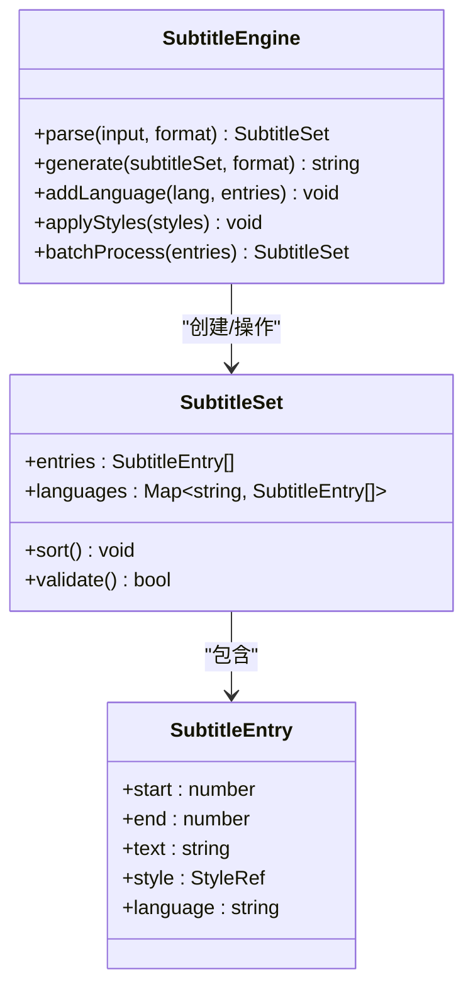
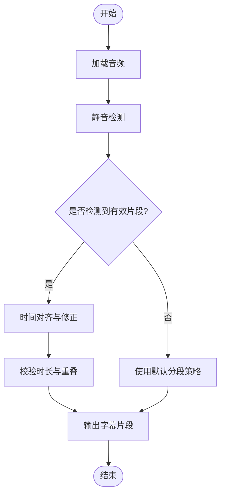
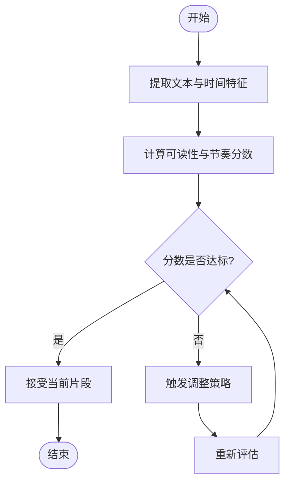
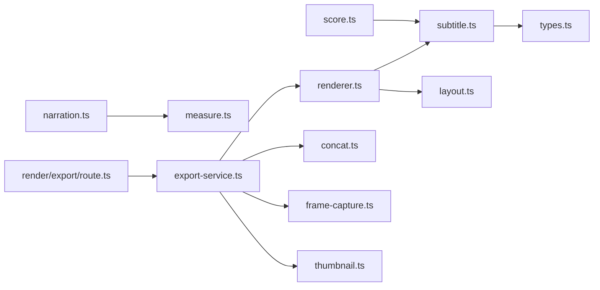

# 字幕处理

<cite>
**本文引用的文件**   
- [src/features/audio/subtitle.ts](file://src/features/audio/subtitle.ts)
- [src/features/audio/subtitle.test.ts](file://src/features/audio/subtitle.test.ts)
- [src/features/audio/narration.ts](file://src/features/audio/narration.ts)
- [src/features/audio/narration.test.ts](file://src/features/audio/narration.test.ts)
- [src/features/audio/types.ts](file://src/features/audio/types.ts)
- [src/features/audio/measure.ts](file://src/features/audio/measure.ts)
- [src/features/audio/score.ts](file://src/features/audio/score.ts)
- [src/features/render/renderer.ts](file://src/features/render/renderer.ts)
- [src/features/render/export-service.ts](file://src/features/render/export-service.ts)
- [src/features/render/concat.ts](file://src/features/render/concat.ts)
- [src/features/render/frame-capture.ts](file://src/features/render/frame-capture.ts)
- [src/features/render/thumbnail.ts](file://src/features/render/thumbnail.ts)
- [src/features/canvas/layout.ts](file://src/features/canvas/layout.ts)
- [src/features/canvas/export-settings.ts](file://src/features/canvas/export-settings.ts)
- [src/app/api/render/export/route.ts](file://src/app/api/render/export/route.ts)
</cite>

## 目录
1. [简介](#简介)
2. [项目结构](#项目结构)
3. [核心组件](#核心组件)
4. [架构总览](#架构总览)
5. [详细组件分析](#详细组件分析)
6. [依赖关系分析](#依赖关系分析)
7. [性能考量](#性能考量)
8. [故障排查指南](#故障排查指南)
9. [结论](#结论)
10. [附录](#附录)

## 简介
本技术文档聚焦 PurpleInk 项目的字幕处理模块，系统性阐述字幕文件的生成与处理流程，覆盖 SRT、ASS 等格式的支持与转换；详解字幕样式系统（字体配置、颜色方案、位置布局）；说明字幕对比度检测与自动调整算法，确保在不同背景下的可读性；并涵盖时间轴同步、多语言支持与批量处理能力。同时提供模板定制、样式配置与性能优化建议，帮助开发者快速集成与扩展字幕能力。

## 项目结构
字幕处理相关代码主要分布在以下区域：
- 音频与字幕：src/features/audio/*（字幕解析、生成、时间轴对齐、评分与测量）
- 渲染与导出：src/features/render/*（帧捕获、拼接、导出服务）
- 画布与布局：src/features/canvas/*（布局计算、导出设置）
- API 入口：src/app/api/render/export/route.ts（导出接口）

图表来源
- [src/features/audio/subtitle.ts](file://src/features/audio/subtitle.ts)
- [src/features/audio/narration.ts](file://src/features/audio/narration.ts)
- [src/features/audio/measure.ts](file://src/features/audio/measure.ts)
- [src/features/audio/score.ts](file://src/features/audio/score.ts)
- [src/features/render/renderer.ts](file://src/features/render/renderer.ts)
- [src/features/render/export-service.ts](file://src/features/render/export-service.ts)
- [src/features/render/concat.ts](file://src/features/render/concat.ts)
- [src/features/render/frame-capture.ts](file://src/features/render/frame-capture.ts)
- [src/features/render/thumbnail.ts](file://src/features/render/thumbnail.ts)
- [src/features/canvas/layout.ts](file://src/features/canvas/layout.ts)
- [src/features/canvas/export-settings.ts](file://src/features/canvas/export-settings.ts)
- [src/app/api/render/export/route.ts](file://src/app/api/render/export/route.ts)

章节来源
- [src/features/audio/subtitle.ts](file://src/features/audio/subtitle.ts)
- [src/features/audio/narration.ts](file://src/features/audio/narration.ts)
- [src/features/audio/types.ts](file://src/features/audio/types.ts)
- [src/features/render/renderer.ts](file://src/features/render/renderer.ts)
- [src/features/render/export-service.ts](file://src/features/render/export-service.ts)
- [src/features/canvas/layout.ts](file://src/features/canvas/layout.ts)
- [src/features/canvas/export-settings.ts](file://src/features/canvas/export-settings.ts)
- [src/app/api/render/export/route.ts](file://src/app/api/render/export/route.ts)

## 核心组件
- 字幕引擎（subtitle.ts）：负责解析与生成多种字幕格式（SRT、ASS），维护时间轴片段、文本内容与样式元数据，支持多语言条目与批量处理。
- 旁白与时间轴（narration.ts + measure.ts）：将语音或文本转换为带时间戳的字幕片段，进行时长测量与对齐。
- 质量评分（score.ts）：对字幕可读性与节奏进行评分，辅助自动调整策略。
- 渲染器（renderer.ts）：整合字幕、画面与样式，输出最终媒体产物。
- 导出服务（export-service.ts）：编排渲染、拼接、帧捕获与缩略图生成，提供批量导出能力。
- 画布布局（layout.ts + export-settings.ts）：定义字幕位置、尺寸、边距、安全区与导出分辨率等。
- 导出 API（render/export/route.ts）：对外暴露导出任务创建与状态查询接口。

章节来源
- [src/features/audio/subtitle.ts](file://src/features/audio/subtitle.ts)
- [src/features/audio/narration.ts](file://src/features/audio/narration.ts)
- [src/features/audio/measure.ts](file://src/features/audio/measure.ts)
- [src/features/audio/score.ts](file://src/features/audio/score.ts)
- [src/features/render/renderer.ts](file://src/features/render/renderer.ts)
- [src/features/render/export-service.ts](file://src/features/render/export-service.ts)
- [src/features/canvas/layout.ts](file://src/features/canvas/layout.ts)
- [src/features/canvas/export-settings.ts](file://src/features/canvas/export-settings.ts)
- [src/app/api/render/export/route.ts](file://src/app/app/api/render/export/route.ts)

## 架构总览
整体流程从 API 接收导出请求开始，经由导出服务协调渲染器、字幕引擎、布局与导出工具，完成字幕生成、样式应用、时间轴对齐与媒体合成，最终输出视频与缩略图。

图表来源
- [src/app/api/render/export/route.ts](file://src/app/api/render/export/route.ts)
- [src/features/render/export-service.ts](file://src/features/render/export-service.ts)
- [src/features/render/renderer.ts](file://src/features/render/renderer.ts)
- [src/features/audio/subtitle.ts](file://src/features/audio/subtitle.ts)
- [src/features/canvas/layout.ts](file://src/features/canvas/layout.ts)
- [src/features/canvas/export-settings.ts](file://src/features/canvas/export-settings.ts)
- [src/features/render/concat.ts](file://src/features/render/concat.ts)
- [src/features/render/frame-capture.ts](file://src/features/render/frame-capture.ts)
- [src/features/render/thumbnail.ts](file://src/features/render/thumbnail.ts)

## 详细组件分析

### 字幕引擎（subtitle.ts）
- 功能要点
  - 解析与生成 SRT、ASS 等格式，维护时间轴片段（起止时间、文本、样式）。
  - 支持多语言条目，按语言键区分不同版本字幕。
  - 批量处理能力：支持一次性处理多条字幕片段，减少 I/O 与重复计算。
  - 与样式系统对接：在生成 ASS 时注入样式段（字体、大小、颜色、对齐、阴影等）。
- 数据结构与复杂度
  - 字幕片段数组：线性遍历与排序，时间复杂度 O(n log n)（按时间排序）。
  - 多语言映射：哈希表存储，查找与插入 O(1)。
- 错误处理
  - 非法时间戳、重叠区间、编码异常等边界情况需校验与回退策略。
- 优化机会
  - 增量更新：仅重算变更片段。
  - 缓存已生成的样式段与字体资源。

图表来源
- [src/features/audio/subtitle.ts](file://src/features/audio/subtitle.ts)
- [src/features/audio/types.ts](file://src/features/audio/types.ts)

章节来源
- [src/features/audio/subtitle.ts](file://src/features/audio/subtitle.ts)
- [src/features/audio/subtitle.test.ts](file://src/features/audio/subtitle.test.ts)
- [src/features/audio/types.ts](file://src/features/audio/types.ts)

### 旁白与时间轴（narration.ts + measure.ts）
- 功能要点
  - 将语音或文本切分为带时间戳的字幕片段，依据音频波形或静音检测确定起止点。
  - 时长测量与对齐：保证字幕与音频节奏一致，避免过长或过短显示。
- 算法要点
  - 静音检测与能量阈值：识别句子边界。
  - 动态窗口：根据语速自适应调整片段长度。
- 错误处理
  - 音频缺失、采样率异常、噪声过大时的降级策略。

图表来源
- [src/features/audio/narration.ts](file://src/features/audio/narration.ts)
- [src/features/audio/measure.ts](file://src/features/audio/measure.ts)

章节来源
- [src/features/audio/narration.ts](file://src/features/audio/narration.ts)
- [src/features/audio/narration.test.ts](file://src/features/audio/narration.test.ts)
- [src/features/audio/measure.ts](file://src/features/audio/measure.ts)

### 质量评分（score.ts）
- 功能要点
  - 对字幕可读性（字符密度、行长度）、节奏（停留时长、切换频率）进行评分。
  - 为自动调整策略提供量化指标，如缩短过长片段、拆分长句、调整显示时长。
- 算法要点
  - 加权评分模型：结合文本特征与时间特征。
  - 阈值判定：低于阈值触发调整。

图表来源
- [src/features/audio/score.ts](file://src/features/audio/score.ts)

章节来源
- [src/features/audio/score.ts](file://src/features/audio/score.ts)

### 渲染器（renderer.ts）
- 功能要点
  - 整合字幕、画面与样式，输出最终媒体产物。
  - 支持多轨道字幕叠加、样式注入与时间轴同步。
- 集成点
  - 与导出服务协作，接收布局与导出设置。
  - 调用帧捕获与拼接工具完成最终合成。

章节来源
- [src/features/render/renderer.ts](file://src/features/render/renderer.ts)

### 导出服务（export-service.ts）
- 功能要点
  - 编排渲染、拼接、帧捕获与缩略图生成。
  - 提供批量处理能力：并发任务队列、失败重试与进度上报。
- 错误处理
  - 中间产物损坏、外部依赖不可用时的回退与告警。

章节来源
- [src/features/render/export-service.ts](file://src/features/render/export-service.ts)

### 拼接（concat.ts）
- 功能要点
  - 将多个渲染片段无缝拼接，保持时间轴连续与码率一致。
- 性能优化
  - 流式拼接减少磁盘 I/O。

章节来源
- [src/features/render/concat.ts](file://src/features/render/concat.ts)

### 帧捕获（frame-capture.ts）
- 功能要点
  - 在关键时间点捕获画面帧，用于视觉 QA 或预览。
- 错误处理
  - 解码失败、帧丢失的容错与重试。

章节来源
- [src/features/render/frame-capture.ts](file://src/features/render/frame-capture.ts)

### 缩略图（thumbnail.ts）
- 功能要点
  - 基于关键帧生成缩略图，提升预览体验。
- 性能优化
  - 按需生成与缓存策略。

章节来源
- [src/features/render/thumbnail.ts](file://src/features/render/thumbnail.ts)

### 画布布局（layout.ts + export-settings.ts）
- 功能要点
  - 定义字幕位置、尺寸、边距、安全区、对齐方式与导出分辨率。
  - 支持多分辨率适配与设备差异。
- 样式系统
  - 字体配置（名称、大小、粗细、字重）、颜色方案（前景、背景、描边、阴影）、位置布局（底部居中、顶部提示、侧边栏）。

章节来源
- [src/features/canvas/layout.ts](file://src/features/canvas/layout.ts)
- [src/features/canvas/export-settings.ts](file://src/features/canvas/export-settings.ts)

### 导出 API（render/export/route.ts）
- 功能要点
  - 接收导出请求，创建任务并返回任务 ID。
  - 提供状态查询与结果下载接口。
- 错误处理
  - 参数校验、权限控制与限流。

章节来源
- [src/app/api/render/export/route.ts](file://src/app/api/render/export/route.ts)

## 依赖关系分析
- 耦合与内聚
  - 字幕引擎与样式系统高内聚，通过类型契约解耦渲染器。
  - 导出服务作为编排层，降低各组件间直接耦合。
- 外部依赖
  - 音视频编解码库、字体渲染引擎、文件系统与临时存储。
- 循环依赖
  - 通过接口抽象与事件总线避免循环引用。

图表来源
- [src/features/audio/subtitle.ts](file://src/features/audio/subtitle.ts)
- [src/features/audio/types.ts](file://src/features/audio/types.ts)
- [src/features/audio/narration.ts](file://src/features/audio/narration.ts)
- [src/features/audio/measure.ts](file://src/features/audio/measure.ts)
- [src/features/audio/score.ts](file://src/features/audio/score.ts)
- [src/features/render/renderer.ts](file://src/features/render/renderer.ts)
- [src/features/canvas/layout.ts](file://src/features/canvas/layout.ts)
- [src/features/render/export-service.ts](file://src/features/render/export-service.ts)
- [src/features/render/concat.ts](file://src/features/render/concat.ts)
- [src/features/render/frame-capture.ts](file://src/features/render/frame-capture.ts)
- [src/features/render/thumbnail.ts](file://src/features/render/thumbnail.ts)
- [src/app/api/render/export/route.ts](file://src/app/api/render/export/route.ts)

章节来源
- [src/features/audio/subtitle.ts](file://src/features/audio/subtitle.ts)
- [src/features/render/export-service.ts](file://src/features/render/export-service.ts)
- [src/features/canvas/layout.ts](file://src/features/canvas/layout.ts)
- [src/app/api/render/export/route.ts](file://src/app/api/render/export/route.ts)

## 性能考量
- 批量处理
  - 合并多次写入与渲染调用，减少 I/O 开销。
  - 使用内存池与对象复用降低 GC 压力。
- 并行与异步
  - 导出任务并发执行，限制最大并发数避免资源争用。
  - 流式处理大文件，避免全量加载到内存。
- 缓存策略
  - 缓存字体资源、样式段与中间产物，命中则跳过重复计算。
- 资源监控
  - 记录 CPU、内存与磁盘 I/O 指标，定位瓶颈。

[本节为通用指导，不直接分析具体文件]

## 故障排查指南
- 常见问题
  - 字幕时间轴错位：检查静音检测阈值与对齐逻辑。
  - 样式渲染异常：确认字体可用性与样式段注入顺序。
  - 导出失败：查看中间产物完整性与外部依赖可用性。
- 调试步骤
  - 启用详细日志，记录关键节点输入输出。
  - 使用最小化用例复现问题，逐步缩小范围。
  - 验证时间轴与样式配置是否符合规范。

章节来源
- [src/features/audio/subtitle.test.ts](file://src/features/audio/subtitle.test.ts)
- [src/features/audio/narration.test.ts](file://src/features/audio/narration.test.ts)

## 结论
PurpleInk 的字幕处理模块以清晰的组件划分与强内聚设计，实现了多格式字幕生成、样式系统与时间轴同步，并通过导出服务提供批量处理能力。建议在现有基础上进一步优化缓存与并发策略，增强错误恢复与可观测性，以提升稳定性与性能。

[本节为总结性内容，不直接分析具体文件]

## 附录
- 术语表
  - SRT：SubRip 字幕格式，纯文本时间轴与文本。
  - ASS：Advanced SubStation Alpha，支持丰富样式与特效。
  - 时间轴：字幕片段的起止时间与对齐信息。
  - 样式系统：字体、颜色、位置、对齐等视觉属性的集合。
- 最佳实践
  - 合理设置字幕长度与停留时长，提升可读性。
  - 使用对比度检测与自动调整，确保背景变化下的清晰度。
  - 模板化样式配置，便于统一风格与快速迭代。

[本节为概念性内容，不直接分析具体文件]