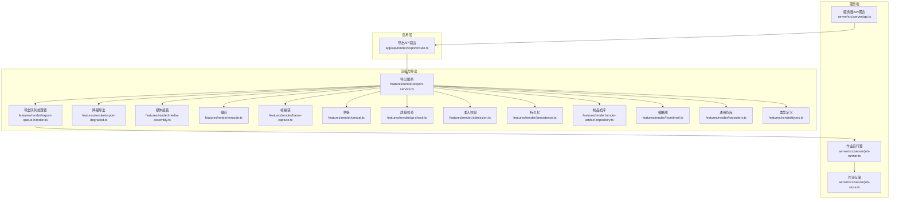
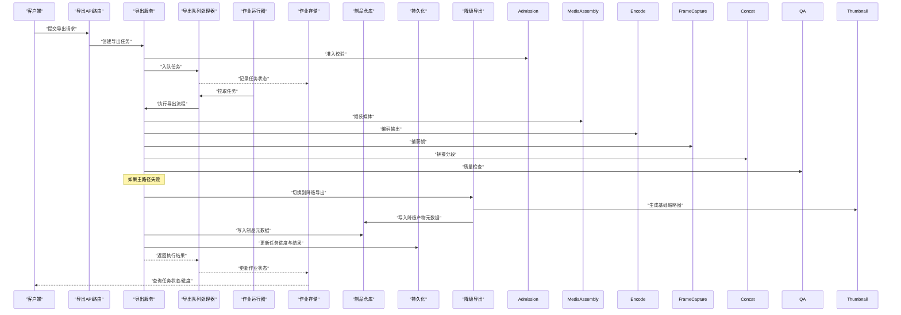
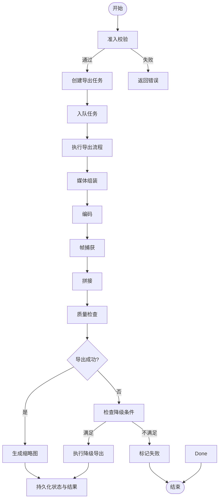
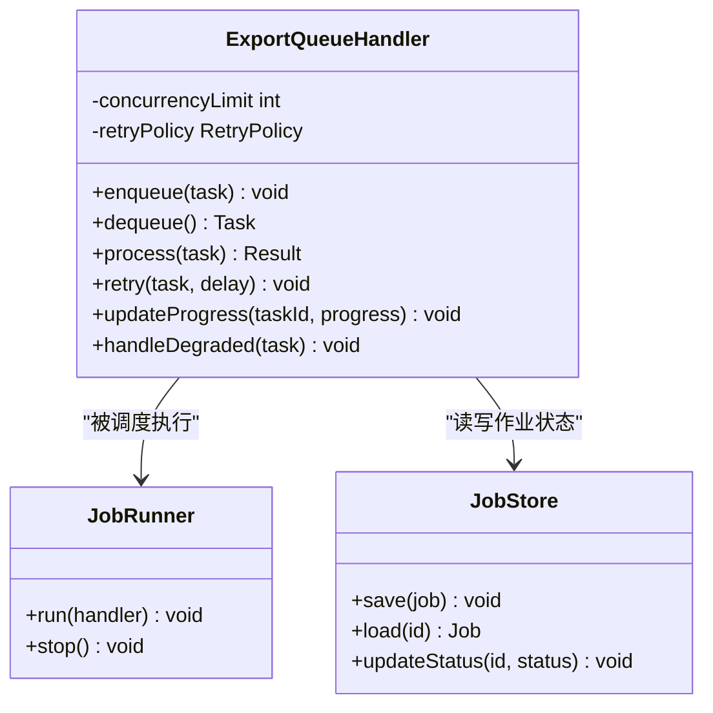
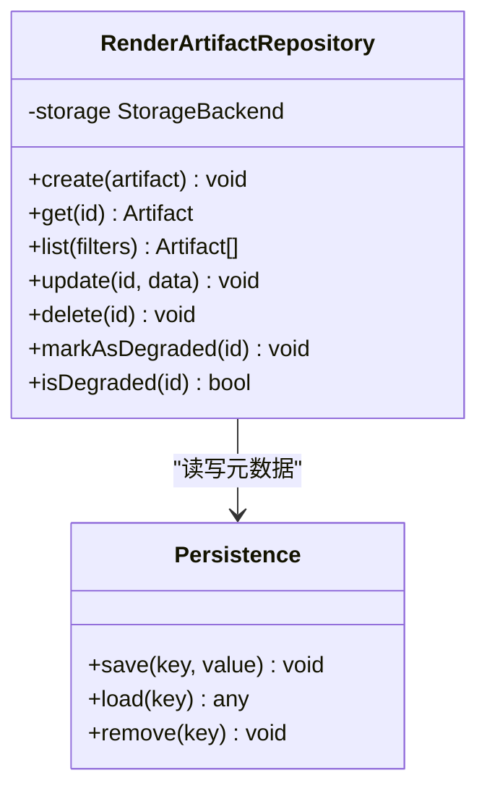
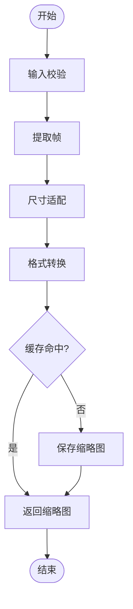
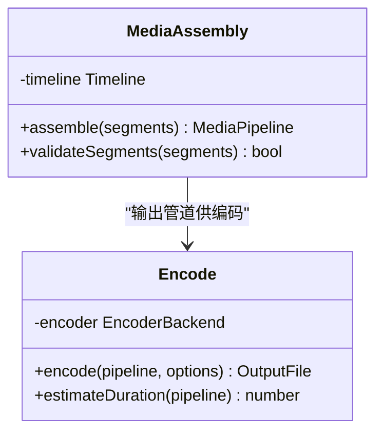
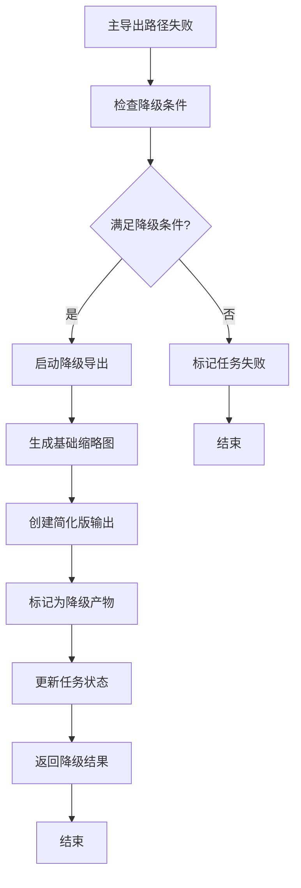
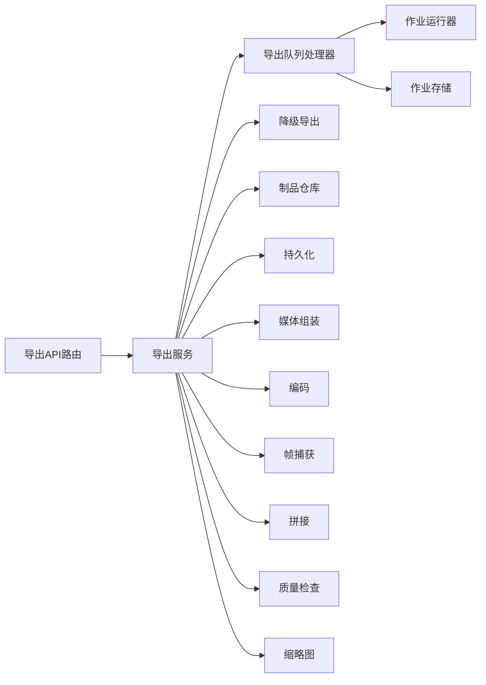

# 导出服务

<cite>
**本文档引用的文件**   
- [export-service.ts](file://src/features/render/export-service.ts)
- [export-queue-handler.ts](file://src/features/render/export-queue-handler.ts)
- [render-artifact-repository.ts](file://src/features/render/render-artifact-repository.ts)
- [thumbnail.ts](file://src/features/render/thumbnail.ts)
- [persistence.ts](file://src/features/render/persistence.ts)
- [media-assembly.ts](file://src/features/render/media-assembly.ts)
- [encode.ts](file://src/features/render/encode.ts)
- [frame-capture.ts](file://src/features/render/frame-capture.ts)
- [concat.ts](file://src/features/render/concat.ts)
- [qa-check.ts](file://src/features/render/qa-check.ts)
- [admission.ts](file://src/features/render/admission.ts)
- [repository.ts](file://src/features/render/repository.ts)
- [types.ts](file://src/features/render/types.ts)
- [route.ts](file://src/app/api/render/export/route.ts)
- [job-runner.ts](file://server/src/server/job-runner.ts)
- [job-store.ts](file://server/src/server/job-store.ts)
- [api.ts](file://server/src/server/api.ts)
- [export-degraded.ts](file://src/features/render/export-degraded.ts)
</cite>

## 更新摘要
**所做更改**   
- 新增降级导出支持章节，详细说明降级导出的实现机制
- 更新API端点扩展说明，包含降级导出相关接口
- 增强队列处理器描述，添加降级任务处理逻辑
- 扩展工件仓库功能，支持降级产物管理
- 更新架构图表，反映降级导出流程

## 目录
1. [简介](#简介)
2. [项目结构](#项目结构)
3. [核心组件](#核心组件)
4. [架构总览](#架构总览)
5. [详细组件分析](#详细组件分析)
6. [降级导出支持](#降级导出支持)
7. [依赖关系分析](#依赖关系分析)
8. [性能考虑](#性能考虑)
9. [故障排查指南](#故障排查指南)
10. [结论](#结论)
11. [附录](#附录)

## 简介
本文件面向导出服务的实现与使用，覆盖以下目标：
- 导出任务管理：任务创建、状态跟踪、进度反馈
- 批量导出支持：任务队列、并发控制、错误恢复
- 缩略图生成：预览图制作、尺寸适配、格式转换
- 导出结果管理：文件组织、下载链接、版本管理
- 降级导出支持：异常场景下的备用导出方案
- 性能优化与监控告警配置指南

该服务基于渲染管线（媒体组装、编码、拼接、QA检查）与持久化存储，结合后台作业运行器与队列处理器，提供高吞吐、可观测、可恢复的导出能力。新增的降级导出功能确保在主要导出路径失败时仍能提供服务。

## 项目结构
导出相关代码主要分布在 features/render 与 server 层：
- features/render：导出服务、队列处理器、缩略图、媒体组装、编码、帧捕获、拼接、QA检查、持久化、仓库与类型定义
- server：作业运行器、作业存储、API 路由
- app/api/render/export：导出 API 入口

图表来源
- [route.ts](file://src/app/api/render/export/route.ts)
- [export-service.ts](file://src/features/render/export-service.ts)
- [export-queue-handler.ts](file://src/features/render/export-queue-handler.ts)
- [export-degraded.ts](file://src/features/render/export-degraded.ts)
- [job-runner.ts](file://server/src/server/job-runner.ts)
- [job-store.ts](file://server/src/server/job-store.ts)
- [api.ts](file://server/src/server/api.ts)

章节来源
- [route.ts](file://src/app/api/render/export/route.ts)
- [export-service.ts](file://src/features/render/export-service.ts)
- [export-queue-handler.ts](file://src/features/render/export-queue-handler.ts)
- [export-degraded.ts](file://src/features/render/export-degraded.ts)
- [job-runner.ts](file://server/src/server/job-runner.ts)
- [job-store.ts](file://server/src/server/job-store.ts)
- [api.ts](file://server/src/server/api.ts)

## 核心组件
- 导出服务：编排导出流程，协调各阶段（准入、媒体组装、编码、帧捕获、拼接、QA、持久化、缩略图），并维护任务状态与进度
- 导出队列处理器：将导出任务入队、消费、重试、失败处理，支持并发与限流
- 降级导出服务：在主导出路径失败时提供备用导出方案，确保服务可用性
- 制品仓库：导出产物（视频、音频、字幕、缩略图等）的元数据与路径管理
- 持久化：任务状态、进度、结果等数据的持久化存储
- 缩略图：从帧或媒体中生成预览图，支持尺寸适配与格式转换
- 媒体组装与编码：按时间线组装媒体片段，进行转码与封装
- 帧捕获：从渲染输出中提取关键帧用于缩略图与预览
- 拼接：将分段输出合并为最终文件
- QA检查：对输出进行基本质量校验（时长、分辨率、音画同步等）
- 准入校验：对请求参数、资源配额、权限等进行前置检查
- 通用仓库与类型：统一的数据访问接口与类型契约

章节来源
- [export-service.ts](file://src/features/render/export-service.ts)
- [export-queue-handler.ts](file://src/features/render/export-queue-handler.ts)
- [export-degraded.ts](file://src/features/render/export-degraded.ts)
- [render-artifact-repository.ts](file://src/features/render/render-artifact-repository.ts)
- [persistence.ts](file://src/features/render/persistence.ts)
- [thumbnail.ts](file://src/features/render/thumbnail.ts)
- [media-assembly.ts](file://src/features/render/media-assembly.ts)
- [encode.ts](file://src/features/render/encode.ts)
- [frame-capture.ts](file://src/features/render/frame-capture.ts)
- [concat.ts](file://src/features/render/concat.ts)
- [qa-check.ts](file://src/features/render/qa-check.ts)
- [admission.ts](file://src/features/render/admission.ts)
- [repository.ts](file://src/features/render/repository.ts)
- [types.ts](file://src/features/render/types.ts)

## 架构总览
导出服务采用"API 路由 -> 服务编排 -> 队列处理器 -> 作业运行器"的分层架构，确保异步、可扩展与可观测性。新增的降级导出机制在主路径失败时自动切换到备用方案。

图表来源
- [route.ts](file://src/app/api/render/export/route.ts)
- [export-service.ts](file://src/features/render/export-service.ts)
- [export-queue-handler.ts](file://src/features/render/export-queue-handler.ts)
- [export-degraded.ts](file://src/features/render/export-degraded.ts)
- [job-runner.ts](file://server/src/server/job-runner.ts)
- [job-store.ts](file://server/src/server/job-store.ts)
- [render-artifact-repository.ts](file://src/features/render/render-artifact-repository.ts)
- [persistence.ts](file://src/features/render/persistence.ts)

## 详细组件分析

### 导出服务（ExportService）
职责与流程：
- 接收导出请求，进行准入校验（参数、权限、配额）
- 创建导出任务，初始化状态与进度
- 编排媒体组装、编码、帧捕获、拼接、QA检查、缩略图生成
- 写入制品元数据与持久化状态
- 支持批量导出：分片任务、并发控制、失败重试
- **新增**：集成降级导出机制，在主路径失败时自动切换

关键交互：
- 与队列处理器协作，将任务交由后台运行
- 与制品仓库交互，管理导出产物元数据
- 与持久化模块同步任务状态与进度
- **新增**：与降级导出服务协作，处理异常情况

图表来源
- [export-service.ts](file://src/features/render/export-service.ts)
- [export-degraded.ts](file://src/features/render/export-degraded.ts)
- [admission.ts](file://src/features/render/admission.ts)
- [media-assembly.ts](file://src/features/render/media-assembly.ts)
- [encode.ts](file://src/features/render/encode.ts)
- [frame-capture.ts](file://src/features/render/frame-capture.ts)
- [concat.ts](file://src/features/render/concat.ts)
- [qa-check.ts](file://src/features/render/qa-check.ts)
- [thumbnail.ts](file://src/features/render/thumbnail.ts)
- [persistence.ts](file://src/features/render/persistence.ts)

章节来源
- [export-service.ts](file://src/features/render/export-service.ts)
- [export-degraded.ts](file://src/features/render/export-degraded.ts)
- [admission.ts](file://src/features/render/admission.ts)

### 导出队列处理器（ExportQueueHandler）
职责与机制：
- 任务入队与出队，支持优先级与分片
- 并发控制：限制同时处理的作业数量，避免过载
- 错误恢复：失败重试、退避策略、死信队列
- 进度上报：周期性更新任务进度到持久化存储
- **新增**：支持降级任务的特殊处理逻辑

图表来源
- [export-queue-handler.ts](file://src/features/render/export-queue-handler.ts)
- [job-runner.ts](file://server/src/server/job-runner.ts)
- [job-store.ts](file://server/src/server/job-store.ts)

章节来源
- [export-queue-handler.ts](file://src/features/render/export-queue-handler.ts)
- [job-runner.ts](file://server/src/server/job-runner.ts)
- [job-store.ts](file://server/src/server/job-store.ts)

### 制品仓库（RenderArtifactRepository）
职责：
- 管理导出产物的元数据（路径、大小、格式、哈希、版本）
- 提供查询与更新接口，支持多版本与归档
- 与持久化模块协作，保证一致性
- **新增**：支持降级产物的特殊标识与管理

图表来源
- [render-artifact-repository.ts](file://src/features/render/render-artifact-repository.ts)
- [persistence.ts](file://src/features/render/persistence.ts)

章节来源
- [render-artifact-repository.ts](file://src/features/render/render-artifact-repository.ts)
- [persistence.ts](file://src/features/render/persistence.ts)

### 缩略图生成（Thumbnail）
功能：
- 从帧或媒体中截取关键帧作为预览图
- 尺寸适配：根据目标尺寸进行缩放与裁剪
- 格式转换：输出为常用图片格式（如 PNG/JPEG）
- 缓存策略：相同输入复用已有缩略图

图表来源
- [thumbnail.ts](file://src/features/render/thumbnail.ts)
- [frame-capture.ts](file://src/features/render/frame-capture.ts)

章节来源
- [thumbnail.ts](file://src/features/render/thumbnail.ts)
- [frame-capture.ts](file://src/features/render/frame-capture.ts)

### 媒体组装与编码（MediaAssembly & Encode）
职责：
- 媒体组装：按时间线组合音视频片段，处理轨道与同步
- 编码：根据目标格式与质量参数进行转码与封装
- 分段输出：支持大文件分段编码，便于并行与恢复

图表来源
- [media-assembly.ts](file://src/features/render/media-assembly.ts)
- [encode.ts](file://src/features/render/encode.ts)

章节来源
- [media-assembly.ts](file://src/features/render/media-assembly.ts)
- [encode.ts](file://src/features/render/encode.ts)

### 帧捕获（FrameCapture）
职责：
- 从渲染输出或媒体文件中提取指定时间点的帧
- 支持多种输入源（视频、图像序列、渲染缓冲）
- 输出可用于缩略图、预览与QA检查

章节来源
- [frame-capture.ts](file://src/features/render/frame-capture.ts)

### 拼接（Concat）
职责：
- 将分段编码的输出合并为完整文件
- 保持时间线与轨道顺序一致
- 支持增量拼接与断点续拼

章节来源
- [concat.ts](file://src/features/render/concat.ts)

### 质量检查（QA）
职责：
- 检查输出文件的时长、分辨率、码率、音画同步
- 失败时返回详细错误信息，便于定位问题

章节来源
- [qa-check.ts](file://src/features/render/qa-check.ts)

### 准入校验（Admission）
职责：
- 校验请求参数合法性
- 检查用户权限与资源配额
- 防止恶意或超限请求进入导出流程

章节来源
- [admission.ts](file://src/features/render/admission.ts)

### 通用仓库与类型（Repository & Types）
职责：
- 统一数据访问接口，屏蔽底层存储差异
- 定义导出任务、制品、进度等核心类型契约

章节来源
- [repository.ts](file://src/features/render/repository.ts)
- [types.ts](file://src/features/render/types.ts)

## 降级导出支持

### 降级导出机制概述
降级导出功能在主导出路径失败时提供备用方案，确保系统的高可用性和用户体验。当主要导出流程因资源不足、编码失败或其他异常情况无法完成时，系统会自动切换到降级模式。

### 降级触发条件
降级导出在以下情况下被触发：
- 媒体组装失败且无法重试
- 编码过程出现不可恢复的错误
- 系统资源（CPU、内存、磁盘）严重不足
- QA检查失败且无法修复
- 外部依赖服务（如FFmpeg）不可用

### 降级导出流程

### 降级导出特性
- **简化输出**：生成基础质量的视频或静态图片
- **快速响应**：减少处理步骤，提高响应速度
- **资源友好**：降低CPU和内存占用
- **向后兼容**：确保客户端能正常处理降级产物
- **状态标识**：明确标记产物为降级版本

### 降级产物管理
降级产物在制品仓库中具有特殊标识：
- 元数据中包含`degraded: true`字段
- 文件名带有`_degraded`后缀
- 质量参数设置为最低可用级别
- 保留原始任务ID以便追踪

**Section sources**
- [export-degraded.ts](file://src/features/render/export-degraded.ts)
- [export-service.ts](file://src/features/render/export-service.ts)
- [render-artifact-repository.ts](file://src/features/render/render-artifact-repository.ts)

## 依赖关系分析
导出服务依赖多个子模块，形成清晰的层次与职责边界：
- API 路由依赖导出服务
- 导出服务依赖队列处理器、制品仓库、持久化与各处理模块
- 队列处理器依赖作业运行器与作业存储
- 各处理模块相互独立，通过标准接口协作
- **新增**：导出服务依赖降级导出模块

图表来源
- [route.ts](file://src/app/api/render/export/route.ts)
- [export-service.ts](file://src/features/render/export-service.ts)
- [export-queue-handler.ts](file://src/features/render/export-queue-handler.ts)
- [export-degraded.ts](file://src/features/render/export-degraded.ts)
- [job-runner.ts](file://server/src/server/job-runner.ts)
- [job-store.ts](file://server/src/server/job-store.ts)

章节来源
- [route.ts](file://src/app/api/render/export/route.ts)
- [export-service.ts](file://src/features/render/export-service.ts)
- [export-queue-handler.ts](file://src/features/render/export-queue-handler.ts)
- [export-degraded.ts](file://src/features/render/export-degraded.ts)
- [job-runner.ts](file://server/src/server/job-runner.ts)
- [job-store.ts](file://server/src/server/job-store.ts)

## 性能考虑
- 并发控制：在队列处理器中设置合理的并发上限，避免CPU与I/O瓶颈
- 分段编码：大文件采用分段编码与拼接，提升吞吐与容错能力
- 缓存策略：缩略图与中间产物缓存，减少重复计算
- 资源隔离：不同租户或项目的导出任务隔离，防止相互影响
- 监控指标：记录任务耗时、成功率、失败原因、队列长度、内存与CPU占用
- 告警规则：当队列积压、失败率升高、超时比例异常时触发告警
- **新增**：降级导出监控：跟踪降级触发频率、降级产物质量、资源使用情况

## 故障排查指南
常见问题与排查步骤：
- 任务无法入队：检查准入校验逻辑与权限配置
- 任务长时间等待：查看队列长度与并发设置，确认作业运行器是否启动
- 导出失败：检查编码参数、媒体源有效性、QA检查结果
- 缩略图缺失：确认帧捕获与缩略图生成流程是否成功
- 结果不可下载：检查制品仓库元数据与持久化状态是否一致
- **新增**：降级导出问题：检查降级触发条件、降级产物生成、降级标识设置

建议日志与指标：
- 记录每个阶段的开始与结束时间
- 捕获异常堆栈与上下文信息
- 暴露Prometheus指标以便监控
- **新增**：记录降级导出事件和原因

章节来源
- [export-service.ts](file://src/features/render/export-service.ts)
- [export-queue-handler.ts](file://src/features/render/export-queue-handler.ts)
- [export-degraded.ts](file://src/features/render/export-degraded.ts)
- [qa-check.ts](file://src/features/render/qa-check.ts)
- [thumbnail.ts](file://src/features/render/thumbnail.ts)
- [render-artifact-repository.ts](file://src/features/render/render-artifact-repository.ts)
- [persistence.ts](file://src/features/render/persistence.ts)

## 结论
导出服务通过分层架构与模块化设计，实现了可靠的导出任务管理、批量处理能力、缩略图生成与结果管理。配合队列处理器与作业运行器，系统具备高吞吐、可扩展与可观测性。新增的降级导出功能进一步增强了系统的鲁棒性，确保在异常情况下仍能提供基本服务。建议在生产环境中完善监控告警与资源隔离，进一步提升稳定性与性能。

## 附录
- API 参考：导出API路由提供任务创建与状态查询接口
- 配置项：并发上限、重试策略、存储后端、编码参数等
- 部署建议：容器化部署，分离Web与Worker进程，使用外部消息队列与对象存储
- **新增**：降级配置：降级触发阈值、降级产物格式、资源限制等