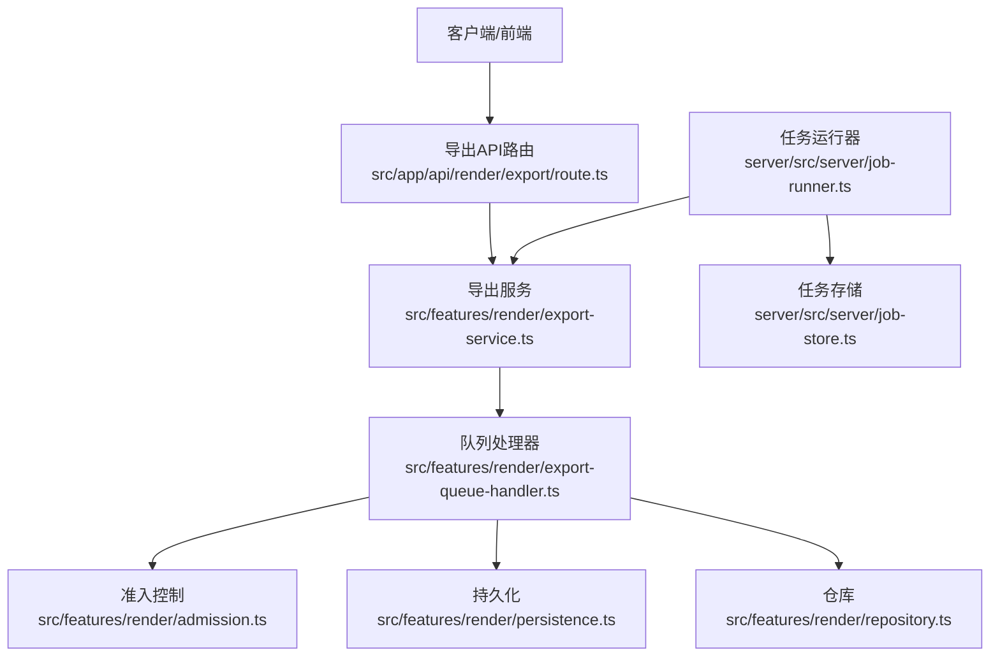
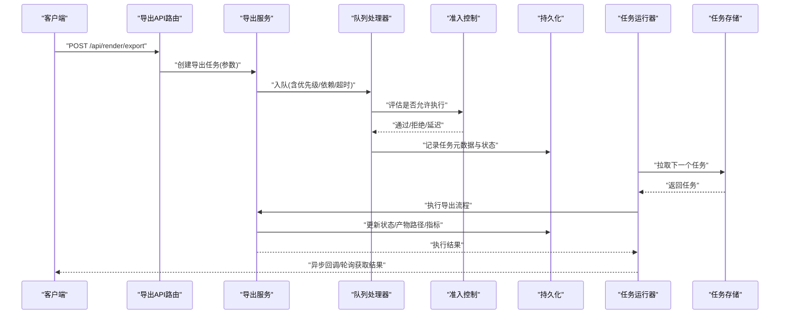
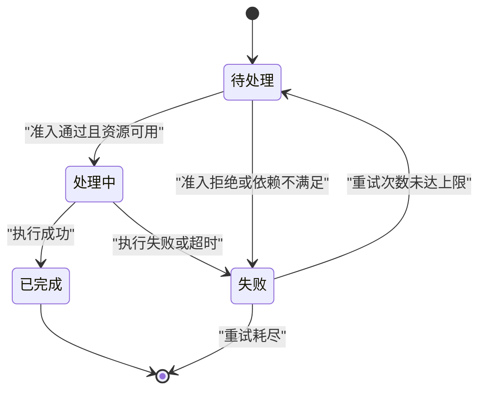
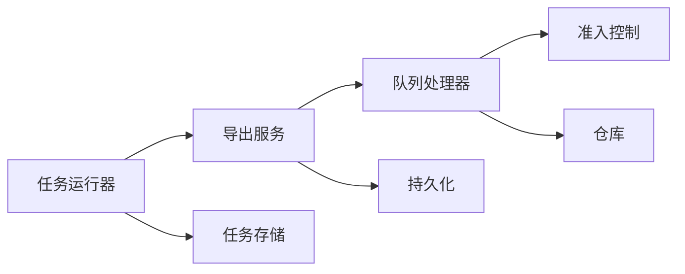

# 导出任务调度器

<cite>
**本文档引用的文件**   
- [export-service.ts](file://src/features/render/export-service.ts)
- [export-queue-handler.ts](file://src/features/render/export-queue-handler.ts)
- [queue-handler.ts](file://src/features/render/queue-handler.ts)
- [admission.ts](file://src/features/render/admission.ts)
- [persistence.ts](file://src/features/render/persistence.ts)
- [repository.ts](file://src/features/render/repository.ts)
- [types.ts](file://src/features/render/types.ts)
- [index.ts](file://src/features/render/index.ts)
- [job-runner.ts](file://server/src/server/job-runner.ts)
- [job-store.ts](file://server/src/server/job-store.ts)
- [api.ts](file://server/src/server/api.ts)
- [route.ts](file://src/app/api/render/export/route.ts)
- [export-api.ts](file://src/app/products/(app)/export/[projectId]/export-api.ts)
- [runtime-concurrency-panel.tsx](file://src/app/products/(app)/settings/runtime-concurrency-panel.tsx)
</cite>

## 目录
1. [简介](#简介)
2. [项目结构](#项目结构)
3. [核心组件](#核心组件)
4. [架构总览](#架构总览)
5. [详细组件分析](#详细组件分析)
6. [依赖关系分析](#依赖关系分析)
7. [性能考量](#性能考量)
8. [故障排查指南](#故障排查指南)
9. [结论](#结论)
10. [附录](#附录)

## 简介
本技术文档聚焦于“导出任务调度器”的设计与实现，覆盖导出任务的创建、校验、优先级管理、资源分配与并发控制、状态机设计（待处理、处理中、已完成、失败）、依赖关系与执行顺序、超时与重试、错误恢复、监控接口与性能指标采集等关键主题。目标是帮助开发者与运维人员全面理解并高效维护该子系统。

## 项目结构
导出功能位于渲染特性模块下，采用分层组织：
- API 层：HTTP 路由接收导出请求，进行参数校验后入队。
- 服务层：封装导出业务逻辑，协调队列、持久化与存储。
- 队列与调度：负责任务入队、出队、优先级排序、并发控制与重试。
- 持久化与仓库：负责任务元数据、执行结果与中间产物的持久化。
- 服务端运行器：后台进程消费队列并驱动任务执行。

**图表来源** 
- [route.ts](file://src/app/api/render/export/route.ts)
- [export-service.ts](file://src/features/render/export-service.ts)
- [export-queue-handler.ts](file://src/features/render/export-queue-handler.ts)
- [admission.ts](file://src/features/render/admission.ts)
- [persistence.ts](file://src/features/render/persistence.ts)
- [repository.ts](file://src/features/render/repository.ts)
- [job-runner.ts](file://server/src/server/job-runner.ts)
- [job-store.ts](file://server/src/server/job-store.ts)

**章节来源**
- [index.ts](file://src/features/render/index.ts)
- [route.ts](file://src/app/api/render/export/route.ts)
- [export-service.ts](file://src/features/render/export-service.ts)

## 核心组件
- 导出服务：对外提供创建导出任务的入口，完成参数校验、上下文构建、优先级计算与入队。
- 队列处理器：实现任务生命周期管理、优先级排序、并发限制、重试与超时策略。
- 准入控制器：基于系统负载、资源配额与任务属性决定是否立即执行或延迟执行。
- 持久化与仓库：统一读写任务元数据、执行日志、产物位置与状态变更历史。
- 任务运行器：后台工作进程，从队列拉取任务，调用导出服务执行具体步骤。

**章节来源**
- [export-service.ts](file://src/features/render/export-service.ts)
- [export-queue-handler.ts](file://src/features/render/export-queue-handler.ts)
- [admission.ts](file://src/features/render/admission.ts)
- [persistence.ts](file://src/features/render/persistence.ts)
- [repository.ts](file://src/features/render/repository.ts)
- [job-runner.ts](file://server/src/server/job-runner.ts)

## 架构总览
导出任务调度器采用“API -> 服务 -> 队列 -> 运行器”的分层架构，结合准入控制与持久化保障一致性与可观测性。

**图表来源** 
- [route.ts](file://src/app/api/render/export/route.ts)
- [export-service.ts](file://src/features/render/export-service.ts)
- [export-queue-handler.ts](file://src/features/render/export-queue-handler.ts)
- [admission.ts](file://src/features/render/admission.ts)
- [persistence.ts](file://src/features/render/persistence.ts)
- [job-runner.ts](file://server/src/server/job-runner.ts)
- [job-store.ts](file://server/src/server/job-store.ts)

## 详细组件分析

### 导出服务（ExportService）
职责：
- 接收导出请求，校验输入参数与权限。
- 计算任务优先级（如文件大小、格式复杂度、用户等级）。
- 构建任务上下文（依赖节点、输出目标、超时阈值）。
- 将任务提交至队列处理器，并返回任务ID供后续查询。

关键点：
- 参数校验失败直接返回错误，避免无效任务进入队列。
- 优先级算法需考虑公平性与吞吐量的平衡。
- 上下文包含依赖图信息，用于执行顺序控制。

**章节来源**
- [export-service.ts](file://src/features/render/export-service.ts)

### 队列处理器（ExportQueueHandler）
职责：
- 管理任务的生命周期：待处理、处理中、已完成、失败。
- 实现优先级队列，支持高优先级任务抢占或插队策略。
- 并发控制：限制同时运行的任务数，防止资源耗尽。
- 重试机制：对瞬时错误进行指数退避重试，达到上限后标记失败。
- 超时处理：超过阈值的任务自动中断并回滚部分状态。

关键点：
- 使用有界队列与信号量实现并发限制。
- 重试策略需区分可重试与不可重试错误。
- 超时中断应保证幂等与一致性。

**章节来源**
- [export-queue-handler.ts](file://src/features/render/export-queue-handler.ts)
- [queue-handler.ts](file://src/features/render/queue-handler.ts)

### 准入控制器（AdmissionController）
职责：
- 根据系统负载（CPU、内存、I/O）、队列长度与任务属性决定执行时机。
- 支持动态调整阈值，适应不同环境配置。
- 提供延迟执行策略，避免雪崩效应。

关键点：
- 与运行时并发面板联动，允许管理员调节并发度。
- 支持按租户或项目维度进行配额控制。

**章节来源**
- [admission.ts](file://src/features/render/admission.ts)
- [runtime-concurrency-panel.tsx](file://src/app/products/(app)/settings/runtime-concurrency-panel.tsx)

### 持久化与仓库（Persistence & Repository）
职责：
- 持久化任务元数据：ID、类型、优先级、依赖、状态、创建时间、更新时间。
- 记录执行日志与中间产物位置。
- 提供查询接口用于监控与调试。

关键点：
- 状态变更需原子写入，避免不一致。
- 大对象（如产物路径）建议外置存储，数据库仅存引用。

**章节来源**
- [persistence.ts](file://src/features/render/persistence.ts)
- [repository.ts](file://src/features/render/repository.ts)

### 任务运行器（JobRunner）
职责：
- 后台进程，循环从任务存储拉取任务。
- 调用导出服务执行具体步骤，处理异常与状态更新。
- 上报执行指标（耗时、成功率、错误码分布）。

关键点：
- 支持多实例水平扩展，通过分布式锁或队列去重。
- 优雅关闭：处理完当前任务后退出，避免中断。

**章节来源**
- [job-runner.ts](file://server/src/server/job-runner.ts)
- [job-store.ts](file://server/src/server/job-store.ts)

### 状态机设计
导出任务状态包括：待处理、处理中、已完成、失败。转换逻辑如下：

**图表来源** 
- [types.ts](file://src/features/render/types.ts)
- [export-queue-handler.ts](file://src/features/render/export-queue-handler.ts)

### 依赖关系与执行顺序
- 任务可声明前置依赖，只有当所有依赖任务完成后才能进入待处理。
- 依赖图需检测环状依赖，防止死锁。
- 执行顺序由依赖拓扑排序决定，确保无冲突。

**章节来源**
- [export-service.ts](file://src/features/render/export-service.ts)
- [types.ts](file://src/features/render/types.ts)

### 超时处理与重试机制
- 超时：每个任务设置最大执行时间，超过则中断并标记失败。
- 重试：对网络错误、临时资源不足等可重试错误进行指数退避。
- 错误恢复：失败任务可人工干预后重新入队，保留部分进度。

**章节来源**
- [export-queue-handler.ts](file://src/features/render/export-queue-handler.ts)
- [persistence.ts](file://src/features/render/persistence.ts)

### 监控接口与性能指标
- 监控接口：提供任务列表、状态查询、进度跟踪与日志查看。
- 性能指标：队列长度、平均等待时间、执行时长、成功率、错误率。
- 告警：队列积压、长时间失败、资源耗尽等场景触发告警。

**章节来源**
- [export-api.ts](file://src/app/products/(app)/export/[projectId]/export-api.ts)
- [job-runner.ts](file://server/src/server/job-runner.ts)

## 依赖关系分析
导出任务调度器内部模块间依赖清晰，外部依赖主要为数据库与消息队列。

**图表来源** 
- [export-service.ts](file://src/features/render/export-service.ts)
- [export-queue-handler.ts](file://src/features/render/export-queue-handler.ts)
- [admission.ts](file://src/features/render/admission.ts)
- [persistence.ts](file://src/features/render/persistence.ts)
- [repository.ts](file://src/features/render/repository.ts)
- [job-runner.ts](file://server/src/server/job-runner.ts)
- [job-store.ts](file://server/src/server/job-store.ts)

**章节来源**
- [index.ts](file://src/features/render/index.ts)

## 性能考量
- 并发控制：合理设置队列大小与并发度，避免内存溢出。
- 优先级策略：高优先级任务不应长期饥饿低优先级任务。
- I/O优化：批量写入、异步上传产物，减少阻塞。
- 缓存策略：对重复导出请求使用缓存命中，降低负载。
- 监控与调优：持续收集指标，动态调整参数。

[本节为通用指导，无需特定文件来源]

## 故障排查指南
常见问题与解决思路：
- 任务堆积：检查队列处理器是否崩溃，扩容运行器实例。
- 频繁失败：查看错误日志，区分可重试与不可重试错误。
- 超时过多：调整超时阈值，优化慢查询或外部依赖。
- 依赖死锁：检查依赖图是否存在环，修复依赖定义。
- 资源不足：增加服务器资源或降低并发度。

**章节来源**
- [export-queue-handler.ts](file://src/features/render/export-queue-handler.ts)
- [persistence.ts](file://src/features/render/persistence.ts)

## 结论
导出任务调度器通过分层架构、严格的状态机、灵活的优先级与并发控制、健壮的超时重试机制，实现了高可靠、高性能的导出能力。建议在生产环境中启用完整监控与告警，持续优化参数以适应业务变化。

[本节为总结，无需特定文件来源]

## 附录
- 配置项说明：详见各模块配置文件与环境变量。
- 测试用例：参考对应 .test.ts 文件验证行为。
- 部署指南：参考 deploy 目录下的 compose 与脚本。

[本节为补充信息，无需特定文件来源]