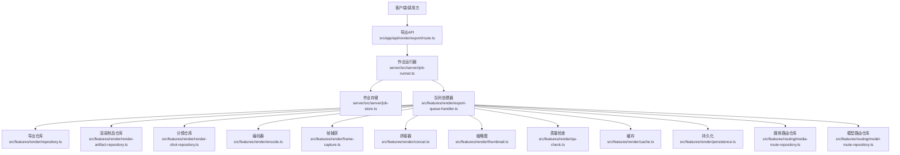
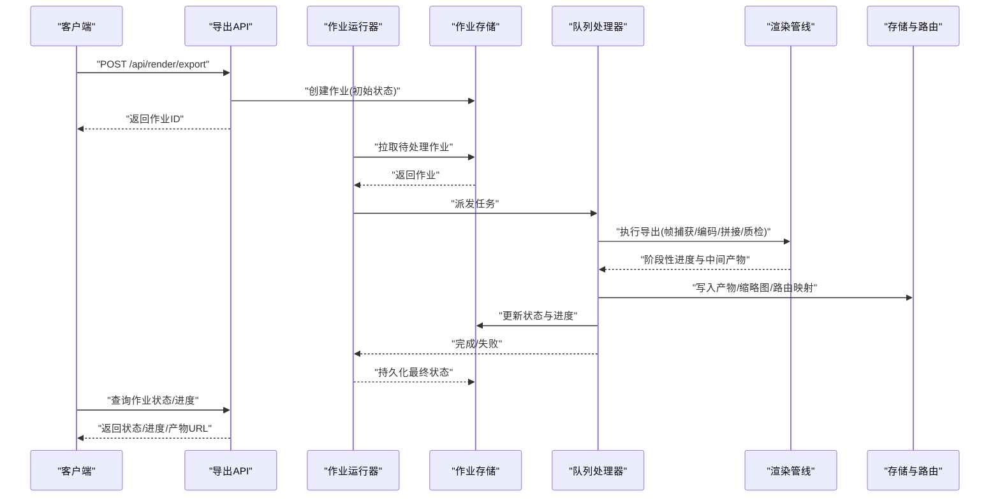
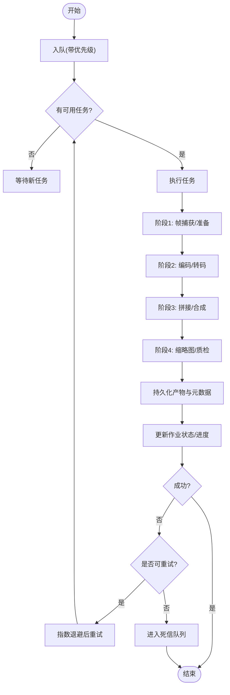
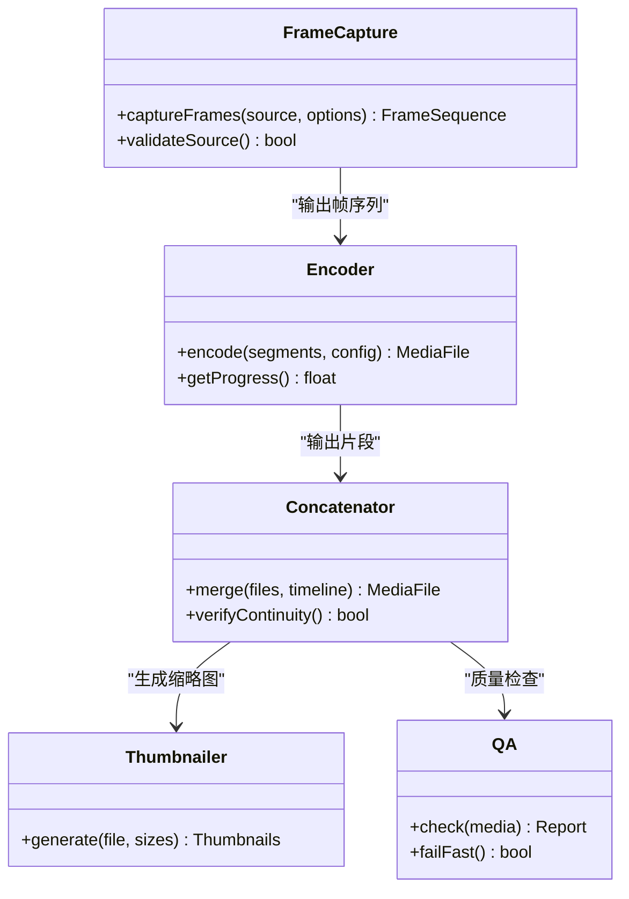
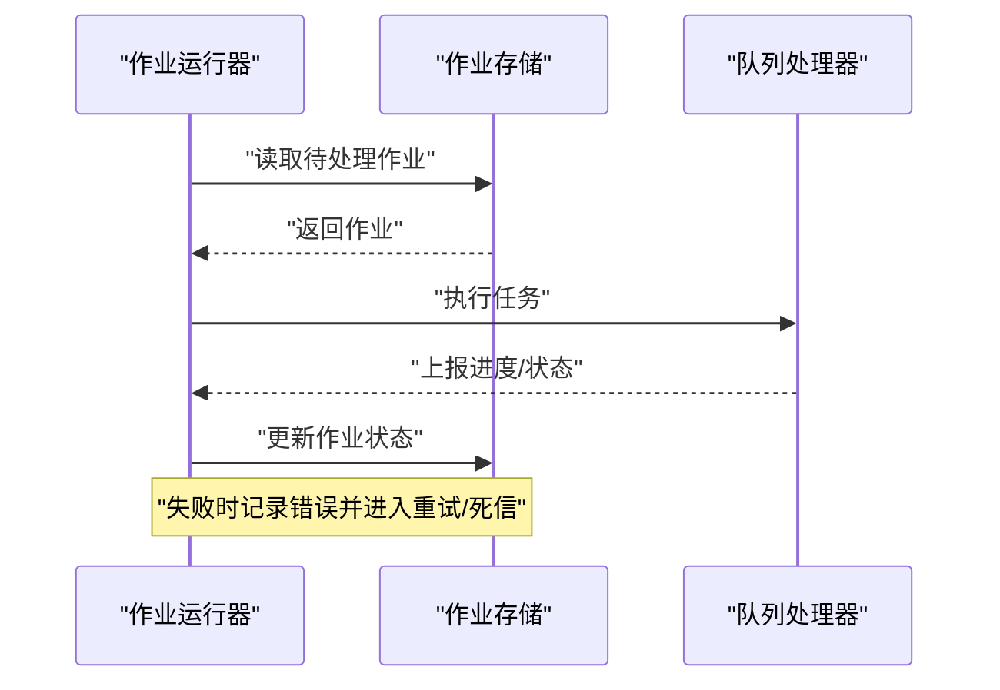
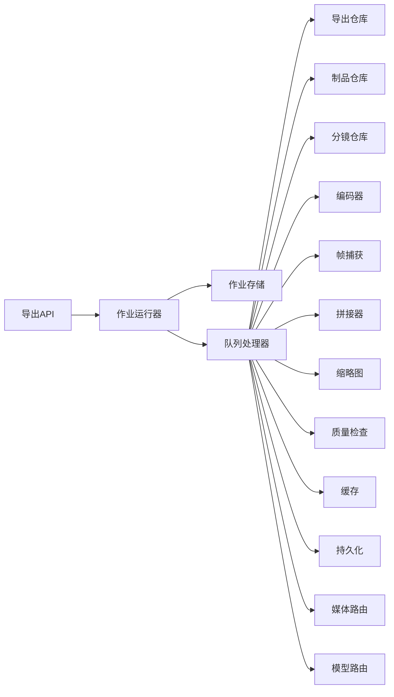

# 导出服务

<cite>
**本文引用的文件**   
- [export-service.ts](file://src/features/render/export-service.ts)
- [export-queue-handler.ts](file://src/features/render/export-queue-handler.ts)
- [queue-handler.ts](file://src/features/render/queue-handler.ts)
- [repository.ts](file://src/features/render/repository.ts)
- [persistence.ts](file://src/features/render/persistence.ts)
- [render-artifact-repository.ts](file://src/features/render/render-artifact-repository.ts)
- [render-shot-repository.ts](file://src/features/render/render-shot-repository.ts)
- [admission.ts](file://src/features/render/admission.ts)
- [cache.ts](file://src/features/render/cache.ts)
- [encode.ts](file://src/features/render/encode.ts)
- [frame-capture.ts](file://src/features/render/frame-capture.ts)
- [concat.ts](file://src/features/render/concat.ts)
- [thumbnail.ts](file://src/features/render/thumbnail.ts)
- [qa-check.ts](file://src/features/render/qa-check.ts)
- [media-route-repository.ts](file://src/features/routing/media-route-repository.ts)
- [model-route-repository.ts](file://src/features/routing/model-route-repository.ts)
- [route.ts](file://src/app/api/render/export/route.ts)
- [job-runner.ts](file://server/src/server/job-runner.ts)
- [job-store.ts](file://server/src/server/job-store.ts)
- [compose.yaml](file://deploy/compose.yaml)
- [env.example](file://deploy/env.example)
- [worker.env.example](file://deploy/worker.env.example)
</cite>

## 目录
1. [简介](#简介)
2. [项目结构](#项目结构)
3. [核心组件](#核心组件)
4. [架构总览](#架构总览)
5. [详细组件分析](#详细组件分析)
6. [依赖关系分析](#依赖关系分析)
7. [性能考量](#性能考量)
8. [故障排查指南](#故障排查指南)
9. [结论](#结论)
10. [附录](#附录)

## 简介
本技术文档围绕 PurpleInK 导出服务，系统性阐述导出任务的生命周期管理、队列处理器实现原理、最终输出存储与版本控制、视频交付机制（含 CDN 集成、下载优化与访问控制），以及配置选项、性能监控与故障恢复方案。读者可据此理解从“发起导出”到“产出可分发媒体”的完整链路，并掌握在生产环境部署与调优的关键要点。

## 项目结构
导出服务位于前端应用 API 层与渲染特性模块之间，通过 REST 接口接收导出请求，交由后台作业运行器调度执行，并由渲染管线完成帧捕获、编码、拼接、质量检查与缩略图生成，最终将产物落盘并通过路由系统对外提供访问。



图表来源
- [route.ts](file://src/app/api/render/export/route.ts)
- [job-runner.ts](file://server/src/server/job-runner.ts)
- [job-store.ts](file://server/src/server/job-store.ts)
- [export-queue-handler.ts](file://src/features/render/export-queue-handler.ts)
- [repository.ts](file://src/features/render/repository.ts)
- [render-artifact-repository.ts](file://src/features/render/render-artifact-repository.ts)
- [render-shot-repository.ts](file://src/features/render/render-shot-repository.ts)
- [encode.ts](file://src/features/render/encode.ts)
- [frame-capture.ts](file://src/features/render/frame-capture.ts)
- [concat.ts](file://src/features/render/concat.ts)
- [thumbnail.ts](file://src/features/render/thumbnail.ts)
- [qa-check.ts](file://src/features/render/qa-check.ts)
- [cache.ts](file://src/features/render/cache.ts)
- [persistence.ts](file://src/features/render/persistence.ts)
- [media-route-repository.ts](file://src/features/routing/media-route-repository.ts)
- [model-route-repository.ts](file://src/features/routing/model-route-repository.ts)

章节来源
- [route.ts](file://src/app/api/render/export/route.ts)
- [job-runner.ts](file://server/src/server/job-runner.ts)
- [job-store.ts](file://server/src/server/job-store.ts)
- [export-queue-handler.ts](file://src/features/render/export-queue-handler.ts)

## 核心组件
- 导出服务：负责编排导出流程、协调各阶段执行、汇总结果与状态。
- 队列处理器：消费导出任务，按优先级与并发策略执行，处理失败重试与补偿。
- 仓库与持久化：统一读写导出元数据、制品索引、分镜信息与路由映射。
- 渲染管线：帧捕获、编码、拼接、缩略图生成与质量检查。
- 路由系统：为媒体产物提供稳定的访问地址与版本控制能力。
- 作业运行器与存储：在 worker 进程内调度任务、维护作业状态机与进度。

章节来源
- [export-service.ts](file://src/features/render/export-service.ts)
- [export-queue-handler.ts](file://src/features/render/export-queue-handler.ts)
- [repository.ts](file://src/features/render/repository.ts)
- [persistence.ts](file://src/features/render/persistence.ts)
- [render-artifact-repository.ts](file://src/features/render/render-artifact-repository.ts)
- [render-shot-repository.ts](file://src/features/render/render-shot-repository.ts)
- [media-route-repository.ts](file://src/features/routing/media-route-repository.ts)
- [model-route-repository.ts](file://src/features/routing/model-route-repository.ts)
- [job-runner.ts](file://server/src/server/job-runner.ts)
- [job-store.ts](file://server/src/server/job-store.ts)

## 架构总览
导出服务采用“API 入队 + Worker 异步执行”的架构。客户端通过导出 API 提交请求，进入作业存储；作业运行器从队列拉取任务，交给队列处理器执行；处理器驱动渲染管线完成生产，并将产物写入存储与路由系统，同时更新作业状态与进度反馈。



图表来源
- [route.ts](file://src/app/api/render/export/route.ts)
- [job-runner.ts](file://server/src/server/job-runner.ts)
- [job-store.ts](file://server/src/server/job-store.ts)
- [export-queue-handler.ts](file://src/features/render/export-queue-handler.ts)
- [repository.ts](file://src/features/render/repository.ts)
- [media-route-repository.ts](file://src/features/routing/media-route-repository.ts)

## 详细组件分析

### 导出服务（Export Service）
职责
- 定义导出任务的输入参数与校验规则。
- 编排渲染阶段顺序与依赖关系。
- 聚合各阶段结果，生成最终产物清单与元数据。
- 与队列处理器协作，确保异常回滚与一致性。

关键设计点
- 幂等性：基于任务 ID 与输入指纹避免重复执行。
- 可观测性：阶段事件上报，便于进度与诊断。
- 可扩展：新增阶段以插件方式接入。

章节来源
- [export-service.ts](file://src/features/render/export-service.ts)

### 队列处理器（Queue Handler）
职责
- 消费导出任务，支持优先级与并发控制。
- 执行失败重试、退避与死信处理。
- 实时上报进度与错误信息。

实现要点
- 优先级队列：按任务类型、资源占用或 SLA 设定优先级。
- 并发控制：限制同进程并发度，防止资源争用。
- 重试策略：指数退避 + 最大重试次数 + 死信队列。
- 进度上报：阶段级进度与累计进度计算。



图表来源
- [export-queue-handler.ts](file://src/features/render/export-queue-handler.ts)
- [queue-handler.ts](file://src/features/render/queue-handler.ts)

章节来源
- [export-queue-handler.ts](file://src/features/render/export-queue-handler.ts)
- [queue-handler.ts](file://src/features/render/queue-handler.ts)

### 渲染管线（Frame Capture, Encode, Concat, Thumbnail, QA）
- 帧捕获：从渲染源提取帧序列，支持分辨率、帧率与裁剪参数。
- 编码：根据目标格式与码率策略进行编码，支持并行编码与断点续编。
- 拼接：将分段片段合并为完整媒体，保证时间轴对齐与无缝衔接。
- 缩略图：生成封面图与预览图，用于列表展示与播放器封面。
- 质量检查：对音频/视频指标进行抽样检测，不达标则触发告警或回滚。



图表来源
- [frame-capture.ts](file://src/features/render/frame-capture.ts)
- [encode.ts](file://src/features/render/encode.ts)
- [concat.ts](file://src/features/render/concat.ts)
- [thumbnail.ts](file://src/features/render/thumbnail.ts)
- [qa-check.ts](file://src/features/render/qa-check.ts)

章节来源
- [frame-capture.ts](file://src/features/render/frame-capture.ts)
- [encode.ts](file://src/features/render/encode.ts)
- [concat.ts](file://src/features/render/concat.ts)
- [thumbnail.ts](file://src/features/render/thumbnail.ts)
- [qa-check.ts](file://src/features/render/qa-check.ts)

### 存储与路由（Repository, Persistence, Routing）
- 导出仓库：管理导出任务元数据、阶段状态、产物清单与版本标记。
- 制品仓库：记录渲染产物（视频、图片、字幕等）的索引与位置。
- 分镜仓库：维护分镜级渲染结果与时间线信息。
- 持久化：事务性写入，确保状态一致性与可恢复性。
- 媒体路由：为产物提供稳定 URL，支持版本切换与灰度发布。
- 模型路由：为 AI 模型产物提供路由与鉴权。

```mermaid
erDiagram
EXPORT_JOB {
uuid id PK
string status
float progress
json metadata
timestamp created_at
timestamp updated_at
}
ARTIFACT {
uuid id PK
string type
string location
json meta
uuid export_job_id FK
}
SHOT_RESULT {
uuid id PK
uuid export_job_id FK
string shot_id
json timeline
string media_location
}
MEDIA_ROUTE {
uuid id PK
string path
string target
json version_meta
}
EXPORT_JOB ||--o{ ARTIFACT : "包含"
EXPORT_JOB ||--o{ SHOT_RESULT : "包含"
MEDIA_ROUTE ||--o ARTIFACT : "指向"
```

图表来源
- [repository.ts](file://src/features/render/repository.ts)
- [render-artifact-repository.ts](file://src/features/render/render-artifact-repository.ts)
- [render-shot-repository.ts](file://src/features/render/render-shot-repository.ts)
- [persistence.ts](file://src/features/render/persistence.ts)
- [media-route-repository.ts](file://src/features/routing/media-route-repository.ts)
- [model-route-repository.ts](file://src/features/routing/model-route-repository.ts)

章节来源
- [repository.ts](file://src/features/render/repository.ts)
- [render-artifact-repository.ts](file://src/features/render/render-artifact-repository.ts)
- [render-shot-repository.ts](file://src/features/render/render-shot-repository.ts)
- [persistence.ts](file://src/features/render/persistence.ts)
- [media-route-repository.ts](file://src/features/routing/media-route-repository.ts)
- [model-route-repository.ts](file://src/features/routing/model-route-repository.ts)

### 作业运行器与存储（Job Runner & Job Store）
- 作业运行器：在 worker 进程中轮询队列，分配任务给处理器，管理生命周期与超时。
- 作业存储：持久化作业状态、进度、错误堆栈与审计日志，支持查询与回溯。



图表来源
- [job-runner.ts](file://server/src/server/job-runner.ts)
- [job-store.ts](file://server/src/server/job-store.ts)

章节来源
- [job-runner.ts](file://server/src/server/job-runner.ts)
- [job-store.ts](file://server/src/server/job-store.ts)

### 准入与缓存（Admission & Cache）
- 准入控制：限制单位时间内导出请求量，保护后端资源。
- 缓存：对相同输入的导出结果进行命中复用，减少重复计算。

章节来源
- [admission.ts](file://src/features/render/admission.ts)
- [cache.ts](file://src/features/render/cache.ts)

## 依赖关系分析
导出服务依赖多个子系统，耦合点清晰且边界明确：
- API 层仅负责入参与鉴权，不执行业务逻辑。
- 作业运行器与存储解耦了调度与持久化。
- 队列处理器集中编排渲染管线，屏蔽底层细节。
- 仓库与路由提供稳定的数据与访问契约。



图表来源
- [route.ts](file://src/app/api/render/export/route.ts)
- [job-runner.ts](file://server/src/server/job-runner.ts)
- [job-store.ts](file://server/src/server/job-store.ts)
- [export-queue-handler.ts](file://src/features/render/export-queue-handler.ts)
- [repository.ts](file://src/features/render/repository.ts)
- [render-artifact-repository.ts](file://src/features/render/render-artifact-repository.ts)
- [render-shot-repository.ts](file://src/features/render/render-shot-repository.ts)
- [encode.ts](file://src/features/render/encode.ts)
- [frame-capture.ts](file://src/features/render/frame-capture.ts)
- [concat.ts](file://src/features/render/concat.ts)
- [thumbnail.ts](file://src/features/render/thumbnail.ts)
- [qa-check.ts](file://src/features/render/qa-check.ts)
- [cache.ts](file://src/features/render/cache.ts)
- [persistence.ts](file://src/features/render/persistence.ts)
- [media-route-repository.ts](file://src/features/routing/media-route-repository.ts)
- [model-route-repository.ts](file://src/features/routing/model-route-repository.ts)

章节来源
- [route.ts](file://src/app/api/render/export/route.ts)
- [export-queue-handler.ts](file://src/features/render/export-queue-handler.ts)

## 性能考量
- 并发与限流：合理设置队列并发度与准入阈值，避免 CPU/IO 饱和。
- 编码优化：启用硬件加速、并行编码与自适应码率。
- 缓存命中：对高频相同输入启用结果缓存，降低重复渲染。
- I/O 路径：使用高速存储与对象存储，缩短读写延迟。
- 批处理：批量合并小片段，减少文件句柄与锁竞争。
- 监控：采集阶段耗时、吞吐、错误率与资源利用率，建立告警阈值。

[本节为通用指导，无需特定文件引用]

## 故障排查指南
常见问题与定位步骤
- 任务卡住：检查作业存储中的状态与进度，确认是否被阻塞或资源不足。
- 编码失败：查看编码器日志与质量检查结果，确认输入合法性与参数配置。
- 产物缺失：核对制品仓库与媒体路由映射，确认写入与发布流程。
- 重试风暴：检查重试策略与退避参数，避免雪崩效应。
- 内存溢出：调整并发度与编码线程数，增加堆内存上限。

建议的诊断手段
- 启用详细日志与结构化追踪 ID。
- 暴露健康检查与指标端点，观察队列长度与处理速率。
- 定期巡检死信队列与失败作业，自动回收与告警。

章节来源
- [job-store.ts](file://server/src/server/job-store.ts)
- [qa-check.ts](file://src/features/render/qa-check.ts)
- [media-route-repository.ts](file://src/features/routing/media-route-repository.ts)

## 结论
PurpleInK 导出服务通过清晰的层次划分与模块化设计，实现了高可靠、可观测、可扩展的导出流水线。借助优先级队列、并发控制与重试策略，保障在高负载下的稳定性；通过制品仓库与路由系统，提供稳定的产物访问与版本管理能力。配合完善的监控与故障恢复机制，可在生产环境中高效支撑大规模导出需求。

[本节为总结性内容，无需特定文件引用]

## 附录

### 部署与环境
- 容器编排：使用 compose 编排 Web、Worker 与数据库服务。
- 环境变量：通过 env 文件配置数据库连接、存储路径、队列与外部服务凭据。
- Worker 隔离：独立 worker 进程执行导出任务，避免影响主服务。

章节来源
- [compose.yaml](file://deploy/compose.yaml)
- [env.example](file://deploy/env.example)
- [worker.env.example](file://deploy/worker.env.example)

### 配置选项（示例）
- 队列并发：限制每个 worker 的并发任务数。
- 重试策略：最大重试次数、退避倍数、死信阈值。
- 编码参数：分辨率、帧率、码率、编码器选择。
- 存储路径：本地或对象存储路径前缀。
- 路由策略：CDN 域名、缓存策略、访问控制开关。

[本节为通用配置说明，无需特定文件引用]

### 视频交付机制
- CDN 集成：产物上传至对象存储后，通过 CDN 分发，提升全球访问速度。
- 下载优化：支持分片下载、断点续传与多码率自适应。
- 访问控制：基于签名 URL 或鉴权中间件限制访问范围与有效期。

[本节为通用交付说明，无需特定文件引用]