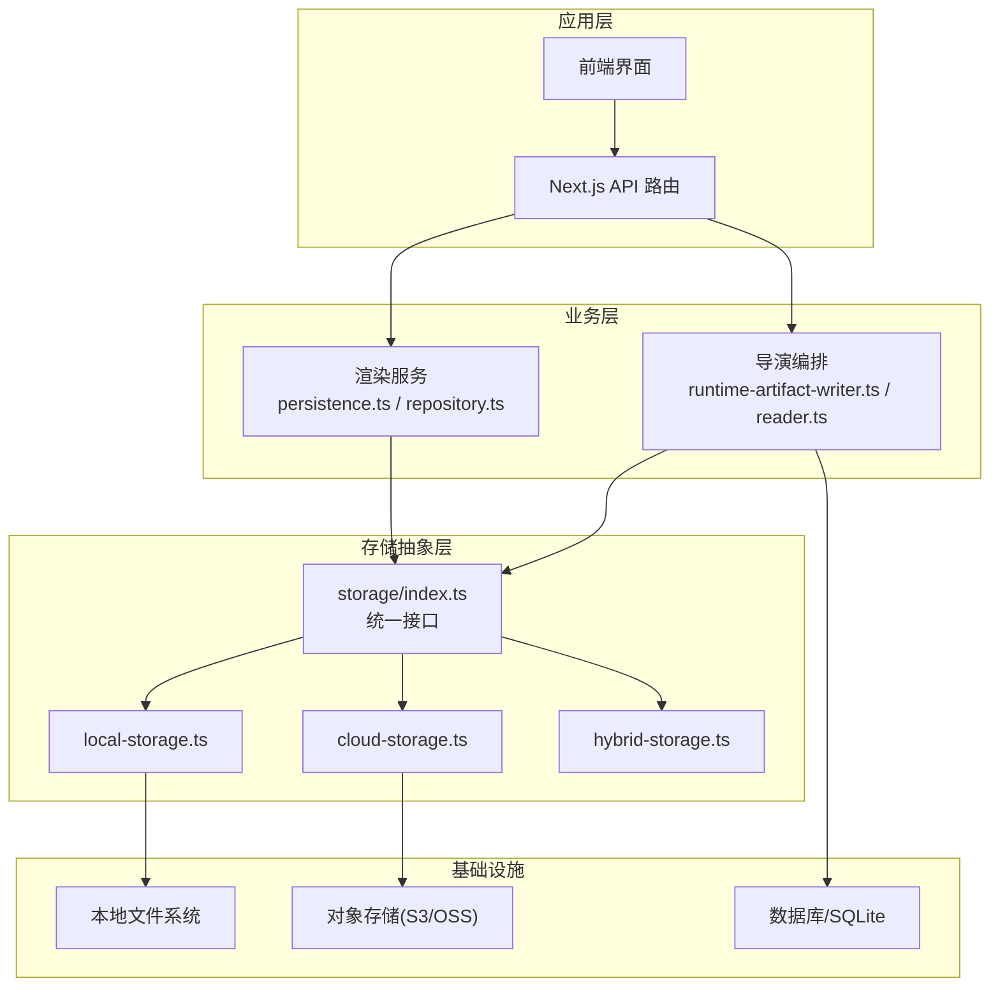
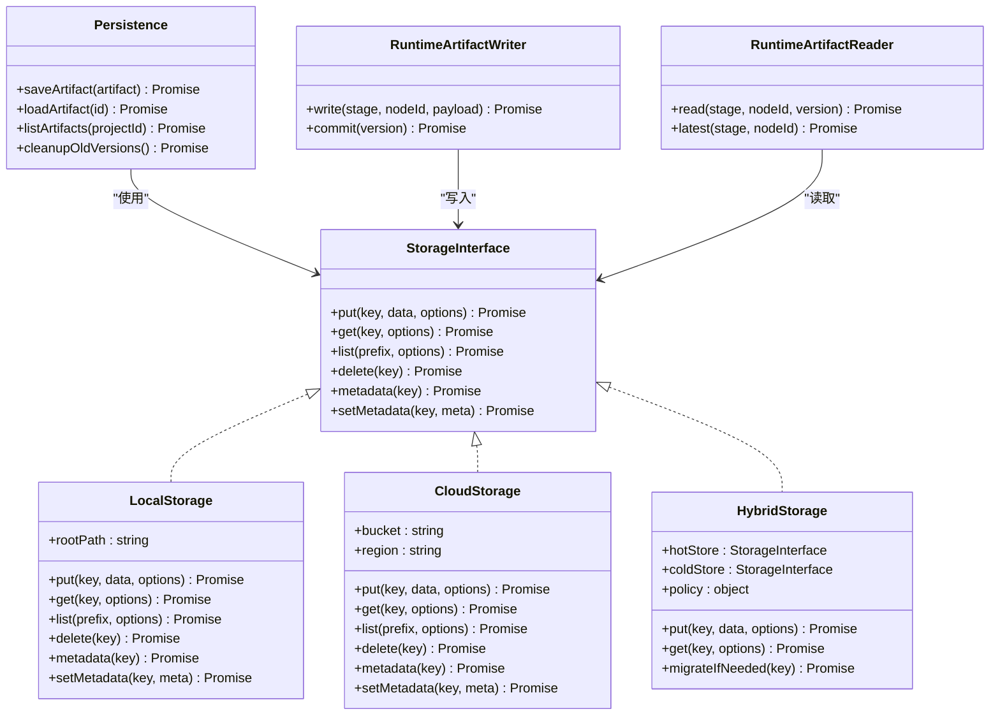
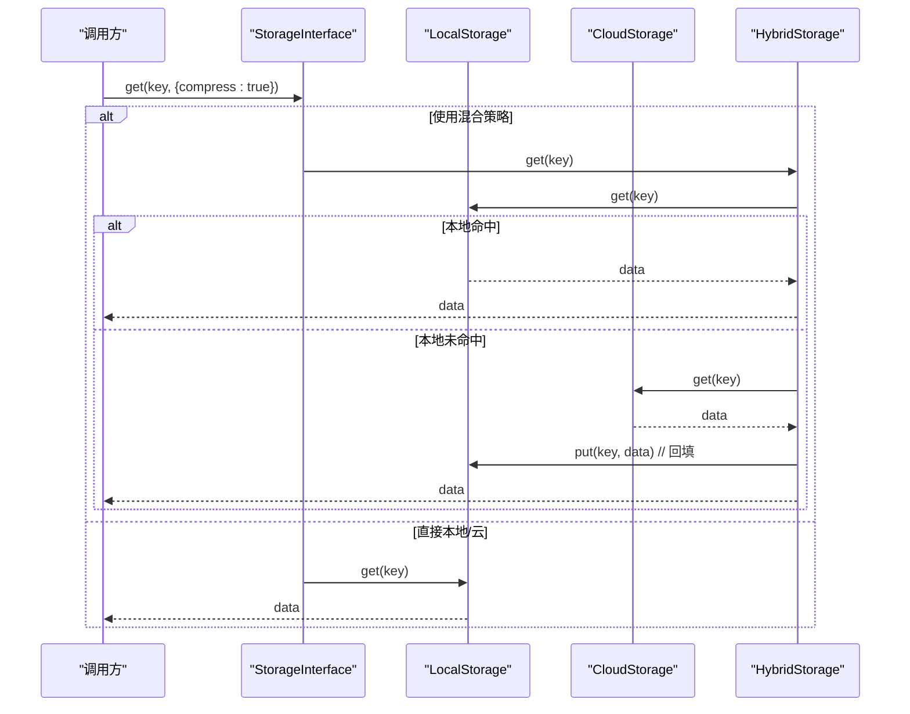
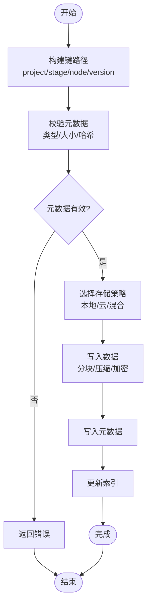
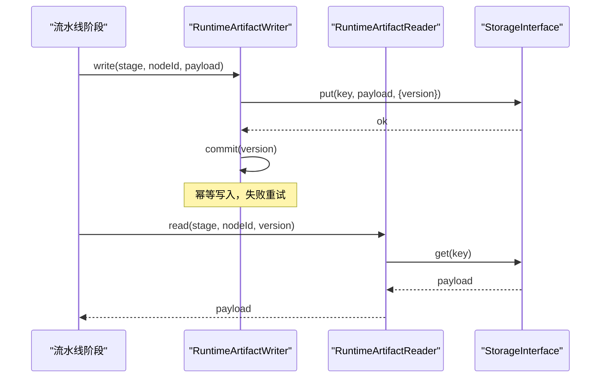
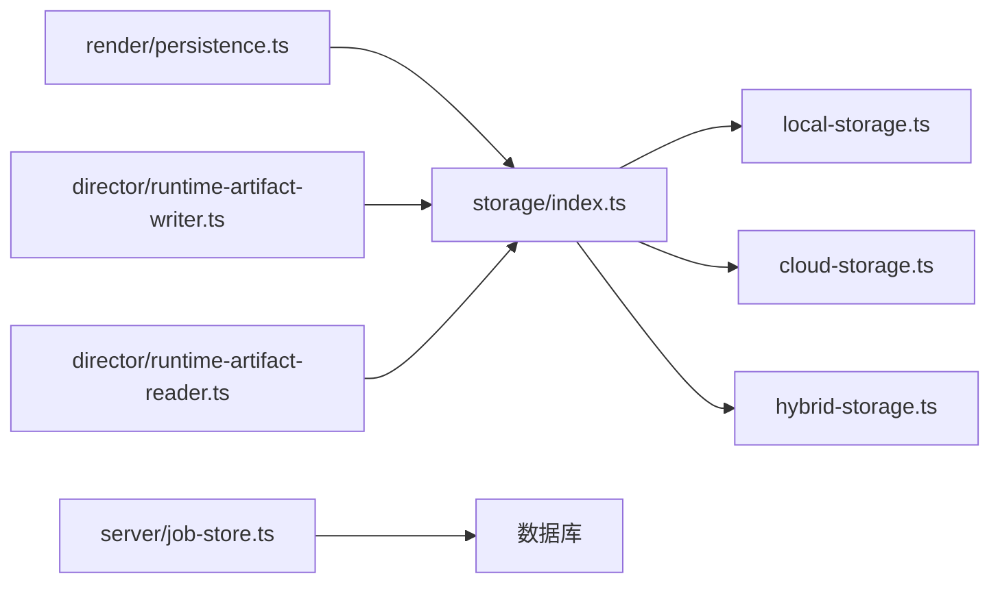

# 最终输出存储

<cite>
**本文引用的文件**   
- [src/lib/storage/index.ts](file://src/lib/storage/index.ts)
- [src/lib/storage/local-storage.ts](file://src/lib/storage/local-storage.ts)
- [src/lib/storage/cloud-storage.ts](file://src/lib/storage/cloud-storage.ts)
- [src/lib/storage/hybrid-storage.ts](file://src/lib/storage/hybrid-storage.ts)
- [src/lib/storage/types.ts](file://src/lib/storage/types.ts)
- [src/features/render/persistence.ts](file://src/features/render/persistence.ts)
- [src/features/render/repository.ts](file://src/features/render/repository.ts)
- [src/features/director/runtime-artifact-writer.ts](file://src/features/director/runtime-artifact-writer.ts)
- [src/features/director/runtime-artifact-reader.ts](file://src/features/director/runtime-artifact-reader.ts)
- [server/src/server/job-store.ts](file://server/src/server/job-store.ts)
- [scripts/migration/sqlite-backup.ts](file://scripts/migration/sqlite-backup.ts)
- [deploy/env.example](file://deploy/env.example)
</cite>

## 目录
1. [简介](#简介)
2. [项目结构](#项目结构)
3. [核心组件](#核心组件)
4. [架构总览](#架构总览)
5. [详细组件分析](#详细组件分析)
6. [依赖关系分析](#依赖关系分析)
7. [性能考量](#性能考量)
8. [故障排查指南](#故障排查指南)
9. [结论](#结论)
10. [附录](#附录)

## 简介
本技术文档聚焦“最终输出存储”子系统，覆盖本地、云与混合存储策略，阐述文件组织与命名规范、版本控制、元数据管理与索引机制；说明压缩、分块上传与增量同步等优化手段；并给出访问权限控制、安全加密、备份恢复方案以及性能监控与容量管理工具建议。读者可据此理解系统如何可靠地持久化渲染产物、中间工件与运行时状态，并在多端（前端/服务端/工作进程）之间一致地读写。

## 项目结构
存储相关代码主要分布在以下位置：
- 通用存储抽象与实现：src/lib/storage/*
- 渲染产物持久化与仓库：src/features/render/*
- 运行时工件写入/读取：src/features/director/*
- 作业存储（任务状态/队列）：server/src/server/job-store.ts
- 备份脚本：scripts/migration/sqlite-backup.ts
- 部署与环境变量示例：deploy/env.example

图表来源 
- [src/lib/storage/index.ts](file://src/lib/storage/index.ts)
- [src/lib/storage/local-storage.ts](file://src/lib/storage/local-storage.ts)
- [src/lib/storage/cloud-storage.ts](file://src/lib/storage/cloud-storage.ts)
- [src/lib/storage/hybrid-storage.ts](file://src/lib/storage/hybrid-storage.ts)
- [src/features/render/persistence.ts](file://src/features/render/persistence.ts)
- [src/features/render/repository.ts](file://src/features/render/repository.ts)
- [src/features/director/runtime-artifact-writer.ts](file://src/features/director/runtime-artifact-writer.ts)
- [src/features/director/runtime-artifact-reader.ts](file://src/features/director/runtime-artifact-reader.ts)
- [server/src/server/job-store.ts](file://server/src/server/job-store.ts)

章节来源
- [src/lib/storage/index.ts](file://src/lib/storage/index.ts)
- [src/lib/storage/types.ts](file://src/lib/storage/types.ts)
- [src/features/render/persistence.ts](file://src/features/render/persistence.ts)
- [src/features/render/repository.ts](file://src/features/render/repository.ts)
- [src/features/director/runtime-artifact-writer.ts](file://src/features/director/runtime-artifact-writer.ts)
- [src/features/director/runtime-artifact-reader.ts](file://src/features/director/runtime-artifact-reader.ts)
- [server/src/server/job-store.ts](file://server/src/server/job-store.ts)

## 核心组件
- 存储抽象接口与工厂
  - 定义统一的读写、列表、删除、元数据存取能力，屏蔽后端差异（本地/云/混合）。
  - 提供按环境或配置选择具体实现的入口。
- 本地存储实现
  - 基于文件系统，适合开发/小规模部署；支持路径映射、前缀隔离、并发写保护。
- 云存储实现
  - 对接 S3/OSS 等对象存储，支持分块上传、断点续传、服务端加密、生命周期策略。
- 混合存储实现
  - 热数据落本地、冷数据归档至云端；自动迁移与透明读取，提升读写性能与成本效益。
- 渲染持久化与仓库
  - 封装渲染产物（视频/图片/字幕/缩略图）的写入、查询、版本化与清理策略。
- 运行时工件读写
  - 为流水线各阶段提供稳定的工件存取语义，保证幂等与一致性。
- 作业存储
  - 持久化任务状态、进度与重试信息，支撑高可用调度。

章节来源
- [src/lib/storage/index.ts](file://src/lib/storage/index.ts)
- [src/lib/storage/local-storage.ts](file://src/lib/storage/local-storage.ts)
- [src/lib/storage/cloud-storage.ts](file://src/lib/storage/cloud-storage.ts)
- [src/lib/storage/hybrid-storage.ts](file://src/lib/storage/hybrid-storage.ts)
- [src/features/render/persistence.ts](file://src/features/render/persistence.ts)
- [src/features/render/repository.ts](file://src/features/render/repository.ts)
- [src/features/director/runtime-artifact-writer.ts](file://src/features/director/runtime-artifact-writer.ts)
- [src/features/director/runtime-artifact-reader.ts](file://src/features/director/runtime-artifact-reader.ts)
- [server/src/server/job-store.ts](file://server/src/server/job-store.ts)

## 架构总览
存储子系统采用“接口抽象 + 多实现 + 上层业务解耦”的分层设计。上层仅依赖统一接口，通过配置切换本地/云/混合策略；渲染与导演模块通过仓库与工件读写器间接访问存储，确保职责单一与可测试性。

图表来源 
- [src/lib/storage/index.ts](file://src/lib/storage/index.ts)
- [src/lib/storage/local-storage.ts](file://src/lib/storage/local-storage.ts)
- [src/lib/storage/cloud-storage.ts](file://src/lib/storage/cloud-storage.ts)
- [src/lib/storage/hybrid-storage.ts](file://src/lib/storage/hybrid-storage.ts)
- [src/features/render/persistence.ts](file://src/features/render/persistence.ts)
- [src/features/director/runtime-artifact-writer.ts](file://src/features/director/runtime-artifact-writer.ts)
- [src/features/director/runtime-artifact-reader.ts](file://src/features/director/runtime-artifact-reader.ts)

## 详细组件分析

### 存储抽象与实现
- 统一接口
  - 提供 put/get/list/delete/metadata/setMetadata 等方法，屏蔽底层差异。
  - 支持可选参数如压缩、加密、分块大小、过期时间等。
- 本地存储
  - 以根路径+键路径映射到文件系统；使用前缀隔离项目/阶段/节点；并发写加锁避免损坏。
  - 元数据以 JSON 文件与主文件同目录存放，便于调试与迁移。
- 云存储
  - 对接对象存储 SDK，启用分块上传与断点续传；支持服务端加密与访问控制策略。
  - 列表与元数据操作遵循对象存储约定，必要时维护轻量索引表。
- 混合存储
  - 热路径优先本地读/写，冷路径自动下沉云端；后台迁移任务按需触发。
  - 读取时先查本地，未命中再回源云端并回填缓存。

图表来源 
- [src/lib/storage/index.ts](file://src/lib/storage/index.ts)
- [src/lib/storage/hybrid-storage.ts](file://src/lib/storage/hybrid-storage.ts)
- [src/lib/storage/local-storage.ts](file://src/lib/storage/local-storage.ts)
- [src/lib/storage/cloud-storage.ts](file://src/lib/storage/cloud-storage.ts)

章节来源
- [src/lib/storage/index.ts](file://src/lib/storage/index.ts)
- [src/lib/storage/local-storage.ts](file://src/lib/storage/local-storage.ts)
- [src/lib/storage/cloud-storage.ts](file://src/lib/storage/cloud-storage.ts)
- [src/lib/storage/hybrid-storage.ts](file://src/lib/storage/hybrid-storage.ts)
- [src/lib/storage/types.ts](file://src/lib/storage/types.ts)

### 渲染产物持久化与仓库
- 持久化
  - 负责将渲染产物（视频帧、合成结果、字幕、缩略图等）写入存储，并记录版本与元数据。
  - 支持按项目/阶段/节点维度组织键空间，便于检索与清理。
- 仓库
  - 提供按条件查询、分页、过滤与聚合的能力；维护索引表加速常见查询。
  - 提供清理策略（保留最近 N 个版本、按时间/大小阈值回收）。

图表来源 
- [src/features/render/persistence.ts](file://src/features/render/persistence.ts)
- [src/features/render/repository.ts](file://src/features/render/repository.ts)
- [src/lib/storage/index.ts](file://src/lib/storage/index.ts)

章节来源
- [src/features/render/persistence.ts](file://src/features/render/persistence.ts)
- [src/features/render/repository.ts](file://src/features/render/repository.ts)

### 运行时工件读写
- 写入器
  - 在流水线各阶段生成中间工件，支持幂等写入与事务式提交。
  - 写入失败自动重试，达到上限后上报错误。
- 读取器
  - 按阶段/节点/版本读取工件，支持最新快照与历史回溯。
  - 读取失败进行降级与告警。

图表来源 
- [src/features/director/runtime-artifact-writer.ts](file://src/features/director/runtime-artifact-writer.ts)
- [src/features/director/runtime-artifact-reader.ts](file://src/features/director/runtime-artifact-reader.ts)
- [src/lib/storage/index.ts](file://src/lib/storage/index.ts)

章节来源
- [src/features/director/runtime-artifact-writer.ts](file://src/features/director/runtime-artifact-writer.ts)
- [src/features/director/runtime-artifact-reader.ts](file://src/features/director/runtime-artifact-reader.ts)

### 作业存储（任务状态与进度）
- 用途
  - 持久化作业 ID、阶段、状态、重试次数、错误信息与时间戳。
  - 供调度器与工作进程查询与更新，保障任务不丢失。
- 特性
  - 支持乐观锁与幂等更新；异常时自动回滚或补偿。
  - 提供批量查询与统计接口用于监控面板。

章节来源
- [server/src/server/job-store.ts](file://server/src/server/job-store.ts)

## 依赖关系分析
- 耦合度
  - 上层模块仅依赖 storage/index.ts 的统一接口，降低对具体实现的耦合。
  - 渲染与导演模块通过仓库与工件读写器间接访问存储，保持职责清晰。
- 外部依赖
  - 本地存储依赖文件系统；云存储依赖对象存储 SDK；混合存储协调两者。
  - 作业存储依赖数据库（SQLite/PostgreSQL），由部署环境变量决定。
- 潜在循环依赖
  - 通过接口与分层避免循环引用；所有实现均单向依赖接口。

图表来源 
- [src/features/render/persistence.ts](file://src/features/render/persistence.ts)
- [src/features/director/runtime-artifact-writer.ts](file://src/features/director/runtime-artifact-writer.ts)
- [src/features/director/runtime-artifact-reader.ts](file://src/features/director/runtime-artifact-reader.ts)
- [src/lib/storage/index.ts](file://src/lib/storage/index.ts)
- [server/src/server/job-store.ts](file://server/src/server/job-store.ts)

章节来源
- [src/lib/storage/index.ts](file://src/lib/storage/index.ts)
- [server/src/server/job-store.ts](file://server/src/server/job-store.ts)

## 性能考量
- 压缩算法
  - 针对文本类工件（JSON/字幕）使用无损压缩；媒体文件建议在编码阶段优化而非运行时压缩。
- 分块上传
  - 大文件分块并行上传，网络抖动时断点续传；设置合理分块大小与并发度。
- 增量同步
  - 基于内容哈希判断变更，仅传输差异块；结合版本号实现幂等同步。
- 缓存与预热
  - 热点工件本地缓存；定期预热常用资源，减少冷启动延迟。
- I/O 与并发
  - 本地写加锁避免竞争；云存储请求限流与退避策略。
- 监控指标
  - 读写延迟、吞吐、命中率、错误率、存储空间占用与增长趋势。

[本节为通用指导，不直接分析具体文件]

## 故障排查指南
- 常见问题
  - 写入失败：检查权限、磁盘空间、网络连通性与对象存储凭证。
  - 读取超时：确认 CDN/缓存命中情况与远端延迟；查看分块上传是否中断。
  - 元数据不一致：核对索引表与对象标签；必要时重建索引。
- 诊断步骤
  - 开启详细日志，记录 key、size、hash、store 类型与耗时。
  - 使用清单与校验工具验证完整性；对比版本与哈希。
  - 检查作业存储中的重试与错误堆栈。
- 恢复流程
  - 从备份恢复元数据与关键工件；重放未完成作业。
  - 对损坏文件执行重建或回滚到上一稳定版本。

章节来源
- [scripts/migration/sqlite-backup.ts](file://scripts/migration/sqlite-backup.ts)
- [server/src/server/job-store.ts](file://server/src/server/job-store.ts)

## 结论
本存储子系统以统一接口为核心，结合本地、云与混合策略，满足高性能、高可靠与低成本的多场景需求。通过清晰的版本控制、元数据管理与索引机制，配合压缩、分块与增量同步等优化手段，保障了渲染产物与运行时工件的一致性与可追溯性。完善的权限、加密与备份恢复方案，进一步提升了安全性与可运维性。

[本节为总结性内容，不直接分析具体文件]

## 附录
- 文件组织与命名规范
  - 键路径模板：{project}/{stage}/{node}/{version}.{ext}
  - 元数据文件：同名 .meta.json，包含 size/hash/created_at/updated_at/tags
  - 版本控制：每次提交递增版本号，保留最近 N 个版本
- 访问权限与安全
  - 最小权限原则，按项目/角色分配桶/路径级 ACL
  - 传输加密（TLS）、静态加密（SSE/KMS）、签名直传
- 备份与恢复
  - 定期全量/增量备份；跨地域复制；演练恢复流程
- 容量管理
  - 生命周期策略（归档/删除）；冷热分层；配额与告警

章节来源
- [deploy/env.example](file://deploy/env.example)
- [scripts/migration/sqlite-backup.ts](file://scripts/migration/sqlite-backup.ts)