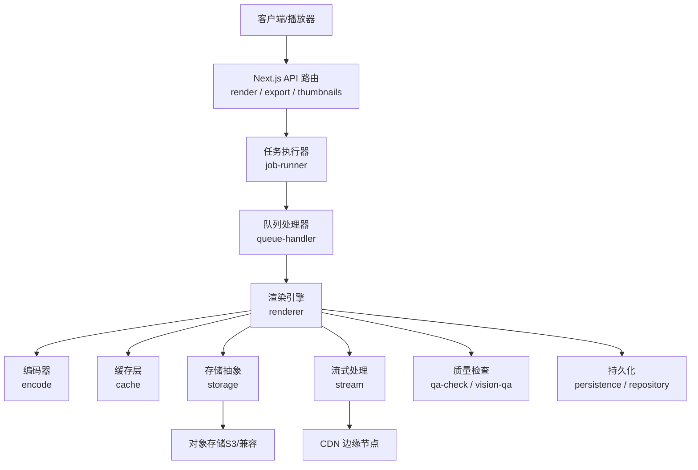
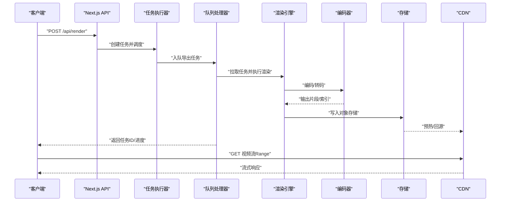
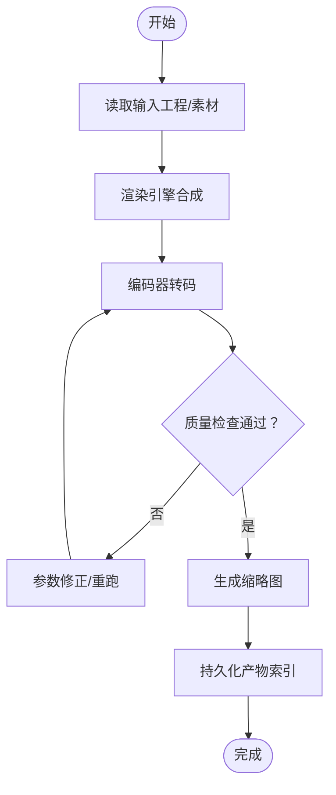
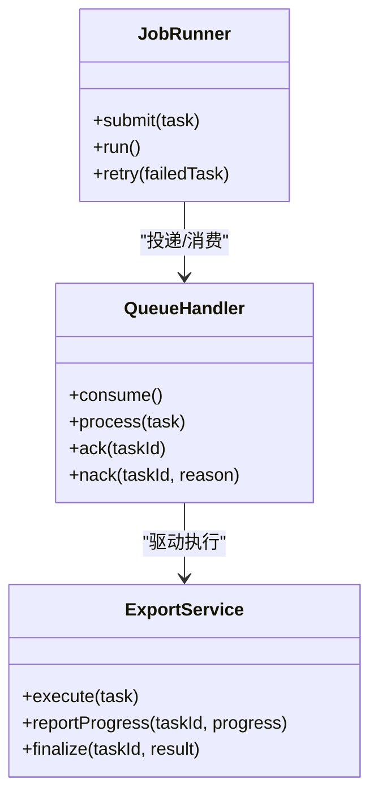
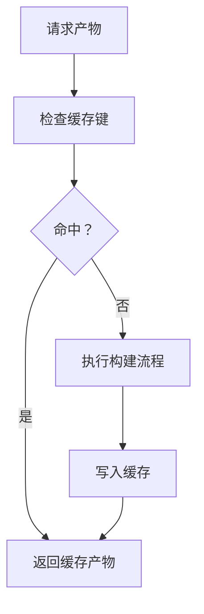
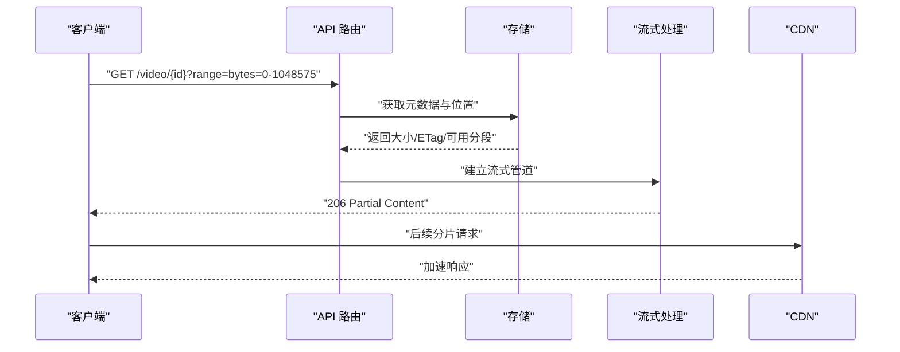
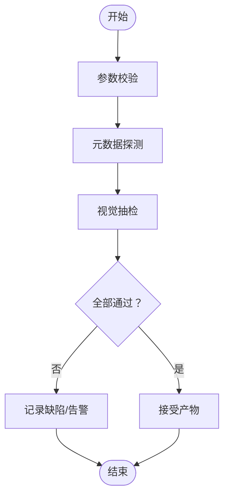
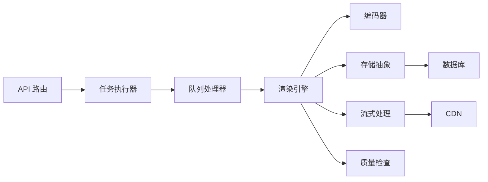

# 视频交付系统

<cite>
**本文引用的文件**   
- [server/src/index.ts](file://server/src/index.ts)
- [server/src/server/api.ts](file://server/src/server/api.ts)
- [server/src/server/job-runner.ts](file://server/src/server/job-runner.ts)
- [server/src/server/job-store.ts](file://server/src/server/job-store.ts)
- [src/features/render/renderer.ts](file://src/features/render/renderer.ts)
- [src/features/render/encode.ts](file://src/features/render/encode.ts)
- [src/features/render/export-service.ts](file://src/features/render/export-service.ts)
- [src/features/render/queue-handler.ts](file://src/features/render/queue-handler.ts)
- [src/features/render/cache.ts](file://src/features/render/cache.ts)
- [src/features/render/thumbnail.ts](file://src/features/render/thumbnail.ts)
- [src/features/render/qa-check.ts](file://src/features/render/qa-check.ts)
- [src/features/render/vision-qa.ts](file://src/features/render/vision-qa.ts)
- [src/features/render/persistence.ts](file://src/features/render/persistence.ts)
- [src/features/render/repository.ts](file://src/features/render/repository.ts)
- [src/app/api/render/route.ts](file://src/app/api/render/route.ts)
- [src/app/api/render/export/route.ts](file://src/app/api/render/export/route.ts)
- [src/app/api/render/thumbnails/route.ts](file://src/app/api/render/thumbnails/route.ts)
- [src/lib/storage/index.ts](file://src/lib/storage/index.ts)
- [src/lib/stream/index.ts](file://src/lib/stream/index.ts)
- [deploy/compose.yaml](file://deploy/compose.yaml)
- [deploy/env.example](file://deploy/env.example)
</cite>

## 目录
1. [简介](#简介)
2. [项目结构](#项目结构)
3. [核心组件](#核心组件)
4. [架构总览](#架构总览)
5. [详细组件分析](#详细组件分析)
6. [依赖关系分析](#依赖关系分析)
7. [性能考量](#性能考量)
8. [故障排查指南](#故障排查指南)
9. [结论](#结论)
10. [附录](#附录)

## 简介
本技术文档面向“视频交付系统”，围绕视频分发、下载优化、访问控制与安全、质量检查与质量保证、以及交付性能监控与用户访问分析等关键主题进行系统化说明。基于仓库中的渲染、导出、队列、存储与流式处理模块，文档给出端到端的数据流、组件职责与扩展建议，帮助读者快速理解并在此基础上进行二次开发与运维优化。

## 项目结构
本项目采用前后端分离与模块化组织：
- server 层提供 API、任务执行器与持久化接口
- src/features/render 负责渲染、编码、导出、缓存、缩略图与 QA
- src/lib/storage 与 src/lib/stream 提供存储与流式能力抽象
- app 层暴露 Next.js API 路由，作为对外入口
- deploy 提供容器编排与环境配置示例

图表来源
- [src/app/api/render/route.ts](file://src/app/api/render/route.ts)
- [src/app/api/render/export/route.ts](file://src/app/api/render/export/route.ts)
- [src/app/api/render/thumbnails/route.ts](file://src/app/api/render/thumbnails/route.ts)
- [server/src/server/job-runner.ts](file://server/src/server/job-runner.ts)
- [src/features/render/queue-handler.ts](file://src/features/render/queue-handler.ts)
- [src/features/render/renderer.ts](file://src/features/render/renderer.ts)
- [src/features/render/encode.ts](file://src/features/render/encode.ts)
- [src/features/render/cache.ts](file://src/features/render/cache.ts)
- [src/lib/storage/index.ts](file://src/lib/storage/index.ts)
- [src/lib/stream/index.ts](file://src/lib/stream/index.ts)
- [src/features/render/qa-check.ts](file://src/features/render/qa-check.ts)
- [src/features/render/vision-qa.ts](file://src/features/render/vision-qa.ts)
- [src/features/render/persistence.ts](file://src/features/render/persistence.ts)
- [src/features/render/repository.ts](file://src/features/render/repository.ts)

章节来源
- [server/src/index.ts](file://server/src/index.ts)
- [server/src/server/api.ts](file://server/src/server/api.ts)
- [deploy/compose.yaml](file://deploy/compose.yaml)
- [deploy/env.example](file://deploy/env.example)

## 核心组件
- 渲染与编码：将工程或素材渲染为可播放的视频，并进行多码率/格式转码
- 导出服务：封装导出流程，协调渲染、编码、QA 与结果落盘
- 队列处理器：异步消费导出任务，保障高并发与失败重试
- 缓存层：命中已生成产物，减少重复计算
- 存储抽象：对接对象存储，支持分片上传/下载
- 流式处理：实现断点续传、范围请求与边推边播
- 质量检查：编码参数校验、媒体元数据检测、视觉 QA
- 持久化与仓库：任务状态、产物索引与查询

章节来源
- [src/features/render/renderer.ts](file://src/features/render/renderer.ts)
- [src/features/render/encode.ts](file://src/features/render/encode.ts)
- [src/features/render/export-service.ts](file://src/features/render/export-service.ts)
- [src/features/render/queue-handler.ts](file://src/features/render/queue-handler.ts)
- [src/features/render/cache.ts](file://src/features/render/cache.ts)
- [src/lib/storage/index.ts](file://src/lib/storage/index.ts)
- [src/lib/stream/index.ts](file://src/lib/stream/index.ts)
- [src/features/render/qa-check.ts](file://src/features/render/qa-check.ts)
- [src/features/render/vision-qa.ts](file://src/features/render/vision-qa.ts)
- [src/features/render/persistence.ts](file://src/features/render/persistence.ts)
- [src/features/render/repository.ts](file://src/features/render/repository.ts)

## 架构总览
整体采用“API 路由 + 任务执行器 + 渲染队列 + 存储/CDN”的分层架构。客户端通过 API 发起渲染/导出请求，服务端入队后由工作进程消费，调用渲染与编码管线，产出视频与缩略图，并通过对象存储与 CDN 加速分发。

图表来源
- [src/app/api/render/route.ts](file://src/app/api/render/route.ts)
- [server/src/server/job-runner.ts](file://server/src/server/job-runner.ts)
- [src/features/render/queue-handler.ts](file://src/features/render/queue-handler.ts)
- [src/features/render/renderer.ts](file://src/features/render/renderer.ts)
- [src/features/render/encode.ts](file://src/features/render/encode.ts)
- [src/lib/storage/index.ts](file://src/lib/storage/index.ts)
- [src/lib/stream/index.ts](file://src/lib/stream/index.ts)

## 详细组件分析

### 渲染与编码管线
- 渲染引擎负责合成画面、时间线、字幕与音频轨道，输出中间帧序列或可编辑工程
- 编码器根据策略生成多码率/分辨率版本，并输出 HLS/DASH 索引与分片
- 导出服务串联渲染、编码、缩略图生成与 QA 步骤，统一异常与重试

图表来源
- [src/features/render/renderer.ts](file://src/features/render/renderer.ts)
- [src/features/render/encode.ts](file://src/features/render/encode.ts)
- [src/features/render/export-service.ts](file://src/features/render/export-service.ts)
- [src/features/render/thumbnail.ts](file://src/features/render/thumbnail.ts)
- [src/features/render/qa-check.ts](file://src/features/render/qa-check.ts)
- [src/features/render/vision-qa.ts](file://src/features/render/vision-qa.ts)
- [src/features/render/persistence.ts](file://src/features/render/persistence.ts)

章节来源
- [src/features/render/renderer.ts](file://src/features/render/renderer.ts)
- [src/features/render/encode.ts](file://src/features/render/encode.ts)
- [src/features/render/export-service.ts](file://src/features/render/export-service.ts)

### 队列与任务执行
- 任务执行器负责接收 API 请求，创建任务记录并投递到队列
- 队列处理器按并发度消费任务，执行渲染与编码，更新状态与指标
- 支持失败重试、超时控制与幂等性保证

图表来源
- [server/src/server/job-runner.ts](file://server/src/server/job-runner.ts)
- [src/features/render/queue-handler.ts](file://src/features/render/queue-handler.ts)
- [src/features/render/export-service.ts](file://src/features/render/export-service.ts)

章节来源
- [server/src/server/job-runner.ts](file://server/src/server/job-runner.ts)
- [src/features/render/queue-handler.ts](file://src/features/render/queue-handler.ts)
- [src/features/render/export-service.ts](file://src/features/render/export-service.ts)

### 缓存与缩略图
- 缓存层以任务特征为键，命中时直接返回产物，避免重复渲染与编码
- 缩略图在编码完成后抽取关键帧，用于列表预览与封面展示

图表来源
- [src/features/render/cache.ts](file://src/features/render/cache.ts)
- [src/features/render/thumbnail.ts](file://src/features/render/thumbnail.ts)

章节来源
- [src/features/render/cache.ts](file://src/features/render/cache.ts)
- [src/features/render/thumbnail.ts](file://src/features/render/thumbnail.ts)

### 存储与流式传输
- 存储抽象屏蔽底层差异，支持分片上传/下载、ETag 与条件请求
- 流式处理实现 Range 请求、断点续传与边推边播，降低首屏延迟

图表来源
- [src/lib/storage/index.ts](file://src/lib/storage/index.ts)
- [src/lib/stream/index.ts](file://src/lib/stream/index.ts)
- [src/app/api/render/route.ts](file://src/app/api/render/route.ts)

章节来源
- [src/lib/storage/index.ts](file://src/lib/storage/index.ts)
- [src/lib/stream/index.ts](file://src/lib/stream/index.ts)

### 质量检查与质量保证
- 编码参数验证：分辨率、码率、帧率、编解码器、声道数等约束检查
- 媒体元数据检测：时长、码率波动、黑场/静音检测
- 视觉 QA：抽样帧对比、色彩空间一致性、字幕可见性

图表来源
- [src/features/render/qa-check.ts](file://src/features/render/qa-check.ts)
- [src/features/render/vision-qa.ts](file://src/features/render/vision-qa.ts)

章节来源
- [src/features/render/qa-check.ts](file://src/features/render/qa-check.ts)
- [src/features/render/vision-qa.ts](file://src/features/render/vision-qa.ts)

### 持久化与仓库
- 持久化层负责任务状态、产物路径、指标与审计日志的落盘
- 仓库提供统一的查询与聚合接口，支撑前端面板与报表

章节来源
- [src/features/render/persistence.ts](file://src/features/render/persistence.ts)
- [src/features/render/repository.ts](file://src/features/render/repository.ts)

### API 路由与集成点
- /api/render：提交渲染任务，返回任务 ID 与初始状态
- /api/render/export：触发导出流程，支持批量与优先级
- /api/render/thumbnails：按需生成或获取缩略图

章节来源
- [src/app/api/render/route.ts](file://src/app/api/render/route.ts)
- [src/app/api/render/export/route.ts](file://src/app/api/render/export/route.ts)
- [src/app/api/render/thumbnails/route.ts](file://src/app/api/render/thumbnails/route.ts)

## 依赖关系分析
- 组件耦合
  - API 路由仅依赖任务执行器与导出服务，保持薄入口
  - 队列处理器与渲染/编码解耦，便于横向扩展
  - 存储与流式处理抽象化，替换底层实现不影响上层逻辑
- 外部依赖
  - 对象存储（S3/兼容）用于产物持久化
  - CDN 用于全球加速与边缘缓存
  - 数据库用于任务与产物元数据管理

图表来源
- [src/app/api/render/route.ts](file://src/app/api/render/route.ts)
- [server/src/server/job-runner.ts](file://server/src/server/job-runner.ts)
- [src/features/render/queue-handler.ts](file://src/features/render/queue-handler.ts)
- [src/features/render/renderer.ts](file://src/features/render/renderer.ts)
- [src/features/render/encode.ts](file://src/features/render/encode.ts)
- [src/lib/storage/index.ts](file://src/lib/storage/index.ts)
- [src/lib/stream/index.ts](file://src/lib/stream/index.ts)
- [src/features/render/qa-check.ts](file://src/features/render/qa-check.ts)

章节来源
- [deploy/compose.yaml](file://deploy/compose.yaml)
- [deploy/env.example](file://deploy/env.example)

## 性能考量
- CDN 集成与边缘缓存
  - 将 HLS/DASH 索引与分片部署至 CDN，启用 HTTP/2 与缓存策略
  - 针对热门内容预热，缩短冷启动延迟
- 下载优化
  - 断点续传：利用 Range 请求与分片下载，提升弱网稳定性
  - 多线程下载：客户端并行拉取分片，服务端无需额外支持
  - 格式自适应：根据带宽与设备特性选择合适码率与分辨率
- 编码与缓存
  - 多码率转码与关键帧对齐，提升切换流畅度
  - 任务级缓存键设计，避免重复渲染与编码
- 流式传输
  - 边推边播，降低首屏时间
  - 合理设置缓冲与预加载策略

[本节为通用指导，不直接分析具体文件]

## 故障排查指南
- 常见问题定位
  - 任务卡住：检查队列堆积、消费者健康与资源使用
  - 编码失败：核对编码参数、输入素材与依赖库版本
  - 播放异常：确认索引完整性、分片顺序与跨域策略
  - 缓存未命中：检查缓存键一致性与失效策略
- 诊断手段
  - 查看任务状态与错误日志
  - 抓取媒体元数据与网络请求
  - 复现 QA 报告与视觉抽检结果

章节来源
- [src/features/render/queue-handler.ts](file://src/features/render/queue-handler.ts)
- [src/features/render/encode.ts](file://src/features/render/encode.ts)
- [src/features/render/qa-check.ts](file://src/features/render/qa-check.ts)
- [src/features/render/vision-qa.ts](file://src/features/render/vision-qa.ts)
- [src/features/render/cache.ts](file://src/features/render/cache.ts)

## 结论
本系统通过清晰的模块化设计与可扩展的存储/流式抽象，实现了从渲染、编码到分发的完整视频交付链路。借助 CDN 与边缘缓存、断点续传与自适应码率等技术，可在全球范围内提供稳定高效的播放体验。结合完善的质量检查与监控能力，确保交付产物的一致性与可靠性。建议在后续迭代中持续优化缓存命中率、编码效率与监控指标覆盖，以满足更大规模与更严苛的业务需求。

[本节为总结性内容，不直接分析具体文件]

## 附录
- 部署与环境
  - 使用 compose 编排服务，环境变量集中管理
  - 对象存储与 CDN 接入参数通过环境变量注入
- 安全与访问控制
  - 签名 URL：对敏感资源生成带时效与权限的访问链接
  - IP 白名单：限制特定来源访问导出或管理接口
  - 防盗链：校验 Referer/Token，防止非法引用
- 监控与分析
  - 采集任务耗时、成功率、带宽与卡顿指标
  - 用户访问分析：地域、设备、码率选择分布与播放质量

章节来源
- [deploy/compose.yaml](file://deploy/compose.yaml)
- [deploy/env.example](file://deploy/env.example)