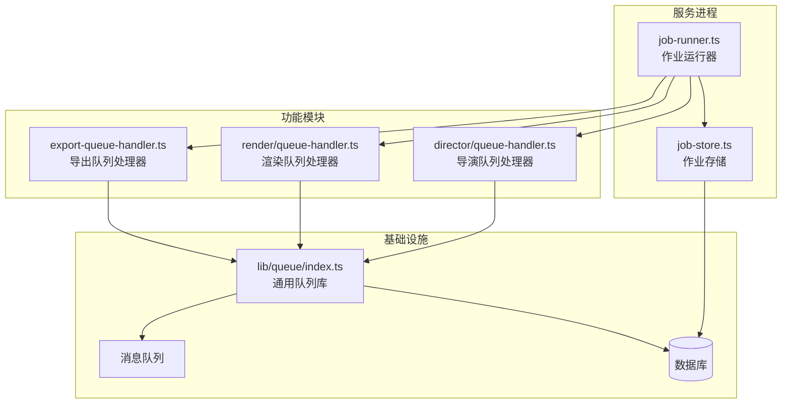
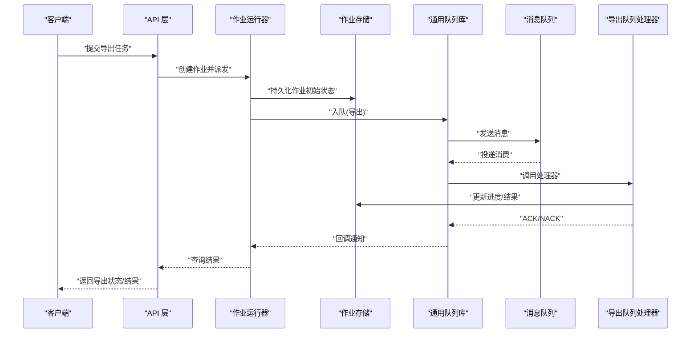
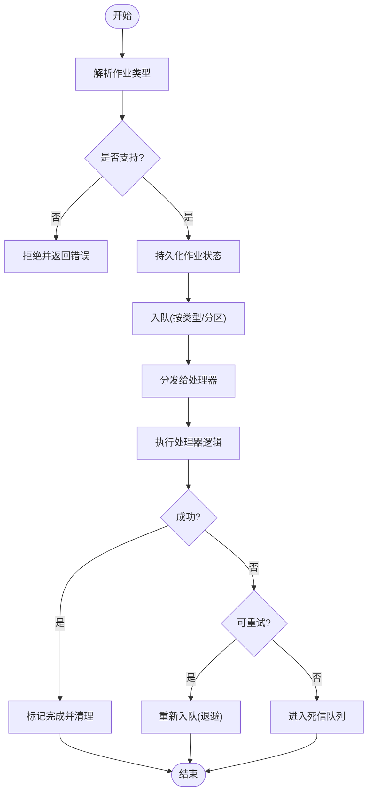
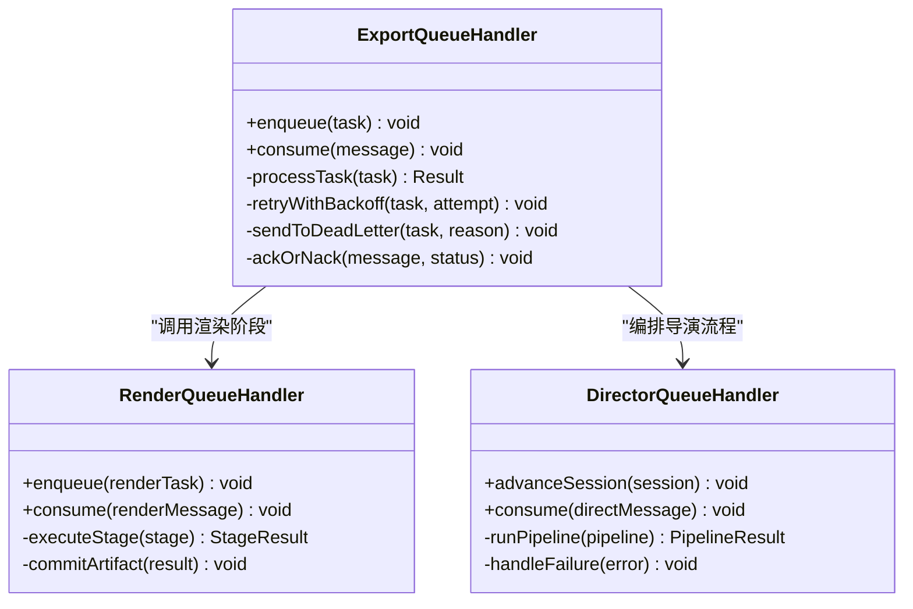
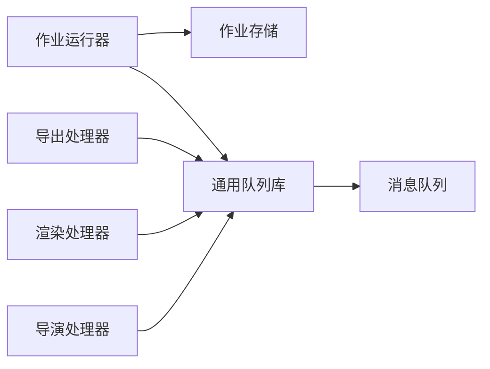

# 队列处理器

<cite>
**本文引用的文件**   
- [server/src/server/job-runner.ts](file://server/src/server/job-runner.ts)
- [server/src/server/job-store.ts](file://server/src/server/job-store.ts)
- [src/features/render/export-queue-handler.ts](file://src/features/render/export-queue-handler.ts)
- [src/features/render/queue-handler.ts](file://src/features/render/queue-handler.ts)
- [src/features/director/queue-handler.ts](file://src/features/director/queue-handler.ts)
- [src/lib/queue/index.ts](file://src/lib/queue/index.ts)
- [deploy/compose.yaml](file://deploy/compose.yaml)
- [deploy/env.example](file://deploy/env.example)
- [deploy/worker.env.example](file://deploy/worker.env.example)
- [docs/issues/ISSUE-004-queue-concurrency-lanes.md](file://docs/issues/ISSUE-004-queue-concurrency-lanes.md)
</cite>

## 目录
1. [简介](#简介)
2. [项目结构](#项目结构)
3. [核心组件](#核心组件)
4. [架构总览](#架构总览)
5. [详细组件分析](#详细组件分析)
6. [依赖关系分析](#依赖关系分析)
7. [性能考量](#性能考量)
8. [故障排查指南](#故障排查指南)
9. [结论](#结论)
10. [附录](#附录)

## 简介
本技术文档聚焦于“导出队列处理器”，系统性阐述队列系统的设计原理与实现细节，包括消息队列选型、分区策略与负载均衡机制；任务消费逻辑（并行处理、资源隔离、内存管理）；失败补偿机制（死信队列、重试策略、人工干预接口）；以及监控、性能调优与容量规划方法。同时提供常见问题的定位思路与解决方案，帮助读者快速理解并高效运维该队列子系统。

## 项目结构
围绕导出队列的相关代码主要分布在以下位置：
- 服务端作业调度与持久化：server/src/server/job-runner.ts、server/src/server/job-store.ts
- 渲染导出队列处理器：src/features/render/export-queue-handler.ts、src/features/render/queue-handler.ts
- 导演（Director）队列处理器：src/features/director/queue-handler.ts
- 通用队列库：src/lib/queue/index.ts
- 部署与环境配置：deploy/compose.yaml、deploy/env.example、deploy/worker.env.example
- 并发与通道设计问题记录：docs/issues/ISSUE-004-queue-concurrency-lanes.md

图表来源
- [server/src/server/job-runner.ts](file://server/src/server/job-runner.ts)
- [server/src/server/job-store.ts](file://server/src/server/job-store.ts)
- [src/features/render/export-queue-handler.ts](file://src/features/render/export-queue-handler.ts)
- [src/features/render/queue-handler.ts](file://src/features/render/queue-handler.ts)
- [src/features/director/queue-handler.ts](file://src/features/director/queue-handler.ts)
- [src/lib/queue/index.ts](file://src/lib/queue/index.ts)

章节来源
- [server/src/server/job-runner.ts](file://server/src/server/job-runner.ts)
- [server/src/server/job-store.ts](file://server/src/server/job-store.ts)
- [src/features/render/export-queue-handler.ts](file://src/features/render/export-queue-handler.ts)
- [src/features/render/queue-handler.ts](file://src/features/render/queue-handler.ts)
- [src/features/director/queue-handler.ts](file://src/features/director/queue-handler.ts)
- [src/lib/queue/index.ts](file://src/lib/queue/index.ts)
- [deploy/compose.yaml](file://deploy/compose.yaml)
- [deploy/env.example](file://deploy/env.example)
- [deploy/worker.env.example](file://deploy/worker.env.example)
- [docs/issues/ISSUE-004-queue-concurrency-lanes.md](file://docs/issues/ISSUE-004-queue-concurrency-lanes.md)

## 核心组件
- 作业运行器（Job Runner）：负责拉取作业、分发到具体处理器、协调生命周期与状态更新。
- 作业存储（Job Store）：提供作业的持久化能力，确保幂等与可恢复性。
- 导出队列处理器（Export Queue Handler）：将导出任务入队、消费与结果落盘，对接渲染流水线。
- 渲染队列处理器（Render Queue Handler）：封装渲染任务的执行与中间态管理。
- 导演队列处理器（Director Queue Handler）：编排导演流程中的子任务，保证阶段推进与回滚。
- 通用队列库（Queue Library）：抽象出消息队列的接入、分区、重试、ACK/NACK 等通用能力。

章节来源
- [server/src/server/job-runner.ts](file://server/src/server/job-runner.ts)
- [server/src/server/job-store.ts](file://server/src/server/job-store.ts)
- [src/features/render/export-queue-handler.ts](file://src/features/render/export-queue-handler.ts)
- [src/features/render/queue-handler.ts](file://src/features/render/queue-handler.ts)
- [src/features/director/queue-handler.ts](file://src/features/director/queue-handler.ts)
- [src/lib/queue/index.ts](file://src/lib/queue/index.ts)

## 架构总览
整体采用“作业运行器 + 多处理器 + 通用队列库”的分层架构。作业运行器作为统一入口，按类型路由至对应处理器；处理器通过通用队列库与外部消息队列交互，完成入队、消费、重试与确认；作业存储保障状态一致性与可恢复性。

图表来源
- [server/src/server/job-runner.ts](file://server/src/server/job-runner.ts)
- [server/src/server/job-store.ts](file://server/src/server/job-store.ts)
- [src/lib/queue/index.ts](file://src/lib/queue/index.ts)
- [src/features/render/export-queue-handler.ts](file://src/features/render/export-queue-handler.ts)

## 详细组件分析

### 作业运行器（Job Runner）
- 职责：统一接收作业请求，解析类型，选择处理器，维护作业生命周期（创建、运行、完成、失败）。
- 并发控制：基于通道（lane）或优先级队列限制并发度，避免资源争用。
- 错误处理：捕获异常，记录日志，触发重试或进入死信队列。
- 集成点：与作业存储和通用队列库协作，确保状态与消息一致性。

图表来源
- [server/src/server/job-runner.ts](file://server/src/server/job-runner.ts)
- [server/src/server/job-store.ts](file://server/src/server/job-store.ts)

章节来源
- [server/src/server/job-runner.ts](file://server/src/server/job-runner.ts)
- [server/src/server/job-store.ts](file://server/src/server/job-store.ts)

### 作业存储（Job Store）
- 职责：作业元数据与状态的持久化，支持幂等写入、版本控制与快照。
- 事务性：在关键路径使用事务保证状态一致性。
- 查询优化：为常用查询建立索引，提升状态检索效率。
- 扩展性：支持水平扩展与读写分离（视底层存储能力）。

章节来源
- [server/src/server/job-store.ts](file://server/src/server/job-store.ts)

### 导出队列处理器（Export Queue Handler）
- 职责：消费导出任务，驱动渲染与合成，产出最终导出结果。
- 并行策略：按项目/片段进行分区，避免跨任务竞争；同一分区内串行，不同分区并行。
- 资源隔离：通过进程/线程池隔离不同导出的计算资源，防止相互影响。
- 内存管理：流式处理大文件，限制单任务内存峰值，及时释放中间产物。
- 失败补偿：支持指数退避重试；不可重试任务进入死信队列并提供人工干预接口。

图表来源
- [src/features/render/export-queue-handler.ts](file://src/features/render/export-queue-handler.ts)
- [src/features/render/queue-handler.ts](file://src/features/render/queue-handler.ts)
- [src/features/director/queue-handler.ts](file://src/features/director/queue-handler.ts)

章节来源
- [src/features/render/export-queue-handler.ts](file://src/features/render/export-queue-handler.ts)
- [src/features/render/queue-handler.ts](file://src/features/render/queue-handler.ts)
- [src/features/director/queue-handler.ts](file://src/features/director/queue-handler.ts)

### 通用队列库（Queue Library）
- 抽象能力：统一入队、消费、ACK/NACK、重试、分区、负载均衡等接口。
- 分区策略：按业务键（如 project_id、shot_id）哈希分区，保证同键顺序性。
- 负载均衡：消费者组内轮询或最少连接分配，避免热点。
- 可靠性：至少一次语义，结合幂等处理与去重表，避免重复执行。

章节来源
- [src/lib/queue/index.ts](file://src/lib/queue/index.ts)

## 依赖关系分析
- 作业运行器依赖作业存储与通用队列库，解耦了具体处理器实现。
- 各处理器依赖通用队列库，屏蔽底层消息队列差异。
- 部署层面通过容器编排扩展消费者实例，实现横向扩容。

图表来源
- [server/src/server/job-runner.ts](file://server/src/server/job-runner.ts)
- [server/src/server/job-store.ts](file://server/src/server/job-store.ts)
- [src/lib/queue/index.ts](file://src/lib/queue/index.ts)
- [src/features/render/export-queue-handler.ts](file://src/features/render/export-queue-handler.ts)
- [src/features/render/queue-handler.ts](file://src/features/render/queue-handler.ts)
- [src/features/director/queue-handler.ts](file://src/features/director/queue-handler.ts)

章节来源
- [server/src/server/job-runner.ts](file://server/src/server/job-runner.ts)
- [server/src/server/job-store.ts](file://server/src/server/job-store.ts)
- [src/lib/queue/index.ts](file://src/lib/queue/index.ts)
- [src/features/render/export-queue-handler.ts](file://src/features/render/export-queue-handler.ts)
- [src/features/render/queue-handler.ts](file://src/features/render/queue-handler.ts)
- [src/features/director/queue-handler.ts](file://src/features/director/queue-handler.ts)

## 性能考量
- 并发与通道：合理设置通道数量与每通道并发度，避免过度竞争导致抖动。
- 分区与热点：按业务键分区，识别热点分区并进行局部扩容或限流。
- 背压与限流：在入队与消费两端实施背压，防止突发流量打垮下游。
- 资源隔离：CPU/内存配额与隔离，避免长尾任务拖慢整体吞吐。
- 存储与IO：批量写入与异步落盘，减少锁竞争与磁盘压力。
- 监控指标：队列长度、消费延迟、重试率、死信数、错误码分布、资源利用率。

章节来源
- [docs/issues/ISSUE-004-queue-concurrency-lanes.md](file://docs/issues/ISSUE-004-queue-concurrency-lanes.md)

## 故障排查指南
- 常见问题
  - 任务堆积：检查消费者实例数、通道并发、分区数与下游处理能力。
  - 频繁重试：定位异常原因，调整重试策略与退避参数，必要时降级。
  - 死信队列增长：分析失败原因，补充补偿逻辑或人工干预流程。
  - 内存溢出：优化流式处理，限制中间产物大小，增加堆内存或拆分任务。
  - 热点分区：对热点键做二次分区或引入本地缓存与预计算。
- 排查步骤
  - 查看队列监控指标与日志，定位瓶颈环节。
  - 检查作业存储状态与事务日志，确认一致性。
  - 验证消费者健康度与资源占用，必要时重启或扩容。
  - 复现问题并采集现场数据，制定修复方案。
- 人工干预接口
  - 提供重试、跳过、替换参数、强制完成等能力，便于快速恢复。

章节来源
- [server/src/server/job-runner.ts](file://server/src/server/job-runner.ts)
- [server/src/server/job-store.ts](file://server/src/server/job-store.ts)
- [src/lib/queue/index.ts](file://src/lib/queue/index.ts)
- [src/features/render/export-queue-handler.ts](file://src/features/render/export-queue-handler.ts)

## 结论
导出队列处理器以“作业运行器 + 处理器 + 通用队列库”的分层架构为核心，通过分区与负载均衡实现高吞吐与低延迟，借助重试与死信机制保障可靠性。配合完善的监控与容量规划，可在复杂业务场景下稳定运行。建议持续优化通道策略、资源隔离与内存管理，完善人工干预流程，提升整体鲁棒性与可运维性。

## 附录
- 部署与环境
  - 容器编排：通过 compose 定义服务与扩缩容策略。
  - 环境变量：区分主服务与 worker 的环境变量，确保队列与存储配置正确。
- 参考文档
  - 并发与通道设计问题记录，指导通道数量与并发度调优。

章节来源
- [deploy/compose.yaml](file://deploy/compose.yaml)
- [deploy/env.example](file://deploy/env.example)
- [deploy/worker.env.example](file://deploy/worker.env.example)
- [docs/issues/ISSUE-004-queue-concurrency-lanes.md](file://docs/issues/ISSUE-004-queue-concurrency-lanes.md)