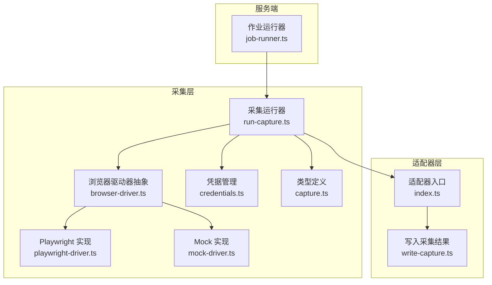
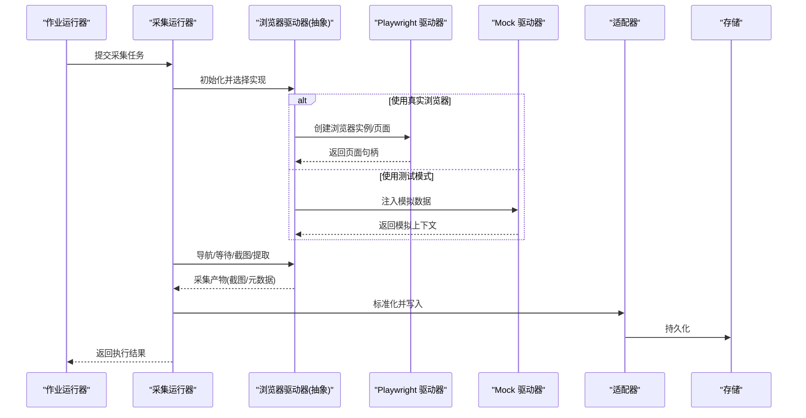
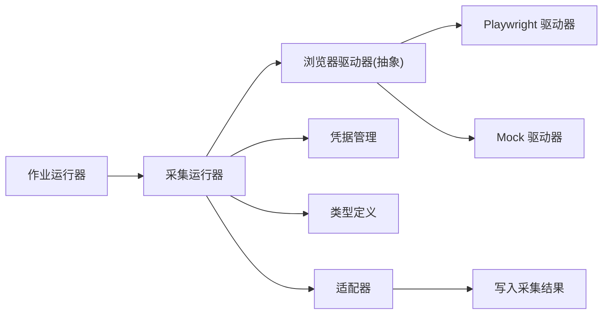

# 浏览器自动化

<cite>
**本文引用的文件**   
- [server/src/capture/browser-driver.ts](file://server/src/capture/browser-driver.ts)
- [server/src/capture/playwright-driver.ts](file://server/src/capture/playwright-driver.ts)
- [server/src/capture/mock-driver.ts](file://server/src/capture/mock-driver.ts)
- [server/src/capture/run-capture.ts](file://server/src/capture/run-capture.ts)
- [server/src/capture/credentials.ts](file://server/src/capture/credentials.ts)
- [server/src/types/capture.ts](file://server/src/types/capture.ts)
- [server/src/adapter/index.ts](file://server/src/adapter/index.ts)
- [server/src/adapter/write-capture.ts](file://server/src/adapter/write-capture.ts)
- [server/src/server/job-runner.ts](file://server/src/server/job-runner.ts)
- [server/src/lib/logger.ts](file://server/src/lib/logger.ts)
</cite>

## 目录
1. [简介](#简介)
2. [项目结构](#项目结构)
3. [核心组件](#核心组件)
4. [架构总览](#架构总览)
5. [详细组件分析](#详细组件分析)
6. [依赖关系分析](#依赖关系分析)
7. [性能与内存优化](#性能与内存优化)
8. [故障排查指南](#故障排查指南)
9. [结论](#结论)
10. [附录：扩展自定义浏览器驱动器](#附录：扩展自定义浏览器驱动器)

## 简介
本技术文档聚焦 PurpleInk 的浏览器自动化子系统，围绕 Playwright 驱动器的架构设计与实现进行深入解析。内容涵盖：
- 浏览器实例管理、页面生命周期控制与资源加载优化
- 渲染流程中的自动化策略（无头模式、视口设置、截图捕获）
- Mock 驱动器的测试支持与模拟数据注入
- 性能优化、内存管理与错误处理策略
- 自定义浏览器驱动器的扩展接口与集成指南

该子系统通过统一的“浏览器驱动器”抽象，将真实浏览器执行与测试环境解耦，确保在稳定、可观测、可扩展的前提下完成网页抓取、截图与元数据采集等任务。

## 项目结构
浏览器自动化相关代码集中在 server 子工程中，关键目录与职责如下：
- capture：浏览器驱动、运行编排、凭据与类型定义
- adapter：采集产物适配与写入
- server：作业调度与执行入口
- lib：日志与通用工具

图表来源
- [server/src/server/job-runner.ts](file://server/src/server/job-runner.ts)
- [server/src/capture/run-capture.ts](file://server/src/capture/run-capture.ts)
- [server/src/capture/browser-driver.ts](file://server/src/capture/browser-driver.ts)
- [server/src/capture/playwright-driver.ts](file://server/src/capture/playwright-driver.ts)
- [server/src/capture/mock-driver.ts](file://server/src/capture/mock-driver.ts)
- [server/src/capture/credentials.ts](file://server/src/capture/credentials.ts)
- [server/src/types/capture.ts](file://server/src/types/capture.ts)
- [server/src/adapter/index.ts](file://server/src/adapter/index.ts)
- [server/src/adapter/write-capture.ts](file://server/src/adapter/write-capture.ts)

章节来源
- [server/src/capture/run-capture.ts](file://server/src/capture/run-capture.ts)
- [server/src/capture/browser-driver.ts](file://server/src/capture/browser-driver.ts)
- [server/src/capture/playwright-driver.ts](file://server/src/capture/playwright-driver.ts)
- [server/src/capture/mock-driver.ts](file://server/src/capture/mock-driver.ts)
- [server/src/capture/credentials.ts](file://server/src/capture/credentials.ts)
- [server/src/types/capture.ts](file://server/src/types/capture.ts)
- [server/src/adapter/index.ts](file://server/src/adapter/index.ts)
- [server/src/adapter/write-capture.ts](file://server/src/adapter/write-capture.ts)
- [server/src/server/job-runner.ts](file://server/src/server/job-runner.ts)

## 核心组件
- 浏览器驱动器抽象（BrowserDriver）：定义统一接口，屏蔽具体实现差异，提供页面打开、导航、截图、关闭等能力。
- Playwright 驱动器（PlaywrightDriver）：基于 Playwright 的真实浏览器实现，负责实例管理、页面生命周期、网络拦截、截图与元数据收集。
- Mock 驱动器（MockDriver）：面向测试的轻量实现，支持注入模拟数据、跳过真实渲染，提升测试稳定性与速度。
- 采集运行器（RunCapture）：编排一次完整的采集任务，协调凭据、驱动器、适配器与日志记录。
- 凭据管理（Credentials）：安全地获取与传递认证信息，避免硬编码。
- 类型定义（capture.ts）：集中定义采集输入输出、配置项与状态枚举，保证契约一致性。
- 适配器（Adapter）：将采集产物标准化并持久化到存储。

章节来源
- [server/src/capture/browser-driver.ts](file://server/src/capture/browser-driver.ts)
- [server/src/capture/playwright-driver.ts](file://server/src/capture/playwright-driver.ts)
- [server/src/capture/mock-driver.ts](file://server/src/capture/mock-driver.ts)
- [server/src/capture/run-capture.ts](file://server/src/capture/run-capture.ts)
- [server/src/capture/credentials.ts](file://server/src/capture/credentials.ts)
- [server/src/types/capture.ts](file://server/src/types/capture.ts)
- [server/src/adapter/index.ts](file://server/src/adapter/index.ts)
- [server/src/adapter/write-capture.ts](file://server/src/adapter/write-capture.ts)

## 架构总览
下图展示从作业调度到采集落盘的端到端流程，以及驱动器选择与适配器写入的关键路径。

图表来源
- [server/src/server/job-runner.ts](file://server/src/server/job-runner.ts)
- [server/src/capture/run-capture.ts](file://server/src/capture/run-capture.ts)
- [server/src/capture/browser-driver.ts](file://server/src/capture/browser-driver.ts)
- [server/src/capture/playwright-driver.ts](file://server/src/capture/playwright-driver.ts)
- [server/src/capture/mock-driver.ts](file://server/src/capture/mock-driver.ts)
- [server/src/adapter/index.ts](file://server/src/adapter/index.ts)
- [server/src/adapter/write-capture.ts](file://server/src/adapter/write-capture.ts)

## 详细组件分析

### 浏览器驱动器抽象（BrowserDriver）
- 设计目标：为不同后端（Playwright/Mock）提供一致的能力边界，便于替换与扩展。
- 关键职责：
  - 初始化与销毁：统一管理浏览器实例的生命周期，避免资源泄漏。
  - 页面操作：打开 URL、等待加载、执行脚本、滚动、截图等。
  - 配置注入：无头模式、视口尺寸、网络拦截、超时与重试策略。
  - 错误处理：统一异常封装与降级策略。
- 扩展点：新增其他浏览器引擎时，仅需实现相同接口即可无缝接入。

章节来源
- [server/src/capture/browser-driver.ts](file://server/src/capture/browser-driver.ts)

### Playwright 驱动器（PlaywrightDriver）
- 浏览器实例管理：
  - 单例或池化管理，减少启动开销；合理设置并发与队列，避免 OOM。
  - 进程隔离与重启策略，增强鲁棒性。
- 页面生命周期控制：
  - 按需创建页面，复用会话；监听页面事件（导航、加载、错误）。
  - 超时与重试机制，保障弱网与动态渲染场景下的稳定性。
- 资源加载优化：
  - 禁用非必要资源（字体、图片、视频），降低带宽与内存占用。
  - 网络拦截与缓存策略，加速重复访问。
- 截图与元数据：
  - 支持全页/可视区域截图，延迟等待与滚动策略，确保渲染完整。
  - 采集 DOM 快照、性能指标与错误日志，辅助诊断。
- 无头模式与视口：
  - 默认无头模式，支持切换有头模式用于调试。
  - 根据目标设备或业务需求设置视口尺寸与像素比。

章节来源
- [server/src/capture/playwright-driver.ts](file://server/src/capture/playwright-driver.ts)

### Mock 驱动器（MockDriver）
- 测试支持：
  - 无需真实浏览器，快速执行用例，提高 CI 速度与稳定性。
  - 支持注入 HTML、JSON、截图与元数据，覆盖多种断言场景。
- 模拟数据注入：
  - 通过配置注入页面内容、网络响应、用户交互事件。
  - 支持条件分支与随机种子，保证可重复性与确定性。
- 与真实驱动器的对齐：
  - 暴露与 Playwright 一致的 API，便于在测试与生产间切换。

章节来源
- [server/src/capture/mock-driver.ts](file://server/src/capture/mock-driver.ts)

### 采集运行器（RunCapture）
- 任务编排：
  - 解析输入参数，校验配置，选择驱动器实现。
  - 协调凭据、适配器、日志与监控。
- 执行流程：
  - 初始化驱动器 -> 导航与等待 -> 截图与提取 -> 适配器写入 -> 清理资源。
- 错误与重试：
  - 捕获异常，分类上报，支持重试与回退策略。
- 可观测性：
  - 结构化日志、耗时统计与关键指标上报。

章节来源
- [server/src/capture/run-capture.ts](file://server/src/capture/run-capture.ts)

### 凭据管理（Credentials）
- 安全获取：
  - 从环境变量或密钥管理服务读取敏感信息。
  - 最小权限原则，按需解密与缓存。
- 作用域与过期：
  - 支持短期令牌与自动续期，避免长期驻留。
- 错误处理：
  - 缺失或无效凭据时快速失败，明确提示。

章节来源
- [server/src/capture/credentials.ts](file://server/src/capture/credentials.ts)

### 类型定义（capture.ts）
- 输入模型：
  - URL、视口、超时、截图选项、网络拦截规则等。
- 输出模型：
  - 截图路径、元数据、性能指标、错误信息。
- 状态枚举：
  - 任务状态、截图格式、驱动器类型等。

章节来源
- [server/src/types/capture.ts](file://server/src/types/capture.ts)

### 适配器（Adapter）
- 标准化：
  - 将不同驱动器的产物统一为内部模型。
- 写入：
  - 支持本地文件系统、对象存储或数据库。
- 幂等与校验：
  - 写入前校验完整性，支持去重与回滚。

章节来源
- [server/src/adapter/index.ts](file://server/src/adapter/index.ts)
- [server/src/adapter/write-capture.ts](file://server/src/adapter/write-capture.ts)

### 作业运行器（JobRunner）
- 调度：
  - 接收上层服务提交的采集作业，分配执行槽位。
- 监控：
  - 跟踪作业状态、进度与资源消耗。
- 容错：
  - 失败重试、告警与人工介入通道。

章节来源
- [server/src/server/job-runner.ts](file://server/src/server/job-runner.ts)

## 依赖关系分析
- 低耦合高内聚：
  - 驱动器抽象与实现分离，适配器与存储解耦。
- 外部依赖：
  - Playwright 作为浏览器引擎，需关注版本兼容与二进制安装。
- 潜在循环依赖：
  - 通过类型与接口约束避免循环引用。
- 集成点：
  - 作业系统、存储服务、监控系统与日志系统。

图表来源
- [server/src/server/job-runner.ts](file://server/src/server/job-runner.ts)
- [server/src/capture/run-capture.ts](file://server/src/capture/run-capture.ts)
- [server/src/capture/browser-driver.ts](file://server/src/capture/browser-driver.ts)
- [server/src/capture/playwright-driver.ts](file://server/src/capture/playwright-driver.ts)
- [server/src/capture/mock-driver.ts](file://server/src/capture/mock-driver.ts)
- [server/src/capture/credentials.ts](file://server/src/capture/credentials.ts)
- [server/src/types/capture.ts](file://server/src/types/capture.ts)
- [server/src/adapter/index.ts](file://server/src/adapter/index.ts)
- [server/src/adapter/write-capture.ts](file://server/src/adapter/write-capture.ts)

章节来源
- [server/src/server/job-runner.ts](file://server/src/server/job-runner.ts)
- [server/src/capture/run-capture.ts](file://server/src/capture/run-capture.ts)
- [server/src/capture/browser-driver.ts](file://server/src/capture/browser-driver.ts)
- [server/src/capture/playwright-driver.ts](file://server/src/capture/playwright-driver.ts)
- [server/src/capture/mock-driver.ts](file://server/src/capture/mock-driver.ts)
- [server/src/capture/credentials.ts](file://server/src/capture/credentials.ts)
- [server/src/types/capture.ts](file://server/src/types/capture.ts)
- [server/src/adapter/index.ts](file://server/src/adapter/index.ts)
- [server/src/adapter/write-capture.ts](file://server/src/adapter/write-capture.ts)

## 性能与内存优化
- 浏览器实例管理
  - 使用实例池与连接复用，减少启动与握手开销。
  - 限制并发度，结合队列与背压控制，防止资源争用。
- 页面与资源优化
  - 禁用不必要资源（媒体、字体、第三方脚本），启用 HTTP 缓存。
  - 使用网络拦截替换慢依赖，缩短首屏时间。
- 截图与渲染
  - 选择合适的截图时机（DOM 就绪、网络空闲、动画结束）。
  - 分块渲染与懒加载，避免一次性大对象导致 OOM。
- 内存管理
  - 及时释放页面与上下文，避免句柄泄漏。
  - 定期回收与重启长驻进程，降低碎片化。
- 错误与重试
  - 区分瞬时错误与永久错误，采用指数退避与熔断。
  - 记录关键指标（CPU、内存、网络）辅助定位瓶颈。

[本节为通用指导，不直接分析具体文件]

## 故障排查指南
- 常见问题
  - 浏览器无法启动：检查环境变量、权限与依赖库。
  - 页面加载超时：调整超时阈值，检查网络与依赖服务。
  - 截图不完整：增加等待时间，确认懒加载与滚动逻辑。
  - 内存溢出：降低并发，限制资源大小，启用垃圾回收。
- 诊断手段
  - 开启有头模式与调试端口，观察渲染过程。
  - 采集性能指标与错误堆栈，定位热点路径。
  - 使用 Mock 驱动器隔离问题，逐步还原真实环境。
- 日志与监控
  - 结构化日志记录关键步骤与异常。
  - 指标上报至监控系统，设置告警阈值。

章节来源
- [server/src/lib/logger.ts](file://server/src/lib/logger.ts)

## 结论
PurpleInk 的浏览器自动化子系统以“驱动器抽象 + 多实现”为核心，实现了稳定高效的网页采集与截图能力。通过合理的实例管理、页面生命周期控制与资源优化策略，系统在性能与可靠性之间取得平衡。Mock 驱动器为测试提供了快速、稳定的支撑。未来可通过扩展更多浏览器引擎与增强可观测性，进一步提升系统的灵活性与可维护性。

[本节为总结性内容，不直接分析具体文件]

## 附录：扩展自定义浏览器驱动器
- 扩展步骤
  - 实现浏览器驱动器抽象接口，提供一致的页面操作与截图能力。
  - 注册新驱动器到运行器，支持按配置选择实现。
  - 在适配器中处理新驱动器的产物格式。
- 最佳实践
  - 保持与 Playwright 行为的一致性，便于迁移与对比。
  - 完善错误处理与日志，确保可观测性。
  - 编写单元测试与集成测试，覆盖关键路径。
- 集成要点
  - 与凭据管理、作业调度与存储适配器对接。
  - 遵循类型定义，确保契约稳定。

章节来源
- [server/src/capture/browser-driver.ts](file://server/src/capture/browser-driver.ts)
- [server/src/capture/playwright-driver.ts](file://server/src/capture/playwright-driver.ts)
- [server/src/capture/mock-driver.ts](file://server/src/capture/mock-driver.ts)
- [server/src/capture/run-capture.ts](file://server/src/capture/run-capture.ts)
- [server/src/adapter/index.ts](file://server/src/adapter/index.ts)
- [server/src/adapter/write-capture.ts](file://server/src/adapter/write-capture.ts)
- [server/src/types/capture.ts](file://server/src/types/capture.ts)