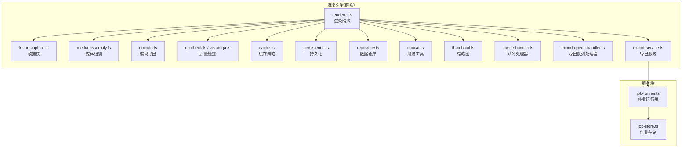
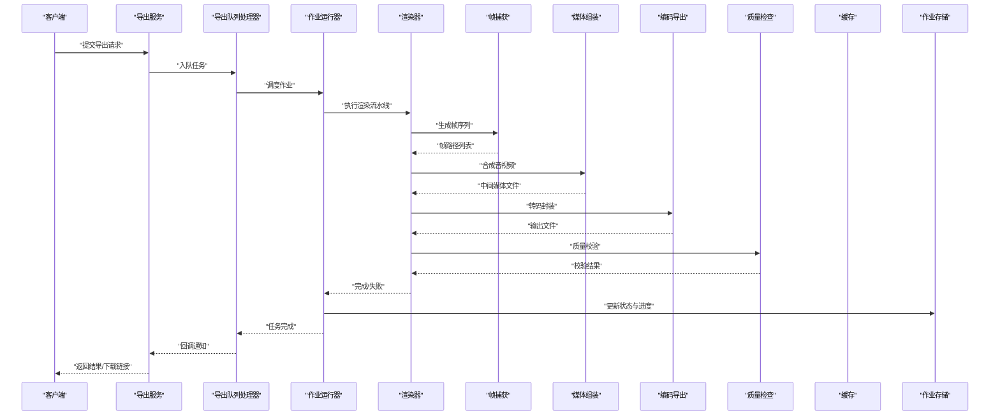
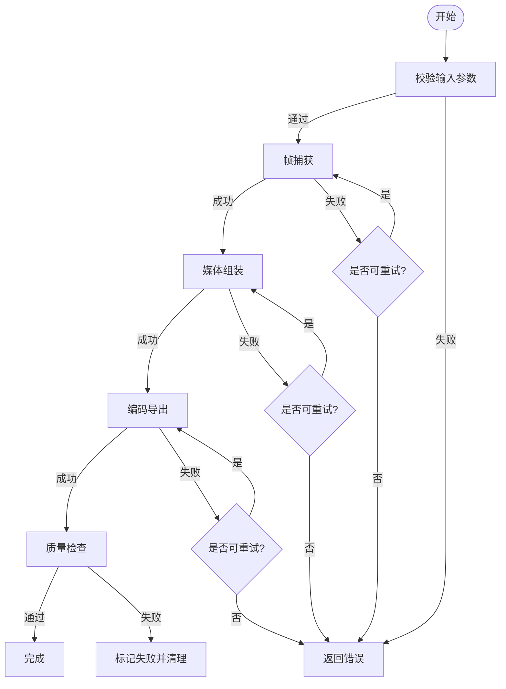
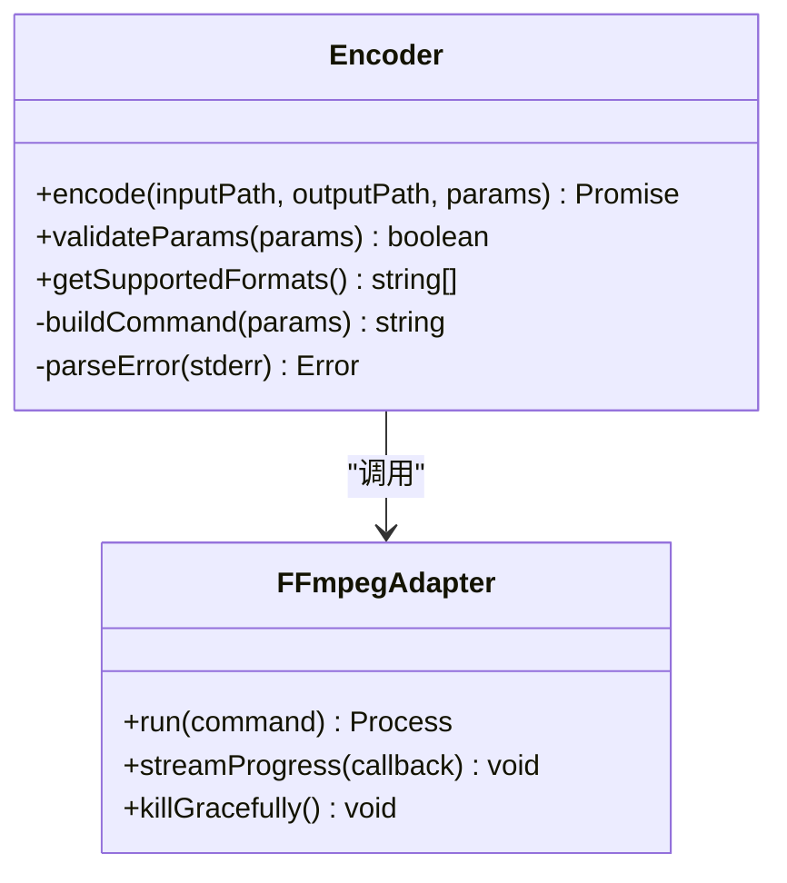
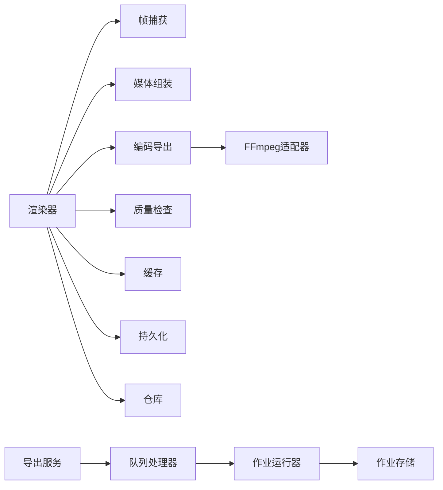

# 渲染引擎

<cite>
**本文引用的文件**   
- [src/features/render/renderer.ts](file://src/features/render/renderer.ts)
- [src/features/render/frame-capture.ts](file://src/features/render/frame-capture.ts)
- [src/features/render/media-assembly.ts](file://src/features/render/media-assembly.ts)
- [src/features/render/encode.ts](file://src/features/render/encode.ts)
- [src/features/render/media-ffmpeg.test.ts](file://src/features/render/media-ffmpeg.test.ts)
- [src/features/render/export-service.ts](file://src/features/render/export-service.ts)
- [src/features/render/export-queue-handler.ts](file://src/features/render/export-queue-handler.ts)
- [src/features/render/qa-check.ts](file://src/features/render/qa-check.ts)
- [src/features/render/vision-qa.ts](file://src/features/render/vision-qa.ts)
- [src/features/render/cache.ts](file://src/features/render/cache.ts)
- [src/features/render/persistence.ts](file://src/features/render/persistence.ts)
- [src/features/render/repository.ts](file://src/features/render/repository.ts)
- [src/features/render/concat.ts](file://src/features/render/concat.ts)
- [src/features/render/thumbnail.ts](file://src/features/render/thumbnail.ts)
- [src/features/render/queue-handler.ts](file://src/features/render/queue-handler.ts)
- [server/src/server/job-runner.ts](file://server/src/server/job-runner.ts)
- [server/src/server/job-store.ts](file://server/src/server/job-store.ts)
</cite>

## 目录
1. [简介](#简介)
2. [项目结构](#项目结构)
3. [核心组件](#核心组件)
4. [架构总览](#架构总览)
5. [详细组件分析](#详细组件分析)
6. [依赖关系分析](#依赖关系分析)
7. [性能考虑](#性能考虑)
8. [故障排除指南](#故障排除指南)
9. [结论](#结论)
10. [附录](#附录)

## 简介
本文件面向PurpleInk渲染引擎，系统性阐述其渲染流水线设计、FFmpeg集成、媒体文件管理、质量控制机制与批处理能力。内容覆盖帧捕获、媒体组装、编码导出等关键流程，并提供性能调优与故障排除建议，帮助读者快速理解并高效使用渲染子系统。

## 项目结构
渲染引擎位于前端特性模块中，围绕“渲染器”组织，包含帧捕获、媒体组装、编码、质量检查、缓存与持久化、队列处理等能力；服务端提供作业运行器与存储抽象，支撑异步任务执行与状态管理。

图表来源
- [src/features/render/renderer.ts](file://src/features/render/renderer.ts)
- [src/features/render/frame-capture.ts](file://src/features/render/frame-capture.ts)
- [src/features/render/media-assembly.ts](file://src/features/render/media-assembly.ts)
- [src/features/render/encode.ts](file://src/features/render/encode.ts)
- [src/features/render/qa-check.ts](file://src/features/render/qa-check.ts)
- [src/features/render/vision-qa.ts](file://src/features/render/vision-qa.ts)
- [src/features/render/cache.ts](file://src/features/render/cache.ts)
- [src/features/render/persistence.ts](file://src/features/render/persistence.ts)
- [src/features/render/repository.ts](file://src/features/render/repository.ts)
- [src/features/render/concat.ts](file://src/features/render/concat.ts)
- [src/features/render/thumbnail.ts](file://src/features/render/thumbnail.ts)
- [src/features/render/queue-handler.ts](file://src/features/render/queue-handler.ts)
- [src/features/render/export-queue-handler.ts](file://src/features/render/export-queue-handler.ts)
- [src/features/render/export-service.ts](file://src/features/render/export-service.ts)
- [server/src/server/job-runner.ts](file://server/src/server/job-runner.ts)
- [server/src/server/job-store.ts](file://server/src/server/job-store.ts)

章节来源
- [src/features/render/renderer.ts](file://src/features/render/renderer.ts)
- [server/src/server/job-runner.ts](file://server/src/server/job-runner.ts)
- [server/src/server/job-store.ts](file://server/src/server/job-store.ts)

## 核心组件
- 渲染编排(renderer.ts)：定义渲染阶段、调度顺序、错误恢复与进度上报。
- 帧捕获(frame-capture.ts)：将画布或页面渲染为图像序列，支持分辨率、帧率、采样策略。
- 媒体组装(media-assembly.ts)：合并图像序列与音轨，生成中间媒体文件，处理时间轴对齐。
- 编码导出(encode.ts)：调用FFmpeg进行转码封装，输出目标格式与质量参数。
- 质量检查(qa-check.ts, vision-qa.ts)：视觉与音频校验，包括黑帧检测、音量阈值、格式合规性。
- 缓存(cache.ts)：基于键的中间产物缓存，避免重复计算。
- 持久化(persistence.ts)：渲染工件与元数据的落盘与读取。
- 仓库(repository.ts)：统一访问渲染相关数据（如片段、任务、结果）。
- 拼接(concat.ts)：多段媒体按时间线无缝拼接。
- 缩略图(thumbnail.ts)：从视频或图像中提取预览图。
- 队列处理器(queue-handler.ts, export-queue-handler.ts)：并发控制、重试、进度跟踪。
- 导出服务(export-service.ts)：对外暴露导出接口，协调渲染与导出流程。

章节来源
- [src/features/render/renderer.ts](file://src/features/render/renderer.ts)
- [src/features/render/frame-capture.ts](file://src/features/render/frame-capture.ts)
- [src/features/render/media-assembly.ts](file://src/features/render/media-assembly.ts)
- [src/features/render/encode.ts](file://src/features/render/encode.ts)
- [src/features/render/qa-check.ts](file://src/features/render/qa-check.ts)
- [src/features/render/vision-qa.ts](file://src/features/render/vision-qa.ts)
- [src/features/render/cache.ts](file://src/features/render/cache.ts)
- [src/features/render/persistence.ts](file://src/features/render/persistence.ts)
- [src/features/render/repository.ts](file://src/features/render/repository.ts)
- [src/features/render/concat.ts](file://src/features/render/concat.ts)
- [src/features/render/thumbnail.ts](file://src/features/render/thumbnail.ts)
- [src/features/render/queue-handler.ts](file://src/features/render/queue-handler.ts)
- [src/features/render/export-queue-handler.ts](file://src/features/render/export-queue-handler.ts)
- [src/features/render/export-service.ts](file://src/features/render/export-service.ts)

## 架构总览
渲染引擎采用“编排+阶段化”的流水线架构。渲染器作为入口，依次驱动帧捕获、媒体组装、编码导出与质量检查；各阶段通过缓存与持久化共享中间产物；队列处理器负责并发与容错；导出服务对外提供API；服务端作业运行器承载长时间运行的任务。

图表来源
- [src/features/render/export-service.ts](file://src/features/render/export-service.ts)
- [src/features/render/export-queue-handler.ts](file://src/features/render/export-queue-handler.ts)
- [server/src/server/job-runner.ts](file://server/src/server/job-runner.ts)
- [server/src/server/job-store.ts](file://server/src/server/job-store.ts)
- [src/features/render/renderer.ts](file://src/features/render/renderer.ts)
- [src/features/render/frame-capture.ts](file://src/features/render/frame-capture.ts)
- [src/features/render/media-assembly.ts](file://src/features/render/media-assembly.ts)
- [src/features/render/encode.ts](file://src/features/render/encode.ts)
- [src/features/render/qa-check.ts](file://src/features/render/qa-check.ts)

## 详细组件分析

### 渲染器(renderer.ts)
- 职责：定义渲染阶段、阶段间数据传递、错误恢复与进度上报。
- 关键点：
  - 阶段顺序：帧捕获→媒体组装→编码导出→质量检查。
  - 可插拔：阶段实现可通过配置替换。
  - 进度：每阶段完成后上报进度百分比与中间产物位置。
  - 错误：捕获异常并记录上下文，支持重试与回滚。

图表来源
- [src/features/render/renderer.ts](file://src/features/render/renderer.ts)

章节来源
- [src/features/render/renderer.ts](file://src/features/render/renderer.ts)

### 帧捕获(frame-capture.ts)
- 职责：将画布或页面渲染为图像序列，支持分辨率、帧率、采样策略。
- 关键点：
  - 帧生成：按时间轴逐帧渲染，输出PNG/JPEG序列。
  - 资源管理：临时目录隔离，失败时自动清理。
  - 并发：批量渲染时限制并发度，避免内存峰值过高。
  - 校验：生成后校验帧数量与尺寸一致性。

章节来源
- [src/features/render/frame-capture.ts](file://src/features/render/frame-capture.ts)

### 媒体组装(media-assembly.ts)
- 职责：合并图像序列与音轨，生成中间媒体文件，处理时间轴对齐。
- 关键点：
  - 时间同步：根据帧率与音频时长对齐，必要时插入静音或裁剪。
  - 轨道混合：支持多音轨叠加与音量归一化。
  - 中间格式：优先使用无损格式（如ProRes/PCM）减少二次压缩损耗。
  - 分段：大项目拆分为片段，便于并行与断点续传。

章节来源
- [src/features/render/media-assembly.ts](file://src/features/render/media-assembly.ts)

### 编码导出(encode.ts)
- 职责：调用FFmpeg进行转码封装，输出目标格式与质量参数。
- 关键点：
  - 编解码参数：根据目标格式选择编码器（如H.264/H.265/AAC），设置码率、CRF、预设。
  - 格式转换：支持容器封装（MP4/MKV）、色彩空间转换、像素格式重映射。
  - 质量优化：自适应码率、双遍编码可选、音频响度标准化。
  - 错误处理：捕获FFmpeg错误码，区分网络、磁盘与参数错误。

图表来源
- [src/features/render/encode.ts](file://src/features/render/encode.ts)
- [src/features/render/media-ffmpeg.test.ts](file://src/features/render/media-ffmpeg.test.ts)

章节来源
- [src/features/render/encode.ts](file://src/features/render/encode.ts)
- [src/features/render/media-ffmpeg.test.ts](file://src/features/render/media-ffmpeg.test.ts)

### 质量检查(qa-check.ts, vision-qa.ts)
- 职责：视觉与音频校验，确保输出符合质量标准。
- 关键点：
  - 视觉检查：黑帧检测、亮度/对比度阈值、画面抖动评估。
  - 音频验证：音量阈值、静音段检测、采样率与声道一致性。
  - 格式校验：容器、编码、分辨率、帧率、时长合法性。
  - 报告：生成质量报告，包含失败项与建议修复措施。

章节来源
- [src/features/render/qa-check.ts](file://src/features/render/qa-check.ts)
- [src/features/render/vision-qa.ts](file://src/features/render/vision-qa.ts)

### 缓存(cache.ts)
- 职责：基于键的中间产物缓存，避免重复计算。
- 关键点：
  - 键生成：输入参数哈希化，确保命中准确性。
  - 存储：文件系统或内存缓存，支持TTL与容量限制。
  - 失效：版本变更或配置更新触发失效。
  - 监控：命中率统计与热点键识别。

章节来源
- [src/features/render/cache.ts](file://src/features/render/cache.ts)

### 持久化(persistence.ts)
- 职责：渲染工件与元数据的落盘与读取。
- 关键点：
  - 原子写入：先写临时文件再原子移动，避免部分写入。
  - 元数据：记录生成时间、大小、哈希值、依赖关系。
  - 清理：过期工件回收与磁盘空间监控。

章节来源
- [src/features/render/persistence.ts](file://src/features/render/persistence.ts)

### 仓库(repository.ts)
- 职责：统一访问渲染相关数据（如片段、任务、结果）。
- 关键点：
  - 抽象层：屏蔽底层存储差异（SQLite/PostgreSQL）。
  - 事务：保证读写一致性。
  - 索引：常用查询字段建立索引提升性能。

章节来源
- [src/features/render/repository.ts](file://src/features/render/repository.ts)

### 拼接(concat.ts)
- 职责：多段媒体按时间线无缝拼接。
- 关键点：
  - 边界处理：首尾淡入淡出、音频交叉淡化。
  - 格式一致：强制统一编码与分辨率以减少切换开销。
  - 校验：拼接后校验时长与帧连续性。

章节来源
- [src/features/render/concat.ts](file://src/features/render/concat.ts)

### 缩略图(thumbnail.ts)
- 职责：从视频或图像中提取预览图。
- 关键点：
  - 抽取策略：按时间点或关键帧抽取。
  - 尺寸适配：按比例缩放至目标尺寸。
  - 缓存：缩略图独立缓存，避免重复生成。

章节来源
- [src/features/render/thumbnail.ts](file://src/features/render/thumbnail.ts)

### 队列处理器(queue-handler.ts, export-queue-handler.ts)
- 职责：并发控制、重试、进度跟踪。
- 关键点：
  - 并发：限制同时执行的渲染任务数。
  - 重试：指数退避与最大重试次数。
  - 进度：实时上报阶段进度与剩余时间估算。
  - 错误恢复：失败任务进入死信队列，支持人工干预。

章节来源
- [src/features/render/queue-handler.ts](file://src/features/render/queue-handler.ts)
- [src/features/render/export-queue-handler.ts](file://src/features/render/export-queue-handler.ts)

### 导出服务(export-service.ts)
- 职责：对外暴露导出接口，协调渲染与导出流程。
- 关键点：
  - 参数校验：输入合法性检查与默认值填充。
  - 任务创建：生成唯一任务ID与初始状态。
  - 回调：完成后通知客户端或更新状态。

章节来源
- [src/features/render/export-service.ts](file://src/features/render/export-service.ts)

### 服务端作业运行器(job-runner.ts, job-store.ts)
- 职责：承载长时间运行的任务，管理状态与生命周期。
- 关键点：
  - 调度：从队列取出任务并分配工作进程。
  - 状态机：维护任务状态（排队、运行、完成、失败）。
  - 存储：持久化任务元数据与进度快照。

章节来源
- [server/src/server/job-runner.ts](file://server/src/server/job-runner.ts)
- [server/src/server/job-store.ts](file://server/src/server/job-store.ts)

## 依赖关系分析
渲染引擎内部模块耦合度低，通过清晰接口交互；外部依赖主要为FFmpeg与存储后端。队列与服务端解耦，便于横向扩展。

图表来源
- [src/features/render/renderer.ts](file://src/features/render/renderer.ts)
- [src/features/render/encode.ts](file://src/features/render/encode.ts)
- [src/features/render/export-service.ts](file://src/features/render/export-service.ts)
- [src/features/render/export-queue-handler.ts](file://src/features/render/export-queue-handler.ts)
- [server/src/server/job-runner.ts](file://server/src/server/job-runner.ts)
- [server/src/server/job-store.ts](file://server/src/server/job-store.ts)

章节来源
- [src/features/render/renderer.ts](file://src/features/render/renderer.ts)
- [src/features/render/encode.ts](file://src/features/render/encode.ts)
- [src/features/render/export-service.ts](file://src/features/render/export-service.ts)
- [server/src/server/job-runner.ts](file://server/src/server/job-runner.ts)
- [server/src/server/job-store.ts](file://server/src/server/job-store.ts)

## 性能考虑
- 帧捕获：限制并发、使用GPU加速（若可用）、批量写入磁盘。
- 媒体组装：优先无损中间格式、分片并行处理、音频流式混音。
- 编码导出：选择合适的CRF与预设、启用硬件编码、双遍编码用于高质量场景。
- 缓存：提高命中率、合理设置TTL、热点键预热。
- 队列：动态调整并发度、背压控制、失败快速失败。
- 存储：SSD优先、定期清理临时文件、监控I/O瓶颈。

## 故障排除指南
- 帧捕获失败：检查画布渲染权限、内存不足、磁盘空间；查看帧数量与尺寸日志。
- 媒体组装错位：核对帧率与音频采样率、检查时间戳偏移、确认轨道对齐。
- 编码失败：验证FFmpeg参数、检查输入文件完整性、查看错误码分类。
- 质量检查不通过：调整阈值、检查源素材质量、定位问题帧或音频段。
- 队列堆积：降低并发、扩容工作进程、检查死信队列任务。
- 存储异常：监控磁盘使用率、清理过期工件、检查权限与路径。

章节来源
- [src/features/render/encode.ts](file://src/features/render/encode.ts)
- [src/features/render/qa-check.ts](file://src/features/render/qa-check.ts)
- [src/features/render/export-queue-handler.ts](file://src/features/render/export-queue-handler.ts)

## 结论
PurpleInk渲染引擎以模块化、可扩展的流水线架构为核心，结合FFmpeg强大编解码能力与完善的缓存、持久化、队列机制，实现了高性能、高可靠的媒体渲染与导出。通过严格的质量控制与批处理支持，能够满足复杂项目的生产需求。建议在生产环境中关注并发调优、缓存命中率与存储I/O，以获得最佳性能与稳定性。

## 附录
- 术语表：帧捕获、媒体组装、编码导出、质量检查、缓存、持久化、队列、作业运行器。
- 参考实现：各组件源码路径见“本文引用的文件”。