# 渲染引擎

<cite>
**本文引用的文件**   
- [server/src/index.ts](file://server/src/index.ts)
- [server/src/server/api.ts](file://server/src/server/api.ts)
- [server/src/server/job-runner.ts](file://server/src/server/job-runner.ts)
- [server/src/server/job-store.ts](file://server/src/server/job-store.ts)
- [src/features/render/renderer.ts](file://src/features/render/renderer.ts)
- [src/features/render/encode.ts](file://src/features/render/encode.ts)
- [src/features/render/frame-capture.ts](file://src/features/render/frame-capture.ts)
- [src/features/render/qa-check.ts](file://src/features/render/qa-check.ts)
- [src/features/render/export-service.ts](file://src/features/render/export-service.ts)
- [src/features/render/export-queue-handler.ts](file://src/features/render/export-queue-handler.ts)
- [src/features/render/queue-handler.ts](file://src/features/render/queue-handler.ts)
- [src/features/render/cache.ts](file://src/features/render/cache.ts)
- [src/features/render/persistence.ts](file://src/features/render/persistence.ts)
- [src/features/render/repository.ts](file://src/features/render/repository.ts)
- [src/features/render/types.ts](file://src/features/render/types.ts)
- [src/app/api/render/route.ts](file://src/app/api/render/route.ts)
- [src/app/api/render/export/route.ts](file://src/app/api/render/export/route.ts)
- [src/app/api/render/thumbnails/route.ts](file://src/app/api/render/thumbnails/route.ts)
- [src/app/products/(app)/canvas/[projectId]/page.tsx](file://src/app/products/(app)/canvas/[projectId]/page.tsx)
- [src/app/products/(app)/export/[projectId]/page.tsx](file://src/app/products/(app)/export/[projectId]/page.tsx)
- [src/app/products/(app)/export/[projectId]/export-api.ts](file://src/app/products/(app)/export/[projectId]/export-api.ts)
- [src/app/products/(app)/shots/[shotId]/page.tsx](file://src/app/products/(app)/shots/[shotId]/page.tsx)
- [src/app/products/(app)/shots/[shotId]/shot-api.ts](file://src/app/products/(app)/shots/[shotId]/shot-api.ts)
- [src/lib/storage/index.ts](file://src/lib/storage/index.ts)
- [src/lib/queue/index.ts](file://src/lib/queue/index.ts)
- [deploy/compose.yaml](file://deploy/compose.yaml)
- [deploy/env.example](file://deploy/env.example)
</cite>

## 目录
1. [简介](#简介)
2. [项目结构](#项目结构)
3. [核心组件](#核心组件)
4. [架构总览](#架构总览)
5. [详细组件分析](#详细组件分析)
6. [依赖关系分析](#依赖关系分析)
7. [性能考量](#性能考量)
8. [故障排除指南](#故障排除指南)
9. [结论](#结论)
10. [附录](#附录)

## 简介
本技术文档围绕 PurpleInk 渲染引擎，系统性阐述浏览器自动化渲染、视频编码与格式转换、帧捕获与质量检查、批量处理、渲染队列与并发控制、导出服务与存储下载机制、配置项与优化策略，以及自定义渲染后端的扩展方式。读者可据此理解从前端请求到最终导出的完整链路，并掌握在生产环境中的部署与调优要点。

## 项目结构
PurpleInk 采用前后端分离与多进程（Web + Worker）架构：
- 前端 Next.js 应用负责交互、状态管理与 API 调用
- server 进程提供渲染任务编排、作业调度与持久化
- src/features/render 实现渲染核心能力（编码器、帧捕获、QA、导出、队列等）
- lib 层提供通用基础设施（存储、队列、流式处理等）
- deploy 提供容器化部署与环境变量模板

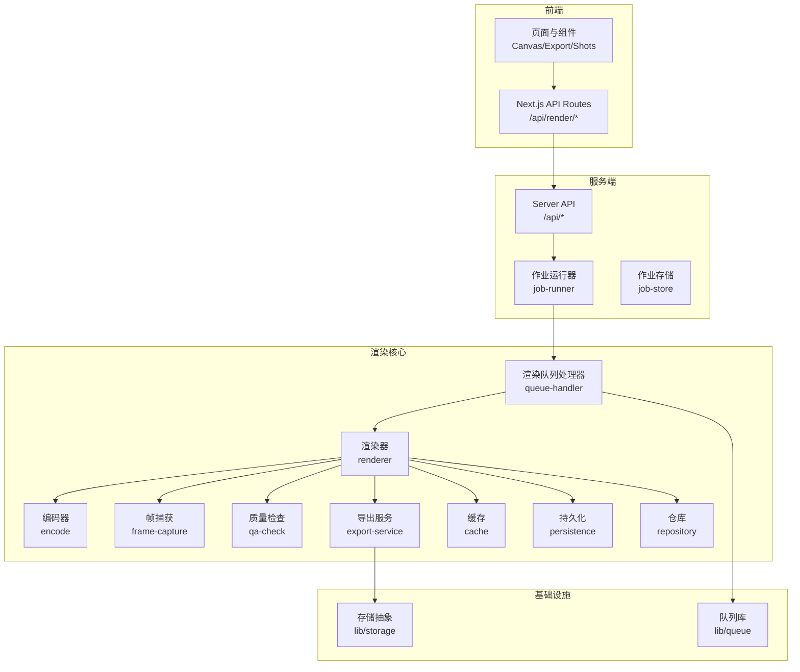

**图示来源** 
- [src/app/api/render/route.ts](file://src/app/api/render/route.ts)
- [server/src/server/api.ts](file://server/src/server/api.ts)
- [server/src/server/job-runner.ts](file://server/src/server/job-runner.ts)
- [src/features/render/queue-handler.ts](file://src/features/render/queue-handler.ts)
- [src/features/render/renderer.ts](file://src/features/render/renderer.ts)
- [src/features/render/encode.ts](file://src/features/render/encode.ts)
- [src/features/render/frame-capture.ts](file://src/features/render/frame-capture.ts)
- [src/features/render/qa-check.ts](file://src/features/render/qa-check.ts)
- [src/features/render/export-service.ts](file://src/features/render/export-service.ts)
- [src/lib/storage/index.ts](file://src/lib/storage/index.ts)
- [src/lib/queue/index.ts](file://src/lib/queue/index.ts)

**章节来源**
- [deploy/compose.yaml](file://deploy/compose.yaml)
- [deploy/env.example](file://deploy/env.example)

## 核心组件
- 渲染器（Renderer）：协调浏览器自动化、帧捕获、编码与 QA 的流水线，支持批处理与重试
- 编码器（Encode）：封装 FFmpeg/媒体工具链，完成转码、拼接、字幕合成与输出校验
- 帧捕获（Frame Capture）：基于 Playwright/浏览器驱动进行截图或视频帧抽取，支持视口与时间轴控制
- 质量检查（QA Check）：视觉与音频指标检测，包含黑帧、静音、分辨率与时长一致性校验
- 导出服务（Export Service）：将渲染产物打包为指定格式，管理分片与合并，提供下载链接
- 队列处理器（Queue Handler）：消费渲染任务，按并发策略执行，保障幂等与失败恢复
- 缓存（Cache）：对中间结果（如帧序列、预览图）做短期缓存，减少重复计算
- 持久化（Persistence）：记录渲染任务状态、进度与产物元数据
- 仓库（Repository）：统一访问数据库与对象存储，屏蔽底层差异

**章节来源**
- [src/features/render/renderer.ts](file://src/features/render/renderer.ts)
- [src/features/render/encode.ts](file://src/features/render/encode.ts)
- [src/features/render/frame-capture.ts](file://src/features/render/frame-capture.ts)
- [src/features/render/qa-check.ts](file://src/features/render/qa-check.ts)
- [src/features/render/export-service.ts](file://src/features/render/export-service.ts)
- [src/features/render/queue-handler.ts](file://src/features/render/queue-handler.ts)
- [src/features/render/cache.ts](file://src/features/render/cache.ts)
- [src/features/render/persistence.ts](file://src/features/render/persistence.ts)
- [src/features/render/repository.ts](file://src/features/render/repository.ts)

## 架构总览
渲染引擎遵循“请求入队—作业调度—渲染流水线—导出与下载”的分层设计。前端通过 Next.js API 路由提交渲染任务；server 层接收并落库，由作业运行器拉取任务交由队列处理器执行；渲染器在隔离环境中驱动浏览器生成帧序列，编码器将其转为视频，QA 检查通过后进入导出服务，最终通过存储抽象暴露下载接口。

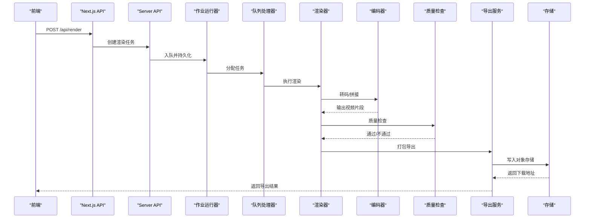

**图示来源** 
- [src/app/api/render/route.ts](file://src/app/api/render/route.ts)
- [server/src/server/api.ts](file://server/src/server/api.ts)
- [server/src/server/job-runner.ts](file://server/src/server/job-runner.ts)
- [src/features/render/queue-handler.ts](file://src/features/render/queue-handler.ts)
- [src/features/render/renderer.ts](file://src/features/render/renderer.ts)
- [src/features/render/encode.ts](file://src/features/render/encode.ts)
- [src/features/render/qa-check.ts](file://src/features/render/qa-check.ts)
- [src/features/render/export-service.ts](file://src/features/render/export-service.ts)
- [src/lib/storage/index.ts](file://src/lib/storage/index.ts)

## 详细组件分析

### 渲染器（Renderer）
- 职责：编排浏览器自动化、帧捕获、编码与 QA，支持批处理、断点续跑与重试
- 关键流程：
  - 初始化渲染上下文（视口、时间线、资源路径）
  - 启动浏览器驱动，加载目标页面
  - 按帧序列抓取图像或录制视频片段
  - 调用编码器进行转码与拼接
  - 触发 QA 检查，根据结果决定是否重跑或回滚
- 并发与批处理：
  - 支持并行帧捕获与编码，限制 GPU/CPU 使用上限
  - 批大小与窗口滑动策略可调，避免内存峰值过高

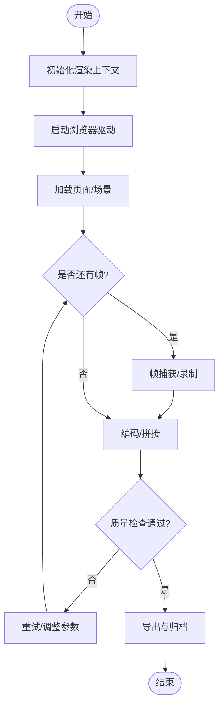

**图示来源** 
- [src/features/render/renderer.ts](file://src/features/render/renderer.ts)
- [src/features/render/frame-capture.ts](file://src/features/render/frame-capture.ts)
- [src/features/render/encode.ts](file://src/features/render/encode.ts)
- [src/features/render/qa-check.ts](file://src/features/render/qa-check.ts)

**章节来源**
- [src/features/render/renderer.ts](file://src/features/render/renderer.ts)

### 帧捕获（Frame Capture）
- 模式：截图模式（逐帧）、录制模式（连续帧）
- 控制：视口尺寸、缩放、滚动、等待动画完成、关键帧对齐
- 稳定性：重试与超时控制，异常时回退到降级策略（如降低帧率）

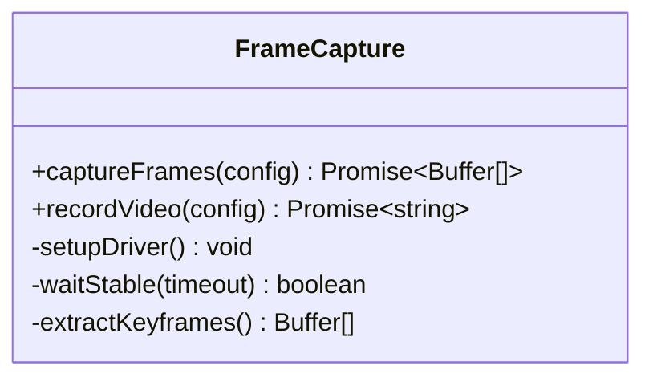

**图示来源** 
- [src/features/render/frame-capture.ts](file://src/features/render/frame-capture.ts)

**章节来源**
- [src/features/render/frame-capture.ts](file://src/features/render/frame-capture.ts)

### 编码器（Encode）
- 功能：输入帧序列或片段，输出标准视频容器与编码参数（分辨率、码率、帧率、编解码器）
- 能力：拼接、字幕叠加、音频混音、水印添加、分段与合并
- 校验：输出文件大小、时长、码率与格式合规性检查

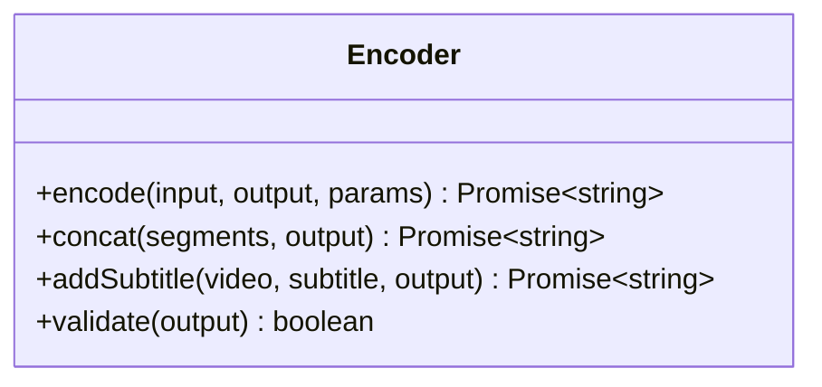

**图示来源** 
- [src/features/render/encode.ts](file://src/features/render/encode.ts)

**章节来源**
- [src/features/render/encode.ts](file://src/features/render/encode.ts)

### 质量检查（QA Check）
- 视觉检查：黑帧比例、模糊度、分辨率一致性、色彩空间
- 音频检查：静音段、音量阈值、采样率与声道数
- 决策：自动判定通过/失败，必要时触发重跑或人工复核

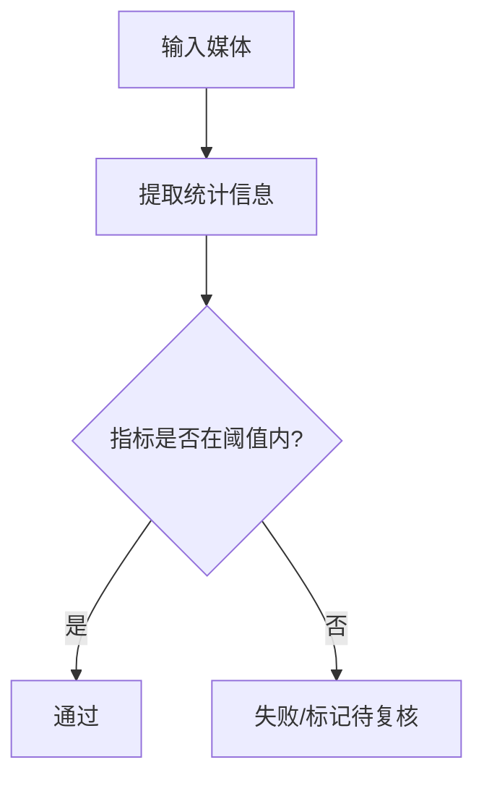

**图示来源** 
- [src/features/render/qa-check.ts](file://src/features/render/qa-check.ts)

**章节来源**
- [src/features/render/qa-check.ts](file://src/features/render/qa-check.ts)

### 导出服务（Export Service）
- 职责：将渲染产物打包为指定格式（MP4/MOV/WebM），生成缩略图与元数据
- 流程：校验产物完整性→生成缩略图→上传至对象存储→返回下载链接
- 并发：支持批量导出与分片上传，提升大文件效率

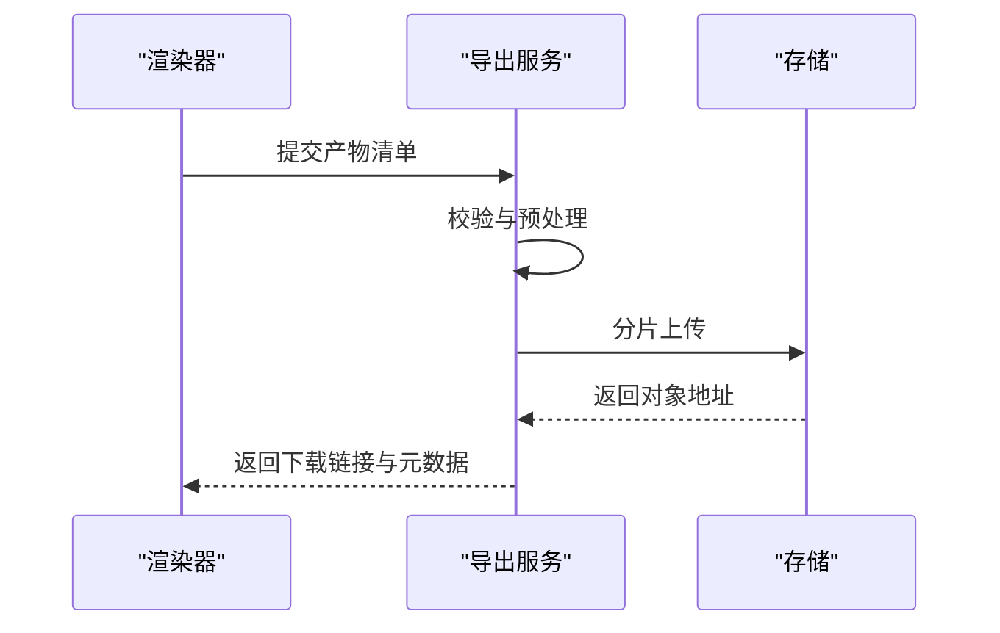

**图示来源** 
- [src/features/render/export-service.ts](file://src/features/render/export-service.ts)
- [src/lib/storage/index.ts](file://src/lib/storage/index.ts)

**章节来源**
- [src/features/render/export-service.ts](file://src/features/render/export-service.ts)

### 渲染队列与并发控制（Queue Handler）
- 入队：API 接收渲染请求，持久化任务并加入队列
- 出队：作业运行器按优先级与资源可用性分配任务
- 并发：按 lane/worker 维度限制并发，防止资源争用
- 容错：失败重试、死信队列、幂等键去重

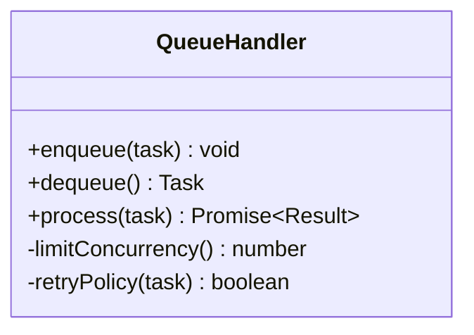

**图示来源** 
- [src/features/render/queue-handler.ts](file://src/features/render/queue-handler.ts)
- [server/src/server/job-runner.ts](file://server/src/server/job-runner.ts)

**章节来源**
- [src/features/render/queue-handler.ts](file://src/features/render/queue-handler.ts)
- [server/src/server/job-runner.ts](file://server/src/server/job-runner.ts)

### 缓存与持久化（Cache & Persistence）
- 缓存：中间结果（帧序列、缩略图、编码参数）短期缓存，命中则跳过重复计算
- 持久化：任务状态机（排队、运行、成功、失败）、进度与产物元数据落库
- 一致性：分布式锁与幂等键保证多实例安全

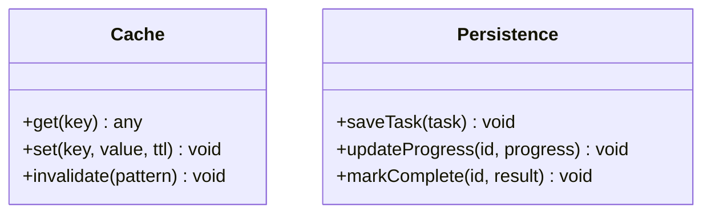

**图示来源** 
- [src/features/render/cache.ts](file://src/features/render/cache.ts)
- [src/features/render/persistence.ts](file://src/features/render/persistence.ts)

**章节来源**
- [src/features/render/cache.ts](file://src/features/render/cache.ts)
- [src/features/render/persistence.ts](file://src/features/render/persistence.ts)

### 仓库（Repository）
- 职责：统一访问数据库与对象存储，提供查询、更新与事务能力
- 抽象：适配不同后端（PostgreSQL、SQLite、对象存储）

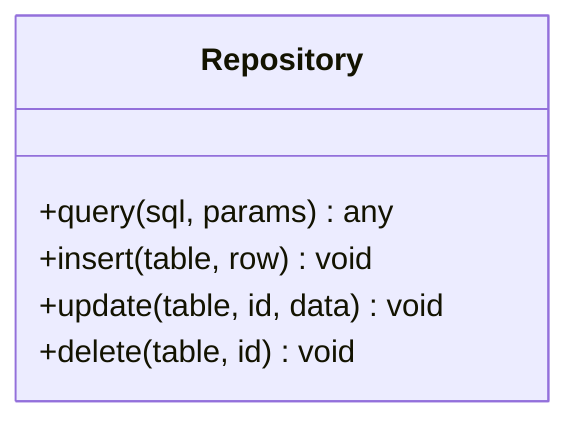

**图示来源** 
- [src/features/render/repository.ts](file://src/features/render/repository.ts)

**章节来源**
- [src/features/render/repository.ts](file://src/features/render/repository.ts)

### API 与前端集成
- Next.js API 路由：/api/render、/api/render/export、/api/render/thumbnails
- 页面集成：Canvas/Export/Shots 页面通过 API 发起渲染与导出，展示进度与结果

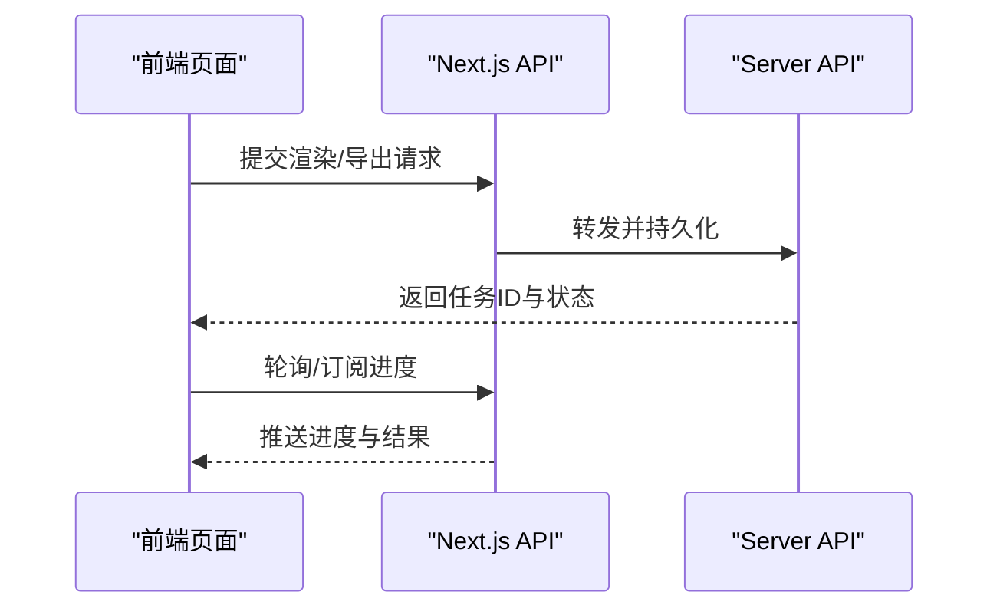

**图示来源** 
- [src/app/api/render/route.ts](file://src/app/api/render/route.ts)
- [src/app/api/render/export/route.ts](file://src/app/api/render/export/route.ts)
- [src/app/api/render/thumbnails/route.ts](file://src/app/api/render/thumbnails/route.ts)
- [src/app/products/(app)/canvas/[projectId]/page.tsx](file://src/app/products/(app)/canvas/[projectId]/page.tsx)
- [src/app/products/(app)/export/[projectId]/page.tsx](file://src/app/products/(app)/export/[projectId]/page.tsx)
- [src/app/products/(app)/shots/[shotId]/page.tsx](file://src/app/products/(app)/shots/[shotId]/page.tsx)

**章节来源**
- [src/app/api/render/route.ts](file://src/app/api/render/route.ts)
- [src/app/api/render/export/route.ts](file://src/app/api/render/export/route.ts)
- [src/app/api/render/thumbnails/route.ts](file://src/app/api/render/thumbnails/route.ts)
- [src/app/products/(app)/canvas/[projectId]/page.tsx](file://src/app/products/(app)/canvas/[projectId]/page.tsx)
- [src/app/products/(app)/export/[projectId]/page.tsx](file://src/app/products/(app)/export/[projectId]/page.tsx)
- [src/app/products/(app)/shots/[shotId]/page.tsx](file://src/app/products/(app)/shots/[shotId]/page.tsx)

## 依赖关系分析
- 模块耦合：渲染器依赖帧捕获、编码器、QA、导出服务；队列处理器依赖作业运行器与持久化
- 外部依赖：浏览器驱动（Playwright）、FFmpeg、对象存储、数据库
- 潜在循环：应避免渲染器与导出服务互相直接依赖，通过事件或回调解耦

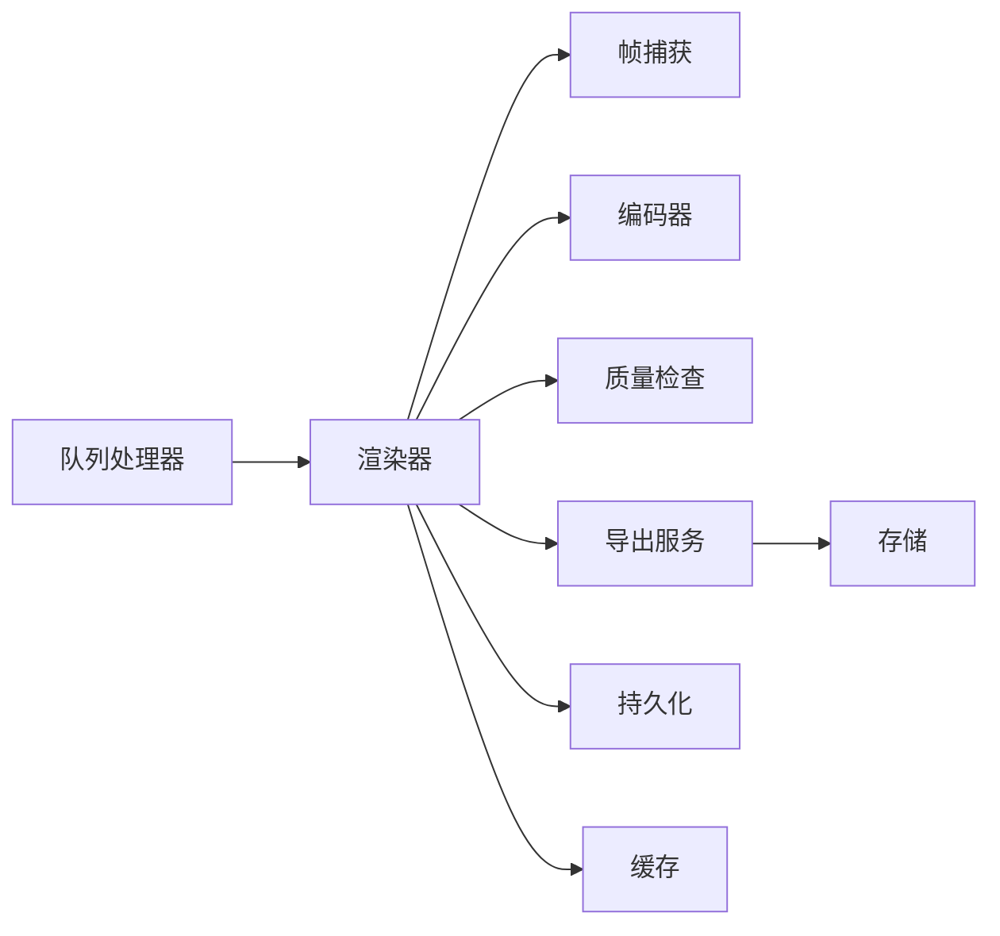

**图示来源** 
- [src/features/render/queue-handler.ts](file://src/features/render/queue-handler.ts)
- [src/features/render/renderer.ts](file://src/features/render/renderer.ts)
- [src/features/render/frame-capture.ts](file://src/features/render/frame-capture.ts)
- [src/features/render/encode.ts](file://src/features/render/encode.ts)
- [src/features/render/qa-check.ts](file://src/features/render/qa-check.ts)
- [src/features/render/export-service.ts](file://src/features/render/export-service.ts)
- [src/features/render/persistence.ts](file://src/features/render/persistence.ts)
- [src/features/render/cache.ts](file://src/features/render/cache.ts)

**章节来源**
- [src/features/render/renderer.ts](file://src/features/render/renderer.ts)
- [src/features/render/queue-handler.ts](file://src/features/render/queue-handler.ts)

## 性能考量
- 并发控制：合理设置 worker 数量与 lane 并发，避免 CPU/GPU 过载
- 批处理：增大批大小可减少调度开销，但需平衡内存占用
- 缓存命中：对重复渲染任务启用缓存，缩短端到端延迟
- 编码参数：选择合适码率与分辨率，兼顾质量与体积
- I/O 优化：使用分片上传与并行读取，降低网络与磁盘瓶颈
- 监控与度量：采集队列长度、任务耗时、失败率与资源利用率

[本节为通用指导，不涉及具体文件]

## 故障排除指南
- 常见问题
  - 浏览器驱动启动失败：检查环境变量与权限，确认 Playwright 已安装
  - 编码失败：验证输入帧序列完整性与 FFmpeg 可用路径
  - QA 失败：调整阈值或检查源素材质量
  - 导出失败：确认对象存储配置与权限
- 定位方法
  - 查看任务日志与持久化状态
  - 检查队列处理器重试与死信队列
  - 使用缩略图与中间产物快速定位问题阶段

**章节来源**
- [src/features/render/queue-handler.ts](file://src/features/render/queue-handler.ts)
- [src/features/render/persistence.ts](file://src/features/render/persistence.ts)
- [src/features/render/export-service.ts](file://src/features/render/export-service.ts)

## 结论
PurpleInk 渲染引擎以模块化与可扩展为核心，通过清晰的职责划分与稳定的基础设施，实现了从浏览器自动化到视频导出的全链路能力。合理的并发控制、缓存与 QA 机制保障了生产环境的稳定与高效。建议结合业务需求持续优化编码参数与资源调度策略，并通过完善的监控与排障手段提升系统韧性。

[本节为总结，不涉及具体文件]

## 附录
- 配置选项
  - 渲染并发、批大小、超时与重试策略
  - 编码参数（分辨率、码率、帧率、编解码器）
  - 存储与数据库连接信息
- 部署说明
  - 使用 compose 编排 Web 与 Worker 进程
  - 环境变量模板参考 env.example
- 扩展指南
  - 自定义帧捕获后端：实现统一接口替换默认驱动
  - 自定义编码器：接入新的转码工具链
  - 自定义存储：实现对象存储抽象接口

**章节来源**
- [deploy/compose.yaml](file://deploy/compose.yaml)
- [deploy/env.example](file://deploy/env.example)
- [src/features/render/types.ts](file://src/features/render/types.ts)