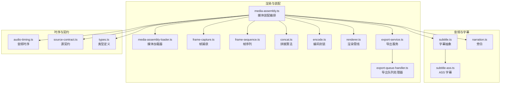
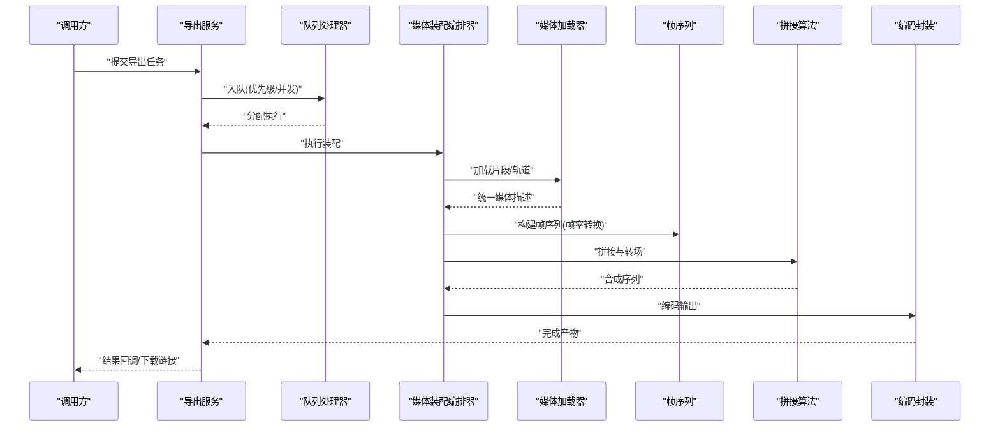
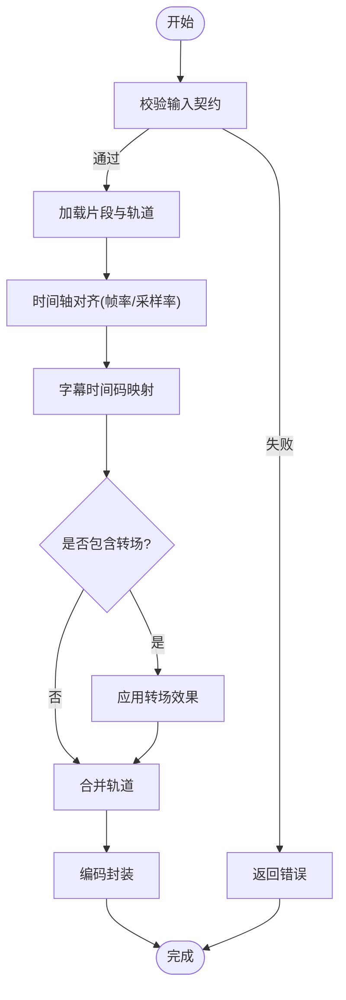
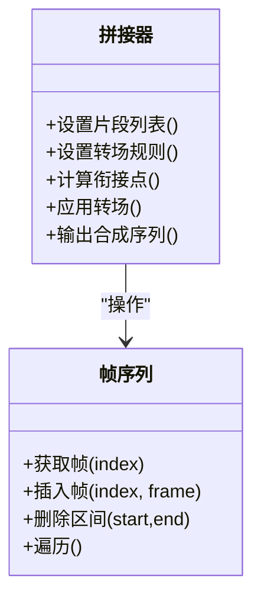
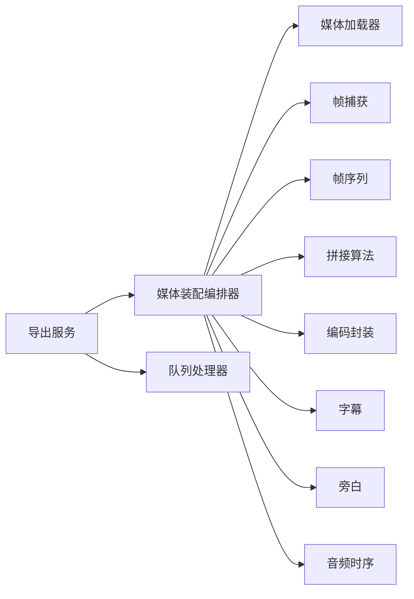

# 媒体组装引擎

<cite>
**本文引用的文件**   
- [src/features/render/media-assembly.ts](file://src/features/render/media-assembly.ts)
- [src/features/render/media-assembly-loader.ts](file://src/features/render/media-assembly-loader.ts)
- [src/features/render/concat.ts](file://src/features/render/concat.ts)
- [src/features/render/encode.ts](file://src/features/render/encode.ts)
- [src/features/render/renderer.ts](file://src/features/render/renderer.ts)
- [src/features/render/types.ts](file://src/features/render/types.ts)
- [src/features/render/source-contract.ts](file://src/features/render/source-contract.ts)
- [src/features/render/frame-capture.ts](file://src/features/render/frame-capture.ts)
- [src/features/render/frame-sequence.ts](file://src/features/render/frame-sequence.ts)
- [src/features/render/export-service.ts](file://src/features/render/export-service.ts)
- [src/features/render/export-queue-handler.ts](file://src/features/render/export-queue-handler.ts)
- [src/features/audio/subtitle.ts](file://src/features/audio/subtitle.ts)
- [src/features/audio/subtitle-ass.ts](file://src/features/audio/subtitle-ass.ts)
- [src/features/audio/narration.ts](file://src/features/audio/narration.ts)
- [src/features/director/audio-timing.ts](file://src/features/director/audio-timing.ts)
</cite>

## 目录
1. [简介](#简介)
2. [项目结构](#项目结构)
3. [核心组件](#核心组件)
4. [架构总览](#架构总览)
5. [详细组件分析](#详细组件分析)
6. [依赖关系分析](#依赖关系分析)
7. [性能考虑](#性能考虑)
8. [故障排除指南](#故障排除指南)
9. [结论](#结论)
10. [附录](#附录)

## 简介
本文件面向“媒体组装引擎”，聚焦多格式媒体文件的统一处理接口与标准化流程，覆盖视频、音频、图片的输入、时间轴对齐、拼接转场、编码封装与元数据保留。文档同时提供批量处理能力说明、兼容性策略、性能优化建议以及常见问题排查方法，帮助读者快速理解并高效使用该系统。

## 项目结构
媒体组装相关能力集中在 src/features/render 与 src/features/audio 等模块中：
- render：负责媒体装配、帧捕获、序列管理、转码输出、导出服务与队列处理
- audio：负责字幕（含 ASS）、旁白与音频时序处理
- director：提供音频时序对齐与导演侧的时间基准

图表来源 
- [src/features/render/media-assembly.ts](file://src/features/render/media-assembly.ts)
- [src/features/render/media-assembly-loader.ts](file://src/features/render/media-assembly-loader.ts)
- [src/features/render/frame-capture.ts](file://src/features/render/frame-capture.ts)
- [src/features/render/frame-sequence.ts](file://src/features/render/frame-sequence.ts)
- [src/features/render/concat.ts](file://src/features/render/concat.ts)
- [src/features/render/encode.ts](file://src/features/render/encode.ts)
- [src/features/render/renderer.ts](file://src/features/render/renderer.ts)
- [src/features/render/export-service.ts](file://src/features/render/export-service.ts)
- [src/features/render/export-queue-handler.ts](file://src/features/render/export-queue-handler.ts)
- [src/features/audio/subtitle.ts](file://src/features/audio/subtitle.ts)
- [src/features/audio/subtitle-ass.ts](file://src/features/audio/subtitle-ass.ts)
- [src/features/audio/narration.ts](file://src/features/audio/narration.ts)
- [src/features/director/audio-timing.ts](file://src/features/director/audio-timing.ts)

章节来源
- [src/features/render/media-assembly.ts](file://src/features/render/media-assembly.ts)
- [src/features/render/media-assembly-loader.ts](file://src/features/render/media-assembly-loader.ts)
- [src/features/render/concat.ts](file://src/features/render/concat.ts)
- [src/features/render/encode.ts](file://src/features/render/encode.ts)
- [src/features/render/renderer.ts](file://src/features/render/renderer.ts)
- [src/features/render/types.ts](file://src/features/render/types.ts)
- [src/features/render/source-contract.ts](file://src/features/render/source-contract.ts)
- [src/features/render/frame-capture.ts](file://src/features/render/frame-capture.ts)
- [src/features/render/frame-sequence.ts](file://src/features/render/frame-sequence.ts)
- [src/features/render/export-service.ts](file://src/features/render/export-service.ts)
- [src/features/render/export-queue-handler.ts](file://src/features/render/export-queue-handler.ts)
- [src/features/audio/subtitle.ts](file://src/features/audio/subtitle.ts)
- [src/features/audio/subtitle-ass.ts](file://src/features/audio/subtitle-ass.ts)
- [src/features/audio/narration.ts](file://src/features/audio/narration.ts)
- [src/features/director/audio-timing.ts](file://src/features/director/audio-timing.ts)

## 核心组件
- 媒体装配编排器：统一调度加载、解码、时间轴对齐、转场与编码输出
- 媒体加载器：适配多种输入源（本地文件、URL、流），解析容器与轨道信息
- 帧捕获与序列：按目标帧率抽取关键帧，构建有序帧序列
- 拼接算法：实现无缝衔接、淡入淡出、交叉溶解等转场
- 编码封装：统一输出到目标容器与编码参数，保留必要元数据
- 导出服务与队列：异步任务化导出，支持并发与重试
- 字幕与旁白：标准字幕接口与 ASS 实现，旁白生成与插入
- 音频时序：以音频为时间基准进行对齐与同步

章节来源
- [src/features/render/media-assembly.ts](file://src/features/render/media-assembly.ts)
- [src/features/render/media-assembly-loader.ts](file://src/features/render/media-assembly-loader.ts)
- [src/features/render/frame-capture.ts](file://src/features/render/frame-capture.ts)
- [src/features/render/frame-sequence.ts](file://src/features/render/frame-sequence.ts)
- [src/features/render/concat.ts](file://src/features/render/concat.ts)
- [src/features/render/encode.ts](file://src/features/render/encode.ts)
- [src/features/render/export-service.ts](file://src/features/render/export-service.ts)
- [src/features/render/export-queue-handler.ts](file://src/features/render/export-queue-handler.ts)
- [src/features/audio/subtitle.ts](file://src/features/audio/subtitle.ts)
- [src/features/audio/subtitle-ass.ts](file://src/features/audio/subtitle-ass.ts)
- [src/features/audio/narration.ts](file://src/features/audio/narration.ts)
- [src/features/director/audio-timing.ts](file://src/features/director/audio-timing.ts)

## 架构总览
媒体组装引擎采用“编排+插件”的流水线架构：
- 入口由装配编排器接收任务描述（片段、轨道、效果、输出规格）
- 加载器将不同来源的媒体统一为内部表示（轨道、时长、帧率、采样率）
- 时间轴对齐以音频为基准，视频帧率归一化，字幕时间码映射
- 拼接阶段根据规则生成最终帧序列与音轨，应用转场
- 编码器按目标容器与编码参数输出，写入持久化存储或返回流

图表来源 
- [src/features/render/export-service.ts](file://src/features/render/export-service.ts)
- [src/features/render/export-queue-handler.ts](file://src/features/render/export-queue-handler.ts)
- [src/features/render/media-assembly.ts](file://src/features/render/media-assembly.ts)
- [src/features/render/media-assembly-loader.ts](file://src/features/render/media-assembly-loader.ts)
- [src/features/render/frame-sequence.ts](file://src/features/render/frame-sequence.ts)
- [src/features/render/concat.ts](file://src/features/render/concat.ts)
- [src/features/render/encode.ts](file://src/features/render/encode.ts)

## 详细组件分析

### 媒体装配编排器
- 职责：接收装配计划，协调加载、对齐、拼接、编码；维护全局时间轴与轨道状态
- 关键点：
  - 统一输入契约：通过源契约校验片段有效性
  - 时间基准：以音频时长为主，视频帧率归一化至目标帧率
  - 字幕注入：在对应时间段插入字幕轨道
  - 转场配置：支持淡入淡出、交叉溶解、滑动等效果
  - 错误恢复：失败片段可重试或跳过，记录诊断信息

图表来源 
- [src/features/render/media-assembly.ts](file://src/features/render/media-assembly.ts)
- [src/features/render/source-contract.ts](file://src/features/render/source-contract.ts)
- [src/features/render/frame-capture.ts](file://src/features/render/frame-capture.ts)
- [src/features/audio/subtitle.ts](file://src/features/audio/subtitle.ts)
- [src/features/render/concat.ts](file://src/features/render/concat.ts)
- [src/features/render/encode.ts](file://src/features/render/encode.ts)

章节来源
- [src/features/render/media-assembly.ts](file://src/features/render/media-assembly.ts)
- [src/features/render/source-contract.ts](file://src/features/render/source-contract.ts)

### 媒体加载器
- 职责：读取不同来源的媒体文件，解析容器、轨道、编解码器、时长、分辨率、帧率、采样率等元数据
- 关键点：
  - 多格式兼容：支持常见视频/音频/图片容器与编码
  - 流式读取：避免大文件全量载入内存
  - 元数据保留：提取并透传必要的元数据（如色彩空间、声道布局）
  - 异常处理：对损坏或不支持的格式给出明确错误

章节来源
- [src/features/render/media-assembly-loader.ts](file://src/features/render/media-assembly-loader.ts)

### 帧捕获与帧序列
- 职责：按目标帧率从视频中抽取帧，构建有序帧序列，支持关键帧与插值策略
- 关键点：
  - 帧率转换：降采样或升采样，保证时间一致性
  - 质量策略：I/P/B 帧选择、去隔行、缩放
  - 内存管理：分块读取与释放，控制峰值内存

章节来源
- [src/features/render/frame-capture.ts](file://src/features/render/frame-capture.ts)
- [src/features/render/frame-sequence.ts](file://src/features/render/frame-sequence.ts)

### 拼接算法与转场
- 职责：将多个片段按时间线拼接，并在衔接处应用转场效果
- 关键点：
  - 无缝衔接：基于时间戳对齐与边界帧融合
  - 转场实现：淡入淡出、交叉溶解、滑动、擦除等
  - 批量处理：支持大批量片段的流水线拼接，减少中间产物

图表来源 
- [src/features/render/concat.ts](file://src/features/render/concat.ts)
- [src/features/render/frame-sequence.ts](file://src/features/render/frame-sequence.ts)

章节来源
- [src/features/render/concat.ts](file://src/features/render/concat.ts)

### 编码封装与输出
- 职责：将合成后的视频、音频、字幕轨道编码为目标容器与编码格式，写入文件或流
- 关键点：
  - 编码参数：分辨率、比特率、帧率、音频采样率、声道数
  - 容器适配：MP4、MKV、WebM 等
  - 元数据保留：标题、作者、版权、章节标记等
  - 进度与中断：支持进度回调与优雅中断

章节来源
- [src/features/render/encode.ts](file://src/features/render/encode.ts)

### 导出服务与队列
- 职责：对外暴露导出 API，管理任务生命周期、并发、重试与结果持久化
- 关键点：
  - 任务模型：任务ID、优先级、状态、错误信息
  - 队列策略：FIFO/优先级、限流、退避重试
  - 结果访问：下载链接、流式输出、事件通知

章节来源
- [src/features/render/export-service.ts](file://src/features/render/export-service.ts)
- [src/features/render/export-queue-handler.ts](file://src/features/render/export-queue-handler.ts)

### 字幕与旁白
- 职责：提供字幕抽象接口与 ASS 实现，支持时间码映射与样式；旁白生成与插入
- 关键点：
  - 时间码处理：SRT/ASS 时间码转换为内部时间轴
  - 样式与定位：字体、颜色、位置、滚动
  - 旁白同步：与视频时间轴对齐，音量与混音

章节来源
- [src/features/audio/subtitle.ts](file://src/features/audio/subtitle.ts)
- [src/features/audio/subtitle-ass.ts](file://src/features/audio/subtitle-ass.ts)
- [src/features/audio/narration.ts](file://src/features/audio/narration.ts)

### 音频时序与对齐
- 职责：以音频为时间基准，对齐视频帧率与字幕时间码，确保音画同步
- 关键点：
  - 基准选择：优先音频时长，必要时回退到视频
  - 重采样：音频采样率统一
  - 偏移校正：延迟补偿与漂移修正

章节来源
- [src/features/director/audio-timing.ts](file://src/features/director/audio-timing.ts)

## 依赖关系分析
- 低耦合：各组件通过清晰接口交互，装配编排器作为协调者
- 可扩展：加载器、转场、编码器均可替换或扩展
- 外部依赖：音视频编解码库、文件系统、队列系统

图表来源 
- [src/features/render/media-assembly.ts](file://src/features/render/media-assembly.ts)
- [src/features/render/media-assembly-loader.ts](file://src/features/render/media-assembly-loader.ts)
- [src/features/render/frame-capture.ts](file://src/features/render/frame-capture.ts)
- [src/features/render/frame-sequence.ts](file://src/features/render/frame-sequence.ts)
- [src/features/render/concat.ts](file://src/features/render/concat.ts)
- [src/features/render/encode.ts](file://src/features/render/encode.ts)
- [src/features/audio/subtitle.ts](file://src/features/audio/subtitle.ts)
- [src/features/audio/narration.ts](file://src/features/audio/narration.ts)
- [src/features/director/audio-timing.ts](file://src/features/director/audio-timing.ts)
- [src/features/render/export-service.ts](file://src/features/render/export-service.ts)
- [src/features/render/export-queue-handler.ts](file://src/features/render/export-queue-handler.ts)

章节来源
- [src/features/render/media-assembly.ts](file://src/features/render/media-assembly.ts)
- [src/features/render/export-service.ts](file://src/features/render/export-service.ts)
- [src/features/render/export-queue-handler.ts](file://src/features/render/export-queue-handler.ts)

## 性能考虑
- 流式处理：避免一次性加载大文件，采用分块读取与即时释放
- 并行与批处理：多片段并行加载与编码，限制并发度防止资源争用
- 帧率与采样率归一化：在早期阶段统一，减少后续重复转换
- 缓存策略：对常用转场模板与编码参数进行缓存
- 内存监控：跟踪峰值内存，及时回收临时对象
- I/O 优化：使用顺序写盘、缓冲池与异步写入

[本节为通用指导，不直接分析具体文件]

## 故障排除指南
- 输入格式不支持：检查容器与编码是否在加载器支持列表中，确认文件未损坏
- 时间轴错位：核对音频基准与视频帧率，检查字幕时间码格式与偏移
- 拼接黑边或跳帧：检查衔接点帧率与分辨率一致性，调整转场参数
- 编码失败：确认目标容器与编码参数组合合法，检查磁盘空间与权限
- 队列堆积：调整并发与优先级策略，检查下游消费者健康状态
- 内存溢出：降低批次大小，启用流式处理，增加垃圾回收频率

章节来源
- [src/features/render/media-assembly-loader.ts](file://src/features/render/media-assembly-loader.ts)
- [src/features/render/concat.ts](file://src/features/render/concat.ts)
- [src/features/render/encode.ts](file://src/features/render/encode.ts)
- [src/features/render/export-queue-handler.ts](file://src/features/render/export-queue-handler.ts)

## 结论
媒体组装引擎通过统一的装配编排与模块化组件，实现了多格式媒体的标准化处理、时间轴对齐、拼接转场与编码输出。借助导出服务与队列机制，系统具备高吞吐与高可用的能力。遵循本文的性能优化与故障排除建议，可在复杂场景下稳定运行。

[本节为总结性内容，不直接分析具体文件]

## 附录
- 术语表：
  - 时间轴对齐：将视频帧率、音频采样率与字幕时间码统一到一致的时间基准
  - 转场效果：片段衔接处的视觉过渡，如淡入淡出、交叉溶解
  - 元数据：媒体文件的描述性信息，如标题、作者、版权、章节
- 最佳实践：
  - 始终先对齐时间轴再进行拼接
  - 使用流式处理大文件
  - 合理设置并发与批次大小
  - 保留关键元数据以提升后期编辑体验

[本节为补充信息，不直接分析具体文件]