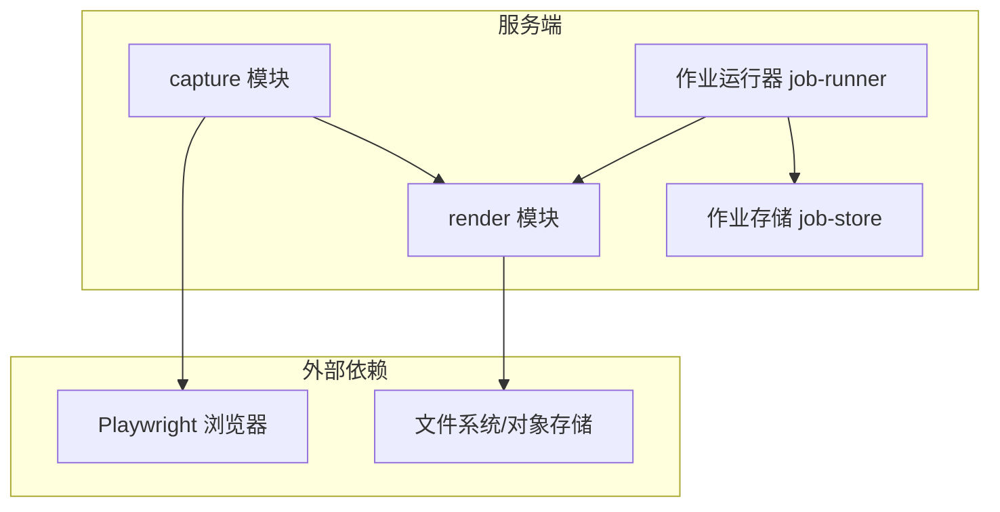
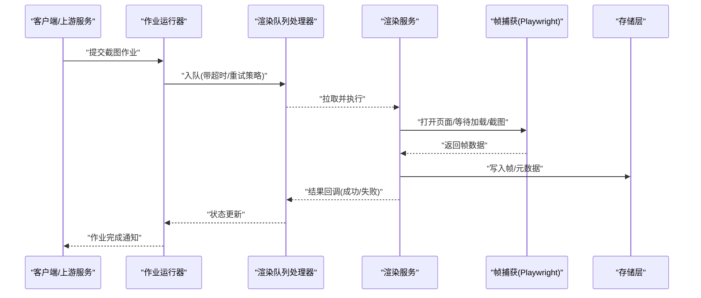
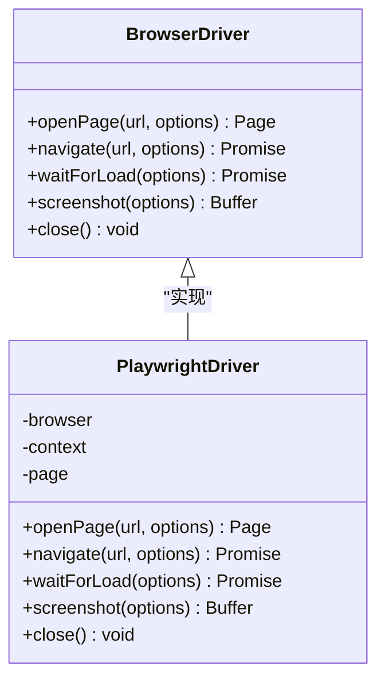
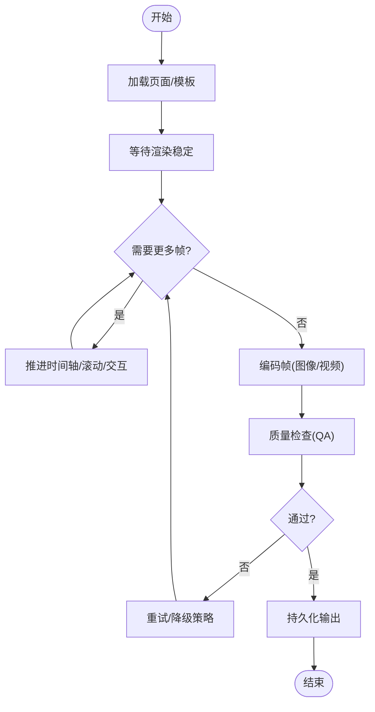
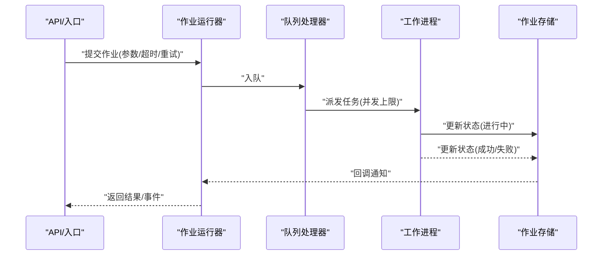
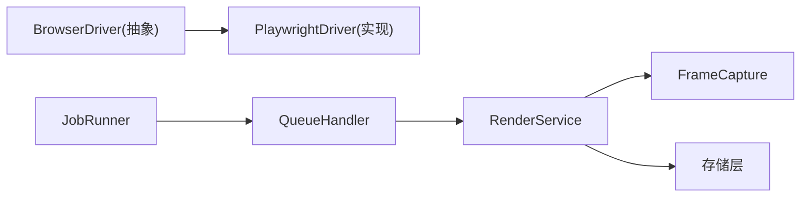

# 帧捕获系统

<cite>
**本文引用的文件**   
- [server/src/capture/playwright-driver.ts](file://server/src/capture/playwright-driver.ts)
- [server/src/capture/browser-driver.ts](file://server/src/capture/browser-driver.ts)
- [server/src/capture/run-capture.ts](file://server/src/capture/run-capture.ts)
- [server/src/capture/ai-capture-agent.ts](file://server/src/capture/ai-capture-agent.ts)
- [server/src/capture/mock-driver.ts](file://server/src/capture/mock-driver.ts)
- [server/src/capture/credentials.ts](file://server/src/capture/credentials.ts)
- [server/src/capture/imap-email.ts](file://server/src/capture/imap-email.ts)
- [server/src/render/frame-capture.ts](file://server/src/render/frame-capture.ts)
- [server/src/render/renderer.ts](file://server/src/render/renderer.ts)
- [server/src/render/export-service.ts](file://server/src/render/export-service.ts)
- [server/src/render/queue-handler.ts](file://server/src/render/queue-handler.ts)
- [server/src/server/job-runner.ts](file://server/src/server/job-runner.ts)
- [server/src/server/job-store.ts](file://server/src/server/job-store.ts)
- [scripts/capture-url.ts](file://scripts/capture-url.ts)
- [scripts/render-capture.ts](file://scripts/render-capture.ts)
</cite>

## 目录
1. [简介](#简介)
2. [项目结构](#项目结构)
3. [核心组件](#核心组件)
4. [架构总览](#架构总览)
5. [详细组件分析](#详细组件分析)
6. [依赖关系分析](#依赖关系分析)
7. [性能考虑](#性能考虑)
8. [故障排查指南](#故障排查指南)
9. [结论](#结论)
10. [附录](#附录)

## 简介
本文件系统性梳理“帧捕获系统”的实现原理与工程实践，覆盖以下关键主题：
- 浏览器截图机制与 Playwright 驱动使用
- 页面渲染控制、截图参数配置与质量优化（分辨率、格式、压缩）
- 异步处理流程（任务队列、并发控制、超时处理）
- 错误处理与重试策略（网络异常、内存溢出、资源限制）
- 性能调优与调试技巧

该文档面向不同技术背景的读者，既提供高层概览，也给出代码级分析与可视化图示。

## 项目结构
帧捕获相关能力主要分布在 server 端的 capture 与 render 两个模块，以及 scripts 中的命令行工具：
- capture 模块：封装浏览器驱动（Playwright）、页面导航、截图执行、凭据注入等
- render 模块：负责帧序列生成、编码导出、队列与持久化、质量检查等
- scripts：提供脚本入口用于 URL 抓取、渲染验证与基准测试

图表来源
- [server/src/capture/playwright-driver.ts](file://server/src/capture/playwright-driver.ts)
- [server/src/render/renderer.ts](file://server/src/render/renderer.ts)
- [server/src/server/job-runner.ts](file://server/src/server/job-runner.ts)
- [server/src/server/job-store.ts](file://server/src/server/job-store.ts)

章节来源
- [server/src/capture/playwright-driver.ts](file://server/src/capture/playwright-driver.ts)
- [server/src/render/renderer.ts](file://server/src/render/renderer.ts)
- [server/src/server/job-runner.ts](file://server/src/server/job-runner.ts)
- [server/src/server/job-store.ts](file://server/src/server/job-store.ts)

## 核心组件
- Playwright 浏览器驱动：封装浏览器实例管理、页面生命周期、截图参数与等待策略
- 渲染管线：将页面渲染为帧序列，进行编码与导出
- 作业调度：基于队列的异步任务分发、并发控制、超时与重试
- 辅助能力：AI 采集代理、凭据注入、IMAP 邮件读取、Mock 驱动

章节来源
- [server/src/capture/playwright-driver.ts](file://server/src/capture/playwright-driver.ts)
- [server/src/render/frame-capture.ts](file://server/src/render/frame-capture.ts)
- [server/src/render/renderer.ts](file://server/src/render/renderer.ts)
- [server/src/render/queue-handler.ts](file://server/src/render/queue-handler.ts)
- [server/src/capture/ai-capture-agent.ts](file://server/src/capture/ai-capture-agent.ts)
- [server/src/capture/credentials.ts](file://server/src/capture/credentials.ts)
- [server/src/capture/imap-email.ts](file://server/src/capture/imap-email.ts)
- [server/src/capture/mock-driver.ts](file://server/src/capture/mock-driver.ts)

## 架构总览
下图展示从请求到截图落盘的端到端流程：作业进入队列，由运行器调度，调用渲染服务完成帧捕获与编码，最终持久化输出。

图表来源
- [server/src/server/job-runner.ts](file://server/src/server/job-runner.ts)
- [server/src/render/queue-handler.ts](file://server/src/render/queue-handler.ts)
- [server/src/render/renderer.ts](file://server/src/render/renderer.ts)
- [server/src/capture/playwright-driver.ts](file://server/src/capture/playwright-driver.ts)

章节来源
- [server/src/server/job-runner.ts](file://server/src/server/job-runner.ts)
- [server/src/render/queue-handler.ts](file://server/src/render/queue-handler.ts)
- [server/src/render/renderer.ts](file://server/src/render/renderer.ts)
- [server/src/capture/playwright-driver.ts](file://server/src/capture/playwright-driver.ts)

## 详细组件分析

### Playwright 浏览器驱动
职责
- 管理浏览器实例与上下文，控制页面打开、导航、等待与关闭
- 统一截图参数（尺寸、缩放、裁剪、延迟、等待事件）
- 支持注入凭据、拦截网络、模拟设备与视口

关键实现要点
- 页面等待策略：优先使用内容就绪与网络空闲，避免硬延时
- 截图参数：分辨率、像素比、格式（PNG/JPEG/WebP）、质量系数、是否含阴影
- 资源隔离：每个任务独立上下文，避免跨任务污染
- 错误边界：捕获超时、断网、OOM 等异常并上报

图表来源
- [server/src/capture/browser-driver.ts](file://server/src/capture/browser-driver.ts)
- [server/src/capture/playwright-driver.ts](file://server/src/capture/playwright-driver.ts)

章节来源
- [server/src/capture/browser-driver.ts](file://server/src/capture/browser-driver.ts)
- [server/src/capture/playwright-driver.ts](file://server/src/capture/playwright-driver.ts)

### 帧捕获与渲染管线
职责
- 将页面渲染为帧序列，按时间轴或关键帧策略抽取
- 对帧进行编码（图像/视频），生成缩略图与元数据
- 提供质量检查与一致性校验

关键实现要点
- 帧序列生成：支持固定间隔、滚动触发、动画关键帧
- 编码策略：根据目标选择 PNG/JPEG/WebP/视频编码，平衡质量与体积
- 缓存与去重：相同输入可复用已生成帧，减少重复计算
- 质量保障：视觉 QA、尺寸阈值、色彩空间一致性

图表来源
- [server/src/render/frame-capture.ts](file://server/src/render/frame-capture.ts)
- [server/src/render/renderer.ts](file://server/src/render/renderer.ts)

章节来源
- [server/src/render/frame-capture.ts](file://server/src/render/frame-capture.ts)
- [server/src/render/renderer.ts](file://server/src/render/renderer.ts)

### 作业调度与队列
职责
- 接收截图作业，分配至工作进程
- 并发控制：限制同时运行的任务数，防止过载
- 超时与重试：为每个作业设置超时，失败自动重试
- 状态追踪：记录作业进度、错误信息、耗时指标

关键实现要点
- 队列模型：内存/持久化队列，支持优先级与分片
- 背压与限流：根据 CPU/内存/IO 动态调整并发
- 幂等性：同一作业多次执行不产生副作用
- 监控告警：失败率、平均耗时、队列积压

图表来源
- [server/src/server/job-runner.ts](file://server/src/server/job-runner.ts)
- [server/src/render/queue-handler.ts](file://server/src/render/queue-handler.ts)
- [server/src/server/job-store.ts](file://server/src/server/job-store.ts)

章节来源
- [server/src/server/job-runner.ts](file://server/src/server/job-runner.ts)
- [server/src/render/queue-handler.ts](file://server/src/render/queue-handler.ts)
- [server/src/server/job-store.ts](file://server/src/server/job-store.ts)

### 辅助能力
- AI 采集代理：在复杂场景下通过 LLM 决策截图时机与参数
- 凭据注入：自动化登录、Cookie/Token 注入，提升成功率
- IMAP 邮件：读取验证码或链接，支撑端到端流程
- Mock 驱动：在无头环境或测试中快速返回截图，便于回归

章节来源
- [server/src/capture/ai-capture-agent.ts](file://server/src/capture/ai-capture-agent.ts)
- [server/src/capture/credentials.ts](file://server/src/capture/credentials.ts)
- [server/src/capture/imap-email.ts](file://server/src/capture/imap-email.ts)
- [server/src/capture/mock-driver.ts](file://server/src/capture/mock-driver.ts)

### 脚本与入口
- capture-url：通过命令行直接抓取指定 URL 的截图
- render-capture：批量渲染与验证，生成基线对比

章节来源
- [scripts/capture-url.ts](file://scripts/capture-url.ts)
- [scripts/render-capture.ts](file://scripts/render-capture.ts)

## 依赖关系分析
- 低耦合接口：BrowserDriver 抽象屏蔽具体实现，便于替换与扩展
- 明确分层：capture 专注浏览器操作，render 专注帧处理与编码，job 层负责调度
- 外部依赖：Playwright、文件系统/对象存储、可能的 LLM/邮件服务

图表来源
- [server/src/capture/browser-driver.ts](file://server/src/capture/browser-driver.ts)
- [server/src/capture/playwright-driver.ts](file://server/src/capture/playwright-driver.ts)
- [server/src/render/renderer.ts](file://server/src/render/renderer.ts)
- [server/src/render/frame-capture.ts](file://server/src/render/frame-capture.ts)
- [server/src/server/job-runner.ts](file://server/src/server/job-runner.ts)
- [server/src/render/queue-handler.ts](file://server/src/render/queue-handler.ts)

章节来源
- [server/src/capture/browser-driver.ts](file://server/src/capture/browser-driver.ts)
- [server/src/capture/playwright-driver.ts](file://server/src/capture/playwright-driver.ts)
- [server/src/render/renderer.ts](file://server/src/render/renderer.ts)
- [server/src/render/frame-capture.ts](file://server/src/render/frame-capture.ts)
- [server/src/server/job-runner.ts](file://server/src/server/job-runner.ts)
- [server/src/render/queue-handler.ts](file://server/src/render/queue-handler.ts)

## 性能考虑
- 分辨率与缩放
  - 合理设置视口与像素比，避免过高 DPI 导致内存暴涨
  - 对移动端页面使用设备预设，减少缩放开销
- 格式与压缩
  - 预览用 JPEG/WebP，归档用 PNG；按需开启有损压缩
  - 视频编码选择 H.264/AV1，结合码率控制与关键帧间隔
- 并发与资源
  - 根据 CPU/内存动态调整并发度，避免频繁 GC 抖动
  - 限制单进程内存上限，及时回收页面与上下文
- 缓存与复用
  - 相同输入复用已生成帧，减少重复渲染
  - 静态资源预缓存，降低网络波动影响
- 超时与退避
  - 设置合理的页面加载与截图超时，配合指数退避重试
  - 长任务拆分批次，避免单次占用过长

[本节为通用指导，无需特定文件引用]

## 故障排查指南
常见问题与定位步骤
- 页面加载超时
  - 检查网络连通性与 DNS，确认页面是否依赖第三方资源
  - 增加等待条件（如路由切换、元素可见、网络空闲）
- 截图空白或错位
  - 核对视口尺寸与设备像素比，确认是否存在滚动或遮挡
  - 禁用动画与懒加载，确保首帧稳定
- 内存溢出
  - 降低并发与分辨率，启用页面级内存限制
  - 定期重启工作进程，释放浏览器上下文
- 队列堆积
  - 观察 CPU/IO 瓶颈，扩容工作进程或引入优先级队列
  - 检查下游存储写入是否阻塞

章节来源
- [server/src/capture/playwright-driver.ts](file://server/src/capture/playwright-driver.ts)
- [server/src/render/queue-handler.ts](file://server/src/render/queue-handler.ts)
- [server/src/server/job-runner.ts](file://server/src/server/job-runner.ts)

## 结论
本系统以 Playwright 为核心驱动，结合清晰的渲染管线与作业调度，实现了高可靠、可扩展的帧捕获能力。通过合理的参数配置、并发控制与错误恢复策略，可在保证质量的同时获得良好吞吐。建议在生产环境中持续监控关键指标，并根据业务需求迭代优化截图质量与性能。

[本节为总结性内容，无需特定文件引用]

## 附录
- 术语表
  - 帧：某一时刻的页面快照或视频片段
  - 视口：浏览器窗口可视区域尺寸
  - 像素比：设备像素与逻辑像素的比例
- 参考脚本
  - 使用 capture-url 快速验证截图链路
  - 使用 render-capture 进行批量渲染与基线对比

章节来源
- [scripts/capture-url.ts](file://scripts/capture-url.ts)
- [scripts/render-capture.ts](file://scripts/render-capture.ts)