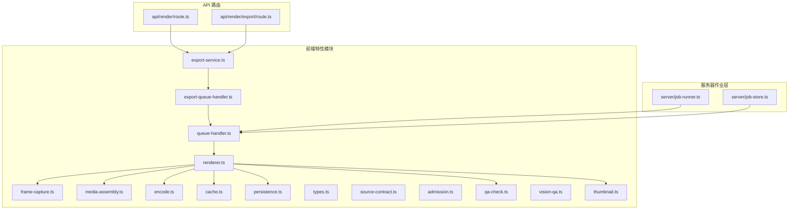
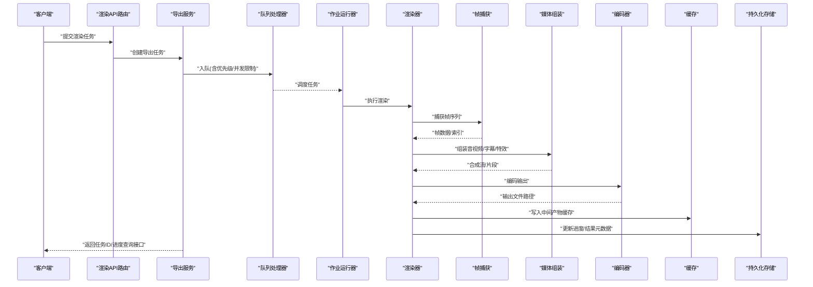
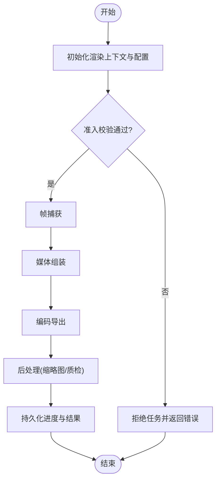
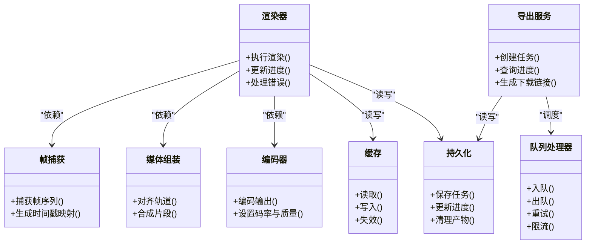

# 渲染流水线

<cite>
**本文引用的文件**   
- [src/features/render/renderer.ts](file://src/features/render/renderer.ts)
- [src/features/render/frame-capture.ts](file://src/features/render/frame-capture.ts)
- [src/features/render/media-assembly.ts](file://src/features/render/media-assembly.ts)
- [src/features/render/encode.ts](file://src/features/render/encode.ts)
- [src/features/render/export-service.ts](file://src/features/render/export-service.ts)
- [src/features/render/export-queue-handler.ts](file://src/features/render/export-queue-handler.ts)
- [src/features/render/queue-handler.ts](file://src/features/render/queue-handler.ts)
- [src/features/render/cache.ts](file://src/features/render/cache.ts)
- [src/features/render/persistence.ts](file://src/features/render/persistence.ts)
- [src/features/render/types.ts](file://src/features/render/types.ts)
- [src/features/render/source-contract.ts](file://src/features/render/source-contract.ts)
- [src/features/render/admission.ts](file://src/features/render/admission.ts)
- [src/features/render/qa-check.ts](file://src/features/render/qa-check.ts)
- [src/features/render/vision-qa.ts](file://src/features/render/vision-qa.ts)
- [src/features/render/thumbnail.ts](file://src/features/render/thumbnail.ts)
- [src/app/api/render/route.ts](file://src/app/api/render/route.ts)
- [src/app/api/render/export/route.ts](file://src/app/api/render/export/route.ts)
- [server/src/server/job-runner.ts](file://server/src/server/job-runner.ts)
- [server/src/server/job-store.ts](file://server/src/server/job-store.ts)
</cite>

## 目录
1. [简介](#简介)
2. [项目结构](#项目结构)
3. [核心组件](#核心组件)
4. [架构总览](#架构总览)
5. [详细组件分析](#详细组件分析)
6. [依赖关系分析](#依赖关系分析)
7. [性能考虑](#性能考虑)
8. [故障排查指南](#故障排查指南)
9. [结论](#结论)
10. [附录](#附录)

## 简介
本文件面向“渲染流水线”的完整处理链路，覆盖从帧捕获、媒体组装到编码导出的端到端流程；同时阐述渲染状态管理（任务调度、进度跟踪、错误处理）、渲染配置系统（输出格式、质量参数、性能优化）以及渲染队列管理（并发控制、资源分配、负载均衡）。文档以代码级为依据，配合图示帮助读者快速理解并落地调优。

## 项目结构
渲染相关能力集中在前端特性模块与服务器作业执行层：
- 前端特性模块 src/features/render：封装渲染核心逻辑（渲染器、帧捕获、媒体组装、编码、导出服务、队列处理器、缓存、持久化、类型与契约等）。
- API 路由 src/app/api/render：暴露创建渲染任务、导出结果等接口。
- 服务器作业执行 server/src/server：提供作业运行器与存储，负责后台任务的调度与生命周期管理。

图表来源 
- [src/features/render/renderer.ts](file://src/features/render/renderer.ts)
- [src/features/render/frame-capture.ts](file://src/features/render/frame-capture.ts)
- [src/features/render/media-assembly.ts](file://src/features/render/media-assembly.ts)
- [src/features/render/encode.ts](file://src/features/render/encode.ts)
- [src/features/render/export-service.ts](file://src/features/render/export-service.ts)
- [src/features/render/export-queue-handler.ts](file://src/features/render/export-queue-handler.ts)
- [src/features/render/queue-handler.ts](file://src/features/render/queue-handler.ts)
- [src/features/render/cache.ts](file://src/features/render/cache.ts)
- [src/features/render/persistence.ts](file://src/features/render/persistence.ts)
- [src/features/render/types.ts](file://src/features/render/types.ts)
- [src/features/render/source-contract.ts](file://src/features/render/source-contract.ts)
- [src/features/render/admission.ts](file://src/features/render/admission.ts)
- [src/features/render/qa-check.ts](file://src/features/render/qa-check.ts)
- [src/features/render/vision-qa.ts](file://src/features/render/vision-qa.ts)
- [src/features/render/thumbnail.ts](file://src/features/render/thumbnail.ts)
- [src/app/api/render/route.ts](file://src/app/api/render/route.ts)
- [src/app/api/render/export/route.ts](file://src/app/api/render/export/route.ts)
- [server/src/server/job-runner.ts](file://server/src/server/job-runner.ts)
- [server/src/server/job-store.ts](file://server/src/server/job-store.ts)

章节来源
- [src/features/render/renderer.ts](file://src/features/render/renderer.ts)
- [src/app/api/render/route.ts](file://src/app/api/render/route.ts)
- [server/src/server/job-runner.ts](file://server/src/server/job-runner.ts)

## 核心组件
- 渲染器（Renderer）：编排帧捕获、媒体组装、编码导出全流程，维护渲染上下文与进度。
- 帧捕获（Frame Capture）：基于浏览器驱动或模拟驱动抓取页面帧，支持多分辨率与视口适配。
- 媒体组装（Media Assembly）：将帧序列与音轨、字幕、特效进行时间轴对齐与合成。
- 编码器（Encoder）：调用底层编解码库生成目标容器与码率策略的输出文件。
- 导出服务（Export Service）：对外暴露导出入口，协调队列、缓存、持久化与结果回传。
- 队列处理器（Queue Handler / Export Queue Handler）：实现任务入队、出队、重试、限流与并发控制。
- 缓存（Cache）：对中间产物（如帧、片段）进行缓存，提升重复渲染效率。
- 持久化（Persistence）：保存渲染任务元数据、进度、中间产物索引与最终产物位置。
- 类型与契约（Types, Source Contract）：定义渲染输入输出结构、节点数据契约与校验规则。
- 准入与质检（Admission, QA Check, Vision QA）：任务准入校验与视觉/音频质量检查。
- 缩略图（Thumbnail）：为输出视频生成预览缩略图。

章节来源
- [src/features/render/renderer.ts](file://src/features/render/renderer.ts)
- [src/features/render/frame-capture.ts](file://src/features/render/frame-capture.ts)
- [src/features/render/media-assembly.ts](file://src/features/render/media-assembly.ts)
- [src/features/render/encode.ts](file://src/features/render/encode.ts)
- [src/features/render/export-service.ts](file://src/features/render/export-service.ts)
- [src/features/render/export-queue-handler.ts](file://src/features/render/export-queue-handler.ts)
- [src/features/render/queue-handler.ts](file://src/features/render/queue-handler.ts)
- [src/features/render/cache.ts](file://src/features/render/cache.ts)
- [src/features/render/persistence.ts](file://src/features/render/persistence.ts)
- [src/features/render/types.ts](file://src/features/render/types.ts)
- [src/features/render/source-contract.ts](file://src/features/render/source-contract.ts)
- [src/features/render/admission.ts](file://src/features/render/admission.ts)
- [src/features/render/qa-check.ts](file://src/features/render/qa-check.ts)
- [src/features/render/vision-qa.ts](file://src/features/render/vision-qa.ts)
- [src/features/render/thumbnail.ts](file://src/features/render/thumbnail.ts)

## 架构总览
渲染流水线采用“API 路由 -> 导出服务 -> 队列处理器 -> 渲染器 -> 子模块”的分层架构。API 路由接收请求并创建任务；导出服务负责编排与状态同步；队列处理器承担并发与重试；渲染器串联帧捕获、媒体组装与编码；缓存与持久化贯穿全链路以提升稳定性与可恢复性。

图表来源 
- [src/app/api/render/route.ts](file://src/app/api/render/route.ts)
- [src/features/render/export-service.ts](file://src/features/render/export-service.ts)
- [src/features/render/export-queue-handler.ts](file://src/features/render/export-queue-handler.ts)
- [server/src/server/job-runner.ts](file://server/src/server/job-runner.ts)
- [src/features/render/renderer.ts](file://src/features/render/renderer.ts)
- [src/features/render/frame-capture.ts](file://src/features/render/frame-capture.ts)
- [src/features/render/media-assembly.ts](file://src/features/render/media-assembly.ts)
- [src/features/render/encode.ts](file://src/features/render/encode.ts)
- [src/features/render/cache.ts](file://src/features/render/cache.ts)
- [src/features/render/persistence.ts](file://src/features/render/persistence.ts)

## 详细组件分析

### 渲染器（Renderer）
- 职责：统一编排帧捕获、媒体组装、编码导出；维护渲染上下文（分辨率、时长、轨道信息）、进度回调与错误传播。
- 关键流程：
  - 初始化上下文与配置（分辨率、帧率、码率、质量参数）。
  - 触发帧捕获，获取帧序列与时间戳。
  - 调用媒体组装，合并音轨、字幕、转场效果。
  - 调用编码器生成目标格式文件。
  - 更新进度与持久化状态，必要时触发缩略图生成与质检。
- 错误处理：捕获各阶段异常，记录上下文快照，支持重试与降级策略。
- 性能优化：启用缓存命中跳过已存在片段；并行读取与编码流水线；按需加载媒体。

图表来源 
- [src/features/render/renderer.ts](file://src/features/render/renderer.ts)
- [src/features/render/admission.ts](file://src/features/render/admission.ts)
- [src/features/render/thumbnail.ts](file://src/features/render/thumbnail.ts)
- [src/features/render/qa-check.ts](file://src/features/render/qa-check.ts)

章节来源
- [src/features/render/renderer.ts](file://src/features/render/renderer.ts)
- [src/features/render/admission.ts](file://src/features/render/admission.ts)
- [src/features/render/thumbnail.ts](file://src/features/render/thumbnail.ts)
- [src/features/render/qa-check.ts](file://src/features/render/qa-check.ts)

### 帧捕获（Frame Capture）
- 职责：根据渲染上下文生成帧序列，支持不同分辨率、视口与设备像素比；可选使用模拟驱动加速测试。
- 关键点：
  - 视口与布局一致性保证。
  - 帧去重与增量更新（结合缓存键）。
  - 超时与重试机制，避免阻塞。
- 输出：有序帧数组与时间戳映射，供媒体组装使用。

章节来源
- [src/features/render/frame-capture.ts](file://src/features/render/frame-capture.ts)

### 媒体组装（Media Assembly）
- 职责：将帧序列与音轨、字幕、特效进行时间轴对齐与合成，输出可编码的媒体片段或流。
- 关键点：
  - 时间基准统一（帧率、采样率、时基）。
  - 轨道混合策略（音量、淡入淡出、交叉溶解）。
  - 内存与磁盘缓冲策略，避免大文件占用过多内存。
- 输出：合成后的媒体片段列表或流式数据。

章节来源
- [src/features/render/media-assembly.ts](file://src/features/render/media-assembly.ts)

### 编码器（Encoder）
- 职责：将合成媒体编码为目标容器与格式（如 MP4/H.264、WebM/VVP9），支持码率控制与质量参数。
- 关键点：
  - 码率模式（CBR/CRF/VBR）与目标文件大小约束。
  - 硬件加速开关与回退策略。
  - 分段编码与拼接，降低单次内存峰值。
- 输出：最终视频文件路径与元数据（时长、分辨率、码率）。

章节来源
- [src/features/render/encode.ts](file://src/features/render/encode.ts)

### 导出服务（Export Service）
- 职责：对外暴露导出入口，协调队列、缓存、持久化与结果回传；提供进度查询与取消能力。
- 关键点：
  - 任务生命周期管理（创建、排队、执行、完成、失败）。
  - 进度事件推送（SSE/轮询）。
  - 结果下载链接生成与过期策略。
- 集成点：API 路由、队列处理器、持久化存储。

章节来源
- [src/features/render/export-service.ts](file://src/features/render/export-service.ts)
- [src/app/api/render/route.ts](file://src/app/api/render/route.ts)

### 队列处理器（Queue Handler / Export Queue Handler）
- 职责：实现任务入队、出队、重试、限流与并发控制；支持优先级与资源隔离。
- 关键点：
  - 并发度上限与队列长度限制。
  - 任务优先级与公平调度。
  - 失败重试与死信队列。
  - 资源分配（CPU/GPU/IO）与负载均衡。
- 与作业运行器协作：由作业运行器拉取任务并委派给渲染器执行。

章节来源
- [src/features/render/queue-handler.ts](file://src/features/render/queue-handler.ts)
- [src/features/render/export-queue-handler.ts](file://src/features/render/export-queue-handler.ts)
- [server/src/server/job-runner.ts](file://server/src/server/job-runner.ts)
- [server/src/server/job-store.ts](file://server/src/server/job-store.ts)

### 缓存（Cache）
- 职责：缓存中间产物（帧、片段、部分编码结果），减少重复计算。
- 关键点：
  - 缓存键策略（输入哈希、配置指纹）。
  - TTL 与淘汰策略（LRU/LFU）。
  - 分布式共享缓存支持（可选）。
- 收益：显著缩短重复渲染耗时，降低 IO 压力。

章节来源
- [src/features/render/cache.ts](file://src/features/render/cache.ts)

### 持久化（Persistence）
- 职责：持久化任务元数据、进度、中间产物索引与最终产物位置。
- 关键点：
  - 原子写入与事务保障。
  - 断点续跑与状态恢复。
  - 清理策略（临时文件、过期产物）。
- 与缓存协同：优先读缓存，未命中再落盘。

章节来源
- [src/features/render/persistence.ts](file://src/features/render/persistence.ts)

### 类型与契约（Types, Source Contract）
- 职责：定义渲染输入输出结构、节点数据契约与校验规则，确保上下游一致。
- 关键点：
  - 严格类型约束与运行时校验。
  - 向后兼容字段演进策略。
  - 错误码与消息规范。

章节来源
- [src/features/render/types.ts](file://src/features/render/types.ts)
- [src/features/render/source-contract.ts](file://src/features/render/source-contract.ts)

### 准入与质检（Admission, QA Check, Vision QA）
- 准入校验：在任务进入流水线前验证输入合法性、资源配额与依赖可用性。
- 质检：
  - 通用质检（时长、分辨率、码率范围、黑帧检测）。
  - 视觉质检（Vision QA）：抽样帧对比、色彩空间校验、画面完整性。
- 失败策略：阻断导出、标记警告或自动修复（如裁剪黑边）。

章节来源
- [src/features/render/admission.ts](file://src/features/render/admission.ts)
- [src/features/render/qa-check.ts](file://src/features/render/qa-check.ts)
- [src/features/render/vision-qa.ts](file://src/features/render/vision-qa.ts)

### 缩略图（Thumbnail）
- 职责：为输出视频生成预览缩略图，便于列表展示与快速预览。
- 关键点：
  - 时间点选择（首帧/黄金帧）。
  - 尺寸与格式压缩策略。
  - 异步生成与缓存命中。

章节来源
- [src/features/render/thumbnail.ts](file://src/features/render/thumbnail.ts)

## 依赖关系分析
渲染器依赖帧捕获、媒体组装、编码器、缓存与持久化；导出服务依赖队列处理器与持久化；API 路由依赖导出服务；作业运行器依赖队列处理器与持久化。整体耦合清晰，职责单一，便于扩展与替换。

图表来源 
- [src/features/render/renderer.ts](file://src/features/render/renderer.ts)
- [src/features/render/frame-capture.ts](file://src/features/render/frame-capture.ts)
- [src/features/render/media-assembly.ts](file://src/features/render/media-assembly.ts)
- [src/features/render/encode.ts](file://src/features/render/encode.ts)
- [src/features/render/export-service.ts](file://src/features/render/export-service.ts)
- [src/features/render/export-queue-handler.ts](file://src/features/render/export-queue-handler.ts)
- [src/features/render/queue-handler.ts](file://src/features/render/queue-handler.ts)
- [src/features/render/cache.ts](file://src/features/render/cache.ts)
- [src/features/render/persistence.ts](file://src/features/render/persistence.ts)

章节来源
- [src/features/render/renderer.ts](file://src/features/render/renderer.ts)
- [src/features/render/export-service.ts](file://src/features/render/export-service.ts)
- [src/features/render/export-queue-handler.ts](file://src/features/render/export-queue-handler.ts)
- [src/features/render/queue-handler.ts](file://src/features/render/queue-handler.ts)
- [src/features/render/cache.ts](file://src/features/render/cache.ts)
- [src/features/render/persistence.ts](file://src/features/render/persistence.ts)

## 性能考虑
- 缓存策略：
  - 对帧与片段启用强缓存键（输入+配置指纹），命中即跳过。
  - 分层缓存（内存+磁盘），热点数据常驻内存。
- 并发与流水线：
  - 帧捕获与编码并行，媒体组装分片处理，降低峰值内存。
  - 队列并发度按 CPU/GPU/IO 动态调整，避免过载。
- 编码优化：
  - 优先 CRF 模式平衡质量与体积；必要时使用两遍编码。
  - 启用硬件加速，失败自动回退软件编码。
- I/O 优化：
  - 顺序读写与零拷贝策略，减少磁盘抖动。
  - 临时文件分区与定期清理。
- 监控与度量：
  - 关键指标：队列长度、平均等待时间、编码吞吐、缓存命中率、失败率。
  - 告警阈值与自动扩缩容。

[本节为通用指导，不直接分析具体文件]

## 故障排查指南
- 常见问题定位：
  - 任务无法入队：检查队列容量、优先级与资源配额。
  - 帧捕获失败：确认浏览器驱动可用、视口与权限设置。
  - 媒体组装错位：核对时间基准与轨道对齐参数。
  - 编码失败：检查编码器版本、硬件加速与码率配置。
  - 缓存不一致：清理缓存键冲突，强制重建中间产物。
  - 持久化异常：检查事务与原子写入，恢复断点状态。
- 诊断手段：
  - 启用详细日志与上下文快照。
  - 使用质检工具抽样检查帧与音轨。
  - 回放任务输入与配置，复现问题。
- 恢复策略：
  - 重试与降级（切换编码器/关闭硬件加速）。
  - 断点续跑与增量渲染。
  - 清理死锁任务与释放资源。

章节来源
- [src/features/render/qa-check.ts](file://src/features/render/qa-check.ts)
- [src/features/render/vision-qa.ts](file://src/features/render/vision-qa.ts)
- [src/features/render/cache.ts](file://src/features/render/cache.ts)
- [src/features/render/persistence.ts](file://src/features/render/persistence.ts)

## 结论
本渲染流水线通过清晰的模块化设计与稳健的队列/缓存/持久化机制，实现了从帧捕获到编码导出的高效、可靠处理。合理配置输出格式与质量参数、利用缓存与并发优化、完善错误处理与质检，可在保证质量的前提下显著提升吞吐与稳定性。建议在生产环境持续监控关键指标，并根据负载动态调整并发与资源分配。

[本节为总结性内容，不直接分析具体文件]

## 附录
- 渲染配置要点：
  - 输出格式：MP4/H.264、WebM/VVP9、AV1 等。
  - 质量参数：码率模式（CBR/CRF/VBR）、目标大小、分辨率与帧率。
  - 性能选项：硬件加速开关、分片大小、缓存策略、并发度上限。
- 队列管理建议：
  - 优先级队列与公平调度，避免饥饿。
  - 失败重试次数与退避策略。
  - 资源隔离与负载均衡，防止热点任务阻塞。
- 最佳实践：
  - 输入校验前置，尽早失败。
  - 中间产物可恢复，支持断点续跑。
  - 质检与缩略图异步执行，不影响主流程。

[本节为补充说明，不直接分析具体文件]