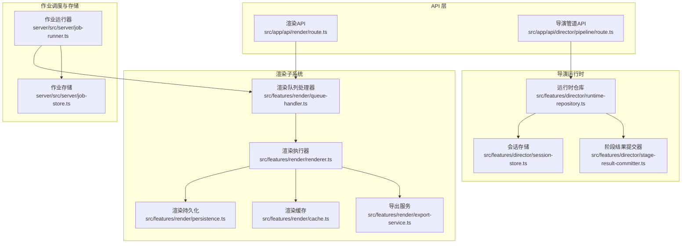
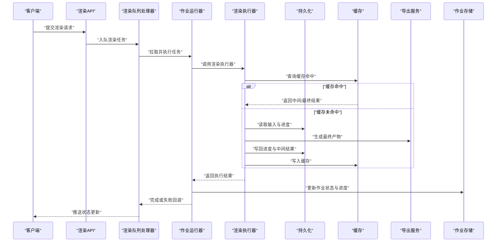
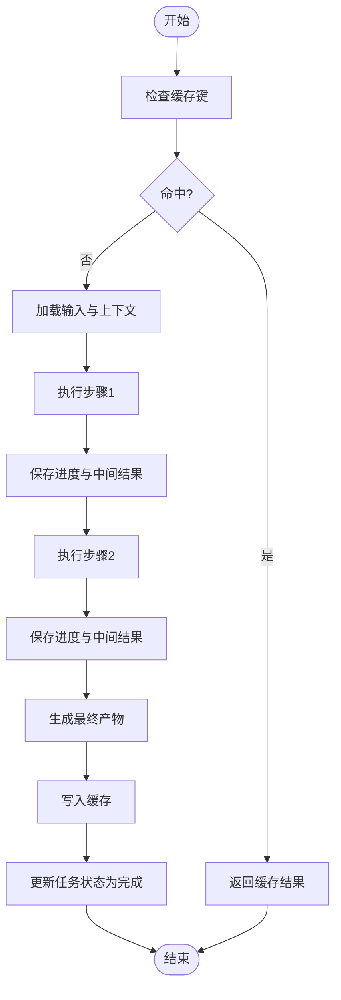
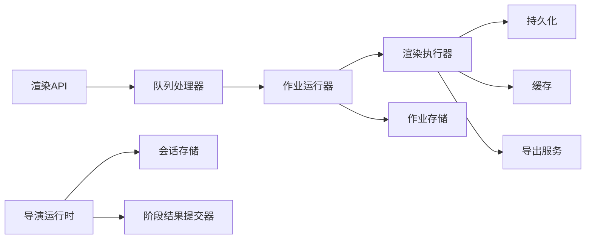

# 渲染状态管理

<cite>
**本文引用的文件**   
- [server/src/server/job-runner.ts](file://server/src/server/job-runner.ts)
- [server/src/server/job-store.ts](file://server/src/server/job-store.ts)
- [src/features/render/renderer.ts](file://src/features/render/renderer.ts)
- [src/features/render/persistence.ts](file://src/features/render/persistence.ts)
- [src/features/render/cache.ts](file://src/features/render/cache.ts)
- [src/features/render/export-service.ts](file://src/features/render/export-service.ts)
- [src/features/render/queue-handler.ts](file://src/features/render/queue-handler.ts)
- [src/features/director/runtime-repository.ts](file://src/features/director/runtime-repository.ts)
- [src/features/director/session-store.ts](file://src/features/director/session-store.ts)
- [src/features/director/stage-result-committer.ts](file://src/features/director/stage-result-committer.ts)
- [src/app/api/render/route.ts](file://src/app/api/render/route.ts)
- [src/app/api/director/pipeline/route.ts](file://src/app/api/director/pipeline/route.ts)
</cite>

## 目录
1. [简介](#简介)
2. [项目结构](#项目结构)
3. [核心组件](#核心组件)
4. [架构总览](#架构总览)
5. [详细组件分析](#详细组件分析)
6. [依赖关系分析](#依赖关系分析)
7. [性能考量](#性能考量)
8. [故障排查指南](#故障排查指南)
9. [结论](#结论)
10. [附录](#附录)

## 简介
本文件聚焦“渲染状态管理”的完整设计与实现，覆盖以下关键主题：
- 渲染任务的持久化机制：任务状态存储、进度信息保存、中间结果缓存
- 渲染缓存策略：智能缓存、失效机制、存储空间管理
- 渲染会话管理：任务生命周期、状态转换、异常恢复
- 数据一致性保证：事务处理、冲突解决、数据完整性验证
- 状态管理与缓存优化的最佳实践

目标读者包括后端工程师、前端集成人员与运维人员，文档以循序渐进的方式呈现系统架构与实现细节，并辅以可视化图示帮助理解。

## 项目结构
围绕渲染状态管理的代码主要分布在以下模块：
- 服务端作业调度与持久化：job-runner、job-store
- 渲染管线与执行器：renderer、persistence、cache
- 导出服务与队列处理器：export-service、queue-handler
- 导演（Director）运行时与阶段提交：runtime-repository、session-store、stage-result-committer
- API 路由入口：render、director pipeline

图表来源
- [src/app/api/render/route.ts](file://src/app/api/render/route.ts)
- [src/app/api/director/pipeline/route.ts](file://src/app/api/director/pipeline/route.ts)
- [src/features/render/renderer.ts](file://src/features/render/renderer.ts)
- [src/features/render/persistence.ts](file://src/features/render/persistence.ts)
- [src/features/render/cache.ts](file://src/features/render/cache.ts)
- [src/features/render/export-service.ts](file://src/features/render/export-service.ts)
- [src/features/render/queue-handler.ts](file://src/features/render/queue-handler.ts)
- [server/src/server/job-runner.ts](file://server/src/server/job-runner.ts)
- [server/src/server/job-store.ts](file://server/src/server/job-store.ts)
- [src/features/director/runtime-repository.ts](file://src/features/director/runtime-repository.ts)
- [src/features/director/session-store.ts](file://src/features/director/session-store.ts)
- [src/features/director/stage-result-committer.ts](file://src/features/director/stage-result-committer.ts)

章节来源
- [src/app/api/render/route.ts](file://src/app/api/render/route.ts)
- [src/app/api/director/pipeline/route.ts](file://src/app/api/director/pipeline/route.ts)
- [server/src/server/job-runner.ts](file://server/src/server/job-runner.ts)
- [server/src/server/job-store.ts](file://server/src/server/job-store.ts)
- [src/features/render/renderer.ts](file://src/features/render/renderer.ts)
- [src/features/render/persistence.ts](file://src/features/render/persistence.ts)
- [src/features/render/cache.ts](file://src/features/render/cache.ts)
- [src/features/render/export-service.ts](file://src/features/render/export-service.ts)
- [src/features/render/queue-handler.ts](file://src/features/render/queue-handler.ts)
- [src/features/director/runtime-repository.ts](file://src/features/director/runtime-repository.ts)
- [src/features/director/session-store.ts](file://src/features/director/session-store.ts)
- [src/features/director/stage-result-committer.ts](file://src/features/director/stage-result-committer.ts)

## 核心组件
- 渲染执行器（renderer）：编排渲染步骤，协调输入读取、中间产物生成、最终输出写入，并与持久化与缓存交互
- 持久化（persistence）：负责任务元数据、进度、中间结果的落盘与恢复
- 缓存（cache）：提供智能缓存、键生成、失效与空间管理
- 导出服务（export-service）：封装导出流程，统一输出格式与质量参数
- 队列处理器（queue-handler）：消费渲染任务，驱动执行器工作，处理重试与错误
- 作业运行器（job-runner）：通用作业调度与生命周期管理
- 作业存储（job-store）：作业状态与进度的持久化存储
- 导演运行时（runtime-repository）：导演阶段的运行时上下文与产物读写
- 会话存储（session-store）：会话级状态与中间数据的持久化
- 阶段结果提交器（stage-result-committer）：原子提交阶段结果，确保一致性

章节来源
- [src/features/render/renderer.ts](file://src/features/render/renderer.ts)
- [src/features/render/persistence.ts](file://src/features/render/persistence.ts)
- [src/features/render/cache.ts](file://src/features/render/cache.ts)
- [src/features/render/export-service.ts](file://src/features/render/export-service.ts)
- [src/features/render/queue-handler.ts](file://src/features/render/queue-handler.ts)
- [server/src/server/job-runner.ts](file://server/src/server/job-runner.ts)
- [server/src/server/job-store.ts](file://server/src/server/job-store.ts)
- [src/features/director/runtime-repository.ts](file://src/features/director/runtime-repository.ts)
- [src/features/director/session-store.ts](file://src/features/director/session-store.ts)
- [src/features/director/stage-result-committer.ts](file://src/features/director/stage-result-committer.ts)

## 架构总览
渲染状态管理采用“API 路由 -> 队列处理器 -> 渲染执行器 -> 持久化/缓存/导出”的分层架构，配合“作业运行器 + 作业存储”的通用调度能力，以及“导演运行时 + 会话存储 + 阶段结果提交器”的一致性保障。

图表来源
- [src/app/api/render/route.ts](file://src/app/api/render/route.ts)
- [src/features/render/queue-handler.ts](file://src/features/render/queue-handler.ts)
- [server/src/server/job-runner.ts](file://server/src/server/job-runner.ts)
- [src/features/render/renderer.ts](file://src/features/render/renderer.ts)
- [src/features/render/persistence.ts](file://src/features/render/persistence.ts)
- [src/features/render/cache.ts](file://src/features/render/cache.ts)
- [src/features/render/export-service.ts](file://src/features/render/export-service.ts)
- [server/src/server/job-store.ts](file://server/src/server/job-store.ts)

## 详细组件分析

### 渲染执行器（renderer）
- 职责：编排渲染步骤，协调输入读取、中间产物生成、最终输出写入；与持久化和缓存交互，支持断点续跑与增量更新
- 关键点：
  - 步骤级进度上报：每步完成后更新进度与中间结果
  - 缓存优先：在计算前检查缓存键，命中则跳过昂贵步骤
  - 异常恢复：捕获异常并记录到持久化，支持重试与回滚

图表来源
- [src/features/render/renderer.ts](file://src/features/render/renderer.ts)
- [src/features/render/persistence.ts](file://src/features/render/persistence.ts)
- [src/features/render/cache.ts](file://src/features/render/cache.ts)

章节来源
- [src/features/render/renderer.ts](file://src/features/render/renderer.ts)
- [src/features/render/persistence.ts](file://src/features/render/persistence.ts)
- [src/features/render/cache.ts](file://src/features/render/cache.ts)

### 持久化（persistence）
- 职责：任务元数据、进度、中间结果的持久化与恢复；支持幂等写入与版本控制
- 关键点：
  - 原子写入：使用事务或原子操作避免部分写入导致的不一致
  - 版本化：对中间结果进行版本标记，便于回滚与清理
  - 校验：写入后校验完整性（如哈希或长度）

章节来源
- [src/features/render/persistence.ts](file://src/features/render/persistence.ts)

### 缓存（cache）
- 职责：智能缓存、键生成、失效与空间管理
- 关键点：
  - 键生成：基于输入摘要与配置参数生成稳定键
  - 失效策略：TTL、LRU、按任务/项目维度清理
  - 空间管理：容量上限、淘汰策略、碎片整理

章节来源
- [src/features/render/cache.ts](file://src/features/render/cache.ts)

### 导出服务（export-service）
- 职责：统一导出流程，封装编码、拼接、质量参数与输出路径
- 关键点：
  - 可插拔编码器：根据媒体类型选择编码器
  - 进度反馈：导出过程中上报进度与中间产物
  - 错误处理：失败时回滚中间产物并记录原因

章节来源
- [src/features/render/export-service.ts](file://src/features/render/export-service.ts)

### 队列处理器（queue-handler）
- 职责：消费渲染任务，驱动执行器工作，处理重试与错误
- 关键点：
  - 并发控制：限制并行度，避免资源争用
  - 重试策略：指数退避与最大重试次数
  - 状态同步：将执行状态同步至作业存储

章节来源
- [src/features/render/queue-handler.ts](file://src/features/render/queue-handler.ts)

### 作业运行器（job-runner）与作业存储（job-store）
- 职责：通用作业调度与生命周期管理；作业状态与进度的持久化存储
- 关键点：
  - 生命周期：创建、排队、执行、完成、失败、取消
  - 状态机：严格的状态转换规则，防止非法转移
  - 存储一致性：读写锁或事务保证一致性

章节来源
- [server/src/server/job-runner.ts](file://server/src/server/job-runner.ts)
- [server/src/server/job-store.ts](file://server/src/server/job-store.ts)

### 导演运行时（runtime-repository）、会话存储（session-store）、阶段结果提交器（stage-result-committer）
- 职责：导演阶段的运行时上下文与产物读写；会话级状态与中间数据的持久化；原子提交阶段结果，确保一致性
- 关键点：
  - 上下文隔离：每个会话独立上下文，避免交叉污染
  - 原子提交：多阶段结果一次性提交，失败则全部回滚
  - 校验与审计：提交前后校验完整性，记录审计日志

章节来源
- [src/features/director/runtime-repository.ts](file://src/features/director/runtime-repository.ts)
- [src/features/director/session-store.ts](file://src/features/director/session-store.ts)
- [src/features/director/stage-result-committer.ts](file://src/features/director/stage-result-committer.ts)

## 依赖关系分析
渲染状态管理的关键依赖如下：
- API 路由依赖队列处理器与渲染执行器
- 渲染执行器依赖持久化、缓存与导出服务
- 作业运行器依赖作业存储与队列处理器
- 导演运行时依赖会话存储与阶段结果提交器

图表来源
- [src/app/api/render/route.ts](file://src/app/api/render/route.ts)
- [src/features/render/queue-handler.ts](file://src/features/render/queue-handler.ts)
- [server/src/server/job-runner.ts](file://server/src/server/job-runner.ts)
- [src/features/render/renderer.ts](file://src/features/render/renderer.ts)
- [src/features/render/persistence.ts](file://src/features/render/persistence.ts)
- [src/features/render/cache.ts](file://src/features/render/cache.ts)
- [src/features/render/export-service.ts](file://src/features/render/export-service.ts)
- [server/src/server/job-store.ts](file://server/src/server/job-store.ts)
- [src/features/director/runtime-repository.ts](file://src/features/director/runtime-repository.ts)
- [src/features/director/session-store.ts](file://src/features/director/session-store.ts)
- [src/features/director/stage-result-committer.ts](file://src/features/director/stage-result-committer.ts)

章节来源
- [src/app/api/render/route.ts](file://src/app/api/render/route.ts)
- [src/features/render/queue-handler.ts](file://src/features/render/queue-handler.ts)
- [server/src/server/job-runner.ts](file://server/src/server/job-runner.ts)
- [src/features/render/renderer.ts](file://src/features/render/renderer.ts)
- [src/features/render/persistence.ts](file://src/features/render/persistence.ts)
- [src/features/render/cache.ts](file://src/features/render/cache.ts)
- [src/features/render/export-service.ts](file://src/features/render/export-service.ts)
- [server/src/server/job-store.ts](file://server/src/server/job-store.ts)
- [src/features/director/runtime-repository.ts](file://src/features/director/runtime-repository.ts)
- [src/features/director/session-store.ts](file://src/features/director/session-store.ts)
- [src/features/director/stage-result-committer.ts](file://src/features/director/stage-result-committer.ts)

## 性能考量
- 缓存命中率优化：合理设计键生成策略，减少冷启动与重复计算
- 渐进式持久化：分块写入与批量提交，降低IO压力
- 并发控制：限制渲染并发度，避免CPU/IO瓶颈
- 内存管理：及时释放中间结果，避免内存泄漏
- 监控与指标：采集缓存命中率、任务耗时、失败率等关键指标

[本节为通用指导，不直接分析具体文件]

## 故障排查指南
- 常见问题定位：
  - 任务卡住：检查队列堆积、作业状态、持久化写入是否成功
  - 缓存不一致：核对键生成逻辑与失效策略，检查缓存容量与淘汰
  - 导出失败：查看编码器日志与输出路径权限
  - 导演阶段失败：检查会话上下文与阶段提交器的原子性
- 调试建议：
  - 启用详细日志，记录关键步骤与异常堆栈
  - 使用快照与回放工具复现问题
  - 逐步缩小范围，隔离外部依赖（数据库、缓存、编码器）

章节来源
- [src/features/render/queue-handler.ts](file://src/features/render/queue-handler.ts)
- [server/src/server/job-runner.ts](file://server/src/server/job-runner.ts)
- [src/features/render/cache.ts](file://src/features/render/cache.ts)
- [src/features/render/export-service.ts](file://src/features/render/export-service.ts)
- [src/features/director/stage-result-committer.ts](file://src/features/director/stage-result-committer.ts)

## 结论
渲染状态管理通过分层架构与严格的持久化、缓存与会话管理，实现了高可靠、高性能与易维护的渲染流水线。结合事务与原子提交，确保了数据一致性与异常恢复能力。遵循最佳实践可进一步提升系统稳定性与资源利用率。

[本节为总结，不直接分析具体文件]

## 附录
- 术语表：
  - 渲染执行器：编排渲染步骤的核心组件
  - 持久化：任务与中间结果的落盘与恢复
  - 缓存：加速重复计算的中间结果存储
  - 导出服务：统一导出流程与输出格式
  - 队列处理器：任务消费与执行驱动
  - 作业运行器：通用作业调度与生命周期管理
  - 作业存储：作业状态与进度的持久化
  - 导演运行时：导演阶段的运行时上下文
  - 会话存储：会话级状态与中间数据
  - 阶段结果提交器：原子提交阶段结果

[本节为补充说明，不直接分析具体文件]