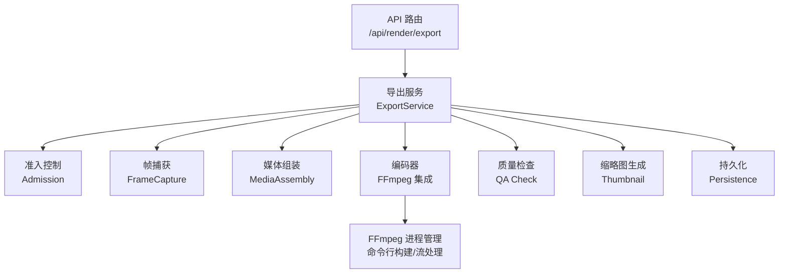
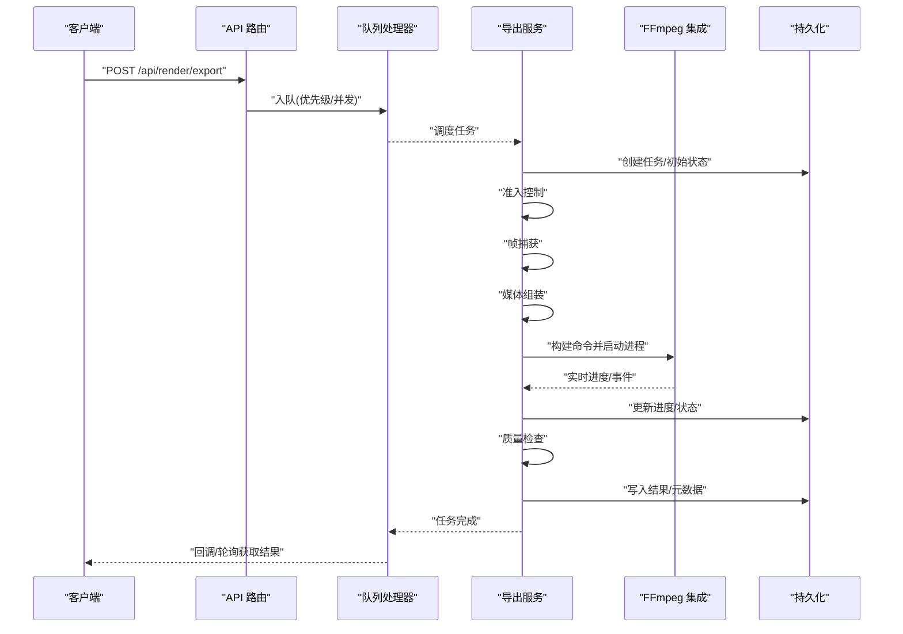
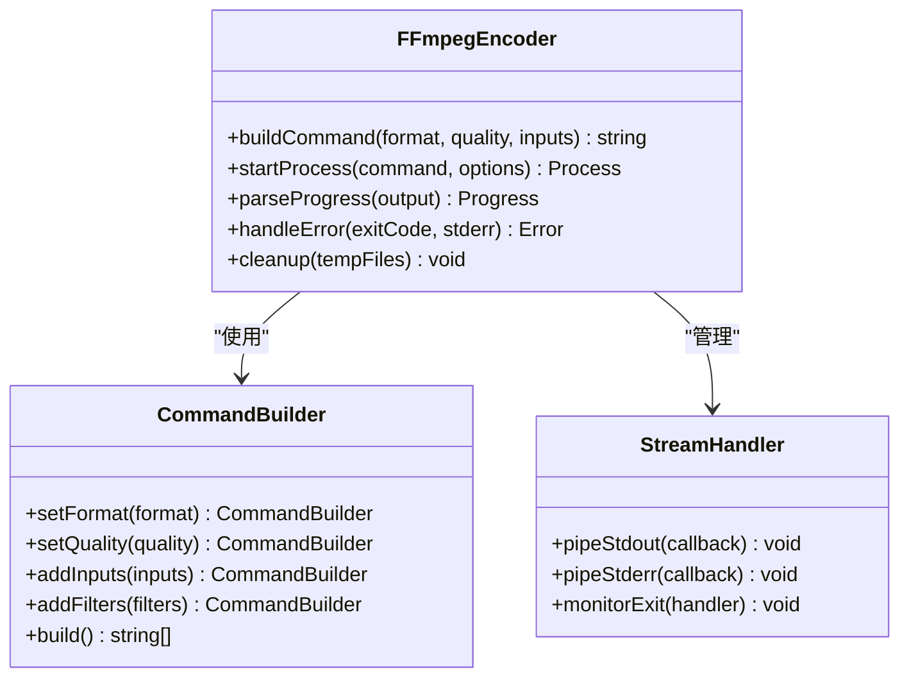
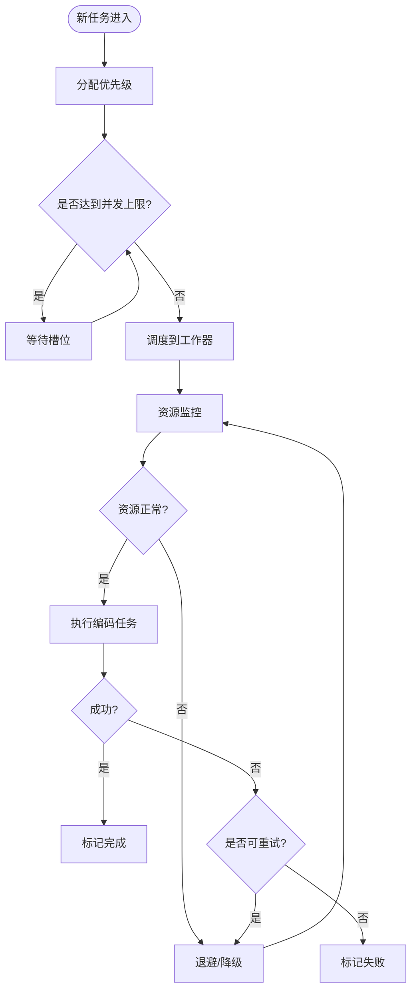
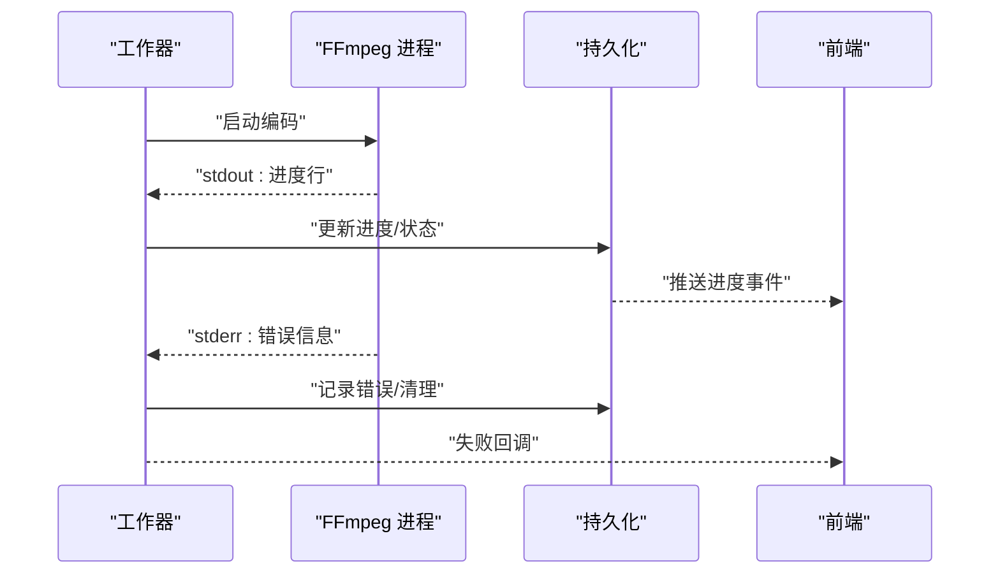
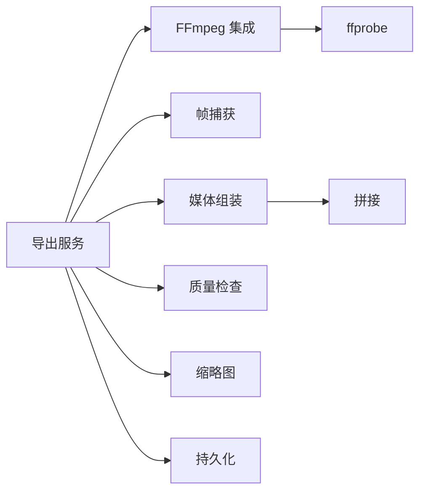

# 编码导出系统

<cite>
**本文引用的文件**   
- [encode.ts](file://src/features/render/encode.ts)
- [export-service.ts](file://src/features/render/export-service.ts)
- [export-queue-handler.ts](file://src/features/render/export-queue-handler.ts)
- [media-ffmpeg.ts](file://src/features/render/media-ffmpeg.ts)
- [frame-capture.ts](file://src/features/render/frame-capture.ts)
- [media-assembly.ts](file://src/features/render/media-assembly.ts)
- [concat.ts](file://src/features/render/concat.ts)
- [persistence.ts](file://src/features/render/persistence.ts)
- [types.ts](file://src/features/render/types.ts)
- [admission.ts](file://src/features/render/admission.ts)
- [qa-check.ts](file://src/features/render/qa-check.ts)
- [thumbnail.ts](file://src/features/render/thumbnail.ts)
- [render.ts](file://src/features/render/renderer.ts)
- [route.ts](file://src/app/api/render/export/route.ts)
</cite>

## 目录
1. [简介](#简介)
2. [项目结构](#项目结构)
3. [核心组件](#核心组件)
4. [架构总览](#架构总览)
5. [详细组件分析](#详细组件分析)
6. [依赖关系分析](#依赖关系分析)
7. [性能考量](#性能考量)
8. [故障排查指南](#故障排查指南)
9. [结论](#结论)
10. [附录](#附录)

## 简介
本文件面向“编码导出系统”的完整技术文档，聚焦 FFmpeg 集成、多格式导出（MP4、WebM、GIF）、队列与并发管理、进度跟踪与错误恢复、以及性能调优与常见问题解决方案。读者无需深入源码即可理解系统如何从渲染产物生成最终媒体文件，并在高并发场景下稳定运行。

## 项目结构
编码导出相关代码集中在 features/render 模块中，并通过 Next.js API 路由暴露对外接口。整体采用分层设计：
- 入口层：API 路由负责接收请求、参数校验与任务提交
- 编排层：导出服务协调帧捕获、媒体组装、FFmpeg 编码、质量检查与缩略图生成
- 执行层：FFmpeg 进程管理、命令行构建、输出流处理与进度上报
- 持久化层：任务状态、中间产物与结果落盘

图表来源
- [route.ts:1-200](file://src/app/api/render/export/route.ts#L1-L200)
- [export-service.ts:1-300](file://src/features/render/export-service.ts#L1-L300)
- [media-ffmpeg.ts:1-300](file://src/features/render/media-ffmpeg.ts#L1-L300)

章节来源
- [route.ts:1-200](file://src/app/api/render/export/route.ts#L1-L200)
- [export-service.ts:1-300](file://src/features/render/export-service.ts#L1-L300)

## 核心组件
- 导出服务 ExportService：统一编排导出流程，包括准入、帧捕获、媒体组装、编码、质量检查、缩略图与持久化
- FFmpeg 集成：封装 FFmpeg 调用，负责命令行参数构建、进程生命周期管理、输入输出流处理与进度解析
- 帧捕获 FrameCapture：从渲染产物或画布快照中提取帧序列
- 媒体组装 MediaAssembly：将帧序列与音频轨道合并为可编码的媒体片段
- 拼接 Concat：对分段编码结果进行无损拼接
- 质量检查 QA Check：基于 ffprobe 等工具进行时长、码率、分辨率等指标校验
- 缩略图 Thumbnail：在编码完成后快速生成预览图
- 持久化 Persistence：记录任务状态、中间产物路径、错误信息与进度

章节来源
- [export-service.ts:1-300](file://src/features/render/export-service.ts#L1-L300)
- [media-ffmpeg.ts:1-300](file://src/features/render/media-ffmpeg.ts#L1-L300)
- [frame-capture.ts:1-200](file://src/features/render/frame-capture.ts#L1-L200)
- [media-assembly.ts:1-200](file://src/features/render/media-assembly.ts#L1-L200)
- [concat.ts:1-150](file://src/features/render/concat.ts#L1-L150)
- [qa-check.ts:1-150](file://src/features/render/qa-check.ts#L1-L150)
- [thumbnail.ts:1-150](file://src/features/render/thumbnail.ts#L1-L150)
- [persistence.ts:1-200](file://src/features/render/persistence.ts#L1-L200)

## 架构总览
导出流程以“任务驱动”的方式运行，每个导出任务包含目标格式、质量参数、输入源与输出路径。系统通过队列处理器实现优先级与并发限制，确保资源可控。

图表来源
- [route.ts:1-200](file://src/app/api/render/export/route.ts#L1-L200)
- [export-queue-handler.ts:1-200](file://src/features/render/export-queue-handler.ts#L1-L200)
- [export-service.ts:1-300](file://src/features/render/export-service.ts#L1-L300)
- [media-ffmpeg.ts:1-300](file://src/features/render/media-ffmpeg.ts#L1-L300)
- [persistence.ts:1-200](file://src/features/render/persistence.ts#L1-L200)

## 详细组件分析

### FFmpeg 集成与命令行构建
- 命令行参数构建：根据目标格式（MP4/WebM/GIF）与质量参数动态生成编码器选项、滤镜链与复用器配置
- 进程管理：启动子进程、监控退出码、处理标准输出/错误流，解析进度信息（如百分比、时间戳）
- 输出流处理：支持管道模式与临时文件模式，避免大文件内存占用；提供断点续传与失败重试策略
- 多格式支持：
  - MP4：H.264/H.265 + AAC，适配 Web 播放与移动端
  - WebM：VP9/AV1 + Opus，适合网页内嵌与低延迟场景
  - GIF：调色板优化、抖动算法与帧采样，平衡体积与质量
- 质量参数：码率、CRF、预设、分辨率、帧率、音频比特率、声道数等

图表来源
- [media-ffmpeg.ts:1-300](file://src/features/render/media-ffmpeg.ts#L1-L300)
- [encode.ts:1-200](file://src/features/render/encode.ts#L1-L200)

章节来源
- [media-ffmpeg.ts:1-300](file://src/features/render/media-ffmpeg.ts#L1-L300)
- [encode.ts:1-200](file://src/features/render/encode.ts#L1-L200)

### 多格式导出与质量配置
- 格式选择建议：
  - MP4：通用兼容性最佳，适合下载与分发
  - WebM：网页内嵌与流式播放更优，体积小且支持透明通道（部分浏览器）
  - GIF：短循环动图与预览用途，注意帧率与调色板大小控制
- 质量参数映射：
  - CRF（恒定质量因子）：视频质量与体积的权衡
  - 预设（preset）：编码速度与质量的折中
  - 音频比特率：语音类内容建议 128kbps+，音乐类 192kbps+
  - 分辨率与帧率：根据展示设备与网络环境调整

章节来源
- [encode.ts:1-200](file://src/features/render/encode.ts#L1-L200)
- [types.ts:1-200](file://src/features/render/types.ts#L1-L200)

### 导出队列管理与并发控制
- 任务优先级：按紧急程度划分等级，高优先级优先调度
- 并发限制：全局并发上限与每格式并发限制，防止 CPU/IO 过载
- 资源监控：CPU、内存、磁盘 IO 与 FFmpeg 进程数监控，超限自动降级或排队
- 失败重试：指数退避与最大重试次数，避免瞬时故障导致任务丢失

图表来源
- [export-queue-handler.ts:1-200](file://src/features/render/export-queue-handler.ts#L1-L200)

章节来源
- [export-queue-handler.ts:1-200](file://src/features/render/export-queue-handler.ts#L1-L200)

### 进度跟踪与错误恢复
- 实时状态更新：通过 FFmpeg 标准输出解析进度，推送至持久化层与前端
- 进度计算：基于已处理帧数/时长与总时长计算百分比
- 错误恢复：捕获异常、记录堆栈、清理临时文件、回滚状态并通知上层

图表来源
- [media-ffmpeg.ts:1-300](file://src/features/render/media-ffmpeg.ts#L1-L300)
- [persistence.ts:1-200](file://src/features/render/persistence.ts#L1-L200)

章节来源
- [media-ffmpeg.ts:1-300](file://src/features/render/media-ffmpeg.ts#L1-L300)
- [persistence.ts:1-200](file://src/features/render/persistence.ts#L1-L200)

### 帧捕获与媒体组装
- 帧捕获：从渲染产物（HTML/Canvas）或中间文件提取帧序列，支持缩放、裁剪与转场
- 媒体组装：将视频帧与音频轨道合成，必要时插入静音段或淡入淡出效果
- 拼接：对分段编码结果进行无损拼接，保证时序一致性与音画同步

章节来源
- [frame-capture.ts:1-200](file://src/features/render/frame-capture.ts#L1-L200)
- [media-assembly.ts:1-200](file://src/features/render/media-assembly.ts#L1-L200)
- [concat.ts:1-150](file://src/features/render/concat.ts#L1-L150)

### 质量检查与缩略图生成
- 质量检查：验证时长、码率、分辨率、音频声道与关键帧间隔，不达标则告警或重编码
- 缩略图：在编码完成后抽取首帧或关键帧生成预览图，用于列表展示与缓存

章节来源
- [qa-check.ts:1-150](file://src/features/render/qa-check.ts#L1-L150)
- [thumbnail.ts:1-150](file://src/features/render/thumbnail.ts#L1-L150)

### 准入控制与渲染编排
- 准入控制：校验输入合法性、资源配额与格式支持，拒绝非法或超限任务
- 渲染编排：协调各阶段执行顺序，处理依赖与并行度，确保最终产物一致性

章节来源
- [admission.ts:1-200](file://src/features/render/admission.ts#L1-L200)
- [renderer.ts:1-300](file://src/features/render/renderer.ts#L1-L300)

## 依赖关系分析
- 组件耦合：导出服务作为中枢，依赖 FFmpeg、帧捕获、媒体组装、质量检查与持久化
- 外部依赖：FFmpeg 二进制、ffprobe、文件系统与可选的对象存储
- 潜在循环依赖：通过接口抽象与事件解耦避免循环引用

图表来源
- [export-service.ts:1-300](file://src/features/render/export-service.ts#L1-L300)
- [media-ffmpeg.ts:1-300](file://src/features/render/media-ffmpeg.ts#L1-L300)
- [frame-capture.ts:1-200](file://src/features/render/frame-capture.ts#L1-L200)
- [media-assembly.ts:1-200](file://src/features/render/media-assembly.ts#L1-L200)
- [concat.ts:1-150](file://src/features/render/concat.ts#L1-L150)
- [qa-check.ts:1-150](file://src/features/render/qa-check.ts#L1-L150)
- [thumbnail.ts:1-150](file://src/features/render/thumbnail.ts#L1-L150)
- [persistence.ts:1-200](file://src/features/render/persistence.ts#L1-L200)

章节来源
- [export-service.ts:1-300](file://src/features/render/export-service.ts#L1-L300)

## 性能考量
- 编码参数调优：
  - 合理设置 CRF 与 preset，平衡质量与速度
  - 针对硬件加速（NVENC/QuickSync）启用相应编码器
  - 音频比特率与采样率按需调整
- 并发与资源：
  - 限制同时运行的 FFmpeg 进程数，避免 CPU/IO 饱和
  - 使用管道减少临时文件 IO，降低磁盘压力
- 进度与监控：
  - 高频进度上报可能导致 I/O 瓶颈，建议批量聚合
  - 监控关键指标（CPU、内存、磁盘、进程数），设置阈值告警

## 故障排查指南
- 常见错误：
  - FFmpeg 未安装或版本不兼容：检查 PATH 与版本
  - 输入文件损坏或缺失：校验路径与权限
  - 编码失败（退出码非零）：查看 stderr 日志定位问题
  - 进度卡住：检查进程存活与 stdout 解析逻辑
- 恢复策略：
  - 自动重试与退避
  - 清理临时文件与回滚状态
  - 记录详细上下文以便复现

章节来源
- [media-ffmpeg.ts:1-300](file://src/features/render/media-ffmpeg.ts#L1-L300)
- [persistence.ts:1-200](file://src/features/render/persistence.ts#L1-L200)

## 结论
编码导出系统通过清晰的模块化设计与稳健的 FFmpeg 集成，实现了多格式、高质量、可监控的媒体导出能力。借助队列与并发控制、进度跟踪与错误恢复机制，系统在复杂生产环境中具备良好稳定性与可扩展性。建议结合业务需求持续优化编码参数与资源调度策略，以获得更佳的性能与用户体验。

## 附录
- 术语表：
  - CRF：恒定质量因子，控制视频质量与体积
  - 预设（preset）：编码速度与质量的折中配置
  - 管道模式：直接流式处理，避免中间文件
- 参考配置：
  - MP4：H.264+AAC，CRF 23，preset medium，1080p@30fps
  - WebM：VP9+Opus，CRF 30，preset slow，1080p@30fps
  - GIF：调色板 256，帧率 15，抖动开启，尺寸缩放至 480p