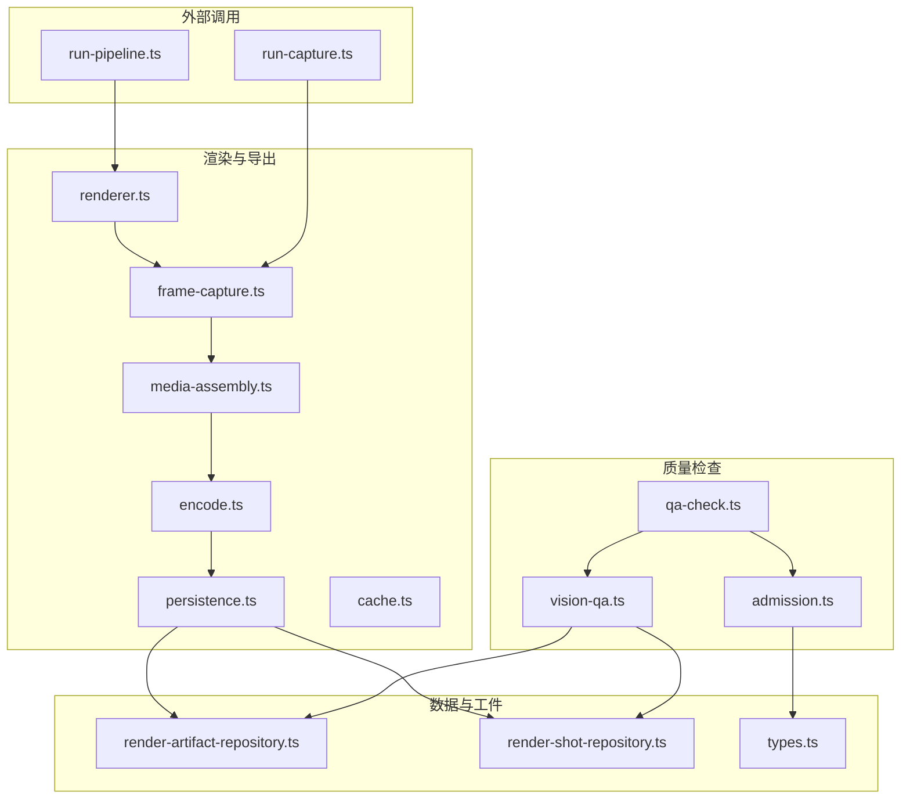
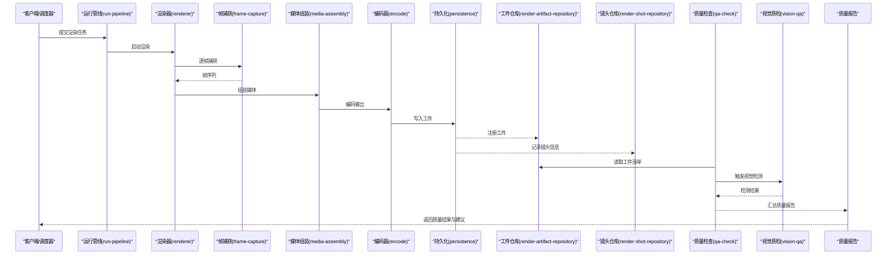
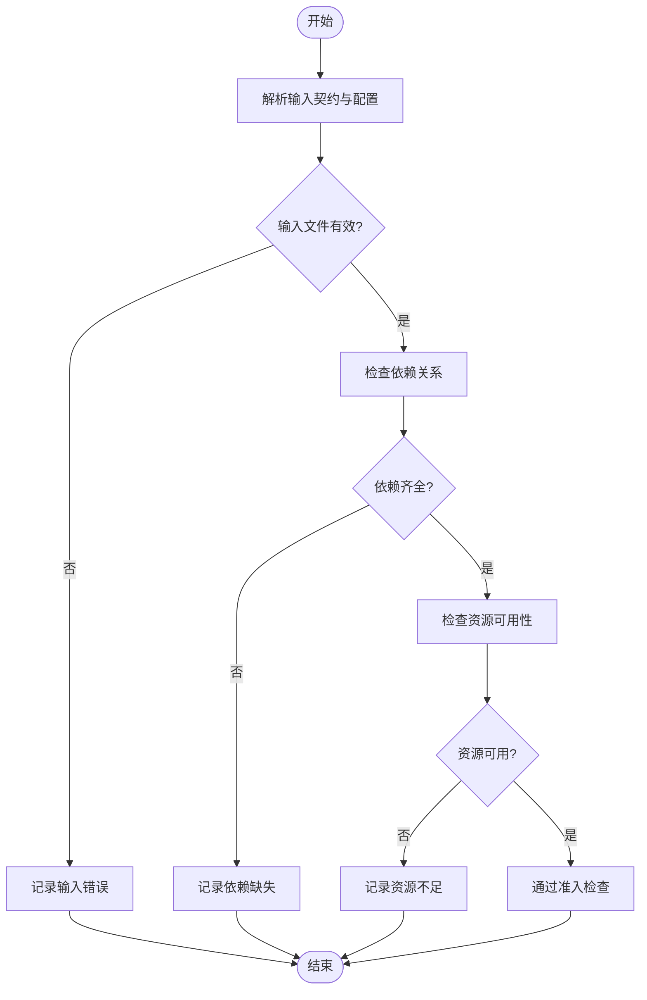
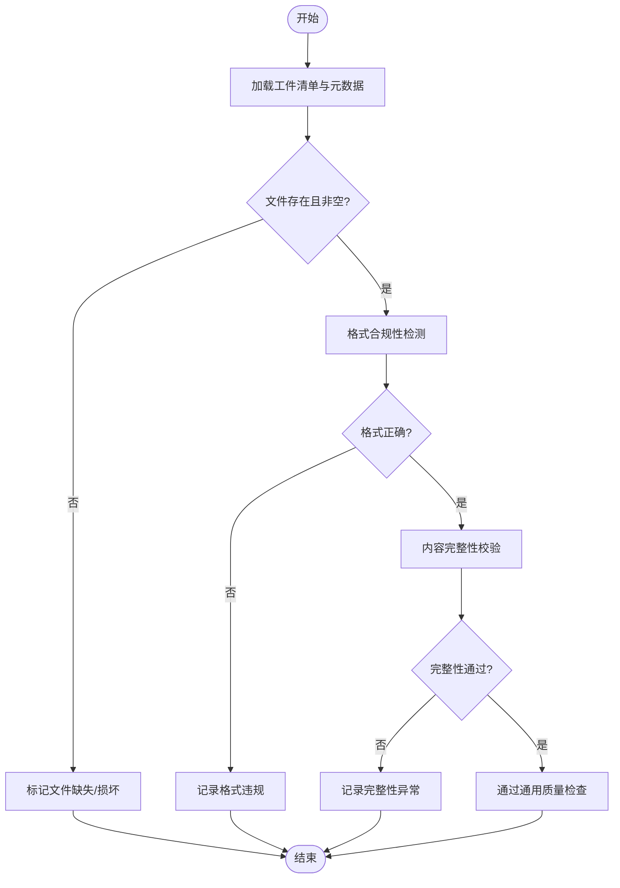
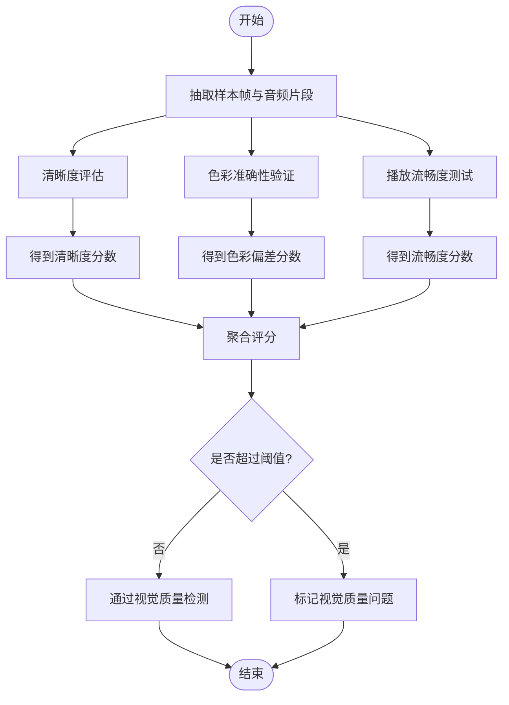
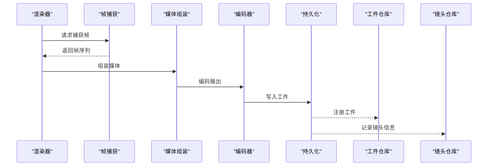
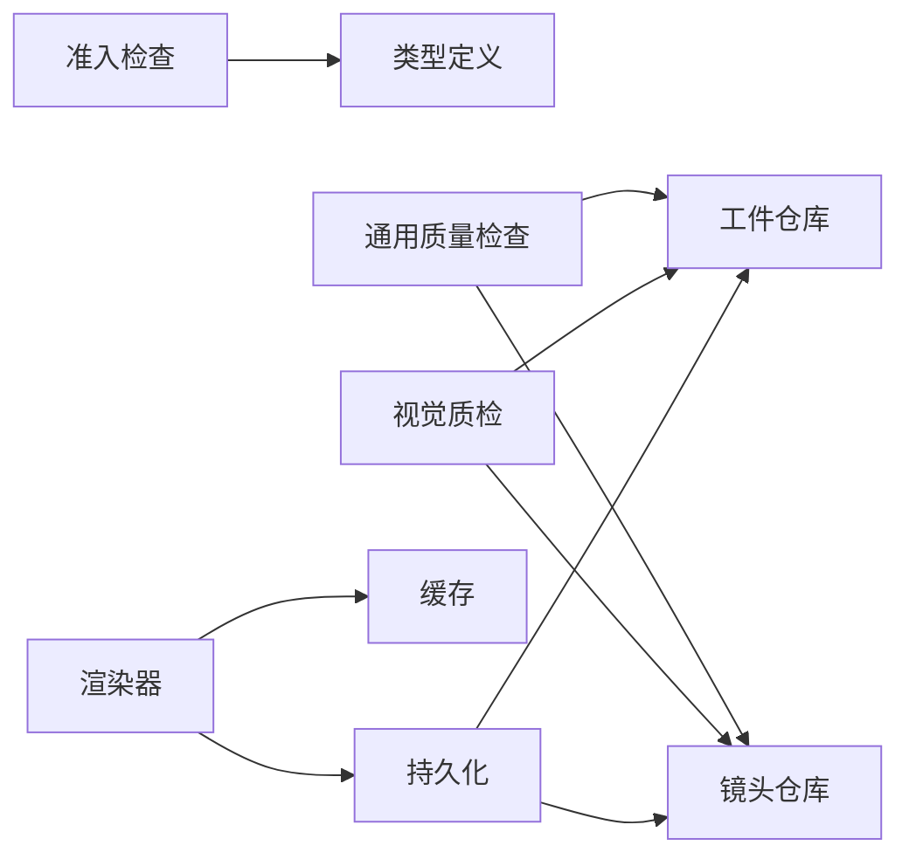

# 质量保证系统

<cite>
**本文引用的文件**   
- [src/features/render/qa-check.ts](file://src/features/render/qa-check.ts)
- [src/features/render/vision-qa.ts](file://src/features/render/vision-qa.ts)
- [src/features/render/admission.ts](file://src/features/render/admission.ts)
- [src/features/render/export-service.ts](file://src/features/render/export-service.ts)
- [src/features/render/renderer.ts](file://src/features/render/renderer.ts)
- [src/features/render/types.ts](file://src/features/render/types.ts)
- [src/features/render/cache.ts](file://src/features/render/cache.ts)
- [src/features/render/media-assembly.ts](file://src/features/render/media-assembly.ts)
- [src/features/render/frame-capture.ts](file://src/features/render/frame-capture.ts)
- [src/features/render/concat.ts](file://src/features/render/concat.ts)
- [src/features/render/encode.ts](file://src/features/render/encode.ts)
- [src/features/render/persistence.ts](file://src/features/render/persistence.ts)
- [src/features/render/render-artifact-repository.ts](file://src/features/render/render-artifact-repository.ts)
- [src/features/render/render-shot-repository.ts](file://src/features/render/render-shot-repository.ts)
- [server/src/compose/run-pipeline.ts](file://server/src/compose/run-pipeline.ts)
- [server/src/capture/run-capture.ts](file://server/src/capture/run-capture.ts)
- [scripts/verify/e2e-smoke.ts](file://scripts/verify/e2e-smoke.ts)
</cite>

## 更新摘要
**变更内容**   
- 增强了视觉质量检测（Vision QA）的测试性能与可靠性，采用无数据库调度器注入机制
- 优化了单元测试的执行效率，减少了对数据库依赖的耦合
- 改进了测试环境的隔离性与可重复性

## 目录
1. [简介](#简介)
2. [项目结构](#项目结构)
3. [核心组件](#核心组件)
4. [架构总览](#架构总览)
5. [详细组件分析](#详细组件分析)
6. [依赖关系分析](#依赖关系分析)
7. [性能考量](#性能考量)
8. [故障排查指南](#故障排查指南)
9. [结论](#结论)
10. [附录](#附录)

## 简介
本文件面向质量保证（QA）子系统，聚焦渲染质量检查机制、视觉质量检测、准入检查流程与质量报告生成。文档覆盖输出文件验证、格式合规性检测、内容完整性校验；图像清晰度评估、色彩准确性验证、播放流畅度测试；输入文件验证、依赖关系检查、资源可用性确认；以及问题诊断、修复建议、性能指标统计。同时提供质量标准配置方法与自定义检查规则的开发指南，帮助团队在持续集成与发布前保障交付质量。

**更新** 视觉质量检测模块已增强，通过无数据库调度器注入机制提升了单元测试的性能与可靠性，减少了外部依赖对测试执行的影响。

## 项目结构
质量保证相关能力主要分布在以下模块：
- 渲染与导出管线：负责渲染、帧捕获、媒体组装、编码与持久化
- 准入检查：对输入与依赖进行前置校验
- 质量检查：通用质量检查与视觉质量检测
- 报告与存储：将检查结果与指标写入持久化存储，供后续消费

图表来源
- [src/features/render/renderer.ts](file://src/features/render/renderer.ts)
- [src/features/render/frame-capture.ts](file://src/features/render/frame-capture.ts)
- [src/features/render/media-assembly.ts](file://src/features/render/media-assembly.ts)
- [src/features/render/encode.ts](file://src/features/render/encode.ts)
- [src/features/render/persistence.ts](file://src/features/render/persistence.ts)
- [src/features/render/cache.ts](file://src/features/render/cache.ts)
- [src/features/render/qa-check.ts](file://src/features/render/qa-check.ts)
- [src/features/render/vision-qa.ts](file://src/features/render/vision-qa.ts)
- [src/features/render/admission.ts](file://src/features/render/admission.ts)
- [src/features/render/render-artifact-repository.ts](file://src/features/render/render-artifact-repository.ts)
- [src/features/render/render-shot-repository.ts](file://src/features/render/render-shot-repository.ts)
- [src/features/render/types.ts](file://src/features/render/types.ts)
- [server/src/compose/run-pipeline.ts](file://server/src/compose/run-pipeline.ts)
- [server/src/capture/run-capture.ts](file://server/src/capture/run-capture.ts)

章节来源
- [src/features/render/types.ts](file://src/features/render/types.ts)
- [src/features/render/renderer.ts](file://src/features/render/renderer.ts)
- [src/features/render/qa-check.ts](file://src/features/render/qa-check.ts)
- [src/features/render/vision-qa.ts](file://src/features/render/vision-qa.ts)
- [src/features/render/admission.ts](file://src/features/render/admission.ts)

## 核心组件
- 准入检查（Admission）
  - 职责：对输入文件、依赖关系与资源可用性进行前置校验，确保渲染任务可安全执行
  - 关键点：输入合法性、依赖存在性、资源配额与路径有效性
- 质量检查（QA Check）
  - 职责：对渲染产物进行通用质量检查，包括输出文件存在性、格式合规性与内容完整性
  - 关键点：文件校验、元数据校验、完整性哈希或长度校验
- 视觉质量检测（Vision QA）
  - 职责：对图像与视频进行视觉维度评估，包括清晰度、色彩准确性与播放流畅度
  - 关键点：清晰度指标、色域/白平衡一致性、帧率与丢帧检测
  - **更新** 通过无数据库调度器注入机制优化了测试性能，提升了单元测试的可靠性和执行速度
- 渲染与导出（Renderer/Export）
  - 职责：驱动渲染、帧捕获、媒体组装、编码与持久化，为质量检查提供待检工件
  - 关键点：渲染稳定性、缓存命中、编码参数与输出路径管理
- 工件与仓库（Artifacts/Repositories）
  - 职责：管理与查询渲染工件与镜头数据，支撑质量报告与回溯
  - 关键点：工件ID映射、状态机、索引与分页

章节来源
- [src/features/render/admission.ts](file://src/features/render/admission.ts)
- [src/features/render/qa-check.ts](file://src/features/render/qa-check.ts)
- [src/features/render/vision-qa.ts](file://src/features/render/vision-qa.ts)
- [src/features/render/renderer.ts](file://src/features/render/renderer.ts)
- [src/features/render/render-artifact-repository.ts](file://src/features/render/render-artifact-repository.ts)
- [src/features/render/render-shot-repository.ts](file://src/features/render/render-shot-repository.ts)

## 架构总览
质量保证系统围绕"渲染产出—质量检查—报告归档"的闭环构建。渲染阶段产生工件后，由准入检查确保输入与依赖有效；随后进行通用质量检查与视觉质量检测；最终将结果与指标写入持久化存储，形成可追溯的质量报告。

图表来源
- [server/src/compose/run-pipeline.ts](file://server/src/compose/run-pipeline.ts)
- [src/features/render/renderer.ts](file://src/features/render/renderer.ts)
- [src/features/render/frame-capture.ts](file://src/features/render/frame-capture.ts)
- [src/features/render/media-assembly.ts](file://src/features/render/media-assembly.ts)
- [src/features/render/encode.ts](file://src/features/render/encode.ts)
- [src/features/render/persistence.ts](file://src/features/render/persistence.ts)
- [src/features/render/render-artifact-repository.ts](file://src/features/render/render-artifact-repository.ts)
- [src/features/render/render-shot-repository.ts](file://src/features/render/render-shot-repository.ts)
- [src/features/render/qa-check.ts](file://src/features/render/qa-check.ts)
- [src/features/render/vision-qa.ts](file://src/features/render/vision-qa.ts)

## 详细组件分析

### 准入检查（Admission）
- 功能要点
  - 输入文件验证：检查路径存在、类型合法、大小与分辨率范围合理
  - 依赖关系检查：模板、素材、字体、脚本等依赖是否齐全且版本兼容
  - 资源可用性确认：磁盘空间、GPU/CPU配额、外部服务可达性
- 处理流程
  - 解析输入契约与配置
  - 逐项校验并收集错误
  - 失败时快速返回，避免无效渲染
- 扩展点
  - 新增依赖类型与校验规则
  - 自定义资源探针（如网络、数据库、对象存储）

图表来源
- [src/features/render/admission.ts](file://src/features/render/admission.ts)

章节来源
- [src/features/render/admission.ts](file://src/features/render/admission.ts)

### 通用质量检查（QA Check）
- 功能要点
  - 输出文件验证：确认目标文件存在、非空、可被解码器识别
  - 格式合规性检测：容器格式、编码参数、码率、声道数、字幕轨道等
  - 内容完整性校验：时长与帧数一致性、关键段完整性、哈希校验
- 处理流程
  - 扫描输出工件与元数据
  - 逐项执行格式与完整性规则
  - 生成结构化检查结果与告警级别
- 扩展点
  - 新增格式校验器（如新容器、新编码）
  - 自定义完整性策略（分段校验、抽样校验）

图表来源
- [src/features/render/qa-check.ts](file://src/features/render/qa-check.ts)

章节来源
- [src/features/render/qa-check.ts](file://src/features/render/qa-check.ts)

### 视觉质量检测（Vision QA）
- 功能要点
  - 图像清晰度评估：基于边缘锐度、频域能量或参考对比计算清晰度分数
  - 色彩准确性验证：色域覆盖率、白平衡偏差、饱和度与亮度分布
  - 播放流畅度测试：帧率稳定性、丢帧率、卡顿检测、音画同步
- 处理流程
  - 抽取样本帧与音频片段
  - 执行视觉与音频指标计算
  - 综合评分与阈值判定
- **更新** 通过无数据库调度器注入机制优化了测试环境，提升了单元测试的执行效率和可靠性
- 扩展点
  - 新增视觉指标算法（如PSNR、SSIM、LPIPS）
  - 自定义流畅度检测策略（滑动窗口、抖动分析）

图表来源
- [src/features/render/vision-qa.ts](file://src/features/render/vision-qa.ts)

章节来源
- [src/features/render/vision-qa.ts](file://src/features/render/vision-qa.ts)

### 渲染与导出（Renderer/Export）
- 功能要点
  - 渲染驱动：根据模板与数据生成页面/场景
  - 帧捕获：稳定抓取帧序列，支持缩放与裁剪
  - 媒体组装：拼接帧序列与音轨，生成中间媒体
  - 编码与持久化：按目标格式编码，落盘并注册工件
- 处理流程
  - 初始化渲染上下文与缓存
  - 执行渲染与捕获流水线
  - 编码输出并写入工件仓库
- 扩展点
  - 新增渲染后端（如不同浏览器引擎）
  - 自定义编码参数与输出策略

图表来源
- [src/features/render/renderer.ts](file://src/features/render/renderer.ts)
- [src/features/render/frame-capture.ts](file://src/features/render/frame-capture.ts)
- [src/features/render/media-assembly.ts](file://src/features/render/media-assembly.ts)
- [src/features/render/encode.ts](file://src/features/render/encode.ts)
- [src/features/render/persistence.ts](file://src/features/render/persistence.ts)
- [src/features/render/render-artifact-repository.ts](file://src/features/render/render-artifact-repository.ts)
- [src/features/render/render-shot-repository.ts](file://src/features/render/render-shot-repository.ts)

章节来源
- [src/features/render/renderer.ts](file://src/features/render/renderer.ts)
- [src/features/render/frame-capture.ts](file://src/features/render/frame-capture.ts)
- [src/features/render/media-assembly.ts](file://src/features/render/media-assembly.ts)
- [src/features/render/encode.ts](file://src/features/render/encode.ts)
- [src/features/render/persistence.ts](file://src/features/render/persistence.ts)

### 工件与仓库（Artifacts/Repositories）
- 功能要点
  - 工件注册：记录工件ID、路径、格式、尺寸、时长、哈希等元数据
  - 镜头记录：关联镜头与工件，维护时间轴与状态
  - 查询与分页：支持按项目、镜头、状态检索
- 处理流程
  - 渲染完成后写入工件与镜头信息
  - 质量检查与报告消费仓库数据
- 扩展点
  - 新增字段与索引
  - 多后端存储适配

章节来源
- [src/features/render/render-artifact-repository.ts](file://src/features/render/render-artifact-repository.ts)
- [src/features/render/render-shot-repository.ts](file://src/features/render/render-shot-repository.ts)
- [src/features/render/types.ts](file://src/features/render/types.ts)

### 缓存与回退（Cache）
- 功能要点
  - 渲染缓存：命中相同输入与参数时直接复用结果
  - 降级策略：当缓存不可用时回退到完整渲染
- 处理流程
  - 计算缓存键（输入摘要+参数）
  - 命中则返回缓存工件
  - 未命中则执行渲染并回填缓存

章节来源
- [src/features/render/cache.ts](file://src/features/render/cache.ts)

## 依赖关系分析
- 组件耦合
  - 质量检查依赖工件仓库与镜头仓库获取待检数据
  - 视觉质检依赖渲染与编码产出的媒体文件
  - 准入检查依赖输入契约与运行时环境探针
- 外部依赖
  - 渲染管线与捕获工具链（浏览器引擎、媒体编解码库）
  - 存储后端（本地文件系统、对象存储、数据库）
- **更新** 视觉质量检测模块已通过无数据库调度器注入机制解耦了测试依赖，提升了单元测试的独立性和执行效率
- 潜在循环依赖
  - 通过接口抽象与事件解耦避免循环引用
  - 使用仓库层隔离具体实现

图表来源
- [src/features/render/admission.ts](file://src/features/render/admission.ts)
- [src/features/render/qa-check.ts](file://src/features/render/qa-check.ts)
- [src/features/render/vision-qa.ts](file://src/features/render/vision-qa.ts)
- [src/features/render/renderer.ts](file://src/features/render/renderer.ts)
- [src/features/render/cache.ts](file://src/features/render/cache.ts)
- [src/features/render/persistence.ts](file://src/features/render/persistence.ts)
- [src/features/render/render-artifact-repository.ts](file://src/features/render/render-artifact-repository.ts)
- [src/features/render/render-shot-repository.ts](file://src/features/render/render-shot-repository.ts)
- [src/features/render/types.ts](file://src/features/render/types.ts)

章节来源
- [src/features/render/types.ts](file://src/features/render/types.ts)
- [src/features/render/render-artifact-repository.ts](file://src/features/render/render-artifact-repository.ts)
- [src/features/render/render-shot-repository.ts](file://src/features/render/render-shot-repository.ts)

## 性能考量
- 渲染与编码
  - 启用并行捕获与编码，限制并发以避免资源争用
  - 使用增量渲染与缓存命中减少重复计算
- 质量检查
  - 抽样检测替代全量分析，降低CPU与I/O压力
  - 异步执行视觉指标计算，避免阻塞主流程
- **更新** 视觉质量检测的单元测试通过无数据库调度器注入机制显著提升了执行速度和可靠性，减少了外部依赖对测试性能的影响
- 存储与IO
  - 批量写入工件元数据，减少事务开销
  - 使用流式读写与临时目录优化磁盘占用

[本节为通用指导，不直接分析具体文件]

## 故障排查指南
- 常见问题定位
  - 输入文件缺失或路径错误：检查准入检查日志与输入契约
  - 依赖缺失或版本不兼容：查看依赖清单与版本矩阵
  - 编码失败或输出损坏：检查编码参数与容器兼容性
  - 视觉质量不达标：分析清晰度、色彩与流畅度指标
- 调试步骤
  - 启用详细日志与采样帧保存
  - 复现最小用例并逐步缩小范围
  - 对比基线与回归差异
- 恢复策略
  - 自动重试与降级策略
  - 回滚到上一稳定版本工件
- **更新** 视觉质量检测测试问题可通过无数据库调度器注入机制快速定位和解决，无需依赖完整的数据库环境

章节来源
- [scripts/verify/e2e-smoke.ts](file://scripts/verify/e2e-smoke.ts)
- [server/src/capture/run-capture.ts](file://server/src/capture/run-capture.ts)

## 结论
质量保证系统通过准入检查、通用质量检查与视觉质量检测形成闭环，结合渲染与导出管线及工件仓库，确保输出文件的格式合规、内容完整与视觉质量达标。**更新** 通过引入无数据库调度器注入机制，视觉质量检测的单元测试性能和可靠性得到了显著提升，为持续集成提供了更加稳定和高效的测试环境。通过可扩展的检查规则与配置方法，团队可灵活定制质量标准与自定义检查规则，持续提升交付质量与稳定性。

[本节为总结性内容，不直接分析具体文件]

## 附录

### 质量标准配置方法
- 配置项建议
  - 格式规范：容器、编码、码率、声道、字幕轨道
  - 完整性阈值：时长误差、帧数误差、哈希匹配
  - 视觉指标：清晰度阈值、色彩偏差上限、流畅度下限
  - 准入规则：输入大小、分辨率范围、依赖清单
- 配置来源
  - 环境变量与配置文件
  - 运行时动态参数（如并发、超时、采样比例）

[本节为概念性说明，不直接分析具体文件]

### 自定义检查规则开发指南
- 开发步骤
  - 定义检查接口与数据结构
  - 实现检查逻辑与错误分类
  - 注册检查器并在流水线中挂载
  - 编写单元测试与集成测试
- **更新** 单元测试应利用无数据库调度器注入机制，避免对数据库的强依赖，提升测试执行效率和可重复性
- 最佳实践
  - 保持检查幂等与可重入
  - 提供可配置的阈值与开关
  - 输出结构化结果便于报告聚合

[本节为概念性说明，不直接分析具体文件]