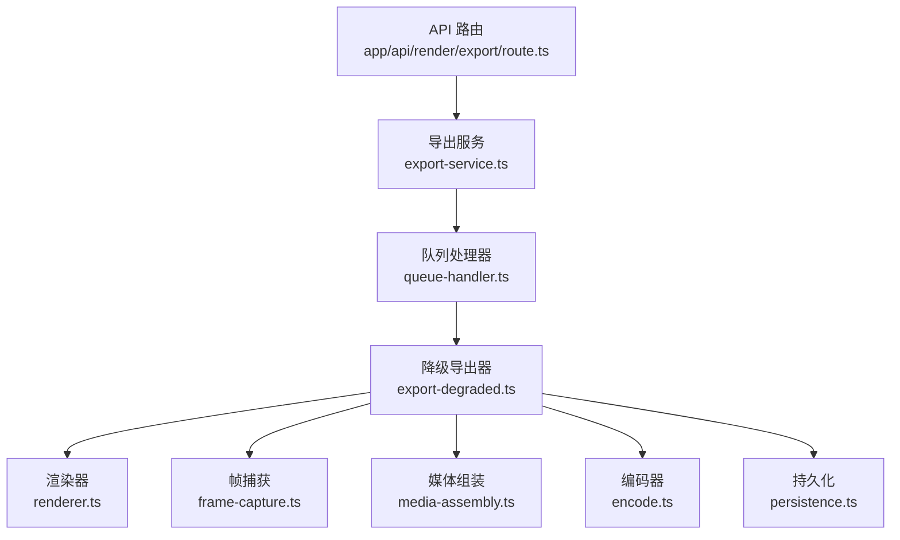
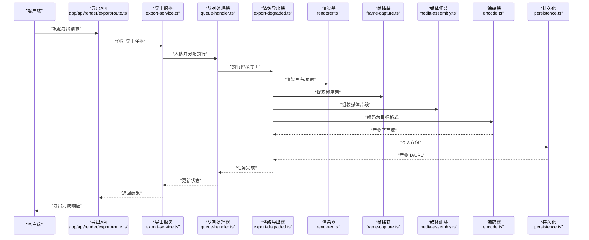
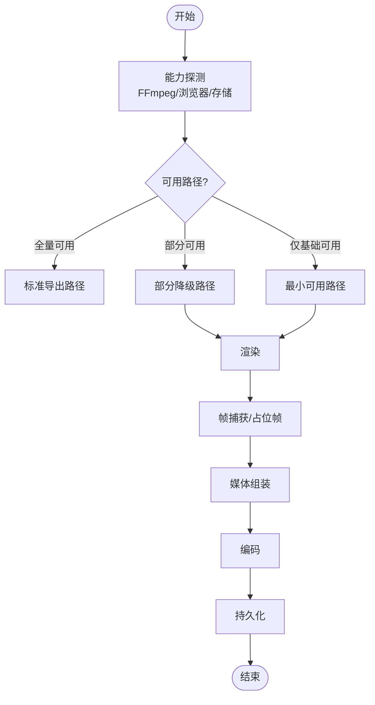
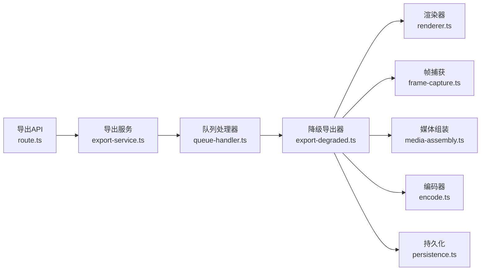

# 降级导出系统

<cite>
**本文引用的文件**   
- [export-degraded.ts](file://src/features/render/export-degraded.ts)
- [export-service.ts](file://src/features/render/export-service.ts)
- [render.ts](file://src/features/render/renderer.ts)
- [media-assembly.ts](file://src/features/render/media-assembly.ts)
- [frame-capture.ts](file://src/features/render/frame-capture.ts)
- [encode.ts](file://src/features/render/encode.ts)
- [persistence.ts](file://src/features/render/persistence.ts)
- [queue-handler.ts](file://src/features/render/queue-handler.ts)
- [route.ts](file://src/app/api/render/export/route.ts)
</cite>

## 目录
1. [简介](#简介)
2. [项目结构](#项目结构)
3. [核心组件](#核心组件)
4. [架构总览](#架构总览)
5. [详细组件分析](#详细组件分析)
6. [依赖关系分析](#依赖关系分析)
7. [性能考量](#性能考量)
8. [故障排查指南](#故障排查指南)
9. [结论](#结论)

## 简介
本文件面向“降级导出系统”，聚焦在渲染与导出链路中，当关键能力（如 FFmpeg、浏览器捕获或外部编码服务）不可用时，如何以最小可用路径完成导出。该系统的目标是：
- 在资源受限或环境异常时，仍能输出可播放的媒体产物（优先保证可用性）。
- 通过分层降级策略，逐步降低质量与功能，确保端到端流程不中断。
- 提供清晰的错误恢复与回退路径，便于定位问题与优化体验。

## 项目结构
围绕导出能力的核心代码位于 src/features/render 与 server/src/capture 等模块。与降级导出直接相关的文件包括：
- 导出编排与服务层：export-service.ts、queue-handler.ts
- 降级实现：export-degraded.ts
- 渲染与帧处理：renderer.ts、frame-capture.ts
- 媒体组装与编码：media-assembly.ts、encode.ts
- 持久化：persistence.ts
- API 入口：app/api/render/export/route.ts

图表来源 
- [route.ts](file://src/app/api/render/export/route.ts)
- [export-service.ts](file://src/features/render/export-service.ts)
- [queue-handler.ts](file://src/features/render/queue-handler.ts)
- [export-degraded.ts](file://src/features/render/export-degraded.ts)
- [renderer.ts](file://src/features/render/renderer.ts)
- [frame-capture.ts](file://src/features/render/frame-capture.ts)
- [media-assembly.ts](file://src/features/render/media-assembly.ts)
- [encode.ts](file://src/features/render/encode.ts)
- [persistence.ts](file://src/features/render/persistence.ts)

章节来源
- [route.ts](file://src/app/api/render/export/route.ts)
- [export-service.ts](file://src/features/render/export-service.ts)
- [queue-handler.ts](file://src/features/render/queue-handler.ts)
- [export-degraded.ts](file://src/features/render/export-degraded.ts)
- [renderer.ts](file://src/features/render/renderer.ts)
- [frame-capture.ts](file://src/features/render/frame-capture.ts)
- [media-assembly.ts](file://src/features/render/media-assembly.ts)
- [encode.ts](file://src/features/render/encode.ts)
- [persistence.ts](file://src/features/render/persistence.ts)

## 核心组件
- 降级导出器（export-degraded.ts）
  - 职责：在正常导出链路不可用时，提供最小可用导出路径；协调渲染、帧捕获、媒体组装与编码，并写入持久化存储。
  - 关键点：检测能力缺失、选择降级策略、控制质量参数、保障产物完整性。
- 导出服务（export-service.ts）
  - 职责：对外暴露导出接口，统一调度队列与降级逻辑，管理任务生命周期与状态。
- 队列处理器（queue-handler.ts）
  - 职责：承接导出请求，按优先级与并发限制执行任务，支持重试与失败回退。
- 渲染器（renderer.ts）
  - 职责：将画布/页面内容渲染为中间产物（图片序列或视频片段），供后续组装使用。
- 帧捕获（frame-capture.ts）
  - 职责：从渲染结果中提取帧，或在无浏览器环境下生成占位帧。
- 媒体组装（media-assembly.ts）
  - 职责：将帧序列或片段合并为最终媒体文件，必要时进行转码与封装。
- 编码器（encode.ts）
  - 职责：调用底层编码器（如 FFmpeg）或软件编码路径，输出目标格式。
- 持久化（persistence.ts）
  - 职责：将导出产物落盘或上传至对象存储，返回可访问的 URL/ID。

章节来源
- [export-degraded.ts](file://src/features/render/export-degraded.ts)
- [export-service.ts](file://src/features/render/export-service.ts)
- [queue-handler.ts](file://src/features/render/queue-handler.ts)
- [renderer.ts](file://src/features/render/renderer.ts)
- [frame-capture.ts](file://src/features/render/frame-capture.ts)
- [media-assembly.ts](file://src/features/render/media-assembly.ts)
- [encode.ts](file://src/features/render/encode.ts)
- [persistence.ts](file://src/features/render/persistence.ts)

## 架构总览
下图展示了从 API 到降级导出的完整调用链路与数据流。

图表来源 
- [route.ts](file://src/app/api/render/export/route.ts)
- [export-service.ts](file://src/features/render/export-service.ts)
- [queue-handler.ts](file://src/features/render/queue-handler.ts)
- [export-degraded.ts](file://src/features/render/export-degraded.ts)
- [renderer.ts](file://src/features/render/renderer.ts)
- [frame-capture.ts](file://src/features/render/frame-capture.ts)
- [media-assembly.ts](file://src/features/render/media-assembly.ts)
- [encode.ts](file://src/features/render/encode.ts)
- [persistence.ts](file://src/features/render/persistence.ts)

## 详细组件分析

### 降级导出器（export-degraded.ts）
- 设计要点
  - 能力探测：检测 FFmpeg、浏览器驱动、网络与存储是否可用。
  - 降级策略：根据能力检测结果选择最优可用路径（例如：仅图片序列、低码率视频、占位帧）。
  - 质量控制：在降级模式下自动降低分辨率、帧率与码率，确保稳定性。
  - 错误恢复：对瞬时失败进行重试，对不可恢复错误快速回退到更保守的路径。
- 关键流程
  - 输入校验与能力评估
  - 选择降级路径（图片序列/视频片段/占位帧）
  - 协调渲染、捕获、组装、编码与持久化
  - 产出标准化结果（文件ID、URL、元数据）

图表来源 
- [export-degraded.ts](file://src/features/render/export-degraded.ts)
- [renderer.ts](file://src/features/render/renderer.ts)
- [frame-capture.ts](file://src/features/render/frame-capture.ts)
- [media-assembly.ts](file://src/features/render/media-assembly.ts)
- [encode.ts](file://src/features/render/encode.ts)
- [persistence.ts](file://src/features/render/persistence.ts)

章节来源
- [export-degraded.ts](file://src/features/render/export-degraded.ts)
- [renderer.ts](file://src/features/render/renderer.ts)
- [frame-capture.ts](file://src/features/render/frame-capture.ts)
- [media-assembly.ts](file://src/features/render/media-assembly.ts)
- [encode.ts](file://src/features/render/encode.ts)
- [persistence.ts](file://src/features/render/persistence.ts)

### 导出服务（export-service.ts）
- 职责
  - 接收导出请求，构建任务上下文（项目、镜头、设置）。
  - 决定使用标准路径还是降级路径。
  - 维护任务状态机（排队、执行、成功、失败、回退）。
- 关键行为
  - 参数校验与权限检查
  - 与队列处理器交互（入队、查询、取消）
  - 聚合结果并返回给上层

章节来源
- [export-service.ts](file://src/features/render/export-service.ts)
- [queue-handler.ts](file://src/features/render/queue-handler.ts)

### 队列处理器（queue-handler.ts）
- 职责
  - 管理导出任务的并发与优先级。
  - 执行重试与失败回退（触发降级导出器）。
  - 记录执行日志与指标。
- 关键行为
  - 任务调度与限流
  - 健康检查与资源回收
  - 与导出服务对接状态同步

章节来源
- [queue-handler.ts](file://src/features/render/queue-handler.ts)
- [export-service.ts](file://src/features/render/export-service.ts)

### 渲染器（renderer.ts）
- 职责
  - 将画布或页面渲染为中间产物（图片帧或视频片段）。
  - 在浏览器不可用时，提供服务端渲染或占位图生成。
- 关键行为
  - 渲染配置（尺寸、背景、字体）
  - 错误隔离与超时保护
  - 产物缓存（可选）

章节来源
- [renderer.ts](file://src/features/render/renderer.ts)
- [frame-capture.ts](file://src/features/render/frame-capture.ts)

### 帧捕获（frame-capture.ts）
- 职责
  - 从渲染产物中提取帧序列。
  - 在无渲染环境时生成占位帧（保持时间轴连续性）。
- 关键行为
  - 帧格式转换与压缩
  - 帧去重与裁剪
  - 内存与磁盘缓冲管理

章节来源
- [frame-capture.ts](file://src/features/render/frame-capture.ts)
- [renderer.ts](file://src/features/render/renderer.ts)

### 媒体组装（media-assembly.ts）
- 职责
  - 将帧序列或片段合并为完整媒体文件。
  - 在编码不可用时，采用容器直写或无损拼接。
- 关键行为
  - 轨道合成（视频/音频/字幕）
  - 时间线对齐与补帧
  - 分段合并与索引生成

章节来源
- [media-assembly.ts](file://src/features/render/media-assembly.ts)
- [encode.ts](file://src/features/render/encode.ts)

### 编码器（encode.ts）
- 职责
  - 调用底层编码器（如 FFmpeg）或软件编码路径。
  - 在编码不可用时，回退到轻量编码或跳过编码（保留原始帧序列）。
- 关键行为
  - 参数自适应（分辨率、码率、帧率）
  - 进度回调与中断支持
  - 错误分类与重试策略

章节来源
- [encode.ts](file://src/features/render/encode.ts)
- [media-assembly.ts](file://src/features/render/media-assembly.ts)

### 持久化（persistence.ts）
- 职责
  - 将导出产物写入本地文件或对象存储。
  - 生成访问 URL 或 ID，并记录元数据。
- 关键行为
  - 分片写入与断点续传（可选）
  - 清理临时文件
  - 访问权限与签名 URL

章节来源
- [persistence.ts](file://src/features/render/persistence.ts)
- [export-degraded.ts](file://src/features/render/export-degraded.ts)

### API 入口（app/api/render/export/route.ts）
- 职责
  - 接收前端导出请求，鉴权与参数校验。
  - 调用导出服务创建任务并返回任务 ID。
  - 支持轮询或事件通知获取结果。
- 关键行为
  - 请求体解析与约束校验
  - 错误码映射与友好提示
  - 限流与防抖

章节来源
- [route.ts](file://src/app/api/render/export/route.ts)
- [export-service.ts](file://src/features/render/export-service.ts)

## 依赖关系分析
- 耦合关系
  - 导出服务依赖队列处理器与降级导出器。
  - 降级导出器依赖渲染、捕获、组装、编码与持久化。
  - 队列处理器与导出服务双向协作（状态同步与任务调度）。
- 外部依赖
  - FFmpeg（编码）、浏览器驱动（渲染/捕获）、对象存储（持久化）。
- 潜在循环依赖
  - 通过接口抽象与分层避免循环；若存在，应引入事件总线或消息队列解耦。

图表来源 
- [route.ts](file://src/app/api/render/export/route.ts)
- [export-service.ts](file://src/features/render/export-service.ts)
- [queue-handler.ts](file://src/features/render/queue-handler.ts)
- [export-degraded.ts](file://src/features/render/export-degraded.ts)
- [renderer.ts](file://src/features/render/renderer.ts)
- [frame-capture.ts](file://src/features/render/frame-capture.ts)
- [media-assembly.ts](file://src/features/render/media-assembly.ts)
- [encode.ts](file://src/features/render/encode.ts)
- [persistence.ts](file://src/features/render/persistence.ts)

章节来源
- [route.ts](file://src/app/api/render/export/route.ts)
- [export-service.ts](file://src/features/render/export-service.ts)
- [queue-handler.ts](file://src/features/render/queue-handler.ts)
- [export-degraded.ts](file://src/features/render/export-degraded.ts)
- [renderer.ts](file://src/features/render/renderer.ts)
- [frame-capture.ts](file://src/features/render/frame-capture.ts)
- [media-assembly.ts](file://src/features/render/media-assembly.ts)
- [encode.ts](file://src/features/render/encode.ts)
- [persistence.ts](file://src/features/render/persistence.ts)

## 性能考量
- 渲染阶段
  - 启用渲染缓存与增量更新，减少重复计算。
  - 合理设置并发与内存上限，避免 OOM。
- 捕获与组装
  - 使用流式处理与分块写入，降低峰值内存。
  - 帧去重与裁剪，减少无效数据。
- 编码阶段
  - 动态调整码率与分辨率，平衡质量与速度。
  - 利用硬件加速（如 GPU）提升编码吞吐。
- 持久化
  - 分片上传与并行写入，提高大文件效率。
  - 及时清理临时文件，释放磁盘空间。

## 故障排查指南
- 常见问题
  - FFmpeg 不可用：检查安装与环境变量，确认二进制路径正确。
  - 浏览器驱动缺失：验证 Playwright/Puppeteer 安装与依赖库。
  - 存储不可达：检查对象存储凭证与网络连通性。
  - 内存不足：降低并发与分辨率，增加堆内存限制。
- 诊断步骤
  - 查看队列处理器日志，定位失败节点。
  - 启用降级模式，观察是否能产出最小可用产物。
  - 检查持久化路径权限与配额。
- 恢复策略
  - 自动重试与回退到更低质量路径。
  - 人工介入：替换依赖或修复环境后重新执行任务。

章节来源
- [queue-handler.ts](file://src/features/render/queue-handler.ts)
- [export-degraded.ts](file://src/features/render/export-degraded.ts)
- [persistence.ts](file://src/features/render/persistence.ts)

## 结论
降级导出系统通过分层能力探测与多路径回退，确保在资源受限或环境异常时仍能稳定产出媒体文件。其核心价值在于：
- 可用性优先：在极端条件下仍能提供最小可用产物。
- 可扩展性：各组件职责清晰，便于替换与增强。
- 可观测性：通过队列与日志追踪，快速定位问题与优化性能。

建议持续完善能力探测与降级策略，结合监控与告警，进一步提升系统在复杂环境下的鲁棒性与用户体验。