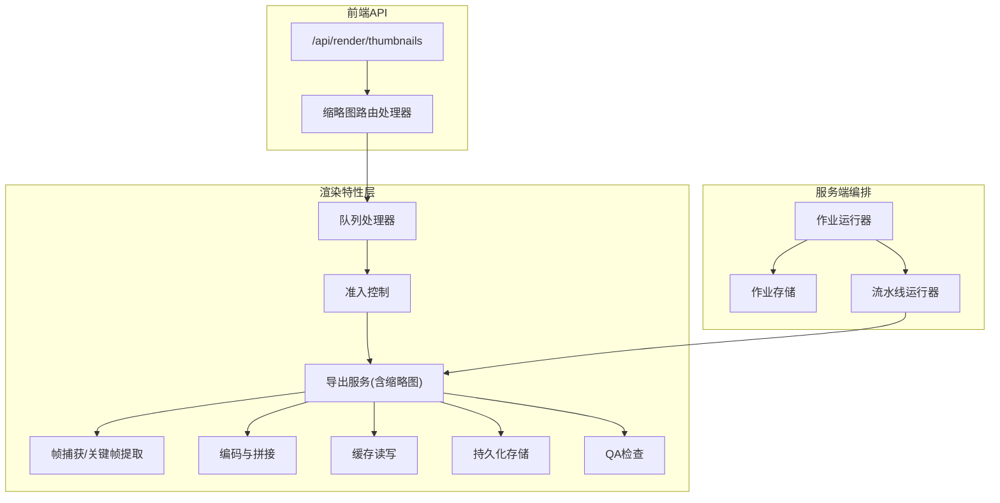
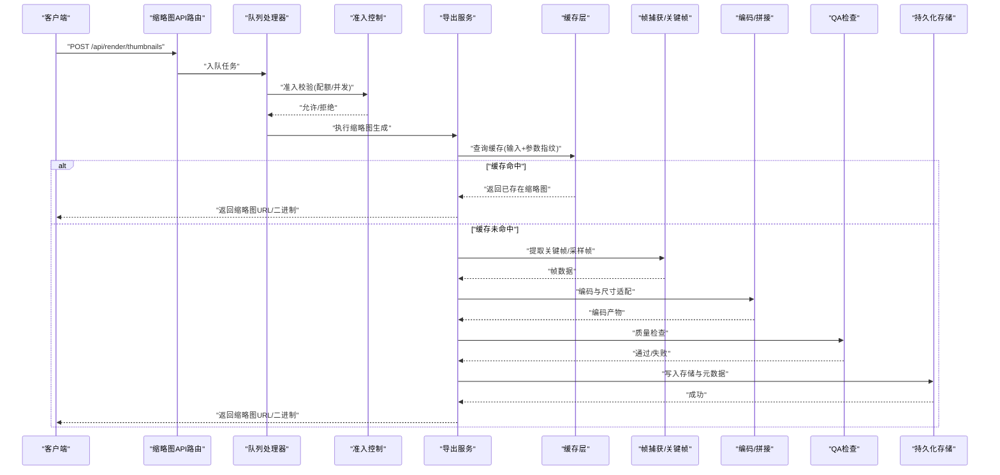
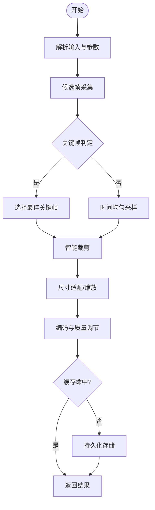
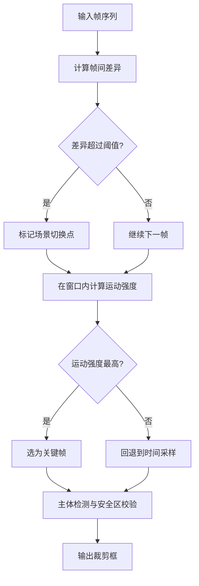
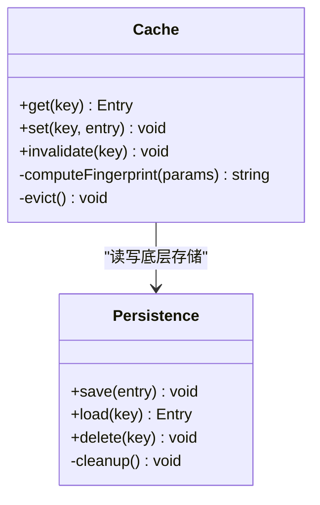
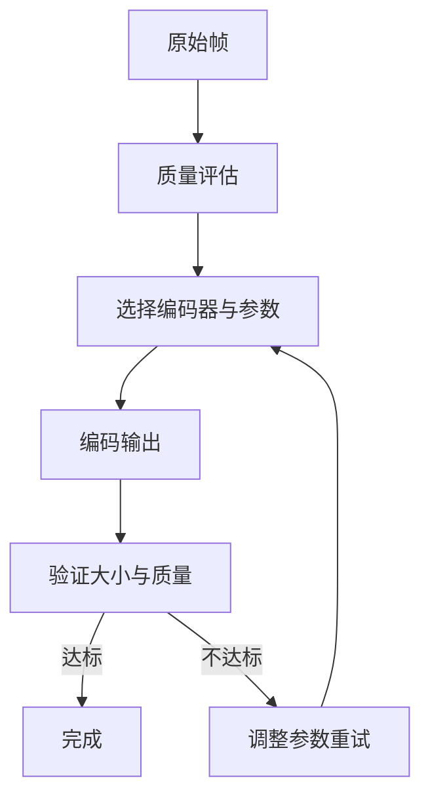
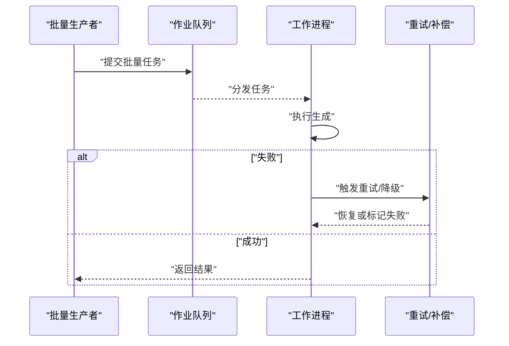
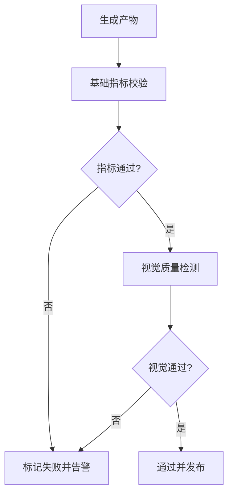
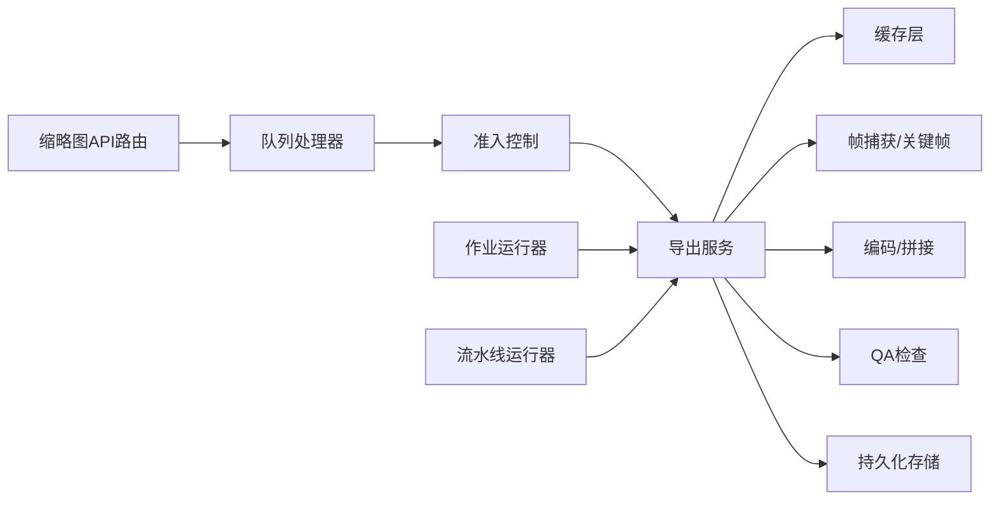

# 缩略图生成

<cite>
**本文档引用的文件**   
- [thumbnail.ts](file://src/features/render/thumbnail.ts)
- [frame-capture.ts](file://src/features/render/frame-capture.ts)
- [cache.ts](file://src/features/render/cache.ts)
- [persistence.ts](file://src/features/render/persistence.ts)
- [render-service.ts](file://src/features/render/export-service.ts)
- [export-queue-handler.ts](file://src/features/render/export-queue-handler.ts)
- [queue-handler.ts](file://src/features/render/queue-handler.ts)
- [admission.ts](file://src/features/render/admission.ts)
- [encode.ts](file://src/features/render/encode.ts)
- [concat.ts](file://src/features/render/concat.ts)
- [qa-check.ts](file://src/features/render/qa-check.ts)
- [vision-qa.ts](file://src/features/render/vision-qa.ts)
- [types.ts](file://src/features/render/types.ts)
- [repository.ts](file://src/features/render/repository.ts)
- [render-shot-repository.ts](file://src/features/render/render-shot-repository.ts)
- [render-artifact-repository.ts](file://src/features/render/render-artifact-repository.ts)
- [route.ts](file://src/app/api/render/thumbnails/route.ts)
- [compose-run-pipeline.ts](file://src/server/src/compose/run-pipeline.ts)
- [job-runner.ts](file://src/server/src/server/job-runner.ts)
- [job-store.ts](file://src/server/src/server/job-store.ts)
</cite>

## 目录
1. [简介](#简介)
2. [项目结构](#项目结构)
3. [核心组件](#核心组件)
4. [架构总览](#架构总览)
5. [详细组件分析](#详细组件分析)
6. [依赖关系分析](#依赖关系分析)
7. [性能考量](#性能考量)
8. [故障排查指南](#故障排查指南)
9. [结论](#结论)
10. [附录](#附录)

## 简介
本技术文档围绕 PurpleInk 的缩略图生成系统，系统性阐述其算法与工程实现。内容涵盖关键帧提取、智能裁剪与尺寸适配策略；缓存机制（策略、失效规则、存储管理）；格式优化（压缩、质量平衡、加载性能）；批量生成、异步处理与错误恢复；以及配置项、自定义生成器与性能调优指南。读者可据此快速理解并扩展该子系统。

## 项目结构
缩略图功能位于渲染特性模块中，主要代码集中在 src/features/render 目录，并通过 API 路由暴露对外接口。服务端侧通过编排管道与作业运行器驱动任务执行。

图表来源 
- [route.ts:1-200](file://src/app/api/render/thumbnails/route.ts#L1-L200)
- [queue-handler.ts:1-200](file://src/features/render/queue-handler.ts#L1-L200)
- [admission.ts:1-200](file://src/features/render/admission.ts#L1-L200)
- [export-service.ts:1-200](file://src/features/render/export-service.ts#L1-L200)
- [frame-capture.ts:1-200](file://src/features/render/frame-capture.ts#L1-L200)
- [encode.ts:1-200](file://src/features/render/encode.ts#L1-L200)
- [concat.ts:1-200](file://src/features/render/concat.ts#L1-L200)
- [cache.ts:1-200](file://src/features/render/cache.ts#L1-L200)
- [persistence.ts:1-200](file://src/features/render/persistence.ts#L1-L200)
- [qa-check.ts:1-200](file://src/features/render/qa-check.ts#L1-L200)
- [job-runner.ts:1-200](file://src/server/src/server/job-runner.ts#L1-L200)
- [job-store.ts:1-200](file://src/server/src/server/job-store.ts#L1-L200)
- [run-pipeline.ts:1-200](file://src/server/src/compose/run-pipeline.ts#L1-L200)

章节来源
- [route.ts:1-200](file://src/app/api/render/thumbnails/route.ts#L1-L200)
- [export-service.ts:1-200](file://src/features/render/export-service.ts#L1-L200)
- [queue-handler.ts:1-200](file://src/features/render/queue-handler.ts#L1-L200)
- [admission.ts:1-200](file://src/features/render/admission.ts#L1-L200)
- [frame-capture.ts:1-200](file://src/features/render/frame-capture.ts#L1-L200)
- [encode.ts:1-200](file://src/features/render/encode.ts#L1-L200)
- [concat.ts:1-200](file://src/features/render/concat.ts#L1-L200)
- [cache.ts:1-200](file://src/features/render/cache.ts#L1-L200)
- [persistence.ts:1-200](file://src/features/render/persistence.ts#L1-L200)
- [qa-check.ts:1-200](file://src/features/render/qa-check.ts#L1-L200)
- [job-runner.ts:1-200](file://src/server/src/server/job-runner.ts#L1-L200)
- [job-store.ts:1-200](file://src/server/src/server/job-store.ts#L1-L200)
- [run-pipeline.ts:1-200](file://src/server/src/compose/run-pipeline.ts#L1-L200)

## 核心组件
- 缩略图生成器：负责从视频或序列帧中提取关键帧、执行智能裁剪与尺寸适配，输出目标尺寸的缩略图。
- 帧捕获与关键帧提取：基于时间戳采样、场景变化检测等策略定位关键帧。
- 编码与拼接：将多帧或单帧编码为指定格式，支持质量与体积权衡。
- 缓存层：按输入源、参数指纹命中缓存，减少重复计算。
- 持久化存储：落盘缩略图与元数据，支持清理与容量管理。
- QA检查：对生成结果进行视觉与指标校验，保障质量一致性。
- 队列与准入：控制并发、限流与优先级，确保吞吐稳定。
- 作业编排：服务端作业运行器与流水线驱动批处理与异步执行。

章节来源
- [thumbnail.ts:1-200](file://src/features/render/thumbnail.ts#L1-L200)
- [frame-capture.ts:1-200](file://src/features/render/frame-capture.ts#L1-L200)
- [encode.ts:1-200](file://src/features/render/encode.ts#L1-L200)
- [concat.ts:1-200](file://src/features/render/concat.ts#L1-L200)
- [cache.ts:1-200](file://src/features/render/cache.ts#L1-L200)
- [persistence.ts:1-200](file://src/features/render/persistence.ts#L1-L200)
- [qa-check.ts:1-200](file://src/features/render/qa-check.ts#L1-L200)
- [queue-handler.ts:1-200](file://src/features/render/queue-handler.ts#L1-L200)
- [admission.ts:1-200](file://src/features/render/admission.ts#L1-L200)
- [job-runner.ts:1-200](file://src/server/src/server/job-runner.ts#L1-L200)
- [run-pipeline.ts:1-200](file://src/server/src/compose/run-pipeline.ts#L1-L200)

## 架构总览
下图展示从请求到生成的端到端流程，包括缓存命中、关键帧提取、编码、QA与持久化。

图表来源 
- [route.ts:1-200](file://src/app/api/render/thumbnails/route.ts#L1-L200)
- [queue-handler.ts:1-200](file://src/features/render/queue-handler.ts#L1-L200)
- [admission.ts:1-200](file://src/features/render/admission.ts#L1-L200)
- [export-service.ts:1-200](file://src/features/render/export-service.ts#L1-L200)
- [cache.ts:1-200](file://src/features/render/cache.ts#L1-L200)
- [frame-capture.ts:1-200](file://src/features/render/frame-capture.ts#L1-L200)
- [encode.ts:1-200](file://src/features/render/encode.ts#L1-L200)
- [qa-check.ts:1-200](file://src/features/render/qa-check.ts#L1-L200)
- [persistence.ts:1-200](file://src/features/render/persistence.ts#L1-L200)

## 详细组件分析

### 缩略图生成器（Thumbnail Generator）
- 职责：协调关键帧提取、裁剪、缩放、编码与缓存/持久化。
- 关键流程：
  - 解析输入源（视频/图像序列），确定目标尺寸与格式。
  - 调用帧捕获模块获取候选帧。
  - 根据画面内容选择关键帧（如运动强度、亮度变化）。
  - 执行智能裁剪（保持主体居中、避免裁切重要元素）。
  - 缩放至目标分辨率，应用色彩空间与质量参数。
  - 写入缓存与存储，返回访问路径。

图表来源 
- [thumbnail.ts:1-200](file://src/features/render/thumbnail.ts#L1-L200)
- [frame-capture.ts:1-200](file://src/features/render/frame-capture.ts#L1-L200)
- [encode.ts:1-200](file://src/features/render/encode.ts#L1-L200)
- [cache.ts:1-200](file://src/features/render/cache.ts#L1-L200)
- [persistence.ts:1-200](file://src/features/render/persistence.ts#L1-L200)

章节来源
- [thumbnail.ts:1-200](file://src/features/render/thumbnail.ts#L1-L200)

### 关键帧提取与智能裁剪
- 关键帧提取策略：
  - 时间间隔采样：按固定时长抽取帧，适用于长视频快速预览。
  - 场景切换检测：基于帧间差异阈值识别场景边界。
  - 运动强度评估：计算像素位移或光流强度，选取动态显著帧。
  - 亮度/对比度均衡：避免过曝或欠曝帧被选中。
- 智能裁剪：
  - 主体检测：利用边缘/轮廓或语义信息定位主体区域。
  - 安全区约束：保证文字、人脸等不被裁切。
  - 自适应比例：根据目标宽高比调整裁剪框，必要时填充背景。

图表来源 
- [frame-capture.ts:1-200](file://src/features/render/frame-capture.ts#L1-L200)

章节来源
- [frame-capture.ts:1-200](file://src/features/render/frame-capture.ts#L1-L200)

### 缓存机制设计
- 缓存键生成：由输入源标识（如媒体ID/URL）、时间戳、裁剪参数、目标尺寸、编码参数共同构成指纹。
- 缓存策略：
  - 读优先：命中则直接返回，避免重复计算。
  - 写回放：首次生成后写入缓存，后续请求直接命中。
  - 版本化：当生成器逻辑或参数模式变更时，通过版本号区分旧缓存。
- 失效规则：
  - TTL过期：按时间自动失效。
  - 主动失效：输入源更新或参数变更触发失效。
  - 容量驱逐：LRU/LFU策略淘汰冷数据。
- 存储管理：
  - 本地文件系统或对象存储，按项目/批次分桶。
  - 定期清理过期与低命中率条目，释放空间。

图表来源 
- [cache.ts:1-200](file://src/features/render/cache.ts#L1-L200)
- [persistence.ts:1-200](file://src/features/render/persistence.ts#L1-L200)

章节来源
- [cache.ts:1-200](file://src/features/render/cache.ts#L1-L200)
- [persistence.ts:1-200](file://src/features/render/persistence.ts#L1-L200)

### 编码与格式优化
- 编码算法：
  - 图片：JPEG/WebP/AVIF，按设备能力与浏览器兼容性选择。
  - 视频：H.264/H.265，用于短视频片段或GIF替代方案。
- 质量平衡：
  - 码率/质量曲线：根据目标大小与清晰度需求动态调节。
  - 感知质量：采用PSNR/SSIM等指标辅助决策。
- 加载性能：
  - 渐进式解码与懒加载。
  - 分块传输与CDN缓存。
  - 预取与预编码常用尺寸变体。

图表来源 
- [encode.ts:1-200](file://src/features/render/encode.ts#L1-L200)

章节来源
- [encode.ts:1-200](file://src/features/render/encode.ts#L1-L200)

### 批量生成与异步处理
- 批量生成：
  - 支持一次性提交多个输入源，统一调度与资源分配。
  - 任务分片：按项目/类型划分批次，提升并行度。
- 异步处理：
  - 队列驱动：生产者-消费者模型，解耦请求与处理。
  - 并发控制：限制同时处理的作业数，防止过载。
  - 进度反馈：通过事件或轮询获取生成状态。
- 错误恢复：
  - 重试机制：针对瞬时失败进行指数退避重试。
  - 降级策略：关键步骤失败时回退到备用路径（如时间采样）。
  - 补偿操作：失败任务记录并支持人工干预。

图表来源 
- [queue-handler.ts:1-200](file://src/features/render/queue-handler.ts#L1-L200)
- [admission.ts:1-200](file://src/features/render/admission.ts#L1-L200)
- [export-service.ts:1-200](file://src/features/render/export-service.ts#L1-L200)

章节来源
- [queue-handler.ts:1-200](file://src/features/render/queue-handler.ts#L1-L200)
- [admission.ts:1-200](file://src/features/render/admission.ts#L1-L200)
- [export-service.ts:1-200](file://src/features/render/export-service.ts#L1-L200)

### QA检查与质量保障
- 指标检查：分辨率、宽高比、文件大小、码率。
- 视觉检查：模糊检测、黑边/白边、主体完整性。
- 自动化回归：基准样本比对，确保生成稳定性。

图表来源 
- [qa-check.ts:1-200](file://src/features/render/qa-check.ts#L1-L200)
- [vision-qa.ts:1-200](file://src/features/render/vision-qa.ts#L1-L200)

章节来源
- [qa-check.ts:1-200](file://src/features/render/qa-check.ts#L1-L200)
- [vision-qa.ts:1-200](file://src/features/render/vision-qa.ts#L1-L200)

### 配置选项与自定义生成器
- 配置项：
  - 目标尺寸与比例：宽度、高度、是否保持纵横比。
  - 编码参数：格式、质量、码率上限、颜色空间。
  - 缓存策略：TTL、最大容量、驱逐算法。
  - 并发与限流：最大并行度、队列长度、优先级。
- 自定义生成器：
  - 插件接口：定义输入解析、关键帧提取、裁剪、编码钩子。
  - 注册与选择：按媒体类型或业务场景选择不同生成器。
  - 测试与验证：单元测试与集成测试覆盖关键路径。

章节来源
- [types.ts:1-200](file://src/features/render/types.ts#L1-L200)
- [export-service.ts:1-200](file://src/features/render/export-service.ts#L1-L200)

## 依赖关系分析
缩略图子系统依赖多个内部模块与服务端编排组件，形成清晰的层次与职责边界。

图表来源 
- [route.ts:1-200](file://src/app/api/render/thumbnails/route.ts#L1-L200)
- [queue-handler.ts:1-200](file://src/features/render/queue-handler.ts#L1-L200)
- [admission.ts:1-200](file://src/features/render/admission.ts#L1-L200)
- [export-service.ts:1-200](file://src/features/render/export-service.ts#L1-L200)
- [cache.ts:1-200](file://src/features/render/cache.ts#L1-L200)
- [frame-capture.ts:1-200](file://src/features/render/frame-capture.ts#L1-L200)
- [encode.ts:1-200](file://src/features/render/encode.ts#L1-L200)
- [qa-check.ts:1-200](file://src/features/render/qa-check.ts#L1-L200)
- [persistence.ts:1-200](file://src/features/render/persistence.ts#L1-L200)
- [job-runner.ts:1-200](file://src/server/src/server/job-runner.ts#L1-L200)
- [run-pipeline.ts:1-200](file://src/server/src/compose/run-pipeline.ts#L1-L200)

章节来源
- [repository.ts:1-200](file://src/features/render/repository.ts#L1-L200)
- [render-shot-repository.ts:1-200](file://src/features/render/render-shot-repository.ts#L1-L200)
- [render-artifact-repository.ts:1-200](file://src/features/render/render-artifact-repository.ts#L1-L200)

## 性能考量
- 关键帧提取：
  - 使用增量差异计算降低CPU开销。
  - 对长视频采用分段扫描与并行处理。
- 编码优化：
  - 硬件加速（GPU/专用编解码器）优先。
  - 按需生成多尺寸变体，避免运行时缩放。
- 缓存命中：
  - 合理设置TTL与容量，提高热点命中率。
  - 预热常用缩略图，减少冷启动延迟。
- 并发与限流：
  - 根据资源水位动态调整并发度。
  - 队列背压保护，防止雪崩。
- 存储I/O：
  - 合并小文件写入，减少元数据开销。
  - 使用对象存储的分片上传与断点续传。

[本节为通用指导，无需特定文件引用]

## 故障排查指南
- 常见问题：
  - 关键帧缺失或质量差：检查场景切换阈值与运动强度参数。
  - 编码失败：确认编码器可用性与参数合法性。
  - 缓存未命中：核对指纹生成逻辑与版本化策略。
  - 队列堆积：观察并发限制与消费者健康状态。
- 诊断手段：
  - 日志追踪：记录关键步骤耗时与错误堆栈。
  - 指标监控：QPS、延迟分布、错误率、缓存命中率。
  - 抽样回放：对失败案例进行离线复现与回归测试。
- 恢复策略：
  - 自动重试与降级路径。
  - 人工介入：重新触发或修正参数。

章节来源
- [qa-check.ts:1-200](file://src/features/render/qa-check.ts#L1-L200)
- [vision-qa.ts:1-200](file://src/features/render/vision-qa.ts#L1-L200)
- [queue-handler.ts:1-200](file://src/features/render/queue-handler.ts#L1-L200)
- [admission.ts:1-200](file://src/features/render/admission.ts#L1-L200)

## 结论
PurpleInk 缩略图生成系统以模块化设计与分层架构为核心，结合关键帧提取、智能裁剪、编码优化与缓存机制，实现了高效、稳定且可扩展的缩略图生产能力。通过队列与作业编排，系统具备良好的并发控制与错误恢复能力。建议在生产环境中持续监控关键指标，并根据业务需求调整参数与策略，以获得最佳性能与质量平衡。

[本节为总结性内容，无需特定文件引用]

## 附录
- 术语表：
  - 关键帧：代表视频片段内容的代表性帧。
  - 智能裁剪：基于内容感知的裁剪策略。
  - 缓存指纹：由输入与参数组合生成的唯一标识。
- 参考实现路径：
  - 缩略图主流程：[thumbnail.ts](file://src/features/render/thumbnail.ts)
  - 帧捕获与关键帧：[frame-capture.ts](file://src/features/render/frame-capture.ts)
  - 编码与拼接：[encode.ts](file://src/features/render/encode.ts), [concat.ts](file://src/features/render/concat.ts)
  - 缓存与持久化：[cache.ts](file://src/features/render/cache.ts), [persistence.ts](file://src/features/render/persistence.ts)
  - QA检查：[qa-check.ts](file://src/features/render/qa-check.ts), [vision-qa.ts](file://src/features/render/vision-qa.ts)
  - 队列与准入：[queue-handler.ts](file://src/features/render/queue-handler.ts), [admission.ts](file://src/features/render/admission.ts)
  - 作业编排：[job-runner.ts](file://src/server/src/server/job-runner.ts), [run-pipeline.ts](file://src/server/src/compose/run-pipeline.ts)