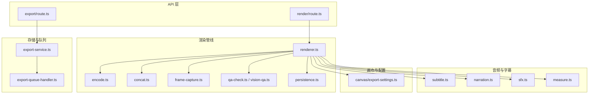
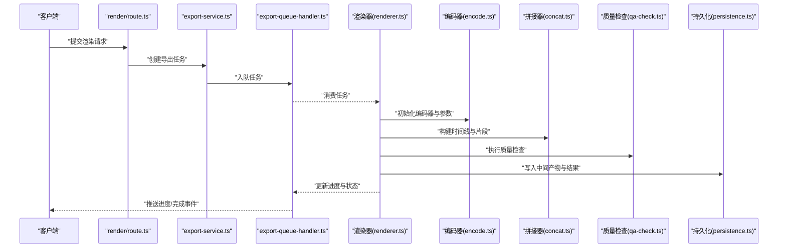
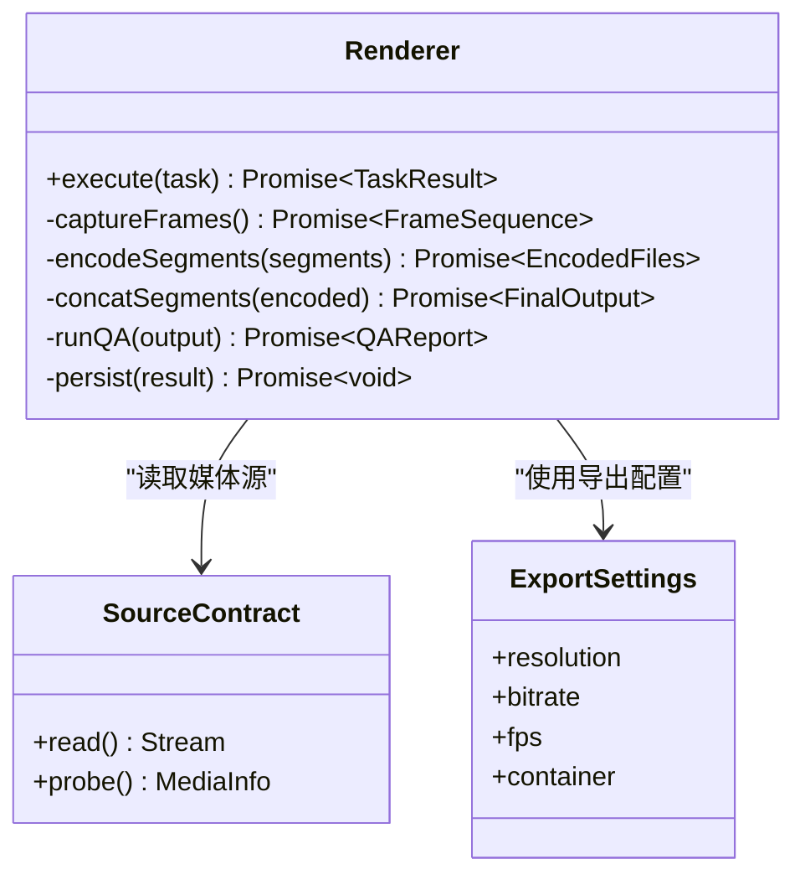
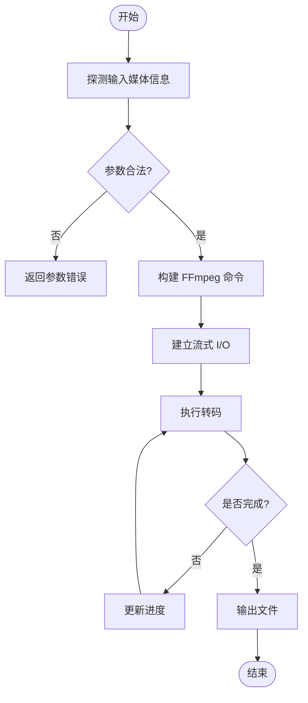
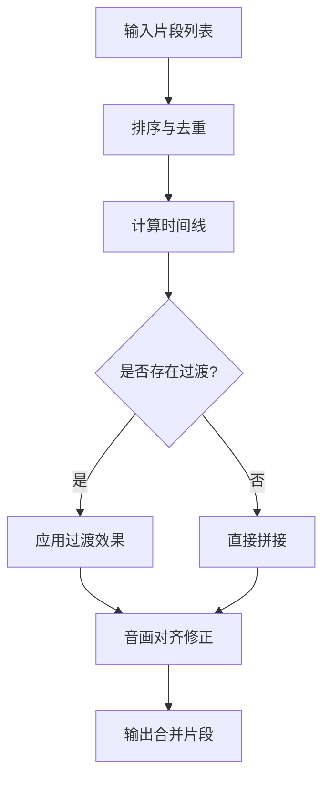
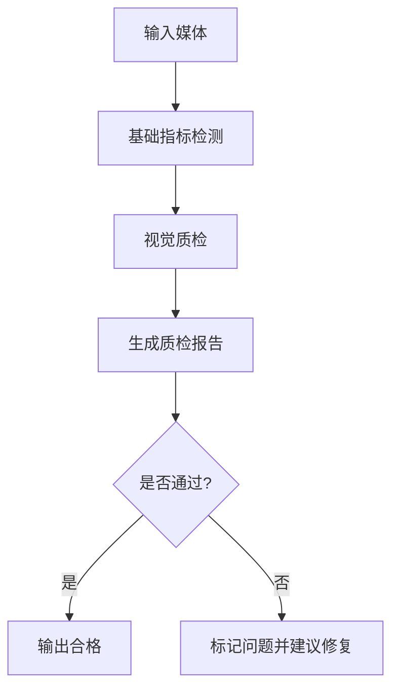
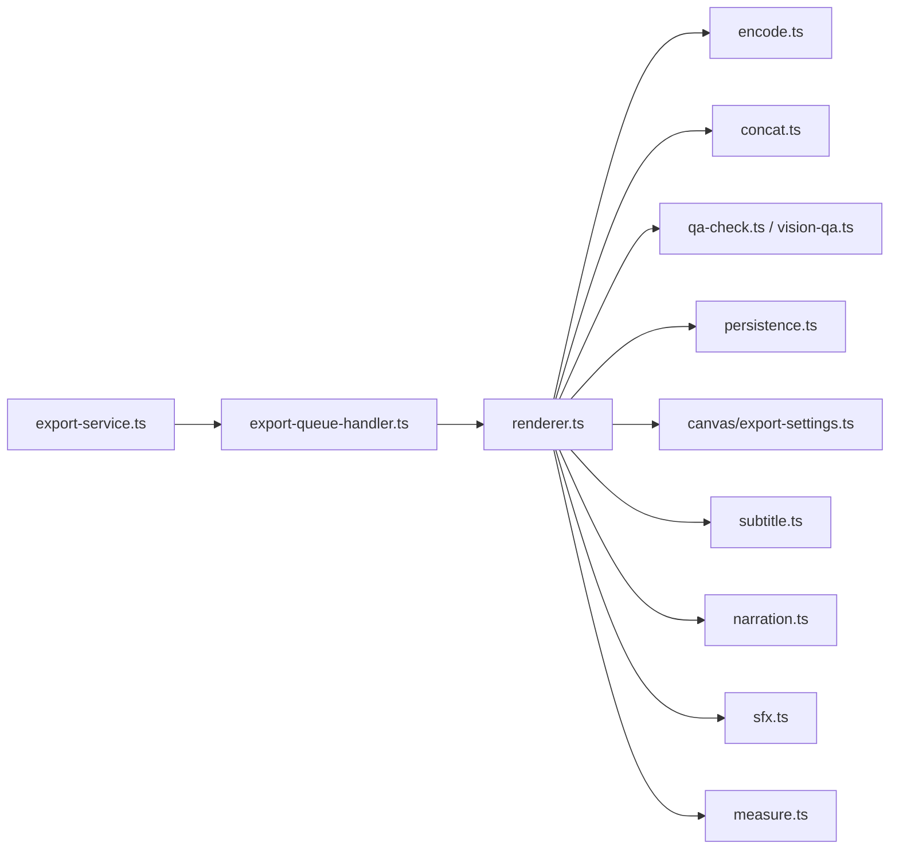

# 媒体处理

<cite>
**本文引用的文件**   
- [src/features/render/renderer.ts](file://src/features/render/renderer.ts)
- [src/features/render/encode.ts](file://src/features/render/encode.ts)
- [src/features/render/concat.ts](file://src/features/render/concat.ts)
- [src/features/render/frame-capture.ts](file://src/features/render/frame-capture.ts)
- [src/features/render/qa-check.ts](file://src/features/render/qa-check.ts)
- [src/features/render/vision-qa.ts](file://src/features/render/vision-qa.ts)
- [src/features/render/export-service.ts](file://src/features/render/export-service.ts)
- [src/features/render/export-queue-handler.ts](file://src/features/render/export-queue-handler.ts)
- [src/features/render/thumbnail.ts](file://src/features/render/thumbnail.ts)
- [src/features/render/persistence.ts](file://src/features/render/persistence.ts)
- [src/features/render/source-contract.ts](file://src/features/render/source-contract.ts)
- [src/features/render/types.ts](file://src/features/render/types.ts)
- [src/features/audio/subtitle.ts](file://src/features/audio/subtitle.ts)
- [src/features/audio/narration.ts](file://src/features/audio/narration.ts)
- [src/features/audio/sfx.ts](file://src/features/audio/sfx.ts)
- [src/features/audio/measure.ts](file://src/features/audio/measure.ts)
- [src/features/canvas/export-settings.ts](file://src/features/canvas/export-settings.ts)
- [src/app/api/render/route.ts](file://src/app/api/render/route.ts)
- [src/app/api/render/export/route.ts](file://src/app/api/render/export/route.ts)
</cite>

## 目录
1. [简介](#简介)
2. [项目结构](#项目结构)
3. [核心组件](#核心组件)
4. [架构总览](#架构总览)
5. [详细组件分析](#详细组件分析)
6. [依赖关系分析](#依赖关系分析)
7. [性能考量](#性能考量)
8. [故障排查指南](#故障排查指南)
9. [结论](#结论)
10. [附录](#附录)

## 简介
本技术文档聚焦 PurpleInk 的媒体处理模块，围绕媒体文件的组装流程展开，包括音视频合成、字幕叠加与水印添加；详细说明媒体格式兼容性处理、编码参数匹配与流式处理机制；阐述媒体片段裁剪、拼接与过渡效果实现；并覆盖媒体质量检查、元数据提取与格式验证能力。最后提供管道扩展接口与自定义处理器开发指南，帮助开发者快速集成与扩展媒体处理能力。

## 项目结构
媒体处理相关代码主要位于 src/features/render 与 src/features/audio、src/features/canvas 等模块中，并通过 API 路由暴露对外服务。整体结构遵循“渲染管线 + 编码器 + 导出队列”的分层设计：
- 渲染管线：负责编排帧捕获、转码、拼接、质量检查等步骤
- 编码器：封装 FFmpeg 调用，统一编码参数与格式适配
- 导出队列：基于任务队列异步执行导出任务，支持进度与结果持久化
- 音频与字幕：提供 TTS 生成、字幕解析与时间轴对齐
- 画布导出设置：统一分辨率、码率、帧率等导出配置

图表来源
- [src/app/api/render/route.ts](file://src/app/api/render/route.ts)
- [src/app/api/render/export/route.ts](file://src/app/api/render/export/route.ts)
- [src/features/render/renderer.ts](file://src/features/render/renderer.ts)
- [src/features/render/encode.ts](file://src/features/render/encode.ts)
- [src/features/render/concat.ts](file://src/features/render/concat.ts)
- [src/features/render/frame-capture.ts](file://src/features/render/frame-capture.ts)
- [src/features/render/qa-check.ts](file://src/features/render/qa-check.ts)
- [src/features/render/vision-qa.ts](file://src/features/render/vision-qa.ts)
- [src/features/render/persistence.ts](file://src/features/render/persistence.ts)
- [src/features/render/export-service.ts](file://src/features/render/export-service.ts)
- [src/features/render/export-queue-handler.ts](file://src/features/render/export-queue-handler.ts)
- [src/features/audio/subtitle.ts](file://src/features/audio/subtitle.ts)
- [src/features/audio/narration.ts](file://src/features/audio/narration.ts)
- [src/features/audio/sfx.ts](file://src/features/audio/sfx.ts)
- [src/features/audio/measure.ts](file://src/features/audio/measure.ts)
- [src/features/canvas/export-settings.ts](file://src/features/canvas/export-settings.ts)

章节来源
- [src/features/render/renderer.ts](file://src/features/render/renderer.ts)
- [src/features/render/encode.ts](file://src/features/render/encode.ts)
- [src/features/render/concat.ts](file://src/features/render/concat.ts)
- [src/features/render/frame-capture.ts](file://src/features/render/frame-capture.ts)
- [src/features/render/qa-check.ts](file://src/features/render/qa-check.ts)
- [src/features/render/vision-qa.ts](file://src/features/render/vision-qa.ts)
- [src/features/render/export-service.ts](file://src/features/render/export-service.ts)
- [src/features/render/export-queue-handler.ts](file://src/features/render/export-queue-handler.ts)
- [src/features/render/thumbnail.ts](file://src/features/render/thumbnail.ts)
- [src/features/render/persistence.ts](file://src/features/render/persistence.ts)
- [src/features/render/source-contract.ts](file://src/features/render/source-contract.ts)
- [src/features/render/types.ts](file://src/features/render/types.ts)
- [src/features/audio/subtitle.ts](file://src/features/audio/subtitle.ts)
- [src/features/audio/narration.ts](file://src/features/audio/narration.ts)
- [src/features/audio/sfx.ts](file://src/features/audio/sfx.ts)
- [src/features/audio/measure.ts](file://src/features/audio/measure.ts)
- [src/features/canvas/export-settings.ts](file://src/features/canvas/export-settings.ts)
- [src/app/api/render/route.ts](file://src/app/api/render/route.ts)
- [src/app/api/render/export/route.ts](file://src/app/api/render/export/route.ts)

## 核心组件
- 渲染器（Renderer）：编排帧捕获、转码、拼接、质量检查与持久化的完整流程，是媒体处理管线的中枢。
- 编码器（Encoder）：封装 FFmpeg 调用，统一输入输出格式、编码参数与流式处理，确保跨平台一致性。
- 拼接器（Concat）：按时间线对片段进行裁剪、拼接与过渡效果合成，保证音画同步与边界平滑。
- 帧捕获（Frame Capture）：从画布或中间产物中提取关键帧，用于缩略图与视觉质量检查。
- 质量检查（QA）：包含基础指标检测与视觉质检（Vision QA），保障输出符合质量标准。
- 导出服务与队列（Export Service & Queue）：将渲染任务入队，异步执行并持久化状态，支持进度回调与失败重试。
- 音频与字幕（Audio/Subtitle）：TTS 生成旁白、音效混音、字幕解析与时间轴对齐，支持多语言与样式。
- 画布导出设置（Export Settings）：集中管理分辨率、码率、帧率、容器格式等导出参数。

章节来源
- [src/features/render/renderer.ts](file://src/features/render/renderer.ts)
- [src/features/render/encode.ts](file://src/features/render/encode.ts)
- [src/features/render/concat.ts](file://src/features/render/concat.ts)
- [src/features/render/frame-capture.ts](file://src/features/render/frame-capture.ts)
- [src/features/render/qa-check.ts](file://src/features/render/qa-check.ts)
- [src/features/render/vision-qa.ts](file://src/features/render/vision-qa.ts)
- [src/features/render/export-service.ts](file://src/features/render/export-service.ts)
- [src/features/render/export-queue-handler.ts](file://src/features/render/export-queue-handler.ts)
- [src/features/audio/subtitle.ts](file://src/features/audio/subtitle.ts)
- [src/features/audio/narration.ts](file://src/features/audio/narration.ts)
- [src/features/audio/sfx.ts](file://src/features/audio/sfx.ts)
- [src/features/audio/measure.ts](file://src/features/audio/measure.ts)
- [src/features/canvas/export-settings.ts](file://src/features/canvas/export-settings.ts)

## 架构总览
渲染管线采用“生产者-消费者”模式：API 接收请求后创建渲染任务，导出服务将其放入队列，工作进程消费任务并驱动渲染器执行。编码器通过流式 I/O 降低内存占用，拼接器在时间线上精确控制片段顺序与过渡，质量检查在关键节点拦截异常，最终输出到持久化存储。

图表来源
- [src/app/api/render/route.ts](file://src/app/api/render/route.ts)
- [src/features/render/export-service.ts](file://src/features/render/export-service.ts)
- [src/features/render/export-queue-handler.ts](file://src/features/render/export-queue-handler.ts)
- [src/features/render/renderer.ts](file://src/features/render/renderer.ts)
- [src/features/render/encode.ts](file://src/features/render/encode.ts)
- [src/features/render/concat.ts](file://src/features/render/concat.ts)
- [src/features/render/qa-check.ts](file://src/features/render/qa-check.ts)
- [src/features/render/persistence.ts](file://src/features/render/persistence.ts)

## 详细组件分析

### 渲染器（Renderer）
- 职责：编排帧捕获、转码、拼接、质量检查与持久化；协调编码器与拼接器的参数与数据流。
- 关键点：
  - 输入源契约：统一媒体源的读取接口，支持本地文件、URL 与流式输入。
  - 阶段化执行：分阶段推进任务状态，便于监控与恢复。
  - 错误隔离：各阶段异常捕获与回滚，避免污染中间产物。
  - 资源管理：合理释放临时文件与句柄，防止内存泄漏。

图表来源
- [src/features/render/renderer.ts](file://src/features/render/renderer.ts)
- [src/features/render/source-contract.ts](file://src/features/render/source-contract.ts)
- [src/features/canvas/export-settings.ts](file://src/features/canvas/export-settings.ts)

章节来源
- [src/features/render/renderer.ts](file://src/features/render/renderer.ts)
- [src/features/render/source-contract.ts](file://src/features/render/source-contract.ts)
- [src/features/canvas/export-settings.ts](file://src/features/canvas/export-settings.ts)

### 编码器（Encoder）
- 职责：封装 FFmpeg 调用，统一编码参数与格式适配，支持流式读写。
- 关键点：
  - 格式兼容：根据目标容器与设备特性自动选择编码器与参数。
  - 流式处理：边读边写，降低峰值内存占用。
  - 参数校验：对码率、分辨率、帧率等进行合法性检查。
  - 进度上报：实时反馈转码进度与耗时。

图表来源
- [src/features/render/encode.ts](file://src/features/render/encode.ts)

章节来源
- [src/features/render/encode.ts](file://src/features/render/encode.ts)

### 拼接器（Concat）
- 职责：按时间线对片段进行裁剪、拼接与过渡效果合成，保证音画同步与边界平滑。
- 关键点：
  - 时间线模型：以时间戳为基准组织片段，支持重叠与淡入淡出。
  - 过渡效果：实现交叉溶解、滑动、缩放等常见过渡。
  - 音画对齐：确保音频与视频片段的起止时间一致。
  - 边界处理：处理首尾静音、黑帧与缓冲段。

图表来源
- [src/features/render/concat.ts](file://src/features/render/concat.ts)

章节来源
- [src/features/render/concat.ts](file://src/features/render/concat.ts)

### 帧捕获（Frame Capture）
- 职责：从画布或中间产物中提取关键帧，用于缩略图与视觉质量检查。
- 关键点：
  - 关键帧选择：基于场景变化或固定间隔选取代表性帧。
  - 尺寸适配：按缩略图规格缩放并保持比例。
  - 缓存策略：对相同输入复用已生成的帧。

章节来源
- [src/features/render/frame-capture.ts](file://src/features/render/frame-capture.ts)
- [src/features/render/thumbnail.ts](file://src/features/render/thumbnail.ts)

### 质量检查（QA）
- 职责：执行基础指标检测与视觉质检，保障输出符合质量标准。
- 关键点：
  - 基础指标：时长、码率、分辨率、帧率、声道数等。
  - 视觉质检：基于图像识别检测黑屏、过曝、模糊等问题。
  - 报告生成：结构化输出检查结果与建议。

图表来源
- [src/features/render/qa-check.ts](file://src/features/render/qa-check.ts)
- [src/features/render/vision-qa.ts](file://src/features/render/vision-qa.ts)

章节来源
- [src/features/render/qa-check.ts](file://src/features/render/qa-check.ts)
- [src/features/render/vision-qa.ts](file://src/features/render/vision-qa.ts)

### 导出服务与队列（Export Service & Queue）
- 职责：将渲染任务入队，异步执行并持久化状态，支持进度回调与失败重试。
- 关键点：
  - 任务调度：支持优先级与并发限制。
  - 状态持久化：记录任务生命周期与中间状态。
  - 进度上报：通过事件或轮询方式反馈进度。
  - 失败重试：指数退避与最大重试次数控制。

章节来源
- [src/features/render/export-service.ts](file://src/features/render/export-service.ts)
- [src/features/render/export-queue-handler.ts](file://src/features/render/export-queue-handler.ts)
- [src/features/render/persistence.ts](file://src/features/render/persistence.ts)

### 音频与字幕（Audio/Subtitle）
- 职责：TTS 生成旁白、音效混音、字幕解析与时间轴对齐，支持多语言与样式。
- 关键点：
  - TTS 集成：调用外部服务生成语音，支持音色与语速调节。
  - 字幕格式：支持 SRT、ASS 等格式解析与嵌入。
  - 时间轴对齐：确保字幕与语音、画面同步。
  - 混音策略：背景音、音效与旁白的音量平衡。

章节来源
- [src/features/audio/subtitle.ts](file://src/features/audio/subtitle.ts)
- [src/features/audio/narration.ts](file://src/features/audio/narration.ts)
- [src/features/audio/sfx.ts](file://src/features/audio/sfx.ts)
- [src/features/audio/measure.ts](file://src/features/audio/measure.ts)

### 画布导出设置（Export Settings）
- 职责：集中管理分辨率、码率、帧率、容器格式等导出参数。
- 关键点：
  - 预设模板：提供常用设备与平台的预设。
  - 动态调整：根据内容类型自动优化参数。
  - 兼容性检查：确保参数组合合法且可被目标播放器支持。

章节来源
- [src/features/canvas/export-settings.ts](file://src/features/canvas/export-settings.ts)

## 依赖关系分析
渲染器依赖编码器、拼接器、质量检查与持久化模块；编码器依赖 FFmpeg 工具链；拼接器依赖时间线模型与过渡算法；音频与字幕模块依赖 TTS 与字幕解析库；导出服务依赖队列与存储后端。

图表来源
- [src/features/render/renderer.ts](file://src/features/render/renderer.ts)
- [src/features/render/encode.ts](file://src/features/render/encode.ts)
- [src/features/render/concat.ts](file://src/features/render/concat.ts)
- [src/features/render/qa-check.ts](file://src/features/render/qa-check.ts)
- [src/features/render/vision-qa.ts](file://src/features/render/vision-qa.ts)
- [src/features/render/persistence.ts](file://src/features/render/persistence.ts)
- [src/features/canvas/export-settings.ts](file://src/features/canvas/export-settings.ts)
- [src/features/audio/subtitle.ts](file://src/features/audio/subtitle.ts)
- [src/features/audio/narration.ts](file://src/features/audio/narration.ts)
- [src/features/audio/sfx.ts](file://src/features/audio/sfx.ts)
- [src/features/audio/measure.ts](file://src/features/audio/measure.ts)
- [src/features/render/export-service.ts](file://src/features/render/export-service.ts)
- [src/features/render/export-queue-handler.ts](file://src/features/render/export-queue-handler.ts)

章节来源
- [src/features/render/renderer.ts](file://src/features/render/renderer.ts)
- [src/features/render/encode.ts](file://src/features/render/encode.ts)
- [src/features/render/concat.ts](file://src/features/render/concat.ts)
- [src/features/render/qa-check.ts](file://src/features/render/qa-check.ts)
- [src/features/render/vision-qa.ts](file://src/features/render/vision-qa.ts)
- [src/features/render/persistence.ts](file://src/features/render/persistence.ts)
- [src/features/canvas/export-settings.ts](file://src/features/canvas/export-settings.ts)
- [src/features/audio/subtitle.ts](file://src/features/audio/subtitle.ts)
- [src/features/audio/narration.ts](file://src/features/audio/narration.ts)
- [src/features/audio/sfx.ts](file://src/features/audio/sfx.ts)
- [src/features/audio/measure.ts](file://src/features/audio/measure.ts)
- [src/features/render/export-service.ts](file://src/features/render/export-service.ts)
- [src/features/render/export-queue-handler.ts](file://src/features/render/export-queue-handler.ts)

## 性能考量
- 流式 I/O：编码器与拼接器均采用流式处理，减少内存峰值。
- 并行处理：帧捕获与转码可并行执行，提升吞吐。
- 缓存策略：对重复输入的关键帧与中间产物进行缓存。
- 资源回收：及时释放临时文件与句柄，避免资源泄露。
- 队列限流：控制并发任务数量，防止系统过载。

[本节为通用指导，不直接分析具体文件]

## 故障排查指南
- 常见问题：
  - 编码失败：检查输入格式与编码器兼容性，确认参数合法。
  - 音画不同步：核对时间线模型与片段起止时间。
  - 质量不达标：查看质检报告，定位黑屏、过曝或模糊问题。
  - 队列堆积：检查工作进程状态与资源使用情况。
- 调试建议：
  - 启用详细日志，记录每个阶段的输入输出。
  - 使用最小复现用例，逐步缩小问题范围。
  - 借助 ffprobe 与 ffplay 验证媒体文件。

章节来源
- [src/features/render/qa-check.ts](file://src/features/render/qa-check.ts)
- [src/features/render/vision-qa.ts](file://src/features/render/vision-qa.ts)
- [src/features/render/export-queue-handler.ts](file://src/features/render/export-queue-handler.ts)

## 结论
PurpleInk 媒体处理模块通过清晰的架构设计与模块化实现，提供了完整的媒体文件组装能力。渲染器作为中枢协调各组件，编码器与拼接器确保高效稳定的转码与合成，质量检查保障输出品质，导出服务与队列支持高并发与可靠性。开发者可基于现有接口快速扩展自定义处理器，满足多样化业务需求。

[本节为总结性内容，不直接分析具体文件]

## 附录
- 扩展接口：
  - 自定义编码器：实现统一的编码接口，注册到编码器工厂。
  - 自定义过渡效果：实现过渡算法接口，接入拼接器。
  - 自定义质量检查：实现质检规则接口，接入 QA 模块。
- 最佳实践：
  - 保持输入输出格式一致，减少转换开销。
  - 合理使用缓存与并行，平衡性能与资源。
  - 完善错误处理与日志，便于问题定位。

[本节为补充说明，不直接分析具体文件]