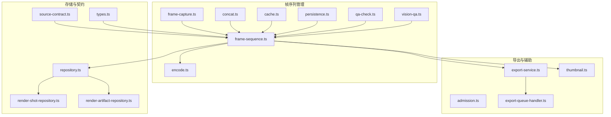
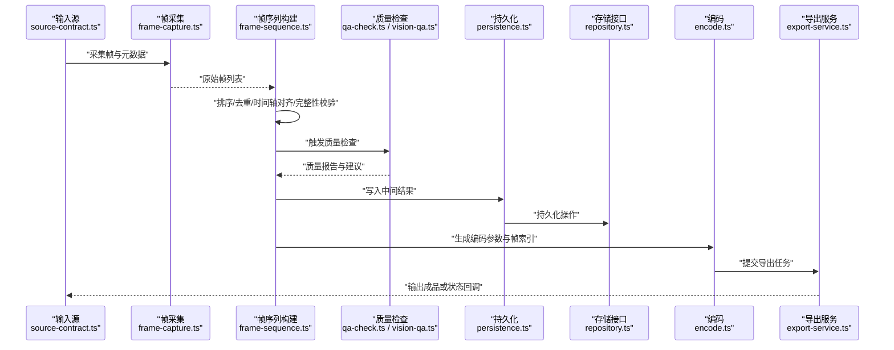
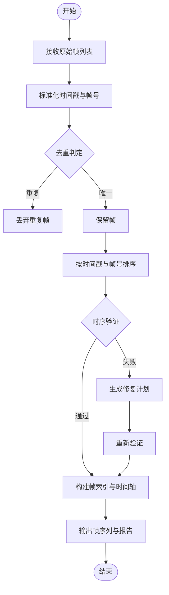
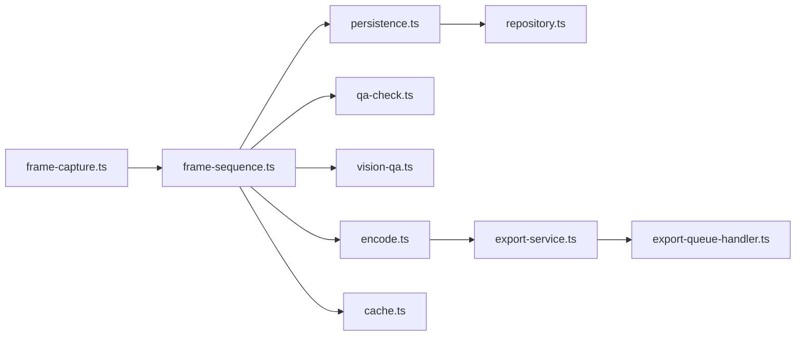

# 帧序列管理

<cite>
**本文引用的文件**   
- [frame-sequence.ts](file://src/features/render/frame-sequence.ts)
- [frame-capture.ts](file://src/features/render/frame-capture.ts)
- [concat.ts](file://src/features/render/concat.ts)
- [encode.ts](file://src/features/render/encode.ts)
- [persistence.ts](file://src/features/render/persistence.ts)
- [qa-check.ts](file://src/features/render/qa-check.ts)
- [vision-qa.ts](file://src/features/render/vision-qa.ts)
- [cache.ts](file://src/features/render/cache.ts)
- [render-shot-repository.ts](file://src/features/render/render-shot-repository.ts)
- [render-artifact-repository.ts](file://src/features/render/render-artifact-repository.ts)
- [repository.ts](file://src/features/render/repository.ts)
- [types.ts](file://src/features/render/types.ts)
- [source-contract.ts](file://src/features/render/source-contract.ts)
- [admission.ts](file://src/features/render/admission.ts)
- [export-service.ts](file://src/features/render/export-service.ts)
- [export-queue-handler.ts](file://src/features/render/export-queue-handler.ts)
- [thumbnail.ts](file://src/features/render/thumbnail.ts)
</cite>

## 目录
1. [简介](#简介)
2. [项目结构](#项目结构)
3. [核心组件](#核心组件)
4. [架构总览](#架构总览)
5. [详细组件分析](#详细组件分析)
6. [依赖关系分析](#依赖关系分析)
7. [性能考量](#性能考量)
8. [故障排查指南](#故障排查指南)
9. [结论](#结论)
10. [附录](#附录)

## 简介
本技术文档聚焦 PurpleInk 的“帧序列管理”模块，围绕以下目标展开：
- 帧排序算法与时间轴同步机制（帧编号规则、时间戳计算、时序验证）
- 帧去重逻辑、重复帧检测与优化策略
- 帧序列完整性检查、缺失帧检测与修复机制
- 帧缓存策略、内存管理与磁盘 I/O 优化
- 帧序列验证工具、调试接口与性能监控功能

该模块位于渲染子系统内，负责将多来源的帧数据统一为有序、可回放、可导出的高质量帧序列，并与音频、字幕、缩略图及最终视频编码流程协同工作。

## 项目结构
帧序列管理相关代码集中在 src/features/render 目录下，关键文件职责如下：
- frame-sequence.ts：帧序列构建、排序、去重、完整性校验与时间轴对齐
- frame-capture.ts：帧采集与元数据收集（分辨率、时长、采样点等）
- concat.ts：帧片段拼接与边界处理
- encode.ts：编码参数与编码管线对接
- persistence.ts：帧数据的持久化与恢复
- qa-check.ts / vision-qa.ts：质量检查与视觉 QA
- cache.ts：帧缓存策略与内存管理
- repository.ts / render-shot-repository.ts / render-artifact-repository.ts：存储与查询接口
- types.ts / source-contract.ts：类型定义与输入源契约
- admission.ts：入队准入控制
- export-service.ts / export-queue-handler.ts：导出服务与队列处理
- thumbnail.ts：缩略图生成

图表来源
- [frame-sequence.ts](file://src/features/render/frame-sequence.ts)
- [frame-capture.ts](file://src/features/render/frame-capture.ts)
- [concat.ts](file://src/features/render/concat.ts)
- [encode.ts](file://src/features/render/encode.ts)
- [persistence.ts](file://src/features/render/persistence.ts)
- [qa-check.ts](file://src/features/render/qa-check.ts)
- [vision-qa.ts](file://src/features/render/vision-qa.ts)
- [cache.ts](file://src/features/render/cache.ts)
- [repository.ts](file://src/features/render/repository.ts)
- [render-shot-repository.ts](file://src/features/render/render-shot-repository.ts)
- [render-artifact-repository.ts](file://src/features/render/render-artifact-repository.ts)
- [types.ts](file://src/features/render/types.ts)
- [source-contract.ts](file://src/features/render/source-contract.ts)
- [admission.ts](file://src/features/render/admission.ts)
- [export-service.ts](file://src/features/render/export-service.ts)
- [export-queue-handler.ts](file://src/features/render/export-queue-handler.ts)
- [thumbnail.ts](file://src/features/render/thumbnail.ts)

章节来源
- [frame-sequence.ts](file://src/features/render/frame-sequence.ts)
- [frame-capture.ts](file://src/features/render/frame-capture.ts)
- [concat.ts](file://src/features/render/concat.ts)
- [encode.ts](file://src/features/render/encode.ts)
- [persistence.ts](file://src/features/render/persistence.ts)
- [qa-check.ts](file://src/features/render/qa-check.ts)
- [vision-qa.ts](file://src/features/render/vision-qa.ts)
- [cache.ts](file://src/features/render/cache.ts)
- [repository.ts](file://src/features/render/repository.ts)
- [render-shot-repository.ts](file://src/features/render/render-shot-repository.ts)
- [render-artifact-repository.ts](file://src/features/render/render-artifact-repository.ts)
- [types.ts](file://src/features/render/types.ts)
- [source-contract.ts](file://src/features/render/source-contract.ts)
- [admission.ts](file://src/features/render/admission.ts)
- [export-service.ts](file://src/features/render/export-service.ts)
- [export-queue-handler.ts](file://src/features/render/export-queue-handler.ts)
- [thumbnail.ts](file://src/features/render/thumbnail.ts)

## 核心组件
- 帧序列构建器（frame-sequence.ts）
  - 负责帧的统一建模、排序、去重、时间轴对齐、完整性校验与修复建议输出
  - 提供时间戳换算、帧号映射、时序一致性检查
- 帧采集器（frame-capture.ts）
  - 从不同来源（浏览器截图、媒体文件、流式数据）采集帧并附带元数据
- 拼接器（concat.ts）
  - 将多个帧片段按时间线拼接，处理边界帧与重叠区域
- 编码器（encode.ts）
  - 将帧序列转换为视频编码所需的参数与中间产物
- 持久化（persistence.ts）
  - 帧序列与中间结果的落盘、断点续传与恢复
- 质量检查（qa-check.ts / vision-qa.ts）
  - 统计性质量检查与视觉差异检测
- 缓存（cache.ts）
  - 帧级缓存策略、内存上限与淘汰策略
- 存储与契约（repository.ts / render-shot-repository.ts / render-artifact-repository.ts / types.ts / source-contract.ts）
  - 统一的读写接口、领域模型与输入源约束
- 导出与队列（export-service.ts / export-queue-handler.ts）
  - 导出任务编排与并发控制
- 缩略图（thumbnail.ts）
  - 基于帧序列生成预览缩略图

章节来源
- [frame-sequence.ts](file://src/features/render/frame-sequence.ts)
- [frame-capture.ts](file://src/features/render/frame-capture.ts)
- [concat.ts](file://src/features/render/concat.ts)
- [encode.ts](file://src/features/render/encode.ts)
- [persistence.ts](file://src/features/render/persistence.ts)
- [qa-check.ts](file://src/features/render/qa-check.ts)
- [vision-qa.ts](file://src/features/render/vision-qa.ts)
- [cache.ts](file://src/features/render/cache.ts)
- [repository.ts](file://src/features/render/repository.ts)
- [render-shot-repository.ts](file://src/features/render/render-shot-repository.ts)
- [render-artifact-repository.ts](file://src/features/render/render-artifact-repository.ts)
- [types.ts](file://src/features/render/types.ts)
- [source-contract.ts](file://src/features/render/source-contract.ts)
- [export-service.ts](file://src/features/render/export-service.ts)
- [export-queue-handler.ts](file://src/features/render/export-queue-handler.ts)
- [thumbnail.ts](file://src/features/render/thumbnail.ts)

## 架构总览
帧序列管理的整体流程如下：
- 输入层：通过 source-contract 定义的输入源（浏览器捕获、媒体文件、外部流）进入 frame-capture
- 构建层：frame-sequence 对帧进行统一建模、排序、去重、时间轴对齐与完整性校验
- 存储层：persistence 与 repository 系列完成持久化与查询
- 质量层：qa-check 与 vision-qa 进行质量评估与问题定位
- 输出层：encode 与 export-service 驱动编码与导出；thumbnail 生成预览

图表来源
- [source-contract.ts](file://src/features/render/source-contract.ts)
- [frame-capture.ts](file://src/features/render/frame-capture.ts)
- [frame-sequence.ts](file://src/features/render/frame-sequence.ts)
- [qa-check.ts](file://src/features/render/qa-check.ts)
- [vision-qa.ts](file://src/features/render/vision-qa.ts)
- [persistence.ts](file://src/features/render/persistence.ts)
- [repository.ts](file://src/features/render/repository.ts)
- [encode.ts](file://src/features/render/encode.ts)
- [export-service.ts](file://src/features/render/export-service.ts)

## 详细组件分析

### 帧序列构建与时间轴同步（frame-sequence.ts）
- 帧编号规则
  - 采用单调递增的整数帧号，结合时间戳形成唯一键，避免跨来源冲突
  - 支持负时间戳与相对时间偏移，用于对齐不同来源的时间基准
- 时间戳计算
  - 统一以毫秒为单位，提供时间单位转换与精度对齐
  - 支持帧率换算（fps）与关键帧间隔（gop）参与时间轴规划
- 时序验证
  - 检查帧号连续性、时间戳单调性、重复时间戳与跳帧
  - 输出时序异常位置与修复建议（插入占位帧、插值、裁剪）
- 去重逻辑
  - 基于内容指纹（哈希）与时间窗口双重判定，识别重复帧
  - 保留高置信度帧，丢弃冗余副本
- 完整性检查与修复
  - 扫描期望区间内的缺失帧，生成修复计划（补采、插值、复制相邻帧）
  - 提供修复前后对比指标（覆盖率、抖动、平滑度）

图表来源
- [frame-sequence.ts](file://src/features/render/frame-sequence.ts)

章节来源
- [frame-sequence.ts](file://src/features/render/frame-sequence.ts)

### 帧采集与元数据（frame-capture.ts）
- 多来源适配：浏览器截图、媒体文件、流式数据
- 元数据采集：分辨率、色彩空间、帧率、时长、关键帧信息
- 错误处理：超时、解码失败、格式不支持的降级策略

章节来源
- [frame-capture.ts](file://src/features/render/frame-capture.ts)

### 帧片段拼接（concat.ts）
- 片段合并：按时间线顺序拼接，处理重叠与间隙
- 边界处理：首尾帧扩展、过渡帧插入
- 一致性检查：分辨率、色彩空间、帧率一致性校验

章节来源
- [concat.ts](file://src/features/render/concat.ts)

### 编码与导出（encode.ts / export-service.ts / export-queue-handler.ts）
- 编码参数：码率、分辨率、帧率、GOP、滤镜链
- 导出服务：任务拆分、并发控制、进度上报
- 队列处理：优先级、重试、失败回滚

章节来源
- [encode.ts](file://src/features/render/encode.ts)
- [export-service.ts](file://src/features/render/export-service.ts)
- [export-queue-handler.ts](file://src/features/render/export-queue-handler.ts)

### 持久化与存储（persistence.ts / repository.ts / render-shot-repository.ts / render-artifact-repository.ts）
- 持久化：分块写入、断点续传、事务性更新
- 存储接口：统一 CRUD、分页查询、条件过滤
- 领域模型：Shot、Artifact、FrameSequence 等实体关系

章节来源
- [persistence.ts](file://src/features/render/persistence.ts)
- [repository.ts](file://src/features/render/repository.ts)
- [render-shot-repository.ts](file://src/features/render/render-shot-repository.ts)
- [render-artifact-repository.ts](file://src/features/render/render-artifact-repository.ts)

### 质量检查与视觉 QA（qa-check.ts / vision-qa.ts）
- 统计性检查：帧率稳定性、时间戳抖动、重复率、覆盖率
- 视觉 QA：帧间差异检测、关键帧质量评分、异常帧定位

章节来源
- [qa-check.ts](file://src/features/render/qa-check.ts)
- [vision-qa.ts](file://src/features/render/vision-qa.ts)

### 缓存策略与内存管理（cache.ts）
- 缓存粒度：帧级、片段级、索引级
- 淘汰策略：LRU/LFU、基于内存上限与访问频率
- 内存管理：对象池、零拷贝、垃圾回收友好

章节来源
- [cache.ts](file://src/features/render/cache.ts)

### 缩略图生成（thumbnail.ts）
- 基于关键帧或均匀采样帧生成缩略图
- 尺寸与质量配置，批量生成与缓存

章节来源
- [thumbnail.ts](file://src/features/render/thumbnail.ts)

### 输入源契约与类型（source-contract.ts / types.ts）
- 输入源契约：统一接口、错误码、元数据结构
- 类型定义：帧、时间戳、序列、质量报告等

章节来源
- [source-contract.ts](file://src/features/render/source-contract.ts)
- [types.ts](file://src/features/render/types.ts)

### 入队准入控制（admission.ts）
- 资源检查：CPU、GPU、磁盘、网络
- 配额限制：并发数、速率限制、优先级调度

章节来源
- [admission.ts](file://src/features/render/admission.ts)

## 依赖关系分析
- 低耦合设计：各组件通过明确接口交互，减少直接依赖
- 关键依赖链：
  - frame-capture → frame-sequence → persistence → repository
  - frame-sequence → qa-check / vision-qa
  - frame-sequence → encode → export-service → export-queue-handler
  - frame-sequence → cache（读路径）与 persistence（写路径）

图表来源
- [frame-capture.ts](file://src/features/render/frame-capture.ts)
- [frame-sequence.ts](file://src/features/render/frame-sequence.ts)
- [persistence.ts](file://src/features/render/persistence.ts)
- [repository.ts](file://src/features/render/repository.ts)
- [qa-check.ts](file://src/features/render/qa-check.ts)
- [vision-qa.ts](file://src/features/render/vision-qa.ts)
- [encode.ts](file://src/features/render/encode.ts)
- [export-service.ts](file://src/features/render/export-service.ts)
- [export-queue-handler.ts](file://src/features/render/export-queue-handler.ts)
- [cache.ts](file://src/features/render/cache.ts)

章节来源
- [frame-sequence.ts](file://src/features/render/frame-sequence.ts)
- [repository.ts](file://src/features/render/repository.ts)
- [export-service.ts](file://src/features/render/export-service.ts)

## 性能考量
- 排序与去重复杂度
  - 排序：O(n log n)，建议使用稳定排序保持时间戳相等时的帧号顺序
  - 去重：基于哈希的 O(n) 平均复杂度，配合时间窗口降低误判
- 时间轴对齐
  - 统一时间单位与精度，减少浮点误差
  - 批量处理与并行化提升吞吐
- 缓存与 I/O
  - 热点帧常驻内存，冷数据落盘
  - 顺序写入与预分配减少碎片
- 质量检查
  - 抽样检查与增量更新，避免全量扫描
- 导出与编码
  - 流水线并行，缓冲池复用，避免频繁 GC

[本节为通用指导，不直接分析具体文件]

## 故障排查指南
- 常见问题
  - 时序异常：时间戳非单调、重复时间戳、跳帧
  - 完整性问题：缺失帧、覆盖率不足
  - 重复帧过多：去重阈值不当或指纹碰撞
  - 导出失败：编码参数不匹配、资源不足
- 诊断步骤
  - 使用 qa-check 与 vision-qa 输出质量报告
  - 检查 persistence 日志与 repository 查询结果
  - 查看 export-service 与 export-queue-handler 的任务状态
  - 调整 cache 策略与内存上限
- 修复建议
  - 插入占位帧或插值修复缺失
  - 调整去重阈值与时间窗口
  - 优化编码参数与并发设置

章节来源
- [qa-check.ts](file://src/features/render/qa-check.ts)
- [vision-qa.ts](file://src/features/render/vision-qa.ts)
- [persistence.ts](file://src/features/render/persistence.ts)
- [repository.ts](file://src/features/render/repository.ts)
- [export-service.ts](file://src/features/render/export-service.ts)
- [export-queue-handler.ts](file://src/features/render/export-queue-handler.ts)
- [cache.ts](file://src/features/render/cache.ts)

## 结论
PurpleInk 的帧序列管理模块通过清晰的组件划分与严格的时序控制，实现了高效、可靠的帧排序、去重、完整性校验与导出流程。借助缓存策略与质量检查，系统在性能与质量之间取得平衡。建议在生产环境中持续监控时序与质量指标，并根据业务需求动态调整去重阈值与缓存策略。

[本节为总结，不直接分析具体文件]

## 附录
- 术语表
  - 帧号：单调递增的整数标识
  - 时间戳：统一毫秒单位的时刻
  - 去重：基于内容与时间的重复帧识别
  - 完整性：期望区间内帧的覆盖程度
- 最佳实践
  - 使用稳定排序与统一时间基准
  - 合理设置去重阈值与时间窗口
  - 分层缓存与顺序写入
  - 增量质量检查与可视化报告

[本节为补充信息，不直接分析具体文件]