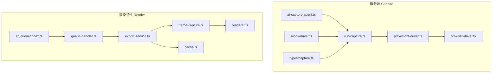
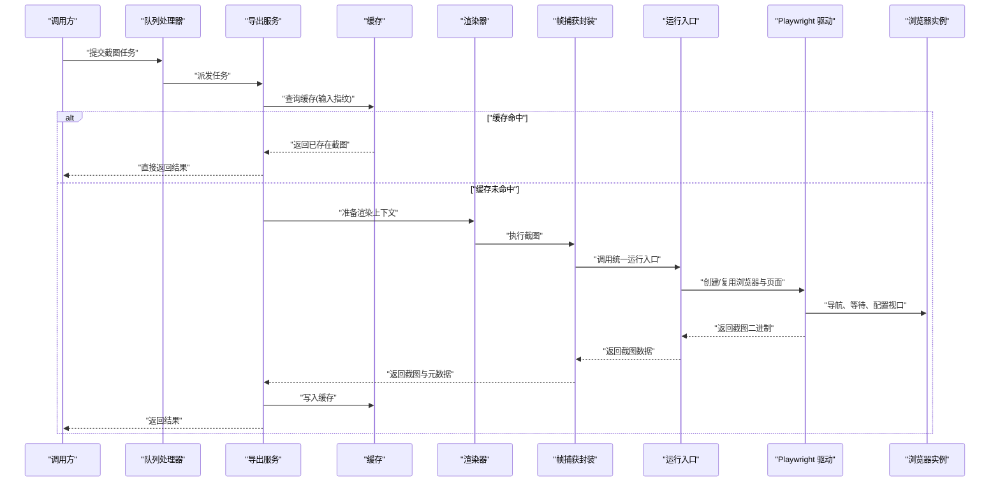
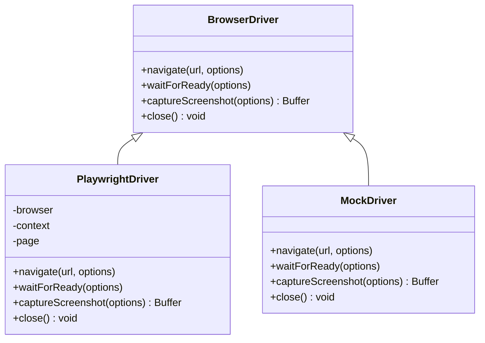
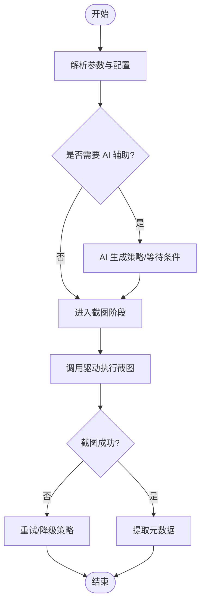
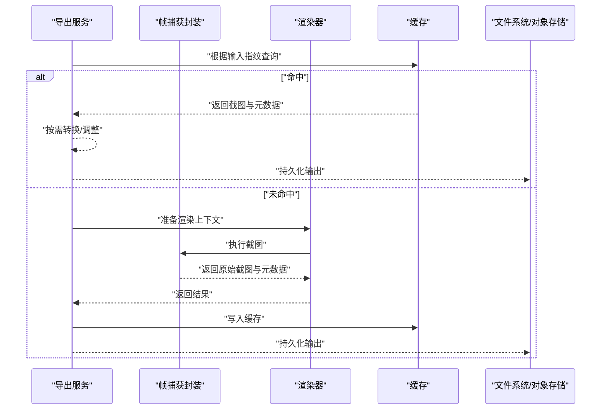
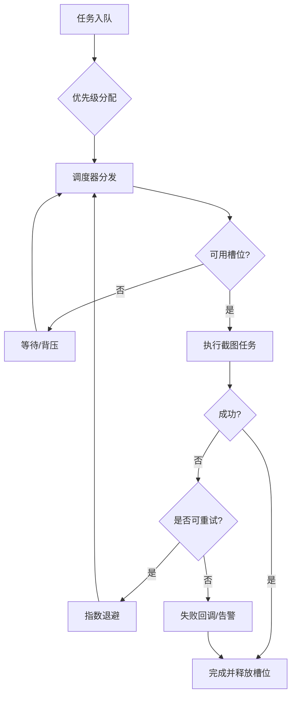
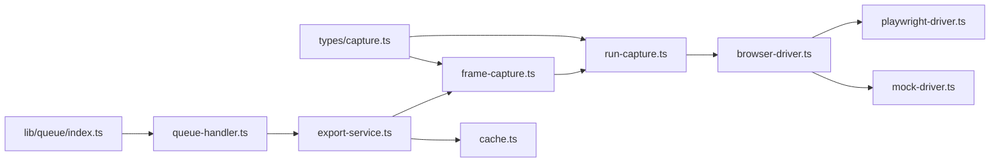

# 帧捕获

<cite>
**本文引用的文件**   
- [server/src/capture/playwright-driver.ts](file://server/src/capture/playwright-driver.ts)
- [server/src/capture/browser-driver.ts](file://server/src/capture/browser-driver.ts)
- [server/src/capture/run-capture.ts](file://server/src/capture/run-capture.ts)
- [server/src/capture/ai-capture-agent.ts](file://server/src/capture/ai-capture-agent.ts)
- [server/src/capture/mock-driver.ts](file://server/src/capture/mock-driver.ts)
- [server/src/types/capture.ts](file://server/src/types/capture.ts)
- [src/features/render/frame-capture.ts](file://src/features/render/frame-capture.ts)
- [src/features/render/renderer.ts](file://src/features/render/renderer.ts)
- [src/features/render/export-service.ts](file://src/features/render/export-service.ts)
- [src/features/render/cache.ts](file://src/features/render/cache.ts)
- [src/features/render/queue-handler.ts](file://src/features/render/queue-handler.ts)
- [src/lib/queue/index.ts](file://src/lib/queue/index.ts)
</cite>

## 目录
1. [简介](#简介)
2. [项目结构](#项目结构)
3. [核心组件](#核心组件)
4. [架构总览](#架构总览)
5. [详细组件分析](#详细组件分析)
6. [依赖关系分析](#依赖关系分析)
7. [性能考量](#性能考量)
8. [故障排查指南](#故障排查指南)
9. [结论](#结论)
10. [附录](#附录)

## 简介
本技术文档聚焦 PurpleInk 的“帧捕获”模块，围绕基于 Playwright 的浏览器自动化截图能力进行系统化说明。内容涵盖：
- 截图时机控制、视口配置与渲染优化
- 截图质量优化策略（DPI、抗锯齿、字体渲染、缓存）
- 异步截图队列管理、并发控制与内存优化
- 截图格式转换、尺寸调整与元数据提取
- 失败重试机制、超时处理与错误诊断工具

该模块通过 Playwright 驱动无头浏览器，结合渲染管线与导出服务，实现稳定、可配置、可扩展的网页帧捕获能力，并向上层导出流程提供高质量图像资源。

## 项目结构
帧捕获相关代码主要分布在服务端 capture 子系统与前端 render 特性中：
- server/src/capture：Playwright 驱动、浏览器实例管理、AI 辅助采集、统一运行入口
- server/src/types/capture：类型定义与契约
- src/features/render：渲染管线、帧捕获封装、导出服务、缓存、队列处理器等

图表来源
- [server/src/capture/playwright-driver.ts](file://server/src/capture/playwright-driver.ts)
- [server/src/capture/browser-driver.ts](file://server/src/capture/browser-driver.ts)
- [server/src/capture/run-capture.ts](file://server/src/capture/run-capture.ts)
- [server/src/capture/ai-capture-agent.ts](file://server/src/capture/ai-capture-agent.ts)
- [server/src/capture/mock-driver.ts](file://server/src/capture/mock-driver.ts)
- [server/src/types/capture.ts](file://server/src/types/capture.ts)
- [src/features/render/frame-capture.ts](file://src/features/render/frame-capture.ts)
- [src/features/render/renderer.ts](file://src/features/render/renderer.ts)
- [src/features/render/export-service.ts](file://src/features/render/export-service.ts)
- [src/features/render/cache.ts](file://src/features/render/cache.ts)
- [src/features/render/queue-handler.ts](file://src/features/render/queue-handler.ts)
- [src/lib/queue/index.ts](file://src/lib/queue/index.ts)

章节来源
- [server/src/capture/playwright-driver.ts](file://server/src/capture/playwright-driver.ts)
- [server/src/capture/browser-driver.ts](file://server/src/capture/browser-driver.ts)
- [server/src/capture/run-capture.ts](file://server/src/capture/run-capture.ts)
- [server/src/capture/ai-capture-agent.ts](file://server/src/capture/ai-capture-agent.ts)
- [server/src/capture/mock-driver.ts](file://server/src/capture/mock-driver.ts)
- [server/src/types/capture.ts](file://server/src/types/capture.ts)
- [src/features/render/frame-capture.ts](file://src/features/render/frame-capture.ts)
- [src/features/render/renderer.ts](file://src/features/render/renderer.ts)
- [src/features/render/export-service.ts](file://src/features/render/export-service.ts)
- [src/features/render/cache.ts](file://src/features/render/cache.ts)
- [src/features/render/queue-handler.ts](file://src/features/render/queue-handler.ts)
- [src/lib/queue/index.ts](file://src/lib/queue/index.ts)

## 核心组件
- Playwright 驱动：封装浏览器实例、页面生命周期、截图参数与网络拦截
- 浏览器驱动抽象：统一不同后端（真实浏览器/模拟）的截图接口
- 统一运行入口：编排 AI 辅助、导航等待、截图执行与结果回传
- 类型契约：定义截图请求、响应、配置项与错误码
- 渲染封装：将 Playwright 截图能力集成到渲染管线，支持格式转换、尺寸调整与元数据提取
- 导出服务：协调帧捕获、缓存命中、持久化与输出
- 队列处理器：异步任务调度、并发限制、重试与超时控制
- 缓存：按输入指纹缓存截图结果，减少重复渲染开销

章节来源
- [server/src/capture/playwright-driver.ts](file://server/src/capture/playwright-driver.ts)
- [server/src/capture/browser-driver.ts](file://server/src/capture/browser-driver.ts)
- [server/src/capture/run-capture.ts](file://server/src/capture/run-capture.ts)
- [server/src/types/capture.ts](file://server/src/types/capture.ts)
- [src/features/render/frame-capture.ts](file://src/features/render/frame-capture.ts)
- [src/features/render/export-service.ts](file://src/features/render/export-service.ts)
- [src/features/render/cache.ts](file://src/features/render/cache.ts)
- [src/features/render/queue-handler.ts](file://src/features/render/queue-handler.ts)
- [src/lib/queue/index.ts](file://src/lib/queue/index.ts)

## 架构总览
下图展示从渲染管线到 Playwright 截图的端到端调用链，包括队列、缓存、导出与浏览器驱动交互。

图表来源
- [src/features/render/queue-handler.ts](file://src/features/render/queue-handler.ts)
- [src/features/render/export-service.ts](file://src/features/render/export-service.ts)
- [src/features/render/cache.ts](file://src/features/render/cache.ts)
- [src/features/render/renderer.ts](file://src/features/render/renderer.ts)
- [src/features/render/frame-capture.ts](file://src/features/render/frame-capture.ts)
- [server/src/capture/run-capture.ts](file://server/src/capture/run-capture.ts)
- [server/src/capture/playwright-driver.ts](file://server/src/capture/playwright-driver.ts)
- [server/src/capture/browser-driver.ts](file://server/src/capture/browser-driver.ts)

## 详细组件分析

### Playwright 驱动与浏览器抽象
- 职责：封装 Playwright 的浏览器与页面操作，提供一致的截图接口；支持视口设置、DPI、网络拦截、等待策略与错误上报
- 关键能力：
  - 浏览器实例管理与复用，降低启动开销
  - 页面导航与加载完成判定（网络空闲、DOM 就绪、自定义等待条件）
  - 截图参数配置（格式、质量、缩放、裁剪区域、延迟）
  - 异常分类与诊断信息收集（超时、网络错误、渲染异常）

图表来源
- [server/src/capture/browser-driver.ts](file://server/src/capture/browser-driver.ts)
- [server/src/capture/playwright-driver.ts](file://server/src/capture/playwright-driver.ts)
- [server/src/capture/mock-driver.ts](file://server/src/capture/mock-driver.ts)

章节来源
- [server/src/capture/browser-driver.ts](file://server/src/capture/browser-driver.ts)
- [server/src/capture/playwright-driver.ts](file://server/src/capture/playwright-driver.ts)
- [server/src/capture/mock-driver.ts](file://server/src/capture/mock-driver.ts)

### 统一运行入口与 AI 辅助采集
- 职责：编排截图全流程，包括前置准备、AI 决策（可选）、截图执行与后置处理
- 关键流程：
  - 解析请求参数与配置
  - 可选 AI 辅助生成导航策略或等待条件
  - 调用驱动执行截图
  - 收集元数据（尺寸、耗时、状态码）
  - 错误归一化与重试建议

图表来源
- [server/src/capture/run-capture.ts](file://server/src/capture/run-capture.ts)
- [server/src/capture/ai-capture-agent.ts](file://server/src/capture/ai-capture-agent.ts)

章节来源
- [server/src/capture/run-capture.ts](file://server/src/capture/run-capture.ts)
- [server/src/capture/ai-capture-agent.ts](file://server/src/capture/ai-capture-agent.ts)

### 类型契约与数据结构
- 职责：定义截图请求、响应、配置项、错误码与元数据字段，确保各模块间契约一致
- 典型字段：
  - 请求：URL、视口尺寸、DPI、格式、质量、延迟、裁剪区域、网络策略
  - 响应：二进制数据、尺寸、格式、耗时、状态码、错误信息
  - 配置：超时、重试次数、并发上限、缓存策略

章节来源
- [server/src/types/capture.ts](file://server/src/types/capture.ts)

### 渲染封装与导出服务
- 帧捕获封装：将 Playwright 截图能力整合为渲染管线可调用的 API，支持格式转换、尺寸调整与元数据提取
- 导出服务：协调缓存、渲染、持久化与输出，保证幂等性与一致性
- 关键能力：
  - 输入指纹计算，用于缓存键
  - 格式转换（如 PNG/JPEG/WebP）与质量压缩
  - 尺寸调整（缩放、裁剪、填充）
  - 元数据提取（宽高、像素密度、颜色空间、耗时）

图表来源
- [src/features/render/export-service.ts](file://src/features/render/export-service.ts)
- [src/features/render/frame-capture.ts](file://src/features/render/frame-capture.ts)
- [src/features/render/renderer.ts](file://src/features/render/renderer.ts)
- [src/features/render/cache.ts](file://src/features/render/cache.ts)

章节来源
- [src/features/render/frame-capture.ts](file://src/features/render/frame-capture.ts)
- [src/features/render/export-service.ts](file://src/features/render/export-service.ts)
- [src/features/render/renderer.ts](file://src/features/render/renderer.ts)
- [src/features/render/cache.ts](file://src/features/render/cache.ts)

### 异步队列与并发控制
- 职责：对截图任务进行排队、调度、并发限制、重试与超时控制
- 关键机制：
  - 任务入队与优先级
  - 并发槽位控制，避免浏览器实例爆炸
  - 重试策略（指数退避、最大重试次数）
  - 超时熔断与任务取消
  - 内存水位监控与背压

图表来源
- [src/features/render/queue-handler.ts](file://src/features/render/queue-handler.ts)
- [src/lib/queue/index.ts](file://src/lib/queue/index.ts)

章节来源
- [src/features/render/queue-handler.ts](file://src/features/render/queue-handler.ts)
- [src/lib/queue/index.ts](file://src/lib/queue/index.ts)

## 依赖关系分析
- 低耦合高内聚：驱动抽象隔离具体实现，上层仅依赖接口
- 明确边界：类型契约约束请求/响应结构，便于扩展与替换
- 外部依赖：Playwright 作为浏览器自动化引擎，需合理管理实例与资源
- 内部依赖：渲染管线与导出服务解耦，通过缓存与队列提升稳定性

图表来源
- [server/src/types/capture.ts](file://server/src/types/capture.ts)
- [server/src/capture/run-capture.ts](file://server/src/capture/run-capture.ts)
- [server/src/capture/browser-driver.ts](file://server/src/capture/browser-driver.ts)
- [server/src/capture/playwright-driver.ts](file://server/src/capture/playwright-driver.ts)
- [server/src/capture/mock-driver.ts](file://server/src/capture/mock-driver.ts)
- [src/features/render/frame-capture.ts](file://src/features/render/frame-capture.ts)
- [src/features/render/export-service.ts](file://src/features/render/export-service.ts)
- [src/features/render/cache.ts](file://src/features/render/cache.ts)
- [src/features/render/queue-handler.ts](file://src/features/render/queue-handler.ts)
- [src/lib/queue/index.ts](file://src/lib/queue/index.ts)

章节来源
- [server/src/types/capture.ts](file://server/src/types/capture.ts)
- [server/src/capture/run-capture.ts](file://server/src/capture/run-capture.ts)
- [server/src/capture/browser-driver.ts](file://server/src/capture/browser-driver.ts)
- [server/src/capture/playwright-driver.ts](file://server/src/capture/playwright-driver.ts)
- [server/src/capture/mock-driver.ts](file://server/src/capture/mock-driver.ts)
- [src/features/render/frame-capture.ts](file://src/features/render/frame-capture.ts)
- [src/features/render/export-service.ts](file://src/features/render/export-service.ts)
- [src/features/render/cache.ts](file://src/features/render/cache.ts)
- [src/features/render/queue-handler.ts](file://src/features/render/queue-handler.ts)
- [src/lib/queue/index.ts](file://src/lib/queue/index.ts)

## 性能考量
- 浏览器实例复用：减少进程启动与上下文初始化开销
- 视口与 DPI 调优：根据目标设备与输出需求选择合适分辨率与像素密度
- 渲染优化：启用硬件加速、禁用不必要动画与第三方资源加载
- 缓存策略：基于输入指纹缓存，避免重复渲染；区分热路径与冷路径
- 并发与内存：限制并发槽位，监控内存水位，及时回收页面与上下文
- 格式与压缩：选择合适的输出格式与质量，平衡清晰度与体积
- 网络与字体：预加载关键字体与资源，减少重排与回流

[本节为通用指导，不直接分析具体文件]

## 故障排查指南
- 常见问题定位：
  - 超时：检查页面加载时间、网络延迟与等待策略
  - 空白截图：确认视口尺寸、滚动位置与元素可见性
  - 字体缺失：验证字体加载与本地字体库安装
  - 内存泄漏：监控页面与上下文数量，及时关闭无用实例
- 诊断工具：
  - 日志与指标：记录关键步骤耗时、错误堆栈与系统指标
  - 截图对比：与基线截图比对差异，定位渲染问题
  - 网络抓包：分析资源加载顺序与失败原因
- 重试与降级：
  - 指数退避重试，限制最大重试次数
  - 降级到较低质量或较小尺寸，保障可用性

章节来源
- [server/src/capture/run-capture.ts](file://server/src/capture/run-capture.ts)
- [server/src/capture/playwright-driver.ts](file://server/src/capture/playwright-driver.ts)
- [src/features/render/queue-handler.ts](file://src/features/render/queue-handler.ts)

## 结论
PurpleInk 的帧捕获模块以 Playwright 为核心，结合统一的驱动抽象、类型契约与渲染管线，实现了高可用、可配置、可扩展的截图能力。通过缓存、队列与并发控制，系统在性能与稳定性之间取得良好平衡。未来可进一步引入更精细的等待策略、智能视口适配与更丰富的元数据分析，以提升整体质量与效率。

[本节为总结性内容，不直接分析具体文件]

## 附录
- 最佳实践：
  - 使用稳定的等待条件（网络空闲、DOM 就绪、自定义钩子）
  - 合理设置视口与 DPI，避免过度放大导致内存压力
  - 启用缓存与去重，减少重复渲染
  - 监控与告警：建立关键指标与阈值，及时发现异常
- 参考实现路径：
  - 驱动实现：[server/src/capture/playwright-driver.ts](file://server/src/capture/playwright-driver.ts)
  - 统一入口：[server/src/capture/run-capture.ts](file://server/src/capture/run-capture.ts)
  - 渲染封装：[src/features/render/frame-capture.ts](file://src/features/render/frame-capture.ts)
  - 导出服务：[src/features/render/export-service.ts](file://src/features/render/export-service.ts)
  - 队列处理：[src/features/render/queue-handler.ts](file://src/features/render/queue-handler.ts)

[本节为补充信息，不直接分析具体文件]