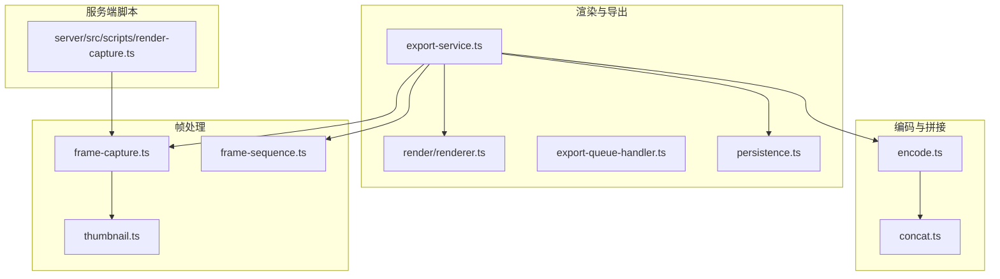
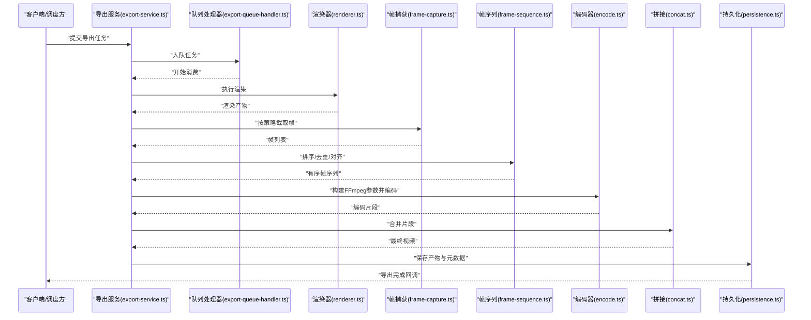
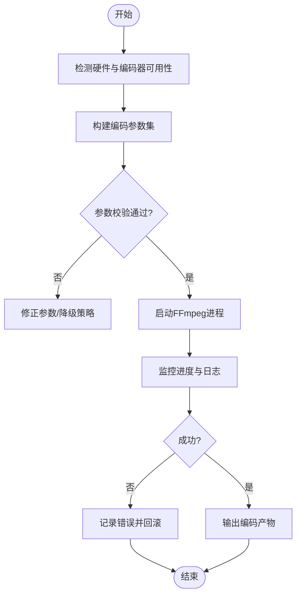
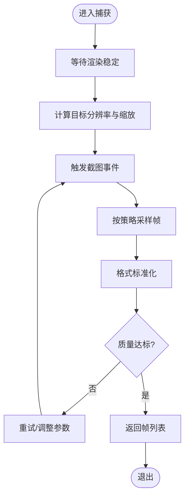
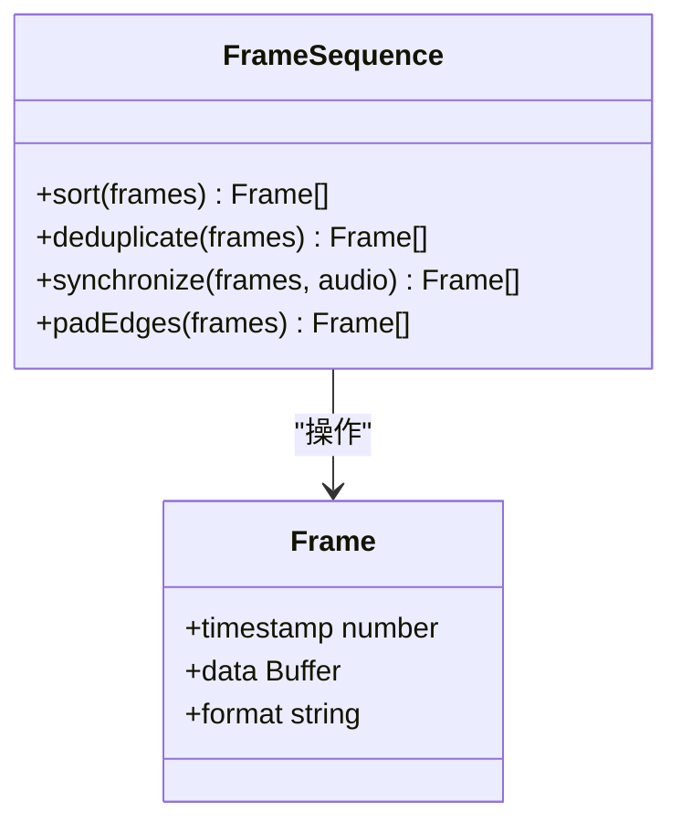
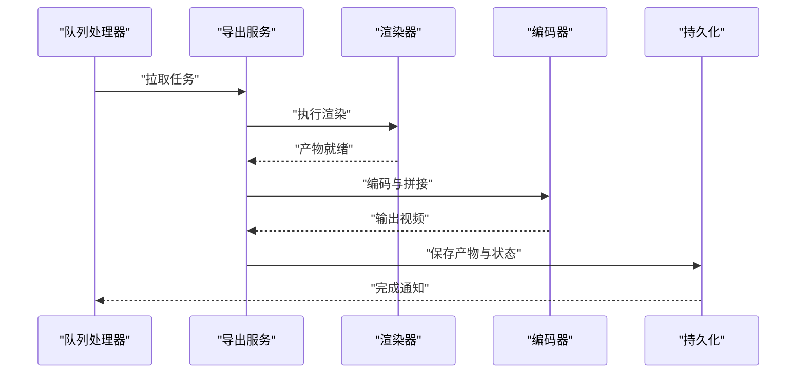
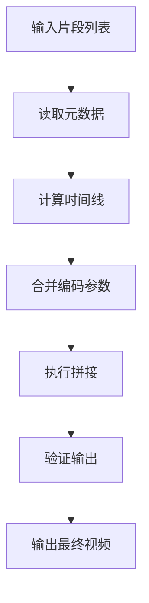
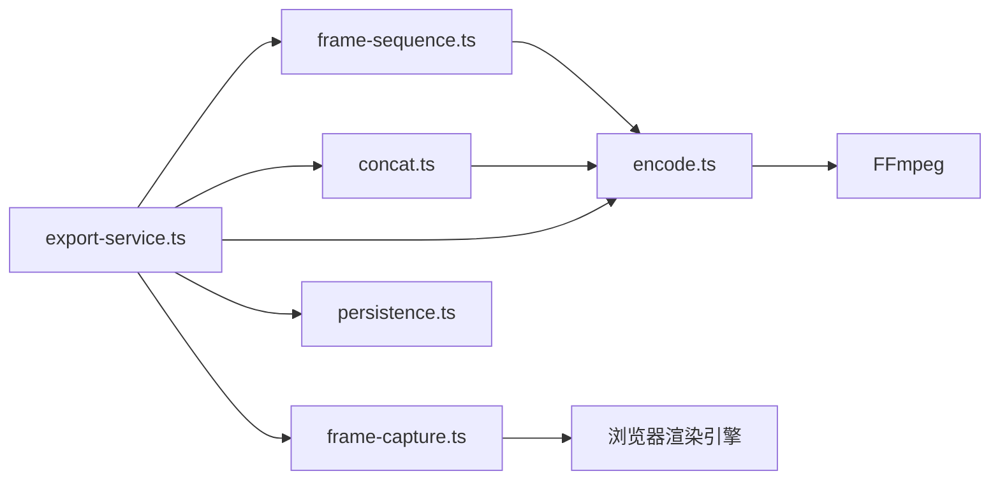

# 视频处理

<cite>
**本文引用的文件**   
- [src/features/render/encode.ts](file://src/features/render/encode.ts)
- [src/features/render/frame-capture.ts](file://src/features/render/frame-capture.ts)
- [src/features/render/frame-sequence.ts](file://src/features/render/frame-sequence.ts)
- [src/features/render/export-service.ts](file://src/features/render/export-service.ts)
- [src/features/render/export-queue-handler.ts](file://src/features/render/export-queue-handler.ts)
- [src/features/render/renderer.ts](file://src/features/render/renderer.ts)
- [src/features/render/persistence.ts](file://src/features/render/persistence.ts)
- [src/features/render/thumbnail.ts](file://src/features/render/thumbnail.ts)
- [src/features/render/concat.ts](file://src/features/render/concat.ts)
- [server/src/scripts/render-capture.ts](file://server/src/scripts/render-capture.ts)
</cite>

## 目录
1. [简介](#简介)
2. [项目结构](#项目结构)
3. [核心组件](#核心组件)
4. [架构总览](#架构总览)
5. [详细组件分析](#详细组件分析)
6. [依赖关系分析](#依赖关系分析)
7. [性能考虑](#性能考虑)
8. [故障排查指南](#故障排查指南)
9. [结论](#结论)
10. [附录](#附录)

## 简介
本技术文档聚焦 PurpleInk 的视频处理模块，系统性阐述 FFmpeg 集成架构与编码参数配置体系，覆盖视频格式转换、码率控制与质量优化策略；深入解析帧捕获技术的实现原理（截图时机控制、分辨率适配、格式标准化）；说明帧序列管理机制（排序、去重、时间轴同步）；并给出视频编码性能优化、GPU 加速支持与批量处理的实践建议。最后提供自定义编码器插件的开发指南与集成模式，帮助开发者扩展或替换底层编码能力。

## 项目结构
视频处理相关代码主要位于前端特性层与服务器脚本中：
- 渲染与导出服务：负责编排渲染、导出任务、队列消费与持久化
- 编码与拼接：封装 FFmpeg 调用、参数构建与多片段合并
- 帧捕获与缩略图：基于浏览器渲染结果生成高质量截图与缩略图
- 帧序列管理：对帧进行排序、去重与时间对齐，确保输出一致性

图表来源
- [src/features/render/renderer.ts](file://src/features/render/renderer.ts)
- [src/features/render/export-service.ts](file://src/features/render/export-service.ts)
- [src/features/render/export-queue-handler.ts](file://src/features/render/export-queue-handler.ts)
- [src/features/render/encode.ts](file://src/features/render/encode.ts)
- [src/features/render/concat.ts](file://src/features/render/concat.ts)
- [src/features/render/frame-capture.ts](file://src/features/render/frame-capture.ts)
- [src/features/render/thumbnail.ts](file://src/features/render/thumbnail.ts)
- [src/features/render/frame-sequence.ts](file://src/features/render/frame-sequence.ts)
- [server/src/scripts/render-capture.ts](file://server/src/scripts/render-capture.ts)

章节来源
- [src/features/render/export-service.ts](file://src/features/render/export-service.ts)
- [src/features/render/renderer.ts](file://src/features/render/renderer.ts)
- [src/features/render/encode.ts](file://src/features/render/encode.ts)
- [src/features/render/frame-capture.ts](file://src/features/render/frame-capture.ts)
- [src/features/render/frame-sequence.ts](file://src/features/render/frame-sequence.ts)
- [src/features/render/thumbnail.ts](file://src/features/render/thumbnail.ts)
- [src/features/render/concat.ts](file://src/features/render/concat.ts)
- [src/features/render/persistence.ts](file://src/features/render/persistence.ts)
- [server/src/scripts/render-capture.ts](file://server/src/scripts/render-capture.ts)

## 核心组件
- 渲染器（renderer.ts）：驱动页面渲染，产出可被后续处理的中间产物（如 HTML/资源），为帧捕获与编码提供输入源
- 导出服务（export-service.ts）：编排导出流程，协调渲染、帧捕获、编码、拼接与持久化，支持任务状态跟踪
- 队列处理器（export-queue-handler.ts）：消费导出任务队列，保证并发与重试，提升吞吐与稳定性
- 编码器（encode.ts）：封装 FFmpeg 调用，统一参数构建、格式转换、码率控制与质量优化
- 帧捕获（frame-capture.ts）：在渲染完成后按策略截取关键帧，支持分辨率适配与格式标准化
- 帧序列（frame-sequence.ts）：对帧进行排序、去重与时间轴对齐，确保时序一致性与播放流畅
- 缩略图（thumbnail.ts）：从视频或帧生成缩略图，用于预览与展示
- 拼接（concat.ts）：将多个片段按顺序合并为最终视频，处理时间戳与元数据
- 持久化（persistence.ts）：保存导出产物、任务状态与元数据，支持查询与恢复

章节来源
- [src/features/render/renderer.ts](file://src/features/render/renderer.ts)
- [src/features/render/export-service.ts](file://src/features/render/export-service.ts)
- [src/features/render/export-queue-handler.ts](file://src/features/render/export-queue-handler.ts)
- [src/features/render/encode.ts](file://src/features/render/encode.ts)
- [src/features/render/frame-capture.ts](file://src/features/render/frame-capture.ts)
- [src/features/render/frame-sequence.ts](file://src/features/render/frame-sequence.ts)
- [src/features/render/thumbnail.ts](file://src/features/render/thumbnail.ts)
- [src/features/render/concat.ts](file://src/features/render/concat.ts)
- [src/features/render/persistence.ts](file://src/features/render/persistence.ts)

## 架构总览
整体流程以“渲染→帧捕获→帧序列→编码→拼接→持久化”为主线，通过导出服务统一编排，队列处理器保障高并发与容错。FFmpeg 作为核心编解码引擎，由编码器模块抽象封装，便于扩展与替换。

图表来源
- [src/features/render/export-service.ts](file://src/features/render/export-service.ts)
- [src/features/render/export-queue-handler.ts](file://src/features/render/export-queue-handler.ts)
- [src/features/render/renderer.ts](file://src/features/render/renderer.ts)
- [src/features/render/frame-capture.ts](file://src/features/render/frame-capture.ts)
- [src/features/render/frame-sequence.ts](file://src/features/render/frame-sequence.ts)
- [src/features/render/encode.ts](file://src/features/render/encode.ts)
- [src/features/render/concat.ts](file://src/features/render/concat.ts)
- [src/features/render/persistence.ts](file://src/features/render/persistence.ts)

## 详细组件分析

### FFmpeg 集成与编码参数配置系统（encode.ts）
- 设计目标：统一封装 FFmpeg 调用，屏蔽平台差异，提供一致的参数构建接口
- 关键能力：
  - 格式转换：根据目标容器与编码选择对应参数集
  - 码率控制：支持 CBR/VBR/CRF 等策略，结合质量阈值与文件大小约束
  - 质量优化：启用去块滤波、自适应量化、运动估计优化等
  - GPU 加速：检测可用硬件编码器（如 NVENC、VAAPI、VideoToolbox），自动切换参数
  - 批处理：支持多路并行编码，限制并发度避免资源争用
- 错误处理：捕获 FFmpeg 退出码与 stderr 日志，映射为结构化错误信息
- 扩展点：通过插件接口注册新的编码器与参数模板，实现按需替换

图表来源
- [src/features/render/encode.ts](file://src/features/render/encode.ts)

章节来源
- [src/features/render/encode.ts](file://src/features/render/encode.ts)

### 帧捕获技术（frame-capture.ts）
- 截图时机控制：在渲染稳定后触发，支持关键帧检测与动态延迟
- 分辨率适配：依据目标输出尺寸与显示比例计算缩放因子，保持宽高比
- 格式标准化：统一转换为内部中间格式（如 PNG/JPEG），便于后续处理
- 质量控制：设置采样间隔、裁剪区域与锐化滤镜，平衡质量与体积
- 失败重试：网络或渲染异常时自动重试，确保捕获成功率

图表来源
- [src/features/render/frame-capture.ts](file://src/features/render/frame-capture.ts)

章节来源
- [src/features/render/frame-capture.ts](file://src/features/render/frame-capture.ts)

### 帧序列管理机制（frame-sequence.ts）
- 排序：基于时间戳或索引对帧进行升序排列，确保播放顺序正确
- 去重：识别重复帧（哈希或像素相似度），剔除冗余帧减少体积
- 时间轴同步：对齐音频与视频帧，补偿抖动与漂移，保证音画同步
- 边界处理：首尾帧插值或填充，避免黑边或跳帧

图表来源
- [src/features/render/frame-sequence.ts](file://src/features/render/frame-sequence.ts)

章节来源
- [src/features/render/frame-sequence.ts](file://src/features/render/frame-sequence.ts)

### 导出服务与队列（export-service.ts, export-queue-handler.ts）
- 导出服务：编排渲染、捕获、编码、拼接与持久化，维护任务生命周期
- 队列处理器：消费任务队列，支持优先级、重试与限流，提升吞吐与稳定性
- 状态跟踪：记录各阶段状态与指标，便于监控与诊断
- 错误恢复：失败任务自动重试或降级，保障最终一致性

图表来源
- [src/features/render/export-service.ts](file://src/features/render/export-service.ts)
- [src/features/render/export-queue-handler.ts](file://src/features/render/export-queue-handler.ts)

章节来源
- [src/features/render/export-service.ts](file://src/features/render/export-service.ts)
- [src/features/render/export-queue-handler.ts](file://src/features/render/export-queue-handler.ts)

### 缩略图与拼接（thumbnail.ts, concat.ts）
- 缩略图：从视频或帧提取关键帧，压缩并存储，用于预览与列表展示
- 拼接：将多个片段按时间线合并，处理元数据与时间戳连续性，确保无缝播放

图表来源
- [src/features/render/thumbnail.ts](file://src/features/render/thumbnail.ts)
- [src/features/render/concat.ts](file://src/features/render/concat.ts)

章节来源
- [src/features/render/thumbnail.ts](file://src/features/render/thumbnail.ts)
- [src/features/render/concat.ts](file://src/features/render/concat.ts)

### 服务端渲染捕获脚本（server/src/scripts/render-capture.ts）
- 作用：在服务端执行渲染与捕获，适用于无头环境或批量处理场景
- 特点：独立进程运行，隔离资源与错误，便于监控与扩缩容

章节来源
- [server/src/scripts/render-capture.ts](file://server/src/scripts/render-capture.ts)

## 依赖关系分析
- 低耦合：各模块职责清晰，通过接口通信，降低相互影响
- 可扩展：编码器与捕获器支持插件化，便于替换与升级
- 外部依赖：FFmpeg 为核心编解码引擎，需确保版本兼容与硬件支持
- 存储依赖：持久化模块对接数据库或对象存储，支持高可用与备份

图表来源
- [src/features/render/encode.ts](file://src/features/render/encode.ts)
- [src/features/render/frame-capture.ts](file://src/features/render/frame-capture.ts)
- [src/features/render/frame-sequence.ts](file://src/features/render/frame-sequence.ts)
- [src/features/render/concat.ts](file://src/features/render/concat.ts)
- [src/features/render/export-service.ts](file://src/features/render/export-service.ts)
- [src/features/render/persistence.ts](file://src/features/render/persistence.ts)

章节来源
- [src/features/render/encode.ts](file://src/features/render/encode.ts)
- [src/features/render/frame-capture.ts](file://src/features/render/frame-capture.ts)
- [src/features/render/frame-sequence.ts](file://src/features/render/frame-sequence.ts)
- [src/features/render/concat.ts](file://src/features/render/concat.ts)
- [src/features/render/export-service.ts](file://src/features/render/export-service.ts)
- [src/features/render/persistence.ts](file://src/features/render/persistence.ts)

## 性能考虑
- 并发控制：限制 FFmpeg 进程数与内存占用，避免 OOM 与 CPU 饱和
- GPU 加速：优先使用硬件编码器，缩短编码时间并降低 CPU 负载
- 批处理：合并小片段，减少 I/O 与进程开销
- 缓存策略：复用中间产物与缩略图，避免重复计算
- 监控指标：记录编码时长、比特率、错误率与资源利用率，指导调优

## 故障排查指南
- 常见错误：FFmpeg 退出码非零、内存不足、硬件编码器不可用
- 日志定位：查看 stderr 输出与模块日志，定位具体阶段
- 重试机制：自动重试失败任务，必要时降级到软件编码
- 回滚策略：保留中间产物，支持断点续传与部分恢复

章节来源
- [src/features/render/encode.ts](file://src/features/render/encode.ts)
- [src/features/render/export-service.ts](file://src/features/render/export-service.ts)

## 结论
PurpleInk 视频处理模块通过清晰的架构设计与模块化实现，提供了高效的 FFmpeg 集成、灵活的编码参数配置、稳定的帧捕获与序列管理，以及可扩展的插件机制。在生产环境中，建议结合硬件加速与批处理策略，配合完善的监控与故障恢复，以获得最佳的性能与可靠性。

## 附录
- 自定义编码器插件开发指南：
  - 定义插件接口：包含参数构建、进程启动、进度监控与错误处理
  - 实现适配器：针对特定编码器（如 NVENC、VAAPI）实现差异化逻辑
  - 注册与发现：通过配置中心或环境变量启用插件
  - 测试与验证：单元测试与端到端测试确保兼容性
- 集成模式：
  - 插件式替换：在不改动主流程的情况下替换编码器实现
  - 参数模板：预定义常用编码配置，快速切换场景
  - 动态加载：运行时加载新插件，无需重启服务