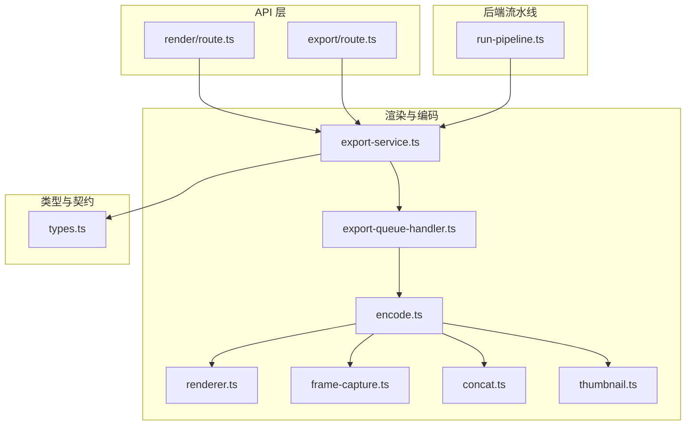
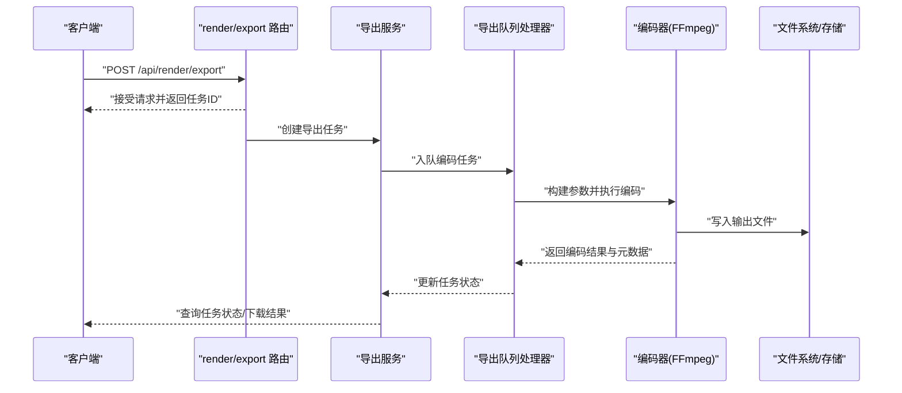
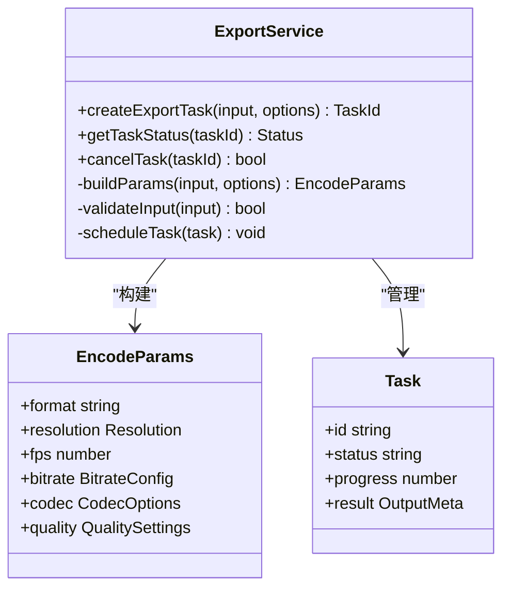
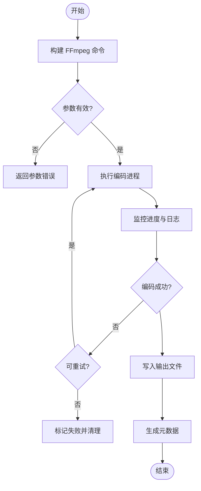
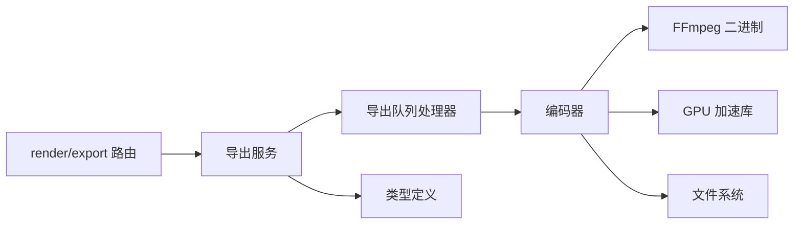

# 视频编码

<cite>
**本文引用的文件**   
- [src/features/render/encode.ts](file://src/features/render/encode.ts)
- [src/features/render/export-service.ts](file://src/features/render/export-service.ts)
- [src/features/render/export-queue-handler.ts](file://src/features/render/export-queue-handler.ts)
- [src/features/render/renderer.ts](file://src/features/render/renderer.ts)
- [src/features/render/frame-capture.ts](file://src/features/render/frame-capture.ts)
- [src/features/render/concat.ts](file://src/features/render/concat.ts)
- [src/features/render/thumbnail.ts](file://src/features/render/thumbnail.ts)
- [src/features/render/types.ts](file://src/features/render/types.ts)
- [src/app/api/render/route.ts](file://src/app/api/render/route.ts)
- [src/app/api/render/export/route.ts](file://src/app/api/render/export/route.ts)
- [server/src/compose/run-pipeline.ts](file://server/src/compose/run-pipeline.ts)
</cite>

## 目录
1. [简介](#简介)
2. [项目结构](#项目结构)
3. [核心组件](#核心组件)
4. [架构总览](#架构总览)
5. [详细组件分析](#详细组件分析)
6. [依赖关系分析](#依赖关系分析)
7. [性能考量](#性能考量)
8. [故障排查指南](#故障排查指南)
9. [结论](#结论)
10. [附录](#附录)

## 简介
本技术文档聚焦 PurpleInk 的视频编码模块，系统性阐述 FFmpeg 集成架构、编码参数配置与动态生成机制、多格式转码流程、并发编码处理、错误恢复策略，以及 GPU 加速支持与性能调优。同时提供自定义编码器插件的开发接口与最佳实践，帮助开发者快速扩展与优化编码能力。

## 项目结构
视频编码相关代码主要位于前端特性层（features/render）与 API 路由层（app/api/render），后端流水线编排位于 server/src/compose。关键职责划分如下：
- 渲染与帧捕获：负责从渲染产物中抽取帧序列或媒体片段
- 编码服务：封装 FFmpeg 调用、参数构建、任务调度与结果落盘
- 导出队列：异步处理高并发导出任务，保障稳定性与可观测性
- API 路由：暴露导出与缩略图生成等 HTTP 接口
- 类型定义：统一输入输出模型与配置结构

**图表来源** 
- [src/app/api/render/route.ts](file://src/app/api/render/route.ts)
- [src/app/api/render/export/route.ts](file://src/app/api/render/export/route.ts)
- [src/features/render/export-service.ts](file://src/features/render/export-service.ts)
- [src/features/render/export-queue-handler.ts](file://src/features/render/export-queue-handler.ts)
- [src/features/render/encode.ts](file://src/features/render/encode.ts)
- [src/features/render/renderer.ts](file://src/features/render/renderer.ts)
- [src/features/render/frame-capture.ts](file://src/features/render/frame-capture.ts)
- [src/features/render/concat.ts](file://src/features/render/concat.ts)
- [src/features/render/thumbnail.ts](file://src/features/render/thumbnail.ts)
- [src/features/render/types.ts](file://src/features/render/types.ts)
- [server/src/compose/run-pipeline.ts](file://server/src/compose/run-pipeline.ts)

**章节来源**
- [src/app/api/render/route.ts](file://src/app/api/render/route.ts)
- [src/app/api/render/export/route.ts](file://src/app/api/render/export/route.ts)
- [src/features/render/export-service.ts](file://src/features/render/export-service.ts)
- [src/features/render/export-queue-handler.ts](file://src/features/render/export-queue-handler.ts)
- [src/features/render/encode.ts](file://src/features/render/encode.ts)
- [src/features/render/renderer.ts](file://src/features/render/renderer.ts)
- [src/features/render/frame-capture.ts](file://src/features/render/frame-capture.ts)
- [src/features/render/concat.ts](file://src/features/render/concat.ts)
- [src/features/render/thumbnail.ts](file://src/features/render/thumbnail.ts)
- [src/features/render/types.ts](file://src/features/render/types.ts)
- [server/src/compose/run-pipeline.ts](file://server/src/compose/run-pipeline.ts)

## 核心组件
- 编码服务（ExportService）：对外提供导出入口，协调队列与编码器，管理生命周期与状态
- 编码处理器（Encode）：封装 FFmpeg 命令构建、参数计算、执行与结果校验
- 帧捕获（FrameCapture）：从渲染产物中提取帧序列或媒体片段，为编码提供输入
- 拼接器（Concat）：将分段媒体按序合并，保证时间轴一致性与无缝衔接
- 缩略图生成（Thumbnail）：基于首帧或关键帧生成预览图
- 类型系统（Types）：统一导出请求、编码参数、任务状态与结果模型

**章节来源**
- [src/features/render/export-service.ts](file://src/features/render/export-service.ts)
- [src/features/render/encode.ts](file://src/features/render/encode.ts)
- [src/features/render/frame-capture.ts](file://src/features/render/frame-capture.ts)
- [src/features/render/concat.ts](file://src/features/render/concat.ts)
- [src/features/render/thumbnail.ts](file://src/features/render/thumbnail.ts)
- [src/features/render/types.ts](file://src/features/render/types.ts)

## 架构总览
整体采用“API 路由 → 导出服务 → 队列处理器 → 编码器”的分层架构，结合类型契约确保数据一致性。FFmpeg 作为底层编解码引擎，通过参数化配置实现多格式输出与质量优化。

**图表来源** 
- [src/app/api/render/export/route.ts](file://src/app/api/render/export/route.ts)
- [src/features/render/export-service.ts](file://src/features/render/export-service.ts)
- [src/features/render/export-queue-handler.ts](file://src/features/render/export-queue-handler.ts)
- [src/features/render/encode.ts](file://src/features/render/encode.ts)

## 详细组件分析

### 编码服务（ExportService）
- 职责：接收导出请求，校验输入，构造任务上下文，调度队列与编码器，跟踪任务状态与结果
- 关键点：
  - 支持多格式输出（MP4、WebM、MOV 等），根据目标容器选择合适编码器与参数集
  - 动态参数生成：分辨率适配、帧率调整、比特率自适应、压缩选项
  - 并发控制：限制并行编码任务数，避免资源争用
  - 错误恢复：失败重试、降级策略、中间产物清理

**图表来源** 
- [src/features/render/export-service.ts](file://src/features/render/export-service.ts)
- [src/features/render/types.ts](file://src/features/render/types.ts)

**章节来源**
- [src/features/render/export-service.ts](file://src/features/render/export-service.ts)
- [src/features/render/types.ts](file://src/features/render/types.ts)

### 编码器（Encode）与 FFmpeg 集成
- 职责：将 EncodeParams 转换为 FFmpeg 命令行参数，执行编码并解析输出
- 关键点：
  - 参数映射：容器格式到编码器（如 MP4→H.264/H.265，WebM→VP9/AV1，MOV→ProRes/H.264）
  - 码率控制：CBR/VBR/CRF 策略，根据内容复杂度与目标文件大小动态调整
  - 质量优化：去块滤波、运动估计、预设（fast/medium/slow）、调色与色彩空间转换
  - GPU 加速：检测硬件编解码器（NVENC、QSV、VAAPI、VideoToolbox），自动启用
  - 错误处理：捕获 FFmpeg 退出码与日志，分类错误并上报

**图表来源** 
- [src/features/render/encode.ts](file://src/features/render/encode.ts)

**章节来源**
- [src/features/render/encode.ts](file://src/features/render/encode.ts)

### 帧捕获（FrameCapture）
- 职责：从渲染产物（图像序列、视频片段）中提取帧，标准化输入格式
- 关键点：
  - 支持多种输入源（PNG/JPEG 序列、WebM/MP4 片段）
  - 帧率对齐与时间戳校正，确保时序一致性
  - 内存与磁盘缓存策略，避免大文件阻塞

**章节来源**
- [src/features/render/frame-capture.ts](file://src/features/render/frame-capture.ts)

### 拼接器（Concat）
- 职责：将多个分段媒体按顺序合并，保持时间轴连续
- 关键点：
  - 使用 FFmpeg concat 协议或 demuxer 模式
  - 处理不同编码参数的片段，必要时进行转码再合并
  - 校验输出完整性与时长准确性

**章节来源**
- [src/features/render/concat.ts](file://src/features/render/concat.ts)

### 缩略图生成（Thumbnail）
- 职责：基于首帧或关键帧生成预览图
- 关键点：
  - 支持 PNG/JPEG 输出，可选尺寸缩放
  - 利用 FFmpeg 的 thumbnail 过滤器提升效率

**章节来源**
- [src/features/render/thumbnail.ts](file://src/features/render/thumbnail.ts)

### 渲染器（Renderer）
- 职责：驱动渲染管线，产出可供编码的中间产物
- 关键点：
  - 与帧捕获协作，确保输入一致性
  - 支持批量渲染与断点续传

**章节来源**
- [src/features/render/renderer.ts](file://src/features/render/renderer.ts)

### API 路由（render/export）
- 职责：暴露导出接口，接收请求并返回任务 ID
- 关键点：
  - 参数校验与权限检查
  - 异步响应，避免长时间阻塞

**章节来源**
- [src/app/api/render/export/route.ts](file://src/app/api/render/export/route.ts)

### 后端流水线（run-pipeline）
- 职责：编排渲染与导出阶段，协调状态机与事件流
- 关键点：
  - 与导出服务集成，触发编码任务
  - 记录流水线进度与错误信息

**章节来源**
- [server/src/compose/run-pipeline.ts](file://server/src/compose/run-pipeline.ts)

## 依赖关系分析
编码模块内部依赖清晰，外部依赖主要为 FFmpeg 二进制与可选的硬件加速库。

**图表来源** 
- [src/app/api/render/export/route.ts](file://src/app/api/render/export/route.ts)
- [src/features/render/export-service.ts](file://src/features/render/export-service.ts)
- [src/features/render/export-queue-handler.ts](file://src/features/render/export-queue-handler.ts)
- [src/features/render/encode.ts](file://src/features/render/encode.ts)
- [src/features/render/types.ts](file://src/features/render/types.ts)

**章节来源**
- [src/app/api/render/export/route.ts](file://src/app/api/render/export/route.ts)
- [src/features/render/export-service.ts](file://src/features/render/export-service.ts)
- [src/features/render/export-queue-handler.ts](file://src/features/render/export-queue-handler.ts)
- [src/features/render/encode.ts](file://src/features/render/encode.ts)
- [src/features/render/types.ts](file://src/features/render/types.ts)

## 性能考量
- 并发控制：限制并行编码任务数，避免 CPU/GPU 过载
- 内存管理：流式处理大文件，减少内存峰值
- 硬件加速：优先使用 NVENC/QSV/VAAPI/VideoToolbox，降低 CPU 占用
- 参数调优：选择合适的预设（fast/medium/slow）与 CRF/CQP 值，平衡质量与速度
- I/O 优化：使用 SSD 存储临时文件，避免网络延迟影响

[本节为通用指导，无需特定文件来源]

## 故障排查指南
- 常见错误：
  - 参数无效：检查分辨率、帧率、比特率是否在支持范围内
  - 硬件不可用：确认 GPU 驱动与 FFmpeg 编译选项是否包含相应加速库
  - 磁盘空间不足：监控临时目录与输出路径可用空间
  - 超时与中断：增加超时阈值或实现优雅退出
- 调试建议：
  - 启用 FFmpeg 详细日志，定位具体失败步骤
  - 使用 ffprobe 验证输入文件完整性
  - 逐步缩小问题范围，隔离编码器参数

**章节来源**
- [src/features/render/encode.ts](file://src/features/render/encode.ts)

## 结论
PurpleInk 视频编码模块通过分层架构与参数化设计，实现了灵活的 FFmpeg 集成与多格式输出。其动态参数生成、并发处理与错误恢复机制确保了高可用性与可扩展性。开发者可基于现有接口快速扩展自定义编码器，满足多样化业务需求。

[本节为总结，无需特定文件来源]

## 附录
- 支持的输出格式：MP4（H.264/H.265）、WebM（VP9/AV1）、MOV（ProRes/H.264）
- 码率控制策略：CBR（恒定码率）、VBR（可变码率）、CRF（恒定质量）
- 质量优化算法：去块滤波、运动估计、预设优化、色彩空间转换
- GPU 加速支持：NVIDIA NVENC、Intel QSV、Linux VAAPI、macOS VideoToolbox
- 自定义编码器插件：实现统一的参数构建与执行接口，注册到编码器工厂

[本节为补充说明，无需特定文件来源]