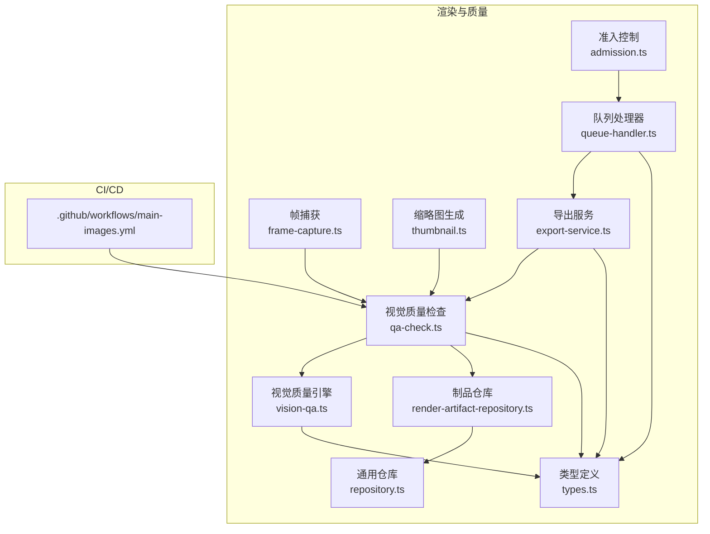
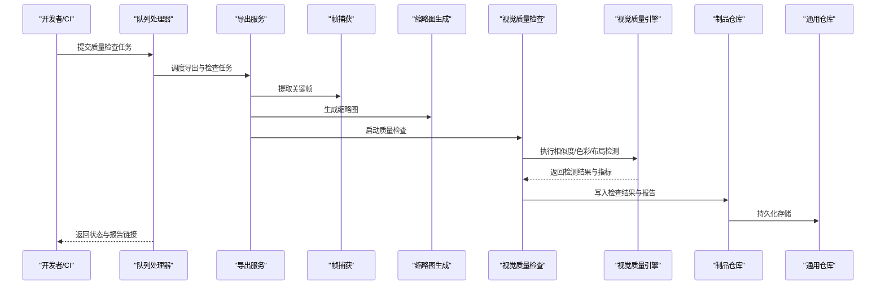
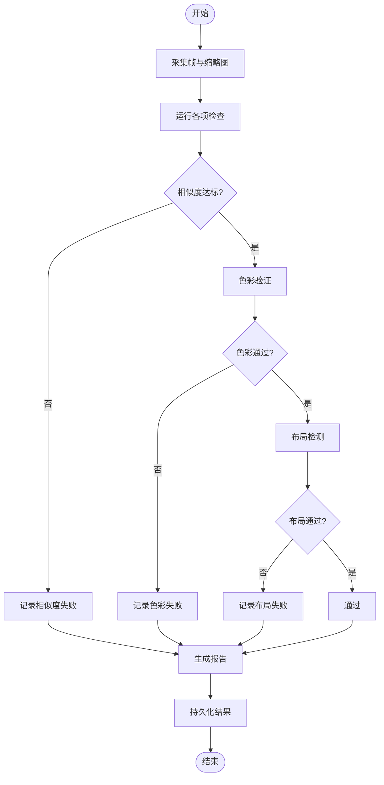
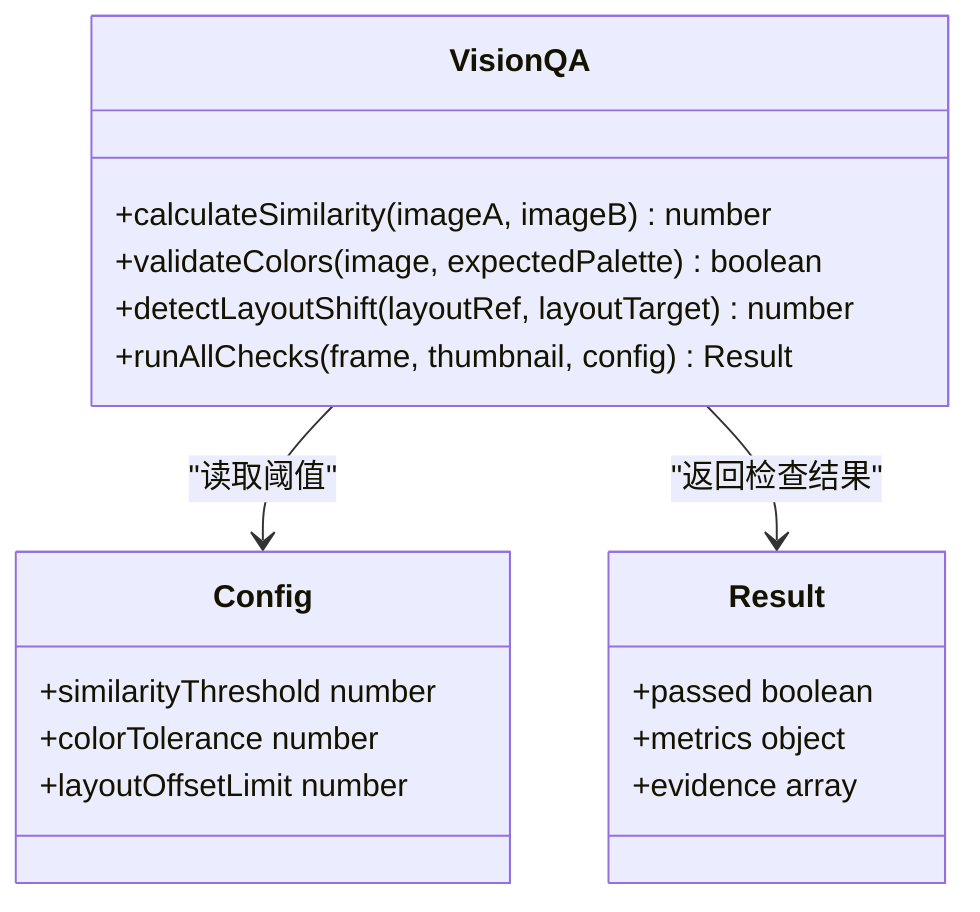
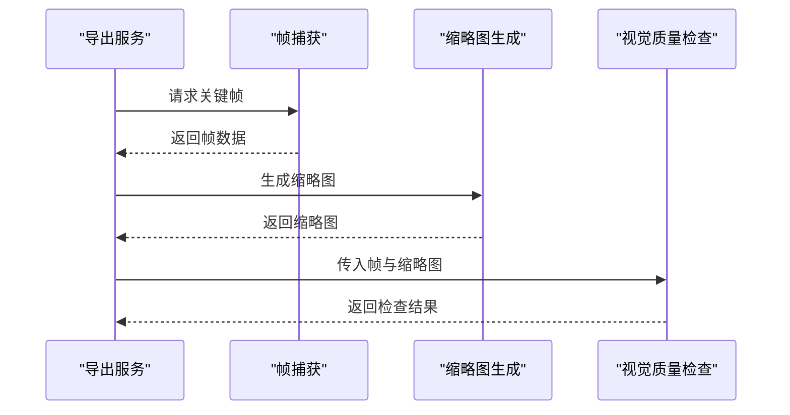
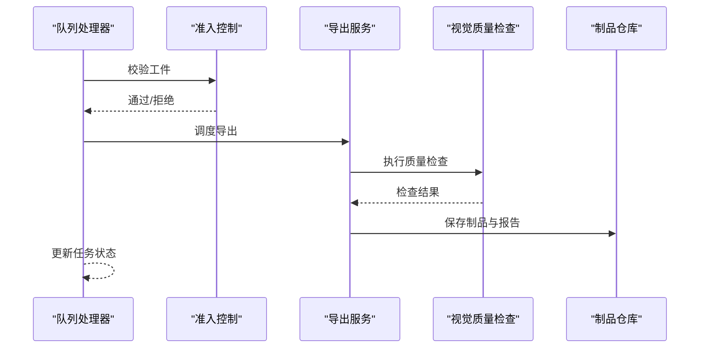
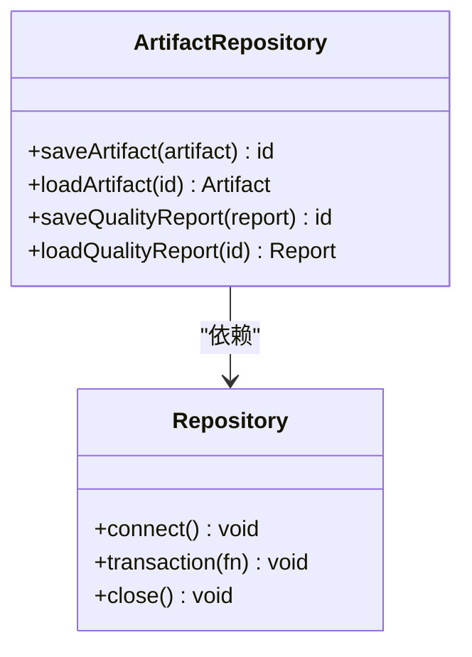
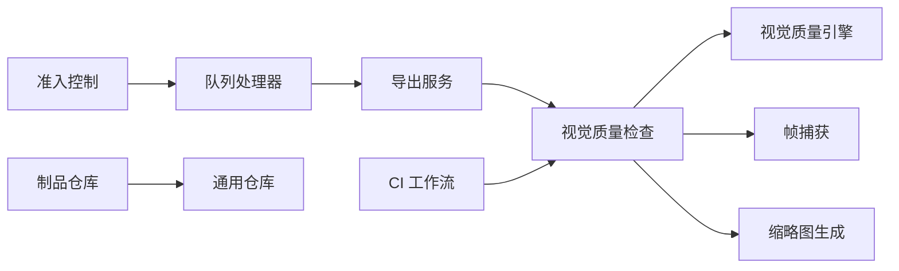

# 质量保证

<cite>
**本文引用的文件**   
- [qa-check.ts](file://src/features/render/qa-check.ts)
- [vision-qa.ts](file://src/features/render/vision-qa.ts)
- [frame-capture.ts](file://src/features/render/frame-capture.ts)
- [thumbnail.ts](file://src/features/render/thumbnail.ts)
- [export-service.ts](file://src/features/render/export-service.ts)
- [queue-handler.ts](file://src/features/render/queue-handler.ts)
- [admission.ts](file://src/features/render/admission.ts)
- [render-artifact-repository.ts](file://src/features/render/render-artifact-repository.ts)
- [repository.ts](file://src/features/render/repository.ts)
- [types.ts](file://src/features/render/types.ts)
- [main-images.yml](file://.github/workflows/main-images.yml)
</cite>

## 目录
1. [简介](#简介)
2. [项目结构](#项目结构)
3. [核心组件](#核心组件)
4. [架构总览](#架构总览)
5. [详细组件分析](#详细组件分析)
6. [依赖关系分析](#依赖关系分析)
7. [性能考量](#性能考量)
8. [故障排查指南](#故障排查指南)
9. [结论](#结论)
10. [附录](#附录)

## 简介
本技术文档聚焦 PurpleInk 的质量保证系统，围绕视觉质量检查算法、媒体工件验证机制、质量阈值与规则配置、报告生成、自动化测试集成、持续质量监控以及性能基准测试进行系统化说明。文档旨在帮助开发者快速理解并扩展质量检查能力，确保渲染产物在图像相似度、色彩一致性、布局正确性与元数据完整性方面达到稳定标准。

## 项目结构
质量保证相关代码主要位于前端特性模块 render 中，涵盖帧捕获、缩略图生成、视觉质量检查（Vision QA）、导出服务、队列处理、准入控制与持久化存储等。CI 工作流用于触发图像基线对比与回归检测。

图表来源
- [qa-check.ts](file://src/features/render/qa-check.ts)
- [vision-qa.ts](file://src/features/render/vision-qa.ts)
- [frame-capture.ts](file://src/features/render/frame-capture.ts)
- [thumbnail.ts](file://src/features/render/thumbnail.ts)
- [export-service.ts](file://src/features/render/export-service.ts)
- [queue-handler.ts](file://src/features/render/queue-handler.ts)
- [admission.ts](file://src/features/render/admission.ts)
- [render-artifact-repository.ts](file://src/features/render/render-artifact-repository.ts)
- [repository.ts](file://src/features/render/repository.ts)
- [types.ts](file://src/features/render/types.ts)
- [main-images.yml](file://.github/workflows/main-images.yml)

章节来源
- [qa-check.ts](file://src/features/render/qa-check.ts)
- [vision-qa.ts](file://src/features/render/vision-qa.ts)
- [frame-capture.ts](file://src/features/render/frame-capture.ts)
- [thumbnail.ts](file://src/features/render/thumbnail.ts)
- [export-service.ts](file://src/features/render/export-service.ts)
- [queue-handler.ts](file://src/features/render/queue-handler.ts)
- [admission.ts](file://src/features/render/admission.ts)
- [render-artifact-repository.ts](file://src/features/render/render-artifact-repository.ts)
- [repository.ts](file://src/features/render/repository.ts)
- [types.ts](file://src/features/render/types.ts)
- [main-images.yml](file://.github/workflows/main-images.yml)

## 核心组件
- 视觉质量检查（QA Check）：负责协调帧/缩略图采集、执行相似度与色彩校验、输出检查结果与报告。
- 视觉质量引擎（Vision QA）：封装图像相似度计算、色彩空间转换与验证、布局检测等核心算法。
- 帧捕获（Frame Capture）：从渲染结果中提取关键帧或指定时间点的图像，供后续质量评估使用。
- 缩略图生成（Thumbnail）：生成统一尺寸的预览图，用于快速比对与展示。
- 导出服务（Export Service）：将制品导出为指定格式，并在导出前后触发质量检查。
- 队列处理器（Queue Handler）：管理质量检查任务的入队、调度与重试。
- 准入控制（Admission）：在进入流水线阶段前对输入工件进行基础校验，避免无效任务进入。
- 制品仓库（Artifact Repository）：读写渲染产物与质量检查结果的持久化层。
- 类型定义（Types）：统一质量检查相关的接口、参数与返回结构。

章节来源
- [qa-check.ts](file://src/features/render/qa-check.ts)
- [vision-qa.ts](file://src/features/render/vision-qa.ts)
- [frame-capture.ts](file://src/features/render/frame-capture.ts)
- [thumbnail.ts](file://src/features/render/thumbnail.ts)
- [export-service.ts](file://src/features/render/export-service.ts)
- [queue-handler.ts](file://src/features/render/queue-handler.ts)
- [admission.ts](file://src/features/render/admission.ts)
- [render-artifact-repository.ts](file://src/features/render/render-artifact-repository.ts)
- [repository.ts](file://src/features/render/repository.ts)
- [types.ts](file://src/features/render/types.ts)

## 架构总览
质量检查流程以“帧/缩略图采集 → 视觉质量检查 → 结果持久化与报告”为主线，配合队列与准入控制实现高吞吐与稳定性保障。CI 工作流在提交后触发图像基线对比，确保回归问题被及时发现。

图表来源
- [queue-handler.ts](file://src/features/render/queue-handler.ts)
- [export-service.ts](file://src/features/render/export-service.ts)
- [frame-capture.ts](file://src/features/render/frame-capture.ts)
- [thumbnail.ts](file://src/features/render/thumbnail.ts)
- [qa-check.ts](file://src/features/render/qa-check.ts)
- [vision-qa.ts](file://src/features/render/vision-qa.ts)
- [render-artifact-repository.ts](file://src/features/render/render-artifact-repository.ts)
- [repository.ts](file://src/features/render/repository.ts)

## 详细组件分析

### 视觉质量检查（QA Check）
- 职责：编排帧/缩略图采集、调用视觉质量引擎、汇总指标、生成报告并持久化。
- 关键点：支持多策略并行检查；失败时提供可追溯的中间产物；阈值不达标时标记失败并记录差异证据。
- 扩展点：新增检查项可通过注册检查器接入，无需改动主流程。

图表来源
- [qa-check.ts](file://src/features/render/qa-check.ts)
- [vision-qa.ts](file://src/features/render/vision-qa.ts)
- [frame-capture.ts](file://src/features/render/frame-capture.ts)
- [thumbnail.ts](file://src/features/render/thumbnail.ts)

章节来源
- [qa-check.ts](file://src/features/render/qa-check.ts)
- [vision-qa.ts](file://src/features/render/vision-qa.ts)
- [frame-capture.ts](file://src/features/render/frame-capture.ts)
- [thumbnail.ts](file://src/features/render/thumbnail.ts)

### 视觉质量引擎（Vision QA）
- 职责：实现图像相似度分析、色彩验证与布局检测的核心算法。
- 相似度分析：基于像素级或感知哈希等方法计算差异分数，支持阈值配置。
- 色彩验证：在目标色彩空间内校验色域、亮度与饱和度范围，防止偏色或过曝。
- 布局检测：通过边界框或网格对齐判断元素位置偏移，识别错位与遮挡。
- 输出：结构化指标与证据图片，便于定位问题。

图表来源
- [vision-qa.ts](file://src/features/render/vision-qa.ts)
- [types.ts](file://src/features/render/types.ts)

章节来源
- [vision-qa.ts](file://src/features/render/vision-qa.ts)
- [types.ts](file://src/features/render/types.ts)

### 帧捕获与缩略图生成
- 帧捕获：从渲染视频或序列中提取关键帧，支持时间点选择与去重。
- 缩略图生成：统一尺寸与压缩策略，确保快速加载与一致比对条件。
- 错误处理：捕获解码异常、空帧与损坏文件，返回明确错误码。

图表来源
- [frame-capture.ts](file://src/features/render/frame-capture.ts)
- [thumbnail.ts](file://src/features/render/thumbnail.ts)
- [export-service.ts](file://src/features/render/export-service.ts)
- [qa-check.ts](file://src/features/render/qa-check.ts)

章节来源
- [frame-capture.ts](file://src/features/render/frame-capture.ts)
- [thumbnail.ts](file://src/features/render/thumbnail.ts)
- [export-service.ts](file://src/features/render/export-service.ts)
- [qa-check.ts](file://src/features/render/qa-check.ts)

### 导出服务与队列处理
- 导出服务：协调编码、转码与导出流程，并在导出前后触发质量检查。
- 队列处理：负责任务分配、并发控制、重试与超时处理，保障高可用。
- 准入控制：在任务入队前校验输入工件格式、大小与元数据，减少无效负载。

图表来源
- [queue-handler.ts](file://src/features/render/queue-handler.ts)
- [admission.ts](file://src/features/render/admission.ts)
- [export-service.ts](file://src/features/render/export-service.ts)
- [qa-check.ts](file://src/features/render/qa-check.ts)
- [render-artifact-repository.ts](file://src/features/render/render-artifact-repository.ts)

章节来源
- [queue-handler.ts](file://src/features/render/queue-handler.ts)
- [admission.ts](file://src/features/render/admission.ts)
- [export-service.ts](file://src/features/render/export-service.ts)
- [qa-check.ts](file://src/features/render/qa-check.ts)
- [render-artifact-repository.ts](file://src/features/render/render-artifact-repository.ts)

### 制品仓库与持久化
- 制品仓库：统一管理渲染产物与质量检查结果的读写，支持版本化与索引。
- 通用仓库：提供数据库或对象存储的抽象接口，屏蔽底层实现差异。
- 事务与回滚：确保检查过程原子性，失败时恢复一致状态。

图表来源
- [render-artifact-repository.ts](file://src/features/render/render-artifact-repository.ts)
- [repository.ts](file://src/features/render/repository.ts)

章节来源
- [render-artifact-repository.ts](file://src/features/render/render-artifact-repository.ts)
- [repository.ts](file://src/features/render/repository.ts)

### 类型定义与配置
- 类型定义：统一质量检查的参数、结果与错误结构，确保模块间契约一致。
- 配置项：包含相似度阈值、色彩容差、布局偏移限制等，支持运行时覆盖。

章节来源
- [types.ts](file://src/features/render/types.ts)

## 依赖关系分析
质量检查子系统内部耦合度较低，各组件通过清晰的接口协作。外部依赖包括 CI 工作流与存储后端。

图表来源
- [qa-check.ts](file://src/features/render/qa-check.ts)
- [vision-qa.ts](file://src/features/render/vision-qa.ts)
- [frame-capture.ts](file://src/features/render/frame-capture.ts)
- [thumbnail.ts](file://src/features/render/thumbnail.ts)
- [export-service.ts](file://src/features/render/export-service.ts)
- [queue-handler.ts](file://src/features/render/queue-handler.ts)
- [admission.ts](file://src/features/render/admission.ts)
- [render-artifact-repository.ts](file://src/features/render/render-artifact-repository.ts)
- [repository.ts](file://src/features/render/repository.ts)
- [main-images.yml](file://.github/workflows/main-images.yml)

章节来源
- [qa-check.ts](file://src/features/render/qa-check.ts)
- [vision-qa.ts](file://src/features/render/vision-qa.ts)
- [frame-capture.ts](file://src/features/render/frame-capture.ts)
- [thumbnail.ts](file://src/features/render/thumbnail.ts)
- [export-service.ts](file://src/features/render/export-service.ts)
- [queue-handler.ts](file://src/features/render/queue-handler.ts)
- [admission.ts](file://src/features/render/admission.ts)
- [render-artifact-repository.ts](file://src/features/render/render-artifact-repository.ts)
- [repository.ts](file://src/features/render/repository.ts)
- [main-images.yml](file://.github/workflows/main-images.yml)

## 性能考量
- 并行检查：对相似度、色彩与布局检测采用并行执行，缩短端到端耗时。
- 缓存策略：对重复输入的帧与缩略图进行缓存，避免重复计算。
- 资源隔离：队列处理器按优先级与资源配额调度，防止单任务占用过多资源。
- 增量对比：仅在关键帧变化时触发完整检查，降低不必要开销。

[本节为通用指导，不直接分析具体文件]

## 故障排查指南
- 常见问题
  - 相似度阈值过低导致误报：调整阈值并查看差异证据图。
  - 色彩空间不一致：确认输入与参考的色彩配置文件。
  - 布局偏移过大：检查模板与内容注入逻辑。
  - 队列堆积：检查消费者健康状态与重试策略。
- 调试工具
  - 启用详细日志，定位失败阶段。
  - 导出中间产物（帧、缩略图、差异图）辅助分析。
  - 使用本地基线对比脚本复现问题。

章节来源
- [qa-check.ts](file://src/features/render/qa-check.ts)
- [vision-qa.ts](file://src/features/render/vision-qa.ts)
- [queue-handler.ts](file://src/features/render/queue-handler.ts)

## 结论
PurpleInk 的质量保证系统通过模块化设计与清晰的数据流，实现了高效的视觉质量检查与媒体工件验证。借助可配置的阈值与可扩展的检查规则，系统能够适应不同业务场景的需求。结合 CI 集成与性能优化策略，确保了持续稳定的质量输出。

[本节为总结性内容，不直接分析具体文件]

## 附录
- 自动化测试集成：在提交后由 CI 触发图像基线对比，自动标记回归。
- 持续质量监控：通过队列与仓库统计指标，可视化质量趋势。
- 性能基准测试：针对相似度计算与布局检测建立基准用例，跟踪回归。
- 自定义检查规则扩展：实现检查器接口并注册到质量检查编排器。
- 调试工具使用：启用日志、导出中间产物、本地复现与对比。

章节来源
- [main-images.yml](file://.github/workflows/main-images.yml)
- [qa-check.ts](file://src/features/render/qa-check.ts)
- [vision-qa.ts](file://src/features/render/vision-qa.ts)
- [queue-handler.ts](file://src/features/render/queue-handler.ts)
- [render-artifact-repository.ts](file://src/features/render/render-artifact-repository.ts)