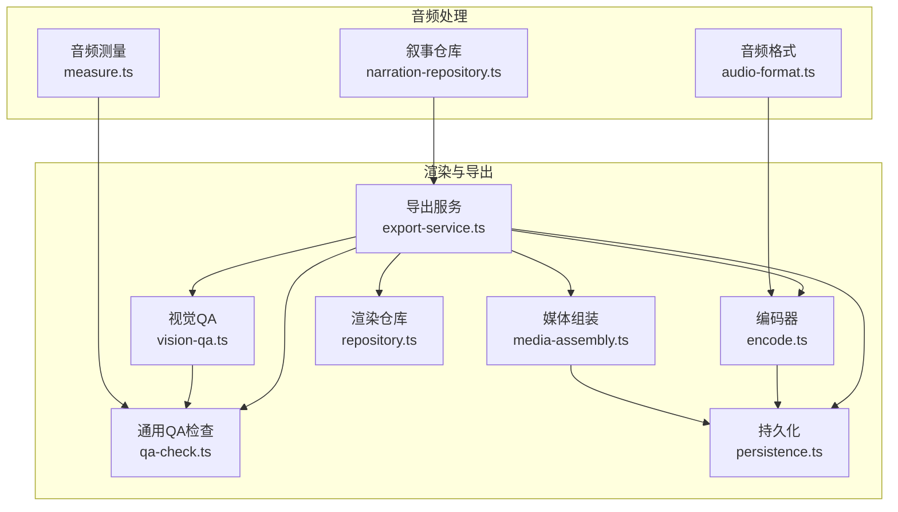
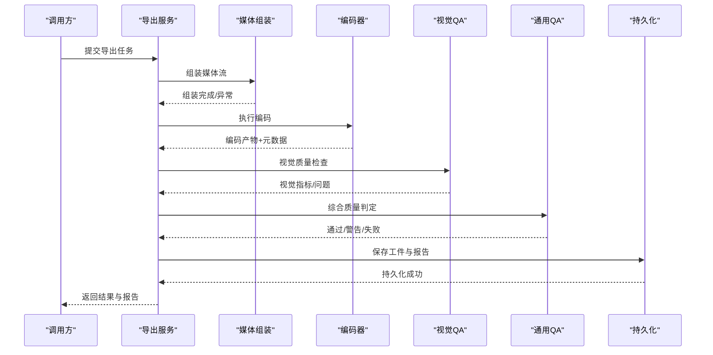
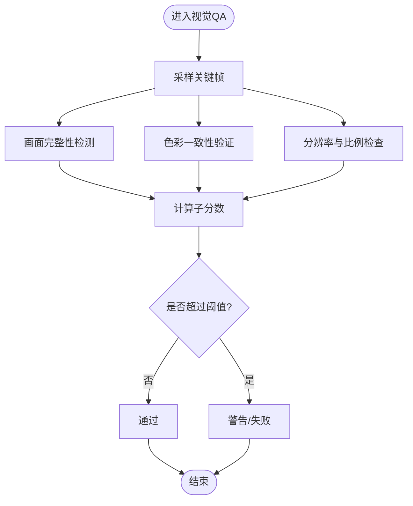
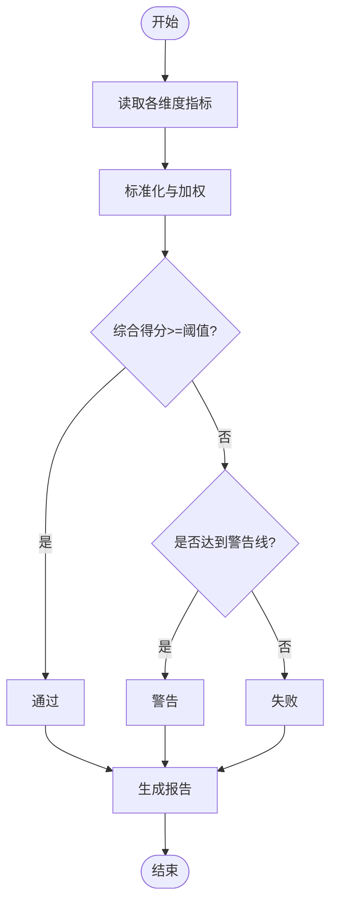
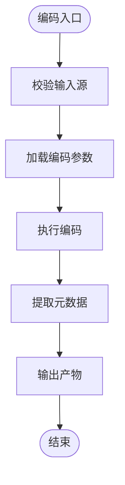
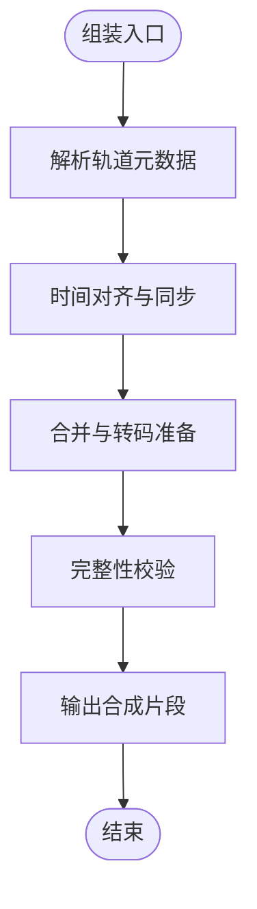
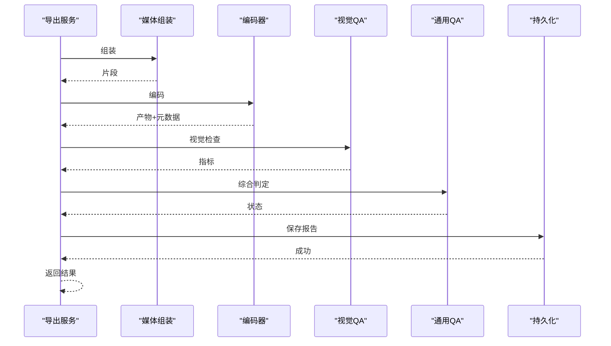
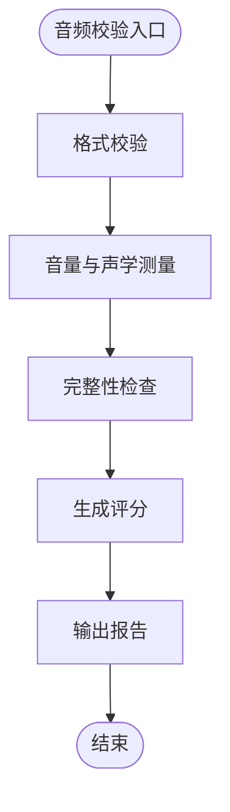
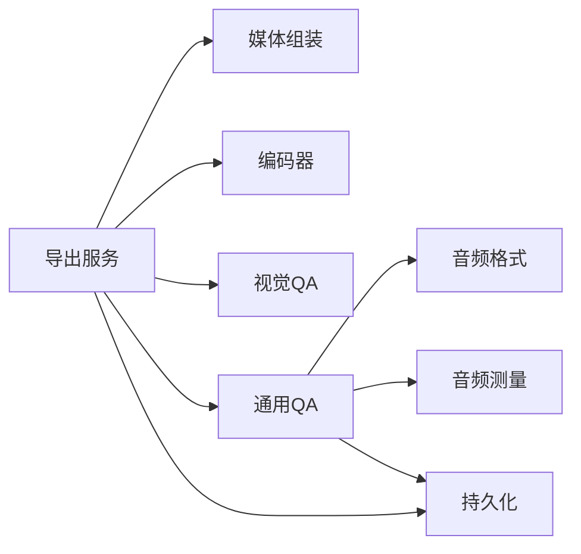

# 质量控制

<cite>
**本文引用的文件**   
- [qa-check.ts](file://src/features/render/qa-check.ts)
- [vision-qa.ts](file://src/features/render/vision-qa.ts)
- [encode.ts](file://src/features/render/encode.ts)
- [media-assembly.ts](file://src/features/render/media-assembly.ts)
- [export-service.ts](file://src/features/render/export-service.ts)
- [audio-format.ts](file://src/features/audio/audio-format.ts)
- [measure.ts](file://src/features/audio/measure.ts)
- [narration-repository.ts](file://src/features/audio/narration-repository.ts)
- [repository.ts](file://src/features/render/repository.ts)
- [persistence.ts](file://src/features/render/persistence.ts)
</cite>

## 目录
1. [简介](#简介)
2. [项目结构](#项目结构)
3. [核心组件](#核心组件)
4. [架构总览](#架构总览)
5. [详细组件分析](#详细组件分析)
6. [依赖关系分析](#依赖关系分析)
7. [性能考量](#性能考量)
8. [故障排查指南](#故障排查指南)
9. [结论](#结论)
10. [附录](#附录)

## 简介
本文件面向“质量控制”主题，系统性梳理代码库中与质量检查、验证与报告相关的实现。内容覆盖：
- 视觉质量检查：画面完整性检测、色彩验证、分辨率检查等
- 音频质量验证：音轨完整性、音量检测、格式校验等
- 输出格式验证：容器格式检查、编码参数验证、兼容性测试等
- 质量阈值配置：可接受标准、警告级别、错误处理策略
- 质量报告生成与故障诊断方法

## 项目结构
与质量控制直接相关的模块主要分布在以下路径：
- 渲染与导出：features/render（含 QA、编码、媒体组装、导出服务、持久化）
- 音频处理：features/audio（含格式、测量、叙事仓库）
- 存储与仓库：features/render/repository.ts、features/render/persistence.ts

图表来源 
- [vision-qa.ts](file://src/features/render/vision-qa.ts)
- [qa-check.ts](file://src/features/render/qa-check.ts)
- [encode.ts](file://src/features/render/encode.ts)
- [media-assembly.ts](file://src/features/render/media-assembly.ts)
- [export-service.ts](file://src/features/render/export-service.ts)
- [persistence.ts](file://src/features/render/persistence.ts)
- [repository.ts](file://src/features/render/repository.ts)
- [audio-format.ts](file://src/features/audio/audio-format.ts)
- [measure.ts](file://src/features/audio/measure.ts)
- [narration-repository.ts](file://src/features/audio/narration-repository.ts)

章节来源
- [vision-qa.ts](file://src/features/render/vision-qa.ts)
- [qa-check.ts](file://src/features/render/qa-check.ts)
- [encode.ts](file://src/features/render/encode.ts)
- [media-assembly.ts](file://src/features/render/media-assembly.ts)
- [export-service.ts](file://src/features/render/export-service.ts)
- [persistence.ts](file://src/features/render/persistence.ts)
- [repository.ts](file://src/features/render/repository.ts)
- [audio-format.ts](file://src/features/audio/audio-format.ts)
- [measure.ts](file://src/features/audio/measure.ts)
- [narration-repository.ts](file://src/features/audio/narration-repository.ts)

## 核心组件
- 视觉质量检查（Vision QA）
  - 负责画面完整性、色彩一致性、分辨率合规性等检查
  - 通过采样帧或关键帧进行图像级度量，并与阈值比较
- 通用质量检查（QA Check）
  - 聚合视觉与音频等多维度指标，统一判定通过/警告/失败
  - 支持阈值配置与分级告警
- 编码器（Encode）
  - 执行视频/音频编码，校验容器与编码参数
  - 输出元数据用于后续质量评估与兼容性检查
- 媒体组装（Media Assembly）
  - 将多路媒体（视频、音频、字幕等）合成到目标容器
  - 在组装阶段进行基础完整性校验
- 导出服务（Export Service）
  - 编排渲染、编码、QA、持久化的完整流程
  - 汇总质量报告并返回结果状态
- 音频模块（Audio Format & Measure）
  - 音频格式校验（容器、编码、声道、采样率等）
  - 音频测量（时长、响度、静音段、峰值等）
- 仓库与持久化（Repository & Persistence）
  - 读写任务、工件、质量报告等中间态与最终态数据

章节来源
- [vision-qa.ts](file://src/features/render/vision-qa.ts)
- [qa-check.ts](file://src/features/render/qa-check.ts)
- [encode.ts](file://src/features/render/encode.ts)
- [media-assembly.ts](file://src/features/render/media-assembly.ts)
- [export-service.ts](file://src/features/render/export-service.ts)
- [audio-format.ts](file://src/features/audio/audio-format.ts)
- [measure.ts](file://src/features/audio/measure.ts)
- [repository.ts](file://src/features/render/repository.ts)
- [persistence.ts](file://src/features/render/persistence.ts)

## 架构总览
整体质量控制流程由“导出服务”驱动，串联“媒体组装→编码→视觉QA→通用QA→持久化”。音频质量在编码前后分别进行格式与测量校验，最终形成统一的质量报告。

图表来源 
- [export-service.ts](file://src/features/render/export-service.ts)
- [media-assembly.ts](file://src/features/render/media-assembly.ts)
- [encode.ts](file://src/features/render/encode.ts)
- [vision-qa.ts](file://src/features/render/vision-qa.ts)
- [qa-check.ts](file://src/features/render/qa-check.ts)
- [persistence.ts](file://src/features/render/persistence.ts)

## 详细组件分析

### 视觉质量检查（Vision QA）
- 功能要点
  - 画面完整性：检测黑场、空白帧、缺失区域、比例异常
  - 色彩验证：色域、白平衡、饱和度、对比度等指标
  - 分辨率检查：目标分辨率、宽高比、像素密度
- 实现思路
  - 基于关键帧采样，计算图像统计特征并与阈值比对
  - 对异常帧定位并记录问题类型与位置信息
- 输出
  - 视觉质量分数、问题清单、建议修复项

图表来源 
- [vision-qa.ts](file://src/features/render/vision-qa.ts)
- [qa-check.ts](file://src/features/render/qa-check.ts)

章节来源
- [vision-qa.ts](file://src/features/render/vision-qa.ts)
- [qa-check.ts](file://src/features/render/qa-check.ts)

### 通用质量检查（QA Check）
- 功能要点
  - 聚合视觉、音频、编码、容器等多维指标
  - 支持分级判定（通过、警告、失败）
  - 提供阈值配置与错误处理策略
- 实现思路
  - 读取各子系统指标，按权重或规则计算综合得分
  - 根据阈值映射为最终状态，并生成问题摘要

图表来源 
- [qa-check.ts](file://src/features/render/qa-check.ts)

章节来源
- [qa-check.ts](file://src/features/render/qa-check.ts)

### 编码器（Encode）
- 功能要点
  - 执行视频/音频编码，生成目标容器与编码参数
  - 校验输入源合法性与输出元数据一致性
- 实现思路
  - 解析输入媒体信息，应用预设或用户配置的编码参数
  - 输出编码产物与元数据（分辨率、码率、帧率、声道等）

图表来源 
- [encode.ts](file://src/features/render/encode.ts)

章节来源
- [encode.ts](file://src/features/render/encode.ts)

### 媒体组装（Media Assembly）
- 功能要点
  - 将视频、音频、字幕等多路素材合成至目标容器
  - 在组装阶段进行基础完整性校验（轨道数量、时间对齐等）
- 实现思路
  - 解析各轨道元数据，构建时间线并进行拼接/混音
  - 输出合成后的媒体片段供编码使用

图表来源 
- [media-assembly.ts](file://src/features/render/media-assembly.ts)

章节来源
- [media-assembly.ts](file://src/features/render/media-assembly.ts)

### 导出服务（Export Service）
- 功能要点
  - 编排渲染、编码、QA、持久化的端到端流程
  - 汇总质量报告，返回任务状态与结果
- 实现思路
  - 顺序调用媒体组装、编码、视觉QA、通用QA
  - 捕获异常并降级处理，确保报告完整性

图表来源 
- [export-service.ts](file://src/features/render/export-service.ts)
- [media-assembly.ts](file://src/features/render/media-assembly.ts)
- [encode.ts](file://src/features/render/encode.ts)
- [vision-qa.ts](file://src/features/render/vision-qa.ts)
- [qa-check.ts](file://src/features/render/qa-check.ts)
- [persistence.ts](file://src/features/render/persistence.ts)

章节来源
- [export-service.ts](file://src/features/render/export-service.ts)

### 音频质量验证（Audio Format & Measure）
- 功能要点
  - 格式校验：容器类型、编码格式、声道布局、采样率、比特深度
  - 音量检测：响度、峰值、静音段、动态范围
  - 完整性：音轨存在性、时长一致性、丢帧/爆音检测
- 实现思路
  - 解析音频头与元数据，计算声学指标并与阈值比较
  - 生成音频质量评分与问题清单

图表来源 
- [audio-format.ts](file://src/features/audio/audio-format.ts)
- [measure.ts](file://src/features/audio/measure.ts)

章节来源
- [audio-format.ts](file://src/features/audio/audio-format.ts)
- [measure.ts](file://src/features/audio/measure.ts)

### 仓库与持久化（Repository & Persistence）
- 功能要点
  - 持久化渲染工件、质量报告、任务状态
  - 提供查询与回溯能力，支撑故障诊断
- 实现思路
  - 结构化存储质量指标与问题明细
  - 支持批量导出与归档

章节来源
- [repository.ts](file://src/features/render/repository.ts)
- [persistence.ts](file://src/features/render/persistence.ts)

## 依赖关系分析
- 导出服务依赖媒体组装、编码器、视觉QA、通用QA与持久化
- 音频模块独立于渲染链路，但为通用QA提供指标输入
- 仓库与持久化贯穿全流程，保证数据可追溯

图表来源 
- [export-service.ts](file://src/features/render/export-service.ts)
- [media-assembly.ts](file://src/features/render/media-assembly.ts)
- [encode.ts](file://src/features/render/encode.ts)
- [vision-qa.ts](file://src/features/render/vision-qa.ts)
- [qa-check.ts](file://src/features/render/qa-check.ts)
- [audio-format.ts](file://src/features/audio/audio-format.ts)
- [measure.ts](file://src/features/audio/measure.ts)
- [persistence.ts](file://src/features/render/persistence.ts)

章节来源
- [export-service.ts](file://src/features/render/export-service.ts)
- [qa-check.ts](file://src/features/render/qa-check.ts)
- [persistence.ts](file://src/features/render/persistence.ts)

## 性能考量
- 采样策略：视觉QA采用关键帧采样以降低计算开销
- 并行处理：媒体组装与编码可并行化，提升吞吐
- 缓存机制：重复任务可利用缓存减少重算
- I/O优化：持久化采用批写入与异步落盘

[本节为通用指导，不直接分析具体文件]

## 故障排查指南
- 常见问题定位
  - 画面黑场/空白帧：检查视觉QA的完整性检测与阈值设置
  - 色彩异常：核对色彩空间转换与白平衡参数
  - 分辨率不符：确认目标分辨率与宽高比配置
  - 音频无声/爆音：检查音轨完整性、音量阈值与采样率
  - 容器不兼容：验证编码参数与目标平台兼容性
- 诊断步骤
  - 查看质量报告中的问题清单与指标数值
  - 回放问题片段，结合元数据进行根因分析
  - 调整阈值与参数后复测，观察指标变化
- 恢复策略
  - 自动重试与降级编码
  - 回滚到上一版本工件
  - 人工介入修正配置

章节来源
- [qa-check.ts](file://src/features/render/qa-check.ts)
- [vision-qa.ts](file://src/features/render/vision-qa.ts)
- [encode.ts](file://src/features/render/encode.ts)
- [audio-format.ts](file://src/features/audio/audio-format.ts)
- [measure.ts](file://src/features/audio/measure.ts)
- [persistence.ts](file://src/features/render/persistence.ts)

## 结论
本项目的质量控制体系以“导出服务”为核心，串联媒体组装、编码、视觉与音频质量检查，并通过通用QA进行综合判定与报告生成。通过合理的阈值配置与错误处理策略，能够在保障输出质量的同时提升系统鲁棒性与可维护性。

[本节为总结性内容，不直接分析具体文件]

## 附录
- 质量阈值配置建议
  - 视觉：黑场占比、空白帧比例、分辨率偏差、色彩误差上限
  - 音频：响度范围、峰值限制、静音段比例、采样率容差
  - 编码：码率上下限、帧率稳定性、容器兼容性矩阵
- 报告字段说明
  - 指标名称、数值、阈值、状态（通过/警告/失败）、问题描述、修复建议
- 最佳实践
  - 分阶段验证（组装→编码→QA）
  - 灰度发布与回归测试
  - 监控与告警联动

[本节为补充信息，不直接分析具体文件]