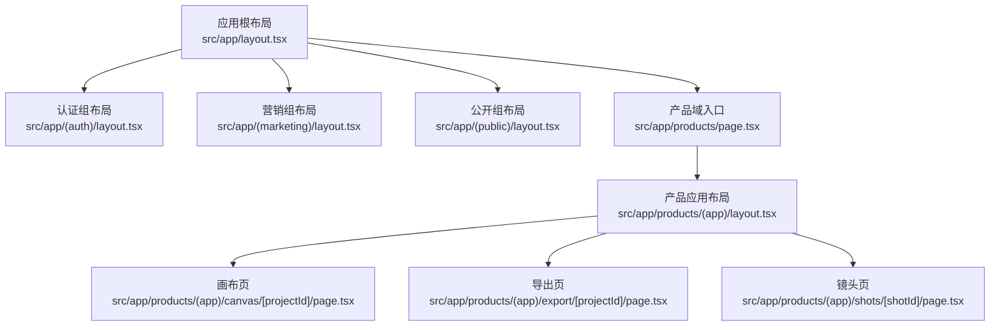
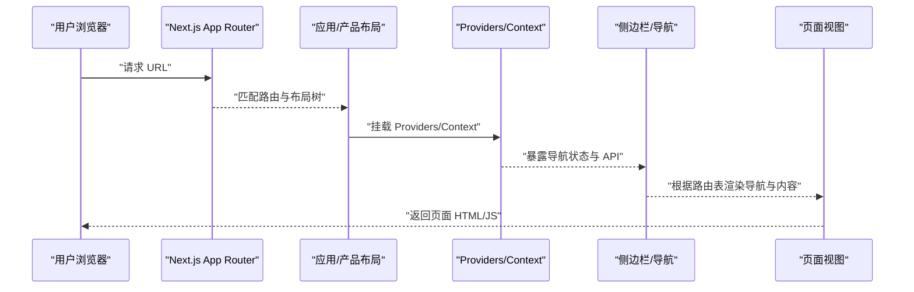
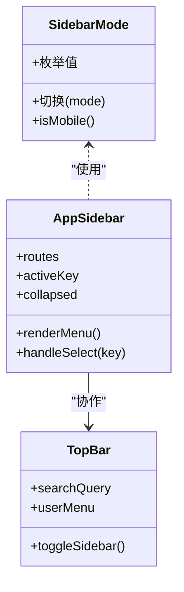
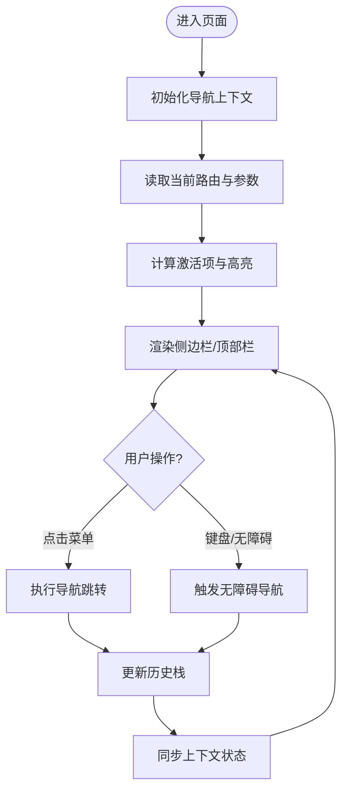
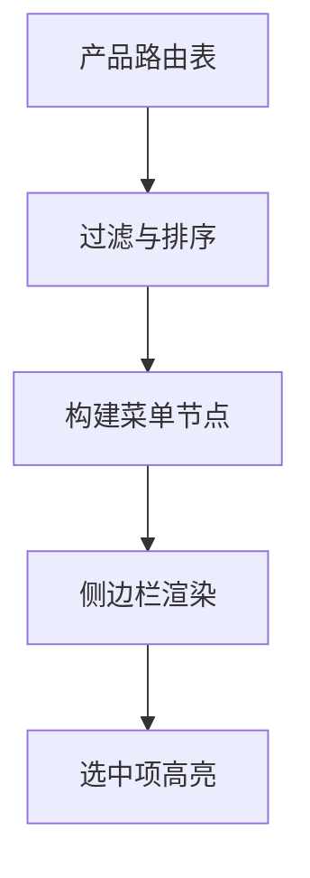
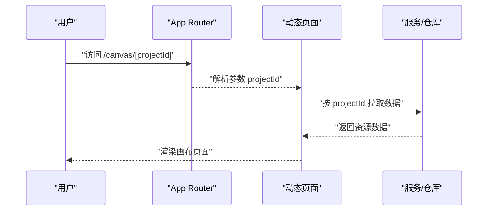
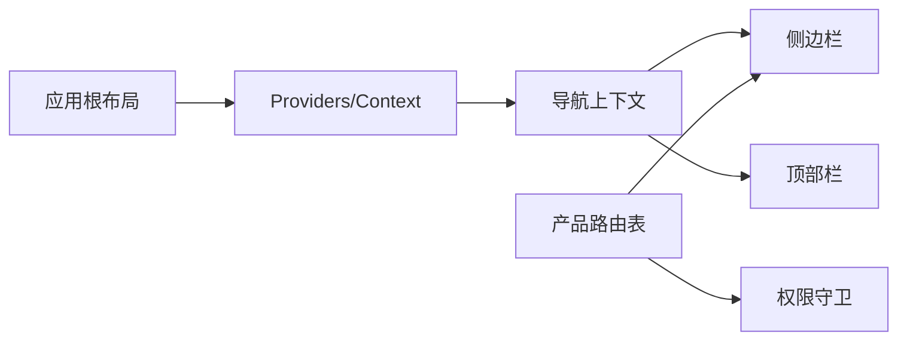

# 导航路由

<cite>
**本文引用的文件**   
- [src/app/layout.tsx](file://src/app/layout.tsx)
- [src/app/providers.tsx](file://src/app/providers.tsx)
- [src/app/(auth)/layout.tsx](file://src/app/(auth)/layout.tsx)
- [src/app/(marketing)/layout.tsx](file://src/app/(marketing)/layout.tsx)
- [src/app/(public)/layout.tsx](file://src/app/(public)/layout.tsx)
- [src/app/products/(app)/layout.tsx](file://src/app/products/(app)/layout.tsx)
- [src/app/products/(app)/page.tsx](file://src/app/products/(app)/page.tsx)
- [src/app/products/(app)/canvas/[projectId]/page.tsx](file://src/app/products/(app)/canvas/[projectId]/page.tsx)
- [src/app/products/(app)/export/[projectId]/page.tsx](file://src/app/products/(app)/export/[projectId]/page.tsx)
- [src/app/products/(app)/shots/[shotId]/page.tsx](file://src/app/products/(app)/shots/[shotId]/page.tsx)
- [src/app/products/page.tsx](file://src/app/products/page.tsx)
- [src/features/navigation/app-shell.tsx](file://src/features/navigation/app-shell.tsx)
- [src/features/navigation/app-sidebar-shell.tsx](file://src/features/navigation/app-sidebar-shell.tsx)
- [src/features/navigation/app-sidebar.tsx](file://src/features/navigation/app-sidebar.tsx)
- [src/features/navigation/nav-context.tsx](file://src/features/navigation/nav-context.tsx)
- [src/features/navigation/products-routes.ts](file://src/features/navigation/products-routes.ts)
- [src/features/navigation/sidebar-mode.ts](file://src/features/navigation/sidebar-mode.ts)
- [src/features/navigation/types.ts](file://src/features/navigation/types.ts)
- [src/components/ui/sidebar.tsx](file://src/components/ui/sidebar.tsx)
- [src/components/ui/top-bar.tsx](file://src/components/ui/top-bar.tsx)
- [src/lib/site-config.ts](file://src/lib/site-config.ts)
- [next.config.ts](file://next.config.ts)
</cite>

## 目录
1. [简介](#简介)
2. [项目结构](#项目结构)
3. [核心组件](#核心组件)
4. [架构总览](#架构总览)
5. [详细组件分析](#详细组件分析)
6. [依赖分析](#依赖分析)
7. [性能考虑](#性能考虑)
8. [故障排查指南](#故障排查指南)
9. [结论](#结论)
10. [附录](#附录)

## 简介
本技术文档围绕 PurpleInK 的导航与路由系统，系统性阐述基于 Next.js App Router 的路由组织、嵌套路由与动态路由实现；说明侧边栏导航、面包屑导航与路径管理策略；覆盖路由守卫、权限检查与重定向逻辑；并给出深度链接、URL 参数处理与查询字符串管理的实践。同时包含导航状态管理、历史记录与前进后退控制，以及响应式导航、移动端适配和无障碍访问支持的最佳实践。

## 项目结构
PurpleInK 采用 Next.js App Router 的文件路由约定，通过分组路由（(auth)、(marketing)、(public)、products/(app)）划分不同业务域与布局。应用根布局与 Provider 在顶层注入全局上下文与主题等能力；产品域内使用独立 layout 承载侧边栏与主内容区，并通过动态路由段（如 [projectId]、[shotId]）实现资源级页面。

图表来源
- [src/app/layout.tsx](file://src/app/layout.tsx)
- [src/app/(auth)/layout.tsx](file://src/app/(auth)/layout.tsx)
- [src/app/(marketing)/layout.tsx](file://src/app/(marketing)/layout.tsx)
- [src/app/(public)/layout.tsx](file://src/app/(public)/layout.tsx)
- [src/app/products/page.tsx](file://src/app/products/page.tsx)
- [src/app/products/(app)/layout.tsx](file://src/app/products/(app)/layout.tsx)
- [src/app/products/(app)/canvas/[projectId]/page.tsx](file://src/app/products/(app)/canvas/[projectId]/page.tsx)
- [src/app/products/(app)/export/[projectId]/page.tsx](file://src/app/products/(app)/export/[projectId]/page.tsx)
- [src/app/products/(app)/shots/[shotId]/page.tsx](file://src/app/products/(app)/shots/[shotId]/page.tsx)

章节来源
- [src/app/layout.tsx](file://src/app/layout.tsx)
- [src/app/products/page.tsx](file://src/app/products/page.tsx)
- [src/app/products/(app)/layout.tsx](file://src/app/products/(app)/layout.tsx)

## 核心组件
- 应用壳层与 Provider：在应用根或产品域布局中注入导航上下文、主题与全局 UI 能力，确保跨页面状态一致。
- 侧边栏与顶部栏：提供可折叠的侧边导航与顶部操作区，支撑多端适配与无障碍交互。
- 导航上下文：集中维护当前路由、激活项、展开/收起状态、模式切换等，供各导航组件消费。
- 产品路由表：以声明式方式定义产品域菜单、层级与权限映射，驱动侧边栏渲染与高亮。

章节来源
- [src/app/providers.tsx](file://src/app/providers.tsx)
- [src/features/navigation/app-shell.tsx](file://src/features/navigation/app-shell.tsx)
- [src/features/navigation/app-sidebar-shell.tsx](file://src/features/navigation/app-sidebar-shell.tsx)
- [src/features/navigation/app-sidebar.tsx](file://src/features/navigation/app-sidebar.tsx)
- [src/features/navigation/nav-context.tsx](file://src/features/navigation/nav-context.tsx)
- [src/features/navigation/products-routes.ts](file://src/features/navigation/products-routes.ts)
- [src/components/ui/sidebar.tsx](file://src/components/ui/sidebar.tsx)
- [src/components/ui/top-bar.tsx](file://src/components/ui/top-bar.tsx)

## 架构总览
下图展示从浏览器请求到页面渲染的关键流程，包括 App Router 路由解析、布局组合、Provider 注入与导航上下文初始化。

图表来源
- [src/app/layout.tsx](file://src/app/layout.tsx)
- [src/app/providers.tsx](file://src/app/providers.tsx)
- [src/app/products/(app)/layout.tsx](file://src/app/products/(app)/layout.tsx)
- [src/features/navigation/app-sidebar.tsx](file://src/features/navigation/app-sidebar.tsx)
- [src/features/navigation/nav-context.tsx](file://src/features/navigation/nav-context.tsx)

## 详细组件分析

### 应用与产品布局
- 应用根布局负责全局元信息、字体、样式与 Provider 挂载。
- 产品域布局承载侧边栏与主内容区，统一处理加载态、错误态与未找到态。
- 分组路由（(auth)、(marketing)、(public)）各自拥有独立布局，便于差异化外壳与权限控制。

章节来源
- [src/app/layout.tsx](file://src/app/layout.tsx)
- [src/app/(auth)/layout.tsx](file://src/app/(auth)/layout.tsx)
- [src/app/(marketing)/layout.tsx](file://src/app/(marketing)/layout.tsx)
- [src/app/(public)/layout.tsx](file://src/app/(public)/layout.tsx)
- [src/app/products/(app)/layout.tsx](file://src/app/products/(app)/layout.tsx)

### 侧边栏导航与模式
- 侧边栏通过“模式”区分不同显示形态（例如全屏、抽屉、折叠），并与响应式断点联动。
- 侧边栏数据来源于产品路由表，支持多级分组、图标、描述与权限标记。
- 顶部栏用于全局搜索、通知与用户头像等快捷入口，与侧边栏协同完成导航体验。

图表来源
- [src/features/navigation/sidebar-mode.ts](file://src/features/navigation/sidebar-mode.ts)
- [src/features/navigation/app-sidebar.tsx](file://src/features/navigation/app-sidebar.tsx)
- [src/components/ui/top-bar.tsx](file://src/components/ui/top-bar.tsx)

章节来源
- [src/features/navigation/sidebar-mode.ts](file://src/features/navigation/sidebar-mode.ts)
- [src/features/navigation/app-sidebar.tsx](file://src/features/navigation/app-sidebar.tsx)
- [src/components/ui/top-bar.tsx](file://src/components/ui/top-bar.tsx)

### 导航上下文与状态管理
- 导航上下文集中管理当前路由、激活项、历史栈、展开/收起状态与模式切换。
- 提供统一的导航 API（跳转、替换、前进/后退、打开外部链接等），屏蔽底层实现差异。
- 与 Provider 配合，确保跨组件共享且响应式更新。

图表来源
- [src/features/navigation/nav-context.tsx](file://src/features/navigation/nav-context.tsx)
- [src/features/navigation/app-shell.tsx](file://src/features/navigation/app-shell.tsx)

章节来源
- [src/features/navigation/nav-context.tsx](file://src/features/navigation/nav-context.tsx)
- [src/features/navigation/app-shell.tsx](file://src/features/navigation/app-shell.tsx)

### 产品路由表与菜单生成
- 产品路由表以声明式配置定义菜单层级、路由键、权限与可见性规则。
- 侧边栏根据该表动态渲染，自动处理分组、分隔符与禁用项。
- 路由表变更无需改动 UI 代码，降低耦合度。

图表来源
- [src/features/navigation/products-routes.ts](file://src/features/navigation/products-routes.ts)
- [src/features/navigation/app-sidebar.tsx](file://src/features/navigation/app-sidebar.tsx)

章节来源
- [src/features/navigation/products-routes.ts](file://src/features/navigation/products-routes.ts)
- [src/features/navigation/app-sidebar.tsx](file://src/features/navigation/app-sidebar.tsx)

### 动态路由与 URL 参数
- 动态路由段通过方括号命名（如 [projectId]、[shotId]）捕获路径参数。
- 页面组件通过路由上下文获取参数，并进行校验与加载对应资源。
- 结合查询字符串可实现筛选、分页与分享链接。

图表来源
- [src/app/products/(app)/canvas/[projectId]/page.tsx](file://src/app/products/(app)/canvas/[projectId]/page.tsx)
- [src/app/products/(app)/export/[projectId]/page.tsx](file://src/app/products/(app)/export/[projectId]/page.tsx)
- [src/app/products/(app)/shots/[shotId]/page.tsx](file://src/app/products/(app)/shots/[shotId]/page.tsx)

章节来源
- [src/app/products/(app)/canvas/[projectId]/page.tsx](file://src/app/products/(app)/canvas/[projectId]/page.tsx)
- [src/app/products/(app)/export/[projectId]/page.tsx](file://src/app/products/(app)/export/[projectId]/page.tsx)
- [src/app/products/(app)/shots/[shotId]/page.tsx](file://src/app/products/(app)/shots/[shotId]/page.tsx)

### 面包屑导航与路径管理
- 面包屑基于当前路由路径自动生成，支持自定义标题与层级。
- 路径管理策略建议：将业务实体 ID 放在路径段，将筛选与分页参数放入查询字符串，保证链接可分享与可缓存。
- 对于复杂页面，可在布局层统一组装面包屑，避免在各页面重复实现。

章节来源
- [src/app/products/(app)/layout.tsx](file://src/app/products/(app)/layout.tsx)
- [src/lib/site-config.ts](file://src/lib/site-config.ts)

### 路由守卫、权限检查与重定向
- 在布局或页面级别进行鉴权判断，未授权时重定向至登录或无权限页。
- 结合产品路由表的权限字段，对菜单项进行显隐控制。
- 推荐在客户端与服务端分别做校验，确保安全性与用户体验。

章节来源
- [src/app/(auth)/layout.tsx](file://src/app/(auth)/layout.tsx)
- [src/features/navigation/products-routes.ts](file://src/features/navigation/products-routes.ts)

### 深度链接、URL 参数与查询字符串
- 深度链接应包含完整路径与必要参数，确保直接访问也能正确渲染。
- 查询字符串用于非关键筛选条件，保持 URL 简洁与可分享性。
- 建议在导航上下文中统一管理参数序列化与反序列化，避免分散逻辑。

章节来源
- [src/features/navigation/nav-context.tsx](file://src/features/navigation/nav-context.tsx)
- [src/app/products/(app)/canvas/[projectId]/page.tsx](file://src/app/products/(app)/canvas/[projectId]/page.tsx)

### 导航状态、历史记录与前进后退
- 使用浏览器历史 API 或通过框架提供的导航方法实现前进/后退。
- 在 SPA 场景下，注意避免历史栈膨胀与重复条目。
- 对需要保留状态的页面，可使用懒加载与状态持久化策略。

章节来源
- [src/features/navigation/nav-context.tsx](file://src/features/navigation/nav-context.tsx)
- [src/features/navigation/app-shell.tsx](file://src/features/navigation/app-shell.tsx)

### 响应式导航、移动端适配与无障碍
- 侧边栏在小屏设备默认折叠为抽屉，通过顶部栏按钮切换。
- 触摸友好的交互区域与键盘可达性，确保无障碍访问。
- 使用语义化标签与 ARIA 属性提升屏幕阅读器体验。

章节来源
- [src/components/ui/sidebar.tsx](file://src/components/ui/sidebar.tsx)
- [src/components/ui/top-bar.tsx](file://src/components/ui/top-bar.tsx)
- [src/features/navigation/sidebar-mode.ts](file://src/features/navigation/sidebar-mode.ts)

## 依赖分析
- 布局与 Provider：应用根布局依赖 providers 与全局样式；产品域布局依赖侧边栏与导航上下文。
- 导航上下文：被侧边栏、顶部栏与页面组件共同消费，形成松耦合的数据流。
- 产品路由表：作为单一事实源，驱动侧边栏与权限控制，减少硬编码。

图表来源
- [src/app/layout.tsx](file://src/app/layout.tsx)
- [src/app/providers.tsx](file://src/app/providers.tsx)
- [src/features/navigation/nav-context.tsx](file://src/features/navigation/nav-context.tsx)
- [src/features/navigation/app-sidebar.tsx](file://src/features/navigation/app-sidebar.tsx)
- [src/features/navigation/products-routes.ts](file://src/features/navigation/products-routes.ts)

章节来源
- [src/app/layout.tsx](file://src/app/layout.tsx)
- [src/app/providers.tsx](file://src/app/providers.tsx)
- [src/features/navigation/nav-context.tsx](file://src/features/navigation/nav-context.tsx)
- [src/features/navigation/app-sidebar.tsx](file://src/features/navigation/app-sidebar.tsx)
- [src/features/navigation/products-routes.ts](file://src/features/navigation/products-routes.ts)

## 性能考虑
- 路由级代码分割：利用 App Router 的分块能力，按需加载页面与布局。
- 数据预取与缓存：在服务端或边缘函数中预取数据，结合缓存策略减少首屏延迟。
- 导航去抖与节流：频繁点击时避免重复请求与状态抖动。
- 图片与媒体优化：懒加载与占位图提升感知性能。

## 故障排查指南
- 路由不生效：检查文件命名与分组是否正确，确认 next.config 中的相关设置。
- 动态参数为空：确认 URL 段与参数名一致，并在页面中进行空值校验。
- 侧边栏高亮异常：核对路由表 key 与实际路径是否匹配，检查上下文状态更新时机。
- 权限误判：检查服务端与客户端双重校验逻辑，确认重定向目标正确。
- 移动端交互异常：验证侧边栏模式切换与触摸事件绑定，确保无障碍焦点管理。

章节来源
- [next.config.ts](file://next.config.ts)
- [src/app/products/(app)/layout.tsx](file://src/app/products/(app)/layout.tsx)
- [src/features/navigation/products-routes.ts](file://src/features/navigation/products-routes.ts)
- [src/features/navigation/nav-context.tsx](file://src/features/navigation/nav-context.tsx)

## 结论
PurpleInK 的导航路由系统以 Next.js App Router 为核心，结合分组路由、动态路由与声明式路由表，实现了清晰的路径组织与灵活的导航体验。通过统一的导航上下文与 Provider，侧边栏、顶部栏与页面组件之间解耦良好，易于扩展与维护。遵循本文的路径管理、权限控制与无障碍最佳实践，可进一步提升系统的稳定性与用户体验。

## 附录
- 术语说明
  - 分组路由：使用圆括号命名的路由目录，用于隔离布局与行为。
  - 动态路由：使用方括号命名的路由段，用于捕获可变参数。
  - 导航上下文：集中管理导航状态与 API 的 React Context。
- 参考文件
  - 站点配置与元信息：[src/lib/site-config.ts](file://src/lib/site-config.ts)
  - Next 配置：[next.config.ts](file://next.config.ts)