# 权限控制

<cite>
**本文引用的文件**   
- [src/app/(auth)/layout.tsx](file://src/app/(auth)/layout.tsx)
- [src/app/(auth)/login/page.tsx](file://src/app/(auth)/login/page.tsx)
- [src/app/(auth)/signup/page.tsx](file://src/app/(auth)/signup/page.tsx)
- [src/app/(auth)/_components/auth-shell-form.tsx](file://src/app/(auth)/_components/auth-shell-form.tsx)
- [src/app/api/projects/route.ts](file://src/app/api/projects/route.ts)
- [src/app/api/projects/[id]/route.ts](file://src/app/api/projects/[id]/route.ts)
- [src/app/api/artifacts/[id]/route.ts](file://src/app/api/artifacts/[id]/route.ts)
- [src/app/api/render/route.ts](file://src/app/api/render/route.ts)
- [src/app/api/render/export/route.ts](file://src/app/api/render/export/route.ts)
- [src/app/api/director/pipeline/route.ts](file://src/app/api/director/pipeline/route.ts)
- [src/app/api/director/stage/route.ts](file://src/app/api/director/stage/route.ts)
- [src/app/api/director/stream/route.ts](file://src/app/api/director/stream/route.ts)
- [src/app/api/director/stream/project/[projectId]/route.ts](file://src/app/api/director/stream/project/[projectId]/route.ts)
- [src/app/api/jobs/[id]/route.ts](file://src/app/api/jobs/[id]/route.ts)
- [src/app/api/settings/route.ts](file://src/app/api/settings/route.ts)
- [src/app/products/(app)/layout.tsx](file://src/app/products/(app)/layout.tsx)
- [src/app/products/(app)/template.tsx](file://src/app/products/(app)/template.tsx)
- [src/app/products/(app)/canvas/[projectId]/page.tsx](file://src/app/products/(app)/canvas/[projectId]/page.tsx)
- [src/app/products/(app)/dashboard/page.tsx](file://src/app/products/(app)/dashboard/page.tsx)
- [src/app/products/(app)/settings/page.tsx](file://src/app/products/(app)/settings/page.tsx)
- [src/lib/api.ts](file://src/lib/api.ts)
- [src/features/navigation/app-shell.tsx](file://src/features/navigation/app-shell.tsx)
- [src/features/navigation/products-routes.ts](file://src/features/navigation/products-routes.ts)
- [src/features/canvas/contracts.ts](file://src/features/canvas/contracts.ts)
- [src/features/canvas/actions.ts](file://src/features/canvas/actions.ts)
- [src/features/render/admission.ts](file://src/features/render/admission.ts)
- [src/features/render/repository.ts](file://src/features/render/repository.ts)
- [src/features/render/cache.ts](file://src/features/render/cache.ts)
- [src/features/render/queue-handler.ts](file://src/features/render/queue-handler.ts)
- [src/features/director/pi-session.ts](file://src/features/director/pi-session.ts)
- [src/features/director/session-store.ts](file://src/features/director/session-store.ts)
- [src/features/director/runtime-repository.ts](file://src/features/director/runtime-repository.ts)
- [src/features/director/advance.ts](file://src/features/director/advance.ts)
- [src/features/director/queue-handler.ts](file://src/features/director/queue-handler.ts)
- [src/features/credentials/provider-credential-store.ts](file://src/features/credentials/provider-credential-store.ts)
- [src/features/credentials/credential-envelope.ts](file://src/features/credentials/credential-envelope.ts)
- [server/src/index.ts](file://server/src/index.ts)
- [server/src/server/api.ts](file://server/src/server/api.ts)
- [server/src/server/job-runner.ts](file://server/src/server/job-runner.ts)
- [server/src/server/job-store.ts](file://server/src/server/job-store.ts)
- [drizzle.config.ts](file://drizzle.config.ts)
- [deploy/env.example](file://deploy/env.example)
</cite>

## 目录
1. [简介](#简介)
2. [项目结构](#项目结构)
3. [核心组件](#核心组件)
4. [架构总览](#架构总览)
5. [详细组件分析](#详细组件分析)
6. [依赖关系分析](#依赖关系分析)
7. [性能考量](#性能考量)
8. [故障排查指南](#故障排查指南)
9. [结论](#结论)
10. [附录](#附录)

## 简介
本技术文档面向 PurpleInK 的权限控制系统，围绕基于角色的访问控制（RBAC）、权限验证中间件、路由保护机制、API 级权限检查、数据隔离与多租户安全、人机验证与速率限制、权限配置管理、动态权限分配与撤销、审计日志记录、以及临时授权与权限升级等主题进行系统化说明。文档以代码为依据，结合架构图与流程图，帮助读者从高层到细节全面理解系统的安全模型与实现要点。

## 项目结构
PurpleInK 采用 Next.js App Router 组织前端与 API，服务端通过独立的 server 进程处理作业与流式任务。权限相关的关键位置包括：
- 认证入口与页面：(auth) 路由组下的登录、注册与布局
- 受保护的应用壳与模板：products/(app) 下的布局与模板
- API 路由：api/* 下各资源的路由处理器
- 特性模块：features/* 中的业务逻辑与仓储
- 服务端：server/src 下的 API、作业运行器与存储

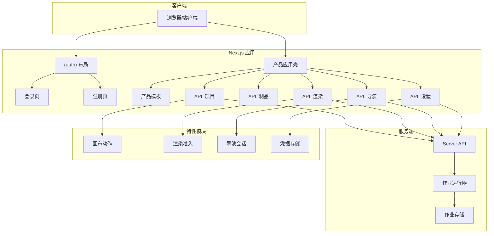

图表来源
- [src/app/(auth)/layout.tsx](file://src/app/(auth)/layout.tsx)
- [src/app/(auth)/login/page.tsx](file://src/app/(auth)/login/page.tsx)
- [src/app/(auth)/signup/page.tsx](file://src/app/(auth)/signup/page.tsx)
- [src/app/products/(app)/layout.tsx](file://src/app/products/(app)/layout.tsx)
- [src/app/products/(app)/template.tsx](file://src/app/products/(app)/template.tsx)
- [src/app/api/projects/route.ts](file://src/app/api/projects/route.ts)
- [src/app/api/artifacts/[id]/route.ts](file://src/app/api/artifacts/[id]/route.ts)
- [src/app/api/render/route.ts](file://src/app/api/render/route.ts)
- [src/app/api/director/pipeline/route.ts](file://src/app/api/director/pipeline/route.ts)
- [src/app/api/settings/route.ts](file://src/app/api/settings/route.ts)
- [server/src/server/api.ts](file://server/src/server/api.ts)
- [server/src/server/job-runner.ts](file://server/src/server/job-runner.ts)
- [server/src/server/job-store.ts](file://server/src/server/job-store.ts)

章节来源
- [src/app/(auth)/layout.tsx](file://src/app/(auth)/layout.tsx)
- [src/app/products/(app)/layout.tsx](file://src/app/products/(app)/layout.tsx)
- [src/app/products/(app)/template.tsx](file://src/app/products/(app)/template.tsx)
- [src/app/api/projects/route.ts](file://src/app/api/projects/route.ts)
- [server/src/server/api.ts](file://server/src/server/api.ts)

## 核心组件
- 认证与鉴权入口
  - (auth) 布局负责统一认证上下文与重定向策略
  - 登录/注册页面提供用户身份建立流程
  - 产品应用壳与模板在受保护路由中注入权限上下文
- API 层权限校验
  - 各 API 路由对请求进行身份与角色校验
  - 资源级权限检查（如项目 ID、制品 ID）确保数据隔离
- 特性模块中的权限策略
  - 渲染准入模块决定哪些操作可进入渲染管线
  - 导演会话与会话存储维护执行上下文与权限边界
  - 凭据存储封装第三方服务凭据访问
- 服务端作业与流式处理
  - 作业运行器与存储保障后台任务的执行与状态持久化
  - 服务端 API 暴露受控接口供前端调用

章节来源
- [src/app/(auth)/layout.tsx](file://src/app/(auth)/layout.tsx)
- [src/app/(auth)/login/page.tsx](file://src/app/(auth)/login/page.tsx)
- [src/app/(auth)/signup/page.tsx](file://src/app/(auth)/signup/page.tsx)
- [src/app/products/(app)/layout.tsx](file://src/app/products/(app)/layout.tsx)
- [src/app/products/(app)/template.tsx](file://src/app/products/(app)/template.tsx)
- [src/app/api/projects/route.ts](file://src/app/api/projects/route.ts)
- [src/app/api/artifacts/[id]/route.ts](file://src/app/api/artifacts/[id]/route.ts)
- [src/app/api/render/route.ts](file://src/app/api/render/route.ts)
- [src/app/api/director/pipeline/route.ts](file://src/app/api/director/pipeline/route.ts)
- [src/app/api/settings/route.ts](file://src/app/api/settings/route.ts)
- [src/features/render/admission.ts](file://src/features/render/admission.ts)
- [src/features/director/pi-session.ts](file://src/features/director/pi-session.ts)
- [src/features/director/session-store.ts](file://src/features/director/session-store.ts)
- [src/features/credentials/provider-credential-store.ts](file://src/features/credentials/provider-credential-store.ts)
- [server/src/server/api.ts](file://server/src/server/api.ts)
- [server/src/server/job-runner.ts](file://server/src/server/job-runner.ts)
- [server/src/server/job-store.ts](file://server/src/server/job-store.ts)

## 架构总览
下图展示 PurpleInK 权限控制的整体架构，涵盖客户端、Next.js 应用、特性模块与服务端之间的交互路径与安全边界。

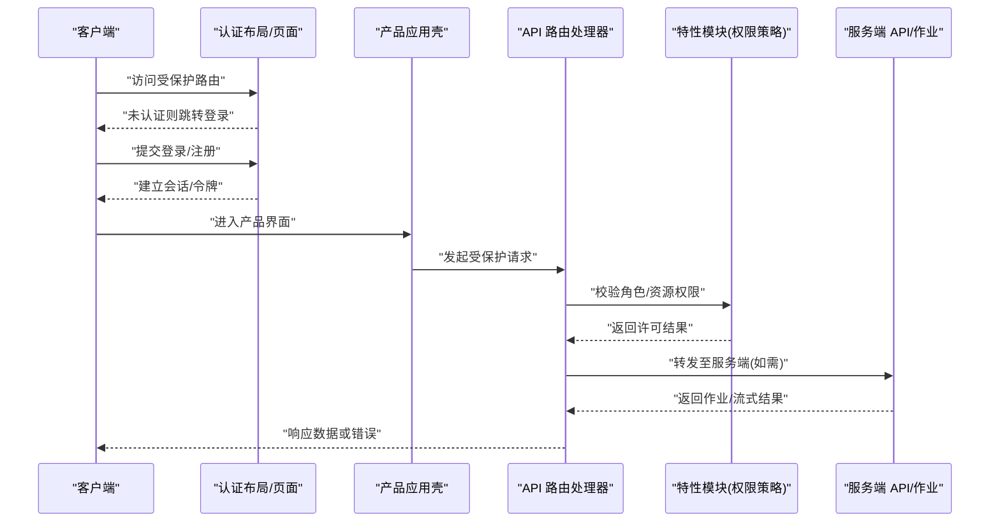

图表来源
- [src/app/(auth)/layout.tsx](file://src/app/(auth)/layout.tsx)
- [src/app/(auth)/login/page.tsx](file://src/app/(auth)/login/page.tsx)
- [src/app/products/(app)/layout.tsx](file://src/app/products/(app)/layout.tsx)
- [src/app/api/projects/route.ts](file://src/app/api/projects/route.ts)
- [src/app/api/render/route.ts](file://src/app/api/render/route.ts)
- [src/app/api/director/pipeline/route.ts](file://src/app/api/director/pipeline/route.ts)
- [server/src/server/api.ts](file://server/src/server/api.ts)

## 详细组件分析

### 认证与路由保护
- 认证布局与页面
  - (auth) 布局集中处理认证状态与重定向
  - 登录/注册页面完成用户身份创建与初始化
- 产品应用壳与模板
  - 在受保护路由中注入权限上下文，确保后续请求携带必要标识
  - 模板层统一渲染受保护内容，避免越权访问

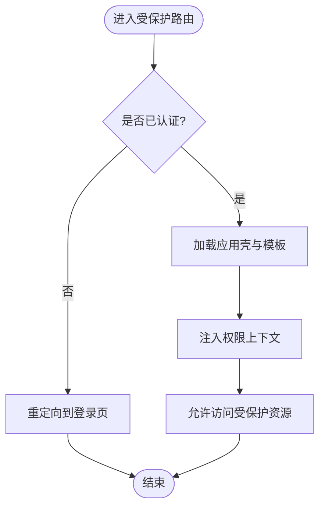

图表来源
- [src/app/(auth)/layout.tsx](file://src/app/(auth)/layout.tsx)
- [src/app/(auth)/login/page.tsx](file://src/app/(auth)/login/page.tsx)
- [src/app/(auth)/signup/page.tsx](file://src/app/(auth)/signup/page.tsx)
- [src/app/products/(app)/layout.tsx](file://src/app/products/(app)/layout.tsx)
- [src/app/products/(app)/template.tsx](file://src/app/products/(app)/template.tsx)

章节来源
- [src/app/(auth)/layout.tsx](file://src/app/(auth)/layout.tsx)
- [src/app/(auth)/login/page.tsx](file://src/app/(auth)/login/page.tsx)
- [src/app/(auth)/signup/page.tsx](file://src/app/(auth)/signup/page.tsx)
- [src/app/products/(app)/layout.tsx](file://src/app/products/(app)/layout.tsx)
- [src/app/products/(app)/template.tsx](file://src/app/products/(app)/template.tsx)

### API 级权限检查与 RBAC
- 项目 API
  - 列表与详情路由需校验当前用户对项目的角色与访问权限
  - 资源 ID 作为租户隔离键，确保数据不跨租户泄露
- 制品 API
  - 按制品 ID 校验归属与操作权限（读/写/删除）
- 渲染与导出 API
  - 准入模块决定请求是否进入渲染管线，防止滥用
- 导演与作业 API
  - 会话与会务校验确保仅授权主体可触发流水线阶段推进
- 设置 API
  - 凭据存储与信封封装敏感信息，限制读取与更新范围

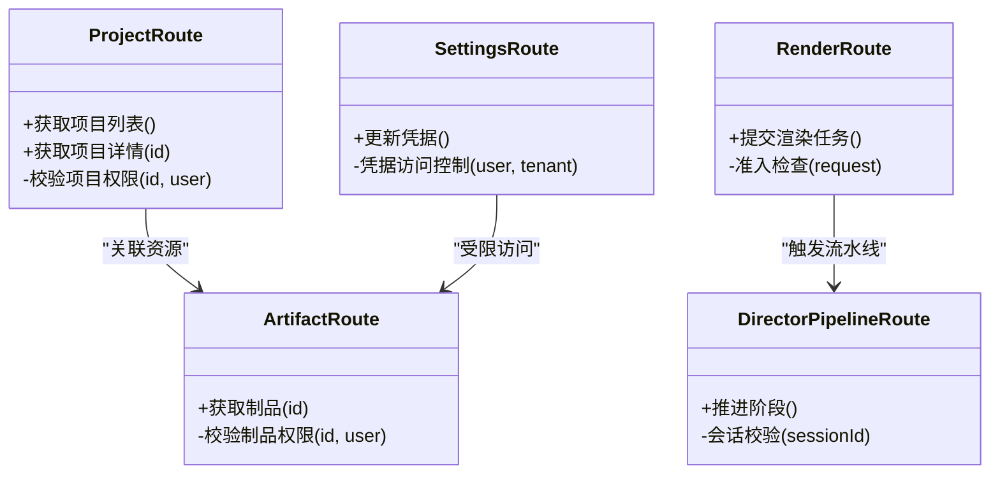

图表来源
- [src/app/api/projects/route.ts](file://src/app/api/projects/route.ts)
- [src/app/api/projects/[id]/route.ts](file://src/app/api/projects/[id]/route.ts)
- [src/app/api/artifacts/[id]/route.ts](file://src/app/api/artifacts/[id]/route.ts)
- [src/app/api/render/route.ts](file://src/app/api/render/route.ts)
- [src/app/api/director/pipeline/route.ts](file://src/app/api/director/pipeline/route.ts)
- [src/app/api/settings/route.ts](file://src/app/api/settings/route.ts)

章节来源
- [src/app/api/projects/route.ts](file://src/app/api/projects/route.ts)
- [src/app/api/projects/[id]/route.ts](file://src/app/api/projects/[id]/route.ts)
- [src/app/api/artifacts/[id]/route.ts](file://src/app/api/artifacts/[id]/route.ts)
- [src/app/api/render/route.ts](file://src/app/api/render/route.ts)
- [src/app/api/director/pipeline/route.ts](file://src/app/api/director/pipeline/route.ts)
- [src/app/api/settings/route.ts](file://src/app/api/settings/route.ts)

### 数据隔离与多租户安全
- 租户隔离键
  - 使用项目 ID、制品 ID 等作为租户隔离键，确保查询与写入限定在当前租户范围内
- 仓储层过滤
  - 渲染仓储与导演运行时仓储在数据访问时强制附加租户条件
- 凭据隔离
  - 凭据存储按租户与提供者维度隔离，避免跨租户凭据泄露

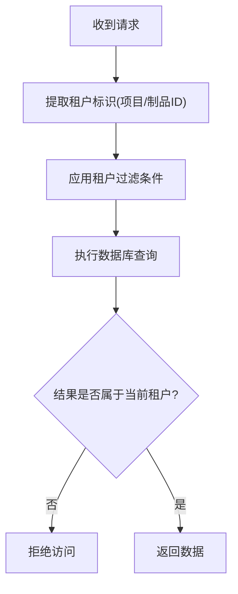

图表来源
- [src/features/render/repository.ts](file://src/features/render/repository.ts)
- [src/features/director/runtime-repository.ts](file://src/features/director/runtime-repository.ts)
- [src/features/credentials/provider-credential-store.ts](file://src/features/credentials/provider-credential-store.ts)

章节来源
- [src/features/render/repository.ts](file://src/features/render/repository.ts)
- [src/features/director/runtime-repository.ts](file://src/features/director/runtime-repository.ts)
- [src/features/credentials/provider-credential-store.ts](file://src/features/credentials/provider-credential-store.ts)

### 人机验证与速率限制
- 人机验证
  - 在登录/注册与关键操作前引入验证码或挑战，降低自动化攻击风险
- 速率限制
  - 针对高频 API（如渲染提交、流水线推进）实施请求频率控制，防止滥用与资源耗尽

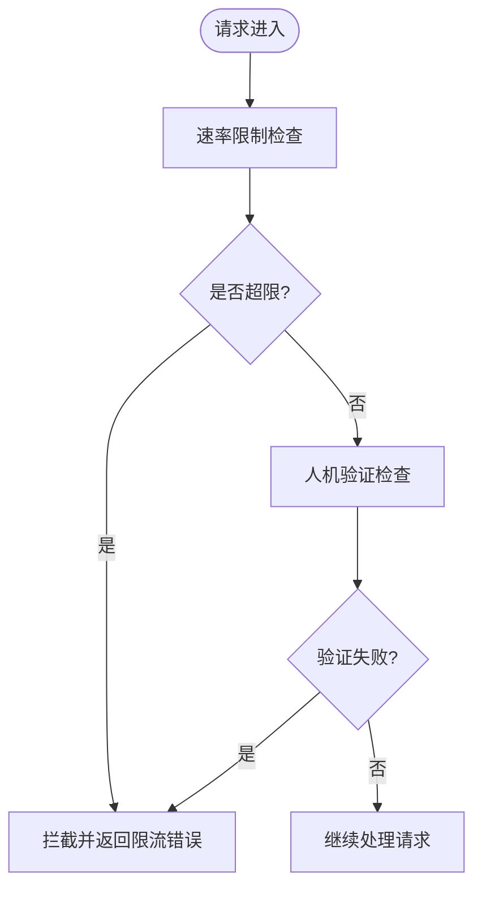

图表来源
- [src/app/api/render/route.ts](file://src/app/api/render/route.ts)
- [src/app/api/director/pipeline/route.ts](file://src/app/api/director/pipeline/route.ts)
- [src/app/(auth)/login/page.tsx](file://src/app/(auth)/login/page.tsx)

章节来源
- [src/app/api/render/route.ts](file://src/app/api/render/route.ts)
- [src/app/api/director/pipeline/route.ts](file://src/app/api/director/pipeline/route.ts)
- [src/app/(auth)/login/page.tsx](file://src/app/(auth)/login/page.tsx)

### 权限配置管理与动态权限分配
- 权限配置
  - 通过环境变量与配置文件定义角色与权限映射
- 动态分配
  - 在设置 API 中支持按租户与用户维度动态调整权限
- 审计日志
  - 记录权限变更、访问尝试与失败事件，便于追踪与合规

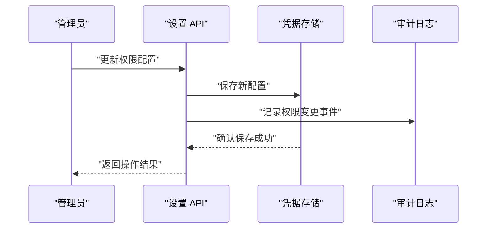

图表来源
- [src/app/api/settings/route.ts](file://src/app/api/settings/route.ts)
- [src/features/credentials/provider-credential-store.ts](file://src/features/credentials/provider-credential-store.ts)

章节来源
- [src/app/api/settings/route.ts](file://src/app/api/settings/route.ts)
- [src/features/credentials/provider-credential-store.ts](file://src/features/credentials/provider-credential-store.ts)

### 临时授权与权限升级
- 临时授权
  - 为特定时间段授予有限权限，过期自动失效
- 权限升级
  - 在满足条件时提升用户角色或扩展资源访问范围，需审批与审计

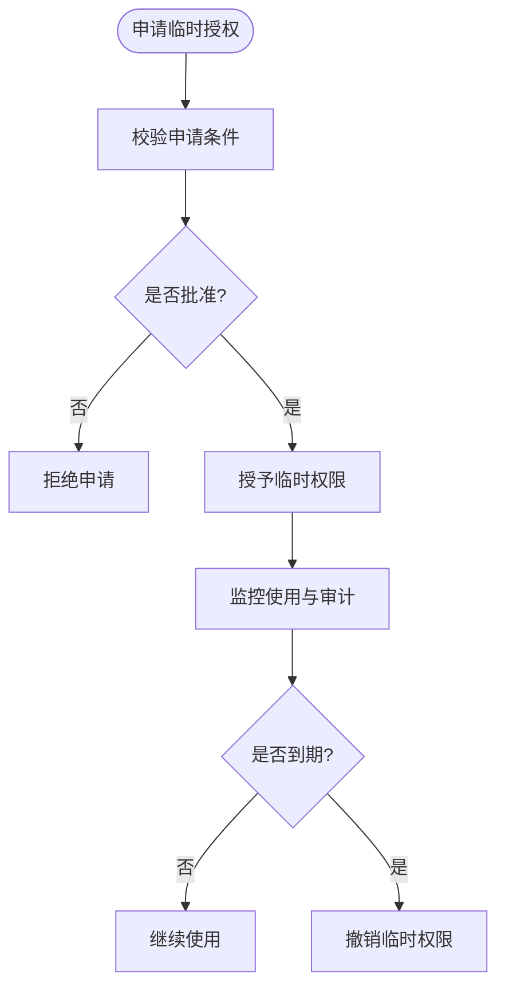

图表来源
- [src/app/api/settings/route.ts](file://src/app/api/settings/route.ts)
- [src/features/credentials/provider-credential-store.ts](file://src/features/credentials/provider-credential-store.ts)

章节来源
- [src/app/api/settings/route.ts](file://src/app/api/settings/route.ts)
- [src/features/credentials/provider-credential-store.ts](file://src/features/credentials/provider-credential-store.ts)

### 渲染与流水线中的权限控制
- 渲染准入
  - 在进入渲染管线前进行权限与配额检查
- 流水线推进
  - 导演会话与会务校验确保仅授权主体可推进阶段
- 作业执行
  - 作业运行器与存储保障执行过程的可追溯性

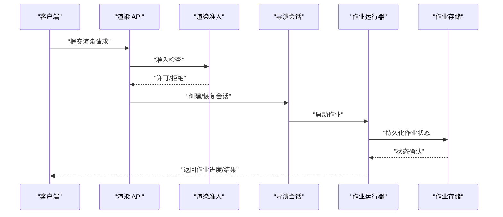

图表来源
- [src/app/api/render/route.ts](file://src/app/api/render/route.ts)
- [src/features/render/admission.ts](file://src/features/render/admission.ts)
- [src/features/director/pi-session.ts](file://src/features/director/pi-session.ts)
- [server/src/server/job-runner.ts](file://server/src/server/job-runner.ts)
- [server/src/server/job-store.ts](file://server/src/server/job-store.ts)

章节来源
- [src/app/api/render/route.ts](file://src/app/api/render/route.ts)
- [src/features/render/admission.ts](file://src/features/render/admission.ts)
- [src/features/director/pi-session.ts](file://src/features/director/pi-session.ts)
- [server/src/server/job-runner.ts](file://server/src/server/job-runner.ts)
- [server/src/server/job-store.ts](file://server/src/server/job-store.ts)

### 画布与制品操作的权限约束
- 画布动作
  - 在画布操作中校验用户对画布资源的读写权限
- 制品访问
  - 制品路由按 ID 校验归属与操作权限，确保数据隔离

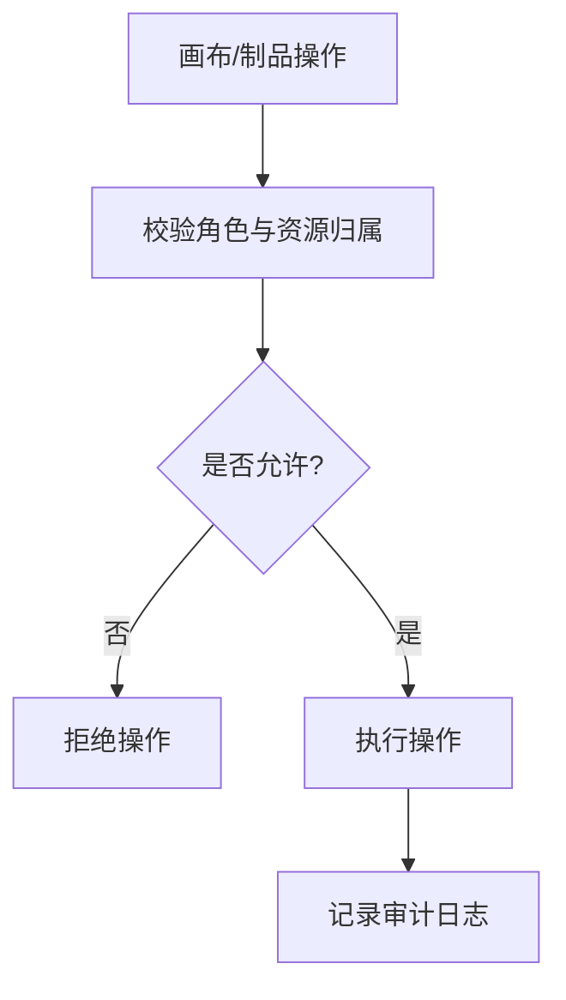

图表来源
- [src/features/canvas/actions.ts](file://src/features/canvas/actions.ts)
- [src/app/api/artifacts/[id]/route.ts](file://src/app/api/artifacts/[id]/route.ts)

章节来源
- [src/features/canvas/actions.ts](file://src/features/canvas/actions.ts)
- [src/app/api/artifacts/[id]/route.ts](file://src/app/api/artifacts/[id]/route.ts)

## 依赖关系分析
- 组件耦合与内聚
  - API 路由与特性模块解耦，通过仓储与策略接口协作
  - 认证与鉴权集中在布局与模板层，减少重复校验
- 外部依赖与集成点
  - 数据库配置与迁移脚本用于持久化权限与租户数据
  - 环境变量与部署配置管理敏感信息与功能开关

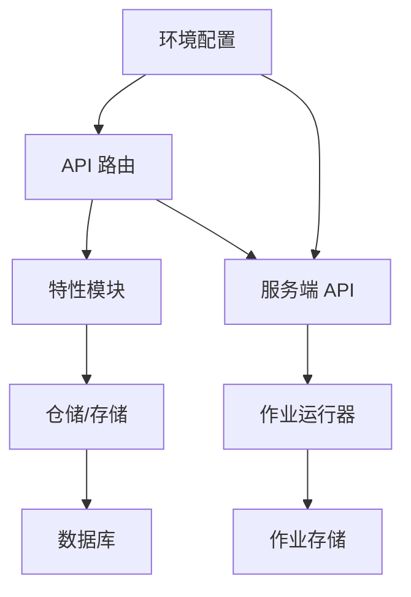

图表来源
- [src/app/api/projects/route.ts](file://src/app/api/projects/route.ts)
- [src/features/render/repository.ts](file://src/features/render/repository.ts)
- [server/src/server/api.ts](file://server/src/server/api.ts)
- [server/src/server/job-runner.ts](file://server/src/server/job-runner.ts)
- [server/src/server/job-store.ts](file://server/src/server/job-store.ts)
- [drizzle.config.ts](file://drizzle.config.ts)
- [deploy/env.example](file://deploy/env.example)

章节来源
- [src/app/api/projects/route.ts](file://src/app/api/projects/route.ts)
- [src/features/render/repository.ts](file://src/features/render/repository.ts)
- [server/src/server/api.ts](file://server/src/server/api.ts)
- [server/src/server/job-runner.ts](file://server/src/server/job-runner.ts)
- [server/src/server/job-store.ts](file://server/src/server/job-store.ts)
- [drizzle.config.ts](file://drizzle.config.ts)
- [deploy/env.example](file://deploy/env.example)

## 性能考量
- 缓存与队列
  - 渲染缓存减少重复计算，队列处理器平滑负载峰值
- 并发与限流
  - 合理设置并发度与速率限制，避免资源争用与过载
- 审计与日志
  - 选择性记录关键事件，平衡可观测性与 I/O 开销

[本节为通用指导，无需引用具体文件]

## 故障排查指南
- 常见问题定位
  - 认证失败：检查布局与登录页面的会话建立流程
  - 权限拒绝：核对 API 路由中的角色与资源校验逻辑
  - 限流错误：查看速率限制与人机验证配置
  - 作业失败：检查作业运行器与存储的状态与日志
- 调试建议
  - 启用详细日志与审计记录
  - 使用测试用例验证权限策略与数据隔离

章节来源
- [src/app/(auth)/layout.tsx](file://src/app/(auth)/layout.tsx)
- [src/app/(auth)/login/page.tsx](file://src/app/(auth)/login/page.tsx)
- [src/app/api/render/route.ts](file://src/app/api/render/route.ts)
- [server/src/server/job-runner.ts](file://server/src/server/job-runner.ts)
- [server/src/server/job-store.ts](file://server/src/server/job-store.ts)

## 结论
PurpleInK 的权限控制系统以 RBAC 为核心，结合认证布局、API 路由校验、特性模块策略与服务端作业管控，构建了完整的多租户安全体系。通过人机验证、速率限制、权限配置管理与审计日志，系统在安全性与可用性之间取得良好平衡。未来可进一步细化权限粒度、增强动态授权能力与优化性能表现。

[本节为总结性内容，无需引用具体文件]

## 附录
- 环境变量与部署配置
  - 参考 deploy/env.example 与 drizzle.config.ts 了解敏感信息与数据库配置
- 测试与契约
  - 参考各 API 路由的测试文件验证权限行为与数据隔离

章节来源
- [deploy/env.example](file://deploy/env.example)
- [drizzle.config.ts](file://drizzle.config.ts)