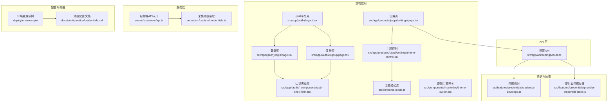
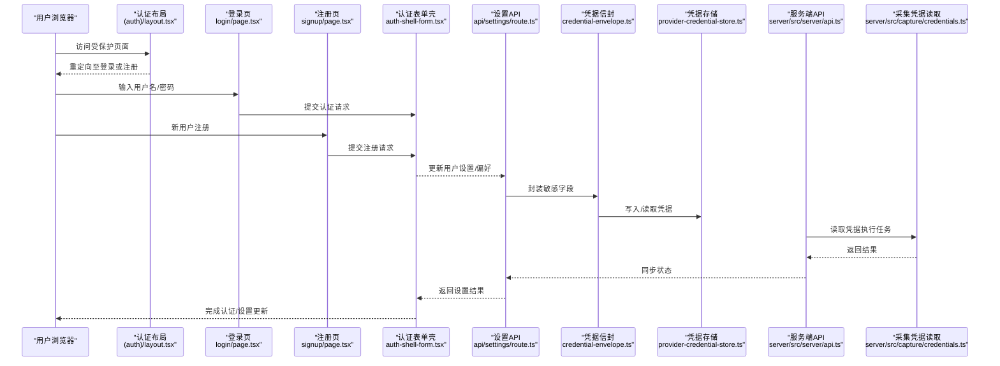
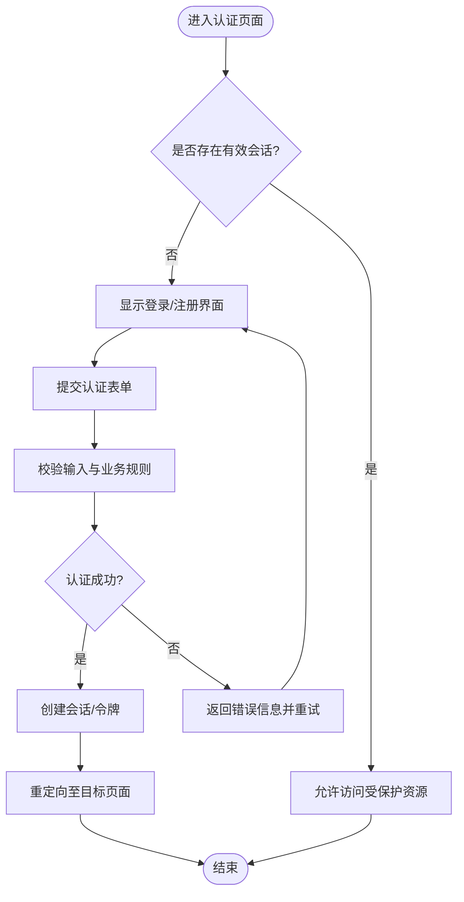
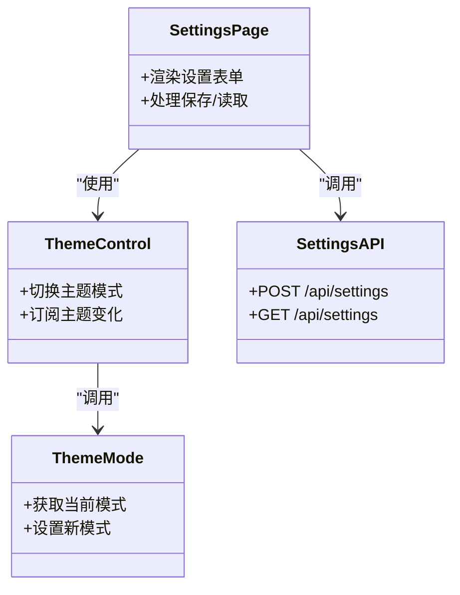
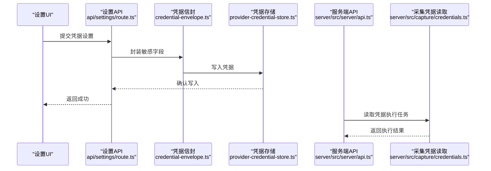
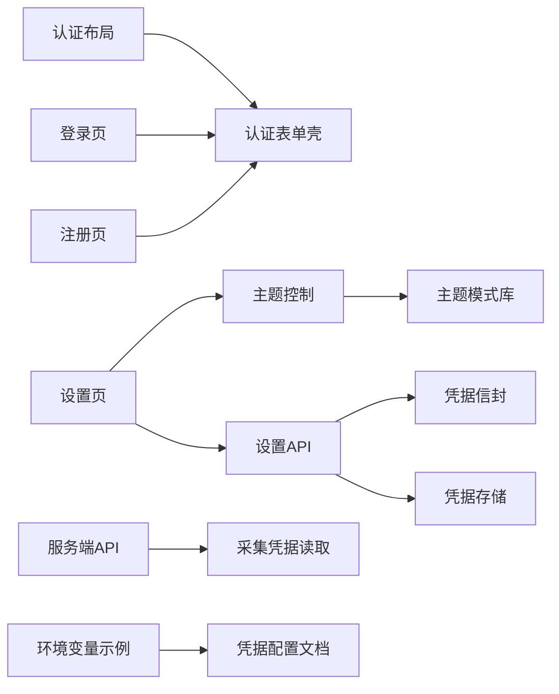

# 用户管理

<cite>
**本文引用的文件**   
- [src/app/(auth)/layout.tsx](file://src/app/(auth)/layout.tsx)
- [src/app/(auth)/login/page.tsx](file://src/app/(auth)/login/page.tsx)
- [src/app/(auth)/signup/page.tsx](file://src/app/(auth)/signup/page.tsx)
- [src/app/(auth)/_components/auth-shell-form.tsx](file://src/app/(auth)/_components/auth-shell-form.tsx)
- [src/app/api/settings/route.ts](file://src/app/api/settings/route.ts)
- [src/app/products/(app)/settings/page.tsx](file://src/app/products/(app)/settings/page.tsx)
- [src/app/products/(app)/settings/theme-control.tsx](file://src/app/products/(app)/settings/theme-control.tsx)
- [src/lib/theme-mode.ts](file://src/lib/theme-mode.ts)
- [src/components/marketing/theme-switch.tsx](file://src/components/marketing/theme-switch.tsx)
- [src/features/credentials/provider-credential-store.ts](file://src/features/credentials/provider-credential-store.ts)
- [src/features/credentials/credential-envelope.ts](file://src/features/credentials/credential-envelope.ts)
- [scripts/setup/bootstrap-credentials.ts](file://scripts/setup/bootstrap-credentials.ts)
- [server/src/server/api.ts](file://server/src/server/api.ts)
- [server/src/capture/credentials.ts](file://server/src/capture/credentials.ts)
- [deploy/env.example](file://deploy/env.example)
- [docs/configuration/credentials.md](file://docs/configuration/credentials.md)
</cite>

## 目录
1. [简介](#简介)
2. [项目结构](#项目结构)
3. [核心组件](#核心组件)
4. [架构总览](#架构总览)
5. [详细组件分析](#详细组件分析)
6. [依赖分析](#依赖分析)
7. [性能考虑](#性能考虑)
8. [故障排查指南](#故障排查指南)
9. [结论](#结论)
10. [附录](#附录)

## 简介
本技术文档面向 PurpleInk 的用户管理系统，聚焦认证与授权、权限控制、角色策略、登录注册流程、会话与安全最佳实践、凭据存储与加密机制、第三方认证集成、用户设置与偏好配置（含主题切换）、权限验证中间件与路由保护、API访问控制、数据隐私保护、审计日志与合规性要求。文档以仓库现有实现为依据，提供代码级分析与可视化图示，帮助开发者快速理解并扩展系统能力。

## 项目结构
与用户管理相关的前端页面位于 Next.js App Router 的 (auth) 路由组内，包含登录与注册入口；设置页位于 products/(app)/settings 下；API 设置接口位于 app/api/settings；凭据管理与加密封装位于 features/credentials；服务端 API 与凭据读取位于 server 子工程；部署与环境变量示例位于 deploy 与 docs/configuration。

图表来源
- [src/app/(auth)/layout.tsx](file://src/app/(auth)/layout.tsx)
- [src/app/(auth)/login/page.tsx](file://src/app/(auth)/login/page.tsx)
- [src/app/(auth)/signup/page.tsx](file://src/app/(auth)/signup/page.tsx)
- [src/app/(auth)/_components/auth-shell-form.tsx](file://src/app/(auth)/_components/auth-shell-form.tsx)
- [src/app/products/(app)/settings/page.tsx](file://src/app/products/(app)/settings/page.tsx)
- [src/app/products/(app)/settings/theme-control.tsx](file://src/app/products/(app)/settings/theme-control.tsx)
- [src/lib/theme-mode.ts](file://src/lib/theme-mode.ts)
- [src/components/marketing/theme-switch.tsx](file://src/components/marketing/theme-switch.tsx)
- [src/app/api/settings/route.ts](file://src/app/api/settings/route.ts)
- [src/features/credentials/credential-envelope.ts](file://src/features/credentials/credential-envelope.ts)
- [src/features/credentials/provider-credential-store.ts](file://src/features/credentials/provider-credential-store.ts)
- [server/src/server/api.ts](file://server/src/server/api.ts)
- [server/src/capture/credentials.ts](file://server/src/capture/credentials.ts)
- [deploy/env.example](file://deploy/env.example)
- [docs/configuration/credentials.md](file://docs/configuration/credentials.md)

章节来源
- [src/app/(auth)/layout.tsx](file://src/app/(auth)/layout.tsx)
- [src/app/(auth)/login/page.tsx](file://src/app/(auth)/login/page.tsx)
- [src/app/(auth)/signup/page.tsx](file://src/app/(auth)/signup/page.tsx)
- [src/app/(auth)/_components/auth-shell-form.tsx](file://src/app/(auth)/_components/auth-shell-form.tsx)
- [src/app/products/(app)/settings/page.tsx](file://src/app/products/(app)/settings/page.tsx)
- [src/app/products/(app)/settings/theme-control.tsx](file://src/app/products/(app)/settings/theme-control.tsx)
- [src/lib/theme-mode.ts](file://src/lib/theme-mode.ts)
- [src/components/marketing/theme-switch.tsx](file://src/components/marketing/theme-switch.tsx)
- [src/app/api/settings/route.ts](file://src/app/api/settings/route.ts)
- [src/features/credentials/credential-envelope.ts](file://src/features/credentials/credential-envelope.ts)
- [src/features/credentials/provider-credential-store.ts](file://src/features/credentials/provider-credential-store.ts)
- [server/src/server/api.ts](file://server/src/server/api.ts)
- [server/src/capture/credentials.ts](file://server/src/capture/credentials.ts)
- [deploy/env.example](file://deploy/env.example)
- [docs/configuration/credentials.md](file://docs/configuration/credentials.md)

## 核心组件
- 认证入口与表单：(auth) 布局与登录/注册页面提供统一认证外壳，复用表单组件进行输入校验与提交。
- 设置与主题：设置页聚合用户偏好，主题控制组件驱动主题模式切换，主题模式库提供跨端一致的切换逻辑。
- 设置API：统一的设置读写接口，负责参数校验、持久化与返回结果。
- 凭据与加密：凭据信封对敏感信息进行结构化封装，提供者凭据存储对接具体后端存储（如数据库或密钥服务）。
- 服务端API与凭据读取：服务端暴露API并安全读取凭据，供采集等内部流程使用。

章节来源
- [src/app/(auth)/layout.tsx](file://src/app/(auth)/layout.tsx)
- [src/app/(auth)/login/page.tsx](file://src/app/(auth)/login/page.tsx)
- [src/app/(auth)/signup/page.tsx](file://src/app/(auth)/signup/page.tsx)
- [src/app/(auth)/_components/auth-shell-form.tsx](file://src/app/(auth)/_components/auth-shell-form.tsx)
- [src/app/products/(app)/settings/page.tsx](file://src/app/products/(app)/settings/page.tsx)
- [src/app/products/(app)/settings/theme-control.tsx](file://src/app/products/(app)/settings/theme-control.tsx)
- [src/lib/theme-mode.ts](file://src/lib/theme-mode.ts)
- [src/app/api/settings/route.ts](file://src/app/api/settings/route.ts)
- [src/features/credentials/credential-envelope.ts](file://src/features/credentials/credential-envelope.ts)
- [src/features/credentials/provider-credential-store.ts](file://src/features/credentials/provider-credential-store.ts)
- [server/src/server/api.ts](file://server/src/server/api.ts)
- [server/src/capture/credentials.ts](file://server/src/capture/credentials.ts)

## 架构总览
下图展示从前端认证到设置API、再到凭据存储与服务端凭据读取的整体调用链。

图表来源
- [src/app/(auth)/layout.tsx](file://src/app/(auth)/layout.tsx)
- [src/app/(auth)/login/page.tsx](file://src/app/(auth)/login/page.tsx)
- [src/app/(auth)/signup/page.tsx](file://src/app/(auth)/signup/page.tsx)
- [src/app/(auth)/_components/auth-shell-form.tsx](file://src/app/(auth)/_components/auth-shell-form.tsx)
- [src/app/api/settings/route.ts](file://src/app/api/settings/route.ts)
- [src/features/credentials/credential-envelope.ts](file://src/features/credentials/credential-envelope.ts)
- [src/features/credentials/provider-credential-store.ts](file://src/features/credentials/provider-credential-store.ts)
- [server/src/server/api.ts](file://server/src/server/api.ts)
- [server/src/capture/credentials.ts](file://server/src/capture/credentials.ts)

## 详细组件分析

### 认证与授权机制
- 认证入口：(auth) 布局作为认证页面的统一容器，负责渲染登录/注册入口及公共交互。
- 登录/注册流程：登录页与注册页分别处理不同场景的表单提交，通过认证表单壳统一校验与提交。
- 会话管理：当前仓库未提供显式的会话管理实现（如JWT或Session），建议在认证成功后建立短期令牌并通过HTTP-only Cookie传递，避免XSS风险。
- 权限与角色：当前未见明确的RBAC实现，建议引入角色模型与权限校验中间件，在路由与API层进行细粒度控制。

章节来源
- [src/app/(auth)/layout.tsx](file://src/app/(auth)/layout.tsx)
- [src/app/(auth)/login/page.tsx](file://src/app/(auth)/login/page.tsx)
- [src/app/(auth)/signup/page.tsx](file://src/app/(auth)/signup/page.tsx)
- [src/app/(auth)/_components/auth-shell-form.tsx](file://src/app/(auth)/_components/auth-shell-form.tsx)

### 用户设置与偏好配置
- 设置页：聚合用户偏好项，支持保存与读取。
- 主题控制：主题控制组件驱动主题切换，主题模式库提供跨端一致的主题模式管理。
- 设置API：统一接口负责参数校验、持久化与响应。

图表来源
- [src/app/products/(app)/settings/page.tsx](file://src/app/products/(app)/settings/page.tsx)
- [src/app/products/(app)/settings/theme-control.tsx](file://src/app/products/(app)/settings/theme-control.tsx)
- [src/lib/theme-mode.ts](file://src/lib/theme-mode.ts)
- [src/app/api/settings/route.ts](file://src/app/api/settings/route.ts)

章节来源
- [src/app/products/(app)/settings/page.tsx](file://src/app/products/(app)/settings/page.tsx)
- [src/app/products/(app)/settings/theme-control.tsx](file://src/app/products/(app)/settings/theme-control.tsx)
- [src/lib/theme-mode.ts](file://src/lib/theme-mode.ts)
- [src/app/api/settings/route.ts](file://src/app/api/settings/route.ts)

### 凭据存储与加密机制
- 凭据信封：对敏感字段进行结构化封装，便于统一处理与传输。
- 提供者凭据存储：对接具体存储后端，实现凭据的增删改查。
- 初始化脚本：提供凭据初始化工具，用于环境准备与种子数据注入。
- 服务端凭据读取：服务端安全读取凭据，供采集等内部流程使用。

图表来源
- [src/app/api/settings/route.ts](file://src/app/api/settings/route.ts)
- [src/features/credentials/credential-envelope.ts](file://src/features/credentials/credential-envelope.ts)
- [src/features/credentials/provider-credential-store.ts](file://src/features/credentials/provider-credential-store.ts)
- [server/src/server/api.ts](file://server/src/server/api.ts)
- [server/src/capture/credentials.ts](file://server/src/capture/credentials.ts)

章节来源
- [src/features/credentials/credential-envelope.ts](file://src/features/credentials/credential-envelope.ts)
- [src/features/credentials/provider-credential-store.ts](file://src/features/credentials/provider-credential-store.ts)
- [scripts/setup/bootstrap-credentials.ts](file://scripts/setup/bootstrap-credentials.ts)
- [server/src/capture/credentials.ts](file://server/src/capture/credentials.ts)

### 第三方认证集成
- 当前仓库未提供第三方认证（如OAuth）的具体实现。建议基于现有认证表单壳扩展第三方登录入口，并在设置API中增加第三方凭据的管理接口。
- 参考凭据配置文档与环境变量示例，为第三方服务配置必要的密钥与回调地址。

章节来源
- [docs/configuration/credentials.md](file://docs/configuration/credentials.md)
- [deploy/env.example](file://deploy/env.example)

### 权限验证中间件与路由保护
- 当前未见显式的路由保护或权限中间件实现。建议在Next.js App Router中使用中间件（middleware.ts）对受保护路由进行鉴权拦截，并结合会话令牌进行校验。
- 针对API层，应在每个路由处理器中进行权限检查，确保仅具备相应角色的用户可访问。

章节来源
- [src/app/(auth)/layout.tsx](file://src/app/(auth)/layout.tsx)
- [src/app/api/settings/route.ts](file://src/app/api/settings/route.ts)

### 用户数据隐私保护、审计日志与合规性
- 隐私保护：对敏感字段采用信封封装与最小化传输，避免在日志中输出明文凭据。
- 审计日志：建议在设置变更与认证事件处记录审计日志（操作者、时间、IP、变更内容摘要），便于追踪与合规审查。
- 合规性：遵循数据最小化原则，提供数据导出与删除能力，满足GDPR等法规要求。

章节来源
- [src/features/credentials/credential-envelope.ts](file://src/features/credentials/credential-envelope.ts)
- [src/app/api/settings/route.ts](file://src/app/api/settings/route.ts)

## 依赖分析
- 前端依赖：认证布局与页面依赖认证表单壳；设置页依赖主题控制与主题模式库；设置API依赖凭据信封与凭据存储。
- 服务端依赖：服务端API依赖采集凭据读取模块，确保内部流程安全访问凭据。
- 配置依赖：环境变量示例与凭据配置文档为部署与运维提供依据。

图表来源
- [src/app/(auth)/layout.tsx](file://src/app/(auth)/layout.tsx)
- [src/app/(auth)/login/page.tsx](file://src/app/(auth)/login/page.tsx)
- [src/app/(auth)/signup/page.tsx](file://src/app/(auth)/signup/page.tsx)
- [src/app/(auth)/_components/auth-shell-form.tsx](file://src/app/(auth)/_components/auth-shell-form.tsx)
- [src/app/products/(app)/settings/page.tsx](file://src/app/products/(app)/settings/page.tsx)
- [src/app/products/(app)/settings/theme-control.tsx](file://src/app/products/(app)/settings/theme-control.tsx)
- [src/lib/theme-mode.ts](file://src/lib/theme-mode.ts)
- [src/app/api/settings/route.ts](file://src/app/api/settings/route.ts)
- [src/features/credentials/credential-envelope.ts](file://src/features/credentials/credential-envelope.ts)
- [src/features/credentials/provider-credential-store.ts](file://src/features/credentials/provider-credential-store.ts)
- [server/src/server/api.ts](file://server/src/server/api.ts)
- [server/src/capture/credentials.ts](file://server/src/capture/credentials.ts)
- [deploy/env.example](file://deploy/env.example)
- [docs/configuration/credentials.md](file://docs/configuration/credentials.md)

章节来源
- [src/app/(auth)/layout.tsx](file://src/app/(auth)/layout.tsx)
- [src/app/(auth)/login/page.tsx](file://src/app/(auth)/login/page.tsx)
- [src/app/(auth)/signup/page.tsx](file://src/app/(auth)/signup/page.tsx)
- [src/app/(auth)/_components/auth-shell-form.tsx](file://src/app/(auth)/_components/auth-shell-form.tsx)
- [src/app/products/(app)/settings/page.tsx](file://src/app/products/(app)/settings/page.tsx)
- [src/app/products/(app)/settings/theme-control.tsx](file://src/app/products/(app)/settings/theme-control.tsx)
- [src/lib/theme-mode.ts](file://src/lib/theme-mode.ts)
- [src/app/api/settings/route.ts](file://src/app/api/settings/route.ts)
- [src/features/credentials/credential-envelope.ts](file://src/features/credentials/credential-envelope.ts)
- [src/features/credentials/provider-credential-store.ts](file://src/features/credentials/provider-credential-store.ts)
- [server/src/server/api.ts](file://server/src/server/api.ts)
- [server/src/capture/credentials.ts](file://server/src/capture/credentials.ts)
- [deploy/env.example](file://deploy/env.example)
- [docs/configuration/credentials.md](file://docs/configuration/credentials.md)

## 性能考虑
- 减少敏感数据传输：仅在必要时传输凭据，优先使用一次性令牌或短期会话。
- 缓存策略：对非敏感设置项启用客户端缓存，降低重复请求开销。
- 并发控制：在高并发场景下对凭据存储进行锁或队列化处理，避免竞态条件。
- 日志优化：避免记录敏感信息，减少I/O压力。

[本节为通用指导，不直接分析具体文件]

## 故障排查指南
- 认证失败：检查输入校验与业务规则，确认会话创建逻辑是否生效。
- 设置保存失败：核对设置API的参数校验与持久化逻辑，查看凭据信封封装是否正确。
- 凭据读取异常：检查服务端凭据读取模块与环境变量配置，确保密钥与连接信息正确。
- 主题切换无效：确认主题模式库的状态更新与组件订阅是否正常。

章节来源
- [src/app/(auth)/_components/auth-shell-form.tsx](file://src/app/(auth)/_components/auth-shell-form.tsx)
- [src/app/api/settings/route.ts](file://src/app/api/settings/route.ts)
- [src/features/credentials/credential-envelope.ts](file://src/features/credentials/credential-envelope.ts)
- [server/src/capture/credentials.ts](file://server/src/capture/credentials.ts)
- [src/lib/theme-mode.ts](file://src/lib/theme-mode.ts)

## 结论
PurpleInk 的用户管理系统已具备认证入口、设置与主题切换、凭据封装与存储的基础能力。下一步应完善会话管理、权限中间件与审计日志，强化安全与合规性，同时扩展第三方认证集成以满足多样化需求。

[本节为总结，不直接分析具体文件]

## 附录
- 环境变量与配置：参考部署示例与凭据配置文档，确保生产环境安全。
- 测试建议：为认证流程、设置API与凭据存储编写单元测试与集成测试，覆盖边界情况与异常路径。

章节来源
- [deploy/env.example](file://deploy/env.example)
- [docs/configuration/credentials.md](file://docs/configuration/credentials.md)