# 用户设置管理

<cite>
**本文引用的文件**   
- [src/app/(products)/settings/page.tsx](file://src/app/(products)/settings/page.tsx)
- [src/app/(products)/settings/settings-form.tsx](file://src/app/(products)/settings/settings-form.tsx)
- [src/app/(products)/settings/theme-control.tsx](file://src/app/(products)/settings/theme-control.tsx)
- [src/app/(products)/settings/model-service-settings.tsx](file://src/app/(products)/settings/model-service-settings.tsx)
- [src/app/(products)/settings/runtime-concurrency-panel.tsx](file://src/app/(products)/settings/runtime-concurrency-panel.tsx)
- [src/app/api/settings/route.ts](file://src/app/api/settings/route.ts)
- [src/lib/theme-mode.ts](file://src/lib/theme-mode.ts)
- [src/components/ui/settings-group.tsx](file://src/components/ui/settings-group.tsx)
- [src/components/ui/settings-panel.tsx](file://src/components/ui/settings-panel.tsx)
- [src/components/ui/settings-row.tsx](file://src/components/ui/settings-row.tsx)
- [src/features/ai/config.ts](file://src/features/ai/config.ts)
- [src/features/ai/gemini-config.ts](file://src/features/ai/gemini-config.ts)
- [src/features/ai/stepfun-adapter.ts](file://src/features/ai/stepfun-adapter.ts)
- [src/features/credentials/provider-credential-store.ts](file://src/features/credentials/provider-credential-store.ts)
- [src/features/credentials/credential-envelope.ts](file://src/features/credentials/credential-envelope.ts)
- [scripts/migration/sqlite-backup.ts](file://scripts/migration/sqlite-backup.ts)
- [scripts/migration/import-postgres.ts](file://scripts/migration/import-postgres.ts)
- [scripts/migration/export-sqlite.ts](file://scripts/migration/export-sqlite.ts)
- [scripts/setup/db-migrate.ts](file://scripts/setup/db-migrate.ts)
</cite>

## 目录
1. [简介](#简介)
2. [项目结构](#项目结构)
3. [核心组件](#核心组件)
4. [架构总览](#架构总览)
5. [详细组件分析](#详细组件分析)
6. [依赖关系分析](#依赖关系分析)
7. [性能考虑](#性能考虑)
8. [故障排查指南](#故障排查指南)
9. [结论](#结论)
10. [附录](#附录)

## 简介
本技术文档围绕 PurpleInK 的用户设置管理系统，系统性阐述用户偏好配置、主题切换与界面定制能力；说明设置数据的存储结构、同步机制与版本兼容性；覆盖国际化支持、语言切换和本地化配置；并给出工作区设置、项目模板与个性化选项的设计要点。同时提供设置验证、默认值管理、批量更新、导入导出、备份恢复与迁移工具的实现思路与实践建议。

## 项目结构
与“用户设置”相关的前端页面、API 路由、主题模式库以及 AI/凭据等特性模块分布如下：
- 前端设置页与表单：位于 (products)/settings 下，包含设置入口、表单、主题控制、模型服务设置与运行时并发面板。
- API 设置路由：用于统一读写设置数据，对接后端持久化或外部服务。
- 主题模式库：集中管理主题模式（如明/暗）的读取与写入。
- UI 基础组件：设置分组、面板、行等可复用 UI。
- AI 配置与适配器：模型服务配置、密钥封装与调用适配。
- 凭据存储：面向不同提供商的凭据存取实现。
- 迁移脚本：数据库备份、导入导出与迁移工具。

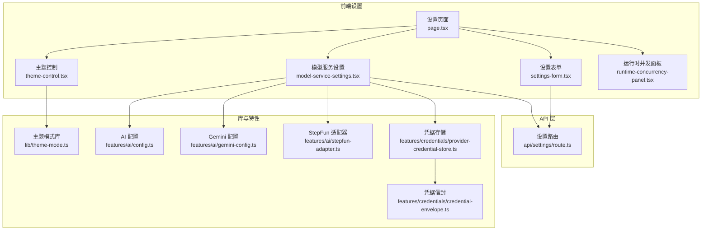

**图表来源** 
- [src/app/(products)/settings/page.tsx](file://src/app/(products)/settings/page.tsx)
- [src/app/(products)/settings/settings-form.tsx](file://src/app/(products)/settings/settings-form.tsx)
- [src/app/(products)/settings/theme-control.tsx](file://src/app/(products)/settings/theme-control.tsx)
- [src/app/(products)/settings/model-service-settings.tsx](file://src/app/(products)/settings/model-service-settings.tsx)
- [src/app/(products)/settings/runtime-concurrency-panel.tsx](file://src/app/(products)/settings/runtime-concurrency-panel.tsx)
- [src/app/api/settings/route.ts](file://src/app/api/settings/route.ts)
- [src/lib/theme-mode.ts](file://src/lib/theme-mode.ts)
- [src/features/ai/config.ts](file://src/features/ai/config.ts)
- [src/features/ai/gemini-config.ts](file://src/features/ai/gemini-config.ts)
- [src/features/ai/stepfun-adapter.ts](file://src/features/ai/stepfun-adapter.ts)
- [src/features/credentials/provider-credential-store.ts](file://src/features/credentials/provider-credential-store.ts)
- [src/features/credentials/credential-envelope.ts](file://src/features/credentials/credential-envelope.ts)

**章节来源**
- [src/app/(products)/settings/page.tsx](file://src/app/(products)/settings/page.tsx)
- [src/app/api/settings/route.ts](file://src/app/api/settings/route.ts)
- [src/lib/theme-mode.ts](file://src/lib/theme-mode.ts)

## 核心组件
- 设置页面与表单：负责聚合各设置区块，处理表单校验、提交与错误提示。
- 主题控制：提供明/暗主题切换，联动系统偏好与本地持久化。
- 模型服务设置：管理 AI 模型服务的配置项（如提供商、密钥、并发策略）。
- 运行时并发面板：调整渲染/导出等运行时的并发度与队列行为。
- 设置 API：统一暴露 GET/POST 接口，完成设置的读取与保存。
- 主题模式库：封装主题模式的获取与设置逻辑。
- AI 配置与适配器：定义配置结构与校验规则，封装第三方调用细节。
- 凭据存储与信封：安全存储与传输凭据，屏蔽底层差异。

**章节来源**
- [src/app/(products)/settings/settings-form.tsx](file://src/app/(products)/settings/settings-form.tsx)
- [src/app/(products)/settings/theme-control.tsx](file://src/app/(products)/settings/theme-control.tsx)
- [src/app/(products)/settings/model-service-settings.tsx](file://src/app/(products)/settings/model-service-settings.tsx)
- [src/app/(products)/settings/runtime-concurrency-panel.tsx](file://src/app/(products)/settings/runtime-concurrency-panel.tsx)
- [src/app/api/settings/route.ts](file://src/app/api/settings/route.ts)
- [src/lib/theme-mode.ts](file://src/lib/theme-mode.ts)
- [src/features/ai/config.ts](file://src/features/ai/config.ts)
- [src/features/ai/gemini-config.ts](file://src/features/ai/gemini-config.ts)
- [src/features/ai/stepfun-adapter.ts](file://src/features/ai/stepfun-adapter.ts)
- [src/features/credentials/provider-credential-store.ts](file://src/features/credentials/provider-credential-store.ts)
- [src/features/credentials/credential-envelope.ts](file://src/features/credentials/credential-envelope.ts)

## 架构总览
设置系统的整体交互流程如下：用户在设置页面操作表单或主题控件，触发前端状态更新并通过 API 路由持久化到后端存储；主题模式通过主题库在客户端侧即时生效；AI 配置与凭据由特性模块统一管理，确保安全性与可扩展性。

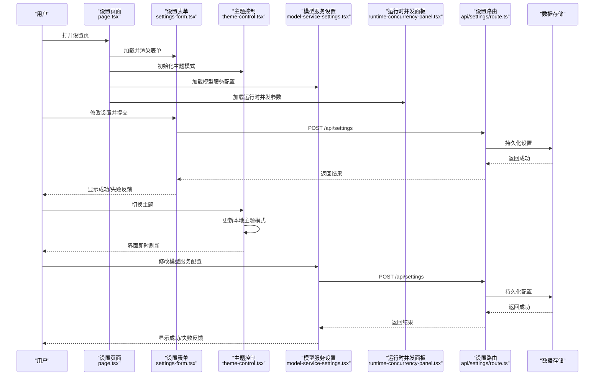

**图表来源** 
- [src/app/(products)/settings/page.tsx](file://src/app/(products)/settings/page.tsx)
- [src/app/(products)/settings/settings-form.tsx](file://src/app/(products)/settings/settings-form.tsx)
- [src/app/(products)/settings/theme-control.tsx](file://src/app/(products)/settings/theme-control.tsx)
- [src/app/(products)/settings/model-service-settings.tsx](file://src/app/(products)/settings/model-service-settings.tsx)
- [src/app/(products)/settings/runtime-concurrency-panel.tsx](file://src/app/(products)/settings/runtime-concurrency-panel.tsx)
- [src/app/api/settings/route.ts](file://src/app/api/settings/route.ts)

## 详细组件分析

### 设置页面与表单
- 职责：聚合设置区块，管理表单状态、校验与提交；处理错误提示与成功反馈。
- 数据流：从 API 拉取当前设置，填充表单；提交时进行字段校验，再调用 API 保存。
- 扩展点：新增设置项可通过新增表单行与校验规则快速接入。

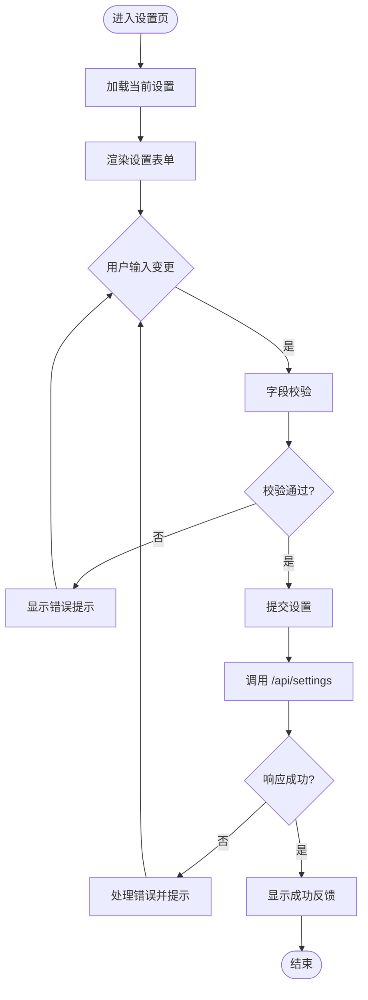

**图表来源** 
- [src/app/(products)/settings/settings-form.tsx](file://src/app/(products)/settings/settings-form.tsx)
- [src/app/api/settings/route.ts](file://src/app/api/settings/route.ts)

**章节来源**
- [src/app/(products)/settings/settings-form.tsx](file://src/app/(products)/settings/settings-form.tsx)
- [src/app/api/settings/route.ts](file://src/app/api/settings/route.ts)

### 主题控制与模式库
- 职责：提供主题切换 UI，维护主题模式状态，并与本地存储同步。
- 模式库：封装主题模式的读取与写入，支持系统偏好检测与回退策略。
- 交互：切换主题后即时生效，无需刷新页面。

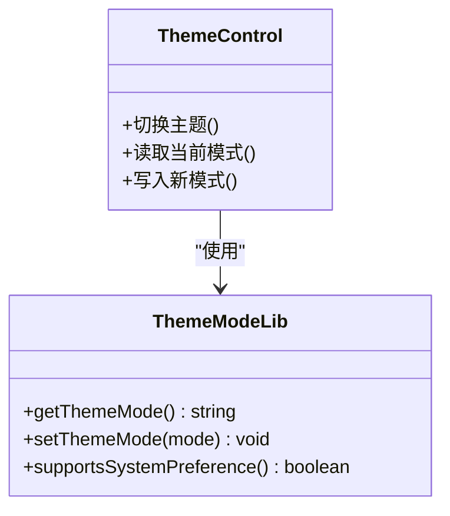

**图表来源** 
- [src/app/(products)/settings/theme-control.tsx](file://src/app/(products)/settings/theme-control.tsx)
- [src/lib/theme-mode.ts](file://src/lib/theme-mode.ts)

**章节来源**
- [src/app/(products)/settings/theme-control.tsx](file://src/app/(products)/settings/theme-control.tsx)
- [src/lib/theme-mode.ts](file://src/lib/theme-mode.ts)

### 模型服务设置与 AI 配置
- 职责：管理 AI 模型服务的配置项（提供商、密钥、并发策略），并提供校验与保存。
- 配置结构：定义配置类型与默认值，结合校验规则保证数据一致性。
- 适配器：封装第三方调用细节，便于替换与扩展。

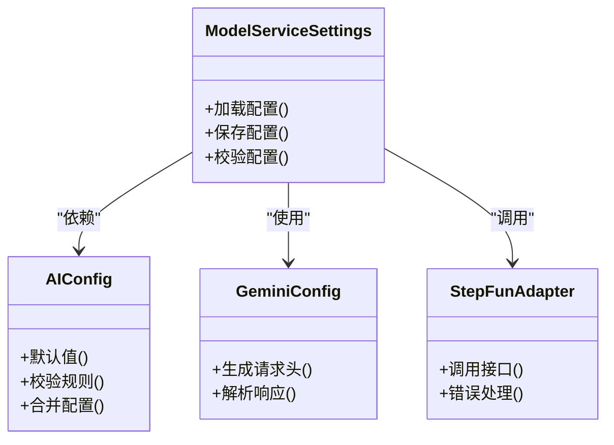

**图表来源** 
- [src/app/(products)/settings/model-service-settings.tsx](file://src/app/(products)/settings/model-service-settings.tsx)
- [src/features/ai/config.ts](file://src/features/ai/config.ts)
- [src/features/ai/gemini-config.ts](file://src/features/ai/gemini-config.ts)
- [src/features/ai/stepfun-adapter.ts](file://src/features/ai/stepfun-adapter.ts)

**章节来源**
- [src/app/(products)/settings/model-service-settings.tsx](file://src/app/(products)/settings/model-service-settings.tsx)
- [src/features/ai/config.ts](file://src/features/ai/config.ts)
- [src/features/ai/gemini-config.ts](file://src/features/ai/gemini-config.ts)
- [src/features/ai/stepfun-adapter.ts](file://src/features/ai/stepfun-adapter.ts)

### 运行时并发面板
- 职责：调整渲染/导出等运行时的并发度与队列行为，影响系统吞吐与资源占用。
- 交互：修改并发参数后立即生效或通过 API 持久化。
- 注意事项：过高并发可能导致资源竞争，需结合环境容量调优。

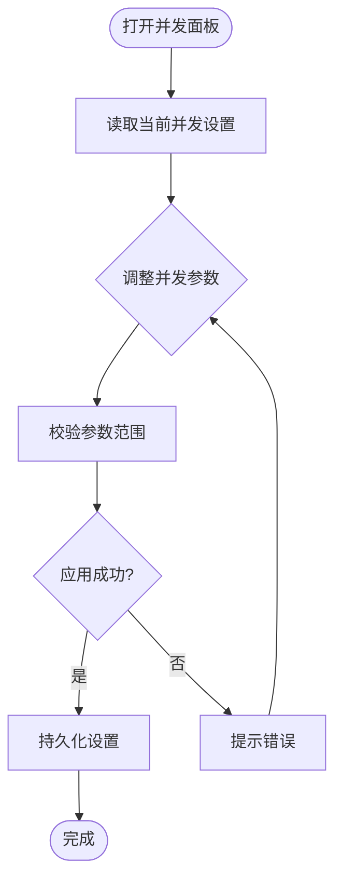

**图表来源** 
- [src/app/(products)/settings/runtime-concurrency-panel.tsx](file://src/app/(products)/settings/runtime-concurrency-panel.tsx)
- [src/app/api/settings/route.ts](file://src/app/api/settings/route.ts)

**章节来源**
- [src/app/(products)/settings/runtime-concurrency-panel.tsx](file://src/app/(products)/settings/runtime-concurrency-panel.tsx)
- [src/app/api/settings/route.ts](file://src/app/api/settings/route.ts)

### 设置 API 路由
- 职责：统一暴露设置读取与保存接口，处理权限校验、参数校验与错误响应。
- 数据流：接收前端请求，校验并写入存储，返回标准化响应。
- 扩展点：新增设置项需在路由中增加对应字段处理逻辑。

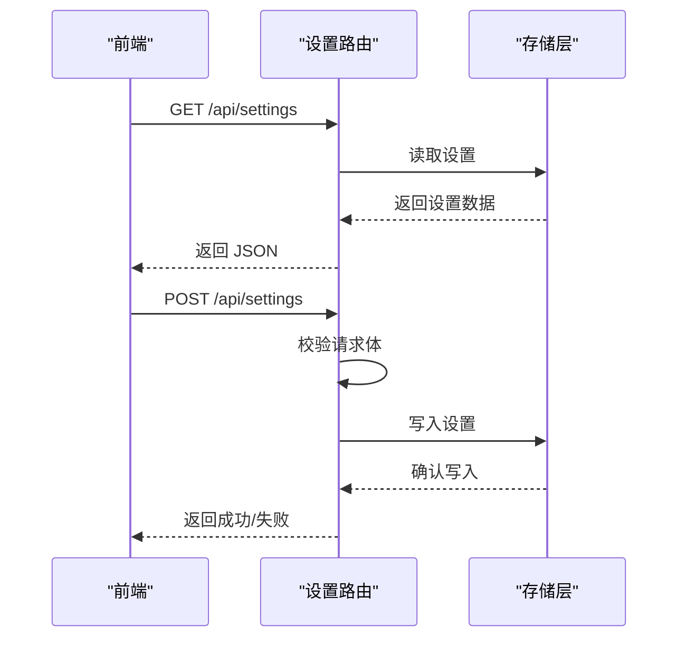

**图表来源** 
- [src/app/api/settings/route.ts](file://src/app/api/settings/route.ts)

**章节来源**
- [src/app/api/settings/route.ts](file://src/app/api/settings/route.ts)

### 凭据存储与信封
- 职责：安全存储与传输凭据，屏蔽不同提供商的差异。
- 设计：通过信封封装敏感信息，配合存储层实现加密或隔离。
- 使用：模型服务设置模块在调用适配器前，先获取并解密凭据。

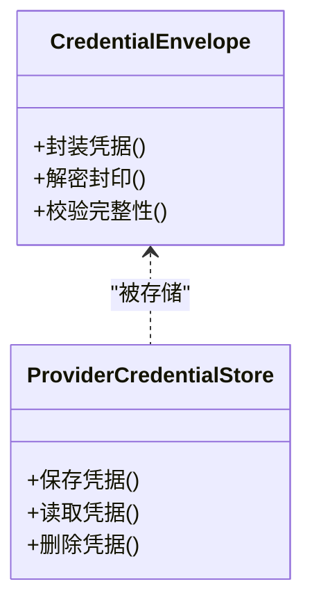

**图表来源** 
- [src/features/credentials/credential-envelope.ts](file://src/features/credentials/credential-envelope.ts)
- [src/features/credentials/provider-credential-store.ts](file://src/features/credentials/provider-credential-store.ts)

**章节来源**
- [src/features/credentials/credential-envelope.ts](file://src/features/credentials/credential-envelope.ts)
- [src/features/credentials/provider-credential-store.ts](file://src/features/credentials/provider-credential-store.ts)

### 设置 UI 基础组件
- 职责：提供设置分组、面板、行等通用 UI，提升一致性与可维护性。
- 使用：在各设置区块中复用，减少重复代码。

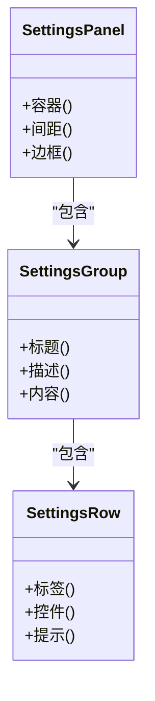

**图表来源** 
- [src/components/ui/settings-group.tsx](file://src/components/ui/settings-group.tsx)
- [src/components/ui/settings-panel.tsx](file://src/components/ui/settings-panel.tsx)
- [src/components/ui/settings-row.tsx](file://src/components/ui/settings-row.tsx)

**章节来源**
- [src/components/ui/settings-group.tsx](file://src/components/ui/settings-group.tsx)
- [src/components/ui/settings-panel.tsx](file://src/components/ui/settings-panel.tsx)
- [src/components/ui/settings-row.tsx](file://src/components/ui/settings-row.tsx)

## 依赖关系分析
设置系统的关键依赖包括：
- 前端页面依赖表单、主题控制、模型服务设置与并发面板。
- 表单与模型服务设置依赖设置 API 路由。
- 主题控制依赖主题模式库。
- 模型服务设置依赖 AI 配置、适配器与凭据存储。
- 凭据存储依赖凭据信封。

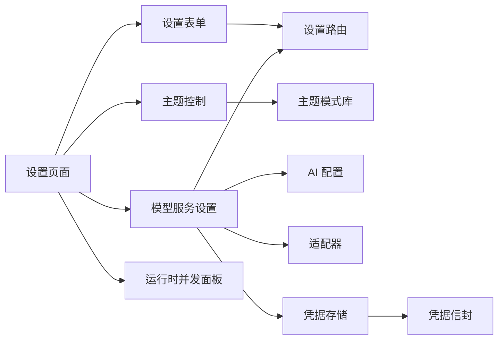

**图表来源** 
- [src/app/(products)/settings/page.tsx](file://src/app/(products)/settings/page.tsx)
- [src/app/(products)/settings/settings-form.tsx](file://src/app/(products)/settings/settings-form.tsx)
- [src/app/(products)/settings/theme-control.tsx](file://src/app/(products)/settings/theme-control.tsx)
- [src/app/(products)/settings/model-service-settings.tsx](file://src/app/(products)/settings/model-service-settings.tsx)
- [src/app/(products)/settings/runtime-concurrency-panel.tsx](file://src/app/(products)/settings/runtime-concurrency-panel.tsx)
- [src/app/api/settings/route.ts](file://src/app/api/settings/route.ts)
- [src/lib/theme-mode.ts](file://src/lib/theme-mode.ts)
- [src/features/ai/config.ts](file://src/features/ai/config.ts)
- [src/features/ai/stepfun-adapter.ts](file://src/features/ai/stepfun-adapter.ts)
- [src/features/credentials/provider-credential-store.ts](file://src/features/credentials/provider-credential-store.ts)
- [src/features/credentials/credential-envelope.ts](file://src/features/credentials/credential-envelope.ts)

**章节来源**
- [src/app/(products)/settings/page.tsx](file://src/app/(products)/settings/page.tsx)
- [src/app/api/settings/route.ts](file://src/app/api/settings/route.ts)

## 性能考虑
- 表单提交去抖：对频繁输入进行去抖，减少不必要的 API 调用。
- 主题切换无刷新：通过本地状态与样式类切换，避免重绘开销。
- 并发参数调优：根据服务器资源与任务负载合理设置并发度，避免过载。
- 缓存策略：对只读设置项采用前端缓存，降低重复请求。
- 批量更新：合并多次设置变更为一次提交，减少网络往返。

[本节为通用指导，不直接分析具体文件]

## 故障排查指南
- 设置保存失败：检查 API 路由的请求体校验与错误响应；查看存储层是否可用。
- 主题未生效：确认主题模式库是否正确写入本地存储；检查样式类是否应用。
- 模型服务调用异常：核对凭据信封的完整性与解密逻辑；查看适配器错误处理。
- 并发导致资源紧张：降低并发参数，观察系统指标变化。

**章节来源**
- [src/app/api/settings/route.ts](file://src/app/api/settings/route.ts)
- [src/lib/theme-mode.ts](file://src/lib/theme-mode.ts)
- [src/features/credentials/credential-envelope.ts](file://src/features/credentials/credential-envelope.ts)
- [src/features/ai/stepfun-adapter.ts](file://src/features/ai/stepfun-adapter.ts)

## 结论
PurpleInK 的设置管理系统以模块化与可扩展为核心，通过清晰的前端页面、统一的 API 路由与特性模块协作，实现了用户偏好配置、主题切换与界面定制等功能。凭据与 AI 配置的分离设计提升了安全性与可维护性。建议在后续迭代中加强设置验证、默认值管理与批量更新能力，完善导入导出与迁移工具，以提升用户体验与运维效率。

[本节为总结，不直接分析具体文件]

## 附录

### 设置数据模型与存储结构
- 设置键空间：按功能域划分（主题、模型服务、运行时、国际化等）。
- 数据类型：字符串、布尔、数字、对象与数组，需定义默认值与校验规则。
- 存储位置：前端本地存储（主题模式）、后端数据库（用户设置、凭据）。

[本节为概念性说明，不直接分析具体文件]

### 同步机制与版本兼容性
- 同步策略：前端优先展示最新本地状态，后台异步同步至服务端。
- 版本兼容：设置项增加版本号，迁移脚本按需升级旧格式。
- 冲突解决：以服务端为准，前端增量合并变更。

[本节为概念性说明，不直接分析具体文件]

### 国际化支持与本地化配置
- 语言包管理：按模块拆分翻译文件，动态加载。
- 语言切换：通过设置项切换语言，立即生效。
- 本地化格式：日期、时间、数字与货币遵循区域设置。

[本节为概念性说明，不直接分析具体文件]

### 工作区设置与项目模板
- 工作区设置：默认字体、字号、画布尺寸、导出格式等。
- 项目模板：预设项目结构与节点模板，加速创建流程。
- 个性化选项：快捷键映射、颜色主题、侧边栏布局。

[本节为概念性说明，不直接分析具体文件]

### 设置验证、默认值管理与批量更新
- 验证规则：必填、格式、范围与依赖关系校验。
- 默认值：按环境与应用场景提供合理默认值。
- 批量更新：支持一次性更新多个设置项，事务性提交。

[本节为概念性说明，不直接分析具体文件]

### 设置导入导出、备份恢复与迁移工具
- 导入导出：支持 JSON/YAML 格式，包含设置元数据与版本信息。
- 备份恢复：定期备份设置数据，支持一键恢复。
- 迁移工具：数据库迁移脚本与数据转换工具。

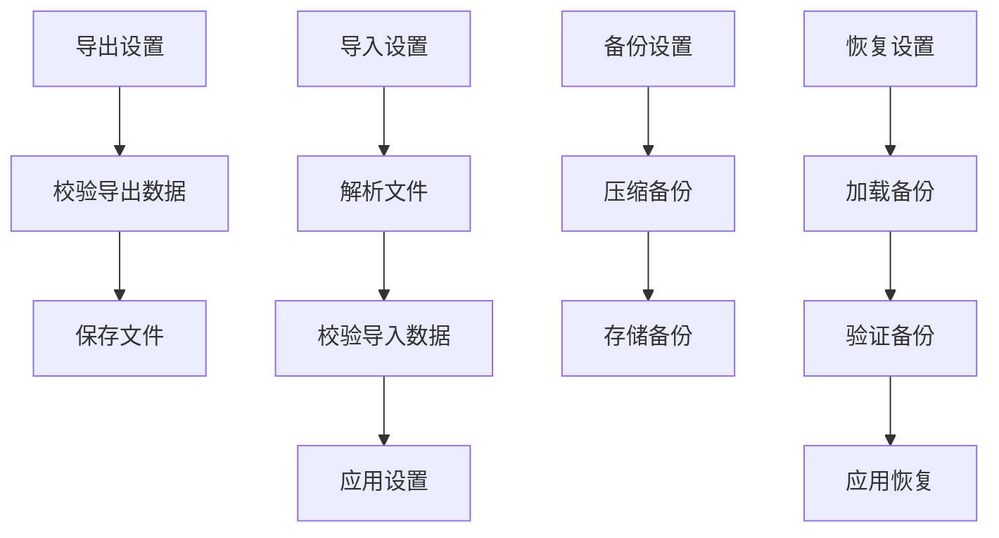

**图表来源** 
- [scripts/migration/export-sqlite.ts](file://scripts/migration/export-sqlite.ts)
- [scripts/migration/import-postgres.ts](file://scripts/migration/import-postgres.ts)
- [scripts/migration/sqlite-backup.ts](file://scripts/migration/sqlite-backup.ts)
- [scripts/setup/db-migrate.ts](file://scripts/setup/db-migrate.ts)

**章节来源**
- [scripts/migration/export-sqlite.ts](file://scripts/migration/export-sqlite.ts)
- [scripts/migration/import-postgres.ts](file://scripts/migration/import-postgres.ts)
- [scripts/migration/sqlite-backup.ts](file://scripts/migration/sqlite-backup.ts)
- [scripts/setup/db-migrate.ts](file://scripts/setup/db-migrate.ts)