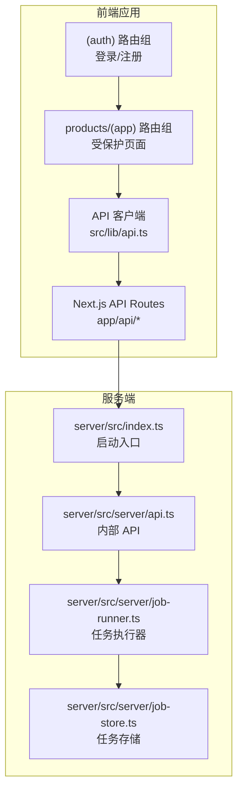
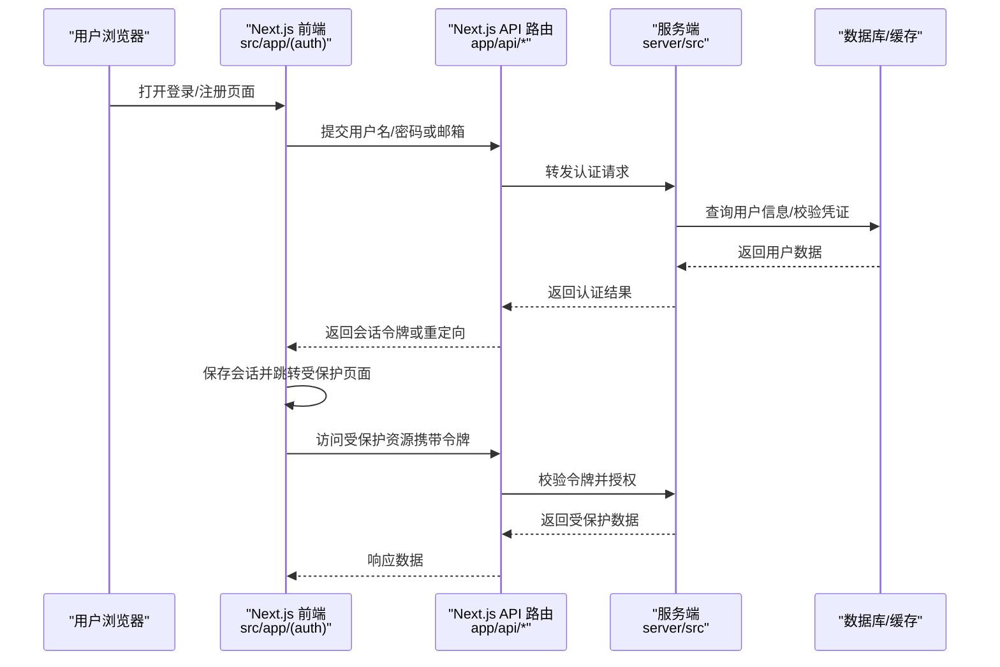
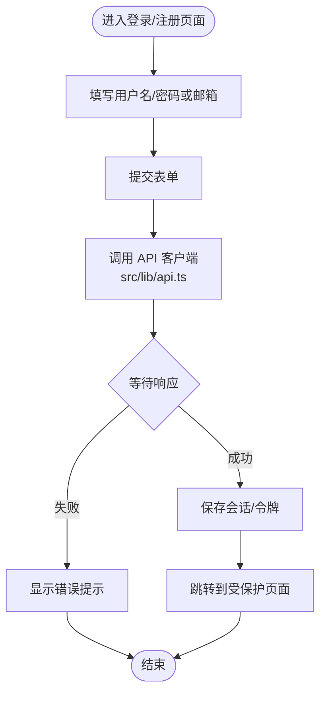
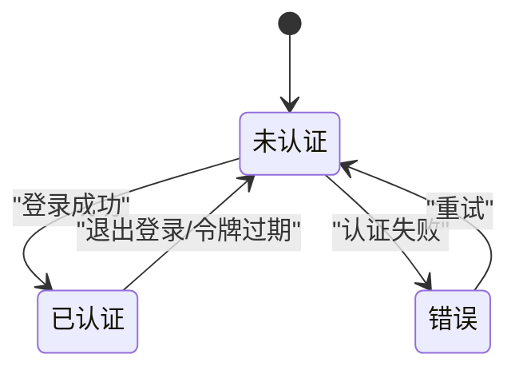
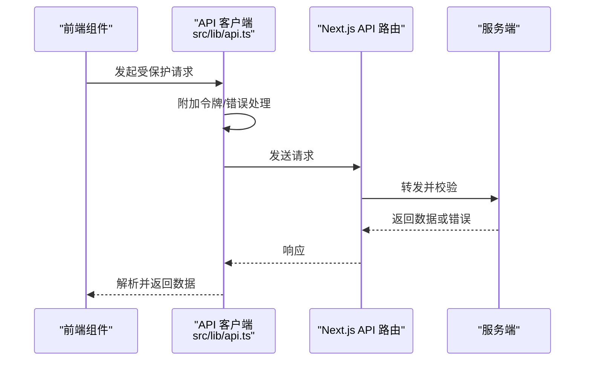
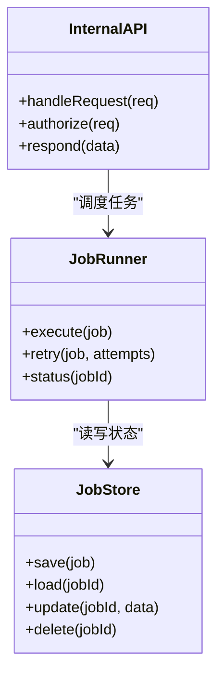
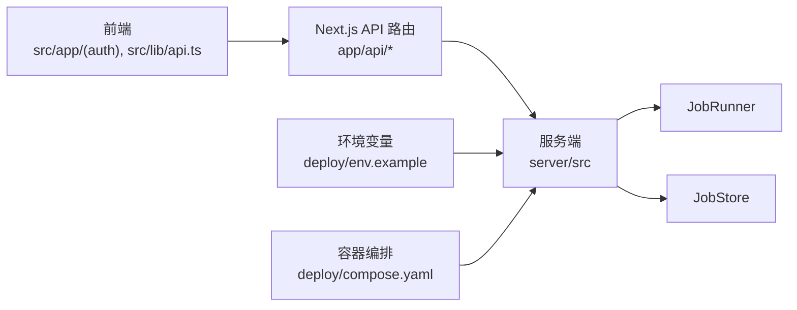

# 认证系统

<cite>
**本文引用的文件**   
- [src/app/(auth)/layout.tsx](file://src/app/(auth)/layout.tsx)
- [src/app/(auth)/login/page.tsx](file://src/app/(auth)/login/page.tsx)
- [src/app/(auth)/signup/page.tsx](file://src/app/(auth)/signup/page.tsx)
- [src/app/(auth)/_components/auth-shell-form.tsx](file://src/app/(auth)/_components/auth-shell-form.tsx)
- [src/app/api/settings/route.ts](file://src/app/api/settings/route.ts)
- [src/app/api/projects/route.ts](file://src/app/api/projects/route.ts)
- [src/app/api/artifacts/[id]/route.ts](file://src/app/api/artifacts/[id]/route.ts)
- [src/app/api/render/route.ts](file://src/app/api/render/route.ts)
- [src/app/api/director/pipeline/route.ts](file://src/app/api/director/pipeline/route.ts)
- [src/app/api/jobs/[id]/route.ts](file://src/app/api/jobs/[id]/route.ts)
- [src/app/api/render/export/route.ts](file://src/app/api/render/export/route.ts)
- [src/app/api/render/thumbnails/route.ts](file://src/app/api/render/thumbnails/route.ts)
- [src/app/api/director/stream/[nodeId]/route.ts](file://src/app/api/director/stream/[nodeId]/route.ts)
- [src/app/api/director/stream/project/[projectId]/route.ts](file://src/app/api/director/stream/project/[projectId]/route.ts)
- [src/app/products/(app)/layout.tsx](file://src/app/products/(app)/layout.tsx)
- [src/app/products/(app)/template.tsx](file://src/app/products/(app)/template.tsx)
- [src/app/products/(app)/loading.tsx](file://src/app/products/(app)/loading.tsx)
- [src/app/products/(app)/not-found.tsx](file://src/app/products/(app)/not-found.tsx)
- [src/app/products/(app)/error.tsx](file://src/app/products/(app)/error.tsx)
- [src/app/providers.tsx](file://src/app/providers.tsx)
- [src/lib/api.ts](file://src/lib/api.ts)
- [server/src/index.ts](file://server/src/index.ts)
- [server/src/server/api.ts](file://server/src/server/api.ts)
- [server/src/server/job-runner.ts](file://server/src/server/job-runner.ts)
- [server/src/server/job-store.ts](file://server/src/server/job-store.ts)
- [deploy/env.example](file://deploy/env.example)
- [deploy/compose.yaml](file://deploy/compose.yaml)
</cite>

## 目录
1. [简介](#简介)
2. [项目结构](#项目结构)
3. [核心组件](#核心组件)
4. [架构总览](#架构总览)
5. [详细组件分析](#详细组件分析)
6. [依赖关系分析](#依赖关系分析)
7. [性能考量](#性能考量)
8. [故障排查指南](#故障排查指南)
9. [结论](#结论)
10. [附录](#附录)

## 简介
本技术文档围绕 PurpleInk 的认证与安全体系展开，聚焦以下目标：
- 用户登录与注册流程
- 会话管理与持久化
- JWT 令牌生成与验证（如实现）
- 密码加密存储策略（如实现）
- 邮箱验证与验证码机制（如实现）
- 防暴力破解措施（如实现）
- 第三方登录集成、OAuth 与单点登录（如实现）
- 认证中间件、请求拦截与用户状态管理
- 安全最佳实践、CSRF 防护与 XSS 防护

说明：当前仓库未包含显式的认证/鉴权后端实现（如独立的 auth 服务或路由），也未发现 JWT、密码哈希、验证码、OAuth 等具体代码。因此，本文以“现状分析 + 推荐设计”的方式呈现，所有建议均标注为概念性设计，便于后续落地实施。

## 项目结构
从 Next.js App Router 的角度看，认证相关的前端入口集中在 (auth) 路由组内，业务页面位于 products/(app) 路由组；API 路由分布在 app/api 下，用于与后端交互。服务端代码位于 server/src，负责渲染、任务执行与外部服务调用。

图表来源
- [src/app/(auth)/layout.tsx](file://src/app/(auth)/layout.tsx)
- [src/app/products/(app)/layout.tsx](file://src/app/products/(app)/layout.tsx)
- [src/lib/api.ts](file://src/lib/api.ts)
- [server/src/index.ts](file://server/src/index.ts)
- [server/src/server/api.ts](file://server/src/server/api.ts)
- [server/src/server/job-runner.ts](file://server/src/server/job-runner.ts)
- [server/src/server/job-store.ts](file://server/src/server/job-store.ts)

章节来源
- [src/app/(auth)/layout.tsx](file://src/app/(auth)/layout.tsx)
- [src/app/products/(app)/layout.tsx](file://src/app/products/(app)/layout.tsx)
- [src/lib/api.ts](file://src/lib/api.ts)
- [server/src/index.ts](file://server/src/index.ts)

## 核心组件
- 认证页面组件
  - 登录页：[src/app/(auth)/login/page.tsx](file://src/app/(auth)/login/page.tsx)
  - 注册页：[src/app/(auth)/signup/page.tsx](file://src/app/(auth)/signup/page.tsx)
  - 认证壳表单：[src/app/(auth)/_components/auth-shell-form.tsx](file://src/app/(auth)/_components/auth-shell-form.tsx)
  - 认证布局：[src/app/(auth)/layout.tsx](file://src/app/(auth)/layout.tsx)
- 受保护页面与模板
  - 产品应用布局：[src/app/products/(app)/layout.tsx](file://src/app/products/(app)/layout.tsx)
  - 模板与加载/错误处理：[src/app/products/(app)/template.tsx](file://src/app/products/(app)/template.tsx)、[src/app/products/(app)/loading.tsx](file://src/app/products/(app)/loading.tsx)、[src/app/products/(app)/not-found.tsx](file://src/app/products/(app)/not-found.tsx)、[src/app/products/(app)/error.tsx](file://src/app/products/(app)/error.tsx)
- API 客户端与服务端
  - 统一 API 客户端：[src/lib/api.ts](file://src/lib/api.ts)
  - 服务端入口与内部 API：[server/src/index.ts](file://server/src/index.ts)、[server/src/server/api.ts](file://server/src/server/api.ts)
  - 任务执行与存储：[server/src/server/job-runner.ts](file://server/src/server/job-runner.ts)、[server/src/server/job-store.ts](file://server/src/server/job-store.ts)

章节来源
- [src/app/(auth)/login/page.tsx](file://src/app/(auth)/login/page.tsx)
- [src/app/(auth)/signup/page.tsx](file://src/app/(auth)/signup/page.tsx)
- [src/app/(auth)/_components/auth-shell-form.tsx](file://src/app/(auth)/_components/auth-shell-form.tsx)
- [src/app/(auth)/layout.tsx](file://src/app/(auth)/layout.tsx)
- [src/app/products/(app)/layout.tsx](file://src/app/products/(app)/layout.tsx)
- [src/app/products/(app)/template.tsx](file://src/app/products/(app)/template.tsx)
- [src/app/products/(app)/loading.tsx](file://src/app/products/(app)/loading.tsx)
- [src/app/products/(app)/not-found.tsx](file://src/app/products/(app)/not-found.tsx)
- [src/app/products/(app)/error.tsx](file://src/app/products/(app)/error.tsx)
- [src/lib/api.ts](file://src/lib/api.ts)
- [server/src/index.ts](file://server/src/index.ts)
- [server/src/server/api.ts](file://server/src/server/api.ts)
- [server/src/server/job-runner.ts](file://server/src/server/job-runner.ts)
- [server/src/server/job-store.ts](file://server/src/server/job-store.ts)

## 架构总览
当前仓库未包含显式认证后端。认证流程通常由前端发起登录/注册请求至 Next.js API 路由，再由服务端调用内部 API 完成身份校验与令牌签发。受保护页面通过布局或模板进行访问控制。

图表来源
- [src/app/(auth)/layout.tsx](file://src/app/(auth)/layout.tsx)
- [src/app/(auth)/login/page.tsx](file://src/app/(auth)/login/page.tsx)
- [src/app/(auth)/signup/page.tsx](file://src/app/(auth)/signup/page.tsx)
- [src/app/api/settings/route.ts](file://src/app/api/settings/route.ts)
- [server/src/index.ts](file://server/src/index.ts)
- [server/src/server/api.ts](file://server/src/server/api.ts)

## 详细组件分析

### 登录与注册流程（前端）
- 登录页与注册页分别提供表单输入与提交逻辑，使用统一的认证壳表单组件封装通用行为。
- 认证布局提供统一的 UI 外壳与导航上下文。
- 提交后通过 API 客户端发送请求，等待服务端返回认证结果。

图表来源
- [src/app/(auth)/login/page.tsx](file://src/app/(auth)/login/page.tsx)
- [src/app/(auth)/signup/page.tsx](file://src/app/(auth)/signup/page.tsx)
- [src/app/(auth)/_components/auth-shell-form.tsx](file://src/app/(auth)/_components/auth-shell-form.tsx)
- [src/lib/api.ts](file://src/lib/api.ts)

章节来源
- [src/app/(auth)/login/page.tsx](file://src/app/(auth)/login/page.tsx)
- [src/app/(auth)/signup/page.tsx](file://src/app/(auth)/signup/page.tsx)
- [src/app/(auth)/_components/auth-shell-form.tsx](file://src/app/(auth)/_components/auth-shell-form.tsx)
- [src/lib/api.ts](file://src/lib/api.ts)

### 受保护页面与访问控制
- 产品应用布局与模板负责在页面级进行访问控制，结合加载与错误处理组件提升用户体验。
- 若未认证，应重定向到登录页；若认证失败，展示错误页面。

图表来源
- [src/app/products/(app)/layout.tsx](file://src/app/products/(app)/layout.tsx)
- [src/app/products/(app)/template.tsx](file://src/app/products/(app)/template.tsx)
- [src/app/products/(app)/loading.tsx](file://src/app/products/(app)/loading.tsx)
- [src/app/products/(app)/not-found.tsx](file://src/app/products/(app)/not-found.tsx)
- [src/app/products/(app)/error.tsx](file://src/app/products/(app)/error.tsx)

章节来源
- [src/app/products/(app)/layout.tsx](file://src/app/products/(app)/layout.tsx)
- [src/app/products/(app)/template.tsx](file://src/app/products/(app)/template.tsx)
- [src/app/products/(app)/loading.tsx](file://src/app/products/(app)/loading.tsx)
- [src/app/products/(app)/not-found.tsx](file://src/app/products/(app)/not-found.tsx)
- [src/app/products/(app)/error.tsx](file://src/app/products/(app)/error.tsx)

### API 客户端与请求拦截
- 统一 API 客户端集中管理请求头、错误处理与重试策略。
- 建议在客户端层添加拦截器，自动附加会话令牌并在 401 时触发重新登录或刷新令牌。

图表来源
- [src/lib/api.ts](file://src/lib/api.ts)
- [src/app/api/settings/route.ts](file://src/app/api/settings/route.ts)
- [server/src/server/api.ts](file://server/src/server/api.ts)

章节来源
- [src/lib/api.ts](file://src/lib/api.ts)
- [src/app/api/settings/route.ts](file://src/app/api/settings/route.ts)
- [server/src/server/api.ts](file://server/src/server/api.ts)

### 服务端任务与存储
- 服务端负责渲染、任务调度与持久化，认证通过后，受保护资源由服务端校验并返回。
- 任务执行器与存储模块确保幂等性与一致性。

图表来源
- [server/src/server/job-runner.ts](file://server/src/server/job-runner.ts)
- [server/src/server/job-store.ts](file://server/src/server/job-store.ts)
- [server/src/server/api.ts](file://server/src/server/api.ts)

章节来源
- [server/src/server/job-runner.ts](file://server/src/server/job-runner.ts)
- [server/src/server/job-store.ts](file://server/src/server/job-store.ts)
- [server/src/server/api.ts](file://server/src/server/api.ts)

## 依赖关系分析
- 前端依赖 Next.js 路由与 API 客户端，服务端依赖内部 API、任务执行器与存储。
- 部署配置与环境变量影响认证与服务的运行参数。

图表来源
- [src/lib/api.ts](file://src/lib/api.ts)
- [src/app/(auth)/layout.tsx](file://src/app/(auth)/layout.tsx)
- [server/src/index.ts](file://server/src/index.ts)
- [server/src/server/job-runner.ts](file://server/src/server/job-runner.ts)
- [server/src/server/job-store.ts](file://server/src/server/job-store.ts)
- [deploy/env.example](file://deploy/env.example)
- [deploy/compose.yaml](file://deploy/compose.yaml)

章节来源
- [src/lib/api.ts](file://src/lib/api.ts)
- [server/src/index.ts](file://server/src/index.ts)
- [deploy/env.example](file://deploy/env.example)
- [deploy/compose.yaml](file://deploy/compose.yaml)

## 性能考量
- 减少不必要的认证检查：在 API 路由层集中校验，避免重复计算。
- 令牌刷新策略：短生命周期访问令牌配合刷新令牌降低安全风险与网络开销。
- 缓存与幂等：对只读接口启用缓存，对写操作保证幂等，避免重复执行。
- 连接池与超时：合理设置数据库与外部服务连接池大小与超时时间。

## 故障排查指南
- 登录失败：检查表单输入校验、API 路由响应码与服务端日志。
- 令牌无效：确认客户端是否正确附加令牌，服务端是否校验签名与过期时间。
- 受保护页面无法访问：检查布局与模板中的访问控制逻辑与重定向路径。
- 任务执行失败：查看任务执行器与存储的状态，定位异常堆栈与重试次数。

章节来源
- [src/app/(auth)/login/page.tsx](file://src/app/(auth)/login/page.tsx)
- [src/app/(auth)/signup/page.tsx](file://src/app/(auth)/signup/page.tsx)
- [src/app/products/(app)/error.tsx](file://src/app/products/(app)/error.tsx)
- [server/src/server/job-runner.ts](file://server/src/server/job-runner.ts)
- [server/src/server/job-store.ts](file://server/src/server/job-store.ts)

## 结论
当前仓库未包含显式的认证与鉴权实现。建议尽快引入标准化的认证后端与中间件，完善 JWT 签发与校验、密码哈希存储、会话持久化、邮箱验证与验证码、防暴力破解、第三方登录与单点登录等能力，并通过统一的 API 客户端与服务端拦截器保障安全性与可维护性。

## 附录

### 安全最佳实践（概念性设计）
- 密码存储：使用强哈希算法（如 bcrypt/argon2）加盐存储，禁止明文或弱哈希。
- JWT 策略：短生命周期访问令牌 + 刷新令牌；服务端校验签名、受众与过期时间；敏感操作二次确认。
- 会话管理：服务端会话存储（Redis/数据库）与客户端 HttpOnly Cookie；支持撤销与黑名单。
- 邮箱验证：发送一次性链接或验证码，限制频率与有效期。
- 验证码：人机校验（如 CAPTCHA/无感验证），防止自动化攻击。
- 防暴力破解：账户锁定、速率限制、IP 封禁、异常检测。
- CSRF 防护：SameSite Cookie、双重提交 Token、CORS 白名单。
- XSS 防护：输出编码、内容安全策略（CSP）、输入校验与过滤。
- 第三方登录：OAuth 2.0/OpenID Connect，严格回调域名与状态参数校验。
- 审计与监控：记录认证事件、异常告警与日志聚合。

### 认证中间件与请求拦截（概念性设计）
- 前端拦截器：自动附加令牌、处理 401/403、刷新令牌与重定向。
- 服务端中间件：统一鉴权、权限校验、速率限制与审计日志。
- 路由守卫：页面级与组件级访问控制，结合加载与错误处理。

### 环境变量与部署（参考）
- 环境变量：密钥、数据库连接、邮件服务、第三方 OAuth 配置。
- 容器编排：服务拆分、健康检查、滚动更新与回滚策略。

章节来源
- [deploy/env.example](file://deploy/env.example)
- [deploy/compose.yaml](file://deploy/compose.yaml)