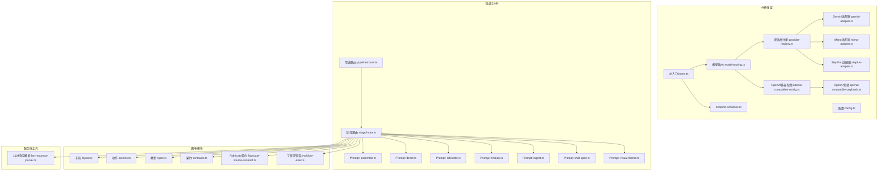
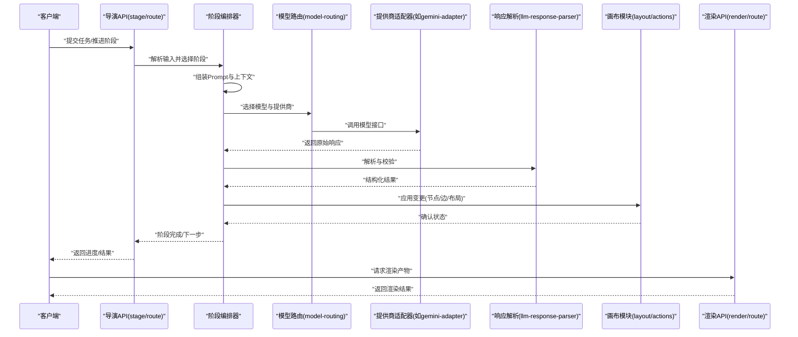
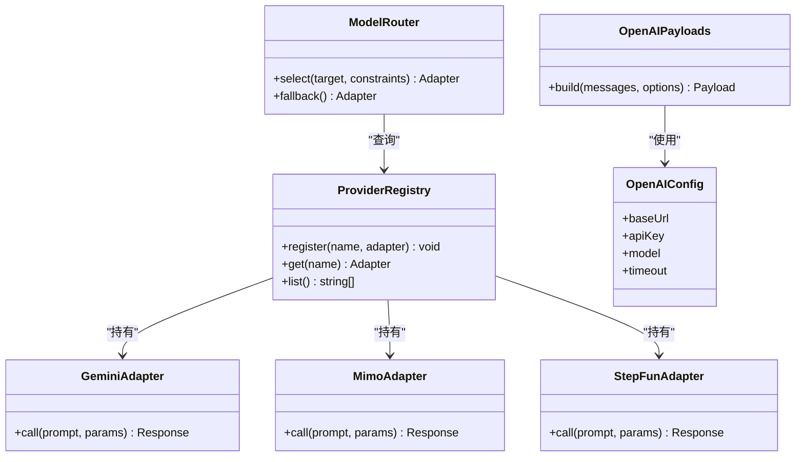
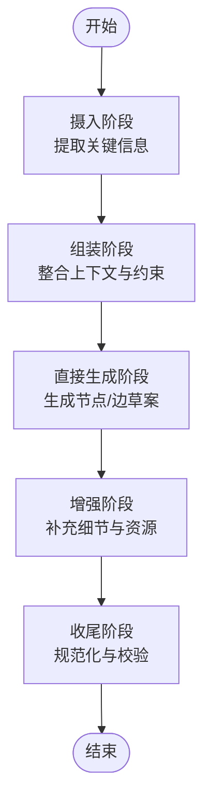
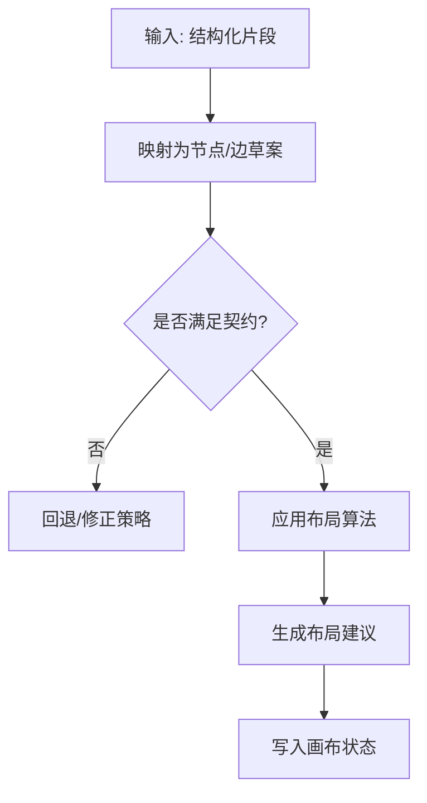
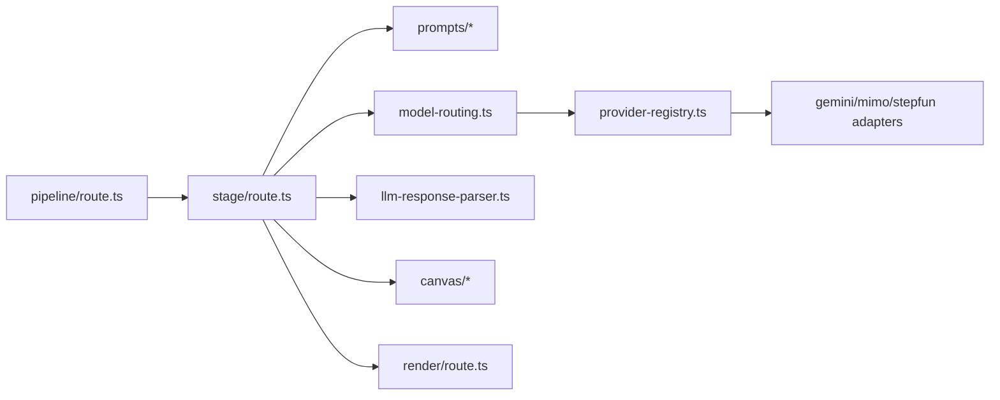

# AI集成

<cite>
**本文引用的文件**   
- [src/features/ai/index.ts](file://src/features/ai/index.ts)
- [src/features/ai/config.ts](file://src/features/ai/config.ts)
- [src/features/ai/model-routing.ts](file://src/features/ai/model-routing.ts)
- [src/features/ai/provider-registry.ts](file://src/features/ai/provider-registry.ts)
- [src/features/ai/gemini-adapter.ts](file://src/features/ai/gemini-adapter.ts)
- [src/features/ai/mimo-adapter.ts](file://src/features/ai/mimo-adapter.ts)
- [src/features/ai/stepfun-adapter.ts](file://src/features/ai/stepfun-adapter.ts)
- [src/features/ai/openai-compatible-config.ts](file://src/features/ai/openai-compatible-config.ts)
- [src/features/ai/openai-compatible-payloads.ts](file://src/features/ai/openai-compatible-payloads.ts)
- [src/features/ai/route-contract-error.ts](file://src/features/ai/route-contract-error.ts)
- [src/features/ai/route-provider-defaults.ts](file://src/features/ai/route-provider-defaults.ts)
- [src/features/ai/route-target.ts](file://src/features/ai/route-target.ts)
- [src/features/ai/schemas.ts](file://src/features/ai/schemas.ts)
- [server/src/lib/llm-response-parser.ts](file://server/src/lib/llm-response-parser.ts)
- [src/features/director/prompts/assemble.ts](file://src/features/director/prompts/assemble.ts)
- [src/features/director/prompts/direct.ts](file://src/features/director/prompts/direct.ts)
- [src/features/director/prompts/fabricate.ts](file://src/features/director/prompts/fabricate.ts)
- [src/features/director/prompts/finalize.ts](file://src/features/director/prompts/finalize.ts)
- [src/features/director/prompts/ingest.ts](file://src/features/director/prompts/ingest.ts)
- [src/features/director/prompts/shot-spec.ts](file://src/features/director/prompts/shot-spec.ts)
- [src/features/director/prompts/visual-theme.ts](file://src/features/director/prompts/visual-theme.ts)
- [src/features/canvas/layout.ts](file://src/features/canvas/layout.ts)
- [src/features/canvas/actions.ts](file://src/features/canvas/actions.ts)
- [src/features/canvas/types.ts](file://src/features/canvas/types.ts)
- [src/features/canvas/contracts.ts](file://src/features/canvas/contracts.ts)
- [src/features/canvas/fabricate-source-contract.ts](file://src/features/canvas/fabricate-source-contract.ts)
- [src/features/canvas/workflow-error.ts](file://src/features/canvas/workflow-error.ts)
- [src/app/api/director/pipeline/route.ts](file://src/app/api/director/pipeline/route.ts)
- [src/app/api/director/stage/route.ts](file://src/app/api/director/stage/route.ts)
- [src/app/api/render/route.ts](file://src/app/api/render/route.ts)
</cite>

## 目录
1. [简介](#简介)
2. [项目结构](#项目结构)
3. [核心组件](#核心组件)
4. [架构总览](#架构总览)
5. [详细组件分析](#详细组件分析)
6. [依赖关系分析](#依赖关系分析)
7. [性能考量](#性能考量)
8. [故障排查指南](#故障排查指南)
9. [结论](#结论)
10. [附录](#附录)

## 简介
本文件面向AI集成的设计与实现，重点覆盖以下能力：
- AI驱动的画布生成功能：脚本到画布的自动转换、智能节点推荐、布局优化建议等。
- AI提示词工程：Prompt设计、上下文管理、结果解析等关键技术。
- AI结果的验证与修正机制：格式校验、业务规则检查、用户反馈处理。
- AI服务调用策略：负载均衡、错误重试、缓存机制。
- AI集成配置选项：模型选择、参数调优、成本控制。
- AI功能扩展的开发指南与最佳实践。

## 项目结构
AI相关代码主要分布在两个区域：
- 前端特性层（src/features/ai）：提供多模型适配、路由、配置、契约与Schema定义。
- 导演与渲染管线（src/features/director、src/app/api/director、src/app/api/render）：负责Prompt组装、阶段编排、结果落地与渲染。
- 画布模块（src/features/canvas）：负责画布数据结构、布局算法、动作与契约。
- 服务端通用工具（server/src/lib/llm-response-parser.ts）：用于LLM响应解析。

图表来源
- [src/features/ai/index.ts](file://src/features/ai/index.ts)
- [src/features/ai/config.ts](file://src/features/ai/config.ts)
- [src/features/ai/model-routing.ts](file://src/features/ai/model-routing.ts)
- [src/features/ai/provider-registry.ts](file://src/features/ai/provider-registry.ts)
- [src/features/ai/gemini-adapter.ts](file://src/features/ai/gemini-adapter.ts)
- [src/features/ai/mimo-adapter.ts](file://src/features/ai/mimo-adapter.ts)
- [src/features/ai/stepfun-adapter.ts](file://src/features/ai/stepfun-adapter.ts)
- [src/features/ai/openai-compatible-config.ts](file://src/features/ai/openai-compatible-config.ts)
- [src/features/ai/openai-compatible-payloads.ts](file://src/features/ai/openai-compatible-payloads.ts)
- [src/features/ai/schemas.ts](file://src/features/ai/schemas.ts)
- [src/features/director/prompts/assemble.ts](file://src/features/director/prompts/assemble.ts)
- [src/features/director/prompts/direct.ts](file://src/features/director/prompts/direct.ts)
- [src/features/director/prompts/fabricate.ts](file://src/features/director/prompts/fabricate.ts)
- [src/features/director/prompts/finalize.ts](file://src/features/director/prompts/finalize.ts)
- [src/features/director/prompts/ingest.ts](file://src/features/director/prompts/ingest.ts)
- [src/features/director/prompts/shot-spec.ts](file://src/features/director/prompts/shot-spec.ts)
- [src/features/director/prompts/visual-theme.ts](file://src/features/director/prompts/visual-theme.ts)
- [src/features/canvas/layout.ts](file://src/features/canvas/layout.ts)
- [src/features/canvas/actions.ts](file://src/features/canvas/actions.ts)
- [src/features/canvas/types.ts](file://src/features/canvas/types.ts)
- [src/features/canvas/contracts.ts](file://src/features/canvas/contracts.ts)
- [src/features/canvas/fabricate-source-contract.ts](file://src/features/canvas/fabricate-source-contract.ts)
- [src/features/canvas/workflow-error.ts](file://src/features/canvas/workflow-error.ts)
- [server/src/lib/llm-response-parser.ts](file://server/src/lib/llm-response-parser.ts)
- [src/app/api/director/pipeline/route.ts](file://src/app/api/director/pipeline/route.ts)
- [src/app/api/director/stage/route.ts](file://src/app/api/director/stage/route.ts)

章节来源
- [src/features/ai/index.ts](file://src/features/ai/index.ts)
- [src/features/ai/config.ts](file://src/features/ai/config.ts)
- [src/features/ai/model-routing.ts](file://src/features/ai/model-routing.ts)
- [src/features/ai/provider-registry.ts](file://src/features/ai/provider-registry.ts)
- [src/features/ai/gemini-adapter.ts](file://src/features/ai/gemini-adapter.ts)
- [src/features/ai/mimo-adapter.ts](file://src/features/ai/mimo-adapter.ts)
- [src/features/ai/stepfun-adapter.ts](file://src/features/ai/stepfun-adapter.ts)
- [src/features/ai/openai-compatible-config.ts](file://src/features/ai/openai-compatible-config.ts)
- [src/features/ai/openai-compatible-payloads.ts](file://src/features/ai/openai-compatible-payloads.ts)
- [src/features/ai/schemas.ts](file://src/features/ai/schemas.ts)
- [src/features/director/prompts/assemble.ts](file://src/features/director/prompts/assemble.ts)
- [src/features/director/prompts/direct.ts](file://src/features/director/prompts/direct.ts)
- [src/features/director/prompts/fabricate.ts](file://src/features/director/prompts/fabricate.ts)
- [src/features/director/prompts/finalize.ts](file://src/features/director/prompts/finalize.ts)
- [src/features/director/prompts/ingest.ts](file://src/features/director/prompts/ingest.ts)
- [src/features/director/prompts/shot-spec.ts](file://src/features/director/prompts/shot-spec.ts)
- [src/features/director/prompts/visual-theme.ts](file://src/features/director/prompts/visual-theme.ts)
- [src/features/canvas/layout.ts](file://src/features/canvas/layout.ts)
- [src/features/canvas/actions.ts](file://src/features/canvas/actions.ts)
- [src/features/canvas/types.ts](file://src/features/canvas/types.ts)
- [src/features/canvas/contracts.ts](file://src/features/canvas/contracts.ts)
- [src/features/canvas/fabricate-source-contract.ts](file://src/features/canvas/fabricate-source-contract.ts)
- [src/features/canvas/workflow-error.ts](file://src/features/canvas/workflow-error.ts)
- [server/src/lib/llm-response-parser.ts](file://server/src/lib/llm-response-parser.ts)
- [src/app/api/director/pipeline/route.ts](file://src/app/api/director/pipeline/route.ts)
- [src/app/api/director/stage/route.ts](file://src/app/api/director/stage/route.ts)

## 核心组件
- AI入口与配置：集中暴露AI能力、加载配置、初始化提供商与默认路由。
- 模型路由与提供商注册：根据任务目标与约束选择合适模型，统一注册与发现各提供商适配器。
- 多模型适配器：Gemini、Mimo、StepFun以及OpenAI兼容协议的具体实现，屏蔽底层差异。
- Prompt工程：按阶段组装指令、注入上下文、生成结构化输出。
- 画布与布局：将AI输出转换为画布节点、边与布局建议，支持自动化与人工干预。
- 响应解析：对LLM返回进行健壮解析与校验，确保下游可用性。

章节来源
- [src/features/ai/index.ts](file://src/features/ai/index.ts)
- [src/features/ai/config.ts](file://src/features/ai/config.ts)
- [src/features/ai/model-routing.ts](file://src/features/ai/model-routing.ts)
- [src/features/ai/provider-registry.ts](file://src/features/ai/provider-registry.ts)
- [src/features/ai/gemini-adapter.ts](file://src/features/ai/gemini-adapter.ts)
- [src/features/ai/mimo-adapter.ts](file://src/features/ai/mimo-adapter.ts)
- [src/features/ai/stepfun-adapter.ts](file://src/features/ai/stepfun-adapter.ts)
- [src/features/ai/openai-compatible-config.ts](file://src/features/ai/openai-compatible-config.ts)
- [src/features/ai/openai-compatible-payloads.ts](file://src/features/ai/openai-compatible-payloads.ts)
- [src/features/director/prompts/assemble.ts](file://src/features/director/prompts/assemble.ts)
- [src/features/director/prompts/direct.ts](file://src/features/director/prompts/direct.ts)
- [src/features/director/prompts/fabricate.ts](file://src/features/director/prompts/fabricate.ts)
- [src/features/director/prompts/finalize.ts](file://src/features/director/prompts/finalize.ts)
- [src/features/director/prompts/ingest.ts](file://src/features/director/prompts/ingest.ts)
- [src/features/director/prompts/shot-spec.ts](file://src/features/director/prompts/shot-spec.ts)
- [src/features/director/prompts/visual-theme.ts](file://src/features/director/prompts/visual-theme.ts)
- [src/features/canvas/layout.ts](file://src/features/canvas/layout.ts)
- [src/features/canvas/actions.ts](file://src/features/canvas/actions.ts)
- [src/features/canvas/types.ts](file://src/features/canvas/types.ts)
- [src/features/canvas/contracts.ts](file://src/features/canvas/contracts.ts)
- [src/features/canvas/fabricate-source-contract.ts](file://src/features/canvas/fabricate-source-contract.ts)
- [server/src/lib/llm-response-parser.ts](file://server/src/lib/llm-response-parser.ts)

## 架构总览
AI驱动画布生成的端到端流程如下：
- 客户端通过导演API发起请求（创建/推进阶段）。
- 导演阶段编排器根据当前阶段选择Prompt模板并注入上下文。
- 模型路由选择具体提供商适配器（Gemini/Mimo/StepFun/OpenAI兼容）。
- 适配器调用外部模型，返回结构化内容。
- 响应解析器对内容进行格式校验与业务规则检查。
- 画布模块将结果转换为节点、边与布局建议，必要时触发动作更新状态。
- 渲染模块基于最终画布产出可渲染产物。

图表来源
- [src/app/api/director/stage/route.ts](file://src/app/api/director/stage/route.ts)
- [src/features/director/prompts/assemble.ts](file://src/features/director/prompts/assemble.ts)
- [src/features/ai/model-routing.ts](file://src/features/ai/model-routing.ts)
- [src/features/ai/gemini-adapter.ts](file://src/features/ai/gemini-adapter.ts)
- [server/src/lib/llm-response-parser.ts](file://server/src/lib/llm-response-parser.ts)
- [src/features/canvas/layout.ts](file://src/features/canvas/layout.ts)
- [src/app/api/render/route.ts](file://src/app/api/render/route.ts)

## 详细组件分析

### AI入口与配置
- 入口模块聚合AI能力，导出统一的调用方式与配置加载逻辑。
- 配置模块负责读取环境变量与默认值，提供模型选择、成本上限、超时与并发限制等参数。
- 路由与注册表为后续阶段编排提供“按目标选择模型”的能力。

章节来源
- [src/features/ai/index.ts](file://src/features/ai/index.ts)
- [src/features/ai/config.ts](file://src/features/ai/config.ts)
- [src/features/ai/model-routing.ts](file://src/features/ai/model-routing.ts)
- [src/features/ai/provider-registry.ts](file://src/features/ai/provider-registry.ts)

### 模型路由与提供商注册
- 模型路由根据任务目标、质量要求、成本预算与可用凭证选择最合适的提供商。
- 提供商注册表维护适配器实例，支持动态发现与热插拔。
- OpenAI兼容配置与负载构建器为通用协议提供标准化封装。

图表来源
- [src/features/ai/model-routing.ts](file://src/features/ai/model-routing.ts)
- [src/features/ai/provider-registry.ts](file://src/features/ai/provider-registry.ts)
- [src/features/ai/gemini-adapter.ts](file://src/features/ai/gemini-adapter.ts)
- [src/features/ai/mimo-adapter.ts](file://src/features/ai/mimo-adapter.ts)
- [src/features/ai/stepfun-adapter.ts](file://src/features/ai/stepfun-adapter.ts)
- [src/features/ai/openai-compatible-config.ts](file://src/features/ai/openai-compatible-config.ts)
- [src/features/ai/openai-compatible-payloads.ts](file://src/features/ai/openai-compatible-payloads.ts)

章节来源
- [src/features/ai/model-routing.ts](file://src/features/ai/model-routing.ts)
- [src/features/ai/provider-registry.ts](file://src/features/ai/provider-registry.ts)
- [src/features/ai/openai-compatible-config.ts](file://src/features/ai/openai-compatible-config.ts)
- [src/features/ai/openai-compatible-payloads.ts](file://src/features/ai/openai-compatible-payloads.ts)

### 多模型适配器
- Gemini/Mimo/StepFun适配器分别封装各自SDK或HTTP协议，统一对外暴露相同调用签名。
- OpenAI兼容适配器遵循标准消息结构与参数约定，便于替换与扩展。
- 适配器内部应包含重试、超时、限流与错误分类，保证稳定性。

章节来源
- [src/features/ai/gemini-adapter.ts](file://src/features/ai/gemini-adapter.ts)
- [src/features/ai/mimo-adapter.ts](file://src/features/ai/mimo-adapter.ts)
- [src/features/ai/stepfun-adapter.ts](file://src/features/ai/stepfun-adapter.ts)
- [src/features/ai/openai-compatible-config.ts](file://src/features/ai/openai-compatible-config.ts)
- [src/features/ai/openai-compatible-payloads.ts](file://src/features/ai/openai-compatible-payloads.ts)

### 提示词工程（Prompt工程）
- 阶段化Prompt：按Ingest、Assemble、Direct、Fabricate、Finalize等阶段组织指令，明确输入输出契约。
- 上下文管理：注入项目元数据、历史阶段结果、视觉主题与分镜规范，确保一致性。
- 结构化输出：通过Schema约束返回字段，便于下游解析与校验。

图表来源
- [src/features/director/prompts/ingest.ts](file://src/features/director/prompts/ingest.ts)
- [src/features/director/prompts/assemble.ts](file://src/features/director/prompts/assemble.ts)
- [src/features/director/prompts/direct.ts](file://src/features/director/prompts/direct.ts)
- [src/features/director/prompts/fabricate.ts](file://src/features/director/prompts/fabricate.ts)
- [src/features/director/prompts/finalize.ts](file://src/features/director/prompts/finalize.ts)
- [src/features/director/prompts/shot-spec.ts](file://src/features/director/prompts/shot-spec.ts)
- [src/features/director/prompts/visual-theme.ts](file://src/features/director/prompts/visual-theme.ts)

章节来源
- [src/features/director/prompts/ingest.ts](file://src/features/director/prompts/ingest.ts)
- [src/features/director/prompts/assemble.ts](file://src/features/director/prompts/assemble.ts)
- [src/features/director/prompts/direct.ts](file://src/features/director/prompts/direct.ts)
- [src/features/director/prompts/fabricate.ts](file://src/features/director/prompts/fabricate.ts)
- [src/features/director/prompts/finalize.ts](file://src/features/director/prompts/finalize.ts)
- [src/features/director/prompts/shot-spec.ts](file://src/features/director/prompts/shot-spec.ts)
- [src/features/director/prompts/visual-theme.ts](file://src/features/director/prompts/visual-theme.ts)

### 画布生成与布局优化
- 脚本到画布转换：将导演阶段的文本/结构化输出映射为节点与边，建立执行流。
- 智能节点推荐：依据输入语义与领域知识推荐节点类型与参数。
- 布局优化建议：基于拓扑与空间约束计算初始布局，减少交叉与重叠。

图表来源
- [src/features/canvas/layout.ts](file://src/features/canvas/layout.ts)
- [src/features/canvas/actions.ts](file://src/features/canvas/actions.ts)
- [src/features/canvas/types.ts](file://src/features/canvas/types.ts)
- [src/features/canvas/contracts.ts](file://src/features/canvas/contracts.ts)
- [src/features/canvas/fabricate-source-contract.ts](file://src/features/canvas/fabricate-source-contract.ts)

章节来源
- [src/features/canvas/layout.ts](file://src/features/canvas/layout.ts)
- [src/features/canvas/actions.ts](file://src/features/canvas/actions.ts)
- [src/features/canvas/types.ts](file://src/features/canvas/types.ts)
- [src/features/canvas/contracts.ts](file://src/features/canvas/contracts.ts)
- [src/features/canvas/fabricate-source-contract.ts](file://src/features/canvas/fabricate-source-contract.ts)

### 响应解析与校验
- 通用解析器负责从LLM返回中提取结构化数据，处理JSON/Markdown混排、转义与缺失字段。
- Schema校验确保字段类型、枚举与必填项符合预期。
- 失败路径提供重试、降级与人工介入点。

章节来源
- [server/src/lib/llm-response-parser.ts](file://server/src/lib/llm-response-parser.ts)
- [src/features/ai/schemas.ts](file://src/features/ai/schemas.ts)

### API与阶段编排
- 管道路由负责接收任务、持久化状态与调度阶段。
- 阶段路由驱动单步执行，串联Prompt、模型调用与画布更新。
- 错误契约与默认提供商设置保障一致性与可恢复性。

章节来源
- [src/app/api/director/pipeline/route.ts](file://src/app/api/director/pipeline/route.ts)
- [src/app/api/director/stage/route.ts](file://src/app/api/director/stage/route.ts)
- [src/features/ai/route-contract-error.ts](file://src/features/ai/route-contract-error.ts)
- [src/features/ai/route-provider-defaults.ts](file://src/features/ai/route-provider-defaults.ts)

## 依赖关系分析
- 低耦合高内聚：适配器与路由解耦，通过注册表发现；Prompt与解析分离，便于替换与测试。
- 外部依赖：各模型提供商SDK/HTTP接口；数据库与对象存储（由上层服务提供）。
- 潜在循环依赖：避免在适配器中反向引用导演模块，保持单向依赖。

图表来源
- [src/app/api/director/pipeline/route.ts](file://src/app/api/director/pipeline/route.ts)
- [src/app/api/director/stage/route.ts](file://src/app/api/director/stage/route.ts)
- [src/features/director/prompts/assemble.ts](file://src/features/director/prompts/assemble.ts)
- [src/features/ai/model-routing.ts](file://src/features/ai/model-routing.ts)
- [src/features/ai/provider-registry.ts](file://src/features/ai/provider-registry.ts)
- [src/features/ai/gemini-adapter.ts](file://src/features/ai/gemini-adapter.ts)
- [src/features/ai/mimo-adapter.ts](file://src/features/ai/mimo-adapter.ts)
- [src/features/ai/stepfun-adapter.ts](file://src/features/ai/stepfun-adapter.ts)
- [server/src/lib/llm-response-parser.ts](file://server/src/lib/llm-response-parser.ts)
- [src/features/canvas/layout.ts](file://src/features/canvas/layout.ts)
- [src/app/api/render/route.ts](file://src/app/api/render/route.ts)

章节来源
- [src/app/api/director/pipeline/route.ts](file://src/app/api/director/pipeline/route.ts)
- [src/app/api/director/stage/route.ts](file://src/app/api/director/stage/route.ts)
- [src/features/ai/model-routing.ts](file://src/features/ai/model-routing.ts)
- [src/features/ai/provider-registry.ts](file://src/features/ai/provider-registry.ts)
- [server/src/lib/llm-response-parser.ts](file://server/src/lib/llm-response-parser.ts)
- [src/features/canvas/layout.ts](file://src/features/canvas/layout.ts)
- [src/app/api/render/route.ts](file://src/app/api/render/route.ts)

## 性能考量
- 模型选择策略：优先低成本模型，仅在需要高质量时切换高性能模型。
- 并发与限流：控制并发度与令牌速率，避免超限与抖动。
- 缓存机制：对稳定输入的结果进行缓存，命中则跳过模型调用。
- 增量更新：仅对变更部分重算布局与渲染，降低开销。
- 超时与熔断：设置合理超时与熔断阈值，快速失败与降级。

[本节为通用指导，不直接分析具体文件]

## 故障排查指南
- 常见错误分类：网络错误、鉴权失败、配额耗尽、响应格式异常、业务规则冲突。
- 定位步骤：
  - 检查提供商凭证与基础URL是否正确。
  - 查看阶段日志与响应解析结果，确认字段完整性。
  - 核对Schema与契约，定位不一致处。
  - 启用重试与降级，观察是否自愈。
- 修复建议：
  - 调整Prompt约束与示例，提升稳定性。
  - 增加容错与回退逻辑，确保用户体验。
  - 引入监控与告警，跟踪失败率与延迟。

章节来源
- [src/features/ai/route-contract-error.ts](file://src/features/ai/route-contract-error.ts)
- [src/features/canvas/workflow-error.ts](file://src/features/canvas/workflow-error.ts)
- [server/src/lib/llm-response-parser.ts](file://server/src/lib/llm-response-parser.ts)

## 结论
本AI集成方案以“阶段化Prompt+多模型路由+结构化解析+画布落地”为核心，兼顾灵活性与稳定性。通过清晰的职责划分与可扩展的适配器体系，可在不同模型间平滑切换，同时保证画布生成的正确性与效率。建议在上线前完善监控、成本管控与回退策略，持续迭代Prompt与校验规则以提升鲁棒性。

[本节为总结，不直接分析具体文件]

## 附录
- 配置清单：模型选择、API密钥、基础URL、超时、最大重试次数、成本上限、并发限制。
- 扩展指南：新增提供商适配器需实现统一接口，并在注册表中登记；新增Prompt阶段需定义输入输出Schema与校验规则。
- 最佳实践：
  - 使用最小必要上下文，避免Prompt过长。
  - 强化结构化输出与严格校验，减少歧义。
  - 分层重试与指数退避，避免雪崩。
  - 记录关键指标与样本，便于回归与优化。

[本节为补充说明，不直接分析具体文件]