# 交互系统

<cite>
**本文引用的文件**   
- [canvas-view.tsx](file://src/app/products/(app)/canvas/[projectId]/canvas-view.tsx)
- [flow-elements.tsx](file://src/app/products/(app)/canvas/[projectId]/flow-elements.tsx)
- [canvas-action-api.ts](file://src/app/products/(app)/canvas/[projectId]/canvas-action-api.ts)
- [actions.ts](file://src/features/canvas/actions.ts)
- [contracts.ts](file://src/features/canvas/contracts.ts)
- [types.ts](file://src/features/canvas/types.ts)
- [layout.ts](file://src/features/canvas/layout.ts)
- [queries.ts](file://src/features/canvas/queries.ts)
- [status.ts](file://src/features/canvas/status.ts)
- [export-settings.ts](file://src/features/canvas/export-settings.ts)
- [page.tsx](file://src/app/products/(app)/canvas/[projectId]/page.tsx)
- [top-bar.demo.tsx](file://src/components/ui/top-bar.demo.tsx)
- [sidebar.tsx](file://src/components/ui/sidebar.tsx)
- [dialog.tsx](file://src/components/ui/dialog.tsx)
- [tooltip.tsx](file://src/components/ui/tooltip.tsx)
- [button.tsx](file://src/components/ui/button.tsx)
</cite>

## 目录
1. [简介](#简介)
2. [项目结构](#项目结构)
3. [核心组件](#核心组件)
4. [架构总览](#架构总览)
5. [详细组件分析](#详细组件分析)
6. [依赖分析](#依赖分析)
7. [性能考虑](#性能考虑)
8. [故障排查指南](#故障排查指南)
9. [结论](#结论)
10. [附录](#附录)

## 简介
本技术文档聚焦于画布交互系统，覆盖鼠标事件处理、键盘快捷键与手势识别、拖拽操作、碰撞检测与边界限制、上下文菜单、操作面板与工具栏交互、撤销重做机制、操作历史与状态恢复、扩展点与自定义操作、快捷键配置、无障碍访问与多设备兼容性。内容基于仓库中画布相关的前端实现与特性模块进行系统化梳理，帮助开发者快速理解并扩展该交互系统。

## 项目结构
画布交互系统主要分布在以下位置：
- 应用层页面与视图：位于 src/app/products/(app)/canvas/[projectId]/ 下，负责路由、页面装配与视图渲染。
- 特性层（features/canvas）：封装画布领域逻辑，包括类型定义、动作编排、布局计算、查询与状态管理。
- UI 组件层（components/ui）：提供通用交互控件（如顶部栏、侧边栏、对话框、提示等），用于构建工具栏、操作面板与上下文菜单。

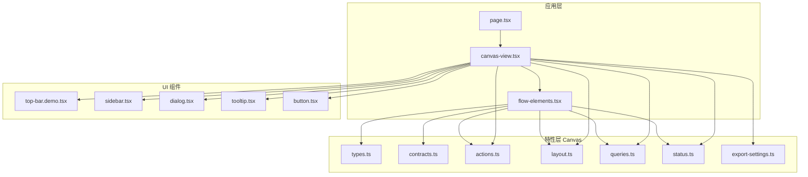

图表来源
- [page.tsx:1-200](file://src/app/products/(app)/canvas/[projectId]/page.tsx#L1-L200)
- [canvas-view.tsx:1-200](file://src/app/products/(app)/canvas/[projectId]/canvas-view.tsx#L1-L200)
- [flow-elements.tsx:1-200](file://src/app/products/(app)/canvas/[projectId]/flow-elements.tsx#L1-L200)
- [actions.ts:1-200](file://src/features/canvas/actions.ts#L1-L200)
- [contracts.ts:1-200](file://src/features/canvas/contracts.ts#L1-L200)
- [types.ts:1-200](file://src/features/canvas/types.ts#L1-L200)
- [layout.ts:1-200](file://src/features/canvas/layout.ts#L1-L200)
- [queries.ts:1-200](file://src/features/canvas/queries.ts#L1-L200)
- [status.ts:1-200](file://src/features/canvas/status.ts#L1-L200)
- [export-settings.ts:1-200](file://src/features/canvas/export-settings.ts#L1-L200)
- [top-bar.demo.tsx:1-200](file://src/components/ui/top-bar.demo.tsx#L1-L200)
- [sidebar.tsx:1-200](file://src/components/ui/sidebar.tsx#L1-L200)
- [dialog.tsx:1-200](file://src/components/ui/dialog.tsx#L1-L200)
- [tooltip.tsx:1-200](file://src/components/ui/tooltip.tsx#L1-L200)
- [button.tsx:1-200](file://src/components/ui/button.tsx#L1-L200)

章节来源
- [page.tsx:1-200](file://src/app/products/(app)/canvas/[projectId]/page.tsx#L1-L200)
- [canvas-view.tsx:1-200](file://src/app/products/(app)/canvas/[projectId]/canvas-view.tsx#L1-L200)
- [flow-elements.tsx:1-200](file://src/app/products/(app)/canvas/[projectId]/flow-elements.tsx#L1-L200)

## 核心组件
- 画布视图（Canvas View）：负责挂载画布容器、绑定全局事件、协调工具栏与面板的显示与隐藏、驱动渲染循环与状态同步。
- 流程元素（Flow Elements）：承载节点与连线的绘制与交互，包括选择、移动、缩放、旋转、连接点拖拽、对齐与吸附。
- 动作编排（Actions）：将用户输入转换为可撤销的操作命令，维护操作历史栈，支持撤销/重做与批量提交。
- 布局与查询（Layout & Queries）：计算节点布局、碰撞检测、边界限制、可见性裁剪与命中测试。
- 状态与导出（Status & Export Settings）：维护画布运行态（选中项、工具模式、缩放级别）、导出参数与渲染设置。

章节来源
- [canvas-view.tsx:1-200](file://src/app/products/(app)/canvas/[projectId]/canvas-view.tsx#L1-L200)
- [flow-elements.tsx:1-200](file://src/app/products/(app)/canvas/[projectId]/flow-elements.tsx#L1-L200)
- [actions.ts:1-200](file://src/features/canvas/actions.ts#L1-L200)
- [layout.ts:1-200](file://src/features/canvas/layout.ts#L1-L200)
- [queries.ts:1-200](file://src/features/canvas/queries.ts#L1-L200)
- [status.ts:1-200](file://src/features/canvas/status.ts#L1-L200)
- [export-settings.ts:1-200](file://src/features/canvas/export-settings.ts#L1-L200)

## 架构总览
画布交互系统采用“视图-特性-UI”分层架构：
- 视图层（View）：React 组件负责 DOM 挂载与事件分发，不直接包含复杂业务逻辑。
- 特性层（Feature）：纯函数与状态机组合，提供可测试、可复用的能力（动作、布局、查询、状态）。
- UI 层（UI）：无状态或弱状态的交互控件，通过 props 与回调与上层协作。

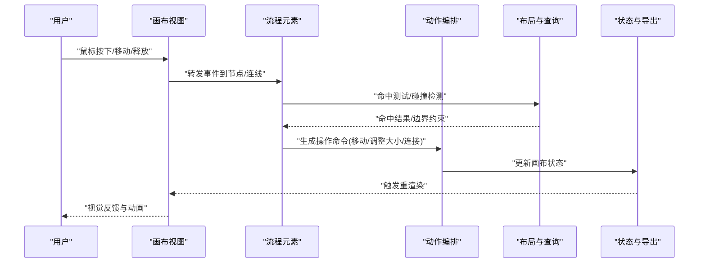

图表来源
- [canvas-view.tsx:1-200](file://src/app/products/(app)/canvas/[projectId]/canvas-view.tsx#L1-L200)
- [flow-elements.tsx:1-200](file://src/app/products/(app)/canvas/[projectId]/flow-elements.tsx#L1-L200)
- [actions.ts:1-200](file://src/features/canvas/actions.ts#L1-L200)
- [layout.ts:1-200](file://src/features/canvas/layout.ts#L1-L200)
- [queries.ts:1-200](file://src/features/canvas/queries.ts#L1-L200)
- [status.ts:1-200](file://src/features/canvas/status.ts#L1-L200)

## 详细组件分析

### 鼠标事件处理与手势识别
- 事件捕获与分发：在画布视图中统一捕获 mousedown/mousemove/mouseup 与 pointer 事件，区分点击、拖拽、双击、右键菜单等场景。
- 手势识别：对多点触控进行识别（捏合缩放、双指平移），结合当前工具模式决定行为（选择、框选、平移画布、缩放画布）。
- 事件节流与防抖：高频移动事件进行节流，避免过度重绘；长按与延迟触发用于上下文菜单与快捷操作。

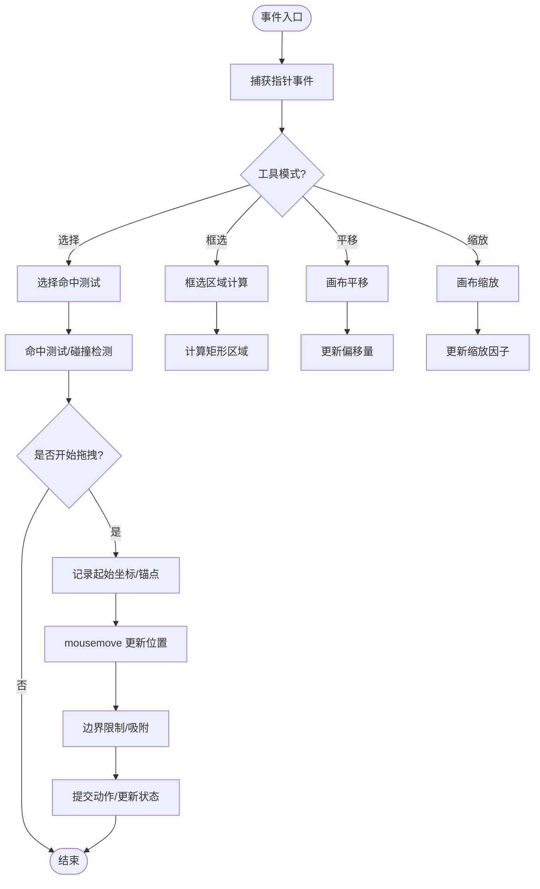

图表来源
- [canvas-view.tsx:1-200](file://src/app/products/(app)/canvas/[projectId]/canvas-view.tsx#L1-L200)
- [flow-elements.tsx:1-200](file://src/app/products/(app)/canvas/[projectId]/flow-elements.tsx#L1-L200)
- [layout.ts:1-200](file://src/features/canvas/layout.ts#L1-L200)
- [queries.ts:1-200](file://src/features/canvas/queries.ts#L1-L200)

章节来源
- [canvas-view.tsx:1-200](file://src/app/products/(app)/canvas/[projectId]/canvas-view.tsx#L1-L200)
- [flow-elements.tsx:1-200](file://src/app/products/(app)/canvas/[projectId]/flow-elements.tsx#L1-L200)

### 拖拽操作的实现
- 拖拽生命周期：mousedown 记录目标与初始位置，mousemove 计算增量并应用变换，mouseup 提交最终状态。
- 锚点与手柄：节点四角与边缘提供尺寸调整手柄，支持等比与非等比缩放。
- 吸附与对齐：靠近网格线或其他节点时自动吸附，提升对齐精度。
- 批量拖拽：多选后整体移动，保持相对位置不变。

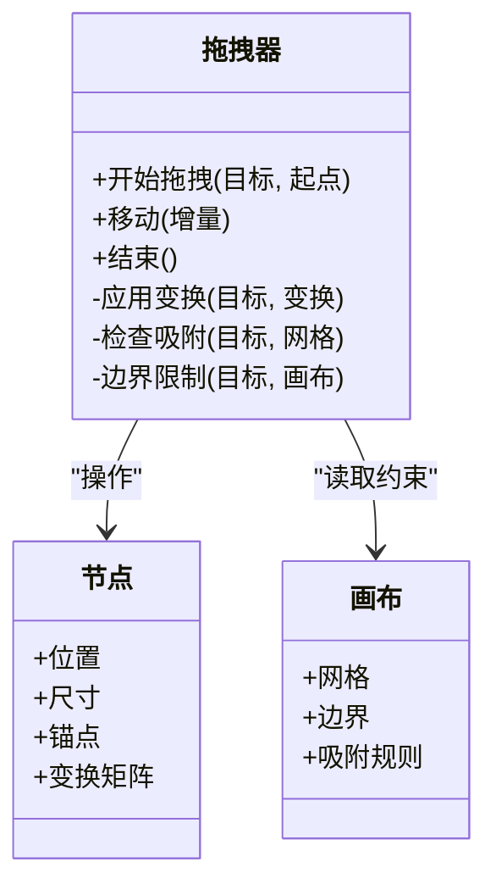

图表来源
- [flow-elements.tsx:1-200](file://src/app/products/(app)/canvas/[projectId]/flow-elements.tsx#L1-L200)
- [layout.ts:1-200](file://src/features/canvas/layout.ts#L1-L200)

章节来源
- [flow-elements.tsx:1-200](file://src/app/products/(app)/canvas/[projectId]/flow-elements.tsx#L1-L200)
- [layout.ts:1-200](file://src/features/canvas/layout.ts#L1-L200)

### 碰撞检测与边界限制
- 命中测试：使用几何形状（矩形、圆形、路径）进行快速命中判断，优先使用 AABB 包围盒加速。
- 碰撞检测：节点之间、节点与网格、节点与连线连接点的碰撞判定，用于吸附与重叠提示。
- 边界限制：确保节点始终处于画布可视区域内，超出部分被裁剪或阻止移动。

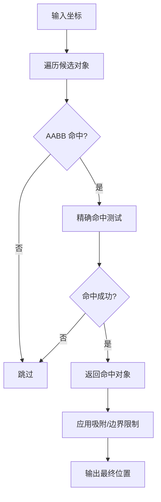

图表来源
- [queries.ts:1-200](file://src/features/canvas/queries.ts#L1-L200)
- [layout.ts:1-200](file://src/features/canvas/layout.ts#L1-L200)

章节来源
- [queries.ts:1-200](file://src/features/canvas/queries.ts#L1-L200)
- [layout.ts:1-200](file://src/features/canvas/layout.ts#L1-L200)

### 上下文菜单系统
- 触发方式：右键点击、长按、特定快捷键组合。
- 菜单内容：复制、粘贴、删除、锁定、层级调整、属性编辑等。
- 定位策略：根据点击坐标与屏幕边界计算菜单位置，避免溢出。

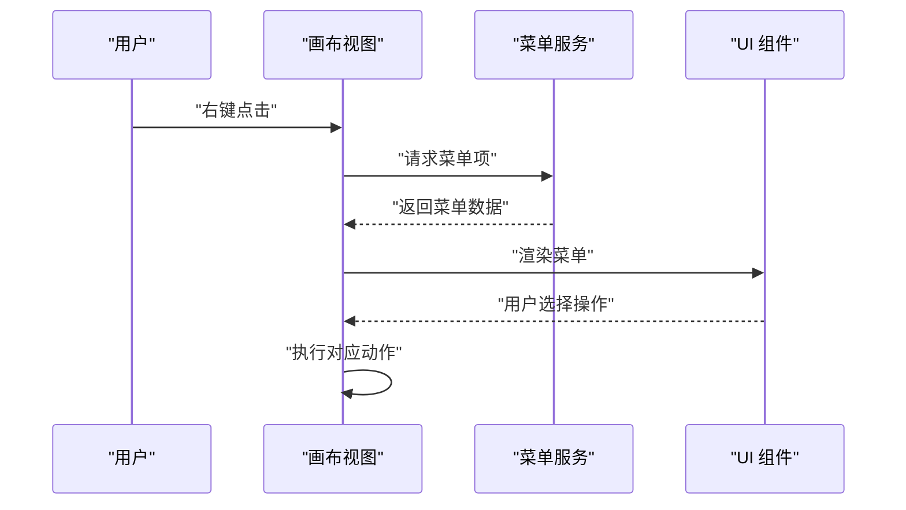

图表来源
- [canvas-view.tsx:1-200](file://src/app/products/(app)/canvas/[projectId]/canvas-view.tsx#L1-L200)
- [dialog.tsx:1-200](file://src/components/ui/dialog.tsx#L1-L200)
- [tooltip.tsx:1-200](file://src/components/ui/tooltip.tsx#L1-L200)

章节来源
- [canvas-view.tsx:1-200](file://src/app/products/(app)/canvas/[projectId]/canvas-view.tsx#L1-L200)
- [dialog.tsx:1-200](file://src/components/ui/dialog.tsx#L1-L200)
- [tooltip.tsx:1-200](file://src/components/ui/tooltip.tsx#L1-L200)

### 操作面板与工具栏交互
- 工具栏：提供常用操作按钮（选择、框选、平移、缩放、撤销/重做、导出），支持快捷键映射。
- 操作面板：右侧或左侧面板展示属性编辑、图层管理、导出设置等，支持折叠与搜索。
- 状态联动：工具栏与面板状态与画布状态双向同步，保证一致性。

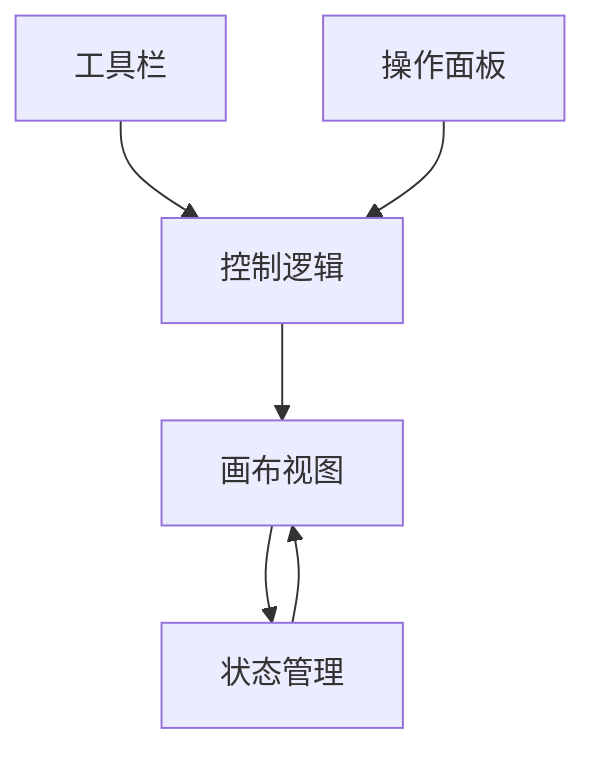

图表来源
- [top-bar.demo.tsx:1-200](file://src/components/ui/top-bar.demo.tsx#L1-L200)
- [sidebar.tsx:1-200](file://src/components/ui/sidebar.tsx#L1-L200)
- [canvas-view.tsx:1-200](file://src/app/products/(app)/canvas/[projectId]/canvas-view.tsx#L1-L200)

章节来源
- [top-bar.demo.tsx:1-200](file://src/components/ui/top-bar.demo.tsx#L1-L200)
- [sidebar.tsx:1-200](file://src/components/ui/sidebar.tsx#L1-L200)
- [canvas-view.tsx:1-200](file://src/app/products/(app)/canvas/[projectId]/canvas-view.tsx#L1-L200)

### 撤销重做机制、操作历史和状态恢复
- 动作模型：每个用户操作封装为不可变动作，包含前后状态快照或差异补丁。
- 历史栈：维护撤销栈与重做栈，支持批量提交与合并相邻同类动作。
- 状态恢复：从指定历史版本恢复画布状态，支持跨会话持久化。

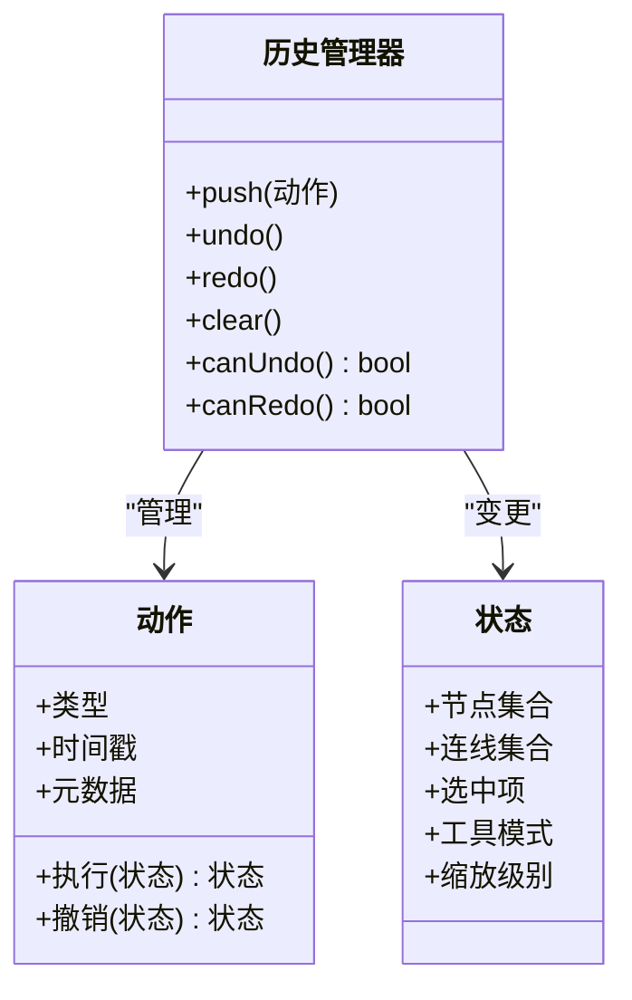

图表来源
- [actions.ts:1-200](file://src/features/canvas/actions.ts#L1-L200)
- [contracts.ts:1-200](file://src/features/canvas/contracts.ts#L1-L200)
- [types.ts:1-200](file://src/features/canvas/types.ts#L1-L200)

章节来源
- [actions.ts:1-200](file://src/features/canvas/actions.ts#L1-L200)
- [contracts.ts:1-200](file://src/features/canvas/contracts.ts#L1-L200)
- [types.ts:1-200](file://src/features/canvas/types.ts#L1-L200)

### 交互扩展点、自定义操作与快捷键配置
- 扩展点：提供插件式接口注册新工具、新节点类型与新动作，支持热插拔。
- 自定义操作：通过动作工厂创建自定义命令，纳入撤销重做历史。
- 快捷键配置：集中式快捷键表，支持平台差异（Mac/Windows）与用户自定义映射。

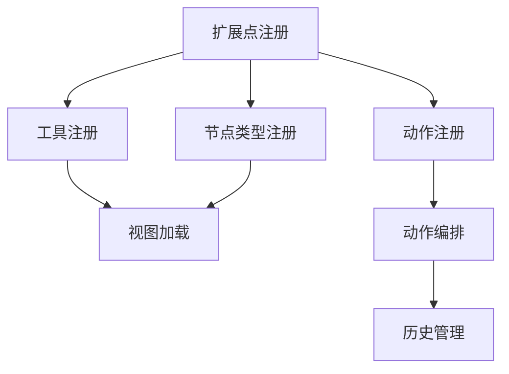

图表来源
- [actions.ts:1-200](file://src/features/canvas/actions.ts#L1-L200)
- [contracts.ts:1-200](file://src/features/canvas/contracts.ts#L1-L200)
- [types.ts:1-200](file://src/features/canvas/types.ts#L1-L200)

章节来源
- [actions.ts:1-200](file://src/features/canvas/actions.ts#L1-L200)
- [contracts.ts:1-200](file://src/features/canvas/contracts.ts#L1-L200)
- [types.ts:1-200](file://src/features/canvas/types.ts#L1-L200)

### 无障碍访问支持与多设备兼容性
- 键盘导航：Tab 顺序、方向键移动、Enter/Space 确认、Esc 取消。
- 屏幕阅读器：ARIA 标签、角色与状态描述，确保读屏软件正确播报。
- 触摸与手写：多点触控手势、压力感应、延迟优化，适配平板与触控笔。

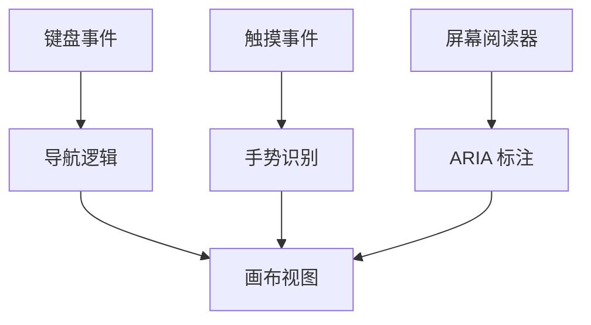

图表来源
- [canvas-view.tsx:1-200](file://src/app/products/(app)/canvas/[projectId]/canvas-view.tsx#L1-L200)
- [flow-elements.tsx:1-200](file://src/app/products/(app)/canvas/[projectId]/flow-elements.tsx#L1-L200)

章节来源
- [canvas-view.tsx:1-200](file://src/app/products/(app)/canvas/[projectId]/canvas-view.tsx#L1-L200)
- [flow-elements.tsx:1-200](file://src/app/products/(app)/canvas/[projectId]/flow-elements.tsx#L1-L200)

## 依赖分析
- 视图依赖特性：canvas-view.tsx 依赖 actions.ts、layout.ts、queries.ts、status.ts、export-settings.ts。
- 流程元素依赖类型与契约：flow-elements.tsx 依赖 types.ts、contracts.ts。
- UI 组件解耦：top-bar、sidebar、dialog、tooltip、button 作为独立组件，通过 props 与回调与上层协作。

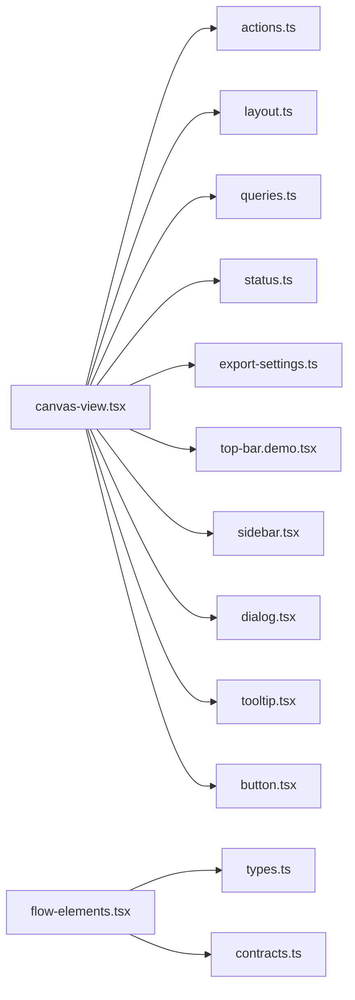

图表来源
- [canvas-view.tsx:1-200](file://src/app/products/(app)/canvas/[projectId]/canvas-view.tsx#L1-L200)
- [flow-elements.tsx:1-200](file://src/app/products/(app)/canvas/[projectId]/flow-elements.tsx#L1-L200)
- [actions.ts:1-200](file://src/features/canvas/actions.ts#L1-L200)
- [layout.ts:1-200](file://src/features/canvas/layout.ts#L1-L200)
- [queries.ts:1-200](file://src/features/canvas/queries.ts#L1-L200)
- [status.ts:1-200](file://src/features/canvas/status.ts#L1-L200)
- [export-settings.ts:1-200](file://src/features/canvas/export-settings.ts#L1-L200)
- [types.ts:1-200](file://src/features/canvas/types.ts#L1-L200)
- [contracts.ts:1-200](file://src/features/canvas/contracts.ts#L1-L200)
- [top-bar.demo.tsx:1-200](file://src/components/ui/top-bar.demo.tsx#L1-L200)
- [sidebar.tsx:1-200](file://src/components/ui/sidebar.tsx#L1-L200)
- [dialog.tsx:1-200](file://src/components/ui/dialog.tsx#L1-L200)
- [tooltip.tsx:1-200](file://src/components/ui/tooltip.tsx#L1-L200)
- [button.tsx:1-200](file://src/components/ui/button.tsx#L1-L200)

章节来源
- [canvas-view.tsx:1-200](file://src/app/products/(app)/canvas/[projectId]/canvas-view.tsx#L1-L200)
- [flow-elements.tsx:1-200](file://src/app/products/(app)/canvas/[projectId]/flow-elements.tsx#L1-L200)
- [actions.ts:1-200](file://src/features/canvas/actions.ts#L1-L200)
- [layout.ts:1-200](file://src/features/canvas/layout.ts#L1-L200)
- [queries.ts:1-200](file://src/features/canvas/queries.ts#L1-L200)
- [status.ts:1-200](file://src/features/canvas/status.ts#L1-L200)
- [export-settings.ts:1-200](file://src/features/canvas/export-settings.ts#L1-L200)
- [types.ts:1-200](file://src/features/canvas/types.ts#L1-L200)
- [contracts.ts:1-200](file://src/features/canvas/contracts.ts#L1-L200)
- [top-bar.demo.tsx:1-200](file://src/components/ui/top-bar.demo.tsx#L1-L200)
- [sidebar.tsx:1-200](file://src/components/ui/sidebar.tsx#L1-L200)
- [dialog.tsx:1-200](file://src/components/ui/dialog.tsx#L1-L200)
- [tooltip.tsx:1-200](file://src/components/ui/tooltip.tsx#L1-L200)
- [button.tsx:1-200](file://src/components/ui/button.tsx#L1-L200)

## 性能考虑
- 事件节流与防抖：对 mousemove/touchmove 等高频率事件进行节流，降低重绘压力。
- 命中测试优化：先进行 AABB 粗检，再进行精确几何测试，减少昂贵计算。
- 增量更新：仅重绘受影响的节点与连线，避免全量刷新。
- 离屏渲染：复杂图形使用离屏缓冲，减少主线程阻塞。
- 内存管理：及时释放不再使用的纹理与缓存，避免内存泄漏。

[本节为通用指导，不直接分析具体文件]

## 故障排查指南
- 常见问题
  - 拖拽卡顿：检查事件节流阈值与命中测试复杂度。
  - 吸附异常：验证网格间距与吸附容差设置。
  - 撤销失效：确认动作是否可逆且历史栈未越界。
  - 菜单溢出：调整菜单定位算法与边界检测。
- 调试建议
  - 启用日志：记录关键事件与状态变化。
  - 可视化辅助：开启网格、吸附线、命中区域高亮。
  - 单元测试：针对布局与查询逻辑编写用例。

章节来源
- [layout.ts:1-200](file://src/features/canvas/layout.ts#L1-L200)
- [queries.ts:1-200](file://src/features/canvas/queries.ts#L1-L200)
- [actions.ts:1-200](file://src/features/canvas/actions.ts#L1-L200)

## 结论
画布交互系统通过清晰的层次划分与模块化设计，实现了高效的鼠标事件处理、手势识别、拖拽操作、碰撞检测与边界限制，并提供完善的上下文菜单、操作面板与工具栏交互。撤销重做机制与操作历史确保了用户操作的可回溯性。扩展点与快捷键配置提升了系统的可定制性与易用性。无障碍访问与多设备兼容性保障了更广泛的用户群体体验。建议在后续迭代中持续优化性能与可测试性，完善错误处理与监控体系。

[本节为总结，不直接分析具体文件]

## 附录
- 术语表
  - 动作：用户操作的不可变表示，支持撤销与重做。
  - 命中测试：判断用户输入是否与某个对象相交。
  - 吸附：将对象移动到网格或参考线附近以对齐。
  - 边界限制：限制对象移动范围不超过画布边界。
- 参考文件
  - 页面与视图：[page.tsx](file://src/app/products/(app)/canvas/[projectId]/page.tsx)、[canvas-view.tsx](file://src/app/products/(app)/canvas/[projectId]/canvas-view.tsx)
  - 流程元素：[flow-elements.tsx](file://src/app/products/(app)/canvas/[projectId]/flow-elements.tsx)
  - 特性层：[actions.ts](file://src/features/canvas/actions.ts)、[layout.ts](file://src/features/canvas/layout.ts)、[queries.ts](file://src/features/canvas/queries.ts)、[status.ts](file://src/features/canvas/status.ts)、[export-settings.ts](file://src/features/canvas/export-settings.ts)、[types.ts](file://src/features/canvas/types.ts)、[contracts.ts](file://src/features/canvas/contracts.ts)
  - UI 组件：[top-bar.demo.tsx](file://src/components/ui/top-bar.demo.tsx)、[sidebar.tsx](file://src/components/ui/sidebar.tsx)、[dialog.tsx](file://src/components/ui/dialog.tsx)、[tooltip.tsx](file://src/components/ui/tooltip.tsx)、[button.tsx](file://src/components/ui/button.tsx)

[本节为附录，不直接分析具体文件]