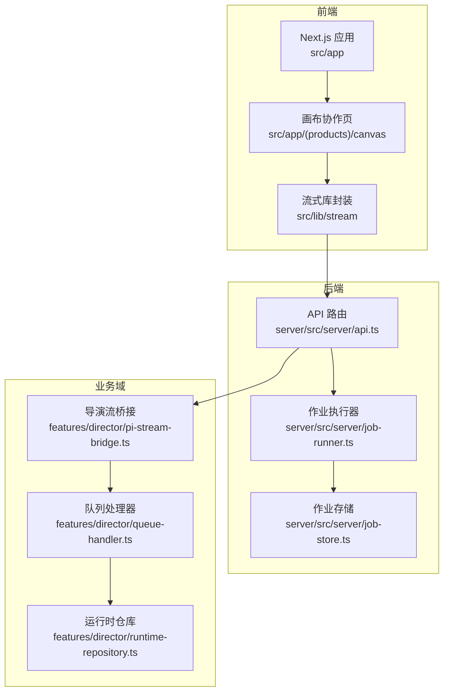
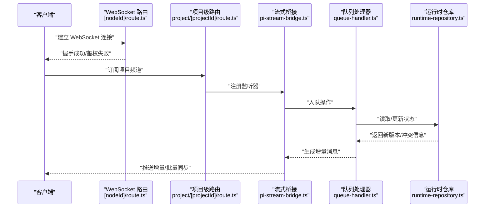
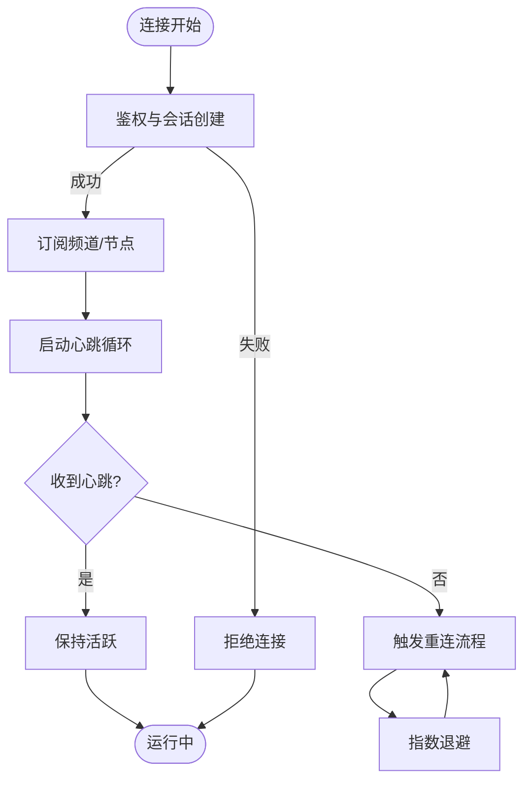
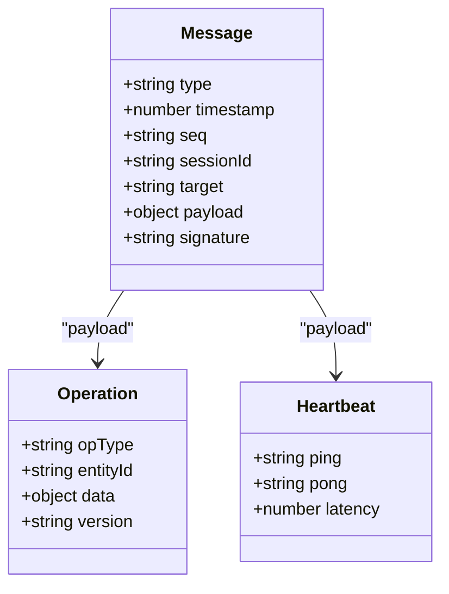
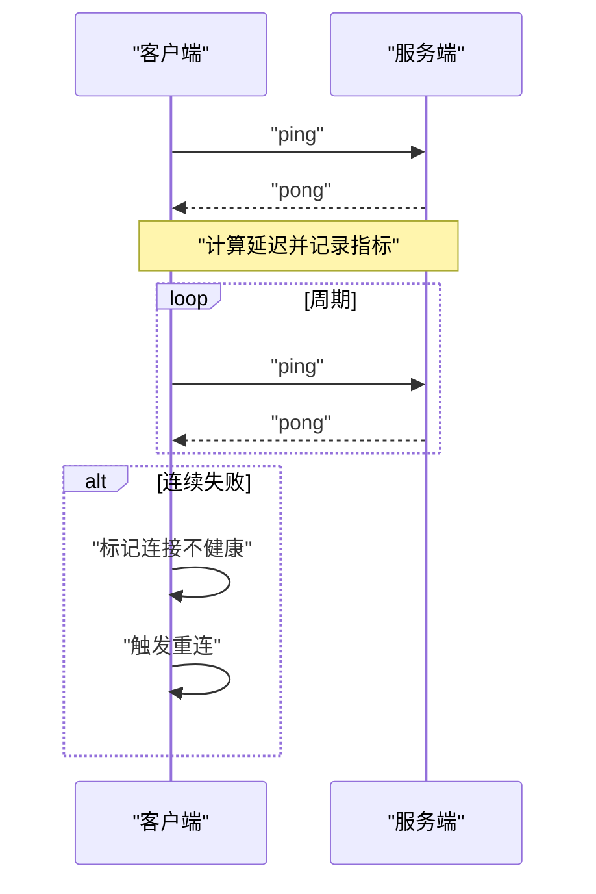
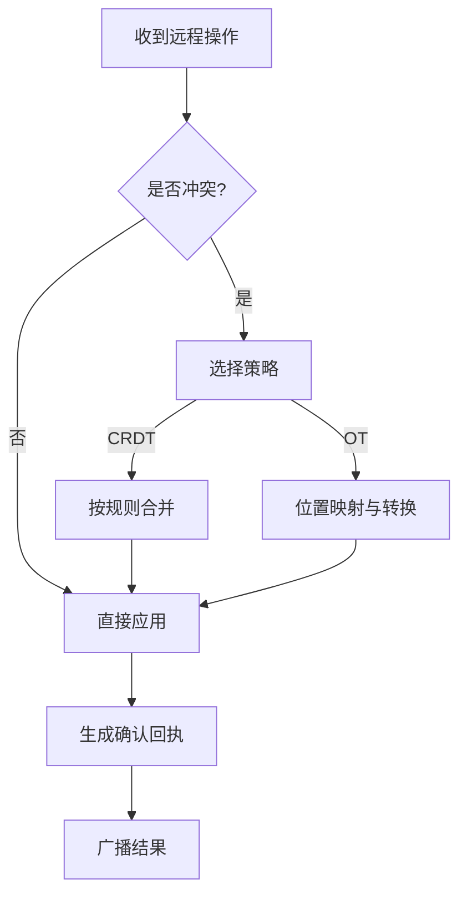
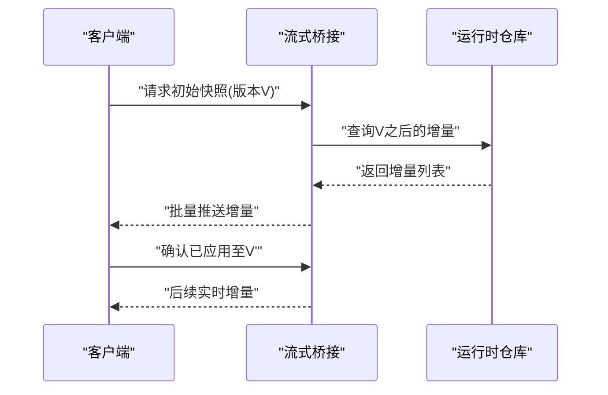
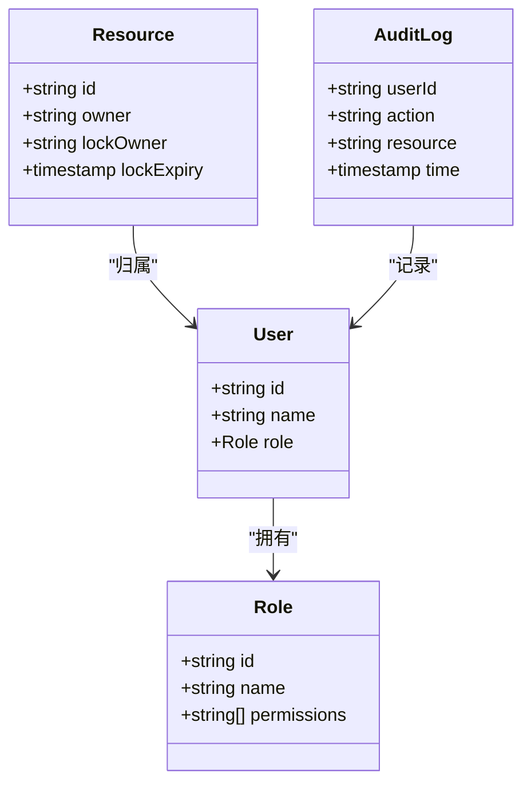
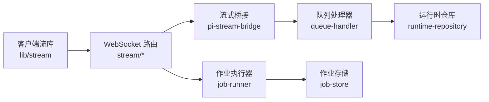

# 实时协作

<cite>
**本文引用的文件**   
- [src/app/api/director/stream/[nodeId]/route.ts](file://src/app/api/director/stream/[nodeId]/route.ts)
- [src/app/api/director/stream/project/[projectId]/route.ts](file://src/app/api/director/stream/project/[projectId]/route.ts)
- [src/features/director/pi-stream-bridge.ts](file://src/features/director/pi-stream-bridge.ts)
- [src/features/director/queue-handler.ts](file://src/features/director/queue-handler.ts)
- [src/features/director/runtime-repository.ts](file://src/features/director/runtime-repository.ts)
- [src/lib/stream/index.ts](file://src/lib/stream/index.ts)
- [server/src/server/api.ts](file://server/src/server/api.ts)
- [server/src/server/job-runner.ts](file://server/src/server/job-runner.ts)
- [server/src/server/job-store.ts](file://server/src/server/job-store.ts)
- [src/app/(products)/canvas/[projectId]/canvas-action-api.ts](file://src/app/(products)/canvas/[projectId]/canvas-action-api.ts)
- [src/app/(products)/canvas/[projectId]/live-status.test.ts](file://src/app/(products)/canvas/[projectId]/live-status.test.ts)
</cite>

## 目录
1. [简介](#简介)
2. [项目结构](#项目结构)
3. [核心组件](#核心组件)
4. [架构总览](#架构总览)
5. [详细组件分析](#详细组件分析)
6. [依赖关系分析](#依赖关系分析)
7. [性能考量](#性能考量)
8. [故障排查指南](#故障排查指南)
9. [结论](#结论)
10. [附录](#附录)

## 简介
本文件面向“实时协作”能力，围绕 WebSocket 通信机制、消息协议、心跳检测、冲突解决（CRDT/操作转换/合并策略）、状态同步（增量更新、批量同步、断线重连）、权限管理（角色权限、操作锁定、审计日志）与性能优化（消息压缩、差分同步、本地缓存）进行系统化说明。同时提供调试与监控方法（操作回放、冲突检测、性能分析），帮助开发者快速定位问题并提升系统稳定性与用户体验。

## 项目结构
本项目采用前后端分离的 Next.js + Node.js 架构：
- 前端应用位于 src/app，包含产品页面、API 路由与业务功能模块。
- 服务端逻辑位于 server/src，提供 API、作业调度与持久化等能力。
- 实时流式能力集中在 features/director 与 lib/stream 中，配合 API 路由暴露 WebSocket 入口。

图表来源
- [server/src/server/api.ts](file://server/src/server/api.ts)
- [server/src/server/job-runner.ts](file://server/src/server/job-runner.ts)
- [server/src/server/job-store.ts](file://server/src/server/job-store.ts)
- [src/features/director/pi-stream-bridge.ts](file://src/features/director/pi-stream-bridge.ts)
- [src/features/director/queue-handler.ts](file://src/features/director/queue-handler.ts)
- [src/features/director/runtime-repository.ts](file://src/features/director/runtime-repository.ts)
- [src/lib/stream/index.ts](file://src/lib/stream/index.ts)

章节来源
- [src/app/api/director/stream/[nodeId]/route.ts](file://src/app/api/director/stream/[nodeId]/route.ts)
- [src/app/api/director/stream/project/[projectId]/route.ts](file://src/app/api/director/stream/project/[projectId]/route.ts)
- [server/src/server/api.ts](file://server/src/server/api.ts)

## 核心组件
- WebSocket 接入层：负责建立连接、鉴权、路由到具体会话或节点通道，处理心跳与断线重连。
- 流式桥接：将上游事件转换为统一的消息协议，支持广播、过滤与限流。
- 队列处理器：对并发写入进行序列化与背压控制，保障一致性。
- 运行时仓库：维护会话状态、版本向量与变更集，提供增量快照与合并接口。
- 客户端流库：封装连接生命周期、心跳、重试、缓冲与去抖，向上层暴露稳定 API。

章节来源
- [src/app/api/director/stream/[nodeId]/route.ts](file://src/app/api/director/stream/[nodeId]/route.ts)
- [src/app/api/director/stream/project/[projectId]/route.ts](file://src/app/api/director/stream/project/[projectId]/route.ts)
- [src/features/director/pi-stream-bridge.ts](file://src/features/director/pi-stream-bridge.ts)
- [src/features/director/queue-handler.ts](file://src/features/director/queue-handler.ts)
- [src/features/director/runtime-repository.ts](file://src/features/director/runtime-repository.ts)
- [src/lib/stream/index.ts](file://src/lib/stream/index.ts)

## 架构总览
下图展示了从客户端到后端的完整实时协作链路，包括连接建立、消息路由、队列处理与状态同步。

图表来源
- [src/app/api/director/stream/[nodeId]/route.ts](file://src/app/api/director/stream/[nodeId]/route.ts)
- [src/app/api/director/stream/project/[projectId]/route.ts](file://src/app/api/director/stream/project/[projectId]/route.ts)
- [src/features/director/pi-stream-bridge.ts](file://src/features/director/pi-stream-bridge.ts)
- [src/features/director/queue-handler.ts](file://src/features/director/queue-handler.ts)
- [src/features/director/runtime-repository.ts](file://src/features/director/runtime-repository.ts)

## 详细组件分析

### WebSocket 接入与连接管理
- 连接建立：通过 Next.js API 路由暴露 WebSocket 端点，完成握手、鉴权与会话初始化。
- 会话管理：按节点或项目维度维护连接集合，支持加入/离开频道、广播与点对点消息。
- 心跳检测：客户端与服务端周期性发送 ping/pong，超时则触发断线清理与资源回收。
- 断线重连：客户端指数退避重连，携带上次版本号进行增量恢复。

章节来源
- [src/app/api/director/stream/[nodeId]/route.ts](file://src/app/api/director/stream/[nodeId]/route.ts)
- [src/app/api/director/stream/project/[projectId]/route.ts](file://src/app/api/director/stream/project/[projectId]/route.ts)

### 消息协议设计
- 基础字段：消息类型、时间戳、序列号、会话标识、目标范围（节点/项目）。
- 操作类型：新增、修改、删除、锁定、解锁、权限变更、心跳、错误。
- 负载格式：结构化对象，支持扩展字段；敏感字段需签名校验。
- 可靠性：可选确认回执、重复去重、乱序重排与幂等键。

章节来源
- [src/features/director/pi-stream-bridge.ts](file://src/features/director/pi-stream-bridge.ts)
- [src/lib/stream/index.ts](file://src/lib/stream/index.ts)

### 心跳检测与连接健康
- 服务端心跳：定时向所有活跃连接发送 ping，统计延迟与丢包率。
- 客户端心跳：周期性发送 ping，记录往返时延，异常阈值触发告警。
- 健康检查：基于心跳失败次数与最近活动时长判定连接状态，自动清理僵尸连接。

章节来源
- [src/lib/stream/index.ts](file://src/lib/stream/index.ts)

### 冲突解决算法
- CRDT（无冲突数据类型）：适用于文本、计数器、集合等场景，保证最终一致性。
- 操作转换（OT）：对并发编辑进行位置映射与顺序归一化，适合富文本与图形布局。
- 合并策略：优先本地乐观更新，冲突时回滚并重放；引入版本向量与因果排序。

章节来源
- [src/features/director/runtime-repository.ts](file://src/features/director/runtime-repository.ts)
- [src/features/director/queue-handler.ts](file://src/features/director/queue-handler.ts)

### 实时状态同步
- 增量更新：仅推送差异数据，减少带宽与渲染压力。
- 批量同步：在连接恢复或首次订阅时，按版本区间批量下发缺失片段。
- 断线重连：客户端保存本地版本向量，重连后请求增量补全。

章节来源
- [src/features/director/pi-stream-bridge.ts](file://src/features/director/pi-stream-bridge.ts)
- [src/features/director/runtime-repository.ts](file://src/features/director/runtime-repository.ts)

### 协作权限管理
- 角色权限：基于角色的访问控制（RBAC），区分查看、编辑、管理员等权限。
- 操作锁定：对关键资源加锁，防止并发破坏；支持租约与超时释放。
- 审计日志：记录用户行为、操作轨迹与权限变更，便于回溯与合规。

章节来源
- [src/app/(products)/canvas/[projectId]/canvas-action-api.ts](file://src/app/(products)/canvas/[projectId]/canvas-action-api.ts)

### 性能优化
- 消息压缩：对大负载启用 gzip/deflate，降低网络开销。
- 差分同步：基于内容哈希或版本向量，仅传输变化部分。
- 本地缓存：客户端缓存最近快照与增量，加速重连恢复与离线编辑。
- 背压控制：队列满时暂停接收，避免内存溢出。

章节来源
- [src/features/director/queue-handler.ts](file://src/features/director/queue-handler.ts)
- [src/lib/stream/index.ts](file://src/lib/stream/index.ts)

## 依赖关系分析
- 前端依赖流式库进行连接管理与消息收发。
- 后端 API 路由依赖流式桥接与队列处理器，协调状态与并发。
- 运行时仓库为状态唯一真相源，提供版本与合并能力。
- 作业执行器与存储用于异步任务与持久化。

图表来源
- [src/lib/stream/index.ts](file://src/lib/stream/index.ts)
- [src/app/api/director/stream/[nodeId]/route.ts](file://src/app/api/director/stream/[nodeId]/route.ts)
- [src/app/api/director/stream/project/[projectId]/route.ts](file://src/app/api/director/stream/project/[projectId]/route.ts)
- [src/features/director/pi-stream-bridge.ts](file://src/features/director/pi-stream-bridge.ts)
- [src/features/director/queue-handler.ts](file://src/features/director/queue-handler.ts)
- [src/features/director/runtime-repository.ts](file://src/features/director/runtime-repository.ts)
- [server/src/server/job-runner.ts](file://server/src/server/job-runner.ts)
- [server/src/server/job-store.ts](file://server/src/server/job-store.ts)

章节来源
- [server/src/server/api.ts](file://server/src/server/api.ts)

## 性能考量
- 连接规模：限制单进程连接数，水平扩展多实例并通过共享状态同步。
- 消息吞吐：批量化推送、合并小消息，避免频繁上下文切换。
- 内存占用：设置队列上限与丢弃策略，及时释放历史增量。
- 延迟优化：就近路由、减少跨进程调用，使用高效序列化。

## 故障排查指南
- 连接问题：检查握手响应码、鉴权失败原因、防火墙与代理配置。
- 心跳异常：查看延迟分布与丢包率，定位网络抖动或服务端过载。
- 冲突频发：分析操作时序与版本向量，定位非幂等写入与锁竞争。
- 性能瓶颈：监控队列长度、GC 停顿与 CPU 使用率，优化序列化与 I/O。

章节来源
- [src/app/(products)/canvas/[projectId]/live-status.test.ts](file://src/app/(products)/canvas/[projectId]/live-status.test.ts)

## 结论
通过清晰的 WebSocket 接入层、统一的流式桥接与稳健的队列处理，结合 CRDT/OT 冲突解决与增量同步策略，本项目实现了高可用、低延迟的实时协作体验。配合完善的权限与审计机制以及性能优化手段，可在复杂协作场景中保持稳定与一致。

## 附录
- 调试工具建议：操作回放器、冲突检测器、性能剖析器与日志聚合平台。
- 监控指标：连接数、消息速率、延迟分位、错误率、队列深度与内存使用。
- 最佳实践：幂等设计、最小化变更、明确版本语义与可观测性优先。