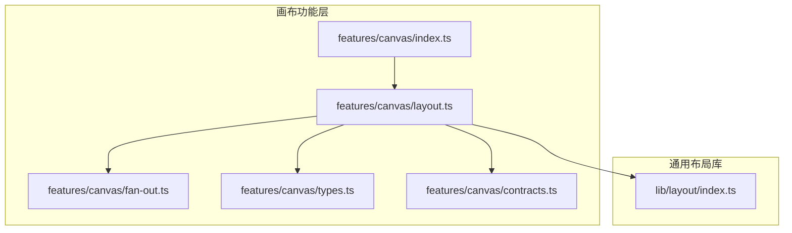
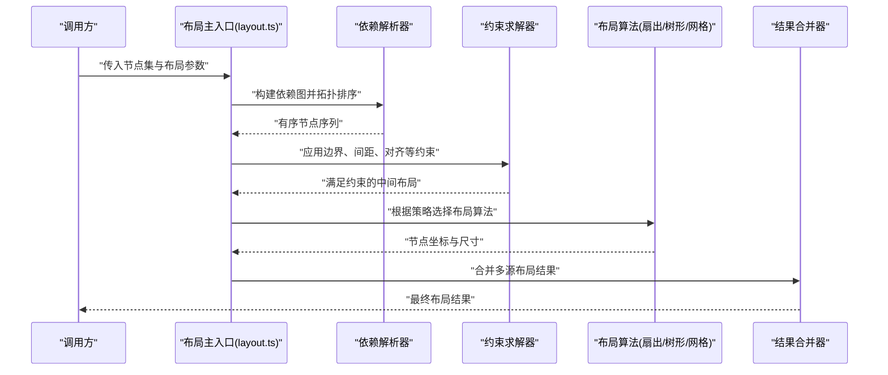
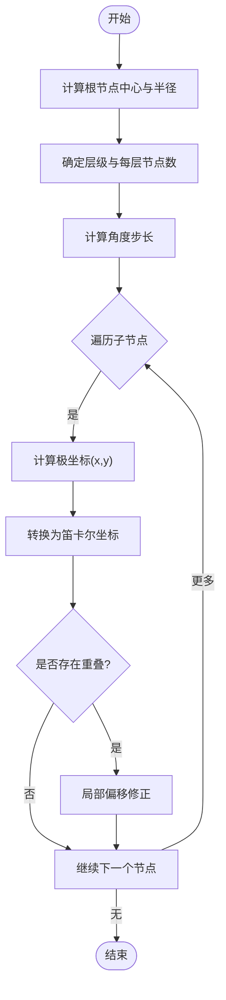
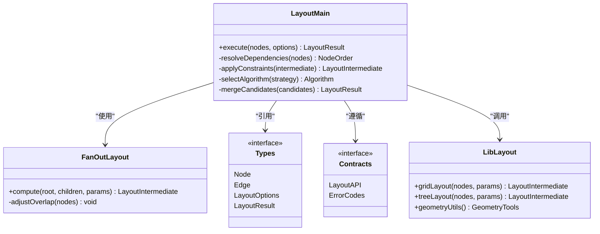

# 布局引擎

<cite>
**本文引用的文件**   
- [src/features/canvas/layout.ts](file://src/features/canvas/layout.ts)
- [src/features/canvas/fan-out.ts](file://src/features/canvas/fan-out.ts)
- [src/features/canvas/types.ts](file://src/features/canvas/types.ts)
- [src/features/canvas/contracts.ts](file://src/features/canvas/contracts.ts)
- [src/features/canvas/index.ts](file://src/features/canvas/index.ts)
- [src/lib/layout/index.ts](file://src/lib/layout/index.ts)
</cite>

## 目录
1. [简介](#简介)
2. [项目结构](#项目结构)
3. [核心组件](#核心组件)
4. [架构总览](#架构总览)
5. [详细组件分析](#详细组件分析)
6. [依赖关系分析](#依赖关系分析)
7. [性能考量](#性能考量)
8. [故障排查指南](#故障排查指南)
9. [结论](#结论)
10. [附录](#附录)

## 简介
本技术文档聚焦画布布局引擎，系统性阐述自动布局算法、节点定位计算与空间分配策略。重点覆盖扇出布局、树形布局与网格布局的实现原理；解释布局约束系统、依赖解析与冲突解决机制；说明布局缓存策略、增量更新与性能优化方法；并提供自定义布局算法的扩展方式与调试工具。同时涵盖响应式布局与自适应缩放支持，帮助读者在复杂画布场景中高效构建稳定、可扩展的布局能力。

## 项目结构
画布布局相关代码主要位于 features/canvas 与 lib/layout 两个区域：
- features/canvas：面向画布业务能力的布局实现，包含布局主入口、扇出布局、类型定义与契约等。
- lib/layout：通用布局库，提供可复用的布局算法与工具函数。

**图表来源** 
- [src/features/canvas/index.ts](file://src/features/canvas/index.ts)
- [src/features/canvas/layout.ts](file://src/features/canvas/layout.ts)
- [src/features/canvas/fan-out.ts](file://src/features/canvas/fan-out.ts)
- [src/features/canvas/types.ts](file://src/features/canvas/types.ts)
- [src/features/canvas/contracts.ts](file://src/features/canvas/contracts.ts)
- [src/lib/layout/index.ts](file://src/lib/layout/index.ts)

**章节来源**
- [src/features/canvas/index.ts](file://src/features/canvas/index.ts)
- [src/features/canvas/layout.ts](file://src/features/canvas/layout.ts)
- [src/features/canvas/fan-out.ts](file://src/features/canvas/fan-out.ts)
- [src/features/canvas/types.ts](file://src/features/canvas/types.ts)
- [src/features/canvas/contracts.ts](file://src/features/canvas/contracts.ts)
- [src/lib/layout/index.ts](file://src/lib/layout/index.ts)

## 核心组件
- 布局主入口（layout.ts）：负责接收节点集合与布局参数，执行依赖解析、约束求解、布局算法选择与结果合并，输出最终节点位置与尺寸。
- 扇出布局（fan-out.ts）：以根节点为中心向外辐射排列子节点，适用于流程图、决策树等场景。
- 类型与契约（types.ts、contracts.ts）：定义节点、边、布局配置、布局结果与约束接口，确保模块间一致的数据契约。
- 通用布局库（lib/layout/index.ts）：提供基础布局算法（如网格、树形）、几何计算与碰撞检测等工具。

**章节来源**
- [src/features/canvas/layout.ts](file://src/features/canvas/layout.ts)
- [src/features/canvas/fan-out.ts](file://src/features/canvas/fan-out.ts)
- [src/features/canvas/types.ts](file://src/features/canvas/types.ts)
- [src/features/canvas/contracts.ts](file://src/features/canvas/contracts.ts)
- [src/lib/layout/index.ts](file://src/lib/layout/index.ts)

## 架构总览
布局引擎采用“输入模型 → 依赖解析 → 约束求解 → 布局算法 → 结果合并”的分层架构。布局主入口协调各子系统，保证数据流清晰、职责单一。

**图表来源** 
- [src/features/canvas/layout.ts](file://src/features/canvas/layout.ts)
- [src/features/canvas/fan-out.ts](file://src/features/canvas/fan-out.ts)
- [src/lib/layout/index.ts](file://src/lib/layout/index.ts)

## 详细组件分析

### 布局主入口（layout.ts）
- 职责
  - 接收节点与布局配置，校验输入合法性。
  - 构建依赖图并进行拓扑排序，处理环依赖与孤立节点。
  - 将约束（边界、间距、对齐、最小/最大尺寸）应用到中间布局。
  - 根据策略选择具体布局算法（扇出、树形、网格），生成候选布局。
  - 合并多个候选布局，输出最终节点位置与尺寸。
- 关键流程
  - 输入校验 → 依赖解析 → 约束求解 → 算法选择 → 结果合并 → 输出
- 错误处理
  - 非法输入返回明确错误信息。
  - 环依赖检测失败时抛出异常或回退到默认布局。
  - 约束不可满足时记录警告并尝试松弛策略。

**章节来源**
- [src/features/canvas/layout.ts](file://src/features/canvas/layout.ts)

### 扇出布局（fan-out.ts）
- 目标
  - 以根节点为起点，按层级或角度向外辐射排列子节点，形成清晰的层次结构。
- 核心逻辑
  - 计算根节点中心与半径，确定每层节点数量与角度间隔。
  - 对每个子节点计算极坐标并转换为笛卡尔坐标。
  - 处理节点尺寸差异导致的重叠，进行局部偏移修正。
- 适用场景
  - 流程图、决策树、任务分解图等需要突出层级关系的场景。

**图表来源** 
- [src/features/canvas/fan-out.ts](file://src/features/canvas/fan-out.ts)

**章节来源**
- [src/features/canvas/fan-out.ts](file://src/features/canvas/fan-out.ts)

### 类型与契约（types.ts、contracts.ts）
- types.ts
  - 定义节点、边、布局配置、布局结果等核心数据结构。
  - 明确字段含义、取值范围与必填项。
- contracts.ts
  - 定义布局接口契约，包括输入输出格式、错误码与回调约定。
  - 规范布局算法必须实现的抽象方法与行为。

**章节来源**
- [src/features/canvas/types.ts](file://src/features/canvas/types.ts)
- [src/features/canvas/contracts.ts](file://src/features/canvas/contracts.ts)

### 通用布局库（lib/layout/index.ts）
- 提供基础布局算法（网格、树形）与几何工具（碰撞检测、包围盒计算）。
- 暴露统一的布局接口，便于上层按需组合与扩展。
- 支持参数化配置，允许通过布局选项控制行为。

**章节来源**
- [src/lib/layout/index.ts](file://src/lib/layout/index.ts)

## 依赖关系分析
布局主入口依赖类型定义、契约与通用布局库；扇出布局作为具体算法被主入口调用。整体耦合度低、内聚度高，便于替换与扩展。

**图表来源** 
- [src/features/canvas/layout.ts](file://src/features/canvas/layout.ts)
- [src/features/canvas/fan-out.ts](file://src/features/canvas/fan-out.ts)
- [src/features/canvas/types.ts](file://src/features/canvas/types.ts)
- [src/features/canvas/contracts.ts](file://src/features/canvas/contracts.ts)
- [src/lib/layout/index.ts](file://src/lib/layout/index.ts)

**章节来源**
- [src/features/canvas/layout.ts](file://src/features/canvas/layout.ts)
- [src/features/canvas/fan-out.ts](file://src/features/canvas/fan-out.ts)
- [src/features/canvas/types.ts](file://src/features/canvas/types.ts)
- [src/features/canvas/contracts.ts](file://src/features/canvas/contracts.ts)
- [src/lib/layout/index.ts](file://src/lib/layout/index.ts)

## 性能考量
- 依赖解析
  - 使用拓扑排序避免重复计算，时间复杂度 O(V+E)。
  - 对环依赖进行快速检测，减少无效布局尝试。
- 约束求解
  - 分层应用约束，优先处理硬性约束（边界、最小尺寸），再处理软性约束（间距、对齐）。
  - 引入增量更新：仅对变更节点及其依赖子树重新计算。
- 布局算法
  - 扇出布局按层级批量计算，避免逐节点迭代带来的开销。
  - 网格与树形布局利用空间索引加速碰撞检测。
- 缓存策略
  - 对相同输入（节点集哈希、布局参数哈希）缓存结果，命中直接返回。
  - 细粒度缓存：节点级布局结果缓存，支持部分失效与合并。
- 渲染优化
  - 批量更新 DOM，减少重排与重绘。
  - 使用虚拟滚动与视口裁剪，仅渲染可见区域。

[本节为通用指导，不直接分析具体文件]

## 故障排查指南
- 常见问题
  - 节点重叠：检查间距约束与尺寸设置，确认扇出半径是否足够。
  - 布局溢出：调整画布边界与最小/最大尺寸约束。
  - 依赖环：识别并修复循环依赖，必要时引入虚拟节点打破环。
- 调试工具
  - 启用布局日志，输出依赖解析顺序与约束应用过程。
  - 可视化中间布局结果，对比候选布局差异。
  - 提供快照回放，复现问题并定位根因。

**章节来源**
- [src/features/canvas/layout.ts](file://src/features/canvas/layout.ts)
- [src/features/canvas/fan-out.ts](file://src/features/canvas/fan-out.ts)

## 结论
本布局引擎通过清晰的架构设计与模块化实现，提供了稳定高效的自动布局能力。扇出、树形与网格布局覆盖了常见画布场景；约束系统与依赖解析确保了布局的正确性与一致性；缓存与增量更新提升了性能表现。未来可进一步扩展更多布局算法与智能调优策略，以满足更复杂的业务需求。

[本节为总结性内容，不直接分析具体文件]

## 附录
- 自定义布局算法扩展步骤
  - 实现布局接口（参考 contracts.ts）。
  - 在布局主入口注册新算法，并在策略选择中接入。
  - 编写单元测试验证正确性与性能。
- 响应式布局与自适应缩放
  - 监听容器尺寸变化，触发增量重算。
  - 基于视口比例动态调整间距与半径，保持视觉一致性。
- 最佳实践
  - 合理设置节点尺寸与间距，避免过度拥挤。
  - 使用分层布局提升可读性。
  - 充分利用缓存与增量更新，降低计算成本。

[本节为补充信息，不直接分析具体文件]