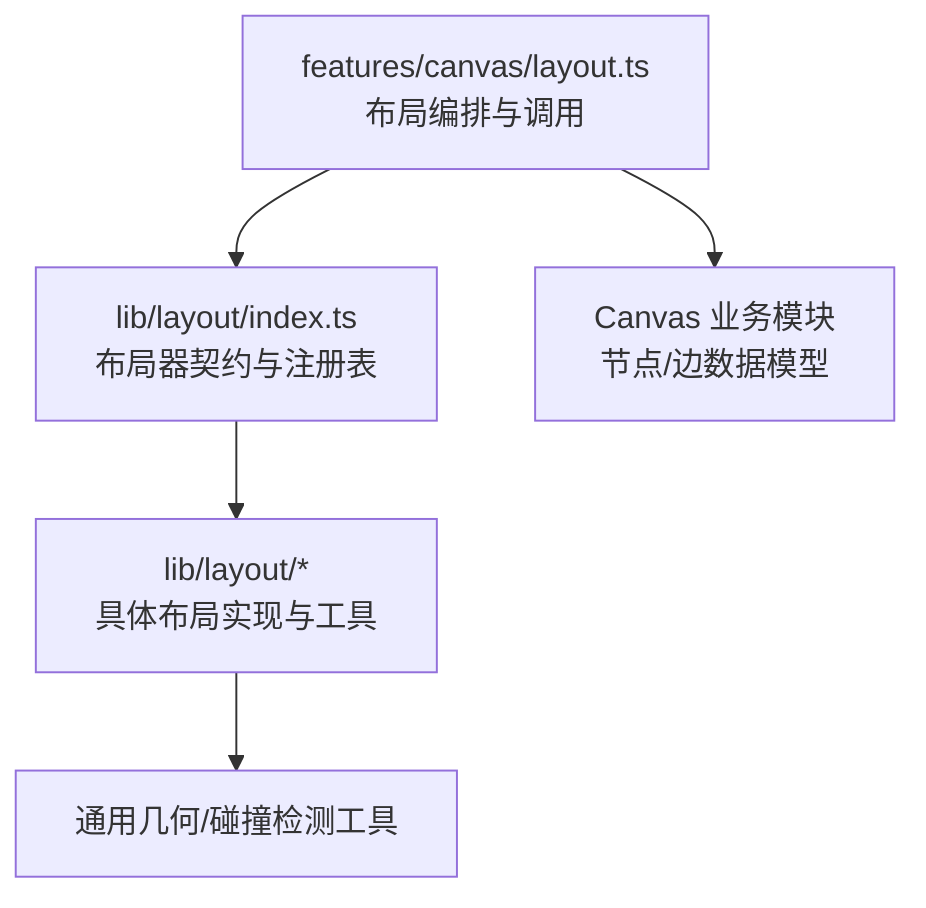
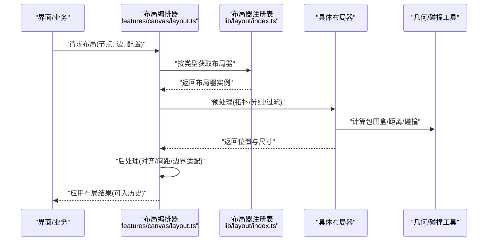
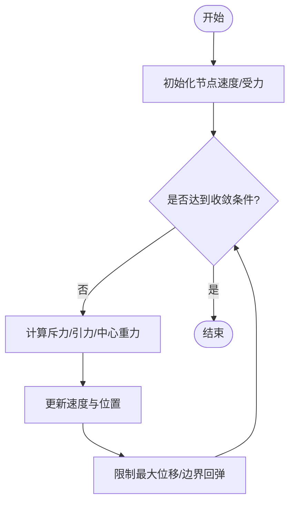
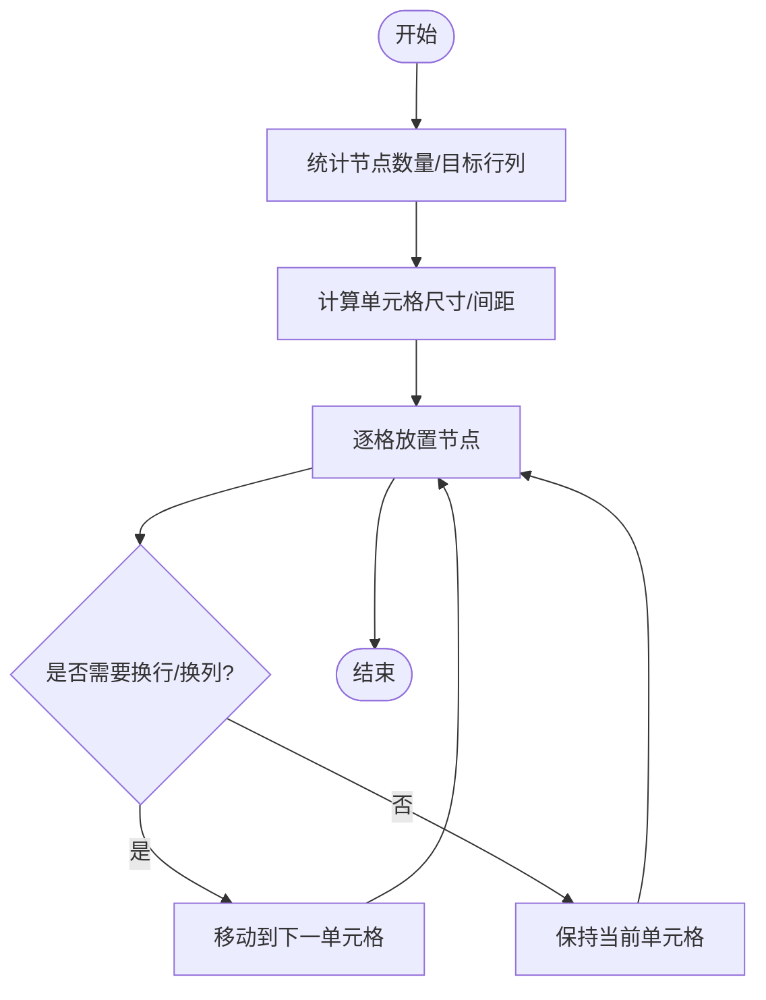
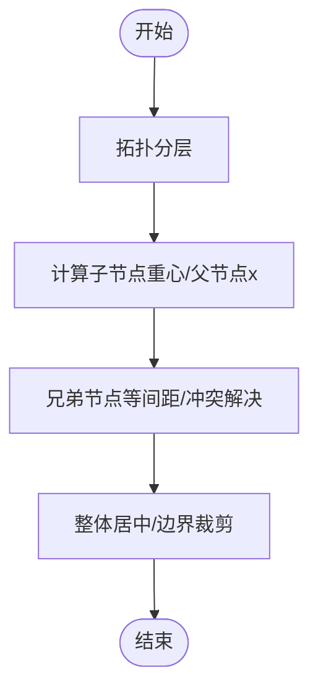
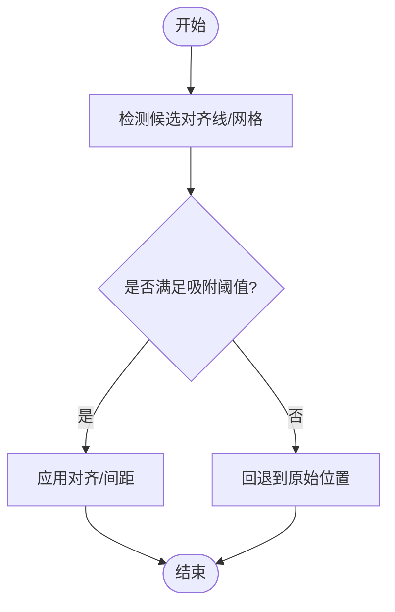
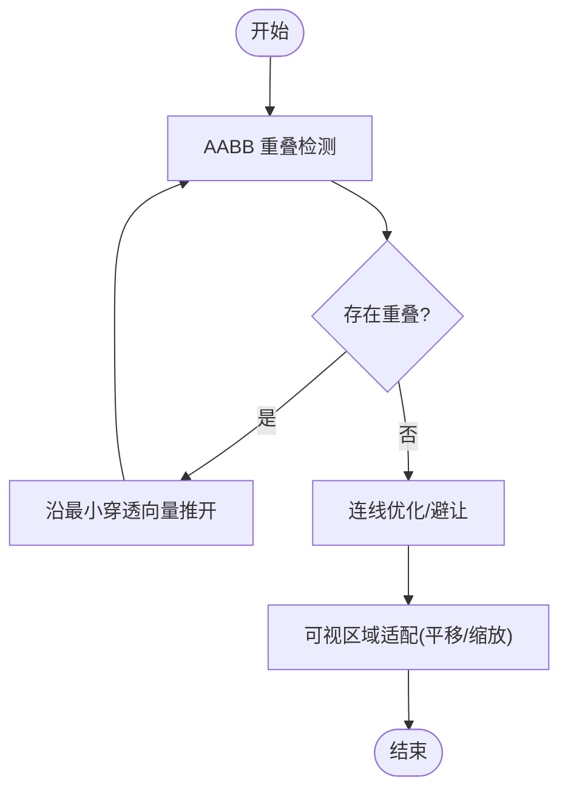
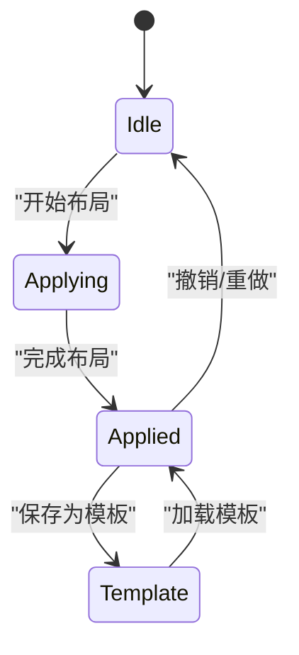
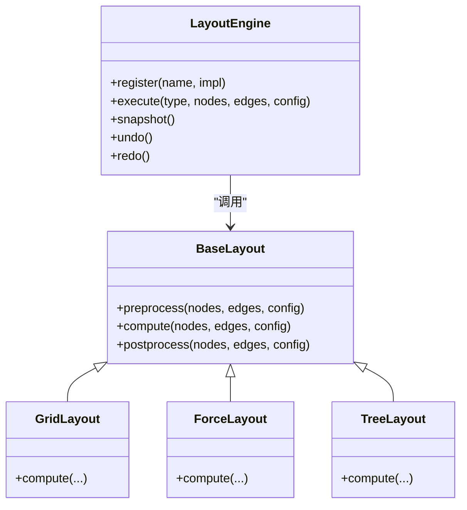
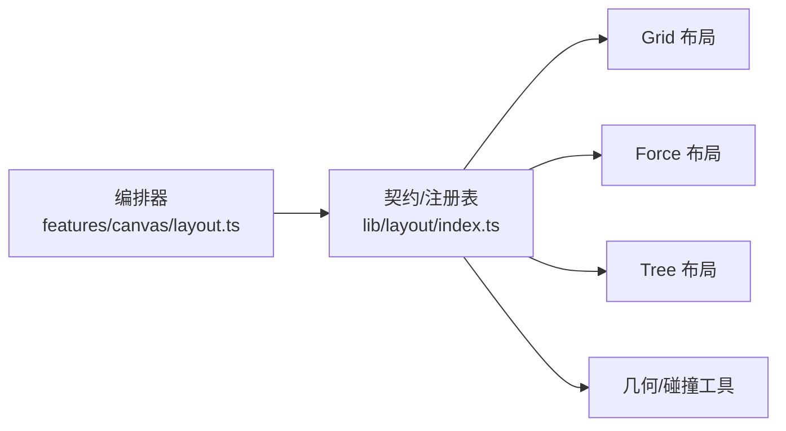

# 布局算法

<cite>
**本文引用的文件**   
- [src/features/canvas/layout.ts](file://src/features/canvas/layout.ts)
- [src/features/canvas/layout.test.ts](file://src/features/canvas/layout.test.ts)
- [src/lib/layout/index.ts](file://src/lib/layout/index.ts)
- [src/lib/layout/README.md](file://src/lib/layout/README.md)
</cite>

## 目录
1. [简介](#简介)
2. [项目结构](#项目结构)
3. [核心组件](#核心组件)
4. [架构总览](#架构总览)
5. [详细组件分析](#详细组件分析)
6. [依赖关系分析](#依赖关系分析)
7. [性能考量](#性能考量)
8. [故障排查指南](#故障排查指南)
9. [结论](#结论)
10. [附录](#附录)

## 简介
本文件面向“自动布局算法”的实现与使用，覆盖力导向、网格、树形等常见布局策略的适用场景；阐述节点对齐与间距计算机制（智能对齐、等间距分布、自适应布局）；说明布局优化（重叠检测、连线优化、可视区域适配）；解释布局状态管理（历史、撤销重做、模板）；提供自定义扩展方法（自定义布局器、约束配置）；并给出性能优化技巧与调试方法。

## 项目结构
本项目在 features/canvas 层暴露布局能力，lib/layout 层提供通用布局工具与扩展点。关键入口：
- src/features/canvas/layout.ts：对外暴露布局编排与调用接口，封装不同布局器的选择与执行流程。
- src/lib/layout/index.ts：定义布局器契约、注册表与默认实现集合，供上层按需选用或扩展。

图表来源
- [src/features/canvas/layout.ts](file://src/features/canvas/layout.ts)
- [src/lib/layout/index.ts](file://src/lib/layout/index.ts)

章节来源
- [src/features/canvas/layout.ts](file://src/features/canvas/layout.ts)
- [src/lib/layout/index.ts](file://src/lib/layout/index.ts)

## 核心组件
- 布局器契约与注册表：统一布局器输入输出、生命周期钩子与参数校验，支持动态注册与切换。
- 布局编排器：根据配置选择布局器，串联预处理（如拓扑排序）、布局计算、后处理（对齐、间距、边界适配）。
- 几何与碰撞工具：矩形相交、包围盒、距离度量、网格化分桶等基础能力。
- 状态与历史：记录布局快照、变更栈，支撑撤销/重做与模板恢复。

章节来源
- [src/lib/layout/index.ts](file://src/lib/layout/index.ts)
- [src/features/canvas/layout.ts](file://src/features/canvas/layout.ts)

## 架构总览
下图展示从业务侧触发布局到具体布局器执行的完整链路，以及数据在预处理、计算、后处理阶段的流转。

图表来源
- [src/features/canvas/layout.ts](file://src/features/canvas/layout.ts)
- [src/lib/layout/index.ts](file://src/lib/layout/index.ts)

## 详细组件分析

### 力导向布局
- 适用场景：复杂网络、无明确层级关系的图结构，强调自然舒展与连通性。
- 核心原理：节点间斥力、连线引力、阻尼与迭代收敛；可通过权重控制吸引/排斥强度。
- 关键步骤：
  - 初始化节点速度与受力
  - 每步计算斥力与引力，更新速度并限制最大位移
  - 中心重力防止漂移
  - 迭代至能量低于阈值或达到最大步数
- 优化要点：
  - 空间分桶减少 O(n^2) 斥力计算
  - 自适应步长与温度衰减加速收敛
  - 固定锚点节点不参与移动

章节来源
- [src/features/canvas/layout.ts](file://src/features/canvas/layout.ts)
- [src/lib/layout/index.ts](file://src/lib/layout/index.ts)

### 网格布局
- 适用场景：批量节点整齐排列、看板、清单类界面。
- 核心原理：将画布划分为规则网格，按行/列填充节点，支持等间距与自适应列数。
- 关键步骤：
  - 统计节点数量与目标行列
  - 计算单元格尺寸与间距
  - 逐格放置节点，必要时换行/换列
  - 可选：按内容宽度自适应列宽
- 优化要点：
  - 预分配数组避免频繁扩容
  - 批量更新位置减少重排

章节来源
- [src/features/canvas/layout.ts](file://src/features/canvas/layout.ts)
- [src/lib/layout/index.ts](file://src/lib/layout/index.ts)

### 树形布局
- 适用场景：有向层级结构（流程图、组织架构图），强调父子关系与层次清晰。
- 核心原理：自顶向下或自底向上分层，计算父节点重心对齐子节点，调整兄弟间距避免重叠。
- 关键步骤：
  - 拓扑分层（BFS/DFS）
  - 计算子节点重心并设置父节点 x
  - 兄弟节点等间距与冲突解决
  - 整体居中与边界裁剪
- 优化要点：
  - 增量更新仅重算受影响子树
  - 使用虚拟根节点简化边界处理

章节来源
- [src/features/canvas/layout.ts](file://src/features/canvas/layout.ts)
- [src/lib/layout/index.ts](file://src/lib/layout/index.ts)

### 节点对齐与间距计算
- 智能对齐：基于最近邻与网格吸附，支持水平/垂直/对角线对齐，允许阈值容差。
- 等间距分布：对选中的多个节点沿指定方向均匀分布，考虑节点尺寸与最小间距。
- 自适应布局：根据可视区域与节点总数动态调整行列、缩放比例与边距。

章节来源
- [src/features/canvas/layout.ts](file://src/features/canvas/layout.ts)
- [src/lib/layout/index.ts](file://src/lib/layout/index.ts)

### 布局优化策略
- 节点重叠检测：基于 AABB 包围盒快速判断，结合四叉树/网格分桶降低复杂度。
- 连线优化：折线拐角优化、曲线平滑、避免穿过节点；优先走空白区域。
- 可视区域适配：自动平移/缩放使所有节点可见，保留安全边距。

章节来源
- [src/features/canvas/layout.ts](file://src/features/canvas/layout.ts)
- [src/lib/layout/index.ts](file://src/lib/layout/index.ts)

### 布局状态管理
- 历史与撤销重做：每次布局前生成快照，变更入栈；支持撤销/重做到任意历史版本。
- 布局模板：保存常用布局参数与初始位置，一键恢复标准视图。
- 并发与一致性：布局操作加锁或合并批次，避免中间态闪烁。

章节来源
- [src/features/canvas/layout.ts](file://src/features/canvas/layout.ts)
- [src/lib/layout/index.ts](file://src/lib/layout/index.ts)

### 自定义扩展方法
- 自定义布局器：实现统一契约（输入节点/边、配置，输出位置/尺寸），注册到布局器注册表。
- 布局约束配置：通过配置对象声明对齐规则、间距、边界、权重等，驱动布局器行为。
- 插件式扩展：在预处理/后处理阶段注入钩子，实现特定领域逻辑（如按标签分组、颜色分区）。

图表来源
- [src/lib/layout/index.ts](file://src/lib/layout/index.ts)
- [src/features/canvas/layout.ts](file://src/features/canvas/layout.ts)

章节来源
- [src/lib/layout/index.ts](file://src/lib/layout/index.ts)
- [src/features/canvas/layout.ts](file://src/features/canvas/layout.ts)

## 依赖关系分析
- 低耦合：布局编排器仅依赖布局器契约与注册表，不关心具体实现细节。
- 可扩展：新增布局器只需实现契约并注册，无需修改编排逻辑。
- 工具复用：几何与碰撞工具被多布局共享，避免重复实现。

图表来源
- [src/features/canvas/layout.ts](file://src/features/canvas/layout.ts)
- [src/lib/layout/index.ts](file://src/lib/layout/index.ts)

章节来源
- [src/features/canvas/layout.ts](file://src/features/canvas/layout.ts)
- [src/lib/layout/index.ts](file://src/lib/layout/index.ts)

## 性能考量
- 时间复杂度：
  - 力导向：O(n^2) 朴素实现，借助分桶降至近似 O(n log n)。
  - 网格/树形：O(n) 线性放置与遍历。
- 内存占用：
  - 避免创建大量临时对象，复用缓冲区。
  - 快照采用增量差异存储，减少历史体积。
- 渲染优化：
  - 批量更新节点位置，减少重排与重绘。
  - 可视区域裁剪，仅绘制可见节点与连线。
- 交互体验：
  - 动画帧节流与防抖，避免高频布局导致卡顿。
  - 渐进式布局：先粗布局再细调。

[本节为通用指导，不直接分析具体文件]

## 故障排查指南
- 常见问题：
  - 节点重叠未解决：检查碰撞阈值与推开力度，确认分桶粒度。
  - 连线交叉严重：启用连线避让与曲线优化，调整节点尺寸。
  - 布局发散：增加中心重力与阻尼，限制最大位移。
  - 性能抖动：开启分桶、限制迭代次数、批量更新。
- 调试建议：
  - 打印布局前后坐标与能量值，观察收敛情况。
  - 可视化碰撞检测与吸附线，定位对齐问题。
  - 使用单元测试覆盖典型用例，确保回归稳定。

章节来源
- [src/features/canvas/layout.test.ts](file://src/features/canvas/layout.test.ts)
- [src/lib/layout/README.md](file://src/lib/layout/README.md)

## 结论
本布局体系以契约与注册表为核心，将力导向、网格、树形等算法统一抽象，配合几何与碰撞工具、状态管理与模板机制，形成可扩展、高性能且易用的自动布局方案。通过合理的优化策略与调试手段，可在大规模节点与复杂连线场景下保持稳定与流畅。

[本节为总结性内容，不直接分析具体文件]

## 附录
- 术语对照：
  - 力导向布局：Force-Directed Layout
  - 网格布局：Grid Layout
  - 树形布局：Tree Layout
  - 包围盒：Axis-Aligned Bounding Box (AABB)
  - 分桶：Spatial Bucketing
- 参考实现路径：
  - 布局编排与调用：[src/features/canvas/layout.ts](file://src/features/canvas/layout.ts)
  - 布局器契约与注册表：[src/lib/layout/index.ts](file://src/lib/layout/index.ts)
  - 测试与示例：[src/features/canvas/layout.test.ts](file://src/features/canvas/layout.test.ts)
  - 文档与约定：[src/lib/layout/README.md](file://src/lib/layout/README.md)