# 状态管理

<cite>
**本文引用的文件**   
- [src/features/canvas/types.ts](file://src/features/canvas/types.ts)
- [src/features/canvas/status.ts](file://src/features/canvas/status.ts)
- [src/features/canvas/layout.ts](file://src/features/canvas/layout.ts)
- [src/features/canvas/export-settings.ts](file://src/features/canvas/export-settings.ts)
- [src/features/canvas/fan-out.ts](file://src/features/canvas/fan-out.ts)
- [src/features/canvas/queries.ts](file://src/features/canvas/queries.ts)
- [src/app/products/(app)/canvas/[projectId]/page.tsx](file://src/app/products/(app)/canvas/[projectId]/page.tsx)
- [src/app/products/(app)/canvas/[projectId]/canvas-view.tsx](file://src/app/products/(app)/canvas/[projectId]/canvas-view.tsx)
- [src/app/products/(app)/canvas/[projectId]/canvas-action-api.ts](file://src/app/products/(app)/canvas/[projectId]/canvas-action-api.ts)
- [src/app/products/(app)/canvas/[projectId]/live-status.ts](file://src/app/products/(app)/canvas/[projectId]/live-status.ts)
- [src/app/products/(app)/canvas/[projectId]/pipeline-feedback.ts](file://src/app/products/(app)/canvas/[projectId]/pipeline-feedback.ts)
- [src/app/products/(app)/canvas/[projectId]/streaming-log-card.tsx](file://src/app/products/(app)/canvas/[projectId]/streaming-log-card.tsx)
- [src/app/products/(app)/export/[projectId]/export-api.ts](file://src/app/products/(app)/export/[projectId]/export-api.ts)
- [src/app/products/(app)/export/[projectId]/export-view-model.ts](file://src/app/products/(app)/export/[projectId]/export-view-model.ts)
- [src/lib/workflow/index.ts](file://src/lib/workflow/index.ts)
- [src/lib/workflow/state-machine.ts](file://src/lib/workflow/state-machine.ts)
- [server/src/server/job-runner.ts](file://server/src/server/job-runner.ts)
- [server/src/server/job-store.ts](file://server/src/server/job-store.ts)
- [server/src/compose/run-pipeline.ts](file://server/src/compose/run-pipeline.ts)
- [server/src/compose/pipeline.ts](file://server/src/compose/pipeline.ts)
- [server/src/capture/run-capture.ts](file://server/src/capture/run-capture.ts)
</cite>

## 目录
1. [简介](#简介)
2. [项目结构](#项目结构)
3. [核心组件](#核心组件)
4. [架构总览](#架构总览)
5. [详细组件分析](#详细组件分析)
6. [依赖关系分析](#依赖关系分析)
7. [性能考量](#性能考量)
8. [故障排查指南](#故障排查指南)
9. [结论](#结论)
10. [附录](#附录)

## 简介
本技术文档聚焦于画布状态管理的完整实现与运行机制，涵盖状态结构设计、变更追踪与同步、实时协作支持、冲突解决与一致性保证、持久化策略、版本控制与回滚、状态验证规则、错误恢复与异常处理、监控调试接口与性能优化等。目标是帮助开发者快速理解并扩展画布状态系统，确保在大规模更新与多端协作场景下的稳定性与可维护性。

## 项目结构
画布状态管理主要分布在客户端特性层与服务端执行层：
- 客户端特性层（src/features/canvas）：定义画布类型、状态机、布局、导出设置、扇出计算、查询封装等。
- 应用页面层（src/app/products/(app)/canvas）：承载画布视图、动作API、实时状态与流水线反馈、流式日志等。
- 服务端执行层（server/src）：负责流水线编排、作业调度、捕获任务执行与结果落库。
- 通用工作流库（src/lib/workflow）：提供通用的状态机与流程控制能力。

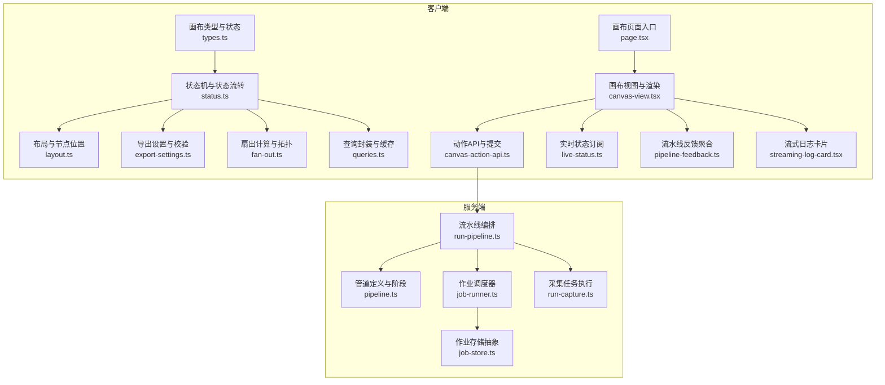

**图表来源** 
- [src/features/canvas/types.ts](file://src/features/canvas/types.ts)
- [src/features/canvas/status.ts](file://src/features/canvas/status.ts)
- [src/features/canvas/layout.ts](file://src/features/canvas/layout.ts)
- [src/features/canvas/export-settings.ts](file://src/features/canvas/export-settings.ts)
- [src/features/canvas/fan-out.ts](file://src/features/canvas/fan-out.ts)
- [src/features/canvas/queries.ts](file://src/features/canvas/queries.ts)
- [src/app/products/(app)/canvas/[projectId]/page.tsx](file://src/app/products/(app)/canvas/[projectId]/page.tsx)
- [src/app/products/(app)/canvas/[projectId]/canvas-view.tsx](file://src/app/products/(app)/canvas/[projectId]/canvas-view.tsx)
- [src/app/products/(app)/canvas/[projectId]/canvas-action-api.ts](file://src/app/products/(app)/canvas/[projectId]/canvas-action-api.ts)
- [src/app/products/(app)/canvas/[projectId]/live-status.ts](file://src/app/products/(app)/canvas/[projectId]/live-status.ts)
- [src/app/products/(app)/canvas/[projectId]/pipeline-feedback.ts](file://src/app/products/(app)/canvas/[projectId]/pipeline-feedback.ts)
- [src/app/products/(app)/canvas/[projectId]/streaming-log-card.tsx](file://src/app/products/(app)/canvas/[projectId]/streaming-log-card.tsx)
- [server/src/compose/run-pipeline.ts](file://server/src/compose/run-pipeline.ts)
- [server/src/compose/pipeline.ts](file://server/src/compose/pipeline.ts)
- [server/src/server/job-runner.ts](file://server/src/server/job-runner.ts)
- [server/src/server/job-store.ts](file://server/src/server/job-store.ts)
- [server/src/capture/run-capture.ts](file://server/src/capture/run-capture.ts)

**章节来源**
- [src/features/canvas/types.ts](file://src/features/canvas/types.ts)
- [src/features/canvas/status.ts](file://src/features/canvas/status.ts)
- [src/app/products/(app)/canvas/[projectId]/page.tsx](file://src/app/products/(app)/canvas/[projectId]/page.tsx)

## 核心组件
- 画布类型与状态模型：定义节点、边、阶段、导出配置、运行时元数据等核心数据结构，为状态机与序列化提供基础。
- 状态机与流转：基于通用工作流库的状态机，驱动画布从创建、编辑、校验、提交到渲染、导出、归档的全生命周期。
- 布局与几何：管理节点位置、尺寸、对齐、吸附与自动布局算法，确保可视化一致性与交互体验。
- 导出设置与校验：集中管理分辨率、帧率、编码参数、水印、输出格式等，并提供强约束校验。
- 扇出与拓扑：计算节点依赖、并行度、批大小与资源分配，支撑高并发渲染与内存控制。
- 查询与缓存：封装对画布数据的读取、增量更新与本地缓存策略，减少重复计算与网络开销。
- 实时状态与反馈：通过事件流与订阅机制，将服务端流水线进度、日志与错误推送到前端，保持界面一致。
- 动作API与提交：统一入口处理用户操作，进行前置校验、幂等控制、事务提交与回滚。

**章节来源**
- [src/features/canvas/types.ts](file://src/features/canvas/types.ts)
- [src/features/canvas/status.ts](file://src/features/canvas/status.ts)
- [src/features/canvas/layout.ts](file://src/features/canvas/layout.ts)
- [src/features/canvas/export-settings.ts](file://src/features/canvas/export-settings.ts)
- [src/features/canvas/fan-out.ts](file://src/features/canvas/fan-out.ts)
- [src/features/canvas/queries.ts](file://src/features/canvas/queries.ts)

## 架构总览
画布状态管理采用“前端状态机 + 后端流水线”的协同架构：
- 前端状态机驱动UI与交互，维护局部状态与乐观更新；通过动作API提交变更。
- 服务端流水线编排阶段任务，执行采集、处理、渲染、导出等操作，并将结果与日志推送给前端。
- 一致性通过版本号、校验和与幂等键保障；冲突解决采用合并策略与回滚机制。
- 持久化由作业存储抽象层统一管理，支持多种后端与快照回滚。

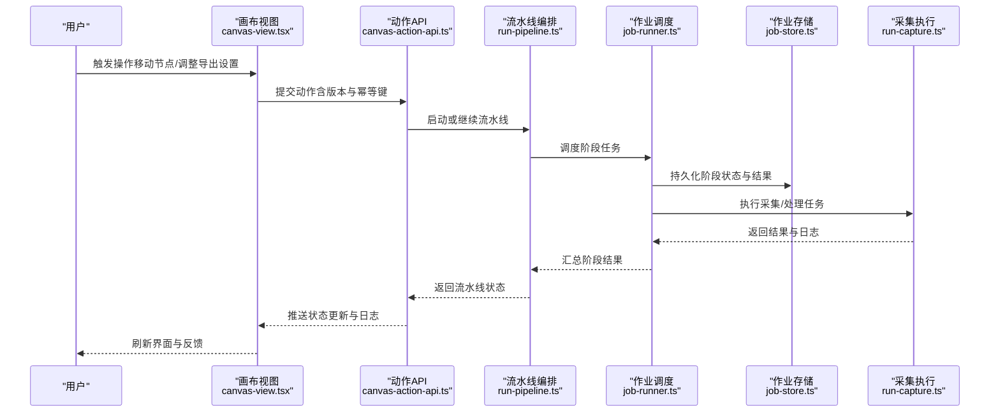

**图表来源** 
- [src/app/products/(app)/canvas/[projectId]/canvas-view.tsx](file://src/app/products/(app)/canvas/[projectId]/canvas-view.tsx)
- [src/app/products/(app)/canvas/[projectId]/canvas-action-api.ts](file://src/app/products/(app)/canvas/[projectId]/canvas-action-api.ts)
- [server/src/compose/run-pipeline.ts](file://server/src/compose/run-pipeline.ts)
- [server/src/server/job-runner.ts](file://server/src/server/job-runner.ts)
- [server/src/server/job-store.ts](file://server/src/server/job-store.ts)
- [server/src/capture/run-capture.ts](file://server/src/capture/run-capture.ts)

## 详细组件分析

### 状态机与状态流转
- 设计要点：使用通用状态机定义画布生命周期状态与转换条件，确保状态不可逆与一致性。
- 关键能力：进入/退出钩子、条件分支、超时与重试、事件广播。
- 与业务集成：状态变化触发布局重算、导出参数校验、流水线阶段推进。

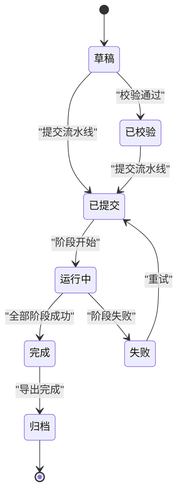

**图表来源** 
- [src/features/canvas/status.ts](file://src/features/canvas/status.ts)
- [src/lib/workflow/state-machine.ts](file://src/lib/workflow/state-machine.ts)

**章节来源**
- [src/features/canvas/status.ts](file://src/features/canvas/status.ts)
- [src/lib/workflow/state-machine.ts](file://src/lib/workflow/state-machine.ts)

### 布局与几何管理
- 节点模型：包含ID、类型、位置、尺寸、锚点、连接关系等。
- 布局算法：自动对齐、网格吸附、最小间距、边界检测。
- 性能优化：增量重排、视口裁剪、懒加载与虚拟滚动。

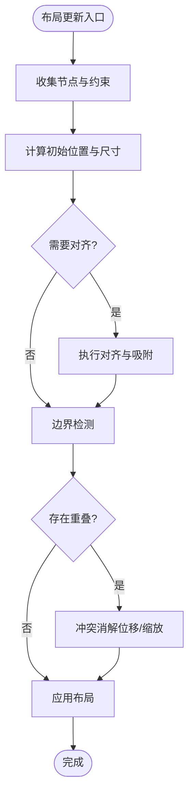

**图表来源** 
- [src/features/canvas/layout.ts](file://src/features/canvas/layout.ts)

**章节来源**
- [src/features/canvas/layout.ts](file://src/features/canvas/layout.ts)

### 导出设置与校验
- 参数集合：分辨率、帧率、编码格式、质量、水印、输出路径等。
- 校验规则：范围检查、兼容性检查、依赖项完整性。
- 默认策略：根据目标平台与设备推荐最佳配置。

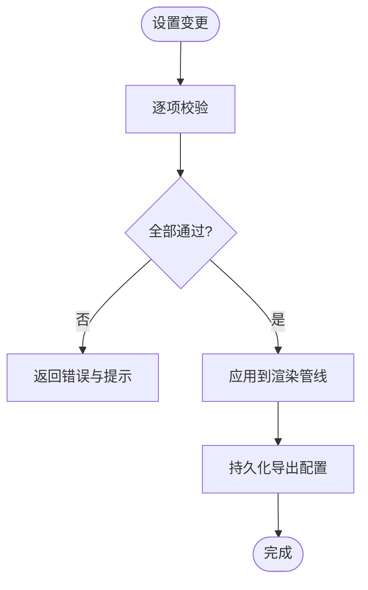

**图表来源** 
- [src/features/canvas/export-settings.ts](file://src/features/canvas/export-settings.ts)

**章节来源**
- [src/features/canvas/export-settings.ts](file://src/features/canvas/export-settings.ts)

### 扇出与拓扑计算
- 依赖图：构建节点间的有向无环图，识别并行度与瓶颈。
- 批处理：按阶段分组，控制并发与资源占用。
- 容错：失败节点重试、降级策略与熔断。

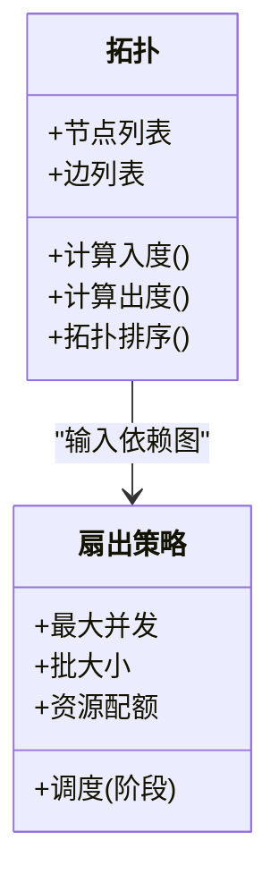

**图表来源** 
- [src/features/canvas/fan-out.ts](file://src/features/canvas/fan-out.ts)

**章节来源**
- [src/features/canvas/fan-out.ts](file://src/features/canvas/fan-out.ts)

### 查询与缓存
- 查询封装：提供统一的读取接口，支持过滤、分页与增量更新。
- 缓存策略：LRU、TTL、失效键管理与预取。
- 一致性：版本号与校验和比对，避免脏读。

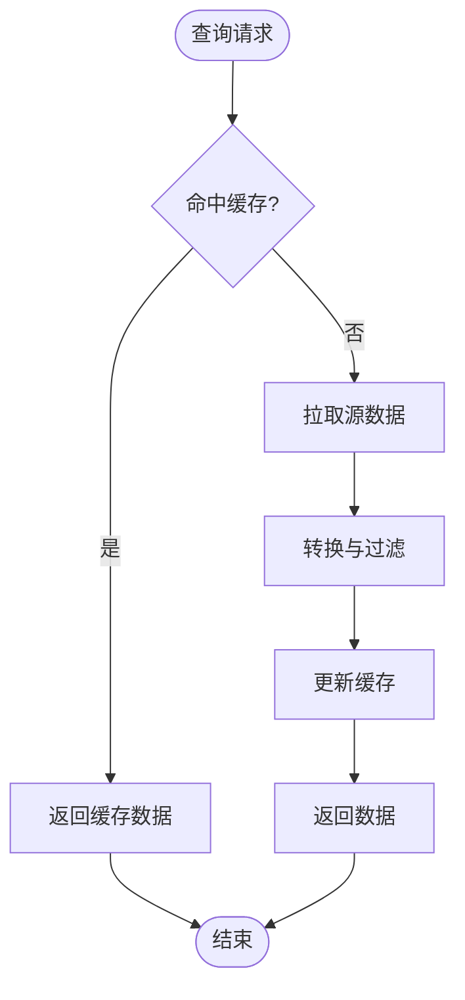

**图表来源** 
- [src/features/canvas/queries.ts](file://src/features/canvas/queries.ts)

**章节来源**
- [src/features/canvas/queries.ts](file://src/features/canvas/queries.ts)

### 实时状态与流水线反馈
- 事件流：服务端推送阶段状态、日志与错误，前端订阅并聚合展示。
- 去抖与合并：高频事件合并，减少UI抖动。
- 错误恢复：断线重连、状态回溯与补偿。

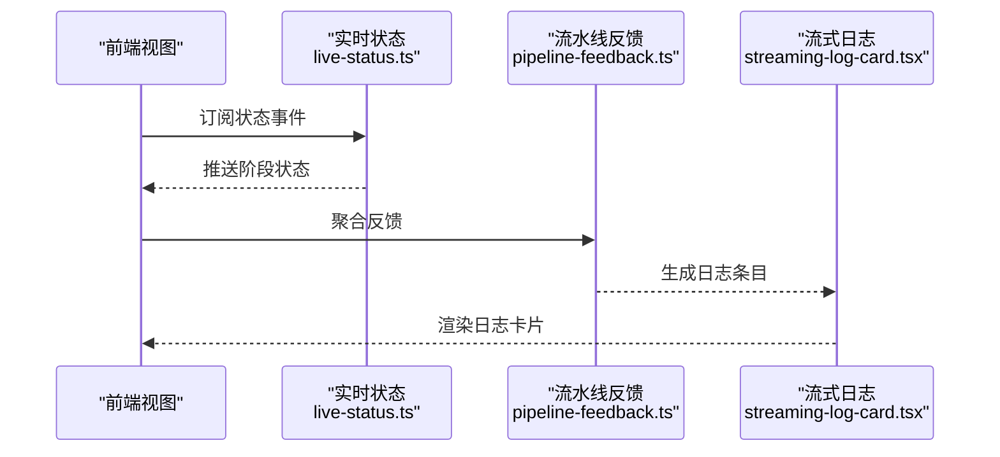

**图表来源** 
- [src/app/products/(app)/canvas/[projectId]/live-status.ts](file://src/app/products/(app)/canvas/[projectId]/live-status.ts)
- [src/app/products/(app)/canvas/[projectId]/pipeline-feedback.ts](file://src/app/products/(app)/canvas/[projectId]/pipeline-feedback.ts)
- [src/app/products/(app)/canvas/[projectId]/streaming-log-card.tsx](file://src/app/products/(app)/canvas/[projectId]/streaming-log-card.tsx)

**章节来源**
- [src/app/products/(app)/canvas/[projectId]/live-status.ts](file://src/app/products/(app)/canvas/[projectId]/live-status.ts)
- [src/app/products/(app)/canvas/[projectId]/pipeline-feedback.ts](file://src/app/products/(app)/canvas/[projectId]/pipeline-feedback.ts)
- [src/app/products/(app)/canvas/[projectId]/streaming-log-card.tsx](file://src/app/products/(app)/canvas/[projectId]/streaming-log-card.tsx)

### 动作API与提交
- 统一入口：接收用户动作，进行权限与参数校验。
- 幂等控制：基于幂等键与版本号防止重复提交。
- 事务与回滚：提交成功后持久化，失败时回滚并通知前端。

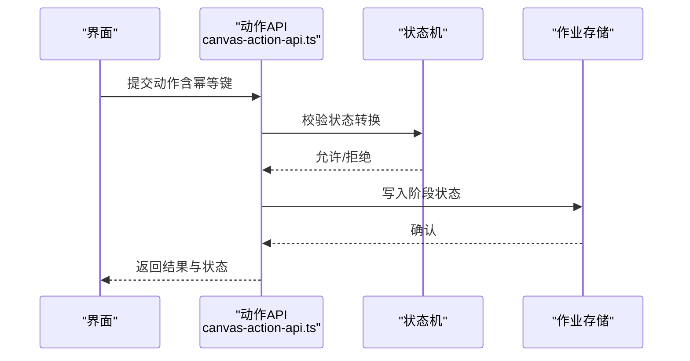

**图表来源** 
- [src/app/products/(app)/canvas/[projectId]/canvas-action-api.ts](file://src/app/products/(app)/canvas/[projectId]/canvas-action-api.ts)
- [src/features/canvas/status.ts](file://src/features/canvas/status.ts)
- [server/src/server/job-store.ts](file://server/src/server/job-store.ts)

**章节来源**
- [src/app/products/(app)/canvas/[projectId]/canvas-action-api.ts](file://src/app/products/(app)/canvas/[projectId]/canvas-action-api.ts)
- [src/features/canvas/status.ts](file://src/features/canvas/status.ts)
- [server/src/server/job-store.ts](file://server/src/server/job-store.ts)

### 导出视图模型与API
- 视图模型：封装导出任务的查询、状态与结果映射。
- API路由：提供导出任务的创建、查询与下载接口。
- 一致性：导出状态与流水线状态同步，避免不一致。

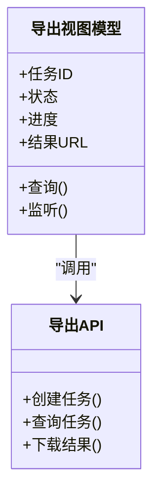

**图表来源** 
- [src/app/products/(app)/export/[projectId]/export-view-model.ts](file://src/app/products/(app)/export/[projectId]/export-view-model.ts)
- [src/app/products/(app)/export/[projectId]/export-api.ts](file://src/app/products/(app)/export/[projectId]/export-api.ts)

**章节来源**
- [src/app/products/(app)/export/[projectId]/export-view-model.ts](file://src/app/products/(app)/export/[projectId]/export-view-model.ts)
- [src/app/products/(app)/export/[projectId]/export-api.ts](file://src/app/products/(app)/export/[projectId]/export-api.ts)

## 依赖关系分析
- 模块内聚：状态机、布局、导出设置、扇出计算各自职责清晰，低耦合。
- 跨层依赖：前端视图依赖动作API与实时状态；服务端流水线依赖作业调度与存储。
- 外部集成：数据库、对象存储、消息队列等通过抽象层隔离。

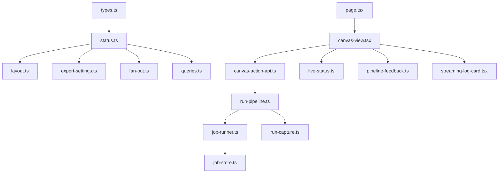

**图表来源** 
- [src/features/canvas/types.ts](file://src/features/canvas/types.ts)
- [src/features/canvas/status.ts](file://src/features/canvas/status.ts)
- [src/features/canvas/layout.ts](file://src/features/canvas/layout.ts)
- [src/features/canvas/export-settings.ts](file://src/features/canvas/export-settings.ts)
- [src/features/canvas/fan-out.ts](file://src/features/canvas/fan-out.ts)
- [src/features/canvas/queries.ts](file://src/features/canvas/queries.ts)
- [src/app/products/(app)/canvas/[projectId]/page.tsx](file://src/app/products/(app)/canvas/[projectId]/page.tsx)
- [src/app/products/(app)/canvas/[projectId]/canvas-view.tsx](file://src/app/products/(app)/canvas/[projectId]/canvas-view.tsx)
- [src/app/products/(app)/canvas/[projectId]/canvas-action-api.ts](file://src/app/products/(app)/canvas/[projectId]/canvas-action-api.ts)
- [src/app/products/(app)/canvas/[projectId]/live-status.ts](file://src/app/products/(app)/canvas/[projectId]/live-status.ts)
- [src/app/products/(app)/canvas/[projectId]/pipeline-feedback.ts](file://src/app/products/(app)/canvas/[projectId]/pipeline-feedback.ts)
- [src/app/products/(app)/canvas/[projectId]/streaming-log-card.tsx](file://src/app/products/(app)/canvas/[projectId]/streaming-log-card.tsx)
- [server/src/compose/run-pipeline.ts](file://server/src/compose/run-pipeline.ts)
- [server/src/server/job-runner.ts](file://server/src/server/job-runner.ts)
- [server/src/server/job-store.ts](file://server/src/server/job-store.ts)
- [server/src/capture/run-capture.ts](file://server/src/capture/run-capture.ts)

**章节来源**
- [src/features/canvas/types.ts](file://src/features/canvas/types.ts)
- [src/app/products/(app)/canvas/[projectId]/canvas-view.tsx](file://src/app/products/(app)/canvas/[projectId]/canvas-view.tsx)
- [server/src/compose/run-pipeline.ts](file://server/src/compose/run-pipeline.ts)

## 性能考量
- 增量更新：仅重算受影响节点与边，避免全量重排。
- 批量提交：合并多次用户操作为一次事务，降低锁竞争。
- 异步与背压：限制并发与队列长度，防止内存溢出。
- 缓存与预取：热点数据常驻内存，冷数据按需加载。
- 序列化优化：使用二进制或压缩格式传输大状态。

[本节为通用指导，不直接分析具体文件]

## 故障排查指南
- 常见错误：状态转换非法、校验失败、幂等键冲突、流水线阶段超时。
- 诊断工具：查看流式日志、阶段状态快照、作业存储记录。
- 恢复策略：回滚到上一版本、重试失败阶段、清理僵尸任务。
- 监控指标：阶段耗时、错误率、内存与CPU使用率。

**章节来源**
- [src/app/products/(app)/canvas/[projectId]/streaming-log-card.tsx](file://src/app/products/(app)/canvas/[projectId]/streaming-log-card.tsx)
- [server/src/server/job-store.ts](file://server/src/server/job-store.ts)

## 结论
画布状态管理通过清晰的状态机、严格的校验与幂等控制、高效的布局与扇出计算、以及前后端协同的流水线编排，实现了稳定、可扩展且高性能的状态系统。建议在后续迭代中持续优化缓存策略、增强冲突合并算法，并完善监控与告警体系，以支撑更大规模与更复杂的协作场景。

[本节为总结，不直接分析具体文件]

## 附录
- 术语表：状态机、幂等键、扇出、拓扑排序、回滚、快照。
- 参考设计：工作流状态机、作业调度与存储抽象、流水线编排模式。

[本节为概念性内容，不直接分析具体文件]