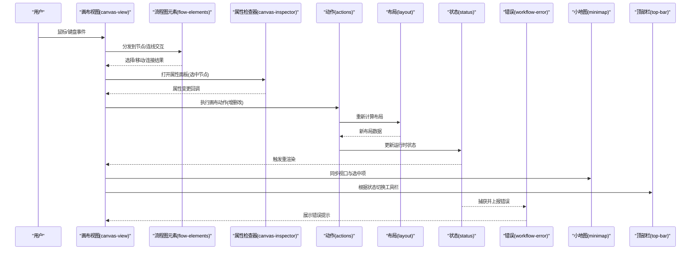
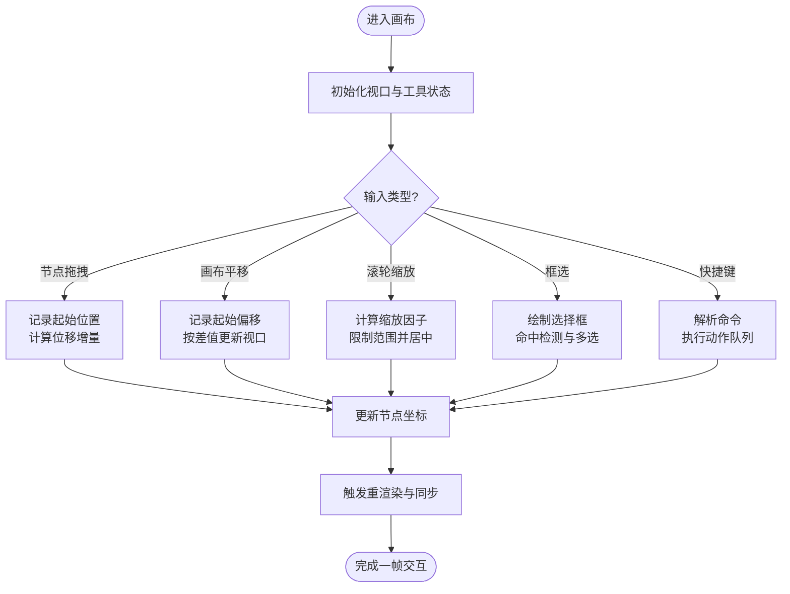
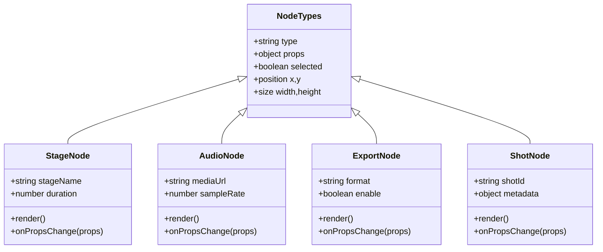
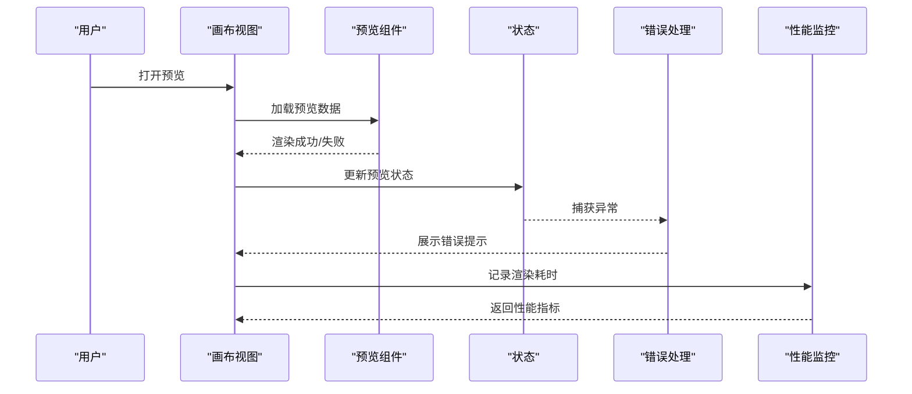
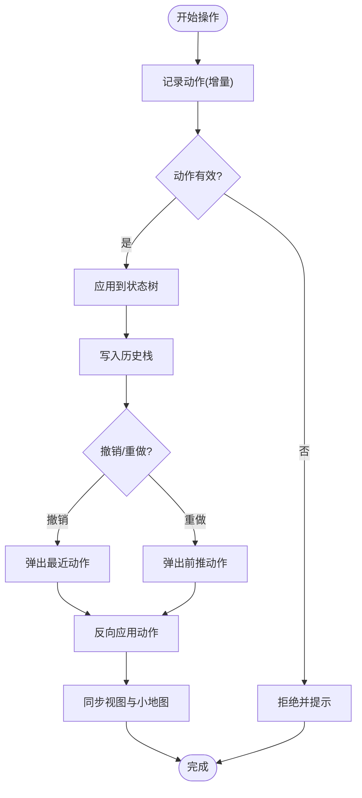
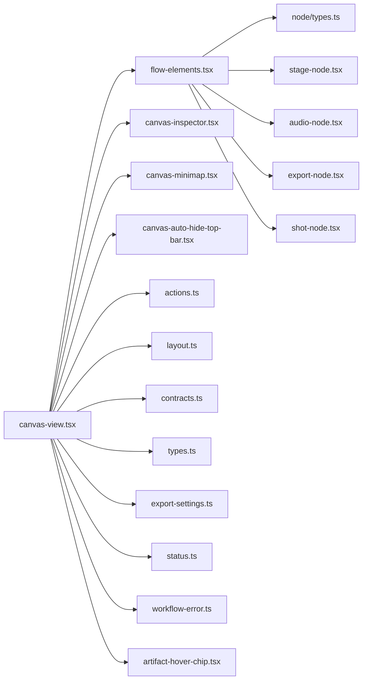

# 用户交互

<cite>
**本文引用的文件**   
- [canvas-view.tsx](file://src/app/products/(app)/canvas/[projectId]/canvas-view.tsx)
- [flow-elements.tsx](file://src/app/products/(app)/canvas/[projectId]/flow-elements.tsx)
- [canvas-inspector.tsx](file://src/app/products/(app)/canvas/[projectId]/canvas-inspector.tsx)
- [canvas-minimap.tsx](file://src/app/products/(app)/canvas/[projectId]/canvas-minimap.tsx)
- [canvas-auto-hide-top-bar.tsx](file://src/app/products/(app)/canvas/[projectId]/canvas-auto-hide-top-bar.tsx)
- [canvas-action-api.ts](file://src/app/products/(app)/canvas/[projectId]/canvas-action-api.ts)
- [actions.ts](file://src/features/canvas/actions.ts)
- [contracts.ts](file://src/features/canvas/contracts.ts)
- [types.ts](file://src/features/canvas/types.ts)
- [layout.ts](file://src/features/canvas/layout.ts)
- [export-settings.ts](file://src/features/canvas/export-settings.ts)
- [status.ts](file://src/features/canvas/status.ts)
- [workflow-error.ts](file://src/features/canvas/workflow-error.ts)
- [artifact-hover-chip.tsx](file://src/features/canvas/artifact-hover-chip.tsx)
- [node/stage-node.tsx](file://src/components/ui/node/stage-node.tsx)
- [node/audio-node.tsx](file://src/components/ui/node/audio-node.tsx)
- [node/export-node.tsx](file://src/components/ui/node/export-node.tsx)
- [node/shot-node.tsx](file://src/components/ui/node/shot-node.tsx)
- [node/types.ts](file://src/components/ui/node/types.ts)
- [top-bar.tsx](file://src/components/ui/top-bar.tsx)
- [sidebar.tsx](file://src/components/ui/sidebar.tsx)
- [popover.tsx](file://src/components/ui/popover.tsx)
- [tooltip.tsx](file://src/components/ui/tooltip.tsx)
- [toast.tsx](file://src/components/ui/toast.tsx)
- [settings-panel.tsx](file://src/components/ui/settings-panel.tsx)
- [settings-row.tsx](file://src/components/ui/settings-row.tsx)
- [media-viewport.tsx](file://src/components/ui/media-viewport.tsx)
- [queue-status-bar.tsx](file://src/components/ui/queue-status-bar.tsx)
- [progress-bar.tsx](file://src/components/ui/progress-bar.tsx)
- [resize-handle.tsx](file://src/components/ui/resize-handle.tsx)
- [hover-preview.tsx](file://src/components/ui/hover-preview.tsx)
- [app-shell.tsx](file://src/features/navigation/app-shell.tsx)
- [products-routes.ts](file://src/features/navigation/products-routes.ts)
</cite>

## 目录
1. [简介](#简介)
2. [项目结构](#项目结构)
3. [核心组件](#核心组件)
4. [架构总览](#架构总览)
5. [详细组件分析](#详细组件分析)
6. [依赖关系分析](#依赖关系分析)
7. [性能考量](#性能考量)
8. [故障排查指南](#故障排查指南)
9. [结论](#结论)
10. [附录](#附录)

## 简介
本文件面向开发者与产品使用者，系统化阐述 PurpleInk 画布的用户交互能力与实现要点。内容覆盖：
- 画布交互模式：拖拽、缩放平移、框选、快捷键
- 节点编辑界面：属性面板、连接线编辑、批量操作
- 预览与调试：实时预览、错误提示、性能监控
- 响应式设计与无障碍：多屏适配、触摸支持、可访问性
- 交互状态管理：历史、撤销重做、状态恢复
- 体验优化与扩展：最佳实践与自定义方法

## 项目结构
与用户交互相关的代码主要分布在以下位置：
- 应用层（页面与容器）：位于 src/app/products/(app)/canvas/[projectId] 下的视图与容器组件
- 功能域（Canvas 特性）：位于 src/features/canvas 的类型、布局、动作、导出设置、状态与错误处理
- UI 组件库：位于 src/components/ui 及 node 子目录，提供通用交互控件与节点渲染
- 导航与外壳：位于 src/features/navigation，负责应用壳与路由上下文

```mermaid
graph TB
subgraph "应用层"
CV["canvas-view.tsx"]
FE["flow-elements.tsx"]
CI["canvas-inspector.tsx"]
CM["canvas-minimap.tsx"]
ATB["canvas-auto-hide-top-bar.tsx"]
end
subgraph "功能域 Canvas"
ACT["actions.ts"]
CTR["contracts.ts"]
TYP["types.ts"]
LYT["layout.ts"]
EXP["export-settings.ts"]
STA["status.ts"]
ERR["workflow-error.ts"]
AHC["artifact-hover-chip.tsx"]
end
subgraph "UI 组件"
TOP["top-bar.tsx"]
SID["sidebar.tsx"]
POP["popover.tsx"]
TIP["tooltip.tsx"]
TOA["toast.tsx"]
SPN["settings-panel.tsx"]
SROW["settings-row.tsx"]
MVP["media-viewport.tsx"]
QSB["queue-status-bar.tsx"]
PGB["progress-bar.tsx"]
RH["resize-handle.tsx"]
HP["hover-preview.tsx"]
SN["stage-node.tsx"]
AN["audio-node.tsx"]
EN["export-node.tsx"]
SON["shot-node.tsx"]
NT["node/types.ts"]
end
subgraph "导航与外壳"
ASH["app-shell.tsx"]
PR["products-routes.ts"]
end
CV --> FE
CV --> CI
CV --> CM
CV --> ATB
FE --> SN
FE --> AN
FE --> EN
FE --> SON
FE --> NT
CV --> ACT
CV --> LYT
CV --> CTR
CV --> TYP
CV --> EXP
CV --> STA
CV --> ERR
CV --> AHC
CV --> TOP
CV --> SID
CV --> POP
CV --> TIP
CV --> TOA
CV --> SPN
CV --> SROW
CV --> MVP
CV --> QSB
CV --> PGB
CV --> RH
CV --> HP
ASH --> CV
PR --> CV
```

图表来源
- [canvas-view.tsx](file://src/app/products/(app)/canvas/[projectId]/canvas-view.tsx)
- [flow-elements.tsx](file://src/app/products/(app)/canvas/[projectId]/flow-elements.tsx)
- [canvas-inspector.tsx](file://src/app/products/(app)/canvas/[projectId]/canvas-inspector.tsx)
- [canvas-minimap.tsx](file://src/app/products/(app)/canvas/[projectId]/canvas-minimap.tsx)
- [canvas-auto-hide-top-bar.tsx](file://src/app/products/(app)/canvas/[projectId]/canvas-auto-hide-top-bar.tsx)
- [actions.ts](file://src/features/canvas/actions.ts)
- [contracts.ts](file://src/features/canvas/contracts.ts)
- [types.ts](file://src/features/canvas/types.ts)
- [layout.ts](file://src/features/canvas/layout.ts)
- [export-settings.ts](file://src/features/canvas/export-settings.ts)
- [status.ts](file://src/features/canvas/status.ts)
- [workflow-error.ts](file://src/features/canvas/workflow-error.ts)
- [artifact-hover-chip.tsx](file://src/features/canvas/artifact-hover-chip.tsx)
- [top-bar.tsx](file://src/components/ui/top-bar.tsx)
- [sidebar.tsx](file://src/components/ui/sidebar.tsx)
- [popover.tsx](file://src/components/ui/popover.tsx)
- [tooltip.tsx](file://src/components/ui/tooltip.tsx)
- [toast.tsx](file://src/components/ui/toast.tsx)
- [settings-panel.tsx](file://src/components/ui/settings-panel.tsx)
- [settings-row.tsx](file://src/components/ui/settings-row.tsx)
- [media-viewport.tsx](file://src/components/ui/media-viewport.tsx)
- [queue-status-bar.tsx](file://src/components/ui/queue-status-bar.tsx)
- [progress-bar.tsx](file://src/components/ui/progress-bar.tsx)
- [resize-handle.tsx](file://src/components/ui/resize-handle.tsx)
- [hover-preview.tsx](file://src/components/ui/hover-preview.tsx)
- [node/stage-node.tsx](file://src/components/ui/node/stage-node.tsx)
- [node/audio-node.tsx](file://src/components/ui/node/audio-node.tsx)
- [node/export-node.tsx](file://src/components/ui/node/export-node.tsx)
- [node/shot-node.tsx](file://src/components/ui/node/shot-node.tsx)
- [node/types.ts](file://src/components/ui/node/types.ts)
- [app-shell.tsx](file://src/features/navigation/app-shell.tsx)
- [products-routes.ts](file://src/features/navigation/products-routes.ts)

章节来源
- [canvas-view.tsx](file://src/app/products/(app)/canvas/[projectId]/canvas-view.tsx)
- [flow-elements.tsx](file://src/app/products/(app)/canvas/[projectId]/flow-elements.tsx)
- [canvas-inspector.tsx](file://src/app/products/(app)/canvas/[projectId]/canvas-inspector.tsx)
- [canvas-minimap.tsx](file://src/app/products/(app)/canvas/[projectId]/canvas-minimap.tsx)
- [canvas-auto-hide-top-bar.tsx](file://src/app/products/(app)/canvas/[projectId]/canvas-auto-hide-top-bar.tsx)
- [actions.ts](file://src/features/canvas/actions.ts)
- [contracts.ts](file://src/features/canvas/contracts.ts)
- [types.ts](file://src/features/canvas/types.ts)
- [layout.ts](file://src/features/canvas/layout.ts)
- [export-settings.ts](file://src/features/canvas/export-settings.ts)
- [status.ts](file://src/features/canvas/status.ts)
- [workflow-error.ts](file://src/features/canvas/workflow-error.ts)
- [artifact-hover-chip.tsx](file://src/features/canvas/artifact-hover-chip.tsx)
- [top-bar.tsx](file://src/components/ui/top-bar.tsx)
- [sidebar.tsx](file://src/components/ui/sidebar.tsx)
- [popover.tsx](file://src/components/ui/popover.tsx)
- [tooltip.tsx](file://src/components/ui/tooltip.tsx)
- [toast.tsx](file://src/components/ui/toast.tsx)
- [settings-panel.tsx](file://src/components/ui/settings-panel.tsx)
- [settings-row.tsx](file://src/components/ui/settings-row.tsx)
- [media-viewport.tsx](file://src/components/ui/media-viewport.tsx)
- [queue-status-bar.tsx](file://src/components/ui/queue-status-bar.tsx)
- [progress-bar.tsx](file://src/components/ui/progress-bar.tsx)
- [resize-handle.tsx](file://src/components/ui/resize-handle.tsx)
- [hover-preview.tsx](file://src/components/ui/hover-preview.tsx)
- [node/stage-node.tsx](file://src/components/ui/node/stage-node.tsx)
- [node/audio-node.tsx](file://src/components/ui/node/audio-node.tsx)
- [node/export-node.tsx](file://src/components/ui/node/export-node.tsx)
- [node/shot-node.tsx](file://src/components/ui/node/shot-node.tsx)
- [node/types.ts](file://src/components/ui/node/types.ts)
- [app-shell.tsx](file://src/features/navigation/app-shell.tsx)
- [products-routes.ts](file://src/features/navigation/products-routes.ts)

## 核心组件
- 画布视图容器：承载画布渲染、工具栏、缩略图、自动隐藏顶部栏等
- 流程图元素：统一渲染各类节点与连线，处理选择、拖拽、连接点交互
- 属性检查器：选中节点的属性编辑面板，支持字段校验与批量更新
- 小地图：快速定位与跳转，支持同步视口
- 动作与契约：封装画布操作的输入输出类型与副作用调用
- 布局与导出：计算节点布局、生成导出配置
- 状态与错误：运行时状态、工作流错误聚合与展示
- 悬浮提示：悬停时显示工件信息或快捷操作

章节来源
- [canvas-view.tsx](file://src/app/products/(app)/canvas/[projectId]/canvas-view.tsx)
- [flow-elements.tsx](file://src/app/products/(app)/canvas/[projectId]/flow-elements.tsx)
- [canvas-inspector.tsx](file://src/app/products/(app)/canvas/[projectId]/canvas-inspector.tsx)
- [canvas-minimap.tsx](file://src/app/products/(app)/canvas/[projectId]/canvas-minimap.tsx)
- [canvas-auto-hide-top-bar.tsx](file://src/app/products/(app)/canvas/[projectId]/canvas-auto-hide-top-bar.tsx)
- [actions.ts](file://src/features/canvas/actions.ts)
- [contracts.ts](file://src/features/canvas/contracts.ts)
- [types.ts](file://src/features/canvas/types.ts)
- [layout.ts](file://src/features/canvas/layout.ts)
- [export-settings.ts](file://src/features/canvas/export-settings.ts)
- [status.ts](file://src/features/canvas/status.ts)
- [workflow-error.ts](file://src/features/canvas/workflow-error.ts)
- [artifact-hover-chip.tsx](file://src/features/canvas/artifact-hover-chip.tsx)

## 架构总览
下图展示了从用户输入到画布渲染与状态更新的交互链路，以及关键 UI 组件的协作关系。

图表来源
- [canvas-view.tsx](file://src/app/products/(app)/canvas/[projectId]/canvas-view.tsx)
- [flow-elements.tsx](file://src/app/products/(app)/canvas/[projectId]/flow-elements.tsx)
- [canvas-inspector.tsx](file://src/app/products/(app)/canvas/[projectId]/canvas-inspector.tsx)
- [actions.ts](file://src/features/canvas/actions.ts)
- [layout.ts](file://src/features/canvas/layout.ts)
- [status.ts](file://src/features/canvas/status.ts)
- [workflow-error.ts](file://src/features/canvas/workflow-error.ts)
- [canvas-minimap.tsx](file://src/app/products/(app)/canvas/[projectId]/canvas-minimap.tsx)
- [top-bar.tsx](file://src/components/ui/top-bar.tsx)

## 详细组件分析

### 画布视图与交互模式
- 拖拽操作
  - 节点拖拽：通过流程图元素层监听指针事件，计算偏移量并更新节点坐标；在拖拽过程中保持层级与吸附对齐
  - 画布拖拽：按住中键或空格+拖拽进行画布平移，避免与节点拖拽冲突
- 缩放与平移
  - 滚轮缩放：以光标为中心缩放，限制最小/最大缩放比，保证可读性
  - 手势缩放：移动端双指捏合缩放，结合防抖与节流提升流畅度
- 框选操作
  - 矩形框选：按下左键拖动绘制选择框，命中检测基于边界框，支持多选与反选
- 快捷键支持
  - 常用快捷键：全选、复制粘贴、删除、撤销重做、聚焦搜索、切换工具
  - 组合键：Ctrl/Cmd + 点击多选，Shift + 点击范围选择，Esc 取消选择
- 视口与同步
  - 小地图联动：点击小地图区域跳转到对应视口，拖拽小地图指示当前可视范围
  - 顶部栏自动隐藏：滚动或交互后自动收起，最大化画布空间

图表来源
- [flow-elements.tsx](file://src/app/products/(app)/canvas/[projectId]/flow-elements.tsx)
- [canvas-view.tsx](file://src/app/products/(app)/canvas/[projectId]/canvas-view.tsx)
- [canvas-minimap.tsx](file://src/app/products/(app)/canvas/[projectId]/canvas-minimap.tsx)
- [top-bar.tsx](file://src/components/ui/top-bar.tsx)

章节来源
- [canvas-view.tsx](file://src/app/products/(app)/canvas/[projectId]/canvas-view.tsx)
- [flow-elements.tsx](file://src/app/products/(app)/canvas/[projectId]/flow-elements.tsx)
- [canvas-minimap.tsx](file://src/app/products/(app)/canvas/[projectId]/canvas-minimap.tsx)
- [canvas-auto-hide-top-bar.tsx](file://src/app/products/(app)/canvas/[projectId]/canvas-auto-hide-top-bar.tsx)

### 节点编辑界面
- 属性面板
  - 动态表单：根据节点类型渲染不同字段，支持文本、数值、下拉、开关等
  - 校验与反馈：实时校验必填与格式，错误高亮与提示
  - 批量编辑：多选节点后统一修改公共属性，支持差异合并
- 连接线编辑
  - 连接点吸附：靠近连接点时吸附，绘制贝塞尔曲线，支持断连与重连
  - 连线样式：线宽、颜色、箭头方向、虚线样式等
- 节点类型与渲染
  - 阶段节点、音频节点、导出节点、镜头节点等，各自携带专属属性与交互行为
  - 节点尺寸自适应：根据内容自动调整宽高，支持手动拖拽调整

图表来源
- [node/types.ts](file://src/components/ui/node/types.ts)
- [node/stage-node.tsx](file://src/components/ui/node/stage-node.tsx)
- [node/audio-node.tsx](file://src/components/ui/node/audio-node.tsx)
- [node/export-node.tsx](file://src/components/ui/node/export-node.tsx)
- [node/shot-node.tsx](file://src/components/ui/node/shot-node.tsx)

章节来源
- [canvas-inspector.tsx](file://src/app/products/(app)/canvas/[projectId]/canvas-inspector.tsx)
- [flow-elements.tsx](file://src/app/products/(app)/canvas/[projectId]/flow-elements.tsx)
- [node/types.ts](file://src/components/ui/node/types.ts)
- [node/stage-node.tsx](file://src/components/ui/node/stage-node.tsx)
- [node/audio-node.tsx](file://src/components/ui/node/audio-node.tsx)
- [node/export-node.tsx](file://src/components/ui/node/export-node.tsx)
- [node/shot-node.tsx](file://src/components/ui/node/shot-node.tsx)

### 预览与调试
- 实时预览
  - 节点预览：在属性面板或悬浮卡片中即时查看媒体或效果
  - 视口预览：在小地图或独立窗口中预览整体流程
- 错误提示
  - 工作流错误：集中收集并展示错误信息，支持定位到具体节点
  - 运行时错误：捕获异常并降级显示，避免崩溃
- 性能监控
  - 渲染耗时：统计每帧渲染时间，超限告警
  - 资源占用：监控内存与 GPU 使用，提示优化建议

图表来源
- [canvas-view.tsx](file://src/app/products/(app)/canvas/[projectId]/canvas-view.tsx)
- [workflow-error.ts](file://src/features/canvas/workflow-error.ts)
- [status.ts](file://src/features/canvas/status.ts)
- [media-viewport.tsx](file://src/components/ui/media-viewport.tsx)

章节来源
- [workflow-error.ts](file://src/features/canvas/workflow-error.ts)
- [status.ts](file://src/features/canvas/status.ts)
- [media-viewport.tsx](file://src/components/ui/media-viewport.tsx)

### 响应式设计与无障碍
- 多屏适配
  - 网格与弹性布局：根据屏幕宽度调整侧边栏与工具栏布局
  - 触控优先：大按钮、足够间距、手势友好
- 触摸设备支持
  - 多点触控：双指缩放、长按菜单、滑动平移
  - 虚拟按键：移动端显示必要控制按钮
- 无障碍访问
  - 键盘导航：Tab 顺序、焦点管理、快捷键映射
  - 语义化标签：ARIA 属性、屏幕阅读器支持
  - 对比度与字体：主题切换、字号放大

章节来源
- [top-bar.tsx](file://src/components/ui/top-bar.tsx)
- [sidebar.tsx](file://src/components/ui/sidebar.tsx)
- [popover.tsx](file://src/components/ui/popover.tsx)
- [tooltip.tsx](file://src/components/ui/tooltip.tsx)
- [toast.tsx](file://src/components/ui/toast.tsx)
- [settings-panel.tsx](file://src/components/ui/settings-panel.tsx)
- [settings-row.tsx](file://src/components/ui/settings-row.tsx)
- [resize-handle.tsx](file://src/components/ui/resize-handle.tsx)
- [hover-preview.tsx](file://src/components/ui/hover-preview.tsx)

### 交互状态管理
- 操作历史
  - 动作队列：将每次用户操作包装为不可变动作，支持向前/向后回放
  - 快照机制：关键节点保存快照，加速恢复
- 撤销重做
  - 快捷键绑定：Ctrl/Cmd + Z/Y 执行撤销重做
  - 条件过滤：忽略非用户操作（如网络请求）
- 状态恢复
  - 序列化：将画布状态序列化为 JSON，支持导入导出
  - 版本兼容：迁移脚本处理旧版本数据结构

图表来源
- [actions.ts](file://src/features/canvas/actions.ts)
- [contracts.ts](file://src/features/canvas/contracts.ts)
- [types.ts](file://src/features/canvas/types.ts)
- [status.ts](file://src/features/canvas/status.ts)

章节来源
- [actions.ts](file://src/features/canvas/actions.ts)
- [contracts.ts](file://src/features/canvas/contracts.ts)
- [types.ts](file://src/features/canvas/types.ts)
- [status.ts](file://src/features/canvas/status.ts)

### 最佳实践与自定义扩展
- 交互体验优化
  - 防抖与节流：对高频事件（滚动、缩放）进行限流
  - 懒加载：按需加载节点与媒体资源
  - 视觉反馈：拖拽阴影、选中高亮、连接点吸附提示
- 自定义扩展方法
  - 注册新节点类型：实现渲染与属性编辑接口
  - 扩展快捷键：注入命令处理器
  - 插件化动作：定义动作契约并在动作中心注册

章节来源
- [flow-elements.tsx](file://src/app/products/(app)/canvas/[projectId]/flow-elements.tsx)
- [canvas-inspector.tsx](file://src/app/products/(app)/canvas/[projectId]/canvas-inspector.tsx)
- [actions.ts](file://src/features/canvas/actions.ts)
- [contracts.ts](file://src/features/canvas/contracts.ts)
- [types.ts](file://src/features/canvas/types.ts)

## 依赖关系分析
- 组件耦合
  - 画布视图依赖流程图元素、属性检查器、小地图与顶部栏
  - 流程图元素依赖节点类型定义与各节点渲染组件
  - 动作模块依赖类型契约与状态管理
- 外部集成
  - API 调用：通过 canvas-action-api 与后端交互
  - 存储：持久化状态与历史记录
- 潜在循环依赖
  - 通过契约与类型解耦，避免直接循环引用

图表来源
- [canvas-view.tsx](file://src/app/products/(app)/canvas/[projectId]/canvas-view.tsx)
- [flow-elements.tsx](file://src/app/products/(app)/canvas/[projectId]/flow-elements.tsx)
- [canvas-inspector.tsx](file://src/app/products/(app)/canvas/[projectId]/canvas-inspector.tsx)
- [canvas-minimap.tsx](file://src/app/products/(app)/canvas/[projectId]/canvas-minimap.tsx)
- [canvas-auto-hide-top-bar.tsx](file://src/app/products/(app)/canvas/[projectId]/canvas-auto-hide-top-bar.tsx)
- [actions.ts](file://src/features/canvas/actions.ts)
- [contracts.ts](file://src/features/canvas/contracts.ts)
- [types.ts](file://src/features/canvas/types.ts)
- [layout.ts](file://src/features/canvas/layout.ts)
- [export-settings.ts](file://src/features/canvas/export-settings.ts)
- [status.ts](file://src/features/canvas/status.ts)
- [workflow-error.ts](file://src/features/canvas/workflow-error.ts)
- [artifact-hover-chip.tsx](file://src/features/canvas/artifact-hover-chip.tsx)
- [node/types.ts](file://src/components/ui/node/types.ts)
- [node/stage-node.tsx](file://src/components/ui/node/stage-node.tsx)
- [node/audio-node.tsx](file://src/components/ui/node/audio-node.tsx)
- [node/export-node.tsx](file://src/components/ui/node/export-node.tsx)
- [node/shot-node.tsx](file://src/components/ui/node/shot-node.tsx)

章节来源
- [canvas-view.tsx](file://src/app/products/(app)/canvas/[projectId]/canvas-view.tsx)
- [flow-elements.tsx](file://src/app/products/(app)/canvas/[projectId]/flow-elements.tsx)
- [canvas-inspector.tsx](file://src/app/products/(app)/canvas/[projectId]/canvas-inspector.tsx)
- [canvas-minimap.tsx](file://src/app/products/(app)/canvas/[projectId]/canvas-minimap.tsx)
- [canvas-auto-hide-top-bar.tsx](file://src/app/products/(app)/canvas/[projectId]/canvas-auto-hide-top-bar.tsx)
- [actions.ts](file://src/features/canvas/actions.ts)
- [contracts.ts](file://src/features/canvas/contracts.ts)
- [types.ts](file://src/features/canvas/types.ts)
- [layout.ts](file://src/features/canvas/layout.ts)
- [export-settings.ts](file://src/features/canvas/export-settings.ts)
- [status.ts](file://src/features/canvas/status.ts)
- [workflow-error.ts](file://src/features/canvas/workflow-error.ts)
- [artifact-hover-chip.tsx](file://src/features/canvas/artifact-hover-chip.tsx)
- [node/types.ts](file://src/components/ui/node/types.ts)
- [node/stage-node.tsx](file://src/components/ui/node/stage-node.tsx)
- [node/audio-node.tsx](file://src/components/ui/node/audio-node.tsx)
- [node/export-node.tsx](file://src/components/ui/node/export-node.tsx)
- [node/shot-node.tsx](file://src/components/ui/node/shot-node.tsx)

## 性能考量
- 渲染优化
  - 虚拟化列表：大量节点时使用虚拟滚动减少 DOM 压力
  - 增量更新：仅重绘变化节点，避免全量刷新
- 事件处理
  - 事件委托：在父容器统一处理指针事件，降低监听器数量
  - 防抖节流：对缩放、平移等高频事件进行限流
- 资源管理
  - 懒加载：按需加载媒体与图标资源
  - 缓存策略：对频繁使用的数据进行本地缓存

[本节为通用指导，不直接分析具体文件]

## 故障排查指南
- 常见问题
  - 拖拽卡顿：检查事件监听是否过多，确认防抖节流是否生效
  - 缩放异常：验证缩放范围限制与中心点计算
  - 框选失效：检查命中检测逻辑与层级关系
  - 属性面板不更新：确认状态同步与表单绑定是否正确
- 调试技巧
  - 启用日志：在关键路径打印状态变化
  - 性能分析：使用浏览器性能面板定位瓶颈
  - 错误追踪：集中收集并上报错误堆栈

章节来源
- [workflow-error.ts](file://src/features/canvas/workflow-error.ts)
- [status.ts](file://src/features/canvas/status.ts)
- [toast.tsx](file://src/components/ui/toast.tsx)
- [queue-status-bar.tsx](file://src/components/ui/queue-status-bar.tsx)
- [progress-bar.tsx](file://src/components/ui/progress-bar.tsx)

## 结论
PurpleInk 的画布交互体系以清晰的组件分层与契约驱动为核心，实现了丰富的交互能力与良好的可扩展性。通过合理的状态管理与性能优化，能够在多端设备上提供流畅、直观的操作体验。建议在后续迭代中持续完善无障碍支持与移动端手势，进一步提升用户体验。

[本节为总结性内容，不直接分析具体文件]

## 附录
- 术语表
  - 画布：用户编辑流程图的主界面
  - 节点：流程中的基本单元，具有属性与行为
  - 连接线：节点之间的数据或控制流
  - 属性面板：编辑节点属性的侧边面板
  - 小地图：辅助定位与导航的概览视图
- 参考文件
  - 应用外壳与路由：app-shell.tsx、products-routes.ts
  - UI 组件：top-bar.tsx、sidebar.tsx、popover.tsx、tooltip.tsx、toast.tsx、settings-panel.tsx、settings-row.tsx、media-viewport.tsx、queue-status-bar.tsx、progress-bar.tsx、resize-handle.tsx、hover-preview.tsx

[本节为补充信息，不直接分析具体文件]