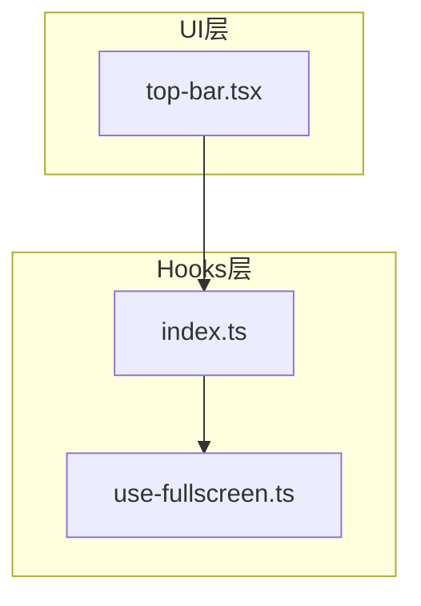
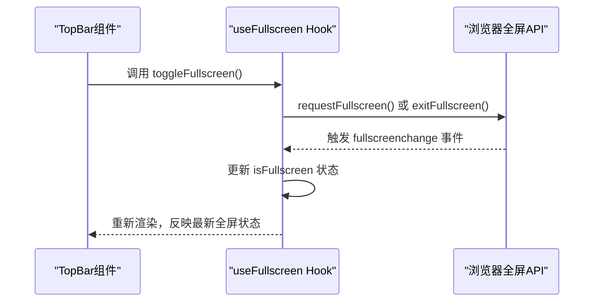
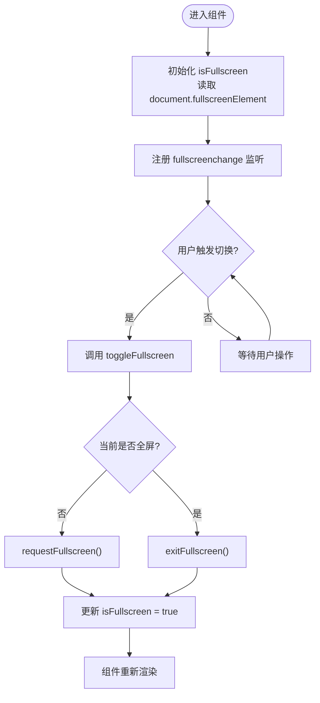
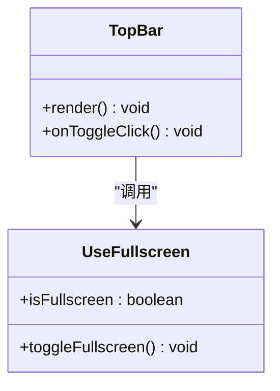
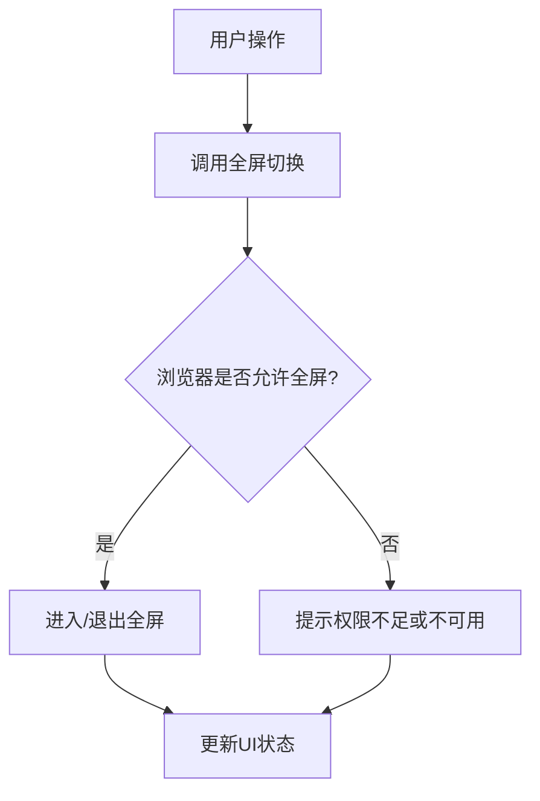
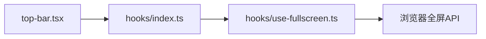

# 全屏功能Hook

<cite>
**本文档引用的文件**   
- [src/lib/hooks/index.ts](file://src/lib/hooks/index.ts)
- [src/lib/hooks/use-fullscreen.ts](file://src/lib/hooks/use-fullscreen.ts)
- [src/components/ui/top-bar.tsx](file://src/components/ui/top-bar.tsx)
</cite>

## 目录
1. [简介](#简介)
2. [项目结构](#项目结构)
3. [核心组件](#核心组件)
4. [架构总览](#架构总览)
5. [详细组件分析](#详细组件分析)
6. [依赖分析](#依赖分析)
7. [性能考量](#性能考量)
8. [故障排查指南](#故障排查指南)
9. [结论](#结论)
10. [附录](#附录)

## 简介
本文件聚焦于“全屏功能Hook”的实现与使用，旨在帮助开发者快速理解并集成全屏能力。该Hook封装了浏览器全屏API的调用、状态同步与事件监听，提供简洁易用的接口，便于在React组件中切换和查询全屏状态。

## 项目结构
围绕全屏功能的代码主要位于以下位置：
- Hook实现：位于 lib/hooks 目录下的 use-fullscreen.ts
- Hook聚合导出：位于 lib/hooks/index.ts
- UI集成示例：位于 components/ui/top-bar.tsx（用于触发或展示全屏状态）

图表来源
- [src/lib/hooks/use-fullscreen.ts](file://src/lib/hooks/use-fullscreen.ts)
- [src/lib/hooks/index.ts](file://src/lib/hooks/index.ts)
- [src/components/ui/top-bar.tsx](file://src/components/ui/top-bar.tsx)

章节来源
- [src/lib/hooks/index.ts](file://src/lib/hooks/index.ts)
- [src/lib/hooks/use-fullscreen.ts](file://src/lib/hooks/use-fullscreen.ts)
- [src/components/ui/top-bar.tsx](file://src/components/ui/top-bar.tsx)

## 核心组件
- useFullscreen Hook
  - 职责：封装 requestFullscreen / exitFullscreen 调用，维护 isFullscreen 状态，订阅 fullscreenchange 事件，处理权限与兼容性差异。
  - 典型用法：在组件中调用 Hook，获取 isFullscreen 布尔值与 toggleFullscreen 函数；在需要时调用 toggle 进入/退出全屏。
- top-bar 组件
  - 职责：作为用户交互入口，提供按钮或开关以触发全屏切换，并可显示当前全屏状态。

章节来源
- [src/lib/hooks/use-fullscreen.ts](file://src/lib/hooks/use-fullscreen.ts)
- [src/components/ui/top-bar.tsx](file://src/components/ui/top-bar.tsx)

## 架构总览
下图展示了从UI到Hook再到浏览器API的调用链路，以及状态变化如何回传到UI。

图表来源
- [src/lib/hooks/use-fullscreen.ts](file://src/lib/hooks/use-fullscreen.ts)
- [src/components/ui/top-bar.tsx](file://src/components/ui/top-bar.tsx)

## 详细组件分析

### useFullscreen Hook 分析
- 设计要点
  - 状态管理：维护 isFullscreen 布尔值，初始值通过 document.fullscreenElement 判断。
  - 事件监听：订阅 document 的 fullscreenchange 事件，确保状态与浏览器一致。
  - API封装：暴露 toggleFullscreen 方法，内部根据当前状态选择进入或退出全屏。
  - 兼容性与错误处理：捕获无权限或不可用场景，避免崩溃并提供降级行为。
- 复杂度与性能
  - 时间复杂度：toggle 操作为 O(1)，事件回调为 O(1)。
  - 空间复杂度：仅维护少量状态与事件监听器引用。
  - 优化建议：仅在客户端执行相关逻辑，避免服务端渲染副作用；必要时对事件监听进行防抖/节流（通常不需要）。

图表来源
- [src/lib/hooks/use-fullscreen.ts](file://src/lib/hooks/use-fullscreen.ts)

章节来源
- [src/lib/hooks/use-fullscreen.ts](file://src/lib/hooks/use-fullscreen.ts)

### TopBar 组件集成分析
- 职责边界
  - 提供用户交互入口（按钮/开关），调用 Hook 的 toggle 方法。
  - 可选地显示当前全屏状态，提升可感知性。
- 集成方式
  - 导入 useFullscreen Hook，并在组件内调用获取状态与方法。
  - 将 toggle 绑定到按钮点击事件，确保无障碍访问（如键盘快捷键支持）。

图表来源
- [src/components/ui/top-bar.tsx](file://src/components/ui/top-bar.tsx)
- [src/lib/hooks/use-fullscreen.ts](file://src/lib/hooks/use-fullscreen.ts)

章节来源
- [src/components/ui/top-bar.tsx](file://src/components/ui/top-bar.tsx)
- [src/lib/hooks/use-fullscreen.ts](file://src/lib/hooks/use-fullscreen.ts)

### 概念总览
下图为不绑定具体源码的概念流程图，说明全屏切换的一般步骤与注意事项。

[本图为概念流程，不直接映射到具体源码文件]

## 依赖分析
- 模块耦合
  - top-bar 组件依赖 useFullscreen Hook（通过 index.ts 聚合导出）。
  - useFullscreen Hook 依赖浏览器全局对象（document、window）及全屏API。
- 外部依赖
  - 浏览器全屏API在不同环境下的可用性需做兼容判断。
- 潜在循环依赖
  - 当前结构清晰，未见循环依赖风险。

图表来源
- [src/components/ui/top-bar.tsx](file://src/components/ui/top-bar.tsx)
- [src/lib/hooks/index.ts](file://src/lib/hooks/index.ts)
- [src/lib/hooks/use-fullscreen.ts](file://src/lib/hooks/use-fullscreen.ts)

章节来源
- [src/lib/hooks/index.ts](file://src/lib/hooks/index.ts)
- [src/lib/hooks/use-fullscreen.ts](file://src/lib/hooks/use-fullscreen.ts)
- [src/components/ui/top-bar.tsx](file://src/components/ui/top-bar.tsx)

## 性能考量
- 事件监听开销：fullscreenchange 事件频率低，无需额外节流。
- 渲染成本：状态变更触发一次重渲染，影响范围可控。
- 服务端渲染：确保Hook仅在客户端执行，避免SSR阶段访问浏览器API。
- 内存占用：保持单一事件监听器，避免重复注册导致泄漏。

## 故障排查指南
- 常见问题
  - 权限问题：某些页面或元素不允许全屏，需检查调用上下文与策略。
  - 非浏览器环境：在服务端或Web Worker中调用会失败，应增加环境检测。
  - 状态不同步：若未正确订阅 fullscreenchange，可能导致UI与实际状态不一致。
- 调试建议
  - 打印 isFullscreen 变化与异常信息。
  - 在开发环境开启更详细的日志输出。
  - 验证事件监听是否正确注册与清理。

章节来源
- [src/lib/hooks/use-fullscreen.ts](file://src/lib/hooks/use-fullscreen.ts)

## 结论
useFullscreen Hook 提供了稳定、易用的全屏能力封装，结合 top-bar 组件可实现直观的用户交互。建议在项目中统一使用该Hook，以确保全屏行为的一致性与可维护性。

## 附录
- 最佳实践
  - 始终在客户端环境中调用全屏API。
  - 为用户提供清晰的反馈（如按钮文案随状态变化）。
  - 处理权限拒绝与不可用场景，保证用户体验。
- 扩展方向
  - 支持自定义元素全屏（如特定容器）。
  - 添加快捷键支持（如 ESC 退出全屏）。
  - 与其他全屏相关特性（如指针锁定）联动。