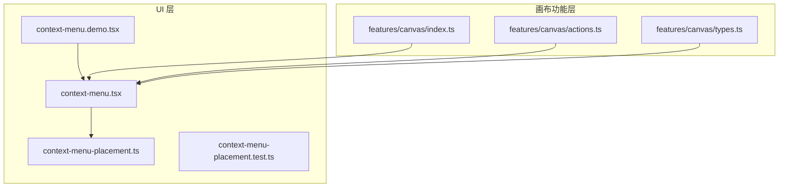
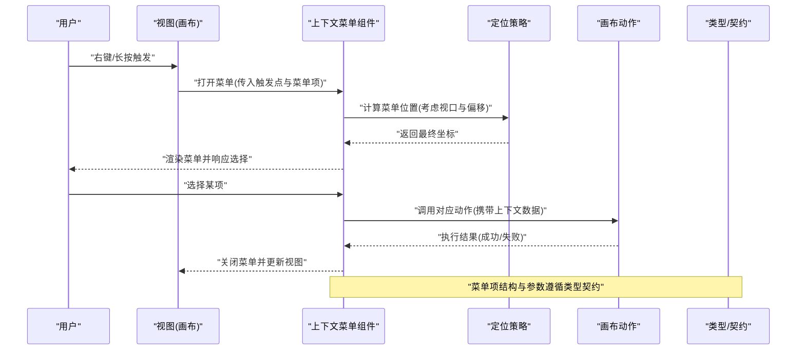
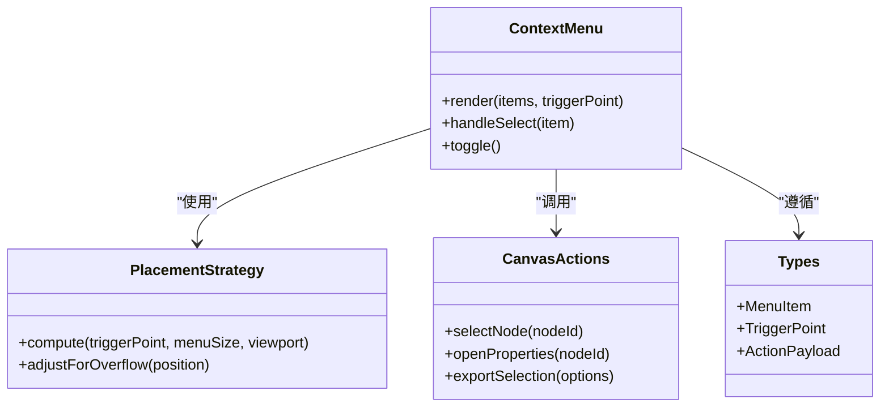
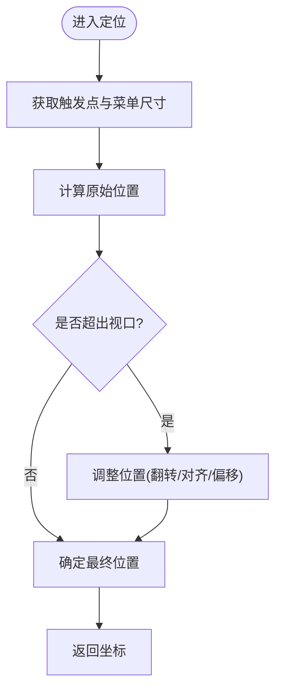
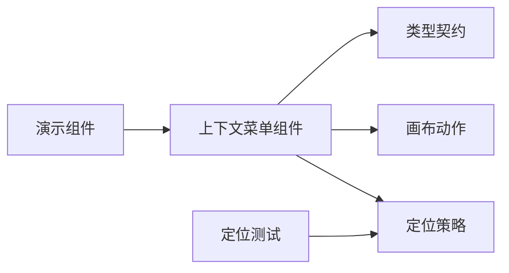

# 画布上下文菜单系统

<cite>
**本文引用的文件**   
- [src/components/ui/context-menu.tsx](file://src/components/ui/context-menu.tsx)
- [src/components/ui/context-menu-placement.ts](file://src/components/ui/context-menu-placement.ts)
- [src/components/ui/context-menu.demo.tsx](file://src/components/ui/context-menu.demo.tsx)
- [src/components/ui/context-menu-placement.test.ts](file://src/components/ui/context-menu-placement.test.ts)
- [src/features/canvas/index.ts](file://src/features/canvas/index.ts)
- [src/features/canvas/actions.ts](file://src/features/canvas/actions.ts)
- [src/features/canvas/types.ts](file://src/features/canvas/types.ts)
</cite>

## 目录
1. [简介](#简介)
2. [项目结构](#项目结构)
3. [核心组件](#核心组件)
4. [架构总览](#架构总览)
5. [详细组件分析](#详细组件分析)
6. [依赖分析](#依赖分析)
7. [性能考虑](#性能考虑)
8. [故障排查指南](#故障排查指南)
9. [结论](#结论)
10. [附录](#附录)

## 简介
本文件聚焦于“画布上下文菜单系统”的设计与实现，围绕通用上下文菜单能力、定位策略以及与画布模块的集成进行系统化说明。目标是帮助开发者快速理解：
- 上下文菜单的渲染与交互流程
- 定位算法与边界处理
- 与画布动作（如选中、编辑、导出等）的对接方式
- 可测试性与可扩展性要点

## 项目结构
与画布上下文菜单相关的代码主要分布在 UI 层与画布功能层：
- UI 层提供通用的上下文菜单组件与定位工具
- 画布层暴露动作与类型定义，供上层组合使用

图表来源
- [src/components/ui/context-menu.tsx](file://src/components/ui/context-menu.tsx)
- [src/components/ui/context-menu-placement.ts](file://src/components/ui/context-menu-placement.ts)
- [src/components/ui/context-menu.demo.tsx](file://src/components/ui/context-menu.demo.tsx)
- [src/components/ui/context-menu-placement.test.ts](file://src/components/ui/context-menu-placement.test.ts)
- [src/features/canvas/index.ts](file://src/features/canvas/index.ts)
- [src/features/canvas/actions.ts](file://src/features/canvas/actions.ts)
- [src/features/canvas/types.ts](file://src/features/canvas/types.ts)

章节来源
- [src/components/ui/context-menu.tsx](file://src/components/ui/context-menu.tsx)
- [src/components/ui/context-menu-placement.ts](file://src/components/ui/context-menu-placement.ts)
- [src/components/ui/context-menu.demo.tsx](file://src/components/ui/context-menu.demo.tsx)
- [src/components/ui/context-menu-placement.test.ts](file://src/components/ui/context-menu-placement.test.ts)
- [src/features/canvas/index.ts](file://src/features/canvas/index.ts)
- [src/features/canvas/actions.ts](file://src/features/canvas/actions.ts)
- [src/features/canvas/types.ts](file://src/features/canvas/types.ts)

## 核心组件
- 上下文菜单组件：负责菜单项渲染、键盘导航、点击回调与显示/隐藏状态管理
- 定位策略：基于触发点坐标与视口尺寸计算菜单位置，避免溢出屏幕
- 画布集成：通过画布暴露的动作接口，将菜单操作映射到具体业务行为（如选中节点、打开属性面板、导出等）

章节来源
- [src/components/ui/context-menu.tsx](file://src/components/ui/context-menu.tsx)
- [src/components/ui/context-menu-placement.ts](file://src/components/ui/context-menu-placement.ts)
- [src/features/canvas/actions.ts](file://src/features/canvas/actions.ts)
- [src/features/canvas/types.ts](file://src/features/canvas/types.ts)

## 架构总览
下图展示了从用户触发到菜单执行的整体流程，以及各模块的职责边界。

图表来源
- [src/components/ui/context-menu.tsx](file://src/components/ui/context-menu.tsx)
- [src/components/ui/context-menu-placement.ts](file://src/components/ui/context-menu-placement.ts)
- [src/features/canvas/actions.ts](file://src/features/canvas/actions.ts)
- [src/features/canvas/types.ts](file://src/features/canvas/types.ts)

## 详细组件分析

### 上下文菜单组件
- 职责
  - 接收触发点与菜单项配置，渲染菜单
  - 管理显示/隐藏状态与焦点
  - 转发用户选择事件到画布动作
- 关键点
  - 支持键盘导航与无障碍访问
  - 与定位策略解耦，便于替换或扩展
  - 对菜单项进行统一的数据校验与类型约束

章节来源
- [src/components/ui/context-menu.tsx](file://src/components/ui/context-menu.tsx)
- [src/components/ui/context-menu.demo.tsx](file://src/components/ui/context-menu.demo.tsx)

### 定位策略
- 职责
  - 根据触发点坐标、菜单尺寸与视口边界计算最终位置
  - 处理溢出修正（翻转、对齐、滚动补偿）
- 关键点
  - 纯函数设计，输入输出明确，易于单元测试
  - 支持多种对齐模式与偏移量配置

章节来源
- [src/components/ui/context-menu-placement.ts](file://src/components/ui/context-menu-placement.ts)
- [src/components/ui/context-menu-placement.test.ts](file://src/components/ui/context-menu-placement.test.ts)

### 画布集成
- 职责
  - 暴露统一的动作接口，供菜单项调用
  - 维护画布状态（选中项、编辑态、导出设置等）
- 关键点
  - 动作与 UI 解耦，便于复用与测试
  - 类型契约确保菜单项参数与画布期望一致

章节来源
- [src/features/canvas/index.ts](file://src/features/canvas/index.ts)
- [src/features/canvas/actions.ts](file://src/features/canvas/actions.ts)
- [src/features/canvas/types.ts](file://src/features/canvas/types.ts)

#### 类关系图（概念映射）

图表来源
- [src/components/ui/context-menu.tsx](file://src/components/ui/context-menu.tsx)
- [src/components/ui/context-menu-placement.ts](file://src/components/ui/context-menu-placement.ts)
- [src/features/canvas/actions.ts](file://src/features/canvas/actions.ts)
- [src/features/canvas/types.ts](file://src/features/canvas/types.ts)

#### 定位算法流程图

图表来源
- [src/components/ui/context-menu-placement.ts](file://src/components/ui/context-menu-placement.ts)

章节来源
- [src/components/ui/context-menu-placement.ts](file://src/components/ui/context-menu-placement.ts)
- [src/components/ui/context-menu-placement.test.ts](file://src/components/ui/context-menu-placement.test.ts)
- [src/features/canvas/actions.ts](file://src/features/canvas/actions.ts)
- [src/features/canvas/types.ts](file://src/features/canvas/types.ts)

## 依赖分析
- 组件内聚性
  - 上下文菜单组件与定位策略解耦，便于独立演进
  - 画布动作作为外部服务，被菜单组件以声明式方式调用
- 外部依赖
  - 类型定义集中管理，降低耦合度
  - 测试用例覆盖定位逻辑与交互路径

图表来源
- [src/components/ui/context-menu.tsx](file://src/components/ui/context-menu.tsx)
- [src/components/ui/context-menu-placement.ts](file://src/components/ui/context-menu-placement.ts)
- [src/components/ui/context-menu.demo.tsx](file://src/components/ui/context-menu.demo.tsx)
- [src/components/ui/context-menu-placement.test.ts](file://src/components/ui/context-menu-placement.test.ts)
- [src/features/canvas/actions.ts](file://src/features/canvas/actions.ts)
- [src/features/canvas/types.ts](file://src/features/canvas/types.ts)

章节来源
- [src/components/ui/context-menu.tsx](file://src/components/ui/context-menu.tsx)
- [src/components/ui/context-menu-placement.ts](file://src/components/ui/context-menu-placement.ts)
- [src/components/ui/context-menu.demo.tsx](file://src/components/ui/context-menu.demo.tsx)
- [src/components/ui/context-menu-placement.test.ts](file://src/components/ui/context-menu-placement.test.ts)
- [src/features/canvas/actions.ts](file://src/features/canvas/actions.ts)
- [src/features/canvas/types.ts](file://src/features/canvas/types.ts)

## 性能考虑
- 定位计算为轻量级纯函数，避免在高频事件中重复计算，必要时可缓存结果
- 菜单渲染采用按需挂载，减少不必要的重绘
- 与画布动作的调用应批量合并状态更新，避免频繁触发重渲染

[本节为通用指导，不直接分析具体文件]

## 故障排查指南
- 菜单未出现
  - 检查触发点坐标是否有效
  - 确认菜单项配置是否完整且符合类型契约
- 菜单溢出屏幕
  - 验证定位策略是否正确处理边界情况
  - 查看测试用例是否覆盖了常见视口尺寸
- 动作未执行
  - 核对画布动作接口是否被正确调用
  - 检查传递的参数是否符合预期

章节来源
- [src/components/ui/context-menu-placement.test.ts](file://src/components/ui/context-menu-placement.test.ts)
- [src/features/canvas/actions.ts](file://src/features/canvas/actions.ts)
- [src/features/canvas/types.ts](file://src/features/canvas/types.ts)

## 结论
画布上下文菜单系统通过清晰的职责划分与解耦设计，实现了高内聚、低耦合的可复用能力。定位策略的纯函数化与类型契约的约束，使得系统在扩展与维护上具备良好弹性。建议在实际使用中：
- 保持菜单项与画布动作的类型一致性
- 完善边界场景的测试覆盖
- 关注性能优化与用户体验反馈

[本节为总结性内容，不直接分析具体文件]

## 附录
- 相关演示与测试文件可用于参考用法与断言思路
- 建议在新增菜单项时同步补充类型定义与测试用例

[本节为补充信息，不直接分析具体文件]