# 画布核心架构

<cite>
**本文档引用的文件**   
- [src/app/products/(app)/canvas/[projectId]/page.tsx](file://src/app/products/(app)/canvas/[projectId]/page.tsx)
- [src/app/products/(app)/canvas/[projectId]/canvas-view.tsx](file://src/app/products/(app)/canvas/[projectId]/canvas-view.tsx)
- [src/app/products/(app)/canvas/[projectId]/canvas-loader.tsx](file://src/app/products/(app)/canvas/[projectId]/canvas-loader.tsx)
- [src/app/products/(app)/canvas/[projectId]/flow-elements.tsx](file://src/app/products/(app)/canvas/[projectId]/flow-elements.tsx)
- [src/app/products/(app)/canvas/[projectId]/canvas-inspector.tsx](file://src/app/products/(app)/canvas/[projectId]/canvas-inspector.tsx)
- [src/app/products/(app)/canvas/[projectId]/canvas-auto-hide-top-bar.tsx](file://src/app/products/(app)/canvas/[projectId]/canvas-auto-hide-top-bar.tsx)
- [src/features/canvas/index.ts](file://src/features/canvas/index.ts)
- [src/features/canvas/types.ts](file://src/features/canvas/types.ts)
- [src/features/canvas/layout.ts](file://src/features/canvas/layout.ts)
- [src/features/canvas/status.ts](file://src/features/canvas/status.ts)
- [src/features/canvas/queries.ts](file://src/features/canvas/queries.ts)
- [src/features/canvas/actions.ts](file://src/features/canvas/actions.ts)
- [src/features/canvas/export-settings.ts](file://src/features/canvas/export-settings.ts)
- [src/features/canvas/fan-out.ts](file://src/features/canvas/fan-out.ts)
- [src/lib/hooks/use-canvas-runtime.ts](file://src/lib/hooks/use-canvas-runtime.ts)
- [src/lib/hooks/use-canvas-events.ts](file://src/lib/hooks/use-canvas-events.ts)
- [src/lib/hooks/use-canvas-render-loop.ts](file://src/lib/hooks/use-canvas-render-loop.ts)
- [src/lib/hooks/use-canvas-state.ts](file://src/lib/hooks/use-canvas-state.ts)
</cite>

## 目录
1. [简介](#简介)
2. [项目结构](#项目结构)
3. [核心组件](#核心组件)
4. [架构总览](#架构总览)
5. [详细组件分析](#详细组件分析)
6. [依赖关系分析](#依赖关系分析)
7. [性能考量](#性能考量)
8. [故障排查指南](#故障排查指南)
9. [结论](#结论)
10. [附录](#附录)

## 简介
本文件面向“画布编辑器”的核心架构，系统性阐述整体设计模式、模块划分与组件关系；深入解析画布容器的实现原理、渲染循环机制与性能优化策略；说明状态管理方案、数据流设计与事件处理机制；并给出初始化流程、生命周期管理与资源清理策略。同时提供扩展点与自定义集成指南，帮助读者在现有架构上快速扩展能力。

## 项目结构
画布相关代码主要分布在两个层次：
- 应用层（页面与视图）：位于 src/app/products/(app)/canvas/[projectId]，负责路由入口、容器挂载、UI 装配与交互编排。
- 特性层（业务逻辑）：位于 src/features/canvas，定义类型、布局算法、状态机、查询与动作等核心能力。
- 通用能力（Hooks）：位于 src/lib/hooks，封装渲染循环、事件总线、状态订阅与运行时桥接等跨页面复用能力。

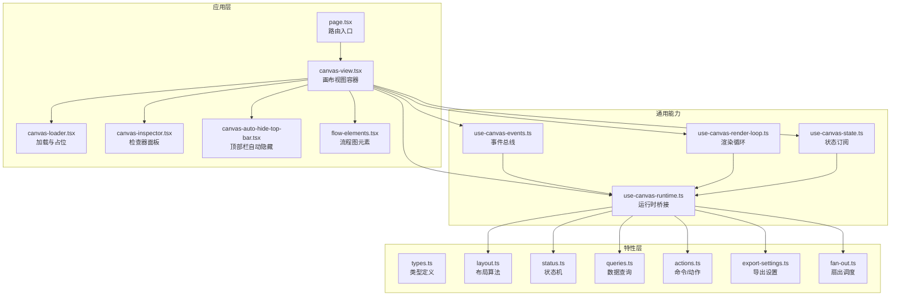

图表来源 
- [src/app/products/(app)/canvas/[projectId]/page.tsx](file://src/app/products/(app)/canvas/[projectId]/page.tsx)
- [src/app/products/(app)/canvas/[projectId]/canvas-view.tsx](file://src/app/products/(app)/canvas/[projectId]/canvas-view.tsx)
- [src/app/products/(app)/canvas/[projectId]/canvas-loader.tsx](file://src/app/products/(app)/canvas/[projectId]/canvas-loader.tsx)
- [src/app/products/(app)/canvas/[projectId]/canvas-inspector.tsx](file://src/app/products/(app)/canvas/[projectId]/canvas-inspector.tsx)
- [src/app/products/(app)/canvas/[projectId]/canvas-auto-hide-top-bar.tsx](file://src/app/products/(app)/canvas/[projectId]/canvas-auto-hide-top-bar.tsx)
- [src/app/products/(app)/canvas/[projectId]/flow-elements.tsx](file://src/app/products/(app)/canvas/[projectId]/flow-elements.tsx)
- [src/features/canvas/types.ts](file://src/features/canvas/types.ts)
- [src/features/canvas/layout.ts](file://src/features/canvas/layout.ts)
- [src/features/canvas/status.ts](file://src/features/canvas/status.ts)
- [src/features/canvas/queries.ts](file://src/features/canvas/queries.ts)
- [src/features/canvas/actions.ts](file://src/features/canvas/actions.ts)
- [src/features/canvas/export-settings.ts](file://src/features/canvas/export-settings.ts)
- [src/features/canvas/fan-out.ts](file://src/features/canvas/fan-out.ts)
- [src/lib/hooks/use-canvas-runtime.ts](file://src/lib/hooks/use-canvas-runtime.ts)
- [src/lib/hooks/use-canvas-events.ts](file://src/lib/hooks/use-canvas-events.ts)
- [src/lib/hooks/use-canvas-render-loop.ts](file://src/lib/hooks/use-canvas-render-loop.ts)
- [src/lib/hooks/use-canvas-state.ts](file://src/lib/hooks/use-canvas-state.ts)

章节来源
- [src/app/products/(app)/canvas/[projectId]/page.tsx](file://src/app/products/(app)/canvas/[projectId]/page.tsx)
- [src/app/products/(app)/canvas/[projectId]/canvas-view.tsx](file://src/app/products/(app)/canvas/[projectId]/canvas-view.tsx)
- [src/features/canvas/index.ts](file://src/features/canvas/index.ts)

## 核心组件
- 画布容器（Canvas View）：负责挂载画布 DOM、协调子面板（检查器、顶部栏）、注入运行时与事件总线，驱动渲染循环。
- 运行时（Runtime）：统一暴露查询、动作、配置与导出能力，作为特性层与 UI 层的桥梁。
- 事件总线（Events）：集中派发与订阅用户操作与系统事件，解耦 UI 与业务逻辑。
- 渲染循环（Render Loop）：基于帧率控制与脏区检测，按需重绘，保障流畅度。
- 状态管理（State）：以不可变快照或增量更新维护画布状态，提供订阅与撤销/重做基础。
- 布局引擎（Layout）：根据节点拓扑与约束计算位置与尺寸，支持自适应与响应式。
- 状态机（Status）：描述画布运行阶段（如空闲、计算中、错误），驱动 UI 反馈。
- 查询与动作（Queries & Actions）：声明式读取与变更数据，保证数据流单向与可追踪。
- 导出设置（Export Settings）：封装导出参数校验与默认值合并。
- 扇出调度（Fan-out）：将单一输入分发到多个并行任务，提升吞吐。

章节来源
- [src/app/products/(app)/canvas/[projectId]/canvas-view.tsx](file://src/app/products/(app)/canvas/[projectId]/canvas-view.tsx)
- [src/lib/hooks/use-canvas-runtime.ts](file://src/lib/hooks/use-canvas-runtime.ts)
- [src/lib/hooks/use-canvas-events.ts](file://src/lib/hooks/use-canvas-events.ts)
- [src/lib/hooks/use-canvas-render-loop.ts](file://src/lib/hooks/use-canvas-render-loop.ts)
- [src/lib/hooks/use-canvas-state.ts](file://src/lib/hooks/use-canvas-state.ts)
- [src/features/canvas/layout.ts](file://src/features/canvas/layout.ts)
- [src/features/canvas/status.ts](file://src/features/canvas/status.ts)
- [src/features/canvas/queries.ts](file://src/features/canvas/queries.ts)
- [src/features/canvas/actions.ts](file://src/features/canvas/actions.ts)
- [src/features/canvas/export-settings.ts](file://src/features/canvas/export-settings.ts)
- [src/features/canvas/fan-out.ts](file://src/features/canvas/fan-out.ts)

## 架构总览
画布编辑器采用“容器-运行时-特性层”的分层架构：
- 容器层：React 组件负责挂载与装配，不直接持有复杂状态。
- 运行时层：通过 Hooks 暴露统一 API，屏蔽底层细节。
- 特性层：纯函数与数据结构，确保可测试性与可移植性。

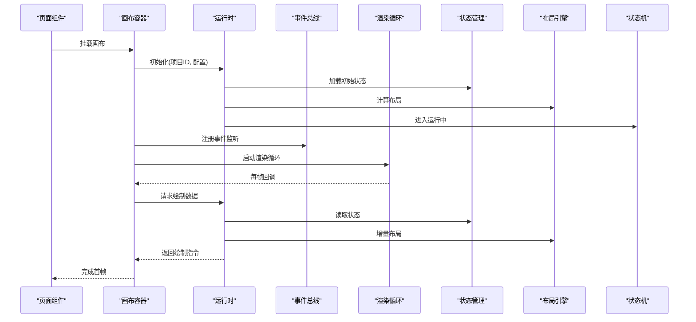

图表来源 
- [src/app/products/(app)/canvas/[projectId]/page.tsx](file://src/app/products/(app)/canvas/[projectId]/page.tsx)
- [src/app/products/(app)/canvas/[projectId]/canvas-view.tsx](file://src/app/products/(app)/canvas/[projectId]/canvas-view.tsx)
- [src/lib/hooks/use-canvas-runtime.ts](file://src/lib/hooks/use-canvas-runtime.ts)
- [src/lib/hooks/use-canvas-events.ts](file://src/lib/hooks/use-canvas-events.ts)
- [src/lib/hooks/use-canvas-render-loop.ts](file://src/lib/hooks/use-canvas-render-loop.ts)
- [src/lib/hooks/use-canvas-state.ts](file://src/lib/hooks/use-canvas-state.ts)
- [src/features/canvas/layout.ts](file://src/features/canvas/layout.ts)
- [src/features/canvas/status.ts](file://src/features/canvas/status.ts)

## 详细组件分析

### 画布容器（Canvas View）
- 职责：挂载画布 DOM、装配检查器与顶部栏、订阅运行时与事件、驱动渲染循环。
- 关键点：
  - 使用 ResizeObserver 感知容器尺寸变化，触发布局重算。
  - 将运行时实例、事件总线与渲染循环注入子组件。
  - 管理加载态与错误态的 UI 展示。

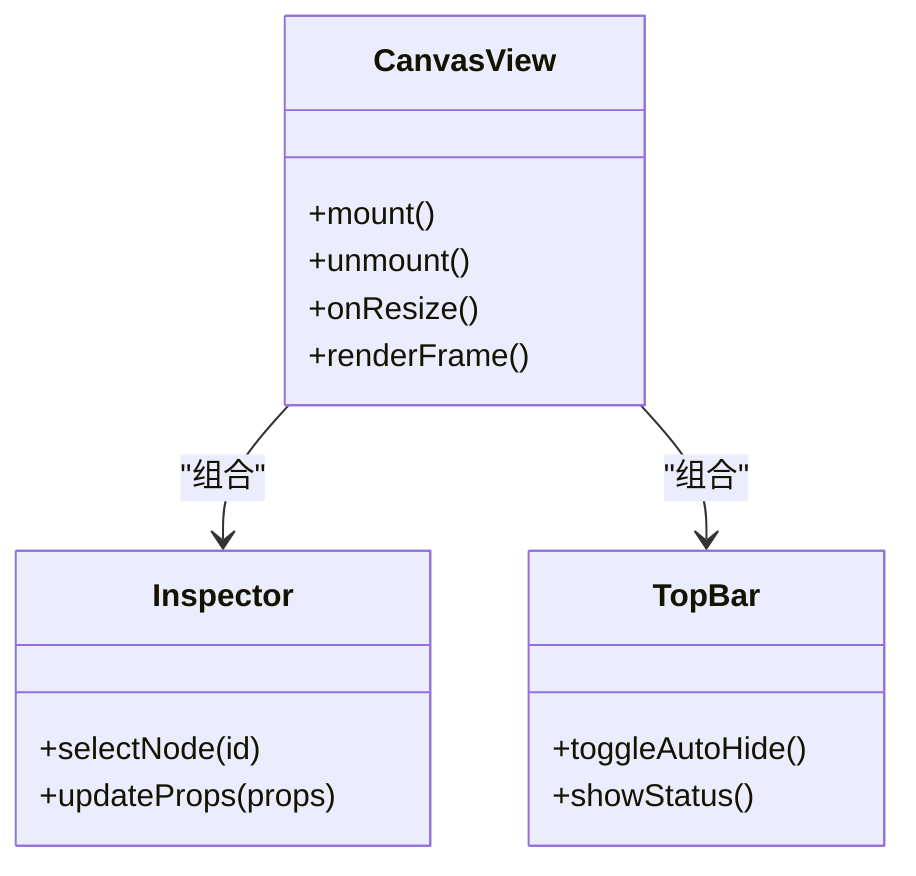

图表来源 
- [src/app/products/(app)/canvas/[projectId]/canvas-view.tsx](file://src/app/products/(app)/canvas/[projectId]/canvas-view.tsx)
- [src/app/products/(app)/canvas/[projectId]/canvas-inspector.tsx](file://src/app/products/(app)/canvas/[projectId]/canvas-inspector.tsx)
- [src/app/products/(app)/canvas/[projectId]/canvas-auto-hide-top-bar.tsx](file://src/app/products/(app)/canvas/[projectId]/canvas-auto-hide-top-bar.tsx)

章节来源
- [src/app/products/(app)/canvas/[projectId]/canvas-view.tsx](file://src/app/products/(app)/canvas/[projectId]/canvas-view.tsx)
- [src/app/products/(app)/canvas/[projectId]/canvas-inspector.tsx](file://src/app/products/(app)/canvas/[projectId]/canvas-inspector.tsx)
- [src/app/products/(app)/canvas/[projectId]/canvas-auto-hide-top-bar.tsx](file://src/app/products/(app)/canvas/[projectId]/canvas-auto-hide-top-bar.tsx)

### 运行时（Runtime）
- 职责：聚合查询、动作、导出设置与扇出调度，向 UI 暴露稳定接口。
- 关键点：
  - 初始化时加载项目元数据与画布状态。
  - 将布局与状态机作为内部依赖，对外仅暴露结果。
  - 提供事务化动作，支持撤销/重做。

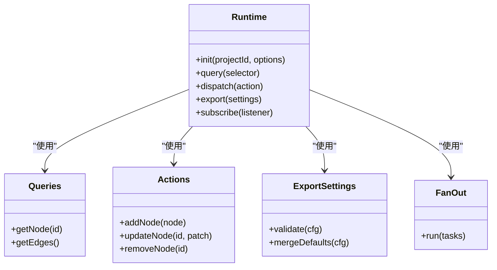

图表来源 
- [src/lib/hooks/use-canvas-runtime.ts](file://src/lib/hooks/use-canvas-runtime.ts)
- [src/features/canvas/queries.ts](file://src/features/canvas/queries.ts)
- [src/features/canvas/actions.ts](file://src/features/canvas/actions.ts)
- [src/features/canvas/export-settings.ts](file://src/features/canvas/export-settings.ts)
- [src/features/canvas/fan-out.ts](file://src/features/canvas/fan-out.ts)

章节来源
- [src/lib/hooks/use-canvas-runtime.ts](file://src/lib/hooks/use-canvas-runtime.ts)
- [src/features/canvas/queries.ts](file://src/features/canvas/queries.ts)
- [src/features/canvas/actions.ts](file://src/features/canvas/actions.ts)
- [src/features/canvas/export-settings.ts](file://src/features/canvas/export-settings.ts)
- [src/features/canvas/fan-out.ts](file://src/features/canvas/fan-out.ts)

### 事件总线（Events）
- 职责：集中管理事件注册、派发与生命周期，避免组件间紧耦合。
- 关键点：
  - 支持命名空间与优先级。
  - 提供一次性订阅与批量移除。
  - 与运行时联动，将用户操作转换为动作。

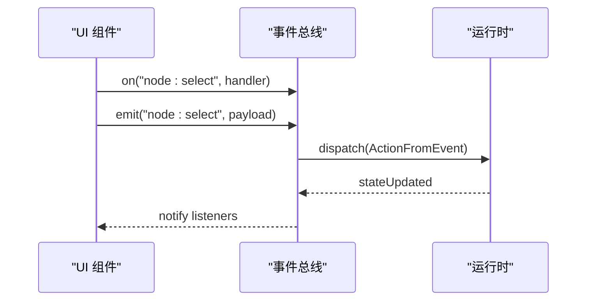

图表来源 
- [src/lib/hooks/use-canvas-events.ts](file://src/lib/hooks/use-canvas-events.ts)
- [src/lib/hooks/use-canvas-runtime.ts](file://src/lib/hooks/use-canvas-runtime.ts)

章节来源
- [src/lib/hooks/use-canvas-events.ts](file://src/lib/hooks/use-canvas-events.ts)
- [src/lib/hooks/use-canvas-runtime.ts](file://src/lib/hooks/use-canvas-runtime.ts)

### 渲染循环（Render Loop）
- 职责：按帧驱动绘制，结合脏区检测与节流，减少无效重绘。
- 关键点：
  - requestAnimationFrame 驱动主循环。
  - 记录 dirty regions，增量更新。
  - 暂停/恢复机制，配合窗口可见性与焦点切换。

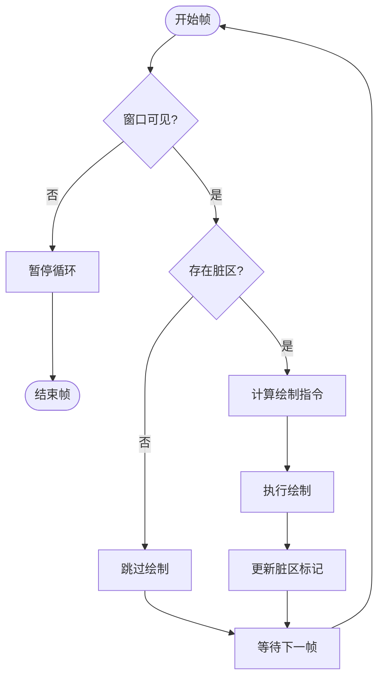

图表来源 
- [src/lib/hooks/use-canvas-render-loop.ts](file://src/lib/hooks/use-canvas-render-loop.ts)

章节来源
- [src/lib/hooks/use-canvas-render-loop.ts](file://src/lib/hooks/use-canvas-render-loop.ts)

### 状态管理（State）
- 职责：维护画布状态的不可变快照，提供订阅与差异对比。
- 关键点：
  - 以树形结构组织节点与边。
  - 支持时间旅行（撤销/重做）。
  - 与布局引擎协作，生成布局缓存。

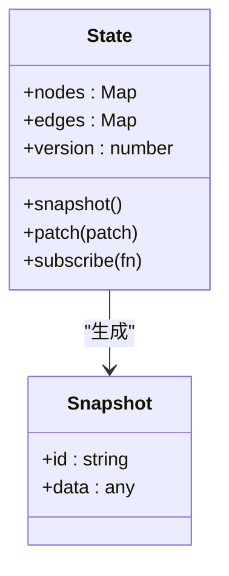

图表来源 
- [src/lib/hooks/use-canvas-state.ts](file://src/lib/hooks/use-canvas-state.ts)

章节来源
- [src/lib/hooks/use-canvas-state.ts](file://src/lib/hooks/use-canvas-state.ts)

### 布局引擎（Layout）
- 职责：根据拓扑与约束计算节点位置与尺寸，支持响应式与网格对齐。
- 关键点：
  - 分层布局（层级/网格/力导向可选）。
  - 增量更新，避免全量重排。
  - 输出绘制指令供渲染循环消费。

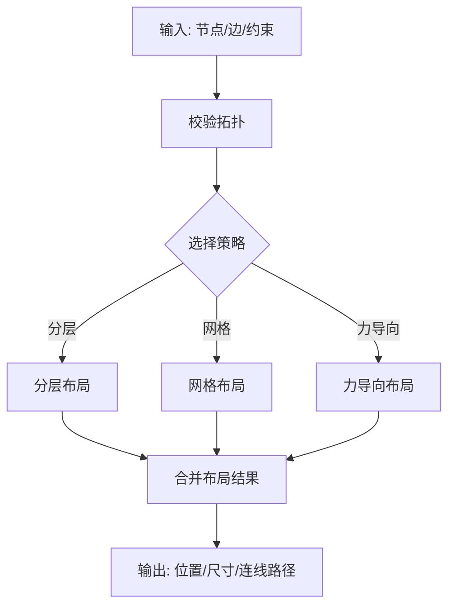

图表来源 
- [src/features/canvas/layout.ts](file://src/features/canvas/layout.ts)

章节来源
- [src/features/canvas/layout.ts](file://src/features/canvas/layout.ts)

### 状态机（Status）
- 职责：描述画布运行阶段，驱动 UI 反馈与行为限制。
- 关键点：
  - 状态包括空闲、计算中、错误、导出中等。
  - 事件驱动状态迁移，禁止非法转换。
  - 与渲染循环联动，控制绘制频率。

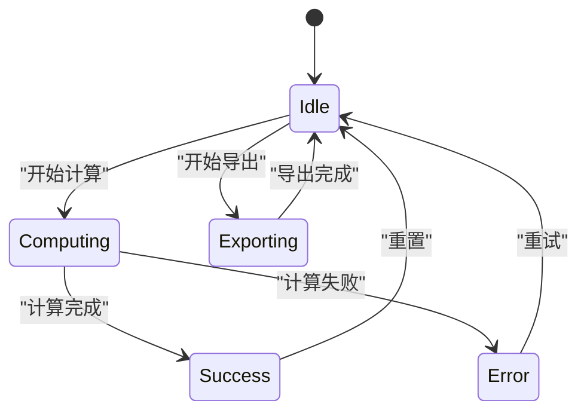

图表来源 
- [src/features/canvas/status.ts](file://src/features/canvas/status.ts)

章节来源
- [src/features/canvas/status.ts](file://src/features/canvas/status.ts)

### 查询与动作（Queries & Actions）
- 职责：声明式读取与变更数据，保证数据流单向与可追踪。
- 关键点：
  - 查询按选择器过滤，支持缓存。
  - 动作具备幂等性与副作用隔离。
  - 与状态机协同，确保一致性。

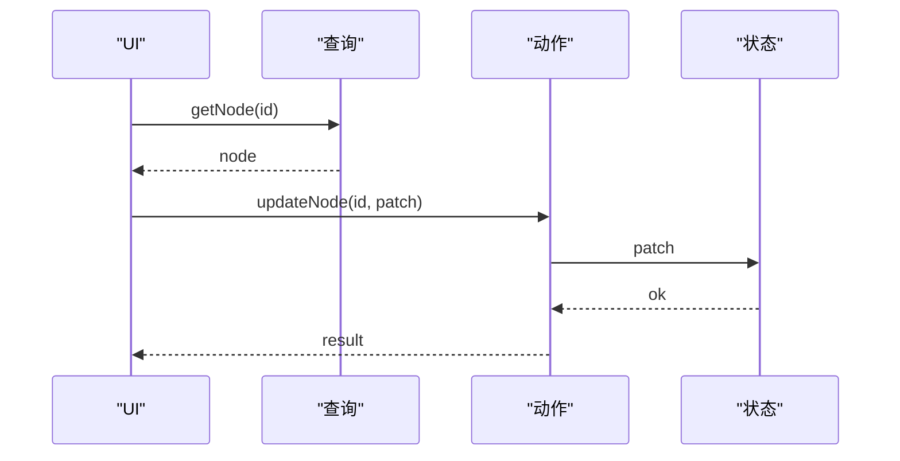

图表来源 
- [src/features/canvas/queries.ts](file://src/features/canvas/queries.ts)
- [src/features/canvas/actions.ts](file://src/features/canvas/actions.ts)

章节来源
- [src/features/canvas/queries.ts](file://src/features/canvas/queries.ts)
- [src/features/canvas/actions.ts](file://src/features/canvas/actions.ts)

### 导出设置（Export Settings）
- 职责：校验与合并导出参数，提供默认值与兼容性处理。
- 关键点：
  - 参数白名单与类型校验。
  - 与后端导出服务契约一致。
  - 支持预览与模拟导出。

章节来源
- [src/features/canvas/export-settings.ts](file://src/features/canvas/export-settings.ts)

### 扇出调度（Fan-out）
- 职责：将单一输入分发到多个并行任务，提升吞吐与容错。
- 关键点：
  - 任务队列与并发上限。
  - 失败重试与降级策略。
  - 结果聚合与顺序保证（可选）。

章节来源
- [src/features/canvas/fan-out.ts](file://src/features/canvas/fan-out.ts)

### 流程图元素（Flow Elements）
- 职责：渲染节点与连线，支持拖拽、缩放与选中态。
- 关键点：
  - 虚拟化大列表，按需渲染。
  - 手势与键盘快捷键支持。
  - 与事件总线联动，触发动作。

章节来源
- [src/app/products/(app)/canvas/[projectId]/flow-elements.tsx](file://src/app/products/(app)/canvas/[projectId]/flow-elements.tsx)

## 依赖关系分析
- 容器层依赖运行时与 UI 组件，运行时依赖特性层与通用 Hooks。
- 特性层之间保持低耦合，通过类型与接口契约通信。
- 通用 Hooks 被多处复用，避免重复实现。

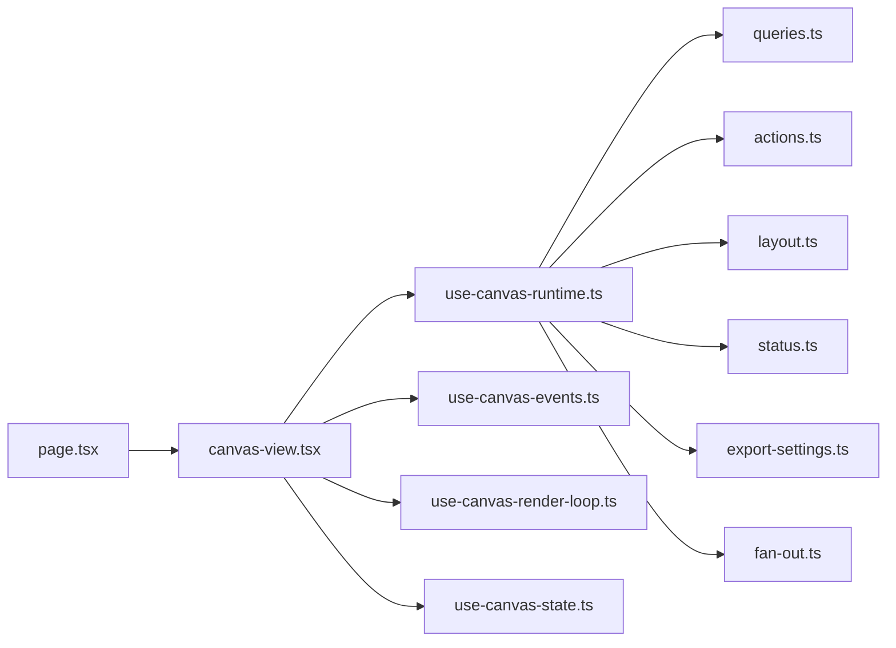

图表来源 
- [src/app/products/(app)/canvas/[projectId]/page.tsx](file://src/app/products/(app)/canvas/[projectId]/page.tsx)
- [src/app/products/(app)/canvas/[projectId]/canvas-view.tsx](file://src/app/products/(app)/canvas/[projectId]/canvas-view.tsx)
- [src/lib/hooks/use-canvas-runtime.ts](file://src/lib/hooks/use-canvas-runtime.ts)
- [src/lib/hooks/use-canvas-events.ts](file://src/lib/hooks/use-canvas-events.ts)
- [src/lib/hooks/use-canvas-render-loop.ts](file://src/lib/hooks/use-canvas-render-loop.ts)
- [src/lib/hooks/use-canvas-state.ts](file://src/lib/hooks/use-canvas-state.ts)
- [src/features/canvas/queries.ts](file://src/features/canvas/queries.ts)
- [src/features/canvas/actions.ts](file://src/features/canvas/actions.ts)
- [src/features/canvas/layout.ts](file://src/features/canvas/layout.ts)
- [src/features/canvas/status.ts](file://src/features/canvas/status.ts)
- [src/features/canvas/export-settings.ts](file://src/features/canvas/export-settings.ts)
- [src/features/canvas/fan-out.ts](file://src/features/canvas/fan-out.ts)

章节来源
- [src/app/products/(app)/canvas/[projectId]/page.tsx](file://src/app/products/(app)/canvas/[projectId]/page.tsx)
- [src/app/products/(app)/canvas/[projectId]/canvas-view.tsx](file://src/app/products/(app)/canvas/[projectId]/canvas-view.tsx)
- [src/lib/hooks/use-canvas-runtime.ts](file://src/lib/hooks/use-canvas-runtime.ts)
- [src/features/canvas/index.ts](file://src/features/canvas/index.ts)

## 性能考量
- 渲染循环：
  - 使用 requestAnimationFrame 与帧预算控制，避免主线程阻塞。
  - 脏区检测与增量更新，减少不必要的重绘。
  - 窗口不可见时暂停循环，降低能耗。
- 布局计算：
  - 分层与增量布局，避免全量重算。
  - 缓存布局结果，按版本失效。
- 数据访问：
  - 查询缓存与选择性订阅，减少状态同步开销。
  - 动作批处理与合并，降低状态更新频率。
- 内存管理：
  - 及时释放事件监听与定时器。
  - 大对象池化与懒加载。

[本节为通用指导，无需特定文件引用]

## 故障排查指南
- 初始化失败：
  - 检查项目 ID 与权限。
  - 确认运行时初始化参数与配置。
- 渲染卡顿：
  - 查看渲染循环是否被频繁打断。
  - 检查脏区范围是否过大。
- 状态不一致：
  - 核对动作幂等性与副作用隔离。
  - 检查状态机迁移是否合法。
- 事件丢失：
  - 确认事件总线订阅是否在正确时机注册。
  - 检查一次性订阅是否被误用。

章节来源
- [src/lib/hooks/use-canvas-runtime.ts](file://src/lib/hooks/use-canvas-runtime.ts)
- [src/lib/hooks/use-canvas-events.ts](file://src/lib/hooks/use-canvas-events.ts)
- [src/lib/hooks/use-canvas-render-loop.ts](file://src/lib/hooks/use-canvas-render-loop.ts)
- [src/lib/hooks/use-canvas-state.ts](file://src/lib/hooks/use-canvas-state.ts)
- [src/features/canvas/status.ts](file://src/features/canvas/status.ts)

## 结论
画布编辑器采用清晰的分层与模块化设计，通过运行时抽象与特性解耦，实现了高内聚、低耦合的架构。渲染循环、事件总线与状态管理共同保障了交互流畅与数据一致性。布局引擎与状态机提供了可扩展的业务能力。遵循本文档的扩展点与集成指南，可在不破坏既有契约的前提下快速增强功能。

[本节为总结，无需特定文件引用]

## 附录
- 初始化流程：
  - 页面挂载 → 容器创建 → 运行时初始化 → 状态加载 → 布局计算 → 渲染循环启动。
- 生命周期管理：
  - 挂载时注册事件与观察者，卸载时清理监听与定时器。
- 资源清理策略：
  - 显式释放内存与句柄，避免泄漏。
- 扩展点：
  - 新增布局策略：实现布局接口并注册到运行时。
  - 新增动作：定义动作类型与副作用，纳入状态机。
  - 自定义事件：在事件总线中定义命名空间与处理器。

[本节为补充信息，无需特定文件引用]